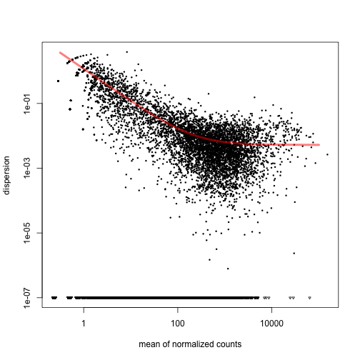
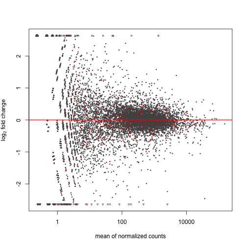
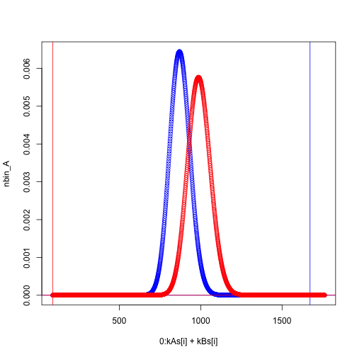

Title
========================================================

This is an R Markdown document. Markdown is a simple formatting syntax for authoring web pages (click the **Help** toolbar button for more details on using R Markdown).

When you click the **Knit HTML** button a web page will be generated that includes both content as well as the output of any embedded R code chunks within the document. You can embed an R code chunk like this:


```r
rm(list=ls())
source("http://bioconductor.org/biocLite.R")
```

```
## Bioconductor version 2.14 (BiocInstaller 1.14.2), ?biocLite for
##   help
```

```r
source("http://stevenbsmith.net/source/load_R_enviornment_vars.R")
#biocLite("DESeq2")
#biocLite("pasilla")
library("DESeq")
```

```
## Loading required package: BiocGenerics
## Loading required package: parallel
## 
## Attaching package: 'BiocGenerics'
## 
## The following objects are masked from 'package:parallel':
## 
##     clusterApply, clusterApplyLB, clusterCall, clusterEvalQ,
##     clusterExport, clusterMap, parApply, parCapply, parLapply,
##     parLapplyLB, parRapply, parSapply, parSapplyLB
## 
## The following object is masked from 'package:stats':
## 
##     xtabs
## 
## The following objects are masked from 'package:base':
## 
##     anyDuplicated, append, as.data.frame, as.vector, cbind,
##     colnames, do.call, duplicated, eval, evalq, Filter, Find, get,
##     intersect, is.unsorted, lapply, Map, mapply, match, mget,
##     order, paste, pmax, pmax.int, pmin, pmin.int, Position, rank,
##     rbind, Reduce, rep.int, rownames, sapply, setdiff, sort,
##     table, tapply, union, unique, unlist
## 
## Loading required package: Biobase
## Welcome to Bioconductor
## 
##     Vignettes contain introductory material; view with
##     'browseVignettes()'. To cite Bioconductor, see
##     'citation("Biobase")', and for packages 'citation("pkgname")'.
## 
## Loading required package: locfit
## locfit 1.5-9.1 	 2013-03-22
## Loading required package: lattice
##     Welcome to 'DESeq'. For improved performance, usability and
##     functionality, please consider migrating to 'DESeq2'.
```

```r
#library("DESeq2")
library("knitr")
datafile =system.file( "extdata/pasilla_gene_counts.tsv", package="pasilla" )
#datafile
pasillaCountTable = read.table( datafile, header=TRUE, row.names=1 )


pasillaDesign = data.frame(
  row.names = colnames( pasillaCountTable ),
  condition = c( "untreated", "untreated", "untreated",
                 "untreated", "treated", "treated", "treated" ),
  libType = c( "single-end", "single-end", "paired-end",
               "paired-end", "single-end", "paired-end", "paired-end" ) )
pasillaDesign
```

```
##            condition    libType
## untreated1 untreated single-end
## untreated2 untreated single-end
## untreated3 untreated paired-end
## untreated4 untreated paired-end
## treated1     treated single-end
## treated2     treated paired-end
## treated3     treated paired-end
```

```r
pairedSamples = pasillaDesign$libType == "paired-end"
countTable = pasillaCountTable[ , pairedSamples ]
condition = pasillaDesign$condition[ pairedSamples ]

head(countTable)
```

```
##             untreated3 untreated4 treated2 treated3
## FBgn0000003          0          0        0        1
## FBgn0000008         76         70       88       70
## FBgn0000014          0          0        0        0
## FBgn0000015          1          2        0        0
## FBgn0000017       3564       3150     3072     3334
## FBgn0000018        245        310      299      308
```

```r
cds = newCountDataSet( countTable, condition )
cds = estimateSizeFactors( cds )
sizeFactors( cds )
```

```
## untreated3 untreated4   treated2   treated3 
##     0.8731     1.0106     1.0225     1.1146
```

```r
head( counts( cds, normalized=TRUE ) )
```

```
##             untreated3 untreated4 treated2  treated3
## FBgn0000003      0.000      0.000     0.00    0.8972
## FBgn0000008     87.046     69.265    86.07   62.8034
## FBgn0000014      0.000      0.000     0.00    0.0000
## FBgn0000015      1.145      1.979     0.00    0.0000
## FBgn0000017   4082.022   3116.926  3004.54 2991.2377
## FBgn0000018    280.610    306.745   292.43  276.3351
```

```r
head( counts( cds, normalized=FALSE ) )
```

```
##             untreated3 untreated4 treated2 treated3
## FBgn0000003          0          0        0        1
## FBgn0000008         76         70       88       70
## FBgn0000014          0          0        0        0
## FBgn0000015          1          2        0        0
## FBgn0000017       3564       3150     3072     3334
## FBgn0000018        245        310      299      308
```

```r
cds = estimateDispersions( cds )
str( fitInfo(cds) )
```

```
## List of 5
##  $ perGeneDispEsts: num [1:14599] -0.4696 0.0237 NaN -0.9987 0.0211 ...
##  $ dispFunc       :function (q)  
##   ..- attr(*, "coefficients")= Named num [1:2] 0.00524 1.16816
##   .. ..- attr(*, "names")= chr [1:2] "asymptDisp" "extraPois"
##   ..- attr(*, "fitType")= chr "parametric"
##  $ fittedDispEsts : num [1:14599] 5.21332 0.02055 Inf 1.5008 0.00559 ...
##  $ df             : int 2
##  $ sharingMode    : chr "maximum"
```

```r
DESeq::plotDispEsts( cds )
```

 

```r
head(fitInfo(cds))
```

```
## $perGeneDispEsts
##     [1] -4.696e-01  2.368e-02        NaN -9.987e-01  2.110e-02 -6.489e-04
##     [7]        NaN -1.525e-01 -2.131e+00 -6.325e-04 -4.696e-01 -2.691e-02
##    [13]        NaN -2.131e+00 -1.309e-05 -2.658e-05  9.040e-02  2.016e-02
##    [19]  2.225e-01  6.014e-02  3.229e-04  3.921e-04 -1.051e-03        NaN
##    [25]        NaN -1.258e-03 -2.982e-01 -2.117e-03  7.979e-04 -3.771e-04
##    [31] -6.416e-01  1.120e-02 -1.432e-02  5.158e-03  1.702e-03 -5.723e-04
##    [37] -8.879e-02  1.999e-01  1.182e-02  2.089e-01  3.790e-03 -4.735e-03
##    [43]  2.750e-02  1.432e-01  2.352e-03  1.280e-02 -9.612e-05 -1.631e-03
##    [49]        NaN -9.657e-02        NaN  6.577e-03  1.392e-02  7.805e-03
##    [55]  6.221e-04  7.958e-03  4.738e-03 -1.028e-03  4.315e-02        NaN
##    [61] -1.667e-01  1.834e-02  1.489e-01  1.730e-02  1.079e-02  7.334e-01
##    [67] -8.717e-03  2.828e-03 -1.112e-01 -4.587e-04        NaN  2.164e-02
##    [73]  2.256e-03 -5.263e-02  2.466e-03        NaN  4.034e-04 -1.981e-04
##    [79] -4.264e-02  1.211e-03  5.049e-01  3.594e-04  2.696e-02  8.123e-03
##    [85]  8.002e-03 -9.158e-05 -4.312e-01  2.170e-04  5.669e-03 -1.151e-03
##    [91]  1.677e-03  3.842e-04  6.151e-03  1.427e-02        NaN -1.383e-02
##    [97] -2.958e-02 -2.887e-02 -1.977e-03  1.239e-01  1.239e-01  1.953e-03
##   [103]  8.219e-03  7.267e-01  2.556e-03  1.301e-02 -2.756e-01  1.317e-02
##   [109]  2.362e-03 -2.259e-02  8.540e-01  6.396e-03  1.849e-02  2.671e-03
##   [115] -5.992e-02  1.000e-03 -4.922e-03 -4.764e-02  1.421e-02  1.836e-03
##   [121]  7.858e-04 -2.669e-02  5.933e-03        NaN        NaN -2.641e-01
##   [127]        NaN  4.988e-01  8.731e-01 -4.791e-02  1.556e-03  2.966e-03
##   [133]  5.672e-04  6.413e-03 -4.631e-05  3.161e-03  8.120e-04  3.303e-02
##   [139]  3.236e-04  4.354e-03  4.923e-02  7.120e-03        NaN  1.499e-03
##   [145]  1.270e-02  2.899e-03 -5.549e-07  1.315e-02  1.693e-02 -5.263e-02
##   [151]        NaN  2.804e-01  2.310e-03 -1.226e-01        NaN -4.696e-01
##   [157] -1.901e-04 -2.016e-03  2.840e-01 -3.394e-01  1.356e-02  1.358e-02
##   [163] -5.677e-02 -5.079e-01 -1.295e-03 -6.695e-04 -8.753e-03 -4.961e-04
##   [169] -5.263e-02  2.249e+00  5.312e-03 -1.238e-01  8.007e-01 -1.396e-03
##   [175]  6.446e-03  1.396e-02 -4.696e-01  1.164e-02  3.818e-02 -7.893e-04
##   [181]  2.366e-02 -2.062e-03  4.368e-03  2.231e-02  2.105e-02  3.478e-01
##   [187]        NaN  2.640e-03 -9.049e-04  1.437e-03 -4.696e-01  8.723e-03
##   [193]        NaN  4.570e-03  2.067e-02  2.197e-02  3.044e-02  1.622e-02
##   [199]        NaN -5.263e-02  1.672e-02  1.806e-04  1.723e-02  8.915e-03
##   [205]        NaN  3.302e-01 -3.507e-02  8.437e-01  9.729e-04  6.897e-03
##   [211] -1.686e-04  4.480e-02 -4.696e-01  8.203e-04 -4.076e-02 -7.789e-03
##   [217]  1.527e-03  9.699e-03 -2.553e-02  8.887e-01  1.765e+00  4.044e-02
##   [223] -2.754e-01 -6.670e-01  4.131e-03 -3.140e-04  6.035e-03 -1.061e-03
##   [229]        NaN  1.485e-02  2.417e-03  3.015e-03  1.295e-03  3.518e-03
##   [235] -7.160e-03 -5.232e-03  4.886e-04 -5.263e-02  1.012e-02 -6.774e-04
##   [241]  4.064e-03        NaN  1.750e-02 -2.628e-03 -1.803e-03 -4.610e-03
##   [247]  1.476e-01  3.341e-04 -2.098e-04 -1.989e-03  2.768e-02 -1.824e-04
##   [253]  2.511e-03 -2.246e-03        NaN  1.639e-03 -1.244e-04  1.543e-03
##   [259]  4.988e-01  2.352e-06 -7.024e-01  4.366e-03  1.902e-03 -9.408e-04
##   [265] -1.927e-04  8.776e-05  2.651e-03  2.086e-02  4.373e-03        NaN
##   [271]  1.486e-03 -2.340e-04 -1.448e-03        NaN        NaN  5.748e-03
##   [277] -1.888e-02  2.701e-03  1.051e-02 -1.437e-02  1.974e+00 -1.370e-03
##   [283] -2.450e-01  4.619e-03  5.074e-04  2.200e-01  2.599e-04  9.591e-04
##   [289]  2.785e-03  8.917e-03  9.056e-04 -1.253e-03 -1.001e-01  4.281e-03
##   [295]  1.083e-02 -2.299e-01  3.456e-03  4.410e-03  9.797e-04  5.266e-04
##   [301]        NaN  2.136e-02  1.074e-02  7.056e-03 -2.617e-02        NaN
##   [307]  6.566e-02 -3.473e-03  2.221e-03  4.769e-02  1.239e-01 -9.648e-04
##   [313]  1.307e-03 -2.290e-02 -1.250e-01  8.540e-01  2.362e-01 -5.931e-01
##   [319]  2.150e-03  4.229e-04 -5.780e-03 -1.952e-02        NaN  2.631e-02
##   [325]  7.118e-03        NaN        NaN  4.459e-04 -3.547e-03  9.869e-03
##   [331]  2.258e-03  3.568e-03 -4.753e-02        NaN        NaN        NaN
##   [337]  5.543e-03 -7.024e-01        NaN  2.473e-01        NaN  3.358e-03
##   [343] -2.131e+00  2.723e-04  8.214e-04  3.143e-03  5.930e-03  6.799e-03
##   [349]  3.673e-03        NaN  4.076e-03 -1.378e-03  9.298e-03  8.085e-04
##   [355]  4.772e-03  2.902e-04  3.030e-03 -7.175e-02 -1.936e-03  3.098e-03
##   [361]  3.112e-03  7.092e-04 -8.545e-01        NaN  3.938e-04  1.718e-03
##   [367]  3.580e-03 -1.206e-03 -3.380e-01 -1.029e-02  9.809e-03  1.572e-04
##   [373] -2.293e-03  3.744e-03 -1.019e-01  1.267e-03  1.016e-02  3.659e-03
##   [379]  1.520e-03  3.192e-02  1.625e-04  1.736e-04 -1.374e-03  5.832e-04
##   [385]  7.030e-01  4.889e-02  9.048e-04  1.382e-02 -3.621e-02 -3.234e-04
##   [391]  4.029e-03  1.463e-02 -1.857e+00  1.369e-03  4.019e-03  9.093e-03
##   [397]  2.537e-03  2.355e-03  2.457e-01        NaN  7.334e-01 -1.001e-01
##   [403]  4.805e-04  1.466e-02 -8.104e-04        NaN        NaN -1.919e-01
##   [409]  1.198e-01 -5.234e-01  2.138e-02 -2.144e-02 -1.219e-01 -1.267e-01
##   [415] -3.982e-01        NaN  3.120e-02 -4.103e-03 -4.122e-01  8.436e-03
##   [421]  9.628e-03 -1.819e-03  7.430e-03  8.598e-03 -1.072e-03  1.027e-02
##   [427]  1.684e-02        NaN -1.001e-01        NaN        NaN -1.410e-04
##   [433] -5.733e-04  2.254e-02  1.592e-02  3.066e-03  5.794e-03 -3.690e-03
##   [439] -4.226e-01  1.281e-02 -1.278e-02  1.916e-04  6.208e-03 -3.640e-01
##   [445] -3.312e-03  2.672e-01 -1.975e-01  3.804e-03  6.075e-01  9.352e-02
##   [451] -1.039e-03  4.359e-03 -1.037e-03 -9.285e-05 -1.763e-04  2.373e-03
##   [457] -4.503e-04        NaN -1.350e-03 -5.992e-02  4.717e-02        NaN
##   [463]        NaN        NaN -1.001e-01 -1.207e-01  1.680e-02        NaN
##   [469]  5.270e-03  2.085e-02  6.468e-03        NaN  2.198e-03  9.034e-03
##   [475]  1.934e-03  2.764e-03 -2.113e-03        NaN -3.329e-04  3.982e-02
##   [481]  6.025e-04 -3.157e-02 -9.890e-05  5.116e-02 -1.513e-01 -6.939e-03
##   [487] -1.814e-03        NaN -1.551e-01        NaN  8.540e-01 -1.815e-01
##   [493] -5.220e-01  6.756e-01  6.289e-02  7.600e-03 -6.320e-02  2.117e-04
##   [499] -1.822e-03  4.292e-01 -2.129e-03 -3.805e-02  7.781e-03  8.887e-01
##   [505]  8.112e-02  2.693e-02 -3.281e-02 -7.396e-04 -4.054e-04  1.622e-02
##   [511]  6.076e-01  8.975e-05        NaN -3.997e-04  3.616e-02  3.733e-03
##   [517] -1.477e-01  2.147e-02  3.174e-03        NaN        NaN  4.825e-03
##   [523] -9.923e-01  1.415e-03 -2.806e-03  5.404e-03  1.244e-03  2.136e-03
##   [529] -4.539e-04 -2.428e-04        NaN  1.122e-02  8.792e-03  3.156e-01
##   [535] -2.091e-02  3.123e-04 -8.833e-01 -7.810e-03  3.511e-03  7.020e-03
##   [541] -4.308e-04 -6.898e-01        NaN -4.696e-01 -7.898e-04  7.242e-03
##   [547]  2.229e-03  3.671e-03        NaN  1.378e-02 -4.696e-01 -2.294e-02
##   [553]  6.080e-03 -1.426e-02  1.421e-02  6.983e-04 -2.439e-01  9.180e-03
##   [559]  1.721e-02 -1.971e-04 -9.719e-03  5.379e-03  1.821e-03 -2.725e-04
##   [565] -4.805e-04  1.189e-03 -1.160e-03 -1.378e-04  4.154e-03 -2.643e-03
##   [571]  7.333e-04 -8.581e-02  1.765e+00 -1.001e-01  1.590e-02  1.331e-01
##   [577]  6.528e-03  1.087e-03  8.532e-01  3.625e-03        NaN  1.058e-02
##   [583]  1.171e-02  3.859e-03  5.088e-03 -2.138e-03  1.969e-03 -3.221e-02
##   [589]  4.218e-01  3.125e+00  2.649e+00  1.740e-02  1.983e-02 -5.284e-03
##   [595]  1.100e-02 -8.581e-02        NaN  9.855e-04  6.908e-02  2.404e-03
##   [601] -3.106e-01  1.604e-03  2.665e-03  5.690e-03        NaN  1.593e-03
##   [607]  3.176e-03  2.097e-03        NaN -4.696e-01  1.469e+00  7.542e-03
##   [613] -3.142e-02  1.352e-02 -4.844e-02  2.249e+00        NaN        NaN
##   [619]  1.239e-01 -2.131e+00 -1.207e-01 -5.421e-01  5.779e-02 -6.545e-02
##   [625]  9.076e-02 -4.093e-03  2.439e-04 -7.828e-06  2.457e-02  4.015e-03
##   [631]  5.046e-03 -6.009e-01  2.848e-02  5.193e-03 -1.709e-03  1.072e-02
##   [637] -5.931e-01  4.988e-01  1.733e-02 -5.752e-04 -1.726e-02 -2.131e+00
##   [643]  2.445e-03  9.810e-01  1.582e-03  1.974e+00  6.188e-03  9.920e-04
##   [649]  1.921e-03  1.509e-02  2.473e-04  6.031e-03 -4.401e-02  1.708e-03
##   [655]        NaN  3.917e-04 -1.670e-02  1.215e-02 -8.833e-04  6.298e-03
##   [661] -6.942e-03  9.968e-04  7.068e-04 -2.756e-01  1.201e-03 -3.112e-01
##   [667]  6.254e-03  9.518e-03 -9.267e-05 -3.320e-02 -1.924e-03  5.147e-03
##   [673] -5.335e-04  2.251e-03 -6.187e-05  1.348e-03 -3.438e-04 -2.704e-04
##   [679]  4.677e-03 -5.263e-02 -1.739e-03 -8.135e-03  2.282e-03  2.150e-02
##   [685]  8.615e-03  1.773e-03        NaN -1.005e-04  1.576e-03  8.077e-02
##   [691] -4.863e-03        NaN  1.103e-03  7.636e-03  1.832e-01 -9.618e-01
##   [697]  2.046e-03 -8.054e-03  3.014e-03 -1.103e-02  5.833e-03 -3.022e-03
##   [703] -1.118e-03  3.529e-01 -3.557e-04 -3.989e-01  1.738e-02 -1.001e-01
##   [709]  3.277e-02 -4.696e-01 -6.262e-01  3.002e-03  2.944e-01  5.387e-03
##   [715] -1.015e-03  2.565e-04  3.041e-03  4.201e-03  1.435e-04  2.552e-04
##   [721]  1.094e-01  2.343e-03  1.367e-02  1.176e-02 -1.001e-01        NaN
##   [727]        NaN        NaN  1.063e+00  2.649e+00 -5.268e-02 -1.801e-01
##   [733]  4.988e-01  4.988e-01        NaN        NaN        NaN  2.249e+00
##   [739]  2.025e-02  3.456e-02  1.193e-02        NaN -1.174e-03 -1.823e-01
##   [745]  3.653e-03 -4.320e-04 -5.263e-02  2.782e-04  5.081e-02 -3.674e-01
##   [751]  4.550e-03  3.570e-03  1.917e+00 -1.001e-01 -3.394e-01  3.656e-02
##   [757] -8.833e-01  3.450e-02  3.206e-02  7.267e-01  9.421e-01 -9.286e-02
##   [763]  1.680e-02 -6.009e-01 -1.892e-02  1.656e-02  1.963e-03  1.044e+00
##   [769]        NaN        NaN -7.301e-04  3.861e-04  1.659e-03  2.760e-02
##   [775]  1.356e-02  1.239e-01  1.331e-03 -6.313e-04 -3.674e-03 -1.502e-03
##   [781] -2.522e-02  8.731e-01 -5.507e-02  5.045e-03  3.530e-03        NaN
##   [787]  4.237e-04  2.276e-02  6.756e-01 -7.439e-04        NaN -3.805e-02
##   [793]        NaN        NaN        NaN        NaN  2.373e-03  5.483e-04
##   [799]        NaN -1.100e+00        NaN        NaN  4.988e-01  3.548e-02
##   [805]        NaN -3.805e-02  4.988e-01        NaN  1.517e-03  1.648e-02
##   [811]  3.567e-04 -5.931e-01  9.958e-03  1.974e+00  6.620e-01  6.624e-02
##   [817] -6.705e-03  3.914e-02  1.006e-03  5.592e-03  1.369e-03        NaN
##   [823] -1.320e-03  1.008e-03  7.580e-03  9.587e-03 -4.696e-01  1.256e-02
##   [829] -1.074e-03  7.020e-01 -3.039e-04 -1.447e-03 -8.918e-04  7.716e-04
##   [835]  4.820e-03        NaN  7.812e-03  3.147e-04 -7.496e-01  4.315e-03
##   [841]  9.684e-03  1.069e-02  1.886e-02 -5.249e-03  5.230e-03  1.525e-02
##   [847]  1.136e-02  4.970e-05        NaN  1.475e-02 -1.207e-01 -4.155e-04
##   [853] -5.263e-02        NaN        NaN -1.001e-01        NaN        NaN
##   [859] -1.316e-01  8.436e-03  5.228e-03 -4.710e-04  1.764e-02  9.997e-04
##   [865]  2.958e-03 -1.743e-03 -1.377e-03 -5.268e-04  2.401e-03 -1.635e-03
##   [871] -7.910e-02 -4.052e-04 -6.898e-01  1.415e+00 -5.234e-01  1.321e-03
##   [877] -1.522e-01 -5.263e-02  1.358e-03 -3.873e-01  1.812e-03        NaN
##   [883] -1.367e-01 -3.247e-04 -4.696e-01 -4.341e-01  1.765e+00 -1.342e-01
##   [889] -5.595e-02  8.596e-03 -3.517e-04  2.920e-03  4.988e-01        NaN
##   [895]        NaN        NaN        NaN        NaN        NaN  1.343e-02
##   [901]  2.132e-03  3.457e-03  4.748e-03  2.450e-02 -7.732e-02  8.284e-03
##   [907] -9.194e-01 -3.572e-01        NaN  1.974e+00 -1.460e-01  4.920e-03
##   [913]  7.717e-03  2.236e-02  4.007e-02  3.717e-04  2.096e-03 -5.954e-04
##   [919] -1.975e-01 -9.693e-03  3.917e-03  1.698e-03  7.382e-01 -4.126e-03
##   [925]  3.025e-02 -5.560e-04  1.726e-02  2.843e-02  3.003e-03 -1.001e-01
##   [931] -5.110e-04 -1.160e-04        NaN        NaN        NaN        NaN
##   [937]        NaN        NaN        NaN        NaN -3.379e-02  7.063e-03
##   [943] -3.635e-04  3.085e-03 -3.033e-03  1.446e-02 -4.021e-03  1.112e-02
##   [949]  2.262e-01 -4.696e-01        NaN  7.172e-03  2.249e+00  4.870e-03
##   [955] -2.444e-05  7.098e-03 -1.212e-03  3.050e-03  2.960e-02        NaN
##   [961] -8.545e-01  2.638e-03 -2.126e-02  1.271e-02  1.124e-03  1.467e-02
##   [967]  1.236e-02  5.565e-03  2.156e-02  1.923e-02 -2.726e-01 -8.545e-01
##   [973]  1.536e-02 -1.667e-01  2.143e-03  9.786e-04        NaN  7.126e-03
##   [979] -4.696e-01  2.431e-02        NaN        NaN  5.181e-03  2.851e-03
##   [985]  2.894e-03 -7.855e-03 -1.801e-01        NaN  2.936e-03  7.517e-03
##   [991]  1.855e-02  2.995e-02  4.156e-03  1.742e-02  8.064e-04  3.580e-03
##   [997]  5.968e-03 -5.263e-02 -2.962e-03 -5.958e-01  1.040e-02 -4.958e-04
##  [1003] -4.221e-04  2.566e-03  9.306e-03 -1.001e-01  7.431e-01  5.585e-03
##  [1009]  3.308e-03  2.572e-03  4.988e-01  1.689e-02  6.716e-03 -3.524e-02
##  [1015] -6.056e-02  9.878e-04 -7.522e-02  5.299e-03 -2.742e-01 -5.263e-02
##  [1021]  2.606e-02  1.492e-02  9.192e-03  9.500e-04  3.668e-01  3.556e-03
##  [1027] -3.134e-04  2.163e-03 -2.328e-02  2.249e-02 -1.050e-01 -4.560e-03
##  [1033]  7.443e-03  1.388e-02  1.140e-02 -1.857e+00  4.572e-03  2.744e-02
##  [1039]  1.461e-01  7.180e-03  3.684e-04 -9.572e-04  5.104e-03        NaN
##  [1045]  2.553e-03  1.950e+00 -2.131e+00 -5.287e-03  4.988e-01 -2.126e-03
##  [1051] -6.102e-03  7.224e-04  4.941e-05  5.420e-03  2.778e-02 -2.403e-03
##  [1057]  5.800e-03 -3.786e-03  3.162e-03  3.502e-02 -9.194e-01 -3.448e-04
##  [1063]        NaN        NaN -1.958e-05        NaN -1.857e+00 -3.442e-03
##  [1069]        NaN  2.106e-02 -8.806e-02  7.789e-02 -1.001e-01 -9.785e-03
##  [1075]  3.254e-02  4.712e-02  1.820e-02  2.567e-01  2.139e-03 -3.349e-01
##  [1081]  1.074e-02 -5.478e-02  3.499e-02  7.143e-03  1.708e-02  3.237e-02
##  [1087]  1.039e-03  2.433e-01  1.168e+00  1.276e-02  3.089e-02 -2.231e-01
##  [1093] -3.740e-04 -7.335e-04        NaN  1.573e-02  4.955e-03  1.263e-02
##  [1099]  1.096e-02  1.239e-01 -5.809e-04  1.416e-03 -2.288e-02  2.378e-03
##  [1105]  8.258e-03  5.448e-03 -4.011e-04  2.395e-03  2.142e-02  2.493e-01
##  [1111]  2.185e-03  4.049e-04 -4.303e-02 -5.122e-02  1.628e-02 -3.403e-03
##  [1117]  5.744e-04  3.801e-03  3.661e-04  1.376e-02  1.248e-02  3.541e-03
##  [1123]        NaN        NaN        NaN  1.492e-02  4.146e-03 -3.201e-03
##  [1129]  8.138e-02  3.145e-03 -7.317e-04  1.620e-02  7.886e-02 -5.263e-02
##  [1135]  6.060e-03  4.110e-03  7.169e-04  6.853e-03  5.668e-03  6.755e-04
##  [1141]  7.829e-04  2.219e-03  1.541e-02  1.440e-03  2.209e-04  1.028e-03
##  [1147] -1.306e-03        NaN -5.263e-02        NaN  5.137e-03  1.301e-03
##  [1153] -1.331e-01  1.331e-02 -1.536e-02 -3.546e-01  4.582e-01  2.576e-02
##  [1159] -2.604e-02 -3.755e-04  1.275e-03  1.773e-02  2.582e-03  9.888e-02
##  [1165]        NaN  1.239e-01  4.319e-03 -9.220e-03  2.730e-02  2.642e-02
##  [1171]  3.510e-02  1.964e-02  1.513e-02 -7.496e-01  7.762e-03 -7.027e-04
##  [1177] -1.596e-03  8.904e-03  1.474e-03 -5.263e-02 -1.001e-01        NaN
##  [1183]  3.215e-04  1.083e-02        NaN  3.103e-03  6.549e-03  8.295e-03
##  [1189]  1.675e-04 -3.805e-02  7.266e-03  7.868e-04 -2.261e-02  1.334e-01
##  [1195]  7.611e-03 -7.485e-03  5.903e-03  1.595e-03  3.153e-03  3.533e-02
##  [1201]  2.337e-02  7.690e-04 -2.922e-03  2.556e-03  1.425e-02  2.473e-03
##  [1207]  7.090e-03  1.283e-05  3.017e-03  6.813e-03  1.889e-03  8.983e-04
##  [1213]  1.491e-02 -2.086e-02  3.801e-03 -3.030e-03  4.792e-03 -1.181e-03
##  [1219]  5.460e-03  3.661e-03  4.386e-03  4.051e-03  2.689e-03  4.621e-03
##  [1225]  2.149e-02  8.556e-04 -2.399e-03 -7.806e-04  6.324e-03  4.364e-04
##  [1231]  6.224e-04 -3.753e-04 -1.185e-03  4.189e-02  4.389e-03  2.793e-03
##  [1237] -7.255e-03  2.073e-02  9.481e-03  1.615e-03  2.826e-03 -9.439e-04
##  [1243]  4.610e-03 -4.627e-04 -4.541e-03  9.424e-03  9.878e-04  1.034e-03
##  [1249] -8.398e-05  1.219e-03  5.716e-03  2.211e-03  1.115e-02  2.006e-02
##  [1255]  9.930e-04  8.806e-03        NaN -3.449e-03        NaN  3.636e-03
##  [1261] -5.632e-03        NaN  4.035e-03        NaN  4.297e-04  2.726e-01
##  [1267]  8.540e-01        NaN        NaN  1.573e-02 -1.001e-01        NaN
##  [1273]  1.075e-01  1.334e-02  1.499e-02  2.381e-02 -5.301e-02 -5.714e-04
##  [1279]  2.620e-04 -3.576e-03 -1.100e+00        NaN -7.024e-01  2.469e-03
##  [1285] -1.115e-03  4.969e-03  1.492e-03 -3.374e-03  2.967e-04  8.738e-03
##  [1291]  7.847e-04  6.341e-03  3.062e-03  3.833e-02  3.202e-03        NaN
##  [1297]        NaN        NaN  2.510e+00  4.101e-03        NaN  8.376e-04
##  [1303]  1.223e-02  1.308e-02  4.397e-03  9.277e-03 -4.696e-01 -5.263e-02
##  [1309]  7.158e-03  6.031e-03 -6.868e-02 -1.723e-02  1.093e-03 -1.962e-02
##  [1315]  4.260e-01 -1.732e-04  1.809e-03  1.562e-03  1.431e-03  3.697e-02
##  [1321]  5.259e-03  4.076e-01  7.487e-03  9.467e-04  1.827e-03  4.236e-03
##  [1327]  2.313e-04  2.496e-02 -4.696e-01        NaN        NaN -4.792e-04
##  [1333] -3.917e-03  9.926e-03 -2.316e-04  8.540e-01        NaN  2.670e-01
##  [1339]  7.267e-01 -1.517e-04  5.175e-03  6.831e-04  1.696e-03  2.590e-03
##  [1345] -1.799e-04  3.875e-04  2.301e-03        NaN -8.866e-04  5.528e-04
##  [1351]  2.356e-04  8.309e-03  4.016e-04  4.397e-03  6.893e-05  4.988e-01
##  [1357]  6.300e-04  2.829e-03 -5.955e-02  2.802e-02  8.081e-03        NaN
##  [1363]  2.244e-03  4.292e-01 -1.887e-03 -2.314e-04  1.876e-03  2.331e-03
##  [1369]  1.734e-03  1.120e-03  1.097e-02  3.038e-04  7.671e-03  7.078e-03
##  [1375]  1.585e-03 -1.920e-03 -1.001e-01  8.720e-03 -6.294e-04        NaN
##  [1381] -9.990e-05  4.173e-03  1.055e-02  7.805e-03  1.724e-03        NaN
##  [1387]        NaN  3.787e-04  1.094e-02        NaN        NaN -1.001e-01
##  [1393]        NaN        NaN        NaN        NaN        NaN        NaN
##  [1399]        NaN        NaN -4.696e-01 -5.263e-02        NaN        NaN
##  [1405]        NaN        NaN        NaN        NaN        NaN        NaN
##  [1411]        NaN        NaN        NaN        NaN        NaN        NaN
##  [1417] -4.696e-01        NaN        NaN        NaN  2.249e+00  4.988e-01
##  [1423] -1.001e-01        NaN        NaN        NaN        NaN        NaN
##  [1429]        NaN        NaN        NaN -4.696e-01        NaN        NaN
##  [1435]        NaN        NaN        NaN        NaN        NaN        NaN
##  [1441]        NaN        NaN        NaN        NaN        NaN        NaN
##  [1447]        NaN        NaN        NaN        NaN        NaN        NaN
##  [1453]        NaN        NaN        NaN        NaN        NaN        NaN
##  [1459]        NaN        NaN        NaN        NaN        NaN  4.988e-01
##  [1465]        NaN        NaN        NaN        NaN        NaN        NaN
##  [1471]        NaN        NaN        NaN        NaN  4.988e-01        NaN
##  [1477]        NaN        NaN        NaN        NaN        NaN        NaN
##  [1483]        NaN        NaN        NaN        NaN        NaN        NaN
##  [1489]        NaN        NaN        NaN        NaN        NaN        NaN
##  [1495]        NaN        NaN  4.988e-01        NaN        NaN        NaN
##  [1501]        NaN        NaN  4.988e-01        NaN        NaN        NaN
##  [1507]        NaN        NaN        NaN  1.377e-04  4.580e-03  8.529e-03
##  [1513]  5.512e-02  1.076e-02 -6.485e-04  3.290e-03 -1.706e-03 -1.689e-01
##  [1519] -2.656e-02  1.292e-03  5.845e-05        NaN -3.813e-01  1.240e+00
##  [1525] -1.635e-01  3.498e-01        NaN        NaN -1.450e-02  1.849e-03
##  [1531]        NaN        NaN -1.175e-01  1.655e-02  1.103e-02  4.406e-01
##  [1537]  8.842e-03  9.827e-03 -5.992e-02  3.780e-03 -1.001e-01  7.998e-03
##  [1543] -6.812e-02 -1.001e-01 -1.520e-02  7.817e-03  2.816e-03 -3.842e-03
##  [1549]  3.251e-03  4.609e-03 -2.902e-03  2.574e-02  1.439e-03        NaN
##  [1555]  2.678e-03 -8.997e-03  2.926e-02        NaN -9.886e-04 -2.015e-03
##  [1561]  1.238e-03        NaN  8.375e-03  1.096e+00  1.177e-02  5.921e-03
##  [1567] -1.142e-03  1.324e-02 -1.061e-03  2.976e-04 -4.746e-01  1.556e-03
##  [1573]  1.013e-02 -1.796e-01  9.091e-04 -1.133e-03 -3.085e-02  2.650e-03
##  [1579]  1.249e-03 -8.660e-02  5.383e-02  1.301e-02 -4.176e-01 -6.805e-03
##  [1585]  4.093e-03  4.749e-04 -8.789e-02        NaN  1.476e-02  2.617e-03
##  [1591]  2.424e-02 -2.496e-04 -4.615e-05 -6.871e-02  1.022e-02  1.111e-03
##  [1597]  1.239e-01 -3.335e-04  1.476e-04  3.512e-03  1.652e-02  3.760e-03
##  [1603]  8.190e-04  4.108e-03 -1.521e-05 -4.226e-01 -1.302e-04 -3.687e-04
##  [1609] -1.162e-03  2.645e-04  7.495e-03  4.842e-04  4.994e-04  6.462e-02
##  [1615]  1.797e-02  1.024e-03  2.277e-03 -3.080e-01  2.338e-03        NaN
##  [1621]  6.981e-03  1.353e-04  5.648e-04  9.250e-03  1.461e-02        NaN
##  [1627]  3.061e-03  1.280e+00  5.249e-04  3.207e-05 -4.390e-04  2.040e-03
##  [1633] -4.134e-03 -9.963e-02  7.407e-03  1.017e-03 -4.696e-01  8.873e-03
##  [1639]  1.026e-02  1.283e-02  3.452e-02 -5.421e-01 -2.382e-04 -6.995e-04
##  [1645]  2.309e-02        NaN  1.524e-03        NaN -5.409e-02  6.102e-01
##  [1651] -1.263e-01  6.122e-03 -5.135e-05        NaN        NaN        NaN
##  [1657]        NaN  2.117e-03 -8.240e-02  2.189e-03  8.192e-02  7.548e-03
##  [1663]  2.173e-03 -4.149e-05  3.022e-02  3.354e-03  2.975e-03        NaN
##  [1669]  1.636e-03  1.350e-02  1.758e-02  3.303e-01  1.726e-02  2.260e-03
##  [1675]  5.722e-01        NaN -9.570e-02 -3.199e-02  3.974e-03  5.616e-04
##  [1681]  1.774e-04  1.231e-02  3.032e-02 -1.018e-01 -3.800e-01 -5.399e-02
##  [1687] -3.247e-01 -1.613e-02 -5.113e-03  2.089e-01        NaN -2.469e-03
##  [1693] -9.329e-04        NaN  8.413e-04  7.953e-02  1.000e-03 -2.402e-03
##  [1699]        NaN  8.604e-04 -1.810e-03  6.616e-04  2.200e-03  5.029e-03
##  [1705]  7.017e-03 -1.502e-03  3.612e-03  4.571e-04  3.381e-03 -1.185e-04
##  [1711]  6.856e-04 -6.394e-04 -1.069e-03  1.529e-02 -1.215e-03  5.855e-04
##  [1717] -2.330e-03  1.422e-02 -5.263e-02 -4.149e-02  2.651e-03 -1.019e-03
##  [1723]  4.988e-01  3.823e-04 -6.858e-04  2.579e-01  9.196e-03        NaN
##  [1729]        NaN  1.744e-04  2.859e-03  3.020e-02 -2.506e-03  3.102e-04
##  [1735] -1.810e-03  2.894e-03 -5.522e-02 -1.437e-02  1.123e-03  2.009e-02
##  [1741]  6.334e-03  3.444e-03        NaN  1.455e-03  9.482e-03 -4.246e-04
##  [1747]  3.033e-03 -1.359e-01 -2.856e-04  2.115e-02  1.587e-02        NaN
##  [1753] -1.993e-04  4.473e-04  1.119e-02  1.460e-01  1.082e-03  1.065e-03
##  [1759]  4.988e-01 -6.052e-03 -3.726e-02 -3.546e-01  8.406e-04 -2.364e-03
##  [1765]  4.121e-03  8.314e-03 -4.750e-04  5.855e-02  9.366e-03  4.590e-02
##  [1771]  8.731e-01  6.850e-04 -7.897e-03  7.006e-03 -2.381e-03 -2.131e+00
##  [1777]        NaN        NaN        NaN  1.349e-02 -5.992e-02  2.317e-03
##  [1783]  3.086e-03 -4.713e-02  1.185e-03 -1.172e-03  2.729e-03 -8.960e-04
##  [1789]  1.026e-02 -1.916e-03  4.903e-04  9.031e-04  3.499e-02 -2.831e-03
##  [1795]  1.085e-04  6.571e-03 -8.823e-04  1.863e-03        NaN  1.788e-04
##  [1801]  2.054e-03  2.396e-02  4.490e-03  1.976e-01        NaN -1.295e-03
##  [1807]  6.349e-03  1.014e-02 -2.176e-04  2.448e-03  4.945e-03  9.831e-03
##  [1813] -7.873e-04  1.361e-02  7.021e-03  1.219e-02  3.569e-02  1.255e-03
##  [1819]  1.805e-03  5.258e-04  3.479e-03 -1.536e-03  3.784e-03  1.194e-03
##  [1825]  2.192e-03  7.194e-03 -4.272e-04  2.327e-03 -9.543e-04  2.798e-02
##  [1831]        NaN  8.695e-03  1.927e-04 -1.986e-03  6.827e-02  1.862e-03
##  [1837] -3.805e-02 -2.382e-04 -1.596e-04        NaN -3.024e-04 -2.068e-03
##  [1843]  1.412e-02  1.518e-04        NaN  2.650e-03 -2.443e-01 -5.137e-04
##  [1849] -8.935e-04  5.434e-03 -4.675e-01  3.221e-03  6.360e-04 -1.001e-01
##  [1855]        NaN -3.978e-03  2.623e-04 -1.001e-01  1.911e-03  1.498e-02
##  [1861]  2.392e-03  1.978e-03 -2.020e-03  1.019e-02  1.701e-02  1.035e-03
##  [1867] -3.089e-03 -1.761e-03  6.911e-03  7.743e-03  1.073e-02  6.516e-01
##  [1873]        NaN  2.073e-03 -2.430e-01  1.432e-02 -5.037e-05  1.093e-02
##  [1879]  3.646e-03 -1.554e-04  6.913e-03  2.931e-03  1.431e-03  1.856e-03
##  [1885] -1.244e-04  3.083e-03 -5.948e-03  3.672e-02  7.199e-03  1.594e-04
##  [1891]  1.898e-02  3.558e-03  2.691e-04 -3.842e-03  3.378e-03 -1.360e-03
##  [1897] -6.968e-02  3.315e-03  1.093e-02 -1.414e-03  2.631e-02 -1.130e-02
##  [1903]        NaN        NaN  6.094e-02  4.746e-03 -1.968e-04  7.198e-04
##  [1909]  5.638e-03  3.666e-02  2.861e-04  5.199e-03  1.322e-02 -1.373e-01
##  [1915]  1.296e-03 -5.236e-02  6.959e-04 -8.685e-03  9.808e-03  4.979e-04
##  [1921]  1.563e-03  2.691e-04 -5.263e-02        NaN  3.352e-03 -4.623e-02
##  [1927] -7.074e-05  7.409e-03 -6.184e-04  1.585e-03  1.914e-02  1.330e-02
##  [1933]  5.259e-03        NaN  4.055e-03 -2.877e-04 -6.812e-02  6.253e-03
##  [1939] -1.446e-01 -3.198e-03  2.269e-02  1.807e-03 -2.080e-04 -4.696e-01
##  [1945]        NaN -1.680e-03  2.664e-04  5.508e-04  5.962e-04 -1.260e-01
##  [1951] -1.001e-01 -1.359e-03  6.980e-03  1.971e-03 -7.496e-01  3.952e-03
##  [1957]  1.700e-03  1.911e-03  3.675e-03  9.548e-03 -3.990e-04  7.542e-03
##  [1963] -9.136e-04  9.500e-03 -1.342e-02  1.888e-03  4.059e-03 -7.090e-04
##  [1969]  6.991e-03  2.277e-03  1.373e-03  2.182e-03  8.849e-04 -2.821e-02
##  [1975]  2.816e-03 -2.013e-03  2.219e-03  8.700e-03  1.348e-01  1.791e-03
##  [1981] -1.948e-01 -9.727e-04  1.143e-03 -4.312e-01 -4.436e-04  1.831e-02
##  [1987]        NaN  1.997e-01 -2.225e-01        NaN -4.442e-03  1.091e-03
##  [1993] -2.444e-03  1.019e-02  1.376e-01  8.682e-03  2.094e-03  5.654e-04
##  [1999] -6.597e-03  8.876e-03 -4.356e-04 -1.857e+00 -2.289e-02 -2.068e-03
##  [2005] -9.991e-02 -1.001e-01 -1.478e-03  1.820e-03  6.388e-03  6.436e-03
##  [2011]  1.141e-04 -2.122e-03  5.166e-03  4.357e-03 -9.923e-01 -2.201e-03
##  [2017]  2.795e-03  1.371e-03  9.789e-03  8.884e-03        NaN -1.480e-01
##  [2023]  4.591e-03  5.803e-04 -2.348e-02 -4.312e-03  2.218e-03  2.994e-03
##  [2029]  1.979e-02 -4.696e-01 -7.496e-01 -9.618e-01  2.597e-03  2.578e-03
##  [2035]        NaN -5.263e-02 -1.286e-01  9.039e-04        NaN        NaN
##  [2041]  1.096e-03  2.282e-03 -5.263e-02  3.579e-03 -5.177e-04  8.275e-04
##  [2047]  4.057e-03  2.330e-01 -2.429e-04  2.455e-04  7.334e-01 -4.696e-01
##  [2053] -3.942e-01        NaN -2.131e+00        NaN        NaN        NaN
##  [2059]        NaN        NaN  9.376e-03  3.487e-04  1.721e-04  6.846e-03
##  [2065]  2.796e-04  8.924e-04  4.988e-01 -1.813e-03  6.152e-04  1.338e+00
##  [2071]  2.763e-03 -5.263e-02        NaN  3.896e-03  5.273e-03  4.988e-01
##  [2077] -1.531e-03  1.533e-01  4.988e-01  1.954e-04  1.139e-03 -3.179e-04
##  [2083]  1.099e-02  1.670e-03 -6.008e-02  7.872e-03 -1.462e-01  2.523e-03
##  [2089]  1.842e-03  4.491e-03  1.084e-02  7.244e-04  3.413e-04 -2.551e-03
##  [2095]  3.265e-04  1.401e-03  1.081e-02 -1.342e-03 -1.708e-03  6.721e-03
##  [2101]  7.952e-04  7.930e-04 -2.391e-04  1.522e-02  3.953e-03 -8.469e-04
##  [2107]  5.154e-03 -2.605e-03 -1.785e-04  6.979e-03  1.624e-03 -2.793e-03
##  [2113]  1.292e-02  5.085e-03  6.242e-03  3.102e-05  5.149e-04  4.977e-03
##  [2119]  3.169e-03  8.376e-02 -2.415e-03 -8.877e-03  1.355e-02  9.571e-03
##  [2125] -5.889e-04  1.227e-03  2.847e-03  2.590e-03 -2.551e-02  5.788e-03
##  [2131] -1.351e-02 -8.205e-04 -2.435e-03 -8.833e-01 -3.159e-03  1.726e-03
##  [2137] -1.004e-02  5.122e-02  2.881e-05 -1.083e-03 -5.263e-02  8.664e-03
##  [2143]  7.267e-03  1.711e-01  8.390e-03 -3.141e-04 -1.947e-03  1.559e-03
##  [2149] -1.437e-02  1.771e-04  1.694e-03 -8.966e-04  1.190e-03 -3.531e-03
##  [2155]  4.999e-03  9.618e-04  1.307e-01  1.780e-02  5.275e-04  2.211e-02
##  [2161] -1.691e-04  1.247e-02 -2.443e-01  8.708e-03  1.239e-01 -2.609e-04
##  [2167]  2.624e-04 -1.133e-01 -7.018e-02  2.013e-03 -3.102e-03 -4.011e-02
##  [2173]  1.654e-02  1.779e-03  4.888e-03  1.248e-03  2.494e-03  4.304e-04
##  [2179]  6.061e-02 -1.391e-03  1.116e-02  1.060e-02  3.085e-03 -2.376e-05
##  [2185]  2.249e+00 -1.412e-01  2.432e-02 -3.188e-03  1.492e-01  3.355e-02
##  [2191] -9.805e-04  2.200e-02 -6.481e-04  1.409e-02 -2.143e-03  1.368e-04
##  [2197]  2.161e-02  2.557e-03  3.410e-01 -2.368e-03  4.988e-01 -7.101e-04
##  [2203] -2.403e-02  7.882e-07  1.598e-02  2.752e-04  7.916e-03 -2.206e-01
##  [2209] -1.414e-01        NaN -9.138e-04 -1.301e-03 -5.407e-04  8.013e-04
##  [2215]  8.023e-03  6.102e-03 -3.363e-04  5.718e-03 -8.001e-04 -5.583e-05
##  [2221] -1.445e-03  2.792e-04  1.203e-02  5.252e-04 -4.616e-03 -8.012e-03
##  [2227]  5.573e-05  2.609e-01  2.226e-02  7.769e-03  3.546e-03 -4.511e-04
##  [2233]  2.684e-03 -2.216e-04  9.208e-03  8.691e-03  9.406e-01  9.422e-03
##  [2239] -5.231e-03  1.081e-02 -7.483e-03  5.316e-02  1.289e-02  6.241e-03
##  [2245]        NaN -5.329e-03 -6.968e-02  8.085e-03  1.605e-02  5.187e-01
##  [2251]        NaN  3.107e-03        NaN  5.120e-03  1.661e-03 -9.618e-01
##  [2257]  1.071e-02  1.848e-02  1.070e-02 -4.590e-04  2.768e-03  6.435e-03
##  [2263]  6.624e-02  2.967e-04  1.089e-03  2.649e-03 -5.263e-02 -5.542e-03
##  [2269]  9.374e-04 -5.263e-02  3.263e-02 -3.546e-01  3.346e-03  7.440e-03
##  [2275]  3.918e-03 -5.415e-04 -1.924e-02 -1.001e-01 -7.024e-01  2.350e-03
##  [2281]  4.988e-01        NaN  2.307e-02 -8.764e-05 -1.030e-02        NaN
##  [2287]  3.511e-03  3.420e-03 -9.892e-05  3.834e-03  3.929e-03 -4.732e-04
##  [2293]  5.258e-03  8.385e-03  1.775e-02 -4.715e-04  9.066e-04 -2.872e-04
##  [2299] -1.799e-02 -3.259e-01 -1.298e-03  2.468e-03 -7.052e-05  4.912e-03
##  [2305]  8.674e-03 -7.700e-03  7.524e-03 -5.028e-04  5.909e-03  9.028e-04
##  [2311]  2.863e-03  6.172e-03 -2.445e-03  6.579e-03  1.567e-02        NaN
##  [2317] -1.292e-03 -4.558e-04  1.172e-02  2.726e-03  5.196e-04 -7.482e-04
##  [2323]  5.522e-04  7.452e-03  8.697e-02  1.870e-04 -1.231e-03 -4.766e-03
##  [2329]  7.912e-04  6.185e-03 -8.181e-03  8.133e-04 -1.068e-02 -3.310e-01
##  [2335]  1.934e-03  4.968e-03  1.775e-02 -4.696e-01 -3.299e-02 -1.884e-01
##  [2341] -2.500e-03  3.613e-04  7.160e-03 -7.903e-04  4.130e-03  4.840e-01
##  [2347] -1.138e-03 -2.679e-03 -2.371e-03 -1.522e-03 -5.790e-03 -8.683e-03
##  [2353]  9.399e-03 -1.426e-03  5.055e-03  3.943e-02 -2.769e-03  5.378e-04
##  [2359]  1.815e-02 -1.365e-03 -5.421e-01  3.921e-03 -1.745e-03  1.358e-02
##  [2365] -3.603e-03  2.075e-04 -4.696e-01  9.232e-05        NaN  1.343e-03
##  [2371]  3.365e-03 -1.452e-04  2.721e-02        NaN  4.874e-03  1.372e-03
##  [2377]  2.611e-03  1.066e-02        NaN  1.845e-02  4.812e-04        NaN
##  [2383]  1.013e-05  1.350e-02  3.131e-03 -1.450e-01  5.127e-04  1.493e-02
##  [2389]  8.540e-01 -8.545e-01  9.038e-04  6.106e-01  1.106e-02  9.710e-02
##  [2395]  2.297e-04  3.166e-04 -2.739e-04  1.326e-02 -9.170e-04  3.659e-02
##  [2401]  1.861e-03  2.896e-02  2.562e-03 -4.696e-01  6.819e-03 -2.091e-02
##  [2407]  8.839e-03        NaN  7.577e-05  3.572e-01 -5.421e-01  5.527e-04
##  [2413]        NaN -1.001e-01  3.541e-03  8.157e-02 -2.091e-02  5.325e-04
##  [2419]  1.366e-02  2.366e-02  1.791e-03 -6.601e-02  3.472e-03  6.401e-03
##  [2425] -7.689e-04  1.103e-02  9.912e-03  3.736e-03  1.049e-03 -9.549e-03
##  [2431]  5.028e-03  7.040e-03  6.236e-03 -3.244e-03  2.426e-03 -8.014e-03
##  [2437] -5.106e-02 -1.001e-01 -2.131e+00 -5.657e-04  2.461e-03  8.763e-04
##  [2443] -1.001e-01 -4.696e-01  4.227e-03  5.170e-03  2.718e-04 -3.579e-04
##  [2449]  1.188e+00  1.032e-03  4.480e-02  6.010e-04 -1.608e-02  6.395e-04
##  [2455]  6.635e-03  2.960e-03 -1.005e-02 -3.652e-02  7.314e-02  5.385e-03
##  [2461]  2.568e-03 -1.311e-04  4.676e-04  2.983e-02  4.351e-05  3.700e-02
##  [2467]  3.398e-02  2.009e-03  2.186e-03  1.950e+00  2.941e-03  6.348e-03
##  [2473]  2.135e-03  1.275e-02  5.592e-03  9.778e-03 -8.023e-04 -1.089e-02
##  [2479] -7.744e-03 -7.289e-03  1.873e-03  1.636e-03  2.869e-02  4.988e-01
##  [2485] -6.387e-05        NaN -1.541e-03 -2.230e-03  4.835e-01  6.929e-02
##  [2491] -1.230e-02        NaN  1.002e-01  3.944e-03  4.540e-03  1.503e-03
##  [2497]  6.675e-03 -4.082e-03  9.200e-01  2.017e-01        NaN -5.263e-02
##  [2503]  5.982e-04  3.875e-03 -5.052e-06  1.116e-03        NaN  1.150e-02
##  [2509]  2.609e-04 -1.787e-01        NaN        NaN -1.069e-03 -5.421e-01
##  [2515] -1.353e-03  9.800e-04  8.457e-03  8.070e-04  1.978e-03  8.760e-03
##  [2521] -6.670e-01  6.087e-03  1.523e-02  7.083e-03        NaN        NaN
##  [2527] -3.733e-03  3.438e-01  2.940e-03 -7.014e-03 -2.406e-03 -1.174e-03
##  [2533]  8.034e-03        NaN        NaN        NaN  1.469e+00  1.456e-02
##  [2539] -5.043e-02  8.310e-03 -4.194e-02  1.254e-02  9.261e-03  4.294e-03
##  [2545]        NaN -6.874e-04 -3.869e-04  5.661e-02  7.888e-03  1.341e-02
##  [2551]  2.034e-03  4.897e-03  1.478e-02 -3.865e-03  2.431e-03  4.946e-05
##  [2557] -3.795e-02 -6.899e-03  3.501e-03  6.425e-03  7.713e-03 -7.384e-03
##  [2563]  4.190e-02 -1.356e-03  7.193e-04  5.529e-01 -9.578e-04  8.757e-03
##  [2569]  4.167e-03  1.577e-02 -1.561e-03        NaN  3.311e-03  2.189e-02
##  [2575] -8.991e-04  1.108e-03  1.213e-03  8.920e-03  9.200e-04  1.158e-03
##  [2581]  1.950e-03 -3.130e-03  7.396e-03  2.627e-02  1.212e-03  1.750e-02
##  [2587]  8.682e-03        NaN -5.263e-02        NaN -3.005e-01        NaN
##  [2593]  4.988e-01        NaN        NaN -6.243e-03        NaN        NaN
##  [2599]  5.759e-01        NaN  4.988e-01        NaN -4.100e-04  2.448e-02
##  [2605] -2.103e-03  3.751e-01 -7.382e-04  1.603e-03 -8.545e-01  5.380e-03
##  [2611] -4.700e-03  6.527e-04  3.023e-02  7.648e-05 -7.494e-04 -6.131e-03
##  [2617]  1.968e-03 -1.588e-03  1.974e+00 -4.776e-03  3.152e-03 -6.134e-04
##  [2623]  4.152e-03  1.385e-02        NaN        NaN  5.115e-03  5.435e-04
##  [2629] -1.436e-03  8.542e-03  6.996e-03 -1.237e-03  1.764e-02  7.144e-04
##  [2635]  1.368e-03 -2.276e-02 -5.023e-03  5.089e-03  2.393e-03  1.662e-03
##  [2641]  1.767e-02 -1.274e-03 -1.741e-04  4.639e-03 -3.952e-04 -3.339e-04
##  [2647]  8.190e-03  4.543e-03  7.560e-04  3.049e-03  2.288e-02  6.849e-03
##  [2653] -1.260e-03 -4.749e-03 -3.489e-04 -4.719e-03 -2.748e-04  3.531e-03
##  [2659]  1.417e-03 -4.696e-01 -4.696e-01  1.950e+00  4.266e-03 -5.413e-02
##  [2665]  4.104e-03  3.682e-03        NaN -2.131e+00  2.251e-03  1.873e-02
##  [2671]  2.436e-03  3.027e-03 -2.123e-02  5.245e-03  2.159e-02 -1.153e-03
##  [2677] -3.713e-03  1.140e-03  2.679e-04 -9.494e-04  4.164e-03  2.593e-03
##  [2683]  4.611e-02 -2.888e-01 -5.263e-02  9.361e-04 -2.706e-04  1.377e-03
##  [2689] -6.391e-03  1.486e-02  3.998e-03 -2.780e-03  2.805e-03 -1.787e-04
##  [2695]  2.391e-03 -9.263e-04 -7.624e-04  1.092e-03  3.172e-04  2.194e-02
##  [2701]  8.896e-03 -2.927e-03  7.618e-02 -4.696e-01  3.918e-03        NaN
##  [2707] -5.692e-02 -2.633e-03  2.606e-03  7.399e-04  4.636e-03 -1.038e-04
##  [2713]  1.407e-02  1.840e-03 -9.286e-04  9.752e-04  3.364e-03  2.435e-04
##  [2719]  2.448e-02 -1.855e-03 -2.609e-01 -1.378e-03  2.982e-03        NaN
##  [2725] -2.999e-05        NaN  1.496e-03        NaN  1.128e-03  2.625e+00
##  [2731] -9.165e-04 -1.267e-03 -1.473e-03 -2.638e-02  3.100e-03  1.202e-03
##  [2737]  2.522e-01  2.227e-04  2.512e-03  2.375e-03  2.156e-03  2.539e-03
##  [2743]  2.836e-03  6.184e-03  6.285e-04  1.015e-04  5.962e-04  2.497e-03
##  [2749] -3.256e-04  3.090e-03 -1.096e-03 -4.621e-03 -3.715e-03 -2.133e-04
##  [2755] -1.411e-03  1.243e-02 -3.401e-04  3.244e-03  1.008e-02        NaN
##  [2761] -2.947e-01  8.964e-04 -9.485e-04  8.084e-03  5.477e-03 -6.723e-05
##  [2767] -7.585e-03 -2.834e-03 -1.138e-01        NaN -7.174e-04 -8.610e-04
##  [2773] -2.615e-04 -3.467e-04  7.726e-03 -1.887e-03 -9.259e-04  7.069e-03
##  [2779] -7.248e-05 -2.093e-03  5.805e-02  5.315e-03        NaN -9.579e-03
##  [2785]  2.179e-02  7.179e-03  1.453e-03  5.696e-05 -2.004e-04 -2.017e-02
##  [2791]  1.013e-02 -3.026e-04  1.171e-02  4.036e-03  2.185e-04 -2.197e-04
##  [2797]  7.113e-03  4.050e-04 -9.565e-05  3.500e-03  5.854e-01  3.959e-02
##  [2803]  4.988e-01  3.519e-03 -1.764e-04 -1.001e-01 -2.738e-03  2.662e-03
##  [2809]  6.993e-03  9.659e-03 -1.490e-03  2.018e-03  8.216e-03  7.334e-01
##  [2815]  9.370e-03 -1.694e-03  7.328e-03  4.738e-02 -1.537e-04 -6.293e-04
##  [2821]  6.744e-03  1.620e-03  1.839e-03  1.163e-03  5.296e-03  3.446e-04
##  [2827]  6.964e-04  3.752e-03  7.027e-03  4.865e-03  4.411e-02  1.580e-02
##  [2833]  1.407e-02 -1.302e-02  2.160e-03  1.540e-03  2.395e-03 -5.827e-03
##  [2839]  2.945e-03  9.739e-06  1.686e+00 -5.263e-02  4.147e-03  1.215e-02
##  [2845] -8.880e-05  1.310e-02 -3.535e-01  1.097e-03 -1.473e-04 -1.599e-03
##  [2851] -8.166e-04  6.742e-03 -6.898e-01  4.257e-03  2.086e-02  3.285e-04
##  [2857] -2.182e-05  5.847e-02  2.318e-03  5.161e-05  1.286e-03 -2.031e-03
##  [2863] -5.439e-03 -1.306e-03  1.018e-03  1.418e-03        NaN -6.202e-04
##  [2869]  1.173e-02  1.416e-02  5.111e-04  4.479e-03  7.072e-03 -8.941e-04
##  [2875]  2.848e-04  7.043e-04  1.466e-03  2.402e-03 -1.562e-04  1.003e-02
##  [2881]  2.491e-03 -6.125e-04  5.182e-03  1.718e-01  1.897e-01  1.765e+00
##  [2887] -3.802e-03 -7.182e-03        NaN  2.824e-03        NaN  1.266e-02
##  [2893] -2.477e-03 -7.496e-01  1.906e-02  1.507e-02 -3.192e-03  7.850e-03
##  [2899] -2.282e-01  4.024e-02 -4.289e-03  4.204e-03        NaN -5.590e-04
##  [2905] -3.301e-03  5.697e-04  4.988e-01  4.197e-03        NaN  2.151e-02
##  [2911]        NaN        NaN        NaN  2.347e-01  1.509e-03  2.194e-02
##  [2917] -1.147e-03  1.537e+00  1.168e-02 -1.679e-04 -6.278e-04  2.080e-03
##  [2923] -9.584e-03 -3.674e-04  3.403e-03        NaN -9.499e-03  1.071e-02
##  [2929]  3.556e-03  2.380e-03  9.083e-03  4.190e-03 -1.609e-03  5.018e-03
##  [2935]  3.304e-03 -1.552e-04  2.663e-03  1.018e-03 -5.475e-04  1.096e+00
##  [2941] -1.043e-02  9.290e-04  1.436e-02  1.805e-04  1.713e-03 -4.906e-03
##  [2947]  1.025e-02  3.000e-01 -8.483e-04 -4.205e-03  1.172e-03 -9.150e-03
##  [2953]  2.852e-04  2.406e-03  6.501e-03  2.117e-01  3.705e-03 -2.839e-04
##  [2959]        NaN        NaN        NaN -3.039e-02        NaN -1.775e-03
##  [2965] -5.255e-01 -5.931e-01 -1.162e-01  9.496e-03 -3.805e-02  7.267e-01
##  [2971] -6.157e-01  6.040e-01  1.648e-02        NaN  2.268e-03  4.598e-03
##  [2977]  2.144e-02 -3.371e-04  2.248e-02  2.212e-03 -2.238e-01  7.239e-03
##  [2983]  2.020e-02  6.773e-03  4.932e-03  2.655e-01  5.893e-01 -7.637e-02
##  [2989] -1.083e-03  2.483e-01        NaN        NaN -2.330e-03  3.904e-03
##  [2995]  1.686e-03 -1.733e-03        NaN  4.868e-03 -3.873e-01  4.507e-01
##  [3001]  1.765e+00 -7.024e-01  6.868e-01  1.473e-03  5.386e-03  5.831e-03
##  [3007] -2.082e-02  7.989e-03  1.156e-02 -4.014e-03  4.858e-03 -4.696e-01
##  [3013]        NaN -4.696e-01  8.636e-04  1.775e-03  9.857e-04  1.348e-02
##  [3019] -6.041e-04 -5.153e-04  5.568e-03  1.961e-03  2.128e-03 -5.460e-04
##  [3025] -3.979e-04  1.592e-03 -7.705e-05  3.763e-03  1.813e-03 -9.571e-05
##  [3031]  1.806e-02 -1.207e-01 -9.042e-04 -2.337e-03 -4.648e-02 -6.207e-03
##  [3037] -2.388e-03 -5.082e-04  9.994e-03  5.394e-03 -2.685e-03 -3.635e-03
##  [3043] -2.131e+00 -4.343e-02 -4.164e-04 -7.771e-03        NaN        NaN
##  [3049]  3.659e-03 -2.585e-03        NaN        NaN        NaN        NaN
##  [3055]        NaN        NaN  4.988e-01        NaN -4.696e-01        NaN
##  [3061] -7.496e-01 -1.207e-01  5.084e-02 -4.719e-01 -1.797e-03        NaN
##  [3067]        NaN        NaN        NaN        NaN  1.028e+00        NaN
##  [3073]        NaN  1.068e+00 -5.263e-02        NaN  4.988e-01        NaN
##  [3079]        NaN -9.041e-03        NaN -1.331e-01        NaN        NaN
##  [3085]        NaN -5.263e-02  7.277e-04 -1.143e-02  1.094e-01  3.831e-02
##  [3091] -5.938e-03        NaN        NaN -2.095e-01  2.845e-03  4.988e-01
##  [3097] -8.865e-03 -1.373e-02        NaN        NaN        NaN        NaN
##  [3103]        NaN  1.612e-03  7.334e-01  3.808e-02 -1.000e-01  1.416e-02
##  [3109] -1.531e-03 -6.581e-03 -5.242e-03        NaN  8.797e-03 -1.001e-01
##  [3115]  3.298e-02  8.725e-03  1.196e-01 -1.947e-02  1.517e-01        NaN
##  [3121]        NaN        NaN        NaN        NaN        NaN        NaN
##  [3127] -7.790e-04  3.692e-03  6.865e-03 -1.895e-02 -1.401e-03 -2.933e-01
##  [3133] -1.450e-03        NaN -1.405e-03  5.434e-05  6.701e-04 -1.879e-03
##  [3139] -6.242e-04  1.356e-03  2.018e-03  8.900e-04 -5.079e-01  3.356e-03
##  [3145]  2.177e-03  5.189e-03 -8.746e-04 -3.805e-02        NaN -4.380e-02
##  [3151]  7.856e-03  2.238e-03 -1.961e-03  2.158e-02  8.879e-03        NaN
##  [3157]  5.052e-03  2.633e+00  1.117e-03  1.777e-03  1.480e-03  1.950e+00
##  [3163] -8.865e-02  1.770e-03 -2.843e-02 -1.857e+00  1.404e-03  7.747e-03
##  [3169]  3.326e-03  4.657e-04  8.437e-01  1.670e-04  9.011e-03  1.624e-03
##  [3175] -1.796e-03  1.696e-02 -4.669e-01 -1.623e-01  1.163e-04  5.829e-04
##  [3181]  1.210e-03 -4.076e-02  6.251e-04  1.733e-02  4.355e-03        NaN
##  [3187]        NaN  7.031e-04  4.101e-03 -6.045e-03        NaN  5.742e-03
##  [3193]        NaN        NaN  1.172e-03  2.907e-03        NaN  1.906e-03
##  [3199]        NaN -1.518e-03  8.875e-03  1.842e-02  1.564e-03  9.287e-03
##  [3205]  8.753e-03 -1.505e-04  1.075e-02 -4.312e-01 -6.673e-03 -2.930e-02
##  [3211] -4.140e-02  9.771e-02 -2.553e-03 -2.124e-02  3.013e-03 -5.421e-01
##  [3217] -2.305e-01  6.624e-02  2.173e-02        NaN        NaN -7.141e-02
##  [3223]  2.010e-01 -3.343e-02  3.125e-01 -4.995e-02  4.901e-01 -2.032e-01
##  [3229]  6.973e-03  2.936e-02 -1.001e-01 -9.923e-01  4.633e-03  3.675e-03
##  [3235] -6.198e-01  4.988e-01 -3.333e-02 -7.496e-01 -5.263e-02        NaN
##  [3241]        NaN -3.313e-02        NaN -1.317e-01  6.221e-01 -7.082e-02
##  [3247] -2.270e-02  9.959e-02 -5.685e-03  1.777e-02  3.591e-02  5.977e-04
##  [3253]  7.894e-03  6.802e-03  4.725e-02  3.139e-01 -2.957e-03  1.793e-02
##  [3259]        NaN  1.270e+00 -9.042e-04  1.490e-02  2.673e-03  4.023e-03
##  [3265] -2.813e-03  1.765e+00  3.310e-02  2.026e-03 -5.263e-02 -5.080e-01
##  [3271]  7.740e-02 -7.496e-01 -3.873e-01  3.919e-01 -8.833e-01 -2.321e-03
##  [3277] -5.591e-03 -3.919e-04 -4.696e-01  9.197e-01  3.022e-03  5.939e-02
##  [3283] -7.414e-04  9.242e-02  2.761e-03  1.254e-02 -6.080e-05 -3.636e-01
##  [3289]        NaN  7.138e-03 -1.953e-02 -7.496e-01 -9.198e-02  5.529e-01
##  [3295]        NaN        NaN        NaN        NaN -7.626e-01        NaN
##  [3301]        NaN -8.833e-01 -1.097e-03  5.781e-03  4.932e-03        NaN
##  [3307] -1.224e-02 -2.531e-01  4.410e-02  9.200e-01 -4.696e-01  7.632e-03
##  [3313] -3.942e-01 -5.263e-02        NaN  1.897e-01  8.042e-03 -5.982e-03
##  [3319] -7.085e-03  1.160e-01  1.076e-02  3.062e-03 -7.887e-02  1.570e-03
##  [3325] -1.001e-01        NaN -5.263e-02  1.762e-03        NaN  3.729e-04
##  [3331]  2.522e-02  2.350e-02 -2.080e-03  2.459e-02  1.315e-01  1.318e-03
##  [3337]  5.672e-02 -1.444e-02  3.792e-03 -1.050e-02  6.815e-01  8.607e-02
##  [3343] -1.801e-03  6.624e-02 -4.341e-01        NaN  4.988e-01 -2.175e-02
##  [3349]        NaN        NaN        NaN  1.239e-01 -1.133e-04 -1.582e-03
##  [3355] -8.865e-04 -3.082e-03  6.886e-03  1.282e-03  4.046e-03 -1.309e-02
##  [3361] -8.598e-02 -1.801e-01        NaN -1.334e-01  8.731e-01  2.328e-04
##  [3367] -2.456e-02        NaN        NaN -3.983e-02  1.338e+00        NaN
##  [3373]  5.273e-03 -3.619e-01 -1.880e-01 -8.824e-02 -1.801e-03  9.559e-03
##  [3379] -1.168e-02 -1.487e-03  6.723e-04  5.817e-02  2.401e-03  6.818e-03
##  [3385]        NaN        NaN  2.798e-03 -5.080e-01  2.534e-01  6.188e-03
##  [3391] -2.919e-04  3.200e-03  2.408e-04  9.214e-04 -2.061e-03 -7.475e-02
##  [3397]  4.890e-04  1.404e-01 -6.111e-02  2.513e-02  1.850e-02 -1.111e-03
##  [3403]  7.422e-04  7.869e-03 -5.488e-03 -9.894e-04 -7.676e-03  4.760e-03
##  [3409]  1.882e-02 -8.911e-03  1.085e-02  1.526e-02 -1.163e-01  8.188e-03
##  [3415]  1.145e-02 -6.407e-04        NaN        NaN -4.873e-02  1.154e-03
##  [3421]  1.156e-03 -4.822e-03  1.285e-03  1.509e-02 -1.857e+00 -2.170e-01
##  [3427] -8.083e-03  2.564e-03 -2.462e-03 -3.117e-03  1.712e+00        NaN
##  [3433] -4.727e-01        NaN  2.794e-03  4.564e-03 -1.202e-03 -1.135e-01
##  [3439] -4.696e-01  4.424e-03 -1.961e-03 -1.820e-03 -9.572e-04  1.661e-01
##  [3445]  6.132e-02        NaN  1.950e+00 -4.844e-02  3.471e-01  4.442e-02
##  [3451]        NaN  4.341e-02  2.847e-03  6.376e-03 -2.832e-03        NaN
##  [3457] -4.696e-01        NaN        NaN        NaN        NaN -1.111e-02
##  [3463] -1.329e-03 -7.494e-04  1.934e-02 -8.869e-03  5.077e-03 -1.422e-04
##  [3469] -3.966e-04  2.287e-02  1.264e-02 -5.154e-02 -2.440e-03 -4.701e-02
##  [3475]  1.318e-02 -6.333e-04 -5.263e-02 -5.213e-02  1.048e+00  8.546e-04
##  [3481]  2.784e-03 -1.838e-03 -2.965e-03  5.191e-02  1.064e-03 -8.408e-03
##  [3487] -1.373e-01 -2.418e-03 -8.945e-04 -4.730e-03 -1.207e-01 -1.065e-02
##  [3493]  4.497e-02 -2.813e-03  1.350e-02 -5.263e-02 -1.207e-01 -1.758e-01
##  [3499] -7.677e-03  5.167e-03  5.749e-03  2.020e-03  3.549e-02 -2.051e-03
##  [3505] -4.365e-02  6.218e-03        NaN  4.603e-02  1.576e-04 -7.454e-04
##  [3511]  9.198e-03  5.135e-03  5.455e-03 -4.295e-03  1.010e-04  5.381e-03
##  [3517] -1.801e-01 -3.357e-02  1.856e-03 -1.222e-03  1.035e-02  7.774e-03
##  [3523]  1.740e-04  5.683e-03  1.124e+00 -3.134e-04  1.027e-03  2.370e-02
##  [3529]  3.113e-03  1.769e-02  6.251e-03  1.255e-01 -1.791e-05 -2.206e-01
##  [3535]  2.901e-03  2.358e-01  1.074e-02 -4.973e-01 -5.196e-03 -2.699e-03
##  [3541]  3.937e-02  3.760e-04  2.266e-03  1.391e-02  5.671e-03 -6.286e-03
##  [3547]  1.146e-03 -5.210e-03  1.618e-02        NaN -2.071e-03 -7.496e-01
##  [3553] -7.496e-01  5.239e-04 -1.033e-02 -1.348e-02 -1.001e-01 -2.131e+00
##  [3559]        NaN -1.001e-01 -4.727e-01 -9.987e-01  2.363e-04  3.040e-03
##  [3565]  5.384e-01  5.798e-02  2.140e-03 -1.332e-03  1.795e-02  2.093e-02
##  [3571]  1.029e-03 -1.602e-03  1.035e-02 -1.957e-03 -2.623e-01 -2.638e-04
##  [3577]  6.624e-02  1.765e+00 -3.805e-02 -5.263e-02 -1.553e-02        NaN
##  [3583]        NaN        NaN        NaN        NaN        NaN -5.958e-01
##  [3589]  1.056e-03  9.944e-02 -4.714e-01 -3.312e-01 -1.126e-01  2.198e-03
##  [3595] -4.431e-03 -9.194e-01 -2.064e-01 -7.898e-03  9.421e-01 -9.224e-02
##  [3601]  1.550e-03 -4.696e-01 -5.263e-02 -4.746e-01  1.706e-02  2.144e-04
##  [3607] -2.131e+00        NaN -1.001e-01  2.137e-02  2.896e-03 -3.101e-01
##  [3613] -8.278e-04  1.537e+00 -6.608e-03  2.445e-02 -2.195e-01 -1.857e+00
##  [3619]        NaN  1.765e+00 -5.958e-01 -5.263e-02  3.487e-03 -1.009e-03
##  [3625]  8.549e-04  1.076e-02  1.920e-02  4.317e-03  8.134e-05  6.001e-04
##  [3631]  3.754e-03  1.224e-02  1.213e-01  4.844e-03  3.834e-04        NaN
##  [3637] -4.696e-01  2.016e-02  6.624e-02 -4.602e-02        NaN -5.200e-01
##  [3643] -4.696e-01        NaN -1.001e-01 -1.019e-01  2.520e-01  9.388e-03
##  [3649]  2.041e-02  7.153e-03  6.791e-04 -1.003e-01 -1.555e-02 -4.311e-02
##  [3655] -2.300e-03  1.774e-03        NaN -1.001e-01        NaN        NaN
##  [3661]  1.788e-03 -7.649e-04  1.917e+00 -7.572e-03 -2.304e-03  3.681e-03
##  [3667]  1.164e-03 -5.234e-01        NaN  3.163e-01  3.749e-03  8.811e-03
##  [3673]  3.586e-03 -4.727e-01 -1.100e+00 -9.618e-01  1.225e-02 -6.777e-04
##  [3679]  7.267e-01  4.342e-03  1.259e-02 -1.054e-03  8.524e-01 -1.806e-03
##  [3685] -8.182e-04  9.524e-03  5.155e-04 -4.257e-02 -2.457e-04 -1.213e-04
##  [3691]  1.866e-02 -7.485e-03  1.016e-01 -5.535e-04  7.329e-04  4.902e-03
##  [3697] -1.958e-03 -1.984e-05  3.185e-03  2.098e-03  6.437e-04  2.990e-01
##  [3703] -1.991e-01  2.218e-03  4.197e-03  1.850e-03  2.222e-03 -9.056e-04
##  [3709]  1.540e-02  1.124e-03 -8.096e-04 -7.958e-02  2.029e-03  7.819e-03
##  [3715]  6.982e-03  1.436e-02  2.827e-04  4.988e-01 -1.506e-02 -3.537e-03
##  [3721]  7.602e-03 -3.811e-02  1.695e-02  1.168e-02  3.341e-03 -8.158e-04
##  [3727]  3.868e-05  5.906e-03  5.497e-04        NaN  2.250e-02        NaN
##  [3733]        NaN        NaN  9.520e-02        NaN        NaN        NaN
##  [3739] -4.696e-01 -7.496e-01 -4.601e-04 -3.773e-02        NaN  3.555e-02
##  [3745] -6.409e-01  6.466e-02  2.667e-02 -1.079e-03 -3.312e-03  3.656e-02
##  [3751]        NaN        NaN  6.358e-03  1.342e-02  2.124e-03  2.023e-02
##  [3757] -3.421e-03  9.870e-03  2.736e-03  1.066e-01 -2.012e-01 -1.050e-03
##  [3763] -9.712e-03  6.258e-03 -1.358e-03  1.380e-03        NaN  1.697e-01
##  [3769]        NaN        NaN        NaN -4.696e-01  1.472e-02  9.603e-03
##  [3775] -8.833e-01  3.672e-03 -8.227e-05  3.845e-01 -1.706e-03 -2.376e-03
##  [3781]  1.966e-01  1.418e-02  1.974e+00 -7.892e-04  3.661e-03  5.895e-04
##  [3787]  1.304e-03  1.042e-03  1.358e-03 -2.320e-01  2.347e-03  8.801e-03
##  [3793]  1.357e-02  1.083e-03  1.728e-03  5.384e-01  3.070e-04  4.279e-03
##  [3799]  5.761e-03  1.239e-01        NaN -1.001e-01 -5.263e-02        NaN
##  [3805]  2.513e-03  2.080e-03  6.213e-04  7.815e-03  5.594e-03  2.841e-03
##  [3811]  1.826e-02  3.836e-03  4.057e-02 -1.324e-01 -1.001e-01  4.266e-03
##  [3817] -6.289e-03  1.494e-03 -6.216e-04 -1.889e-03  1.559e-02  7.840e-04
##  [3823]  3.546e-03  8.184e-03  5.050e-02 -9.895e-02  8.535e-03  5.301e-04
##  [3829]  3.135e-03  4.602e-02 -1.680e-01 -3.805e-02 -4.696e-01  1.124e+00
##  [3835]        NaN        NaN -5.263e-02  6.624e-02        NaN  9.757e-03
##  [3841]  1.863e-01  4.114e-03 -3.825e-03 -5.195e-03  6.438e-05  1.618e+00
##  [3847]  8.153e-01 -2.852e-02        NaN        NaN -2.756e-01        NaN
##  [3853]  1.001e-02 -2.297e-03 -1.602e-02 -3.883e-03  2.626e-02 -9.381e-04
##  [3859]        NaN  4.988e-01  1.352e-02 -2.657e-04 -2.617e-02 -1.992e-03
##  [3865]  2.431e-02 -9.320e-02  5.742e-02 -1.331e-01  3.931e-03  2.580e-01
##  [3871]  6.398e-02 -6.703e-02 -1.152e-02  1.492e-01 -6.210e-02  2.994e-03
##  [3877]  3.139e-02 -2.040e-01  6.302e-03 -1.342e-03  1.898e-03  5.732e-04
##  [3883]  2.362e-02        NaN  1.014e-03  1.251e-02  7.770e-03 -5.603e-02
##  [3889]  1.950e+00 -1.563e-04  1.008e-02 -3.800e-01 -6.198e-01  1.765e+00
##  [3895]        NaN        NaN        NaN        NaN        NaN  2.138e-03
##  [3901]  1.057e-02  9.644e-03 -1.952e-03  1.251e-02  7.429e-03  5.119e-04
##  [3907] -2.214e-01 -4.284e-02 -4.939e-04        NaN  4.236e-01  7.468e-02
##  [3913] -1.291e-01 -1.485e-02 -1.864e-03  2.552e-04 -2.274e-03 -1.190e-03
##  [3919]  3.326e-02 -1.234e-03  4.785e-02  1.251e-03 -6.745e-04  4.898e-03
##  [3925] -2.006e-02 -3.662e-04 -2.016e-01  1.035e-02 -1.244e-01  2.218e-02
##  [3931] -1.119e-02  4.357e-03  3.064e-03 -1.645e-03 -3.912e-03 -1.050e-04
##  [3937]  4.036e-03  2.157e-02  6.834e-03 -9.079e-02 -5.491e-03  7.705e-03
##  [3943]  1.029e-02  4.152e-03 -1.103e-02  5.042e-03  6.239e-03  1.138e-03
##  [3949] -1.229e-01 -8.351e-03 -1.406e-03 -3.515e-03 -1.126e-03  2.129e-03
##  [3955]  3.652e-02  3.516e-01 -5.374e-04  1.600e-02  6.098e-03 -1.192e-04
##  [3961]  1.990e-03  6.958e-02        NaN  1.778e-03  2.724e-03  8.731e-01
##  [3967]  9.054e-03 -2.281e-03  7.320e-04  1.253e-03 -7.542e-04  9.531e-02
##  [3973] -6.111e-02 -1.192e-02  1.958e-03  3.909e-01 -1.680e-01 -5.328e-04
##  [3979]        NaN  2.547e-03 -2.579e-04 -8.879e-03  3.974e-03  1.460e-03
##  [3985]  3.829e-03 -3.589e-02  2.386e-02  2.104e-02  1.092e-02 -1.946e-02
##  [3991]  1.948e-03  1.179e-03 -5.598e-04 -4.559e-05 -7.693e-05  5.235e-02
##  [3997] -8.806e-02  6.011e-04  2.324e-02  4.388e-04 -1.565e-03 -4.196e-01
##  [4003] -3.703e-02  5.221e-02  4.000e-03 -1.293e-03 -5.992e-02 -1.411e-01
##  [4009]        NaN        NaN -5.263e-02 -9.618e-01 -4.746e-01 -2.439e-01
##  [4015]        NaN  6.934e-04 -2.451e-03  2.858e-04 -5.347e-03 -1.018e-03
##  [4021]  4.203e-03  3.545e-03  5.065e-03  2.247e-02 -4.688e-03 -4.500e-05
##  [4027] -2.605e-03  9.421e-01  9.740e-03 -2.948e-03 -9.243e-03  1.875e-02
##  [4033] -1.048e-03 -5.263e-02 -3.077e-03 -6.740e-04  4.242e-02  3.651e-03
##  [4039]  9.204e-03 -9.987e-01        NaN  6.845e-03 -1.611e-02 -1.001e-01
##  [4045]  4.518e-01 -1.052e-02  1.610e-01  8.396e-02  4.988e-01  4.988e-01
##  [4051]        NaN -3.147e-02        NaN -1.680e-01        NaN  6.196e-03
##  [4057] -1.930e-03  6.624e-02 -5.263e-02 -5.263e-02  2.081e-04  1.765e-03
##  [4063]        NaN  4.988e-01  2.535e-02        NaN  9.810e-01  1.131e-02
##  [4069] -4.958e-02  2.482e-04 -8.494e-03 -1.823e-02  7.146e-03  3.215e-03
##  [4075] -1.470e-03  2.616e-04 -1.155e-02  9.607e-04 -1.725e-03 -4.696e-01
##  [4081]  9.675e-03  4.172e-02  5.690e-03  3.882e-03  4.887e-03  4.149e-03
##  [4087]  6.249e-03 -1.433e-03  7.152e-05        NaN -1.609e-01 -4.176e-01
##  [4093] -4.364e-03 -1.091e-02        NaN  1.761e+00        NaN -3.788e-04
##  [4099] -1.336e-03 -3.572e-03 -4.797e-04  6.597e-03 -5.079e-01  4.988e-01
##  [4105]        NaN -4.696e-01        NaN  1.681e-03        NaN        NaN
##  [4111]  1.270e+00 -5.263e-02 -5.223e-01 -5.707e-03 -1.379e-01        NaN
##  [4117]  3.205e-03 -9.194e-01 -2.077e-02 -4.247e-03 -1.610e-01 -2.554e-04
##  [4123] -6.693e-04 -5.739e-02 -1.892e-01 -2.837e-01  3.985e-01        NaN
##  [4129] -2.428e-02 -1.933e-01  3.139e-03  1.108e-03 -1.994e-03  4.114e-03
##  [4135]  1.737e-03 -5.079e-01        NaN        NaN  4.988e-01 -5.139e-02
##  [4141]  7.721e-03 -3.714e-03 -4.530e-02  3.264e-02  2.197e-03 -2.429e-02
##  [4147]  2.237e-03 -5.112e-01 -3.372e-03  2.137e-02 -3.876e-04 -2.286e-04
##  [4153]  7.124e-04  1.341e-03        NaN -4.210e-01        NaN        NaN
##  [4159]        NaN        NaN -5.080e-01 -4.696e-01 -5.098e-02 -3.127e-02
##  [4165]  2.048e-03  6.274e-03 -6.957e-03  9.517e-04 -1.099e-02 -6.833e-03
##  [4171]  1.413e-03 -4.403e-02 -2.751e-01 -6.960e-01 -5.850e-01  1.034e-02
##  [4177]  6.643e-03 -2.372e-03  3.714e-01 -4.714e-01  1.601e-02 -8.039e-05
##  [4183] -1.559e-02  5.741e-03 -6.121e-04  1.147e-02  2.530e-02  2.824e-04
##  [4189] -2.570e-03 -4.817e-03  7.719e-03        NaN  3.146e-03  2.296e-03
##  [4195] -2.334e-02  1.121e-01 -6.854e-03  1.105e-02  1.433e-02 -4.333e-04
##  [4201]        NaN  3.406e-02  2.525e-02        NaN -2.219e-02  1.100e-03
##  [4207] -2.258e-03 -1.178e-02  1.101e-03 -1.695e-04  1.476e-02  7.277e-03
##  [4213]  4.323e-03  4.605e-03  8.266e-03 -3.766e-04  3.467e-03  5.574e-03
##  [4219] -6.263e-03  4.736e-02  1.301e-02 -1.595e-03  3.675e-04  7.267e-01
##  [4225] -1.467e-01  5.268e-03  3.871e-03 -3.780e-04  1.129e-05 -2.279e-02
##  [4231]  4.670e-03  2.310e-03  1.391e-02  7.691e-03 -8.361e-02  6.624e-02
##  [4237] -1.001e-01 -1.708e-01  8.352e-01  7.533e-04  7.234e-05  1.155e-02
##  [4243]  7.147e-04 -1.104e-03 -4.660e-03 -1.274e-02  3.454e-03 -2.141e-02
##  [4249]        NaN        NaN        NaN -1.001e-01  3.821e-04  2.244e-02
##  [4255] -3.546e-01        NaN  1.239e-01  4.921e-02 -8.122e-04  6.127e-04
##  [4261] -4.227e-02  1.078e-02  1.640e-02  5.713e-03 -2.978e-03 -2.808e-02
##  [4267]  1.483e-01        NaN        NaN        NaN        NaN        NaN
##  [4273]        NaN        NaN -5.263e-02        NaN  4.453e-02  2.192e-02
##  [4279]  6.181e-03  5.857e-03 -1.106e-02  4.359e-03 -2.147e-04 -1.191e-03
##  [4285] -1.277e-02 -1.271e-04        NaN -1.847e-03        NaN  7.256e-02
##  [4291] -3.937e-02  6.206e-04  8.269e-03 -5.407e-02 -3.683e-04 -5.263e-02
##  [4297]  4.988e-01 -2.353e-01  1.387e-01 -3.025e-03 -5.039e-03 -7.345e-04
##  [4303]  4.795e-03  6.581e-03 -5.941e-03  8.495e-04  8.109e-03 -4.234e-04
##  [4309] -7.408e-04 -7.436e-03 -6.416e-01 -2.130e-02  1.649e-01  7.334e-01
##  [4315]  6.593e-04  9.111e-02  2.145e-02  1.801e-02  2.139e-01  2.595e-03
##  [4321]  4.115e-03  5.118e-03  9.489e-03  2.623e-03  3.341e-02  1.512e-01
##  [4327]  4.228e-03 -1.688e-02 -2.958e-03  1.769e-01 -1.307e-01  3.631e-04
##  [4333]  5.759e-03  2.886e-03 -3.619e-01 -6.898e-01 -2.040e-04  1.615e-01
##  [4339] -3.336e-03  2.078e-02 -1.862e-02 -6.474e-03  3.580e-03  2.567e-03
##  [4345]  1.410e-01  1.687e-03  2.024e-03  3.041e-03 -9.544e-02 -1.862e-03
##  [4351]  3.535e-03  3.955e-03 -2.578e-03  9.616e-02 -1.207e-01 -8.833e-01
##  [4357]        NaN        NaN        NaN  1.884e-03  1.766e-02 -9.310e-02
##  [4363]  7.290e-03  3.987e-03 -3.574e-03  4.090e-03  1.169e+00 -1.451e-01
##  [4369] -4.093e-02 -4.973e-01        NaN -4.291e-02  1.840e-04 -1.301e-02
##  [4375] -9.207e-04 -2.351e-01 -2.039e-02  9.105e-04 -9.923e-01  5.662e-01
##  [4381]  9.756e-04  1.015e-02  1.058e-02  1.484e-03  1.504e-03 -7.093e-04
##  [4387]  5.250e-03  2.426e-02  3.014e-03  1.142e-03 -1.653e-03 -8.284e-04
##  [4393] -1.412e-03  1.887e-02  2.249e+00        NaN  5.946e-04        NaN
##  [4399]        NaN        NaN  4.988e-01 -1.207e-01 -2.195e-01 -5.657e-03
##  [4405]        NaN -3.767e-01  2.232e-02 -3.688e-04  1.004e-02  6.435e-04
##  [4411]  9.762e-03 -8.632e-03  1.066e-02  4.988e-01  1.974e+00        NaN
##  [4417]        NaN        NaN  1.867e-02        NaN  3.626e-03  1.252e-04
##  [4423] -4.390e-03  3.526e-03  1.001e-02  5.425e-02 -1.787e-01  1.108e-02
##  [4429]  1.317e-03  8.480e-03 -7.544e-04  1.832e-01 -8.788e-04 -5.821e-02
##  [4435]  1.920e-02 -8.067e-04 -7.446e-04 -1.007e-02 -6.407e-03        NaN
##  [4441]        NaN  1.383e-04  8.540e-01        NaN  1.541e-01  7.986e-03
##  [4447]  1.205e-02 -3.002e-01  4.163e-03 -4.648e-02 -1.045e-03 -2.257e-03
##  [4453] -1.230e-02        NaN        NaN -4.696e-01  1.548e-02 -1.720e-01
##  [4459]        NaN        NaN -2.218e-01 -1.305e-02  1.614e-03  7.194e-03
##  [4465]  1.565e-03        NaN        NaN        NaN        NaN        NaN
##  [4471]  1.239e-01 -2.815e-04  2.099e-03  5.654e-03  5.133e-04 -1.460e-05
##  [4477]        NaN        NaN -2.559e-03  4.689e-04  6.824e-03  7.731e-03
##  [4483] -1.066e-02  3.614e-03 -5.263e-02        NaN -3.643e-02  3.937e-02
##  [4489]  5.979e-01 -1.367e-01  4.190e-02 -2.195e-01  2.103e-02 -1.733e-02
##  [4495]        NaN -2.837e-01  1.754e-03  9.629e-02  2.503e-04 -1.798e-04
##  [4501] -1.862e-03  1.889e-04  7.677e-03  1.237e-02 -8.419e-04  1.039e-03
##  [4507]  1.703e-03  2.881e-03  5.213e-04 -1.573e-02  2.158e-03 -6.462e-02
##  [4513] -2.453e-04  8.685e-03 -5.148e-03 -2.431e-01        NaN  2.680e-02
##  [4519]        NaN  3.477e-02 -2.845e-01 -1.056e-01 -6.922e-05  4.306e-01
##  [4525]  4.776e-03 -2.129e-02        NaN        NaN  4.988e-01 -3.805e-02
##  [4531] -5.850e-01  3.267e-03  4.201e-03        NaN  1.493e+00  8.754e-04
##  [4537]  2.443e-02  6.835e-03  5.240e-03  7.605e-03 -2.487e-03  2.494e-01
##  [4543]  1.762e-03  9.078e-02  3.927e-01  4.862e-02 -9.918e-03 -2.447e-03
##  [4549]        NaN        NaN        NaN        NaN -1.625e-01 -2.042e-02
##  [4555] -5.263e-02 -1.001e-01        NaN -8.298e-04 -3.373e-02  4.247e-02
##  [4561] -8.824e-03  2.875e-03 -1.169e-03 -2.064e-01  2.272e-01  1.783e-02
##  [4567]        NaN  1.956e-03  1.726e-03        NaN -7.496e-01        NaN
##  [4573] -8.167e-03 -2.304e-03 -7.766e-03  4.703e-03  2.187e-02 -5.080e-01
##  [4579] -7.484e-03 -3.158e-04 -1.123e-04  1.638e-03  1.960e-02  1.918e-02
##  [4585] -1.224e-02  1.904e-03 -4.696e-01        NaN -1.001e-01  2.137e-01
##  [4591] -8.545e-01  2.532e-02  5.639e-01        NaN -1.001e-01 -3.540e-03
##  [4597]  6.624e-02 -1.192e-01 -1.039e-02 -2.495e-01  1.281e-02  1.994e-01
##  [4603]  4.955e-04  9.109e-01 -4.287e-04 -3.642e-03  1.408e-03  1.538e-02
##  [4609]  1.016e-03 -3.821e-03 -2.988e-03  6.060e-01  8.437e-01  3.609e-01
##  [4615]  5.688e-03 -9.596e-03 -2.131e+00  4.988e-01 -2.279e-03 -3.669e-03
##  [4621] -9.918e-04  1.083e-02  5.067e-03 -4.680e-04  6.762e-03  1.640e-02
##  [4627] -9.911e-04        NaN  1.091e-02  1.272e-03 -5.223e-01 -1.895e-02
##  [4633] -1.690e-03  4.573e-02 -6.320e-04  4.579e-03  7.343e-04 -4.186e-03
##  [4639]  1.224e-02  1.124e+00  7.126e-02  3.222e-03  3.296e-01 -2.131e+00
##  [4645]  5.144e-03 -2.554e-03 -6.645e-02  5.502e-04 -2.710e-02  1.594e-02
##  [4651] -5.263e-02 -3.805e-02  6.624e-02 -9.785e-03  4.319e-01 -4.639e-03
##  [4657] -3.727e-03  3.304e-04  1.478e-03        NaN  4.152e-01  9.945e-03
##  [4663] -3.805e-02        NaN        NaN        NaN        NaN        NaN
##  [4669] -1.001e-01 -4.696e-01        NaN -1.857e+00        NaN        NaN
##  [4675] -1.001e-01        NaN  1.974e+00 -3.055e-01 -1.369e-02  9.644e-04
##  [4681] -6.457e-02  3.032e-03  4.886e-03  8.516e-03 -9.618e-01  1.307e-01
##  [4687]        NaN -4.266e-02 -2.697e-01 -1.001e-01  3.269e-03 -7.496e-01
##  [4693] -8.101e-02 -8.148e-02  2.490e-02  5.795e-03 -3.109e-03 -3.653e-03
##  [4699]        NaN  1.350e-02 -4.746e-01        NaN -2.473e-03 -8.833e-04
##  [4705] -1.892e-01  3.661e-03  7.428e-02 -4.982e-03  3.897e-02 -7.975e-02
##  [4711]  6.056e-03  1.817e-03  3.927e-01  1.469e-03  1.150e-02  4.765e-03
##  [4717] -6.009e-01  4.988e-01        NaN        NaN -3.805e-02        NaN
##  [4723]  3.436e-03 -1.412e-01 -2.623e-01 -2.131e+00  1.239e-01  1.765e+00
##  [4729] -3.246e-04 -2.443e-01  4.810e-03 -1.250e-03 -2.285e-03 -1.073e-03
##  [4735]  3.928e-03 -3.638e-03  4.445e-03 -9.484e-04 -1.479e-01        NaN
##  [4741]  5.706e-03  9.070e-04 -9.194e-01  4.043e-01  3.622e-03 -5.694e-02
##  [4747] -5.176e-04 -4.295e-03 -5.200e-01 -7.492e-04 -9.991e-02  4.531e-04
##  [4753]  2.706e-02  3.574e-04  7.698e-03        NaN -1.256e-02  1.527e-02
##  [4759] -3.572e-01 -9.923e-01  8.437e-01 -1.857e+00  1.027e-01  8.887e-01
##  [4765]        NaN        NaN        NaN  1.790e-02 -5.220e-01 -6.152e-04
##  [4771] -1.241e-01 -1.664e-03 -2.239e-03  1.079e-02  8.654e-03  9.592e-03
##  [4777]  6.458e-03  3.437e-02 -9.918e-05  1.282e-01 -5.849e-02  1.350e-02
##  [4783]  7.312e-04 -8.547e-04  6.098e-03 -2.100e-03  1.846e-02  2.988e-03
##  [4789] -1.624e-03 -3.786e-03  3.085e-02 -5.833e-06  1.752e-04        NaN
##  [4795]  2.975e+00        NaN -9.134e-04 -1.001e-01 -1.699e-01 -8.408e-02
##  [4801]  8.540e-01 -1.907e-03 -2.148e-02  1.075e-04  1.225e-02  4.034e-04
##  [4807]  3.192e-01  1.593e-02 -5.931e-01  1.239e-01  2.633e+00 -2.131e+00
##  [4813] -2.710e-02 -4.696e-01 -4.696e-01  1.712e+00 -6.084e-02  3.016e-04
##  [4819]  2.137e-01  1.239e-01        NaN        NaN        NaN        NaN
##  [4825] -4.049e-01        NaN -3.255e-04 -1.346e-02 -1.561e-03 -3.111e-03
##  [4831]  1.074e-02        NaN  2.188e-01  8.708e-03  8.651e-01 -1.699e-01
##  [4837]  2.010e-02 -2.932e-01 -3.852e-03  1.498e-04  6.055e-02  1.717e-03
##  [4843]  4.345e-03  1.516e-03 -2.025e-02 -1.728e-02  4.585e-02  2.016e-02
##  [4849]  7.216e-02  4.077e-02  8.076e-03 -1.995e-04  8.540e-01 -2.864e-03
##  [4855]  9.073e-04  6.471e-03  2.443e-03  8.320e-03 -1.043e-03  7.633e-03
##  [4861]  3.687e-03 -1.083e-03  7.293e-03  4.382e-03 -2.089e-03 -1.110e-02
##  [4867]  2.935e-01  2.435e-03  2.217e-03  2.918e-03  4.988e-01 -1.988e-02
##  [4873] -1.081e-02 -3.029e-04  4.118e-03  8.939e-04 -1.234e-02  6.727e-03
##  [4879] -1.015e-02 -1.676e-03 -2.065e-01  3.413e-01        NaN  2.505e-03
##  [4885] -8.570e-04  1.352e-03  4.913e-03  7.445e-03 -2.234e-03  2.804e-02
##  [4891] -6.911e-03  1.462e-02  1.614e-02  8.389e-05  7.883e-02  6.516e-01
##  [4897]  9.367e-04  9.154e-03 -4.049e-01  1.208e-02  6.977e-01 -1.062e+00
##  [4903]  9.020e-04  2.801e-03  1.997e-04  1.039e-02 -4.313e-04  6.624e-02
##  [4909] -3.844e-02  5.062e-01 -3.831e-03 -1.215e-01 -4.696e-01  1.239e-01
##  [4915]        NaN -1.857e+00 -3.805e-02        NaN  2.340e-01  1.163e+00
##  [4921]        NaN        NaN -2.566e-04  3.747e-03 -3.312e-02  2.950e-04
##  [4927] -1.371e-02  4.917e-02 -1.314e-01 -4.719e-01 -4.696e-01 -2.737e-01
##  [4933]        NaN        NaN        NaN -3.233e-01  1.048e+00 -6.416e-01
##  [4939]  8.966e-04 -5.263e-02  6.132e-05        NaN        NaN        NaN
##  [4945] -7.438e-02 -5.223e-01 -8.533e-03  4.988e-01  8.098e-03  4.988e-01
##  [4951]  1.269e-02  2.445e-01 -1.001e-01        NaN        NaN  1.681e-01
##  [4957]  4.504e-03        NaN        NaN  1.938e-02  2.089e-03  4.669e-03
##  [4963]  2.736e-02  1.098e-03 -7.913e-02  1.599e-01  1.950e+00  4.988e-01
##  [4969] -3.352e-03  6.954e-03 -2.396e-02  1.124e+00  2.034e-02  1.386e-02
##  [4975] -6.950e-04  4.146e-03  1.587e-02 -1.791e-02  1.871e-02  1.562e-02
##  [4981]  7.740e-03  3.684e-03 -1.809e-03 -3.596e-03  1.697e-04 -4.839e-03
##  [4987] -2.038e-04        NaN        NaN  1.319e-02 -4.746e-01        NaN
##  [4993]        NaN        NaN        NaN -3.982e-01        NaN -7.175e-03
##  [4999]  7.296e-04  4.816e-02  1.269e-02  6.987e-03 -1.173e-03 -2.871e-03
##  [5005]  2.718e-04  9.976e-03  5.671e-03  1.156e-02  5.717e-03 -4.583e-03
##  [5011]  5.359e-03        NaN  2.478e-03 -4.049e-01  3.005e-03  1.006e-02
##  [5017]  4.561e-03 -3.789e-04  4.148e-03  1.128e-02 -5.013e-02  2.444e-03
##  [5023] -4.628e-04 -1.763e-03  1.027e-03  5.062e-01  7.359e-03  7.926e-04
##  [5029]  1.055e-01  1.706e-02  1.518e-02 -3.189e-03 -3.003e-02  1.446e-03
##  [5035]  5.873e-03        NaN -3.672e-04  1.166e-02 -5.171e-03  2.292e-03
##  [5041] -1.499e-02  4.596e-03 -1.853e-03 -3.210e-03 -6.725e-03 -1.099e-02
##  [5047]  4.330e-03  2.193e-02 -1.228e-04 -3.761e-03 -2.320e-01 -8.589e-03
##  [5053] -6.510e-02  7.044e-03 -4.696e-01        NaN        NaN -4.696e-01
##  [5059]        NaN        NaN        NaN        NaN        NaN        NaN
##  [5065]        NaN -5.263e-02        NaN        NaN  4.988e-01        NaN
##  [5071]  2.026e-03 -7.513e-02  1.807e-03  4.209e-03        NaN  3.077e-04
##  [5077]  3.560e-03 -3.772e-03  5.093e-03        NaN        NaN -1.857e+00
##  [5083]        NaN  8.813e-03 -6.416e-01 -1.076e-01  4.988e-01        NaN
##  [5089]  1.765e+00        NaN        NaN        NaN  5.032e-03  8.826e-03
##  [5095]  7.707e-03  1.968e-02  3.138e-01        NaN        NaN  4.988e-01
##  [5101]        NaN -6.531e-04  9.059e-04  2.799e-03 -1.355e-02  3.557e-01
##  [5107] -9.699e-04  2.698e-03 -4.989e-02 -7.568e-03  4.002e-02 -6.960e-01
##  [5113]        NaN -3.289e-03  3.310e-01  1.090e-02 -1.857e+00        NaN
##  [5119]        NaN        NaN        NaN        NaN        NaN        NaN
##  [5125]        NaN -8.829e-03 -1.647e-01 -9.923e-01 -3.397e-01  2.486e-02
##  [5131]  3.331e-03  1.974e+00 -3.512e-04        NaN -2.784e-03  4.555e-03
##  [5137]  3.616e-03 -7.605e-03 -4.427e-04  3.596e-02  2.721e-03 -1.315e-03
##  [5143]  8.921e-03  1.592e-02 -9.701e-04  4.614e-02 -3.985e-03        NaN
##  [5149] -1.266e-02        NaN -3.218e-04  1.096e-02 -4.869e-04 -9.194e-01
##  [5155]        NaN -3.640e-01 -5.263e-02        NaN -1.001e-01 -6.739e-03
##  [5161]  1.405e-02  3.187e-04        NaN  8.062e-02  1.779e-03  2.724e-04
##  [5167] -1.412e-01 -2.927e-02 -1.425e-01 -4.923e-01  4.121e-01  4.413e-01
##  [5173]        NaN        NaN  1.618e-03  4.616e-03 -1.591e-02 -2.362e-02
##  [5179]  9.995e-01 -1.246e-02 -2.279e-03  5.157e-03 -1.035e-02 -1.374e-04
##  [5185]  1.115e-03  1.813e-03  2.785e-03  4.518e-01        NaN -2.687e-01
##  [5191]  1.712e-03 -1.997e-04  4.061e-02  7.081e-02  3.740e-01  4.988e-01
##  [5197]  1.151e-01  6.084e-03 -2.997e-05  2.986e-04  5.613e-04 -1.729e-03
##  [5203]  8.558e-04  1.120e-03  2.511e-03  2.313e-03 -5.268e-02 -4.746e-01
##  [5209]  2.296e-03 -4.542e-03 -3.375e-03  2.631e-04 -5.263e-02 -3.805e-02
##  [5215]  1.338e+00        NaN        NaN -1.001e-01  2.486e-01 -5.384e-03
##  [5221]  5.965e-02 -1.053e-03  3.310e-02        NaN  9.466e-01        NaN
##  [5227] -1.001e-01        NaN -9.230e-04  5.043e-03  2.207e-03  1.213e-03
##  [5233]  1.971e-03  1.293e-03  2.353e-03  6.745e-03  3.023e-03 -9.987e-01
##  [5239] -1.946e-02  1.745e-03        NaN  8.887e-01  1.074e-03 -5.263e-02
##  [5245]        NaN        NaN  4.023e-02  1.744e-02 -1.165e-01        NaN
##  [5251]  2.633e+00 -9.194e-01        NaN  4.988e-01        NaN        NaN
##  [5257]        NaN -1.001e-01 -4.746e-01 -1.001e-01  9.282e-04  2.099e-02
##  [5263]        NaN  1.009e-01 -3.352e-01 -5.563e-03  1.449e-02  1.011e-02
##  [5269]  1.221e-03  1.152e-02  1.309e-03 -1.010e-01  8.144e-03  8.396e-02
##  [5275]  2.056e+00 -9.607e-04  3.310e-02        NaN        NaN -4.111e-03
##  [5281]  2.088e-02  3.641e-03        NaN        NaN        NaN -4.696e-01
##  [5287] -2.181e-01        NaN        NaN  6.593e-04  3.147e-02 -1.317e-03
##  [5293]  6.624e-02 -2.090e-02 -6.175e-03 -4.264e-02  2.704e-03  2.309e-02
##  [5299]  7.103e-04  1.642e-02 -5.200e-01 -1.298e-03 -1.931e-02  1.090e-01
##  [5305]        NaN        NaN        NaN -4.295e-01        NaN -8.833e-01
##  [5311]  1.103e-03        NaN -1.857e+00        NaN        NaN        NaN
##  [5317] -1.438e-02 -2.624e-01 -9.194e-01 -3.075e-03 -2.980e-03        NaN
##  [5323]        NaN  4.861e-04  4.285e-01 -2.363e-03 -4.696e-01  1.556e-02
##  [5329]  6.904e-02 -5.864e-02  8.570e-03  1.247e-03  4.495e-04 -2.491e-03
##  [5335] -2.746e-01  1.755e-02  6.272e-04  4.950e-04 -2.488e-04  1.406e-02
##  [5341]  7.996e-04 -3.634e-04 -4.830e-03  1.674e-03  1.474e-02 -1.596e-01
##  [5347] -2.018e-01        NaN -9.513e-02  1.925e-02  3.399e-03  4.654e-02
##  [5353] -5.716e-03  5.108e-04  7.378e-03  1.016e-02  9.982e-03 -1.967e-02
##  [5359] -5.321e-03 -3.720e-03  9.498e-03  1.178e-02 -5.720e-05  1.883e-02
##  [5365]  1.155e+00 -5.263e-02        NaN -1.425e-01 -1.145e-02  4.107e-03
##  [5371]  2.588e-03  1.622e+00 -6.534e-03  2.467e-02  1.343e-02 -9.194e-01
##  [5377]  8.569e-01  6.624e-02  2.731e-03        NaN        NaN  7.478e-02
##  [5383] -1.001e-01  1.051e-03  1.502e-03  6.833e-03 -1.045e-04  2.531e-04
##  [5389]  1.069e-02 -7.547e-04 -1.488e-03 -1.398e-03 -4.568e-03  1.582e-02
##  [5395] -4.669e-01 -7.024e-01 -1.843e-03 -1.842e-02  2.381e-02  1.206e-03
##  [5401] -3.258e-03 -1.285e-02  3.116e-03 -4.660e-03  5.246e-03 -1.124e-01
##  [5407] -1.001e-01 -5.821e-03  2.317e-01 -1.541e-01 -1.236e-02  8.428e-03
##  [5413]  1.063e-02  7.447e-03  5.127e-03 -7.203e-04  1.898e-02  1.577e-02
##  [5419] -2.122e-04  7.297e-04 -3.017e-03  7.425e-03  1.256e-02 -2.131e+00
##  [5425]        NaN  1.239e-01  6.504e-04        NaN -3.764e-01        NaN
##  [5431] -1.207e-01 -1.150e-01  4.518e-01  6.920e-02  4.505e-02 -2.246e-03
##  [5437]  1.906e-02 -1.004e-03  6.758e-03  4.988e-01 -1.001e-01        NaN
##  [5443]  8.887e-01  8.447e-02 -4.059e-03  7.398e-04        NaN  7.507e-03
##  [5449]  2.414e-03        NaN        NaN -1.001e-01 -1.658e-02 -1.701e-04
##  [5455] -1.805e-03  3.268e-03  7.496e-03  1.887e-03  1.608e-03  4.988e-01
##  [5461] -3.921e-02  1.286e-03 -2.997e-03 -9.874e-04 -1.106e-03  5.517e-03
##  [5467]  1.164e-02 -2.561e-01  2.107e-03  3.971e-02        NaN  1.162e-01
##  [5473]        NaN  9.668e-03  1.096e+00  3.375e-02 -3.078e-02  4.002e-03
##  [5479] -1.567e-03  4.646e-03  8.265e-03 -3.405e-02 -8.171e-02  1.447e+00
##  [5485]  1.124e+00  1.950e+00 -7.766e-04 -9.353e-04  2.367e-04 -1.090e-03
##  [5491]  2.896e-02  4.330e-03  7.452e-03 -5.668e-04  1.357e-03  1.038e-02
##  [5497] -6.579e-03  3.266e-03 -2.988e-04  1.022e-03  2.728e-02  7.930e-02
##  [5503] -1.504e-02  8.632e-04 -1.367e-03  2.255e-03  1.014e-02  1.490e-02
##  [5509]  2.101e-01 -1.007e-02        NaN -1.518e-02  2.551e-02 -9.194e-01
##  [5515]        NaN  7.013e-03 -6.279e-02  5.547e-04  3.629e-03 -3.006e-02
##  [5521]  7.446e-04  1.749e-03 -1.588e-04  1.770e-02  4.457e-04 -2.833e-03
##  [5527] -6.327e-03  3.649e-03  2.342e-03 -3.650e-04  1.626e-02 -8.298e-03
##  [5533]  1.393e+00  6.493e-03  2.240e-02  1.673e-03  3.951e-03        NaN
##  [5539] -2.442e-03  4.204e-03  1.684e-03  5.983e-03 -5.263e-02        NaN
##  [5545]        NaN        NaN -9.618e-01 -4.696e-01 -3.148e-01  6.008e-02
##  [5551]  3.619e-03  1.234e-03  4.085e-03  1.083e-02 -1.273e-03  1.239e-01
##  [5557] -5.931e-01  2.080e-02  7.026e-04 -3.329e-02  2.325e-03  8.007e-02
##  [5563] -3.332e-03        NaN  2.820e-01        NaN -2.286e-01  1.069e-02
##  [5569]  1.389e-01 -3.585e-04 -4.696e-01 -3.484e-03 -1.081e-03  1.232e-02
##  [5575]        NaN  4.988e-01 -2.725e-03 -1.775e-04 -2.574e-03 -7.567e-02
##  [5581] -2.389e-03 -5.349e-03 -2.186e-04 -2.032e-01        NaN  2.148e-02
##  [5587]  4.821e-03  3.013e-02  8.799e-04 -1.256e-02  1.628e-03  1.749e-02
##  [5593] -1.979e-01  1.118e-02 -4.739e-03 -1.219e-03 -2.477e-03  5.147e-03
##  [5599] -1.215e-01  1.390e-02  1.007e-02 -1.137e-01  2.149e-02  4.624e-01
##  [5605] -2.569e-02  2.006e-02  5.725e-02 -9.034e-02 -2.067e-02 -1.633e-04
##  [5611] -1.857e+00 -5.263e-02        NaN        NaN        NaN        NaN
##  [5617]  4.988e-01 -3.993e-03 -3.805e-02  9.787e-03        NaN  1.865e-02
##  [5623]  7.198e-05  1.358e-02 -3.873e-01        NaN -8.269e-04        NaN
##  [5629]        NaN  6.154e-04 -1.536e-02 -2.132e-03  2.320e-03  2.900e-03
##  [5635]  4.394e-04  4.991e-03  6.372e-04  2.282e-04 -3.990e-03 -3.362e-03
##  [5641] -8.234e-04  9.447e-04  8.582e-03  2.867e-02 -1.128e-03  3.177e-02
##  [5647]  9.900e-03 -5.480e-03  2.486e-04  8.640e-03 -5.263e-02  1.190e-01
##  [5653] -3.376e-03  8.985e-04 -4.752e-04 -9.987e-01  1.547e-03 -3.758e-03
##  [5659] -2.200e-03  3.689e-03 -7.293e-02 -9.034e-02  1.974e+00 -2.028e-02
##  [5665]  2.875e-01  4.087e-03 -1.115e-03  1.360e-03 -1.001e-01  2.255e-03
##  [5671]  3.007e-03 -2.960e-02  6.203e-04 -2.628e-04  1.338e+00 -7.544e-03
##  [5677] -3.474e-04 -8.968e-02  2.388e-03  6.191e-03  1.265e-02        NaN
##  [5683]        NaN        NaN  7.573e-02 -7.832e-02  3.592e-01 -1.318e-03
##  [5689]  9.543e-04  2.354e-02 -5.750e-04 -3.440e-03 -1.885e-03  7.985e-03
##  [5695]  6.301e-04 -6.430e-02  6.162e-03 -1.471e-03 -1.591e-02  4.988e-01
##  [5701]  2.580e-01        NaN        NaN        NaN -7.720e-02 -1.207e-01
##  [5707] -9.194e-01 -7.724e-02 -4.923e-01 -7.678e-02        NaN  1.972e-02
##  [5713] -8.833e-01 -2.218e-01        NaN  6.624e-02 -1.259e-03 -4.295e-01
##  [5719] -1.420e-03 -6.009e-01  2.185e-02  2.623e-03  7.085e-03 -2.329e-02
##  [5725]  5.771e-03  1.692e-02 -2.101e-03  1.578e-03 -9.103e-02 -8.841e-03
##  [5731] -1.207e-01  1.239e-01        NaN -8.833e-01        NaN -1.001e-01
##  [5737] -2.545e-03 -1.343e-04  1.806e-02 -1.569e-03  1.453e-03 -4.421e-02
##  [5743] -1.003e-02  7.882e-03  5.409e-04  7.823e-03  4.746e-03  3.068e-03
##  [5749]  3.595e-03  6.726e-03 -1.100e+00  1.472e-02  8.972e-03 -9.923e-01
##  [5755]  1.193e-02  2.049e-04  1.910e-02 -1.077e-02  1.712e+00  2.443e-02
##  [5761]  2.033e-02 -6.998e-03        NaN -5.143e-02 -3.041e-02  6.933e-03
##  [5767] -6.831e-02  1.776e-02  9.370e-03 -4.384e-04  5.382e-03  1.739e-03
##  [5773]  5.739e-04  1.636e-02  1.125e-03 -1.209e-02  1.447e-02 -5.964e-02
##  [5779]  1.009e-03 -3.101e-03  1.644e-03  7.267e-01 -8.819e-03  3.733e-03
##  [5785]  1.580e-02  2.768e-04  4.655e-02        NaN -9.541e-03  1.056e+00
##  [5791] -1.182e-01  2.719e-03  1.764e-02  1.126e-02  2.439e-04  5.579e-03
##  [5797] -3.671e-03 -2.724e-04  5.393e-02 -9.365e-04  3.600e-03 -2.159e-02
##  [5803]  4.231e-03  4.988e-01 -4.696e-01 -9.194e-01  6.624e-02  2.735e-02
##  [5809] -1.876e-02 -2.034e-04 -9.574e-03  4.106e-02  3.879e-03  4.043e-03
##  [5815]  3.713e-03 -1.646e-04  7.654e-03 -1.982e-02 -1.384e-02  1.593e-03
##  [5821]  4.988e-01 -5.231e-04  8.887e-01 -2.029e-03 -4.215e-04 -3.601e-02
##  [5827] -1.961e-03  3.199e-02  7.444e-03 -9.942e-04 -6.259e-04  2.124e-02
##  [5833]  1.423e-03  1.859e-02  4.638e-04 -1.162e-03  1.276e-02  2.724e-02
##  [5839] -2.676e-04  3.356e-04 -1.758e-01  2.084e-02  6.688e-03  2.249e+00
##  [5845] -3.022e-03 -9.750e-03 -1.323e-02        NaN -2.982e-01  3.173e-01
##  [5851] -2.664e-02  4.045e-03 -1.464e-02  1.219e-02  3.672e-03        NaN
##  [5857]        NaN        NaN        NaN        NaN        NaN  3.410e-01
##  [5863] -9.757e-02  1.163e+00  3.071e-01  1.593e-02  3.868e-02  1.235e-02
##  [5869]  2.089e-02  1.760e-02  9.153e-03  1.986e-01 -9.470e-04 -2.960e-03
##  [5875] -4.913e-02 -4.696e-01  1.641e-03 -2.561e-03 -3.007e-04  8.664e-02
##  [5881] -1.170e-02  1.346e-02  3.677e-03 -4.542e-02  1.539e-01 -5.906e-03
##  [5887]  3.083e-04  1.251e-01  4.513e-03        NaN -2.018e-03 -1.334e-03
##  [5893]  8.999e-03  9.170e-03        NaN -1.001e-01  4.988e-01  1.888e-01
##  [5899] -4.032e-02        NaN -1.212e-03        NaN -2.518e-03        NaN
##  [5905] -4.696e-01        NaN        NaN        NaN -4.696e-01  4.988e-01
##  [5911]        NaN        NaN  4.988e-01        NaN        NaN        NaN
##  [5917] -9.194e-01 -4.696e-01  4.561e-02 -2.185e-03  7.529e-03  4.579e-03
##  [5923] -5.894e-02        NaN  1.944e-02 -6.176e-03 -1.001e-01  4.222e-03
##  [5929]  2.255e-02  8.474e-01        NaN -2.132e-02  7.123e-02 -1.504e-04
##  [5935]  1.748e-02  1.064e-02  2.842e-04  6.624e-02  8.893e-02 -8.179e-03
##  [5941] -4.696e-01  2.502e-02        NaN -4.696e-01 -2.187e-01 -3.288e-04
##  [5947] -8.892e-02  1.307e-02 -1.834e-01 -1.001e-01 -1.801e-01  2.402e-02
##  [5953]  7.686e-04 -6.488e-03 -4.696e-01  1.469e+00  1.106e-03  2.844e-03
##  [5959] -3.110e-03  8.887e-01  1.443e-03        NaN        NaN  3.732e-02
##  [5965] -1.416e-02  2.513e-02  2.227e-01  3.630e-03 -4.540e-03  6.057e-03
##  [5971] -2.231e-03        NaN  7.218e-02 -4.409e-02  2.645e-03  1.508e-02
##  [5977]        NaN -1.335e-01        NaN        NaN  2.053e-01 -2.185e-02
##  [5983] -1.001e-01        NaN  5.971e-01  4.338e-02  7.394e-03  2.842e-03
##  [5989] -3.578e-05  3.041e-03  9.723e-04  1.391e-02 -6.230e-02 -1.001e-01
##  [5995]        NaN  1.927e-02 -4.662e-02        NaN        NaN -4.355e-02
##  [6001]        NaN  7.267e-01        NaN        NaN -1.188e-01  6.863e-04
##  [6007]  8.850e-06  7.860e-02  1.344e-03  3.080e-03 -1.472e-04  5.123e-03
##  [6013] -4.055e-04  4.518e-01 -5.822e-03  2.226e-01 -6.422e-03 -4.459e-04
##  [6019]  7.613e-04 -2.225e-03        NaN  8.778e-03  1.859e-03 -1.781e-03
##  [6025] -4.747e-03 -1.857e-01  3.050e-03  1.022e-03  4.246e-02  2.197e-04
##  [6031]  7.177e-04  8.814e-03 -3.069e-02  5.427e-03 -8.833e-01 -2.756e-01
##  [6037]  2.655e-01 -1.115e-02 -6.680e-04 -1.882e-02 -4.132e-04 -3.107e-03
##  [6043] -1.861e-04 -2.424e-03 -9.187e-03 -2.729e-04  1.249e-02  4.988e-01
##  [6049]        NaN -8.833e-01 -4.675e-01 -6.111e-01 -6.009e-01 -4.108e-02
##  [6055]  4.837e-03  1.477e-02  1.076e-03 -4.189e-01 -5.828e-04  1.121e-02
##  [6061]  9.408e-03 -2.392e-03  2.442e-03  1.475e-03 -1.255e-02 -2.341e-03
##  [6067] -3.805e-02        NaN -4.696e-01 -2.457e-01 -1.222e-01 -1.801e-01
##  [6073] -8.545e-01  4.988e-01  5.718e-01        NaN        NaN -1.207e-01
##  [6079]        NaN  6.232e-03  1.130e-02  7.039e-04  1.094e-03 -3.265e-04
##  [6085]        NaN -4.288e-02        NaN  5.666e-04  3.765e-02        NaN
##  [6091] -6.003e-02 -4.961e-04 -8.545e-01        NaN  1.950e+00 -4.696e-01
##  [6097] -4.696e-01 -5.263e-02 -4.696e-01 -1.001e-01        NaN -7.785e-03
##  [6103]  1.102e-02  3.712e-02 -1.647e-01 -1.952e-01  1.002e-03 -2.582e-03
##  [6109]  1.556e-03 -2.274e-02 -1.555e-03  1.340e-02 -7.207e-03 -3.004e-01
##  [6115] -3.363e-04  2.267e-01  2.297e-01  2.619e-03 -1.827e-04  4.259e-03
##  [6121] -3.178e-05  1.369e-03 -9.592e-04 -7.093e-03 -6.698e-04  6.101e-03
##  [6127] -6.193e-03  7.448e-02 -5.626e-03  6.754e-03  2.770e-02  1.239e-01
##  [6133]  2.396e-02  2.795e-03 -2.636e-05  3.665e-04  4.294e-03 -5.213e-04
##  [6139] -1.325e-03  5.468e-02 -3.119e-03 -4.627e-03  3.154e-03 -2.090e-01
##  [6145]  1.244e-02  1.593e-03  8.437e-01 -1.100e+00        NaN  5.528e-03
##  [6151] -2.940e-03  1.676e-01 -1.001e-01        NaN  4.988e-01 -3.119e-02
##  [6157]  1.590e-02  3.367e-02  3.625e-03 -6.468e-02        NaN  1.664e-03
##  [6163]        NaN        NaN        NaN        NaN        NaN  1.806e+00
##  [6169] -6.670e-02  1.099e-03  2.916e-03  4.922e-02  4.988e-01        NaN
##  [6175] -3.805e-02  8.060e-03 -5.310e-04 -7.001e-03 -1.157e-03 -1.098e-01
##  [6181]  2.827e-03 -4.923e-01 -1.962e-01 -4.696e-01  4.995e-03 -6.262e-01
##  [6187] -2.122e-02  7.598e-03  1.963e-03 -4.385e-03 -2.746e-02  3.015e-04
##  [6193] -4.218e-03 -3.031e-03 -3.805e-02  3.330e-03 -4.696e-01  5.401e-03
##  [6199] -8.111e-04 -6.679e-04  2.124e-02  7.100e-02  6.599e-03 -7.671e-04
##  [6205]  8.660e-03 -5.428e-03 -1.200e-02  2.114e-03        NaN  1.137e-01
##  [6211]  4.988e-01 -5.263e-02 -1.192e-03  2.507e-02  6.727e-03 -3.555e-02
##  [6217]  2.882e-01 -1.281e-03  1.046e-02  3.504e-03 -1.603e-02 -4.696e-01
##  [6223] -1.232e-03 -4.569e-01  9.835e-04  8.416e-03  2.365e-04  3.520e-01
##  [6229] -4.169e-02 -9.465e-03  4.988e-01  8.279e-04  6.261e-03        NaN
##  [6235]  3.291e-03  1.200e-02 -9.039e-03 -7.905e-04 -4.513e-03  7.468e-03
##  [6241] -7.573e-03 -9.567e-04  4.988e-01 -2.305e-01  3.410e-03  1.361e-03
##  [6247]  8.028e-03  1.155e-02  7.025e-01        NaN  1.166e-01  5.637e-03
##  [6253]  1.217e-02 -1.453e-01  2.993e-03  2.696e-03 -3.254e-03  9.277e-05
##  [6259]  3.073e-03  8.437e-01  2.933e-02  3.383e-03  1.019e-01        NaN
##  [6265]        NaN  6.862e-03        NaN  4.988e-01        NaN        NaN
##  [6271]        NaN  8.437e-01 -5.718e-03 -3.300e-04  2.122e-03 -3.008e-03
##  [6277]  2.474e-03  7.358e-03        NaN  1.974e+00        NaN  6.376e-04
##  [6283]  3.146e-02 -5.255e-01        NaN        NaN  4.988e-01        NaN
##  [6289] -5.992e-02 -7.040e-02  8.776e-03  1.782e-02 -8.741e-03  2.580e-02
##  [6295] -7.377e-04 -5.204e-04 -1.001e-01        NaN -3.572e-01  3.411e-01
##  [6301]        NaN        NaN -1.280e-01  1.294e-02 -9.618e-01 -8.545e-01
##  [6307]  1.057e-03 -8.423e-02  1.640e-01  1.988e-01        NaN  6.780e-03
##  [6313]        NaN        NaN -1.186e-03  4.988e-01  6.330e-02  5.832e-04
##  [6319] -9.866e-03  3.679e-04  1.454e-03 -5.382e-04 -1.041e-02        NaN
##  [6325]  3.247e-04 -2.315e-03  1.682e-02  1.368e-03 -2.858e-03  1.124e+00
##  [6331] -4.696e-01  6.624e-02  1.494e-02 -8.157e-03  1.410e-02  1.124e+00
##  [6337]  1.239e-01 -1.001e-01        NaN  4.988e-01  2.119e-02 -6.877e-03
##  [6343]  1.007e-03 -1.107e-02 -3.898e-01  1.911e-03 -4.758e-03  5.715e-04
##  [6349]        NaN -4.323e-03        NaN -2.710e-02 -1.143e-04 -1.641e-02
##  [6355]  7.586e-04  4.179e-04 -1.886e-02 -2.532e-03  1.422e-02  2.645e-02
##  [6361]  3.325e-03  1.043e-01  1.545e-02 -1.350e-02  3.682e-03  9.046e-03
##  [6367]  2.241e-02  1.469e-04  1.033e-02  1.726e-04  5.101e-03 -2.990e-03
##  [6373] -6.150e-02        NaN -5.282e-02  5.513e-03  8.577e-01  3.461e-01
##  [6379] -4.967e-04  8.521e-03 -2.618e-03  1.338e+00  6.624e-02 -2.677e-01
##  [6385] -6.670e-01  1.524e-03 -4.696e-01 -8.533e-03  3.107e-01  7.100e-04
##  [6391] -5.263e-02        NaN        NaN        NaN        NaN -5.080e-02
##  [6397]        NaN        NaN        NaN -9.194e-01        NaN  4.988e-01
##  [6403]  1.518e-02  7.262e-04  4.320e-01  4.763e-03 -2.004e-03  1.010e-02
##  [6409]  2.277e-04  4.549e-03  1.870e-03 -1.644e-02  1.419e-03 -4.696e-01
##  [6415]        NaN  7.537e-02  1.090e-01  8.995e-01  6.566e-01  6.102e-01
##  [6421] -2.012e-01 -1.286e-02        NaN  9.421e-01        NaN  8.731e-01
##  [6427] -6.009e-01  2.089e-03 -2.763e-04        NaN -3.387e-03 -1.001e-01
##  [6433]  1.780e-02        NaN -1.027e-01  2.306e-02  3.404e-03  6.900e-03
##  [6439]  1.765e+00        NaN -3.461e-03 -3.535e-03  1.409e-04  1.445e-03
##  [6445] -1.339e-03        NaN -1.207e-01  2.014e-02  2.483e-01  1.311e-02
##  [6451]  2.218e-03 -2.159e-03        NaN  4.988e-01        NaN -1.314e-02
##  [6457]  5.383e-02  1.518e-03 -1.058e-02  7.994e-04  6.566e-02 -3.499e-03
##  [6463]  3.918e-02  7.726e-03  9.868e-03  9.479e-03  2.440e-03 -4.769e-03
##  [6469]  1.892e-02  8.800e-04  1.080e+00  1.704e-01  1.480e-02  5.914e-03
##  [6475] -3.426e-03  1.239e-01        NaN        NaN        NaN -4.210e-03
##  [6481]  8.411e-04 -2.046e-03  1.983e-03  2.352e-03  1.179e-02        NaN
##  [6487] -2.725e-03        NaN  4.988e-01        NaN        NaN  7.539e-03
##  [6493] -9.074e-04 -1.525e-03 -5.992e-03 -9.987e-01  2.133e-04 -1.801e-01
##  [6499]  8.145e-03  1.569e+00 -9.923e-01        NaN  1.018e-03  4.256e-02
##  [6505] -4.049e-01 -8.790e-04  2.768e-03  4.880e-03        NaN -2.646e-03
##  [6511]        NaN        NaN        NaN  2.172e+00        NaN        NaN
##  [6517]        NaN        NaN        NaN -7.884e-02 -2.787e-01        NaN
##  [6523]        NaN        NaN -6.409e-01        NaN -5.263e-02 -1.890e-03
##  [6529]  4.988e-01        NaN -7.536e-02        NaN -4.696e-01        NaN
##  [6535] -9.987e-01        NaN -5.263e-02  3.192e-01 -1.102e-04 -4.675e-01
##  [6541] -1.845e-02  4.972e-04  2.624e-02  1.515e-03 -1.612e-03 -2.438e-03
##  [6547] -6.868e-02 -4.244e-04        NaN  1.965e-02 -1.565e-04 -8.545e-01
##  [6553]  1.664e-02  9.747e-03        NaN -1.001e-01        NaN        NaN
##  [6559]        NaN        NaN -5.263e-02        NaN        NaN        NaN
##  [6565]        NaN        NaN        NaN -1.862e-02  2.427e-03 -4.197e-03
##  [6571] -1.480e-03 -2.807e-03  9.098e-03  1.249e-02 -4.818e-02  5.987e-03
##  [6577]  6.536e-03  2.875e-03  4.988e-01  2.249e+00 -2.272e-01  4.988e-01
##  [6583] -1.841e-04  1.209e-03        NaN        NaN        NaN        NaN
##  [6589]        NaN        NaN  1.765e+00        NaN  6.756e-01        NaN
##  [6595]        NaN  1.295e-03 -1.801e-01  1.493e+00        NaN  1.594e-02
##  [6601]  1.287e-03  1.476e-02 -2.232e-03 -4.263e-04  3.458e-03  2.733e-04
##  [6607]  2.579e-02 -5.715e-03  1.970e-01 -3.382e-01  1.633e-04 -1.388e-03
##  [6613] -1.207e-01  5.138e-03  1.124e+00 -4.259e-02  2.450e-04 -2.751e-03
##  [6619]  2.494e-01  4.410e-02  1.767e-02  4.370e-02  2.299e-01  1.624e-04
##  [6625] -6.957e-02  1.932e-02  7.627e-03  9.082e-05 -7.024e-01        NaN
##  [6631] -4.696e-01 -1.039e-03  1.882e-03  3.013e-03 -3.934e-03 -2.157e-03
##  [6637]  3.488e-03 -7.249e-03  3.229e-03 -7.413e-02  1.913e-04 -4.696e-01
##  [6643]  1.832e-03  4.803e-03  2.650e-03 -1.221e-03  9.643e-02        NaN
##  [6649]  6.523e-03        NaN  7.430e-03  2.552e-02  3.116e-02  1.014e-02
##  [6655]        NaN        NaN -3.805e-02 -1.001e-01 -5.486e-02  4.988e-01
##  [6661]  1.974e+00        NaN        NaN        NaN  7.267e-01        NaN
##  [6667] -1.117e-03        NaN -2.384e-01  1.008e-02 -7.954e-02  1.524e-02
##  [6673]  1.277e-03  3.085e-03 -1.857e+00 -8.553e-02  7.388e-03  2.865e-04
##  [6679] -8.833e-01 -4.753e-03  1.323e-02  8.789e-03 -1.490e-02  7.516e-03
##  [6685]  7.813e-04  1.021e-03 -5.992e-02        NaN  1.974e+00 -1.001e-01
##  [6691]        NaN  1.239e-01        NaN -1.409e-03 -1.513e-01        NaN
##  [6697]  1.861e-04 -2.623e-01 -1.012e-02  1.068e+00 -2.732e-03  2.368e-03
##  [6703]  4.735e-03 -5.664e-04  3.112e-02 -1.001e-01 -4.696e-01  2.855e-02
##  [6709]  3.833e-03  2.867e-03  2.743e-02        NaN  2.483e-01 -2.643e-01
##  [6715] -2.802e-02  8.534e-03  2.156e-02  7.265e-03 -5.009e-03  4.585e-03
##  [6721]  4.177e-03  1.839e-02  4.234e-03  6.624e-02 -1.480e-02 -1.135e-02
##  [6727] -8.310e-02  7.970e-03 -1.943e-03        NaN -5.263e-02        NaN
##  [6733] -3.805e-02        NaN        NaN        NaN -5.263e-02 -1.207e-01
##  [6739] -3.873e-01 -2.863e-04  1.974e+00  2.484e-01 -2.578e-03  1.396e-04
##  [6745]  1.472e-02  3.676e-02        NaN        NaN  6.087e-03 -5.597e-03
##  [6751] -4.045e-05  4.662e-03 -1.603e-02 -4.696e-01 -2.838e-01 -4.696e-01
##  [6757]  1.765e+00  1.361e-03 -2.308e-02 -2.350e-03        NaN        NaN
##  [6763] -4.696e-01 -1.425e-01        NaN        NaN        NaN        NaN
##  [6769]        NaN -5.263e-02        NaN -2.131e+00        NaN  1.188e+00
##  [6775] -5.263e-02        NaN -9.570e-02        NaN        NaN        NaN
##  [6781] -5.263e-02  1.534e-03  1.026e-01 -1.832e-05  2.759e-03  2.581e-02
##  [6787] -3.190e-04  4.031e-03 -1.857e+00 -6.262e-01  2.249e+00        NaN
##  [6793]        NaN        NaN -4.696e-01        NaN -9.194e-01        NaN
##  [6799] -1.737e-03  4.252e-03  1.005e-03 -5.703e-04  2.112e-03 -5.764e-02
##  [6805]        NaN  6.756e-01        NaN  4.163e-03  9.109e-03 -2.586e-02
##  [6811]  1.110e-01 -3.805e-02 -2.350e-04  2.293e-02  4.148e-03 -1.361e-02
##  [6817]        NaN        NaN        NaN -3.015e-03  5.722e-01 -2.131e+00
##  [6823]  1.955e-02 -1.169e-01  5.814e-03 -5.735e-03        NaN -1.335e-01
##  [6829]  1.752e-03 -1.045e-04 -9.941e-04 -4.343e-03  3.551e-02  1.239e-01
##  [6835]  2.182e-03 -1.538e-03  3.542e-03  2.252e-01  1.371e-02  2.659e-03
##  [6841]  1.001e-01  8.775e-02  1.787e-03 -1.635e-01  6.074e-03 -1.250e-02
##  [6847] -2.545e-03  4.045e-04  3.740e-03        NaN  1.096e+00  6.392e-04
##  [6853]  5.265e-04  3.719e-03 -1.295e-02 -4.876e-03 -1.733e-02 -1.425e-01
##  [6859]  6.306e-03 -1.166e-03 -2.685e-03 -1.116e-03  3.041e-03  2.824e-03
##  [6865]  6.027e-02 -1.828e-02  1.634e-02  6.440e-03 -3.655e-04  6.892e-04
##  [6871]  1.393e+00 -1.001e-01 -3.394e-01  1.570e-02  1.994e-02 -4.696e-01
##  [6877] -9.194e-01 -1.364e-04  4.708e-03 -3.073e-03  8.155e-03  1.007e-03
##  [6883]  6.003e-04 -1.001e-01  1.493e+00  6.624e-02  5.533e-04  1.061e+00
##  [6889] -5.219e-02 -4.696e-01  4.679e-03  9.748e-03        NaN        NaN
##  [6895]        NaN        NaN  4.988e-01        NaN        NaN  1.765e+00
##  [6901]        NaN -1.001e-01 -1.001e-01  6.343e-03  6.485e-01 -2.271e-03
##  [6907] -3.492e-03        NaN  1.747e-02  1.366e-03 -2.285e-03  2.687e-03
##  [6913] -7.763e-04  2.288e-02  1.280e+00  2.405e-02 -8.117e-04  7.670e-01
##  [6919]  4.196e-03 -1.059e-03  5.014e-03  6.102e-01 -1.590e-01  4.988e-01
##  [6925] -4.696e-01  5.353e-02  1.429e-02 -8.142e-04  1.171e-02 -1.001e-01
##  [6931] -2.531e-01 -2.030e-02 -2.087e-03  7.161e-04  1.354e-03 -3.371e-03
##  [6937]  1.871e-02        NaN        NaN        NaN  4.333e-04  3.124e-02
##  [6943]  2.526e-02 -1.226e-01  1.628e-02  2.045e-02  4.689e-03 -1.022e-03
##  [6949]  9.817e-02  7.403e-04  6.879e-03 -1.299e-01  5.688e-01  4.609e-03
##  [6955] -4.719e-01  1.124e+00 -4.664e-02  2.904e-03  7.569e-02  1.559e-03
##  [6961] -8.522e-04 -8.925e-02 -6.262e-01  1.874e-02  2.263e-03  1.739e-03
##  [6967]  1.111e-02  6.707e-04        NaN -1.095e-02  5.960e-03  2.129e-05
##  [6973]  5.321e-03  1.402e+00 -2.936e-02 -1.628e-04  3.386e-03 -7.851e-02
##  [6979]  7.653e-04  1.197e-03 -2.170e-01 -9.923e-01 -1.554e-03 -1.851e-03
##  [6985]  2.440e-02  1.221e-01  1.054e-02  3.519e-04 -6.602e-04  6.802e-03
##  [6991]  4.102e-03  2.111e-03 -2.014e-04 -1.597e-02  8.503e-03  1.350e-03
##  [6997] -6.463e-03 -6.104e-03 -3.690e-03 -5.978e-04  7.493e-03  6.588e-03
##  [7003] -2.293e-02  4.718e-04  3.609e-03  3.301e-03 -3.913e-03  1.076e-02
##  [7009]  2.940e-02  3.882e-03  1.071e+00  5.393e-01  4.957e-03 -1.857e+00
##  [7015]  1.307e-01 -4.696e-01  7.039e-03  1.164e-01 -2.306e-01  5.039e-02
##  [7021]  8.540e-01  8.437e-01  9.662e-03  7.302e-04 -1.438e-01        NaN
##  [7027]        NaN -3.805e-02 -1.114e-03  4.604e-03 -7.522e-04  1.617e-04
##  [7033]  1.551e-03  1.132e-03 -3.366e-02  1.783e-02  2.582e-03  4.627e-03
##  [7039] -1.131e-03  4.296e-02        NaN -4.696e-01  1.369e-03 -5.621e-04
##  [7045]  1.106e-03 -2.491e-02 -5.562e-04  2.632e-03  1.196e-02 -5.521e-04
##  [7051]  1.012e-03  3.923e-03  3.673e-03        NaN        NaN  6.131e-03
##  [7057]  6.597e-03  2.751e-03  3.000e-01  2.345e-02  9.477e-03 -5.168e-03
##  [7063] -4.611e-03  9.409e-04  4.537e-03  2.298e-03 -5.302e-03        NaN
##  [7069] -5.263e-02  3.310e-01 -1.001e-01        NaN -9.752e-02  6.315e-03
##  [7075]  1.622e-02 -7.082e-03  1.307e-01 -4.895e-05  5.089e-02 -1.095e-03
##  [7081]  2.854e-03 -3.734e-03 -4.092e-03  1.348e-01 -4.696e-01        NaN
##  [7087] -2.305e-01 -1.307e-01 -1.863e-03 -3.574e-04  3.562e-02 -2.576e-02
##  [7093] -4.973e-01 -1.001e-01  7.334e-01 -2.402e-04 -5.524e-04  1.069e-02
##  [7099]  3.988e-02  4.091e-05 -5.263e-02 -4.696e-01 -4.718e-03 -1.874e-03
##  [7105]  1.132e-01 -5.728e-03  8.887e-01 -8.833e-01 -9.923e-01 -1.513e-02
##  [7111]  2.177e-04  8.161e-03 -1.505e-03  6.545e-01  5.716e-01        NaN
##  [7117]        NaN  5.996e-02 -1.001e-01 -1.117e-04  5.909e-03  1.686e-02
##  [7123]  2.998e-03  1.511e-03  7.917e-03  2.855e-01 -2.474e-03  3.513e-03
##  [7129]  5.898e-03  1.615e-02 -1.091e-02 -1.590e-02  3.168e-03 -2.390e-02
##  [7135]  1.918e-03 -2.597e-03 -3.379e-02  2.494e-01  5.504e-01  3.175e-03
##  [7141]  1.637e-03  9.389e-03  5.164e-03 -8.041e-04  4.772e-02 -9.188e-02
##  [7147] -7.528e-03  2.483e-01 -5.263e-02 -8.545e-01        NaN -1.001e-03
##  [7153]        NaN  2.249e+00 -3.959e-04  1.427e-04 -6.936e-03  6.255e-02
##  [7159]  4.149e-03 -2.697e-01 -1.034e-01 -3.855e-04  5.509e-03 -5.998e-04
##  [7165]  1.194e-02  1.077e-02 -1.408e-04  2.826e-02 -7.189e-02  6.974e-03
##  [7171]  1.747e-03 -3.106e-01  2.655e-01 -7.672e-03  2.133e-04  6.433e-05
##  [7177]  4.721e-03 -3.537e-03  5.941e-03  1.079e-02  3.076e-02  2.604e-04
##  [7183] -9.991e-02 -4.696e-01        NaN -1.001e-01        NaN  8.749e-01
##  [7189]  5.545e-04 -8.833e-01  6.998e-04        NaN -3.604e-04  5.890e-03
##  [7195]  7.015e-03 -6.611e-04 -6.485e-03 -6.464e-04 -2.063e-03 -5.052e-04
##  [7201]  6.219e-04 -2.131e+00  1.164e-01        NaN -9.923e-01 -3.003e-03
##  [7207] -6.288e-03 -1.522e-04  2.404e-01 -4.475e-03  1.027e-02  1.266e-03
##  [7213]  9.780e-04  4.399e-03 -7.362e-02 -8.379e-03        NaN        NaN
##  [7219]  4.694e-02 -1.074e-02 -1.276e-03 -1.466e-04 -7.290e-03        NaN
##  [7225] -2.375e-03  3.113e-03 -4.696e-01        NaN -1.001e-01  8.496e-03
##  [7231]  3.309e-02  1.363e-03  1.301e-04  1.559e-02 -3.420e-02 -1.139e-01
##  [7237] -1.317e-01  2.936e-02 -5.234e-01 -4.599e-03 -9.682e-02 -3.805e-02
##  [7243] -1.516e-02 -3.699e-02  3.826e-03 -5.492e-03  2.551e-03 -2.231e-03
##  [7249]  7.532e-03  1.654e-02        NaN  1.686e+00  2.256e-01  8.435e-03
##  [7255] -5.263e-02  1.671e-03  5.479e-03  2.571e-02  1.024e-02  1.237e-03
##  [7261]  3.315e-04 -3.068e-02 -2.231e-01  9.406e-02  1.088e-03  2.886e-03
##  [7267]  2.094e-02 -1.207e-01        NaN        NaN        NaN        NaN
##  [7273]        NaN -5.263e-02        NaN        NaN -1.392e-01        NaN
##  [7279]        NaN -2.117e-01  1.052e-04  1.239e-01        NaN        NaN
##  [7285]        NaN -5.263e-02        NaN  5.049e-02        NaN  3.163e-01
##  [7291] -1.251e-01 -3.754e-02 -2.131e+00 -9.493e-02 -1.719e-01 -5.263e-02
##  [7297]        NaN        NaN -1.616e-03  7.127e-02  4.804e-02  4.951e-03
##  [7303]  2.330e-03 -3.168e-03  1.092e-02  5.717e-04        NaN  5.000e-01
##  [7309] -2.793e-04  2.370e-03  5.545e-03        NaN -2.561e-01  3.827e-03
##  [7315]  6.624e-02        NaN  1.976e-01  1.474e-02  1.280e+00 -4.746e-01
##  [7321] -4.696e-01  3.438e-03 -3.160e-03 -2.520e-03 -3.233e-01 -8.340e-03
##  [7327]  2.025e-02  2.160e-03 -1.268e-03 -2.961e-03  1.590e-02 -4.295e-01
##  [7333]  8.442e-03  1.736e-02  4.212e-02 -3.552e-03  6.802e-01  2.528e-04
##  [7339] -1.062e+00        NaN        NaN  1.953e-01 -7.496e-01        NaN
##  [7345]        NaN        NaN -3.394e-01        NaN -5.223e-01  3.163e+00
##  [7351]  2.776e-02  2.956e-02  7.992e-03 -3.592e-03  5.293e-03  9.277e-02
##  [7357]  1.795e-02  8.156e-03  1.950e+00 -5.263e-02  1.709e+00  1.498e-03
##  [7363]  9.812e-03 -2.295e-03 -2.889e-02  5.613e-04 -6.699e-03        NaN
##  [7369] -1.100e+00  6.624e-02  1.590e-02        NaN        NaN        NaN
##  [7375] -2.438e-02  1.749e-04 -2.293e-04 -1.229e-03  4.986e-03        NaN
##  [7381] -5.822e-02        NaN  5.093e-03 -1.006e-03  1.012e-04        NaN
##  [7387]  5.131e-03  2.770e-03  9.304e-04  1.027e-02 -3.127e-02  1.778e-02
##  [7393]  2.274e-03 -1.625e-02        NaN  3.943e-02        NaN        NaN
##  [7399]  8.731e-01 -1.001e-01 -2.457e-01        NaN -4.696e-01 -5.263e-02
##  [7405] -7.496e-01 -1.014e-02  5.058e-03  1.736e-02  7.267e-01 -1.001e-01
##  [7411]  4.043e-03 -8.134e-04 -1.945e-03  7.724e-04 -8.161e-04  2.715e-03
##  [7417]  1.105e-03  3.111e-01  1.180e-03  1.325e-02  1.217e-04  6.437e-04
##  [7423] -1.627e-01 -1.056e-01  2.649e+00  6.624e-02 -8.545e-01  2.729e-01
##  [7429]        NaN        NaN        NaN        NaN  4.908e-01  1.974e+00
##  [7435]  1.288e+00        NaN  1.254e-03 -2.192e-01 -4.696e-01 -9.618e-01
##  [7441]        NaN        NaN  1.665e-02  9.792e-03 -1.481e-02 -8.518e-04
##  [7447]  9.424e-04  3.673e-03 -1.001e-01 -5.220e-01        NaN        NaN
##  [7453]  4.988e-01 -1.510e-03  1.664e-03 -5.443e-04  4.515e-03  4.324e-04
##  [7459]  9.658e-03  1.873e-02  1.309e-03  5.782e-03 -3.446e-03  2.910e-02
##  [7465] -3.046e-02 -5.263e-02 -9.923e-01 -3.468e-03  2.167e-04 -3.285e-04
##  [7471] -3.751e-04 -3.381e-02  2.128e-02 -3.953e-03 -3.940e-02  5.176e-01
##  [7477] -1.104e-01  4.988e-01  1.765e+00 -4.696e-01 -3.873e-01 -1.001e-01
##  [7483]  2.385e-03 -9.281e-04 -8.221e-03 -4.719e-01  1.596e-02  6.495e-03
##  [7489] -2.064e-01 -1.001e-01 -1.760e-03  6.326e-03  8.201e-04  4.201e-03
##  [7495] -9.575e-03  4.988e-01  4.988e-01  1.982e-02        NaN -3.693e-03
##  [7501]  2.333e-02 -1.369e-03  7.991e-04  5.008e-03  3.014e-02 -5.263e-02
##  [7507] -2.579e-03 -2.415e-03  1.150e-02  3.548e-03  2.399e-02  3.217e-03
##  [7513]  1.178e-02  7.536e-04  2.290e-02 -2.548e-01  1.073e-01 -5.064e-03
##  [7519]  6.485e-01  2.693e-03  1.369e+00 -9.281e-02  6.259e-03        NaN
##  [7525]        NaN  1.239e-01        NaN -1.342e-01  1.887e-02 -7.137e-02
##  [7531] -4.714e-01 -2.131e+00 -4.485e-02  2.690e-03  4.882e-03  1.482e-01
##  [7537]  2.568e-03  1.239e-01  3.095e-03  9.124e-04  5.974e-03  2.412e-01
##  [7543] -4.123e-02 -8.867e-04  5.347e-03 -2.952e-01 -1.287e-03 -5.992e-02
##  [7549]        NaN -4.696e-01  7.905e-02  1.360e-02  4.647e-02 -9.718e-04
##  [7555] -1.693e-02 -2.841e-01  5.383e-01  4.465e-03  1.253e-01        NaN
##  [7561] -4.696e-01  8.026e-05  8.986e-03 -8.184e-03 -1.149e-03 -2.603e-02
##  [7567]  2.904e-03  2.483e-01 -2.961e-03  4.386e-02  2.272e-03  2.620e-03
##  [7573]  7.559e-02 -3.610e-03 -1.074e-03  6.691e-03  6.360e-03  8.260e-03
##  [7579]  1.358e-03 -1.163e-02 -5.070e-03 -1.857e+00  1.162e-02 -1.841e-03
##  [7585]  1.272e-02 -6.755e-03 -4.696e-01 -4.696e-01 -1.001e-01  4.292e-01
##  [7591]        NaN -1.001e-01  2.992e-02 -1.397e-03  4.781e-02  2.732e-04
##  [7597] -2.646e-01 -3.942e-01 -3.270e-02 -9.021e-03  4.646e-01  5.757e-04
##  [7603]  2.486e-01  3.801e-03  1.560e-03  4.817e-02  1.644e-03 -4.263e-03
##  [7609]  4.133e-01  4.163e-03 -4.696e-01        NaN -3.102e-04 -2.024e-04
##  [7615]        NaN        NaN -8.158e-04 -1.035e-03  4.647e-02 -1.511e-03
##  [7621]        NaN -5.263e-02 -5.974e-02        NaN        NaN        NaN
##  [7627]        NaN        NaN -6.566e-02  1.622e+00  4.152e-01        NaN
##  [7633]  3.869e-03 -2.572e-01 -5.258e-02 -3.527e-02  1.512e-03  5.639e-03
##  [7639]  1.137e-02  1.225e-01 -1.768e-03  6.486e-02 -9.194e-01  1.537e-01
##  [7645]        NaN -1.207e-01  3.488e-03  2.019e-03        NaN -1.680e-01
##  [7651]  5.589e-02 -9.428e-03  3.417e-02  2.011e-02 -4.017e-03 -1.495e-03
##  [7657] -2.120e-02  3.953e-04 -6.898e-01 -4.696e-01  4.699e-03  4.131e-03
##  [7663]  1.778e-03  7.221e-04  8.464e-01  8.352e-04 -1.943e-02  5.329e-01
##  [7669]  6.246e-05  3.969e-02 -3.654e-02  2.157e-05 -8.781e-02  4.104e-02
##  [7675]  1.270e-01 -7.692e-03 -9.839e-03        NaN  1.742e-01        NaN
##  [7681] -2.105e-03 -2.457e-01 -5.931e-01  9.756e-02 -5.263e-02  2.717e-02
##  [7687] -1.680e-01        NaN        NaN -8.161e-04        NaN -1.001e-01
##  [7693]        NaN -6.898e-01  2.431e-03  7.316e-03        NaN -4.350e-03
##  [7699]  4.768e-03  3.204e-04  5.195e-03  2.307e-03 -4.299e-02 -3.120e-02
##  [7705]  5.893e-03 -2.131e+00 -4.676e-03  2.584e-02 -1.177e-03  1.018e+00
##  [7711] -5.263e-02        NaN -2.131e-01  7.532e-01  2.768e-03  4.988e-01
##  [7717]  1.344e-02  2.643e-03 -7.109e-03  3.475e-02 -3.104e-02        NaN
##  [7723]        NaN -4.696e-01        NaN        NaN        NaN        NaN
##  [7729] -4.669e-01        NaN        NaN        NaN        NaN  4.988e-01
##  [7735]        NaN -4.696e-01        NaN  1.974e+00 -3.004e-01 -1.207e-01
##  [7741] -8.406e-04  1.384e-03 -3.632e-03 -4.696e-01        NaN  4.502e-04
##  [7747] -1.800e-03 -7.496e-01 -7.363e-04  2.564e-01 -4.896e-04  6.796e-03
##  [7753] -3.004e-01 -2.324e-02  3.469e-01  1.019e-05 -6.898e-01 -2.225e-02
##  [7759] -1.188e-03 -7.557e-04 -4.256e-03        NaN  1.781e-02 -2.691e-01
##  [7765]  3.503e-03 -5.909e-02 -5.263e-02  1.058e-02 -5.749e-02  4.779e-03
##  [7771]  1.435e-02  1.189e-02 -1.246e-02  1.570e-03 -1.508e-01  5.418e-03
##  [7777]  9.897e-04  2.971e-02  8.788e-03  6.266e-04 -2.813e-04  6.044e-02
##  [7783]  3.810e-03  9.430e-01 -2.431e-01 -3.894e-04  4.385e-03 -8.138e-05
##  [7789] -2.439e-03 -3.428e-04 -1.249e-01        NaN -1.001e-01        NaN
##  [7795]        NaN -1.226e-01        NaN        NaN        NaN -5.263e-02
##  [7801]  3.071e-01 -1.444e-02  7.104e-03  5.124e-03  1.709e-02 -7.247e-03
##  [7807] -3.494e-03  2.189e-03 -1.782e-02  4.979e-03 -6.764e-04  1.059e-02
##  [7813]        NaN        NaN        NaN  1.133e-02        NaN        NaN
##  [7819]  2.633e+00  7.336e-03 -2.473e-03 -9.100e-04  1.723e-02        NaN
##  [7825]  4.988e-01        NaN        NaN -2.131e+00  9.200e-01 -2.102e-04
##  [7831]  4.499e-02 -2.131e+00 -7.719e-03 -3.911e-03 -8.524e-04  1.138e-02
##  [7837]  5.506e-03 -4.984e-04 -3.805e-02 -1.515e-01        NaN  2.052e-02
##  [7843] -3.568e-02  4.478e-03  2.166e-03        NaN -5.263e-02        NaN
##  [7849]        NaN  1.097e-02 -7.430e-03 -4.210e-03  4.823e-02 -5.737e-04
##  [7855]        NaN  5.407e-03 -5.639e-03  1.660e-01 -2.131e+00        NaN
##  [7861]  4.988e-01 -9.194e-01        NaN -1.822e-01        NaN  6.820e-01
##  [7867]  9.162e-03        NaN        NaN -5.849e-03 -3.173e-02        NaN
##  [7873]        NaN        NaN        NaN -4.696e-01        NaN  1.644e-01
##  [7879] -2.939e-01  3.768e-03 -1.392e-01  6.717e-03  3.947e-04 -1.150e-03
##  [7885]  8.802e-03  1.935e-02        NaN  8.684e-03 -1.653e-01  9.749e-04
##  [7891]  6.973e-04 -1.207e-01 -1.857e+00  8.731e-01 -5.263e-02        NaN
##  [7897] -9.618e-01        NaN -6.898e-01  7.338e-03 -1.122e-03 -3.349e-01
##  [7903] -1.822e-03 -5.567e-02 -1.801e-01  3.650e-03  2.849e-03  5.806e-01
##  [7909]  3.593e-03  3.696e-04  8.829e-04 -2.636e-03        NaN -5.263e-02
##  [7915]  2.249e+00  1.438e-02 -3.805e-02        NaN -9.991e-02        NaN
##  [7921]  6.624e-02        NaN  8.740e-03  7.489e-03 -1.690e-03 -2.465e-01
##  [7927]        NaN  4.762e-03 -3.049e-04  2.274e-02  1.709e-03  8.704e-03
##  [7933] -2.591e-03  1.150e-02  4.778e-03  7.827e-03 -4.593e-03 -9.954e-02
##  [7939]  2.782e-03        NaN        NaN        NaN        NaN  4.988e-01
##  [7945] -1.308e-03  1.492e-02  2.349e-04  1.052e-02  8.493e-04        NaN
##  [7951]  8.731e-01 -1.666e-01 -3.797e-03 -3.266e-03 -3.778e-02  4.685e-03
##  [7957]  4.843e-03 -1.100e+00 -1.240e-02 -1.735e-01 -3.112e-01 -1.349e-04
##  [7963]  6.493e-03  3.123e-03  2.575e-01  1.712e+00  6.138e-03  4.113e-03
##  [7969]  3.557e-03  1.272e-04  8.942e-03 -6.774e-04  1.228e-03 -1.352e-03
##  [7975]  1.183e-02  5.262e-03 -7.286e-02  2.041e-02 -8.833e-01  4.938e-03
##  [7981] -3.040e-03  8.424e-03  1.348e-02        NaN -1.001e-01        NaN
##  [7987]        NaN -1.001e-01        NaN        NaN -5.263e-02        NaN
##  [7993]        NaN        NaN        NaN        NaN -5.263e-02        NaN
##  [7999]        NaN        NaN        NaN -5.263e-02 -4.696e-01        NaN
##  [8005]        NaN        NaN        NaN        NaN        NaN -5.263e-02
##  [8011] -3.767e-01  8.100e-03  2.353e-02  1.261e-02 -5.263e-02        NaN
##  [8017] -3.081e-02 -1.869e-02  1.913e-03  3.296e-02  8.830e-04  1.875e-02
##  [8023] -9.618e-01 -4.176e-01 -6.111e-01 -1.763e-02        NaN -5.263e-02
##  [8029]        NaN -1.821e-03 -6.571e-04  5.517e-02 -5.582e-03  1.414e-02
##  [8035] -1.505e-01  1.794e-01  9.880e-03  6.357e-01 -1.350e-02 -4.365e-03
##  [8041]  2.144e-03 -2.548e-03  2.959e-03  3.125e-01 -8.190e-04  5.618e-03
##  [8047]  6.815e-04  9.200e-01  2.142e-03 -1.001e-01 -5.263e-02 -6.755e-01
##  [8053] -5.263e-02  2.206e-01  1.239e-01  4.908e-03  5.594e-03  1.883e-04
##  [8059] -2.231e-01 -1.211e-03  5.155e-03  1.103e-01  3.206e-02 -1.466e-04
##  [8065]  4.337e-04 -2.271e-03 -3.208e-01  1.765e-04        NaN        NaN
##  [8071]        NaN -1.001e-01        NaN        NaN        NaN -7.382e-04
##  [8077]        NaN        NaN        NaN -3.222e-03 -4.696e-01 -2.131e+00
##  [8083]        NaN -1.673e-02 -7.496e-01  3.849e-03 -2.004e-01  5.917e-03
##  [8089]  4.988e-01  4.218e-01 -3.397e-01  2.508e-03 -7.893e-04  6.487e-03
##  [8095]  2.281e-02 -3.572e-01  2.497e-03 -1.093e-03 -2.174e-02  1.874e-02
##  [8101]  7.438e-03 -1.857e+00 -2.895e-02 -1.857e+00 -1.425e-01  8.432e-04
##  [8107]  1.134e-02        NaN        NaN  8.698e-03  1.572e-03 -1.396e-03
##  [8113]  4.384e-04 -1.757e-03  1.535e-03  1.941e-03 -9.682e-02        NaN
##  [8119] -3.805e-02 -2.348e-02 -3.179e-04  1.083e-02 -6.375e-04 -2.131e+00
##  [8125]  7.105e-03  1.251e-02 -1.366e-02  1.852e-02        NaN        NaN
##  [8131]  1.144e-01 -1.001e-01        NaN        NaN -4.696e-01        NaN
##  [8137]        NaN        NaN        NaN        NaN        NaN        NaN
##  [8143]        NaN        NaN -3.951e-02  6.555e-03 -1.285e-03 -1.502e-03
##  [8149]        NaN        NaN -1.030e-02        NaN  1.477e-02  1.236e-02
##  [8155]  2.983e-03  2.157e-02  3.118e-03  3.858e-05 -2.286e-02 -2.443e-02
##  [8161]  2.541e-02 -1.825e-02  1.804e-02 -5.272e-01  6.711e-03  7.446e-03
##  [8167]  3.744e-02  8.122e-04  2.244e-05        NaN        NaN        NaN
##  [8173]        NaN        NaN -9.595e-02        NaN -3.713e-01 -2.275e-03
##  [8179]  2.489e-02        NaN -1.044e-03  9.112e-03  7.734e-03  4.705e-03
##  [8185]  3.911e-03 -2.994e-03 -8.535e-03  2.147e-03 -8.833e-01  2.864e-02
##  [8191]        NaN  3.586e-03        NaN -5.263e-02 -8.545e-01        NaN
##  [8197]  1.550e-02        NaN -9.682e-02        NaN        NaN        NaN
##  [8203]        NaN  1.762e-01        NaN -3.148e-01        NaN        NaN
##  [8209]        NaN  1.239e-01  5.422e-02  9.053e-03  2.348e-03 -5.172e-04
##  [8215]  5.624e-03        NaN -1.280e-04  1.684e-03 -4.010e-03 -5.079e-01
##  [8221]  6.964e-03  3.615e-03 -9.923e-01  2.514e-03 -4.696e-01        NaN
##  [8227]  3.132e-03 -3.880e-03  8.196e-02 -2.179e-01  8.635e-03  3.972e-03
##  [8233]  7.849e-04  3.398e-03  8.575e-03  1.961e-03  7.260e-03  7.741e-04
##  [8239]  2.728e-02  2.737e-01        NaN        NaN  1.720e-01 -1.570e-02
##  [8245]  1.640e-02 -2.005e-03 -4.273e-03 -2.437e-03  8.731e-01 -1.100e+00
##  [8251]        NaN -5.263e-02        NaN -1.857e+00 -1.451e-01 -2.131e+00
##  [8257] -1.659e-02  1.362e-02        NaN -4.746e-01 -6.198e-01 -8.545e-01
##  [8263] -3.546e-01  1.280e+00 -5.263e-02  1.950e+00  4.442e-03  4.499e-02
##  [8269] -4.696e-01 -8.833e-01 -6.322e-03 -4.276e-04  1.481e-03  1.761e+00
##  [8275] -9.618e-01 -1.100e+00  3.068e-03  2.517e-03  6.136e-03 -1.477e-01
##  [8281] -1.781e-02 -2.272e-01  5.924e-04  1.393e-02  1.563e-03 -6.898e-01
##  [8287] -5.003e-03 -1.678e-04  3.900e-02 -2.006e-03 -5.001e-02  1.860e-01
##  [8293] -3.480e-03  2.292e-01  7.124e-01 -1.650e-02 -6.290e-04 -2.390e-03
##  [8299] -1.895e-02  2.419e-03  3.911e-01  1.575e-01  6.017e-02 -3.450e-04
##  [8305]  3.267e-02  3.054e-02 -1.533e-03  1.662e-02  3.926e-02  1.759e-02
##  [8311]        NaN -1.857e+00  5.153e-03  1.134e-01 -4.456e-03 -7.215e-03
##  [8317]  1.769e-03 -1.191e-03  2.912e-02 -8.865e-02 -9.764e-04  1.324e-02
##  [8323]  2.215e-03  3.571e-04  2.783e-02 -2.679e-01 -1.651e-02 -1.018e-01
##  [8329] -6.111e-01  3.120e-01 -5.992e-02 -4.696e-01  4.813e-01 -1.207e-01
##  [8335] -3.206e-03  2.817e-02  1.142e-01  2.978e-03  4.262e-03 -2.326e-03
##  [8341]        NaN  1.188e+00  1.179e-02  3.705e-03  5.373e-03  4.153e-02
##  [8347] -5.263e-02        NaN -8.833e-01  6.958e-03  1.649e-02 -6.715e-04
##  [8353]  2.146e-03 -8.149e-04  4.232e-02 -1.168e-03  1.182e-02 -3.199e-02
##  [8359] -6.638e-03        NaN -3.942e-01 -4.193e-03 -1.584e-01 -9.555e-04
##  [8365] -3.035e-04  1.503e-04  7.381e-03  9.206e-03        NaN  8.540e-01
##  [8371]  6.624e-02  1.561e-02        NaN -3.468e-03  2.329e-02 -3.652e-02
##  [8377]  1.141e-02  2.997e-03  1.518e-02        NaN  4.988e-01  2.703e-03
##  [8383]  2.059e-02  1.568e-03  1.146e-02  1.621e-01 -5.263e-02        NaN
##  [8389]        NaN  1.728e-02  2.510e+00        NaN -3.572e-01 -8.694e-04
##  [8395]  1.157e-01 -6.371e-02 -9.602e-04  1.087e-05  7.162e-03 -1.013e-03
##  [8401]  8.731e-01  6.363e-04  2.752e-03 -2.311e-03  4.292e-01  4.328e-02
##  [8407] -6.788e-02 -7.496e-01  2.180e-04  1.385e-02  1.392e-02        NaN
##  [8413] -5.567e-03  4.081e-03        NaN -4.341e-01 -1.001e-01        NaN
##  [8419]  1.259e+00        NaN        NaN  2.774e-01 -2.310e-01        NaN
##  [8425]        NaN -5.263e-02        NaN -5.263e-02        NaN        NaN
##  [8431]        NaN        NaN -4.696e-01 -6.396e-04  5.106e-02  5.287e-03
##  [8437]  5.275e-04 -2.395e-02  2.653e-02 -1.561e-01  1.634e-01 -6.009e-01
##  [8443]  6.742e-03  2.642e-03  4.988e-03 -1.110e-02 -1.060e-01  3.004e-04
##  [8449]  4.602e-04  4.906e-04  2.619e-01  1.503e-02  6.417e-04  1.010e-02
##  [8455]  9.153e-04  2.417e-04 -6.585e-04 -5.931e-02 -4.569e-01  2.635e-03
##  [8461]  1.949e-01  5.010e-03  4.612e-02 -9.060e-02  3.818e-03 -2.281e-03
##  [8467]  5.849e-04  4.738e-03 -9.742e-04  1.129e-01 -7.676e-04  2.436e-03
##  [8473]  1.286e-03  1.082e-03  6.683e-03  4.289e-05  1.902e-03  1.720e-03
##  [8479]  1.006e-02  1.887e-02  1.586e-03  3.905e-01 -8.860e-05 -5.656e-02
##  [8485]  4.599e-03 -4.390e-04 -5.319e-02  3.152e-05  7.055e-03        NaN
##  [8491]  1.270e+00 -9.618e-01  5.351e-04 -1.207e-01 -4.091e-04 -5.263e-02
##  [8497]        NaN -9.622e-02 -1.590e-02 -1.857e+00  1.765e+00  2.595e-04
##  [8503]        NaN -1.857e+00 -1.155e-02  4.495e-03 -8.173e-04 -9.761e-04
##  [8509] -1.265e-03 -1.594e-01  1.603e-02 -2.697e-01 -3.639e-02 -3.873e-01
##  [8515]  3.260e-03  7.479e-03  3.262e-04  3.881e-02  4.988e-01  3.158e-06
##  [8521]  7.008e-02 -1.001e-01 -2.131e+00        NaN -1.001e-01 -3.030e-04
##  [8527]  1.969e-03 -4.226e-04 -2.747e-03 -2.785e-03  3.155e-03  1.293e-03
##  [8533]  6.377e-04  1.185e-02 -3.969e-03 -3.502e-03  1.553e-02 -7.424e-03
##  [8539]  4.335e-03 -8.942e-03  1.004e-02 -8.913e-02 -1.727e-03 -8.411e-04
##  [8545]  3.530e-04  2.197e-03  4.272e-03  1.532e-03  5.546e-03  8.591e-04
##  [8551]  1.068e+00  1.377e-02 -5.396e-04  5.950e-06 -1.429e-03  9.292e-04
##  [8557] -1.278e-03  1.311e-02 -9.768e-04 -8.727e-04 -4.454e-04  2.920e-03
##  [8563] -8.865e-02  7.754e-03 -6.418e-03  1.196e-03 -5.931e-01 -5.749e-02
##  [8569] -6.089e-02 -5.263e-02  1.974e+00  4.659e-04  4.988e-01        NaN
##  [8575]        NaN        NaN        NaN -4.696e-01  1.269e-01        NaN
##  [8581] -5.263e-02 -1.001e-01        NaN        NaN -5.263e-02        NaN
##  [8587] -5.263e-02        NaN        NaN        NaN        NaN        NaN
##  [8593] -4.696e-01        NaN        NaN        NaN        NaN        NaN
##  [8599]  5.581e-03 -1.001e-01 -2.093e-01 -1.858e-02  1.045e-02  9.681e-03
##  [8605] -1.207e-02 -2.952e-01 -7.369e-04  9.518e-05  2.482e-03  3.434e-03
##  [8611]  1.512e-02  3.319e-04 -1.001e-01 -1.338e-01  7.044e-02        NaN
##  [8617]        NaN        NaN        NaN        NaN        NaN        NaN
##  [8623]        NaN        NaN  9.935e-03  1.722e-03  2.190e-03  3.135e-03
##  [8629]  1.516e-02  3.235e-03  4.532e-03  4.648e-03        NaN -5.263e-02
##  [8635]  1.079e-04 -7.402e-03 -9.907e-04  1.215e-01  4.988e-01 -5.263e-02
##  [8641] -1.770e-01        NaN -1.788e-03 -1.947e-02 -8.176e-03  1.209e-02
##  [8647]        NaN        NaN        NaN        NaN        NaN        NaN
##  [8653]  2.113e-02 -2.360e-01        NaN  7.249e-03  4.988e-01  3.009e-04
##  [8659] -9.194e-01  6.756e-01 -6.691e-03        NaN        NaN -4.696e-01
##  [8665] -8.004e-02 -4.633e-03 -1.389e-03 -8.251e-05  5.165e-03  3.516e-04
##  [8671]  1.259e+00  3.392e-03 -1.001e-03  6.551e-03  1.226e-02 -7.915e-05
##  [8677] -9.741e-03  6.158e-03 -4.931e-03  4.367e-02  2.249e+00  2.249e+00
##  [8683] -1.083e-02  3.072e-04  4.166e-03  3.189e-03  2.820e-03 -5.980e-04
##  [8689] -1.253e-03 -1.240e-03 -1.012e-03  5.992e-03 -1.256e-03 -1.398e-01
##  [8695] -8.545e-01 -3.270e-02 -2.104e-04 -5.921e-03  4.401e-03 -4.696e-01
##  [8701]        NaN        NaN  2.748e-03  3.742e-02 -5.263e-02        NaN
##  [8707]  3.768e-03 -2.131e+00  2.192e-03 -1.741e-02 -3.026e-03 -2.814e-02
##  [8713] -1.001e-01        NaN -5.263e-02  1.451e-03 -4.696e-01        NaN
##  [8719]        NaN        NaN -1.422e-02  1.616e-03 -1.551e-03 -4.717e-05
##  [8725]  9.683e-04  1.601e-03  4.321e-03  5.127e-03  2.493e-04 -5.318e-03
##  [8731] -9.837e-05 -3.233e-01  5.478e-02  1.002e-02 -3.151e-01  1.824e-02
##  [8737]  2.736e-02  2.906e-04 -1.160e-03 -4.616e-02  1.561e-03 -6.009e-01
##  [8743]  6.402e-02 -1.207e-01 -3.020e-02  7.681e-04 -7.025e-04  5.875e-03
##  [8749]  1.264e-03  5.810e-03 -4.299e-05  1.339e-03 -1.831e-01  6.418e-04
##  [8755]  5.165e-03 -4.226e-01  5.138e-02  2.512e-03  1.822e-03        NaN
##  [8761]  2.478e-04  9.798e-03  1.212e-02  3.607e-03 -6.741e-03 -4.557e-04
##  [8767]  3.616e-03  1.969e-04  3.593e-02  6.401e-01  5.885e-01 -5.263e-02
##  [8773]        NaN  2.217e-02 -4.923e-01  2.509e-02 -7.809e-03  2.455e-03
##  [8779]  2.984e-03        NaN -5.263e-02 -1.001e-01  1.556e-03  1.906e-03
##  [8785] -3.002e-03  3.179e-02 -2.508e-02 -1.465e-01  4.221e-03  8.747e-03
##  [8791] -4.900e-04        NaN  2.744e-01 -1.019e-02 -6.898e-01 -9.964e-02
##  [8797]  2.336e-03  4.018e-03 -2.834e-03  2.840e-02  3.623e-03  2.870e-03
##  [8803]  1.259e-02 -2.128e-03  2.308e-02  5.325e-02 -2.137e-02  1.881e-02
##  [8809]  2.581e-04 -1.615e-03  2.805e-03  6.293e-03  5.515e-03 -1.790e-01
##  [8815] -2.058e-03  9.643e-03  1.239e-01  4.184e-02 -1.220e-02  5.893e-03
##  [8821] -8.096e-03 -1.001e-01  1.555e-03 -8.833e-01 -1.614e-01  1.634e-03
##  [8827] -1.859e-03  9.819e-04 -8.656e-03 -2.121e-03  7.587e-03  1.853e-03
##  [8833]  5.342e-03  2.726e-03  4.239e-03 -1.673e-03  4.029e-03 -4.582e-03
##  [8839]  5.211e-03 -5.880e-04  5.855e-03 -4.694e-04  5.564e-04  4.545e-03
##  [8845]  1.182e-02        NaN        NaN        NaN        NaN        NaN
##  [8851]  4.988e-01  7.602e-03 -1.306e-03  3.071e-01  1.283e-02 -2.619e-02
##  [8857]  1.221e-03 -3.945e-03 -2.693e-04  9.005e-03        NaN -7.496e-01
##  [8863] -1.001e-01 -8.102e-03 -9.136e-02  3.111e-04 -6.100e-03  1.590e-02
##  [8869]  3.310e-01        NaN -3.949e-01 -4.701e-02 -1.728e-02  5.758e-03
##  [8875] -2.232e-02  3.240e-03  1.506e-02  2.851e-02  7.790e-03 -5.802e-02
##  [8881] -8.741e-02  2.103e-03 -4.041e-03 -4.956e-02 -3.651e-02        NaN
##  [8887]  1.765e+00        NaN  3.813e-03 -1.081e-01        NaN        NaN
##  [8893]        NaN        NaN -1.289e-03  1.155e+00 -4.668e-04  1.950e+00
##  [8899] -5.263e-02  2.466e-01  2.549e-03        NaN -3.792e-03  9.795e-05
##  [8905]  8.038e-03 -2.403e-01  3.975e-03  2.698e-03 -1.108e-03 -2.705e-01
##  [8911] -3.357e-03 -7.815e-04  5.412e-03  1.312e-03 -1.981e-03        NaN
##  [8917]        NaN -1.857e+00  2.486e-01  2.288e-04  8.170e-03  1.148e-02
##  [8923] -2.808e-04 -8.734e-03  2.850e-03  4.782e-03 -1.117e-01 -3.953e-03
##  [8929]  1.168e-03 -4.269e-03  5.161e-03  1.891e-03  3.122e-02 -5.931e-01
##  [8935] -4.176e-01  1.329e-03  3.158e-03  1.921e-02  8.382e-04  3.270e-03
##  [8941]  4.518e-01 -1.115e-02  6.375e-03 -7.417e-02  3.475e-03  1.073e-02
##  [8947]  1.236e-05  3.744e-03  4.054e-04        NaN -3.805e-02  4.492e-03
##  [8953] -1.402e-01  7.083e-02 -1.291e-02 -1.537e-02  7.819e-03  3.331e-03
##  [8959] -4.308e-03 -3.997e-02        NaN -3.114e-02 -5.545e-04  1.114e-03
##  [8965]  6.887e-03  3.613e-03 -1.183e-03  2.125e-02  3.467e-02 -5.913e-02
##  [8971] -9.328e-02 -4.452e-02 -6.157e-01        NaN -2.563e-01  7.469e-04
##  [8977]  1.550e-03  2.757e-03  3.277e-02 -1.140e-01  1.754e-03 -4.841e-02
##  [8983] -2.943e-03  2.919e-03  1.974e+00  2.135e-03 -4.355e-02 -2.422e-01
##  [8989] -2.077e-01  1.498e-02  1.926e-02  7.425e-03 -1.688e-02 -2.168e-03
##  [8995] -1.197e-03 -1.045e-03 -6.990e-03  4.988e-01 -5.263e-02        NaN
##  [9001] -1.207e-01  3.116e-03 -3.805e-02 -1.001e-01        NaN        NaN
##  [9007] -2.722e-01  3.992e-04  1.771e-04        NaN        NaN        NaN
##  [9013]        NaN        NaN        NaN        NaN        NaN        NaN
##  [9019]        NaN  2.581e-01 -2.782e-03 -4.183e-02  1.355e-04  4.988e-01
##  [9025] -1.207e-01  5.058e-03        NaN        NaN        NaN        NaN
##  [9031]  8.910e-03  9.543e-04  9.031e-03  3.289e-04  3.534e-03 -6.006e-02
##  [9037]  5.120e-03 -9.618e-01  9.803e-04  4.204e-02  5.554e-04  1.326e-01
##  [9043] -2.032e-01  3.861e-03  3.310e-02  2.583e-04  2.701e-03  1.846e-02
##  [9049]  2.715e-03 -7.701e-02  2.259e-04  4.362e-02  1.949e-01 -4.696e-01
##  [9055]  6.624e-02  1.053e-01 -4.390e-01 -4.696e-01 -6.527e-02 -5.263e-02
##  [9061]        NaN  1.761e+00  1.166e-02        NaN -2.282e-01        NaN
##  [9067]        NaN -4.186e-03        NaN        NaN -8.288e-02 -4.918e-02
##  [9073]  4.292e-01 -1.866e-03  1.316e-03  1.121e-03 -3.543e-02  4.612e-03
##  [9079]  2.333e-03  9.018e-03  8.437e-03 -2.915e-02 -1.438e-04  4.368e-03
##  [9085] -3.572e-01 -3.805e-02 -7.035e-02 -7.641e-04 -5.263e-02        NaN
##  [9091]        NaN  4.988e-01 -7.496e-01        NaN  5.113e-04  2.704e-03
##  [9097] -5.263e-02        NaN        NaN        NaN        NaN        NaN
##  [9103]        NaN        NaN        NaN        NaN -4.228e-02  7.362e-02
##  [9109]  1.218e-03 -1.243e-03        NaN        NaN  9.515e-03        NaN
##  [9115]        NaN        NaN  3.646e-04  4.988e-01 -5.263e-02        NaN
##  [9121]        NaN        NaN -1.001e-01 -1.760e-01 -3.199e-02 -1.060e-03
##  [9127] -7.190e-04  3.114e-03  3.366e-01 -8.130e-02 -6.898e-01        NaN
##  [9133] -1.249e-01  5.955e-01  1.239e-01 -4.292e-03        NaN        NaN
##  [9139]        NaN  4.988e-01  3.544e-01 -7.172e-03 -1.564e-04  1.329e-02
##  [9145]  5.347e-03  4.146e-02  2.249e+00  1.239e-01 -5.263e-02  3.478e-01
##  [9151] -6.997e-02 -2.170e-01 -3.535e-01  5.050e-03  1.239e-01 -1.001e-01
##  [9157]  4.988e-01        NaN        NaN -6.898e-01        NaN        NaN
##  [9163]  4.988e-01        NaN  2.173e-04 -8.551e-02  1.868e-02 -1.253e-04
##  [9169] -1.001e-01 -2.429e-03  1.572e-02 -1.720e-02 -1.001e-01  8.446e-03
##  [9175] -1.001e-01        NaN        NaN -2.131e+00  7.267e-01 -8.905e-04
##  [9181]  8.051e-04        NaN  7.008e-02  2.426e-03  3.425e-03 -4.056e-03
##  [9187]  9.810e-01  1.245e-03 -3.595e-02 -3.679e-02 -7.050e-03 -8.490e-03
##  [9193] -3.640e-01        NaN        NaN -2.953e-03 -1.597e-03  3.738e-05
##  [9199]  2.441e-04 -2.742e-01 -1.251e-03 -3.599e-03        NaN  1.413e-02
##  [9205] -1.001e-01        NaN        NaN -2.291e-01 -1.001e-01  1.671e-03
##  [9211]  1.058e-02  5.175e-03 -2.967e-03 -8.351e-02  5.904e-04 -9.194e-01
##  [9217]        NaN  1.161e-03 -6.319e-02  1.611e-02  6.042e-03 -3.810e-03
##  [9223]  3.743e-03 -1.689e-03 -4.581e-04        NaN -1.441e-02 -1.836e-02
##  [9229] -2.379e-03  8.073e-03 -2.490e-01  4.144e-03  3.202e-04  1.555e-02
##  [9235]  1.476e-03 -7.022e-03 -1.640e-02  1.775e-02 -1.680e-03  2.430e-02
##  [9241] -6.257e-04  1.095e-02  1.476e-02  2.612e-03  6.624e-02        NaN
##  [9247]  1.802e-01 -3.349e-01  9.908e-04 -1.018e-01  7.111e-02  1.937e-03
##  [9253]        NaN  9.406e-04 -2.712e-04 -2.578e-03  1.143e-03 -1.927e-01
##  [9259] -1.508e-03  1.587e-02 -2.093e-01        NaN        NaN        NaN
##  [9265]        NaN  2.649e+00  6.212e-03 -1.442e-01 -7.072e-03  7.811e-03
##  [9271] -6.019e-03  1.271e-02 -3.796e-01  2.389e-03 -9.650e-03  6.624e-03
##  [9277]  3.750e-04        NaN        NaN  1.817e-02  4.592e-03  2.483e-01
##  [9283] -3.516e-03  2.947e-03 -1.032e-03 -7.831e-03  3.691e-02 -9.904e-02
##  [9289] -3.306e-02 -7.400e-03 -3.524e-03 -1.719e-02        NaN  1.496e-03
##  [9295] -4.710e-03 -4.281e-02  2.268e-01  5.320e-02  3.561e-03  1.067e+00
##  [9301]  2.460e-03  6.465e-02  9.512e-02 -4.802e-03 -4.143e-02 -1.273e-01
##  [9307] -5.010e-02 -2.131e+00        NaN  2.196e-03 -9.993e-03  1.293e-02
##  [9313]  8.340e-03  1.166e-02  3.257e-02 -6.768e-03  1.623e-03 -7.941e-03
##  [9319]  3.885e-03 -1.490e-02  3.987e-03 -3.873e-01        NaN        NaN
##  [9325] -6.742e-03        NaN  1.765e+00        NaN -5.263e-02        NaN
##  [9331] -6.009e-01  7.053e-05  8.807e-05        NaN        NaN -1.199e-01
##  [9337]  7.806e-04  2.429e-02  2.870e-03 -4.472e-04  1.856e-03 -3.625e-02
##  [9343] -2.223e-03  1.761e+00  3.690e-02  1.112e-02  2.580e-03 -2.628e-05
##  [9349] -1.050e-03  1.906e-04 -1.218e-03 -1.826e-04 -3.226e-03 -9.618e-01
##  [9355] -1.857e+00        NaN -1.451e-02        NaN        NaN  3.927e-01
##  [9361] -1.360e-04 -1.422e-02 -2.646e-03  3.353e-01 -9.194e-01  2.633e+00
##  [9367] -7.466e-04        NaN  8.295e-04  2.956e-04        NaN        NaN
##  [9373]        NaN        NaN        NaN        NaN -4.696e-01        NaN
##  [9379] -2.222e-03  3.293e-02  5.013e-04        NaN        NaN -2.481e-03
##  [9385]        NaN        NaN -2.001e-02  4.784e-03        NaN  1.015e-02
##  [9391]        NaN  1.131e-02  3.535e-03  3.559e-03  1.235e-02 -2.001e-01
##  [9397]        NaN        NaN -1.857e+00        NaN  4.305e-03  9.853e-02
##  [9403] -1.865e-03  1.485e-06  6.741e-02  2.227e-02 -7.421e-03  8.437e-01
##  [9409] -2.154e-03  6.615e-03 -5.326e-03        NaN -9.230e-03 -2.423e-01
##  [9415]        NaN        NaN        NaN  4.774e-03        NaN        NaN
##  [9421]  8.149e-02 -1.941e-03 -5.037e-03 -5.280e-04 -3.394e-01  5.543e-03
##  [9427]  4.718e-02 -2.546e-03  1.822e-02  8.594e-03  1.152e-04  9.273e-04
##  [9433] -2.697e-03 -8.976e-02 -8.403e-03 -4.176e-01 -1.962e-03 -3.093e-03
##  [9439]  4.988e-01  1.021e-03 -6.736e-02 -4.572e-04  6.624e-02 -4.271e-03
##  [9445]        NaN  3.071e-01 -5.979e-04  9.526e-03  2.483e-01  4.988e-01
##  [9451]  2.122e-02 -2.041e-01 -4.181e-03  2.874e-02 -6.958e-02  2.833e+00
##  [9457]  7.520e-01 -6.670e-01 -1.569e-01        NaN -4.696e-01        NaN
##  [9463] -8.113e-03 -1.157e-03  5.109e-03  3.942e-03 -5.958e-01 -3.805e-02
##  [9469]        NaN  3.000e-01 -9.618e-01 -1.522e-01  3.327e-03  1.004e-02
##  [9475]  2.932e-02  1.122e+00  1.188e+00 -9.194e-01        NaN  3.996e-01
##  [9481]  7.978e-04  2.473e-04  2.044e-03 -2.131e+00  1.109e-02 -3.162e-03
##  [9487] -5.163e-03  5.523e-03 -1.574e-01  1.243e-03 -1.857e+00 -8.773e-03
##  [9493]  4.981e-02  4.936e-05  7.538e-03 -2.672e-02  4.607e-03  6.624e-02
##  [9499]  1.816e-03 -6.779e-03 -1.428e-01  8.934e-04 -1.721e-02        NaN
##  [9505] -1.857e+00  1.239e-01        NaN  6.624e-02 -6.157e-01 -2.619e-03
##  [9511] -3.827e-02        NaN  7.111e-02 -1.001e-01 -5.263e-02  1.950e+00
##  [9517] -7.024e-01  7.686e-02 -3.942e-01 -1.001e-01  4.425e-03  1.152e-02
##  [9523]  8.706e-04  2.414e-03  7.864e-02 -1.520e-01        NaN -4.696e-01
##  [9529] -2.131e+00 -1.001e-01 -1.682e-01  1.523e-03  2.344e-03  1.217e-02
##  [9535]  4.023e-03  1.295e-02 -9.570e-02  8.031e-04  7.745e-03 -3.333e-02
##  [9541] -2.869e-04 -3.597e-04  8.801e-04  1.950e+00        NaN -3.805e-02
##  [9547] -8.833e-01 -4.696e-01 -8.545e-01 -2.034e-04        NaN  2.923e-03
##  [9553] -4.226e-01 -4.973e-01 -1.638e-03  6.396e-02  4.176e-02  1.445e-02
##  [9559] -4.904e-04 -3.094e-03  1.373e-03 -2.795e-03 -5.263e-02        NaN
##  [9565]        NaN  3.760e-02        NaN -1.824e-01  4.473e-03  2.238e-03
##  [9571]  1.950e+00        NaN  4.988e-01        NaN        NaN        NaN
##  [9577]  4.988e-01  3.422e-04 -8.682e-03  3.956e-03 -5.749e-04  1.384e-02
##  [9583]  2.493e-03 -7.902e-04  4.187e-04 -1.062e+00 -5.271e-03  1.131e-02
##  [9589] -9.618e-01  6.624e-02        NaN -3.290e-02  3.783e-02 -4.232e-04
##  [9595] -1.241e-01  8.397e-04 -1.383e-02 -1.417e-03        NaN  2.611e-02
##  [9601] -3.636e-01        NaN        NaN        NaN -6.898e-04 -1.100e+00
##  [9607] -4.774e-02        NaN -9.618e-01 -5.200e-01 -4.046e-03 -6.536e-02
##  [9613]  2.774e-03 -6.373e-04 -9.476e-04  1.405e-03  4.763e-03  1.788e-03
##  [9619] -2.490e-01  2.283e-02  4.217e-02 -6.915e-04  6.105e-03 -3.290e-02
##  [9625]  8.504e-04  6.729e-03 -7.942e-04  1.339e-02  1.282e-03 -9.372e-03
##  [9631] -2.556e-03 -3.714e-03  7.842e-03  5.638e-02        NaN -2.131e+00
##  [9637]  5.692e-03  4.988e-01        NaN        NaN -3.239e-03 -5.957e-04
##  [9643] -1.001e-01        NaN  1.442e-02  3.039e-01  1.225e-01 -5.263e-02
##  [9649]  5.081e-02  5.472e-03  4.809e-03 -1.242e-04 -4.696e-01        NaN
##  [9655]  3.891e-01  1.456e-03        NaN        NaN  2.089e-01 -8.913e-04
##  [9661]  1.696e-02  8.931e-03  4.835e-03  6.164e-02 -4.701e-04  3.594e-03
##  [9667]  2.249e+00        NaN        NaN -1.139e-01  1.590e-02        NaN
##  [9673]        NaN -4.696e-01        NaN        NaN        NaN  2.723e-03
##  [9679]  5.796e-03  1.046e-02 -6.515e-03  4.033e-02  5.272e-03 -1.207e-01
##  [9685] -1.577e-03  1.765e+00        NaN -5.263e-02 -8.936e-04  3.277e-03
##  [9691] -2.540e-03  2.421e-03 -4.355e-02  2.040e-02 -1.546e-03  1.167e-02
##  [9697]  5.667e-03 -3.412e-02  1.089e-02 -1.109e-01 -1.207e-01        NaN
##  [9703] -3.233e-01 -2.518e-04 -5.263e-02 -5.506e-04        NaN  3.956e-03
##  [9709]  6.815e-02  3.685e-03 -2.115e-03        NaN  5.213e-03 -1.622e-03
##  [9715] -1.565e-02  8.204e-04 -4.696e-01  8.437e-01 -2.131e+00 -4.312e-01
##  [9721]  6.314e-03        NaN -2.679e-01  1.282e-04 -9.301e-03 -3.278e-03
##  [9727]  5.427e-03  1.903e-02  1.321e-04  5.658e-02  3.242e-02 -4.769e-03
##  [9733]  1.317e-02 -4.696e-01        NaN        NaN        NaN        NaN
##  [9739]        NaN        NaN        NaN  4.988e-01        NaN        NaN
##  [9745] -3.805e-02  1.507e-02 -4.388e-03  4.155e-03 -3.640e-01 -7.090e-04
##  [9751] -3.380e-01 -3.113e-02  2.315e-01  1.239e-01  4.884e-01  1.601e-04
##  [9757]  3.440e-03  1.160e-01  2.647e-02  6.739e-02 -9.540e-04  3.875e-01
##  [9763] -4.614e-03  4.705e-03  3.397e-03  3.264e-03 -3.312e-03  3.661e-02
##  [9769] -3.561e-02  6.481e-02  1.950e+00 -2.641e-01        NaN -7.496e-01
##  [9775]        NaN        NaN        NaN        NaN -5.263e-02 -5.263e-02
##  [9781]  4.988e-01        NaN        NaN        NaN -1.207e-01        NaN
##  [9787]        NaN -2.785e-03  1.158e-02  3.318e-02 -2.840e-03  1.112e-01
##  [9793]        NaN -6.009e-01 -5.263e-02 -4.969e-03  7.907e-04  2.084e-03
##  [9799] -2.452e-03  2.553e-03  1.199e-02 -1.189e-02  9.132e-04 -8.940e-03
##  [9805]  1.707e-04  1.123e-01  5.631e-03  1.801e-01  6.126e-04  1.105e-03
##  [9811] -2.723e-02 -6.863e-03 -9.081e-03  2.442e-03 -2.572e-01  2.114e-03
##  [9817]  7.214e-03 -7.453e-04 -2.437e-04 -4.635e-03 -1.341e-03 -1.734e-03
##  [9823]  4.963e-02  4.988e-01  4.364e-02  1.565e-03  1.950e+00  6.183e-02
##  [9829]  2.052e-02 -2.241e-01  4.064e-03 -8.468e-05  4.044e-03  1.767e-02
##  [9835] -1.340e-02  8.896e-06 -1.207e-01  7.729e-03  9.396e-06 -6.781e-03
##  [9841] -8.847e-03 -1.156e-03 -5.058e-02  7.489e-03  2.378e-04 -3.805e-02
##  [9847]  2.484e-01 -6.531e-05  3.554e-03  5.485e-03  7.857e-04  1.057e-01
##  [9853]  4.672e-03  1.705e-03 -3.125e-03  1.179e-02        NaN        NaN
##  [9859]        NaN        NaN -1.001e-01        NaN        NaN        NaN
##  [9865]        NaN        NaN -4.901e-02  1.493e+00  3.937e-02  1.776e-03
##  [9871]  5.275e-02  8.192e-04 -3.738e-04 -2.468e-04  1.715e-02  2.462e-03
##  [9877] -1.157e-03 -5.803e-04  1.573e-02 -3.986e-04 -3.805e-02  9.237e-02
##  [9883] -8.788e-05 -7.651e-04        NaN -9.987e-01 -4.051e-03  6.881e-03
##  [9889] -4.712e-01 -1.859e-04 -9.923e-01  7.580e-03 -4.002e-04        NaN
##  [9895]        NaN  8.540e-01 -5.263e-02 -1.139e-04  3.022e-03  1.239e-01
##  [9901]        NaN  9.005e-03  8.197e-04 -2.253e-02 -1.347e-03  8.785e-03
##  [9907]  2.851e-02  4.294e-03  1.390e-03 -3.299e-03  9.215e-04  1.070e-03
##  [9913] -3.502e-01  2.930e-03 -1.706e-03  6.792e-03 -1.200e-02  1.587e-02
##  [9919] -6.198e-01  9.013e-03  2.376e-03 -2.093e-01        NaN -4.727e-01
##  [9925] -3.805e-02        NaN        NaN        NaN -2.817e-03 -3.756e-03
##  [9931]  6.838e-03  1.817e-02 -1.556e-03  1.837e-01        NaN        NaN
##  [9937]  4.781e-03  1.594e-03  9.784e-03 -8.518e-04  8.002e-03  1.690e-03
##  [9943]  1.948e-03 -1.001e-01        NaN        NaN        NaN        NaN
##  [9949]  1.649e+00  8.731e-01  2.882e-01  9.200e-01 -5.263e-02 -9.114e-03
##  [9955] -2.042e-02 -1.001e-01 -9.618e-01  1.761e+00 -7.612e-03 -1.255e-02
##  [9961]  4.258e-01 -4.196e-01 -8.066e-04 -1.284e-02  7.632e-03 -3.801e-04
##  [9967]  1.042e-02  1.184e-03        NaN -7.024e-01  1.307e-01 -8.806e-02
##  [9973]  7.083e-02  7.316e-04  2.451e-03 -2.648e-03  6.697e-03 -9.187e-03
##  [9979]  2.394e-02  9.730e-02  2.251e-02 -1.053e-03  4.171e-02 -3.359e-03
##  [9985]        NaN        NaN        NaN        NaN        NaN  1.333e-01
##  [9991]  6.624e-02        NaN -2.131e+00 -3.048e-01  1.381e-03  4.988e-01
##  [9997] -4.376e-04 -3.370e-04  2.644e-02 -5.272e-03        NaN -9.987e-01
## [10003] -4.696e-01  7.042e-03        NaN -7.357e-04        NaN  9.577e-03
## [10009]  6.116e-03 -6.755e-01 -4.746e-01  1.164e-01  1.568e-01  2.810e-03
## [10015]  5.879e-03  6.207e-02 -1.001e-01        NaN        NaN  1.715e-03
## [10021]  3.080e-02  1.155e-01 -2.047e-03  2.038e-02 -2.131e+00  4.988e-01
## [10027]        NaN        NaN        NaN        NaN        NaN        NaN
## [10033]        NaN        NaN        NaN  2.607e-03 -7.439e-05  7.434e-03
## [10039]        NaN -5.080e-01 -4.277e-02 -5.072e-03  1.638e-02 -1.749e-02
## [10045]        NaN -2.733e-05 -1.444e-03  4.489e-03  1.171e-03 -6.416e-01
## [10051]        NaN        NaN        NaN  1.765e+00  2.089e-01 -3.805e-02
## [10057] -4.696e-01 -1.777e-02 -6.012e-03 -4.746e-01  1.280e+00 -1.001e-01
## [10063]  1.068e+00  9.820e-03  1.007e-01  2.953e-04  2.561e-03 -7.722e-03
## [10069] -1.493e-01 -9.991e-02  5.439e-03  2.772e-03 -2.231e-01  5.730e-02
## [10075]  5.241e-02 -2.851e-03  1.199e-01 -6.237e-02  5.615e-03  3.614e-04
## [10081]  2.329e-03 -2.113e-03 -3.061e-02        NaN        NaN -1.001e-01
## [10087]        NaN        NaN        NaN -4.696e-01  3.844e-03 -2.394e-02
## [10093]  5.310e-03 -5.850e-01  5.243e-02  3.315e-03  2.860e-03  9.201e-02
## [10099]  1.936e-03  2.911e-03  1.328e-03  2.105e-03  3.388e-04        NaN
## [10105]        NaN -1.392e-01  2.756e-03  4.437e-03  3.273e-03 -1.757e-03
## [10111]  3.750e-03  8.495e-03  5.752e-03  1.296e-03  6.404e-03 -2.839e-02
## [10117] -2.799e-05  1.287e-02 -1.801e-01 -1.001e-01        NaN  1.448e-03
## [10123]  1.394e-03        NaN  1.239e-01 -4.176e-01 -7.143e-04 -2.756e-03
## [10129]  1.176e-02  3.300e+00 -2.131e+00  1.516e-02 -1.016e-01 -5.263e-02
## [10135]  4.988e-01        NaN        NaN        NaN -1.363e-04  5.780e-03
## [10141] -1.369e-03  3.426e-01  5.317e-02  3.257e-03  1.069e-03        NaN
## [10147] -6.009e-01        NaN  1.253e-02 -1.477e-01  1.358e-02 -6.980e-04
## [10153] -3.233e-04  1.241e-03  1.746e-03 -1.801e-01  4.708e-01 -3.709e-02
## [10159]  3.045e-03 -6.297e-05  2.700e-02  3.960e-03  9.054e-04  1.039e-03
## [10165]  2.323e-03 -8.462e-04 -2.721e-02 -1.554e-02  1.704e-02 -3.393e-03
## [10171] -8.280e-04 -4.295e-01  5.078e-01  4.988e-01  3.301e-02  6.121e-03
## [10177] -2.975e-04  4.463e-03 -2.613e-01  8.060e-02  2.537e-02 -7.281e-03
## [10183]  8.009e-04  8.540e-01 -2.831e-02  2.568e-03 -1.001e-01        NaN
## [10189]  1.765e+00 -1.484e-01 -1.570e-03        NaN        NaN  1.974e+00
## [10195]  1.270e+00  2.729e-01  1.845e-03  1.974e+00 -6.311e-04  2.752e-01
## [10201]        NaN  1.686e+00 -1.207e-01  1.695e-02 -9.440e-02  1.274e-02
## [10207] -1.400e-03  2.070e-03  1.197e-02 -6.897e-02 -9.840e-04  1.126e-04
## [10213]  2.452e-02 -2.650e-03 -4.696e-01 -6.812e-02  8.235e-04  8.731e-01
## [10219]  4.162e-01 -9.923e-04  1.430e-03  3.134e-03  9.249e-03 -3.858e-04
## [10225]        NaN -4.696e-01 -1.857e+00 -9.194e-01  1.747e-02  2.132e-02
## [10231]  1.296e+00  4.283e-04 -2.455e-03  5.299e-04  1.263e-04 -2.030e-02
## [10237]  8.022e-03 -3.623e-02  2.202e-03 -1.283e-03        NaN -3.055e-03
## [10243] -1.241e-03  1.571e-01  9.070e-05 -4.719e-01  1.342e-02 -5.263e-02
## [10249] -5.263e-02 -3.858e-03 -2.032e-01 -1.955e-02 -7.290e-02  4.046e-03
## [10255]  8.550e-03  7.267e-01  3.027e-01 -5.113e-01        NaN -1.297e-02
## [10261]  2.529e-02 -1.303e-02  1.742e-03  2.119e+00  1.239e-01 -3.805e-02
## [10267] -5.263e-02  1.143e-02 -1.650e-03  2.220e-03        NaN        NaN
## [10273]        NaN  4.988e-01 -1.857e+00        NaN -2.131e+00        NaN
## [10279] -1.761e-02  7.512e-03  4.137e-04 -4.696e-01 -8.545e-01        NaN
## [10285]  1.506e-02  1.697e-02 -8.699e-02  1.201e-02  1.354e-02  1.253e-03
## [10291]  1.909e-03        NaN -9.987e-01 -3.259e-01  8.072e-02  4.648e-03
## [10297]        NaN        NaN        NaN        NaN        NaN  1.333e-01
## [10303]        NaN  3.124e-01 -2.432e-03  2.819e-03 -9.015e-03  7.258e-03
## [10309]  3.097e-03 -2.166e-01 -1.081e-01  5.212e-02 -1.956e-02        NaN
## [10315]        NaN -2.170e-01  3.838e-03 -2.159e-03 -2.578e-02 -1.310e-03
## [10321]        NaN  4.366e-01 -1.952e-01  1.263e-03 -8.263e-02 -8.109e-02
## [10327]  1.085e-02  3.821e-03  4.116e-02  5.672e-03 -3.941e-03  3.606e-02
## [10333]  2.451e-03 -6.262e-01 -1.244e-04  1.125e-02  2.092e-03  1.272e-03
## [10339]  2.965e-01  4.218e-01 -1.106e-03 -7.696e-04  5.201e-03  1.621e-03
## [10345] -3.535e-01  6.280e-02  1.130e-02  2.640e-02  4.467e-03 -6.409e-01
## [10351] -2.171e-03  2.975e-02 -7.301e-03  4.736e-03 -4.923e-01  6.760e-04
## [10357]  2.353e-02  3.439e-02  4.686e-03 -4.910e-03  3.428e-03 -1.900e-02
## [10363]  3.709e-05 -1.088e-01 -1.071e-01  1.102e-02  2.532e-02 -1.779e-03
## [10369] -9.044e-02  8.958e-03  2.160e-02 -2.527e-03  1.536e-02 -4.745e-03
## [10375]  5.657e-03 -2.845e-01 -3.635e-03        NaN -1.897e-03  6.548e-03
## [10381] -2.354e-04  2.553e-04  1.316e-02  7.553e-03 -4.630e-02  3.527e-03
## [10387]  2.344e-02 -4.858e-04 -4.732e-04  4.144e-02  4.221e-03  4.465e-03
## [10393]  2.617e-03        NaN -1.001e-01  6.415e-02  1.805e-02 -6.898e-01
## [10399]        NaN  7.684e-03  9.934e-04 -3.731e-04  1.765e+00  4.825e-03
## [10405]  1.845e-02        NaN -1.322e-03        NaN        NaN  1.654e-03
## [10411]  4.648e-04  1.342e-03 -8.892e-04  2.965e-03  2.116e-02 -2.952e-01
## [10417] -5.263e-02  7.123e-01 -4.696e-01        NaN  1.512e-03  5.722e-01
## [10423] -2.943e-02        NaN        NaN  1.128e-01 -7.846e-04 -3.263e-04
## [10429]  1.696e-03        NaN  1.730e-03  3.412e-04  4.036e-02 -1.849e-03
## [10435]  2.108e-02        NaN  7.852e-03 -2.134e-03  4.009e-03  2.533e-04
## [10441]  1.600e-03  3.749e-03 -6.000e-03  7.014e-03 -2.977e-02  3.520e-01
## [10447]  3.071e-01 -1.288e-02 -2.139e-02 -3.912e-04 -2.744e-03  1.307e-01
## [10453] -2.290e-02 -5.973e-04  9.259e-03 -6.777e-04        NaN -8.233e-03
## [10459] -2.640e-02 -3.768e-05  3.346e-03 -1.390e-04  4.646e-03  2.093e-03
## [10465]        NaN  1.747e-04 -4.696e-01  7.154e-03 -4.065e-03  3.314e-03
## [10471]  1.144e-03  1.275e-03  3.934e-03        NaN  6.653e-04  2.963e-03
## [10477]  9.775e-03 -2.282e-03  8.245e-03  1.054e-01  1.790e-03  8.370e-03
## [10483] -1.339e-03  1.196e-02        NaN -7.087e-03  2.745e-03  1.537e+00
## [10489] -1.364e-01  1.590e-02  6.717e-03 -1.477e-01 -1.328e-03  1.536e-02
## [10495] -1.250e-02        NaN -1.100e+00 -9.235e-03 -4.696e-01        NaN
## [10501]  1.761e+00 -1.182e-01 -2.131e+00 -2.032e-01 -1.314e-02 -2.195e-01
## [10507]  6.624e-02 -5.263e-02        NaN  6.624e-02  3.565e-02 -4.669e-01
## [10513] -2.340e-02 -1.086e-01        NaN -3.059e-01 -9.194e-01  4.007e-03
## [10519] -1.154e-02  4.938e-03 -1.128e-01  7.421e-02  2.351e-03  1.117e-02
## [10525] -4.061e-04        NaN  7.334e-01  1.077e-02  8.993e-03 -4.049e-01
## [10531] -6.814e-03 -1.271e-02        NaN -8.320e-04  7.076e-04  3.648e-02
## [10537]  1.972e-02  1.147e-02  1.241e-01  2.938e-03  7.774e-03  6.236e-04
## [10543] -2.896e-03        NaN  1.314e-01  8.700e-04 -1.100e+00        NaN
## [10549] -2.111e-01  2.355e-02 -2.004e-01 -2.236e-01  1.769e+00 -5.263e-02
## [10555]  4.988e-01  6.992e-03 -1.001e-01 -4.791e-02        NaN -7.496e-01
## [10561]  6.973e-02  8.398e-03        NaN -8.580e-02  7.229e-04 -8.294e-04
## [10567]        NaN  6.656e-02        NaN -5.654e-02 -1.001e-01  7.604e-02
## [10573]  4.988e-01        NaN        NaN -1.304e-01 -3.982e-01        NaN
## [10579]  1.028e-03  1.239e-01  1.380e-02        NaN        NaN        NaN
## [10585]  1.348e-03        NaN -5.421e-01        NaN  6.624e-02 -9.967e-02
## [10591] -3.351e-02        NaN -9.733e-02        NaN -2.888e-01 -1.402e-02
## [10597]  7.382e-01        NaN  1.895e-01  3.185e-03  1.913e-02 -2.235e-02
## [10603] -6.755e-01        NaN        NaN        NaN  9.142e-02        NaN
## [10609]        NaN  1.795e+00 -3.486e-01        NaN -1.991e-01        NaN
## [10615] -5.958e-01 -5.263e-02        NaN  3.173e-01        NaN -1.001e-01
## [10621]  2.249e+00 -1.207e-01  4.988e-01        NaN        NaN        NaN
## [10627]        NaN -1.680e-01        NaN        NaN -1.192e-02  4.167e-02
## [10633] -7.550e-03        NaN -8.865e-02  3.580e-02        NaN  9.203e-03
## [10639]  4.319e-01  2.765e-02        NaN  6.470e-04  9.680e-02  2.379e-02
## [10645] -6.821e-02  2.862e-01  1.264e-02        NaN -1.001e-01        NaN
## [10651] -4.696e-01        NaN        NaN        NaN        NaN        NaN
## [10657]        NaN        NaN  5.148e-02        NaN        NaN  1.764e-01
## [10663] -7.496e-01 -1.150e-03        NaN        NaN  7.812e-03  4.988e-01
## [10669]        NaN -6.960e-01 -5.072e-02 -4.923e-01        NaN -2.865e-03
## [10675]        NaN        NaN  2.268e-02  2.633e+00 -4.696e-01        NaN
## [10681]  2.332e-02 -1.193e-01 -4.049e-01 -9.991e-02  1.357e-01  4.897e-03
## [10687]        NaN -4.746e-01  8.199e-04 -7.438e-02  4.988e-01 -1.059e-02
## [10693] -1.471e-02  1.724e-02        NaN -5.263e-02  2.608e-03  2.249e+00
## [10699] -5.263e-02  1.583e-03 -1.001e-01  5.817e-01 -6.198e-01 -1.915e-03
## [10705]  7.111e-02  1.817e-02        NaN        NaN -1.001e-01        NaN
## [10711]  9.557e-04        NaN        NaN        NaN -1.001e-01        NaN
## [10717]        NaN  4.988e-01  1.892e-02  1.093e-01  7.179e-04  1.300e-02
## [10723]  8.814e-03 -1.230e-02  2.510e+00  5.673e-03        NaN        NaN
## [10729]  1.832e-01  2.248e-02 -7.304e-03 -5.951e-02  1.765e+00 -2.679e-01
## [10735]  5.813e-03  8.225e-04  1.882e-03 -1.050e-03  1.446e-03  8.887e-01
## [10741]  1.044e-03 -9.105e-03  9.587e-03 -3.856e-04  1.177e-02  2.808e-04
## [10747] -4.696e-01 -6.670e-01  1.546e-02 -2.234e-04  1.456e-02 -1.001e-01
## [10753]  1.847e-02  1.316e-02  4.988e-01        NaN -2.032e-01 -3.619e-01
## [10759]        NaN        NaN  6.624e-02        NaN        NaN        NaN
## [10765]  8.977e-03        NaN  2.067e-02  4.809e-01        NaN -3.148e-01
## [10771]        NaN        NaN -5.263e-02        NaN -3.199e-02 -1.565e-01
## [10777] -8.865e-02 -2.879e-04        NaN -1.738e-03  1.188e-02  6.749e-04
## [10783] -1.450e-03 -2.474e-03  1.298e-03  1.052e-01  2.424e-04 -9.955e-02
## [10789]        NaN        NaN        NaN        NaN        NaN -1.681e-03
## [10795]  2.863e-04  1.626e-03 -5.100e-03  1.590e-02 -2.767e-01 -6.708e-02
## [10801]  6.870e-03        NaN -4.756e-03  6.977e-01 -5.263e-02 -4.696e-01
## [10807]        NaN        NaN  8.779e-03 -1.523e-03  5.334e-03 -5.080e-01
## [10813]  1.499e-04  5.267e-04  7.803e-03  2.949e-03        NaN  1.551e-02
## [10819] -6.001e-03        NaN -5.263e-02 -3.887e-02        NaN -2.208e-02
## [10825] -5.080e-01 -4.665e-02  2.655e-01  2.192e-03  4.404e-03        NaN
## [10831]        NaN -2.015e-02 -4.960e-02  1.044e-01        NaN -2.726e-01
## [10837] -3.123e-05  3.437e-02  3.256e-03  2.217e-03  1.048e+00 -2.037e-04
## [10843]        NaN  6.624e-02  2.865e-03  6.056e-04 -1.200e-03  5.552e-02
## [10849] -3.141e-01  1.864e-03        NaN -2.319e-03        NaN        NaN
## [10855]        NaN -1.001e-01        NaN        NaN  7.805e-02 -3.460e-02
## [10861] -7.635e-02  1.868e-03  2.969e-05  1.786e-01        NaN -1.718e-01
## [10867]  5.015e-04 -4.406e-02 -3.320e-04  5.062e-01  7.111e-02 -5.889e-04
## [10873] -8.207e-03        NaN  8.540e-01  1.654e-03  2.342e-02        NaN
## [10879] -1.001e-01  7.862e-02 -5.568e-02 -2.131e+00  1.016e-03  3.815e-03
## [10885] -5.603e-04 -2.844e-03 -9.803e-05 -9.248e-04  9.087e-04        NaN
## [10891]        NaN        NaN        NaN        NaN        NaN        NaN
## [10897]        NaN        NaN -2.372e-01  5.061e-02        NaN        NaN
## [10903] -2.676e-02  4.546e-02  5.782e-02  1.335e-01 -3.311e-03 -1.469e-02
## [10909]  3.435e-03        NaN  5.364e-03  3.982e-01 -6.289e-03  7.382e-01
## [10915]  2.969e-02  1.540e-02  5.168e-03  2.660e-02        NaN  5.645e-02
## [10921]  1.901e-02  4.967e-02        NaN -2.361e-03        NaN -1.857e+00
## [10927]        NaN -4.696e-01  2.574e-03  3.499e-03        NaN        NaN
## [10933]  5.727e-04 -8.545e-01  1.819e-02  3.678e-02        NaN        NaN
## [10939]        NaN        NaN        NaN  3.089e-02  2.017e-03  1.288e-02
## [10945]  2.424e-02  1.163e-02  1.259e+00  3.316e-03  1.688e-03 -1.198e-04
## [10951] -1.001e-01        NaN -5.263e-02 -2.809e-02  1.980e-01 -2.711e-03
## [10957]        NaN -1.001e-01 -3.825e-02        NaN        NaN  1.239e-01
## [10963]  4.988e-01        NaN        NaN        NaN        NaN        NaN
## [10969] -1.822e-02        NaN        NaN        NaN        NaN        NaN
## [10975]  7.267e-01 -9.194e-01  3.911e-03  1.321e-01  2.874e-03  1.493e-03
## [10981]        NaN -6.174e-04        NaN  4.000e-03  3.380e-03  9.126e-03
## [10987] -5.697e-02 -9.194e-01  2.876e-03        NaN  8.004e-04  5.136e-04
## [10993] -4.511e-03 -2.459e-03  1.537e+00 -1.110e-01 -5.263e-02        NaN
## [10999]  8.957e-03        NaN -5.409e-03  5.728e-01 -4.960e-03        NaN
## [11005]  1.537e+00  5.773e-04  2.946e-04 -3.652e-02 -9.944e-03 -2.888e-02
## [11011]        NaN -4.696e-01  1.402e-02 -9.975e-02 -5.617e-04  6.210e-03
## [11017]        NaN  6.697e-01  6.624e-02  4.988e-01        NaN        NaN
## [11023]        NaN        NaN        NaN        NaN        NaN        NaN
## [11029]  3.410e-01  4.988e-01  8.540e-01        NaN        NaN -1.207e-01
## [11035] -4.696e-01 -5.263e-02        NaN        NaN        NaN        NaN
## [11041]        NaN        NaN -5.263e-02        NaN        NaN        NaN
## [11047]        NaN -5.263e-02        NaN -9.923e-01 -5.263e-02  1.384e-02
## [11053]  4.988e-01  4.142e-02 -7.240e-03  6.040e-01  2.477e-02  4.868e-03
## [11059]        NaN  5.593e-02  6.624e-02        NaN        NaN  2.249e+00
## [11065]  4.988e-01  5.681e-04 -6.692e-03 -3.143e-04  1.731e-02 -1.033e-01
## [11071] -2.392e-01 -2.456e-03  9.952e-03  6.616e-03 -4.696e-01        NaN
## [11077]  3.219e-03  1.184e-01  1.946e-03        NaN        NaN        NaN
## [11083]        NaN -8.309e-02        NaN -5.011e-04  1.239e-01 -4.696e-01
## [11089] -1.857e+00 -1.001e-01 -1.050e-02 -1.278e-02  4.988e-01  1.647e-04
## [11095]  1.870e-03        NaN -4.226e-01        NaN  8.087e-02  3.437e-02
## [11101]  4.988e-01  8.570e-02 -7.995e-03  2.633e+00        NaN -2.250e-01
## [11107]  5.044e-01 -6.755e-01 -4.675e-01        NaN  5.791e-02        NaN
## [11113]        NaN        NaN        NaN  4.158e-01  1.010e-02        NaN
## [11119]  6.268e-02  2.089e-01 -5.263e-02  2.650e-03 -1.083e-01  4.912e-02
## [11125]  1.635e-02 -7.892e-04 -4.696e-01  1.769e+00 -1.334e-02  2.044e-01
## [11131] -2.487e-02        NaN -9.136e-02        NaN -5.263e-02        NaN
## [11137]  6.676e-02  4.269e-02        NaN        NaN  3.634e-02        NaN
## [11143]        NaN  1.076e-02  7.641e-04        NaN        NaN  4.570e-03
## [11149]        NaN        NaN -2.206e-01        NaN -5.878e-04  5.670e-02
## [11155]        NaN        NaN        NaN  7.139e-04  1.840e-02  4.988e-01
## [11161]  1.273e-03        NaN  2.597e-01 -1.688e-02 -5.455e-04  1.765e+00
## [11167]        NaN  2.087e-01 -1.021e-01  5.215e-04  3.842e-02  9.159e-04
## [11173]  1.231e-03        NaN  8.577e-01        NaN  1.127e-01 -3.805e-02
## [11179]        NaN        NaN        NaN        NaN        NaN  1.068e+00
## [11185]        NaN        NaN        NaN        NaN        NaN        NaN
## [11191] -2.409e-02        NaN        NaN        NaN        NaN        NaN
## [11197]        NaN        NaN        NaN        NaN        NaN        NaN
## [11203]  1.765e+00  4.988e-01  1.321e+00 -1.857e+00        NaN        NaN
## [11209]        NaN        NaN        NaN        NaN  7.267e-01  4.988e-01
## [11215]  9.277e-02        NaN  1.765e+00  1.413e-02 -8.545e-01        NaN
## [11221]  3.431e-02        NaN        NaN        NaN        NaN  1.445e-01
## [11227] -1.632e-01  8.031e-01 -3.007e-02  1.451e-02 -7.615e-03  4.514e-01
## [11233] -3.805e-02 -9.923e-01        NaN  7.853e-03  1.338e+00  1.556e-03
## [11239] -5.079e-01 -1.001e-01        NaN        NaN        NaN  6.697e-01
## [11245]  4.620e-02 -5.080e-01        NaN  1.144e-01        NaN -2.641e-01
## [11251] -1.035e-02 -1.295e-03  2.038e-03 -2.696e-03  4.988e-01 -1.645e-03
## [11257]  1.538e-02  9.276e-04        NaN  1.493e+00  1.328e-01 -6.685e-03
## [11263] -3.275e-02 -1.557e-02 -2.787e-01 -1.001e-01 -3.199e-02        NaN
## [11269] -4.176e-01 -2.756e-01        NaN        NaN        NaN  9.875e-04
## [11275]  1.711e-02  6.545e-01        NaN        NaN -5.074e-02 -7.496e-01
## [11281] -1.001e-01        NaN -1.677e-03 -4.696e-01 -1.835e-02        NaN
## [11287]        NaN  5.124e-03  3.413e-02  1.492e-01  8.292e-03 -3.805e-02
## [11293] -4.967e-04        NaN  2.550e-01        NaN  2.789e-02  1.303e-03
## [11299]        NaN        NaN  2.355e-01  1.103e-02        NaN        NaN
## [11305] -4.336e-02  1.544e-03        NaN        NaN  1.637e-01 -4.696e-01
## [11311] -3.989e-03  4.267e-04  5.281e-03 -1.266e-01  2.872e-02        NaN
## [11317]        NaN -1.801e-01 -5.263e-02 -3.787e-03  3.338e-02        NaN
## [11323] -1.893e-03 -2.658e-02        NaN        NaN        NaN        NaN
## [11329] -1.310e-03        NaN  4.988e-01 -3.942e-01  9.835e-03        NaN
## [11335]        NaN  8.374e-02        NaN  6.074e-02 -6.794e-04 -5.263e-02
## [11341] -1.001e-01 -4.696e-01        NaN -4.696e-01  6.810e-04        NaN
## [11347]        NaN        NaN -1.192e-02 -6.454e-02  1.466e-01  6.624e-02
## [11353]  8.731e-01 -8.833e-01  6.403e-02 -8.554e-02 -1.630e-02  2.962e-03
## [11359]  5.302e-02  3.801e-01 -4.167e-03  1.948e-02  6.410e-03 -1.829e-02
## [11365]        NaN -5.263e-02        NaN  6.624e-02  1.974e+00  1.860e-01
## [11371] -4.205e-03        NaN        NaN        NaN        NaN        NaN
## [11377]  2.249e+00 -7.496e-01  1.742e-01 -3.583e-02 -3.873e-01        NaN
## [11383]  6.787e-02  3.235e-01  8.077e-03        NaN  1.727e-01 -1.006e-02
## [11389]  1.377e-01  8.510e-03  8.410e-03 -1.477e-01  2.041e-03  4.586e-03
## [11395]        NaN  1.369e-01 -2.737e-01  3.743e-01        NaN -4.746e-01
## [11401] -5.263e-02 -5.263e-02  7.998e-04  6.726e-03 -9.029e-02 -2.934e-02
## [11407]        NaN        NaN -2.010e-03  5.193e-04        NaN -1.001e-01
## [11413] -4.696e-01        NaN  1.775e-03        NaN        NaN -5.263e-02
## [11419] -2.110e-01        NaN -1.001e-01 -7.293e-03        NaN  1.239e-01
## [11425] -8.656e-04        NaN -3.767e-01  1.096e+00 -1.001e-01  6.681e-01
## [11431] -3.572e-01 -1.001e-01  2.210e-02 -5.551e-03 -2.964e-02  2.556e-02
## [11437] -6.814e-03  6.875e-02 -3.597e-02  5.562e-03 -2.148e-02  5.841e-04
## [11443] -2.893e-02  3.142e-02  4.988e-01        NaN        NaN  2.514e-02
## [11449] -1.461e-01  1.240e-02 -3.805e-02        NaN -5.302e-02 -4.696e-01
## [11455] -5.263e-02  6.640e-04  8.000e-03  1.424e-02  7.933e-04        NaN
## [11461]  1.175e-02  3.072e-02  2.804e-02        NaN -9.057e-02 -4.696e-01
## [11467]        NaN        NaN        NaN -8.058e-05  2.103e-01 -3.805e-02
## [11473] -9.682e-02  1.302e-02        NaN -5.931e-01 -1.292e-03  6.624e-02
## [11479]        NaN        NaN  8.437e-01  1.355e-01 -3.805e-02        NaN
## [11485]        NaN        NaN        NaN  1.129e-03  2.070e-03        NaN
## [11491]  1.509e-03  3.531e-03  1.032e-03  2.510e+00 -2.746e-01  6.431e-03
## [11497]  3.660e-03        NaN        NaN        NaN -4.822e-03 -4.953e-02
## [11503]  7.016e-02  1.546e-02        NaN -5.850e-01        NaN -8.833e-01
## [11509]  8.437e-01        NaN -5.931e-01 -4.737e-03 -4.174e-03        NaN
## [11515]  1.692e-01 -6.852e-02        NaN        NaN  8.887e-01        NaN
## [11521]        NaN -2.181e-01 -8.545e-01 -8.856e-03 -1.100e+00        NaN
## [11527]        NaN        NaN -9.618e-01 -5.958e-01 -3.767e-01        NaN
## [11533]        NaN  1.238e-01 -1.100e+00  2.674e-03  1.873e-02  9.682e-04
## [11539] -3.472e-02  3.188e-03        NaN  4.719e-03  2.566e-02 -4.176e-01
## [11545]  1.419e-03 -6.304e-02        NaN        NaN        NaN        NaN
## [11551]  1.992e-02        NaN  5.654e-04 -1.100e+00  1.897e-03        NaN
## [11557] -7.815e-02  3.160e-02  2.249e+00 -7.750e-02        NaN  4.414e-03
## [11563]        NaN  2.150e-02  3.292e-03  2.363e-03 -1.915e-03 -2.145e-03
## [11569]  3.919e-03  1.643e-02 -3.805e-02        NaN  1.652e-01 -4.696e-01
## [11575]        NaN        NaN        NaN  7.497e-02  2.057e-04  1.226e-03
## [11581]  3.478e-01 -7.821e-03 -3.805e-02  8.887e-01        NaN -1.207e-01
## [11587]        NaN  3.310e-02  4.782e-02        NaN        NaN        NaN
## [11593]        NaN        NaN -1.857e+00  1.333e-03        NaN -5.646e-03
## [11599]  1.493e+00        NaN  3.012e-01  2.963e-03 -1.527e-02  3.000e-01
## [11605]  1.645e-02  6.375e-04  6.336e-01  7.065e-03        NaN  1.128e-02
## [11611]  4.988e-01  3.536e-02 -5.263e-02 -4.696e-01 -3.572e-01  1.001e-02
## [11617] -1.392e-01        NaN -8.370e-03  3.080e-02 -2.131e+00 -3.197e-02
## [11623]        NaN -4.696e-01        NaN        NaN        NaN -2.131e+00
## [11629]        NaN  3.967e-02        NaN        NaN        NaN        NaN
## [11635] -4.696e-01  4.762e-02        NaN -8.294e-02        NaN  5.793e-03
## [11641]  2.828e-03 -4.696e-01 -2.470e-03  5.876e-01  4.147e-01 -2.206e-01
## [11647]  4.372e-03        NaN  1.142e-02  8.545e-04 -5.897e-02        NaN
## [11653]        NaN -2.757e-03  7.534e-02 -2.296e-03  2.200e-03  4.646e-03
## [11659]  2.125e-02 -2.236e-02  4.988e-01 -1.001e-01        NaN        NaN
## [11665]  4.988e-01  4.158e-01        NaN        NaN        NaN        NaN
## [11671]        NaN        NaN -1.001e-01        NaN        NaN -5.263e-02
## [11677]        NaN        NaN  1.138e-01  1.050e-02        NaN        NaN
## [11683]        NaN  6.905e-01  3.215e-02 -5.992e-02        NaN  1.282e-04
## [11689]        NaN -1.016e-02        NaN        NaN        NaN        NaN
## [11695]  3.502e-03  5.387e-02        NaN  2.598e-01 -1.087e-02        NaN
## [11701]  4.988e-01  3.128e-02  5.677e-03  6.239e-03  2.664e-01  1.085e-03
## [11707] -6.763e-04        NaN  2.843e-04  4.635e-02 -1.001e-01        NaN
## [11713]        NaN        NaN -3.540e-03  3.840e-02        NaN -1.137e-01
## [11719] -1.001e-01  2.829e-02 -3.805e-02        NaN -3.993e-02        NaN
## [11725]  5.011e-03 -6.967e-03 -3.744e-02 -1.263e-01        NaN  8.877e-03
## [11731]  4.988e-01 -5.263e-02 -4.696e-01  1.765e+00 -2.351e-01 -1.823e-01
## [11737] -3.128e-02  2.026e-02 -6.198e-01 -4.312e-01 -8.392e-05 -1.098e-01
## [11743] -1.207e-01        NaN        NaN        NaN        NaN -3.572e-01
## [11749]        NaN        NaN -4.020e-03 -2.980e-04  3.259e-02 -5.841e-03
## [11755]  6.651e-04 -1.030e-03        NaN  2.616e-01 -6.978e-03  2.978e-02
## [11761] -9.194e-01  5.430e-04        NaN        NaN  9.435e-04        NaN
## [11767]        NaN        NaN        NaN -1.857e+00  8.433e-03  2.322e-02
## [11773]        NaN -2.928e-02  1.439e-02  6.624e-02  5.186e-02  3.163e-01
## [11779]  3.163e-01  2.943e-02 -1.502e-01        NaN        NaN -4.696e-01
## [11785]  1.487e-02        NaN        NaN        NaN        NaN        NaN
## [11791] -8.139e-03 -2.595e-02  1.838e-01  2.724e-04        NaN -4.174e-02
## [11797] -6.734e-05        NaN -1.896e-01        NaN -4.791e-02        NaN
## [11803] -4.049e-01        NaN        NaN -5.480e-02        NaN  2.483e-01
## [11809]  3.811e-01  2.398e-02        NaN  1.393e+00        NaN        NaN
## [11815]        NaN        NaN        NaN        NaN  5.081e-02        NaN
## [11821] -1.857e+00  1.974e+00  4.295e-01 -9.194e-01  4.215e-02        NaN
## [11827] -1.018e-03  1.225e-03 -1.239e-02  1.739e-01        NaN        NaN
## [11833]  1.663e-02  9.080e-04  2.188e-01        NaN -5.791e-02 -4.696e-01
## [11839]        NaN        NaN -5.759e-02 -2.778e-02  6.566e-01 -4.696e-01
## [11845]  2.458e+00        NaN        NaN        NaN        NaN  1.974e+00
## [11851]        NaN  2.152e-01  5.470e-02 -5.087e-02 -3.126e-01 -2.837e-01
## [11857]  1.124e+00  9.301e-04  3.943e-02        NaN -2.766e-02        NaN
## [11863] -1.218e-03  7.267e-01 -6.262e-01 -2.672e-02        NaN -5.263e-02
## [11869]  6.624e-02        NaN -2.094e-03        NaN        NaN        NaN
## [11875]        NaN        NaN  4.988e-01        NaN        NaN  1.216e-04
## [11881]  1.096e+00  6.040e-01        NaN  3.983e-03 -9.622e-02 -9.937e-03
## [11887]        NaN        NaN -1.001e-01 -2.499e-03        NaN        NaN
## [11893] -1.719e-03 -1.192e-02        NaN        NaN -4.696e-01 -9.989e-04
## [11899]  5.094e-03 -2.207e-03  2.351e-02  9.244e-03  2.055e-02  7.111e-02
## [11905] -4.049e-01 -3.805e-02  2.714e-02  8.465e-03  3.429e-02  6.566e-03
## [11911]  1.783e-02        NaN -5.396e-02  1.828e-01  1.423e-02        NaN
## [11917]        NaN -3.221e-02  1.884e-02 -1.029e-03  1.539e-03 -3.500e-02
## [11923] -8.708e-04 -5.263e-02        NaN -1.001e-01  1.096e+00  3.322e-03
## [11929]        NaN  4.591e-03 -2.894e-03        NaN  5.390e-03  3.310e-01
## [11935] -4.066e-02  1.533e-03  4.853e-04  4.183e-02 -4.295e-01 -8.545e-01
## [11941]        NaN        NaN  8.411e-03 -4.913e-04        NaN        NaN
## [11947] -2.379e-03  7.475e-01        NaN        NaN -4.966e-03  4.499e-03
## [11953]        NaN -2.435e-03 -9.249e-03 -5.549e-03        NaN  5.854e-03
## [11959]  3.182e-02  4.988e-01        NaN        NaN -8.803e-03 -1.832e-01
## [11965]        NaN -9.544e-03  2.388e-02 -4.203e-03 -3.199e-02        NaN
## [11971]  6.624e-02  3.310e-02        NaN        NaN        NaN        NaN
## [11977]        NaN  1.968e-01  1.644e-02  1.979e-03  3.192e-01  1.709e-02
## [11983]        NaN        NaN -3.758e-02        NaN  3.310e-01  9.208e-03
## [11989] -1.729e-01 -5.263e-02  1.950e+00  7.128e-03  1.016e-02        NaN
## [11995] -5.263e-02 -2.701e-03  2.762e-04  6.203e-03  1.439e-02 -2.827e-02
## [12001] -5.079e-01 -3.949e-02  2.385e-01 -9.923e-01  1.765e+00        NaN
## [12007]  3.616e-03 -1.207e-01 -6.968e-02  3.105e-02  2.433e-02 -3.710e-02
## [12013]        NaN        NaN        NaN        NaN -1.203e-02        NaN
## [12019] -1.001e-01        NaN  6.229e-03 -7.858e-03        NaN  3.181e-03
## [12025] -4.696e-01        NaN        NaN  6.036e-01        NaN -4.902e-03
## [12031]  2.684e-01  4.045e-04 -4.292e-02        NaN  2.412e-04        NaN
## [12037] -4.696e-01        NaN        NaN -5.263e-02 -2.799e-03  1.307e-01
## [12043]        NaN        NaN -1.154e-03  2.461e-02  1.307e-01 -4.049e-01
## [12049]  4.988e-01 -2.260e-01  2.110e-02 -5.263e-02  2.543e-02 -4.696e-01
## [12055] -4.541e-04 -1.144e-01        NaN        NaN -5.923e-02        NaN
## [12061]  4.988e-01 -4.696e-01 -9.034e-02  1.577e-03 -5.263e-02  2.989e-03
## [12067]  1.979e-04 -1.001e-01        NaN -1.936e-01        NaN        NaN
## [12073]        NaN        NaN        NaN  2.251e-02        NaN        NaN
## [12079] -1.544e-01  4.348e-03 -1.001e-01        NaN -3.805e-02  3.276e-02
## [12085]        NaN -1.109e-01  4.817e-01  4.988e-01        NaN        NaN
## [12091]        NaN        NaN -4.696e-01 -7.496e-01  8.437e-01 -2.134e-03
## [12097] -1.117e-03 -8.000e-03 -4.336e-02  7.255e-03 -3.462e-02  8.698e-02
## [12103]  1.433e-01        NaN        NaN        NaN        NaN        NaN
## [12109]  4.988e-01        NaN  2.771e-03 -1.315e-01  9.511e-03  1.350e-02
## [12115] -5.263e-02        NaN  4.768e-02 -1.001e-01  4.988e-01        NaN
## [12121] -5.263e-02 -1.001e-01  1.711e-03 -2.315e-01 -6.111e-01        NaN
## [12127]        NaN  2.965e-02  1.787e-02  1.469e+00  1.841e-01        NaN
## [12133]  1.974e+00  6.624e-02        NaN -6.514e-03  3.631e-03  1.368e-03
## [12139]        NaN -4.650e-03        NaN        NaN  2.071e-02 -1.410e-03
## [12145] -4.135e-03  1.590e-02  1.702e-02 -4.336e-02  1.339e-02  1.555e-01
## [12151]  2.748e-03 -5.836e-03 -1.508e-01 -5.004e-03 -1.451e-01 -2.456e-02
## [12157]        NaN  1.096e+00  5.712e-04  1.046e-04        NaN        NaN
## [12163] -4.401e-02  1.374e-02 -1.857e+00        NaN -8.044e-02  4.274e-01
## [12169]  1.239e-01        NaN  9.174e-04        NaN -1.359e-01  9.149e-03
## [12175]  1.702e-02 -4.199e-02 -2.083e-01  7.227e-01  5.651e-03  2.640e-04
## [12181] -3.731e-03 -4.145e-04        NaN        NaN -5.263e-02 -5.263e-02
## [12187]  1.808e-01        NaN -5.958e-02        NaN -4.340e-01 -5.850e-01
## [12193]  2.011e-03 -4.696e-01        NaN  9.075e-03 -5.220e-01        NaN
## [12199]  1.958e-03  1.021e-02 -1.953e-02 -6.937e-03 -2.334e-02 -3.870e-03
## [12205]        NaN -1.679e-01        NaN -2.397e-01 -1.207e-01  8.051e-04
## [12211]        NaN -3.820e-03 -3.050e-02  4.665e-02        NaN  4.988e-01
## [12217]        NaN -5.263e-02  4.988e-01  2.249e+00 -2.321e-02        NaN
## [12223]        NaN  3.953e-03 -4.441e-04  1.409e-01  2.254e-01  1.483e-02
## [12229]        NaN  4.274e-02  1.590e-02 -2.064e-04 -6.333e-03 -4.696e-01
## [12235]  1.192e+00 -1.001e-01 -5.931e-01 -8.833e-01  3.992e-01  2.604e-01
## [12241]        NaN  1.300e-02  3.687e-03  3.344e-03 -1.105e-02        NaN
## [12247]        NaN  6.624e-02  1.147e-03  3.817e-01  5.266e-02 -1.408e-02
## [12253]        NaN -5.263e-02        NaN  1.757e-01 -2.477e-01  2.034e-04
## [12259]  1.628e-02        NaN        NaN  6.065e-03 -1.452e-01  3.590e-01
## [12265]        NaN        NaN  1.390e-02  1.497e-02  4.553e-03 -2.293e-01
## [12271]  1.220e-02 -3.764e-03        NaN        NaN  3.880e-03        NaN
## [12277]  1.275e-04  9.165e-03 -2.318e-02 -4.226e-01 -7.593e-03  4.988e-01
## [12283]  5.155e-03  1.023e-02 -3.878e-03 -1.857e+00        NaN        NaN
## [12289]        NaN -1.207e-01  4.210e-01 -6.815e-04 -1.118e-01  2.132e-03
## [12295] -1.319e-01 -2.563e-01 -1.001e-01  3.111e-03  1.646e-02 -3.805e-02
## [12301] -7.139e-03 -1.342e-01 -6.416e-01        NaN  8.654e-02 -1.484e-01
## [12307] -3.270e-02        NaN -2.716e-03 -1.001e-01        NaN        NaN
## [12313]  1.448e-02  1.362e-01        NaN        NaN        NaN -9.975e-02
## [12319]  2.878e-02  3.872e-03        NaN        NaN  1.891e-02  6.227e-04
## [12325]  6.624e-02 -1.397e-01 -7.461e-02        NaN -8.858e-02        NaN
## [12331]        NaN  4.988e-01  7.510e-02 -2.193e-01 -1.667e-01 -4.696e-01
## [12337] -2.704e-02  1.465e-02  4.988e-01  3.726e-03 -7.005e-03 -4.266e-02
## [12343]  3.544e-01 -1.737e-01        NaN        NaN        NaN  8.173e-02
## [12349] -4.696e-01 -1.607e-02 -5.263e-02  1.712e+00 -5.263e-02 -9.194e-01
## [12355] -4.696e-01        NaN -2.131e+00 -1.318e-01        NaN  4.988e-01
## [12361]  2.715e-02  2.458e+00  1.120e-02        NaN        NaN  3.170e-01
## [12367]        NaN  1.073e-01  3.764e-02  4.988e-01 -3.491e-01  2.605e-03
## [12373]        NaN  2.557e-03 -8.311e-03 -5.263e-02 -4.696e-01        NaN
## [12379]  1.968e-02 -7.024e-01  1.092e-02 -4.923e-01        NaN -1.268e-01
## [12385] -8.603e-03        NaN -1.416e-02 -1.666e-03 -2.547e-03 -4.696e-01
## [12391]  4.988e-01 -1.968e-02 -6.793e-02  1.588e-02 -3.233e-01        NaN
## [12397]  3.236e-05  3.119e-03  9.150e-03  7.083e-04        NaN  1.294e-01
## [12403]  3.185e-02  3.340e-02 -4.119e-04 -3.124e-02 -9.618e-01        NaN
## [12409] -5.490e-03  2.828e-03 -3.594e-04        NaN -8.806e-03  5.329e-01
## [12415]  1.219e-03  1.155e-02        NaN -1.555e-01  3.072e-02 -3.805e-02
## [12421]  1.778e-03  1.239e-01 -1.279e-01 -1.555e-04  2.576e-04  4.988e-01
## [12427] -2.231e-01  6.926e-03  9.736e-03 -1.100e+00 -2.392e-01  6.364e-03
## [12433]  4.386e-03  6.128e-02 -1.522e-01  8.063e-02 -6.014e-03  6.042e-04
## [12439] -1.859e-02  1.428e-01 -6.799e-02        NaN  1.635e-03  3.977e-03
## [12445]  1.763e-02  3.549e-02 -1.991e-01  1.590e-02 -2.404e-03 -1.001e-01
## [12451]  7.334e-02  2.749e-02 -1.354e-03        NaN  1.765e+00        NaN
## [12457]  4.960e-02  2.655e-01  3.800e-03  1.219e-02 -4.977e-03  1.286e-03
## [12463] -1.888e-02  3.250e-01 -1.760e-01 -5.234e-01 -1.522e-01 -1.400e-02
## [12469]  1.874e-02 -1.387e-03        NaN  1.239e-01        NaN        NaN
## [12475]        NaN        NaN        NaN        NaN        NaN        NaN
## [12481]        NaN        NaN        NaN        NaN        NaN        NaN
## [12487]        NaN  1.950e+00  6.624e-02 -1.744e-02        NaN        NaN
## [12493]        NaN -5.098e-02        NaN        NaN        NaN        NaN
## [12499]  1.227e-02  3.309e-02 -3.942e-01        NaN        NaN        NaN
## [12505]        NaN  1.590e-02 -1.018e-01  1.589e-01        NaN  1.096e+00
## [12511]        NaN        NaN  2.220e-01  5.868e-02        NaN        NaN
## [12517] -1.017e-01        NaN  7.267e-01  5.591e-03  5.538e-02  2.213e-02
## [12523]        NaN        NaN  1.239e-01  2.025e-01  1.104e-01        NaN
## [12529]        NaN  5.382e-03        NaN  1.625e-02  1.845e-02 -1.617e-04
## [12535]        NaN        NaN        NaN  4.988e-01        NaN  1.648e-01
## [12541] -4.675e-01  1.542e-01        NaN        NaN        NaN        NaN
## [12547]        NaN        NaN        NaN        NaN        NaN        NaN
## [12553]        NaN        NaN        NaN        NaN        NaN        NaN
## [12559]        NaN        NaN        NaN        NaN        NaN        NaN
## [12565]        NaN        NaN        NaN        NaN        NaN        NaN
## [12571]        NaN        NaN        NaN        NaN        NaN        NaN
## [12577]        NaN        NaN        NaN        NaN        NaN        NaN
## [12583]        NaN        NaN        NaN        NaN        NaN        NaN
## [12589]        NaN        NaN        NaN        NaN        NaN        NaN
## [12595]        NaN        NaN        NaN        NaN        NaN        NaN
## [12601]        NaN        NaN        NaN        NaN        NaN        NaN
## [12607]        NaN        NaN        NaN        NaN        NaN        NaN
## [12613]        NaN        NaN        NaN        NaN        NaN        NaN
## [12619]        NaN        NaN        NaN        NaN        NaN        NaN
## [12625]        NaN        NaN        NaN        NaN        NaN        NaN
## [12631] -1.001e-01        NaN        NaN        NaN        NaN        NaN
## [12637]        NaN        NaN        NaN        NaN        NaN        NaN
## [12643] -1.001e-01        NaN        NaN  9.421e-01  5.039e-03 -2.294e-02
## [12649] -1.439e-02 -1.392e-01  5.842e-03 -5.109e-03        NaN -6.513e-02
## [12655] -9.987e-01 -4.696e-01        NaN -1.207e-01        NaN        NaN
## [12661]        NaN -9.018e-02 -1.001e-01        NaN        NaN        NaN
## [12667]  1.590e-02 -6.858e-02  5.129e-03        NaN        NaN  3.879e+00
## [12673]        NaN        NaN -7.496e-01 -4.724e-03 -1.001e-01  9.051e-03
## [12679]  4.299e-03 -4.696e-01 -1.471e-02 -1.367e-02  1.856e-01  7.173e-01
## [12685] -5.263e-02 -1.163e-02  4.515e-01  9.209e-03  1.073e-01  1.055e-02
## [12691] -1.960e-03  1.183e-03  1.479e-03 -3.037e-04  1.642e-03 -1.001e-01
## [12697] -1.515e-01 -9.682e-02 -3.081e-02        NaN -1.857e+00        NaN
## [12703]        NaN        NaN        NaN  1.649e-01  3.718e-02 -4.923e-01
## [12709]        NaN -4.675e-01 -1.044e-01 -1.207e-01 -5.079e-01  4.448e-02
## [12715] -1.757e-02  6.011e-03        NaN  6.197e-03        NaN        NaN
## [12721]        NaN        NaN        NaN  4.988e-01 -1.652e-02        NaN
## [12727] -6.109e-02  1.463e-02 -8.273e-02 -1.480e-01  6.429e-02  2.963e-01
## [12733]  4.988e-01        NaN -3.148e-01 -1.695e-02  4.835e-01        NaN
## [12739]        NaN -4.696e-01        NaN        NaN        NaN        NaN
## [12745] -1.857e+00        NaN        NaN        NaN        NaN        NaN
## [12751]        NaN        NaN  4.988e-01 -1.206e-01        NaN        NaN
## [12757]        NaN        NaN        NaN -5.263e-02        NaN        NaN
## [12763] -6.009e-01 -4.696e-01        NaN        NaN        NaN        NaN
## [12769]        NaN        NaN        NaN        NaN        NaN        NaN
## [12775]        NaN        NaN        NaN        NaN        NaN        NaN
## [12781]        NaN        NaN        NaN        NaN        NaN  6.290e-01
## [12787] -3.640e-01        NaN        NaN        NaN        NaN        NaN
## [12793]        NaN        NaN        NaN        NaN -1.545e-02  2.510e+00
## [12799] -9.194e-01        NaN -4.696e-01        NaN        NaN        NaN
## [12805]        NaN        NaN  6.624e-02 -4.696e-01        NaN        NaN
## [12811]        NaN -1.101e-01        NaN        NaN        NaN        NaN
## [12817]        NaN        NaN        NaN        NaN        NaN        NaN
## [12823]        NaN        NaN        NaN        NaN        NaN        NaN
## [12829]        NaN        NaN        NaN        NaN        NaN        NaN
## [12835]        NaN        NaN        NaN        NaN        NaN        NaN
## [12841] -1.001e-01        NaN        NaN        NaN        NaN        NaN
## [12847]        NaN        NaN        NaN        NaN        NaN        NaN
## [12853]        NaN        NaN        NaN        NaN        NaN        NaN
## [12859]        NaN        NaN        NaN        NaN        NaN        NaN
## [12865]        NaN        NaN        NaN        NaN        NaN        NaN
## [12871]        NaN        NaN        NaN  1.250e-01  2.243e-01        NaN
## [12877]        NaN        NaN        NaN        NaN        NaN        NaN
## [12883]        NaN        NaN        NaN        NaN        NaN        NaN
## [12889]        NaN        NaN        NaN        NaN        NaN        NaN
## [12895]        NaN        NaN        NaN        NaN        NaN        NaN
## [12901]        NaN        NaN        NaN        NaN        NaN        NaN
## [12907]        NaN        NaN        NaN        NaN        NaN        NaN
## [12913]        NaN        NaN        NaN  1.327e-01        NaN        NaN
## [12919]        NaN -2.018e-01 -1.451e-01  3.138e-01        NaN        NaN
## [12925]  9.850e-04 -1.857e+00  1.048e+00        NaN  2.161e-03  1.962e-03
## [12931]        NaN -1.001e-01  1.859e-01        NaN -1.001e-01        NaN
## [12937]  1.503e-02  1.029e-02 -5.296e-02  8.985e-03  2.342e-02  9.776e-02
## [12943]  4.988e-01 -4.057e-02  7.334e-01  5.000e-01        NaN -1.323e-02
## [12949] -1.742e-02  1.765e+00  1.664e-01        NaN  2.875e-02  8.425e-01
## [12955]  4.859e-02        NaN  7.266e-03        NaN -3.209e-02 -5.255e-01
## [12961]        NaN  4.988e-01  1.695e-02        NaN -1.857e+00  9.810e-01
## [12967]        NaN        NaN        NaN        NaN -9.194e-01        NaN
## [12973]        NaN        NaN -9.923e-01 -4.696e-01 -5.263e-02  2.785e-01
## [12979]        NaN        NaN  2.338e-02 -5.263e-02        NaN  1.124e+00
## [12985]        NaN        NaN        NaN        NaN        NaN        NaN
## [12991]        NaN  7.267e-01        NaN        NaN -6.708e-02 -1.934e-02
## [12997] -7.994e-03  8.896e-01 -1.122e-02  1.431e-03  2.427e+00  1.788e-03
## [13003]        NaN        NaN  2.430e-01  2.783e-02        NaN        NaN
## [13009]  3.899e-02        NaN -1.001e-01  5.145e-03        NaN        NaN
## [13015]  2.946e-02  4.988e-01  2.550e-02  7.440e-03        NaN        NaN
## [13021]        NaN        NaN        NaN        NaN        NaN        NaN
## [13027]        NaN  1.495e-03 -2.094e-03  4.792e-04 -7.129e-04        NaN
## [13033] -1.627e-01 -9.975e-04  2.009e-02 -1.506e-04 -6.505e-04  2.063e-03
## [13039] -6.189e-03 -1.440e-01 -7.600e-03        NaN -9.513e-02        NaN
## [13045]        NaN        NaN        NaN -4.696e-01        NaN        NaN
## [13051]        NaN        NaN -4.696e-01        NaN        NaN        NaN
## [13057]        NaN        NaN        NaN -1.857e+00        NaN        NaN
## [13063]        NaN        NaN        NaN        NaN  1.342e-02  6.392e-03
## [13069]  4.108e-03  5.298e-03  2.383e-02  3.293e-03 -1.323e-01  7.267e-01
## [13075] -6.791e-04  7.926e-04        NaN  2.042e-02 -5.604e-02        NaN
## [13081]        NaN        NaN        NaN        NaN        NaN        NaN
## [13087]        NaN        NaN        NaN        NaN        NaN        NaN
## [13093] -5.080e-01  1.158e-02  4.988e-01  1.765e+00 -6.907e-04  1.499e-01
## [13099]  1.148e-02  1.374e-02 -8.865e-02 -5.263e-02 -1.001e-01        NaN
## [13105]  1.255e+00  1.188e+00        NaN  4.988e-01        NaN  1.410e-01
## [13111]        NaN  1.974e+00  7.984e-02  1.974e+00        NaN        NaN
## [13117]        NaN        NaN        NaN        NaN  1.430e-01        NaN
## [13123]        NaN -3.141e-01        NaN        NaN  4.705e-02  2.113e-01
## [13129] -9.618e-01        NaN        NaN  9.798e-03  1.832e-01        NaN
## [13135] -1.517e-01 -1.001e-01 -4.746e-01  8.926e-02 -9.571e-02 -1.163e-03
## [13141] -7.467e-02  1.765e+00        NaN        NaN  2.987e+00        NaN
## [13147]  2.612e-03        NaN -3.546e-01 -1.017e-02        NaN -4.696e-01
## [13153]        NaN        NaN        NaN        NaN  2.174e-02  1.742e-02
## [13159]        NaN        NaN        NaN        NaN        NaN        NaN
## [13165] -1.001e-01        NaN        NaN        NaN        NaN        NaN
## [13171]        NaN        NaN        NaN        NaN        NaN        NaN
## [13177]        NaN        NaN        NaN        NaN        NaN        NaN
## [13183]        NaN        NaN        NaN        NaN        NaN        NaN
## [13189] -9.618e-01 -4.696e-01 -9.923e-01  4.988e-01        NaN  2.249e+00
## [13195]        NaN -1.001e-01 -5.263e-02        NaN        NaN        NaN
## [13201]        NaN        NaN        NaN        NaN        NaN -1.083e-03
## [13207]        NaN -2.455e-02  1.486e-01 -1.021e-03  4.125e-03        NaN
## [13213]        NaN  1.526e+00  1.090e-02  4.237e-03 -7.465e-02 -3.233e-01
## [13219]        NaN -6.898e-01 -7.998e-03        NaN        NaN -8.833e-01
## [13225]        NaN        NaN        NaN        NaN        NaN        NaN
## [13231]  4.232e-03 -8.351e-04  1.251e-03  5.337e-03        NaN        NaN
## [13237]  4.988e-01  6.566e-01 -1.001e-01        NaN  1.239e-01 -4.696e-01
## [13243]        NaN -1.001e-01        NaN        NaN -1.001e-01        NaN
## [13249]        NaN        NaN        NaN        NaN        NaN        NaN
## [13255]        NaN        NaN        NaN        NaN        NaN -1.001e-01
## [13261]        NaN        NaN        NaN        NaN        NaN        NaN
## [13267]        NaN  4.988e-01 -3.854e-01 -5.263e-02 -8.833e-01 -9.618e-01
## [13273]  4.988e-01  4.988e-01  1.096e+00  1.974e+00        NaN -1.001e-01
## [13279]  6.624e-02        NaN        NaN        NaN        NaN  4.988e-01
## [13285]  4.988e-01 -1.857e+00        NaN -5.263e-02 -5.263e-02        NaN
## [13291]        NaN        NaN        NaN  7.890e-02  4.988e-01        NaN
## [13297] -9.618e-01        NaN -2.131e+00        NaN  4.988e-01 -8.833e-01
## [13303] -3.805e-02 -9.923e-01 -6.048e-01  2.649e+00 -4.696e-01  8.540e-01
## [13309] -5.220e-01        NaN        NaN        NaN        NaN -1.001e-01
## [13315]        NaN  7.267e-01        NaN  2.494e-01        NaN        NaN
## [13321]        NaN        NaN        NaN -3.805e-02        NaN        NaN
## [13327]        NaN        NaN  2.249e+00  4.988e-01  4.988e-01        NaN
## [13333]        NaN  4.988e-01        NaN        NaN        NaN        NaN
## [13339]        NaN        NaN -8.545e-01        NaN -4.696e-01        NaN
## [13345]  6.624e-02        NaN -4.696e-01 -3.767e-01  3.060e-01 -7.024e-01
## [13351]  1.648e-01  4.988e-01  1.618e+00 -6.009e-01  4.988e-01  2.089e-01
## [13357]        NaN        NaN  7.959e-02  1.417e-02 -6.147e-02 -1.135e-01
## [13363]  5.623e-02  3.495e-02 -9.194e-01  6.415e-03 -4.696e-01  8.397e-03
## [13369]  7.334e-01        NaN  8.602e-02        NaN        NaN        NaN
## [13375]        NaN        NaN        NaN  1.953e-01 -2.755e-01 -1.767e-02
## [13381]        NaN        NaN -8.775e-03  1.239e-01  7.618e-02  3.071e-03
## [13387]  3.248e-02  1.273e-03  3.528e-03 -1.001e-01        NaN        NaN
## [13393]        NaN  4.441e-02  2.775e-04 -1.262e-02 -1.862e-02  2.864e-02
## [13399]  6.238e-02  5.729e-02 -3.570e-01        NaN  1.287e-02  3.746e-01
## [13405] -2.131e+00 -1.001e-01 -3.805e-02  2.638e-02  1.950e+00 -8.230e-03
## [13411]  9.318e-03 -1.623e-01        NaN        NaN  8.405e-02 -6.119e-02
## [13417]        NaN -3.928e-02 -1.578e-03        NaN  4.967e-03        NaN
## [13423]        NaN        NaN  2.136e-02        NaN -1.001e-01  5.972e-02
## [13429]        NaN        NaN        NaN        NaN        NaN        NaN
## [13435]        NaN        NaN        NaN        NaN  1.766e-01        NaN
## [13441] -1.760e-01        NaN        NaN        NaN -2.206e-01 -5.263e-02
## [13447]        NaN  2.717e-02 -9.194e-01        NaN -2.381e-04  1.126e-02
## [13453]        NaN  2.089e-01        NaN  1.290e-02 -1.100e+00        NaN
## [13459] -1.651e-02  2.831e-02        NaN  1.723e-02  7.334e-01        NaN
## [13465]  8.056e-02        NaN        NaN        NaN        NaN -4.212e-01
## [13471] -8.833e-01 -1.801e-01        NaN        NaN  8.887e-01        NaN
## [13477]        NaN  6.181e-02 -5.234e-01  4.988e-01 -3.126e-01        NaN
## [13483]  6.624e-02  1.785e-02        NaN        NaN        NaN        NaN
## [13489]        NaN -2.271e-03 -1.857e+00  1.209e-01  5.106e-03 -8.833e-01
## [13495]        NaN        NaN        NaN        NaN        NaN  1.066e-02
## [13501]        NaN        NaN        NaN -2.400e-03        NaN        NaN
## [13507] -5.850e-01  3.339e-02        NaN -1.234e-01  3.584e-01  7.267e-01
## [13513]  1.664e-01 -9.987e-01        NaN        NaN        NaN -4.892e-02
## [13519]  1.192e+00 -4.481e-02  2.613e-01  1.239e-01        NaN -7.496e-01
## [13525]        NaN -3.719e-02        NaN -5.263e-02        NaN  1.765e+00
## [13531]        NaN        NaN -1.833e-01        NaN        NaN  2.249e+00
## [13537]        NaN -1.001e-01        NaN        NaN -1.062e+00        NaN
## [13543] -1.040e-01        NaN -4.696e-01        NaN        NaN  6.375e-02
## [13549] -2.392e-01        NaN  4.988e-01        NaN  1.239e-01        NaN
## [13555]  8.110e-01        NaN        NaN        NaN        NaN  7.228e-02
## [13561]  1.512e-02        NaN -9.194e-01  5.671e-03        NaN        NaN
## [13567]        NaN        NaN        NaN        NaN        NaN        NaN
## [13573]  1.818e-02        NaN -1.404e-02  2.257e-02 -1.438e-01  1.221e-01
## [13579]  2.159e-02        NaN -4.696e-01  2.764e-01  4.988e-01  1.669e-01
## [13585]  2.439e-02 -1.207e-01  4.413e-01 -8.596e-04  2.944e-01        NaN
## [13591]        NaN        NaN  1.117e-02 -5.263e-02 -3.805e-02  1.584e-02
## [13597]  1.815e-02  8.073e-03  2.856e-03  2.975e-02        NaN -2.131e+00
## [13603] -2.131e+00  7.189e-03        NaN  5.772e-03 -3.805e-02 -1.741e-04
## [13609]  1.988e-02  4.988e-01  1.239e-01 -2.060e-01  4.753e-02 -1.018e-01
## [13615] -2.016e-01 -1.207e-01 -9.368e-02 -2.650e-03 -5.678e-02  5.364e-03
## [13621]  7.457e-04  5.875e-01  2.061e-03        NaN -6.112e-02 -1.337e-03
## [13627]  1.765e+00  2.172e+00 -1.963e-01  3.458e-02  4.436e-02  4.988e-01
## [13633] -9.618e-01  2.345e-01  6.476e-02        NaN -1.846e-02  4.988e-01
## [13639]  1.132e-02 -2.131e+00 -1.252e-02 -5.200e-01 -6.196e-02  1.047e-02
## [13645] -2.668e-03  1.323e-02  3.549e-02  4.622e-02 -3.747e-03  1.327e-02
## [13651] -1.377e-02  9.479e-03  9.911e-03  6.879e-02 -5.620e-02  3.539e-03
## [13657]  6.503e-03  5.625e-03 -4.269e-02  3.844e-03  1.555e-01        NaN
## [13663] -9.987e-01  1.871e-02  9.161e-03 -2.532e-02 -7.198e-03  2.249e+00
## [13669] -2.131e+00  4.988e-01        NaN        NaN -6.904e-03  3.439e-02
## [13675]        NaN        NaN        NaN  4.239e-02 -2.143e-04 -8.245e-03
## [13681]        NaN -5.263e-02        NaN        NaN  7.382e-01 -1.207e-01
## [13687] -9.194e-01        NaN  1.284e-02  2.659e-01        NaN        NaN
## [13693]  4.218e-01  1.555e-02  1.046e-02 -1.207e-01 -4.696e-01        NaN
## [13699] -9.562e-02 -9.779e-02        NaN  8.477e-02        NaN -2.352e-02
## [13705]  1.048e+00        NaN  1.219e-01        NaN  4.988e-01        NaN
## [13711]        NaN        NaN        NaN        NaN        NaN -1.001e-01
## [13717]        NaN        NaN  1.569e-01        NaN        NaN        NaN
## [13723]        NaN  1.769e+00  2.249e+00  2.816e-01 -4.122e-01        NaN
## [13729]        NaN -3.805e-02 -9.618e-01        NaN        NaN        NaN
## [13735]        NaN  1.124e+00        NaN  8.731e-01        NaN -9.987e-01
## [13741] -2.148e-02  2.483e-01        NaN -5.931e-01 -1.272e-01        NaN
## [13747]  4.988e-01 -2.710e-02        NaN        NaN -1.001e-01 -4.696e-01
## [13753]        NaN  7.334e-01        NaN        NaN        NaN        NaN
## [13759]        NaN        NaN  1.950e+00 -1.207e-01        NaN        NaN
## [13765]        NaN        NaN        NaN -2.710e-02        NaN  7.821e-03
## [13771] -3.848e-04  2.597e-03  2.375e-03 -2.990e-04  5.495e-03 -6.125e-04
## [13777]  9.439e-03 -1.312e-01        NaN -3.219e-04 -1.668e-04 -1.590e-01
## [13783] -3.151e-03  1.515e-04 -3.656e-04  9.341e-04  6.392e-03  2.513e-04
## [13789]  1.974e-03 -1.872e-03  1.212e-02  8.799e-06  1.674e-01        NaN
## [13795]        NaN -9.815e-04  5.795e-03 -2.034e-04  6.750e-04 -1.051e-03
## [13801] -1.520e-01  2.567e-04  2.919e-04  9.255e-04  2.820e-04  4.983e-03
## [13807]  1.582e-02 -1.389e-02  1.035e-02  2.457e-03  1.156e-02  1.928e-02
## [13813]  2.746e-04  1.239e-01 -2.228e-04  7.410e-03 -1.062e+00 -6.009e-01
## [13819]  1.030e+00        NaN -5.263e-02  7.295e-03 -1.892e-01 -1.857e+00
## [13825]  3.504e-02        NaN -1.001e-01  4.212e-03  3.461e-02  1.340e-02
## [13831]  4.465e-03        NaN -1.001e-01        NaN -1.322e-01  3.893e-01
## [13837] -5.223e-01 -1.766e-01  1.369e+00  4.157e-02 -3.873e-01 -1.760e-01
## [13843]  2.249e+00  1.096e+00 -9.618e-01  1.239e-01 -2.286e-01 -1.585e-04
## [13849]  1.239e-01  4.531e-03  4.988e-01  1.883e-03        NaN -2.456e-02
## [13855]  2.542e-03 -6.419e-04  1.369e-02  1.398e-04  3.455e-04  1.002e-03
## [13861] -8.069e-04 -1.086e-02 -8.965e-04 -3.398e-03  4.443e-03  3.206e-04
## [13867]  1.025e-02 -4.804e-02  3.984e-03  2.057e-03  9.382e-03  2.384e-02
## [13873] -2.983e-01  1.515e-03 -8.907e-04  2.227e-03  2.607e-02  1.044e-02
## [13879]  5.470e-01  4.175e-03  1.823e-02 -2.570e-02  6.930e-04  9.846e-03
## [13885]  8.200e-04 -2.576e-03  2.036e-03 -1.081e-01  9.338e-03  2.979e-01
## [13891]  1.818e-02        NaN  2.317e-02  4.139e-02  6.808e-03  2.306e-02
## [13897] -4.746e-01  2.970e-04 -2.595e-03 -1.067e-02  3.978e-02  1.412e-02
## [13903]  8.540e-01 -1.207e-01  1.950e+00  6.359e-02  3.584e-01 -8.480e-03
## [13909]  1.599e-02 -1.771e-01  4.836e-04  1.142e-02  8.335e-03 -1.943e-03
## [13915] -5.931e-01        NaN  2.882e-01  6.054e-03  1.148e-03  7.886e-03
## [13921] -3.683e-02  1.540e-02  1.417e-02 -6.624e-04        NaN -9.401e-04
## [13927]  1.320e-03 -6.649e-04  6.842e-04  2.973e-02 -3.073e-03        NaN
## [13933]  9.643e-03  9.039e-04  4.916e-03  6.538e-03  9.158e-03  5.196e-04
## [13939]  1.243e-03 -4.189e-01 -8.610e-03        NaN  4.032e-02 -4.990e-02
## [13945]  1.157e-02  5.595e-02        NaN  4.731e-03 -6.101e-02        NaN
## [13951]        NaN -9.136e-02  4.779e-03  2.096e-02        NaN        NaN
## [13957]        NaN        NaN -3.805e-02        NaN  8.620e-03  4.686e-03
## [13963] -2.131e+00        NaN        NaN -5.958e-01  8.294e-03        NaN
## [13969] -1.001e-01        NaN -5.263e-02  4.759e-03        NaN  1.602e-04
## [13975]        NaN  1.618e-03  6.048e-03  5.820e-03  7.224e-01 -9.949e-04
## [13981]  7.634e-02 -5.978e-02  1.921e-03 -2.638e-03        NaN -3.367e-02
## [13987] -1.464e-04  9.452e-03  1.950e+00  4.988e-01        NaN -5.263e-02
## [13993] -8.545e-01  1.545e-03  1.084e-01  2.611e-02 -8.965e-03  8.215e-03
## [13999]  2.961e-03 -2.187e-02  2.037e-03  2.502e-04  3.204e-01 -2.053e-01
## [14005] -2.301e-03  4.708e-03  6.815e-03 -7.626e-01        NaN -3.247e-01
## [14011]  4.988e-01 -3.876e-02 -6.693e-02  4.560e-01  8.933e-03 -5.263e-02
## [14017] -7.815e-03  1.333e-02 -1.795e-04  5.210e-03  1.852e-02  1.899e-02
## [14023]  5.761e-04  2.445e-01 -5.413e-03  6.861e-03 -1.095e-02  1.588e-02
## [14029]  3.859e-02        NaN -3.126e-01  1.130e-02  6.787e-01  1.260e-01
## [14035] -3.397e-01        NaN        NaN -3.945e-02 -7.496e-01        NaN
## [14041] -4.049e-01        NaN -1.001e-01 -4.696e-01  1.765e+00        NaN
## [14047]        NaN        NaN        NaN        NaN        NaN        NaN
## [14053]  3.641e-02 -2.181e-01 -2.211e-02  9.062e-03        NaN  2.602e-02
## [14059]  9.438e-03 -1.472e-01  6.023e-03 -1.936e-01  7.585e-03 -1.158e-03
## [14065] -1.991e-01  1.239e-01 -3.865e-03 -3.797e-03  5.915e-02  7.697e-03
## [14071]  1.366e-02        NaN -1.207e-01  4.988e-01 -3.059e-01  6.099e-03
## [14077]  5.954e-03 -2.135e-01  4.172e-02 -2.490e-03  1.376e+00  2.405e-02
## [14083]        NaN  4.729e-04 -1.014e-03 -5.255e-01 -3.215e-01  9.965e-03
## [14089]  9.665e-03  4.618e-03  1.331e-03 -7.960e-04  6.305e-03  1.256e-02
## [14095] -1.042e-02  2.833e+00 -4.924e-02  2.017e-02  3.134e-03  2.944e-01
## [14101]        NaN  3.386e-01        NaN        NaN        NaN -4.240e-03
## [14107]  2.745e-02  4.896e-02        NaN        NaN -5.478e-02 -1.161e-02
## [14113] -2.617e-02        NaN -1.132e-02  7.288e-03 -1.219e-01        NaN
## [14119]        NaN        NaN        NaN        NaN        NaN        NaN
## [14125]        NaN        NaN -1.057e-02        NaN        NaN        NaN
## [14131]        NaN        NaN  7.682e-03  2.241e-02  1.160e-02 -8.865e-02
## [14137]        NaN  3.562e-01  1.048e+00  9.184e-03  2.363e-03  9.341e-03
## [14143]  1.009e-01  9.663e-03        NaN  3.179e-04  4.716e-01  1.221e-04
## [14149]  2.451e-03  9.887e-02 -2.394e-03 -1.857e+00  4.988e-01  2.739e-02
## [14155] -1.001e-01 -3.805e-02  1.379e-02  3.784e-03        NaN -1.423e-02
## [14161] -1.711e-03  4.224e-03 -2.360e-02  8.494e-03  6.788e-02        NaN
## [14167]  4.199e-03        NaN  2.295e-04  4.469e-02  1.765e+00        NaN
## [14173]        NaN        NaN -6.849e-04  7.433e-03  1.121e-03  1.675e-02
## [14179]        NaN        NaN        NaN        NaN        NaN        NaN
## [14185]        NaN        NaN -5.263e-02        NaN        NaN        NaN
## [14191]        NaN        NaN        NaN        NaN        NaN        NaN
## [14197]  2.249e+00        NaN        NaN        NaN        NaN        NaN
## [14203]        NaN        NaN        NaN -3.845e-03 -1.261e-03  3.417e-04
## [14209] -6.846e-03  1.470e-02 -8.206e-03 -1.815e-01        NaN -1.895e-02
## [14215]  1.551e+00 -2.131e+00  5.780e-02  6.301e-03 -5.263e-02 -1.001e-01
## [14221] -1.001e-01 -4.696e-01        NaN -6.111e-01        NaN  1.254e-02
## [14227]  1.374e-02 -2.542e-02  3.218e-03        NaN  1.433e-03 -3.502e-03
## [14233] -3.520e-04 -6.016e-02 -5.311e-02 -3.548e-04        NaN        NaN
## [14239]        NaN        NaN        NaN        NaN        NaN        NaN
## [14245]        NaN        NaN        NaN        NaN        NaN        NaN
## [14251]        NaN        NaN        NaN  5.948e-03  1.909e-01  7.334e-01
## [14257]  6.212e-03        NaN        NaN  1.537e+00        NaN        NaN
## [14263]        NaN  2.902e-03        NaN  6.015e-03  9.939e-03        NaN
## [14269] -6.193e-03        NaN  6.350e-02  1.469e+00 -4.039e-02        NaN
## [14275]        NaN        NaN        NaN -5.018e-05 -2.169e-02  2.364e-02
## [14281]  1.651e-02  5.708e-03        NaN -3.873e-01 -2.180e-04        NaN
## [14287]        NaN        NaN        NaN        NaN  5.906e-04  1.086e-02
## [14293]  5.383e-01        NaN  1.506e-02 -1.425e-01  7.943e-04  2.105e-03
## [14299]        NaN  1.451e-02        NaN        NaN        NaN        NaN
## [14305] -1.001e-01        NaN  8.540e-01  6.086e-02  1.696e-01  7.099e-03
## [14311]        NaN -2.443e-01 -7.280e-02 -1.317e-01  5.579e-02  2.659e-02
## [14317] -1.207e-01 -1.001e-01  2.698e-04        NaN  1.117e-02  5.946e-04
## [14323] -2.484e-04  1.239e-01        NaN        NaN  3.501e-02 -6.009e-01
## [14329]  1.010e-03 -8.976e-02 -1.213e-03        NaN  5.589e-02  7.217e-02
## [14335] -1.401e-04 -8.358e-02        NaN  8.906e-01 -5.931e-01 -1.894e-02
## [14341]        NaN -4.260e-03 -5.895e-02  1.074e-02  5.789e-04  6.196e-04
## [14347]  1.099e-02  2.020e-02  4.459e-04  4.843e-03  8.331e-04  3.331e-03
## [14353]  3.789e-03 -8.625e-04  9.121e-03        NaN  8.470e-03  1.413e-02
## [14359]  4.247e-02  2.280e-02        NaN        NaN        NaN        NaN
## [14365] -1.213e-01  1.090e-01 -3.910e-02 -4.684e-03 -9.462e-03        NaN
## [14371]  6.028e-04        NaN  4.988e-01 -1.001e-01 -2.651e-03 -1.748e-02
## [14377]  5.538e-03  5.253e-02  1.179e-02 -2.276e-02 -1.732e-03  9.082e-03
## [14383]        NaN  5.467e-03  7.427e-03  4.434e-02 -4.029e-04  8.615e-03
## [14389] -6.291e-03  1.242e-02  1.805e-02 -8.358e-03 -1.626e-02 -5.263e-02
## [14395]        NaN        NaN        NaN -3.352e-01        NaN        NaN
## [14401] -1.045e-03  9.342e-02  1.502e-03  1.269e-02 -3.418e-05  2.653e-03
## [14407]  2.142e-03  8.676e-03  1.407e-02  9.633e-03  1.422e-03 -1.001e-01
## [14413]  1.617e-01  4.034e-02  6.012e-03  1.422e-04  6.863e-02        NaN
## [14419]        NaN        NaN  2.048e-03  1.409e-03 -2.272e-04 -1.112e-01
## [14425] -3.983e-02  4.493e-02  2.115e-02  1.712e+00  4.988e-01  2.249e+00
## [14431]  2.385e-03  1.402e+00 -8.071e-04  8.497e-03  1.011e-02  8.234e-04
## [14437] -3.208e-05 -2.939e-04  1.253e-01 -4.696e-01  9.474e-04  8.536e-04
## [14443]  1.499e-02  7.418e-02        NaN  6.367e-03  4.424e-03        NaN
## [14449] -4.554e-03  1.863e-02        NaN  1.096e+00        NaN        NaN
## [14455] -1.001e-01 -3.208e-01        NaN        NaN -1.080e-03  1.461e-03
## [14461] -6.874e-03  1.022e-02 -4.341e-02 -5.768e-02 -3.299e-02  7.063e-02
## [14467]  1.150e-02 -2.806e-03  1.503e-02  1.280e-02  3.042e-03  2.255e-04
## [14473]  2.750e-03  4.152e-03  1.584e-04 -2.575e-04 -8.728e-05 -2.869e-03
## [14479]  3.379e-03  7.508e-03  1.207e-02  5.779e-03 -2.933e-01  7.628e-03
## [14485]  2.032e-02        NaN  2.949e-03 -4.170e-03  5.048e-03  1.343e-03
## [14491]  3.237e-04 -1.080e-01 -4.086e-04  3.207e-03  7.823e-04  2.025e-02
## [14497]  3.286e-02  4.018e-03  1.507e-02        NaN        NaN        NaN
## [14503]        NaN        NaN        NaN -1.385e-01  1.208e+00  3.342e-02
## [14509] -5.220e-01        NaN  8.437e-01        NaN        NaN  2.497e-02
## [14515]  6.624e-02 -5.263e-02  2.023e-02 -1.490e-03  1.818e-02  1.239e-01
## [14521]  8.730e-05        NaN  1.357e-02  7.744e-04  7.067e-03 -3.496e-02
## [14527] -1.796e-01  5.231e-03        NaN  7.296e-04  9.088e-04 -4.696e-01
## [14533] -1.857e+00  1.962e-02  5.512e-02 -1.483e-01 -1.001e-01  2.079e-03
## [14539] -6.210e-03 -4.231e-04  1.437e-02  9.018e-05 -1.455e-02  1.228e-02
## [14545]  1.069e-03  7.476e-04  3.113e-03  6.509e-03  1.305e-03        NaN
## [14551]        NaN        NaN        NaN -4.696e-01 -3.805e-02  3.060e-01
## [14557] -1.780e-05  2.089e-01        NaN -5.263e-02 -5.603e-04        NaN
## [14563]  6.000e-01 -2.656e-03        NaN  2.856e-03 -1.001e-01 -1.654e-03
## [14569]        NaN        NaN        NaN  1.170e-02 -2.396e-02  2.411e-02
## [14575]  8.948e-03  8.341e-03  6.636e-03  7.576e-03  3.671e-02  4.776e-03
## [14581]  1.117e-02 -1.991e-02  1.076e-02  5.712e-03 -1.115e-02 -8.852e-04
## [14587]  1.263e-02  2.110e-03  8.904e-03        NaN        NaN -4.696e-01
## [14593]        NaN  9.948e-03        NaN  1.676e-01  3.676e-03  2.734e-02
## [14599] -2.443e-01
## 
## $dispFunc
## function (q) 
## coefs[1] + coefs[2]/q
## <environment: 0x7f975c042628>
## attr(,"coefficients")
## asymptDisp  extraPois 
##   0.005239   1.168162 
## attr(,"fitType")
## [1] "parametric"
## 
## $fittedDispEsts
##     [1] 5.213318 0.020550      Inf 1.500797 0.005593 0.009280      Inf
##     [8] 0.268682 2.497007 0.006951 5.213318 0.110954      Inf 2.497007
##    [15] 0.005257 0.005286 0.070332 0.308891 0.071306 0.228484 0.005879
##    [22] 0.005927 0.007651      Inf      Inf 0.007451 0.785433 0.009248
##    [29] 0.005425 0.009102 0.765645 0.012228 0.052908 0.013109 0.005508
##    [36] 0.006069 0.118344 0.079562 0.005756 0.869969 0.005297 0.032855
##    [43] 0.019208 0.425602 0.007943 0.007240 0.005374 0.007632      Inf
##    [50] 0.225810      Inf 0.007744 0.007007 0.006053 0.006234 0.008911
##    [57] 0.005398 0.008176 0.060728      Inf 0.299828 0.006871 0.163919
##    [64] 0.005446 0.006264 1.594719 0.054620 0.005356 0.342810 0.005840
##    [71]      Inf 0.006167 0.005701 4.727467 0.012407      Inf 0.007195
##    [78] 0.007228 0.437271 0.005878 0.172076 0.015295 0.008366 0.017054
##    [85] 0.005802 0.005925 0.669848 0.005409 0.005947 0.007150 0.007184
##    [92] 0.006125 0.006017 0.005994      Inf 0.036830 0.071156 0.044969
##    [99] 0.022622 2.205799 2.205799 0.005704 0.008502 1.683702 0.005687
##   [106] 0.005267 0.693003 0.006286 0.005341 0.032139 1.591562 0.006400
##   [113] 0.006891 0.005348 1.147435 0.011120 0.012075 0.061974 0.006045
##   [120] 0.008308 0.021531 0.048237 0.007090      Inf      Inf 0.437729
##   [127]      Inf 4.084911 1.585415 0.532994 0.005388 0.006397 0.006903
##   [134] 0.007337 0.007985 0.006632 0.007673 0.008360 0.005903 0.005917
##   [141] 0.010698 0.005606      Inf 0.005794 0.005769 0.005920 0.005280
##   [148] 0.241274 0.007583 4.727467      Inf 0.402025 0.007738 0.188252
##   [155]      Inf 5.213318 0.005778 0.007914 0.303960 0.810248 0.006245
##   [162] 0.005858 0.092467 0.668767 0.006971 0.006696 0.018392 0.012475
##   [169] 4.727467 2.045075 0.006770 0.276086 0.606888 0.007528 0.006907
##   [176] 0.016159 5.213318 0.223055 0.013458 0.007223 0.005613 0.014212
##   [183] 0.007208 0.006923 0.009408 0.768492      Inf 0.005246 0.041616
##   [190] 0.005253 5.213318 0.006304      Inf 0.007514 0.007204 0.011379
##   [197] 0.005640 0.006413      Inf 4.727467 0.005527 0.005400 0.005688
##   [204] 0.009635      Inf 0.599839 0.077607 1.511848 0.006451 0.009787
##   [211] 0.006992 0.015448 5.213318 0.006580 0.068584 0.063103 0.009808
##   [218] 0.013920 0.036886 1.629833 2.609278 0.279529 0.477990 0.991036
##   [225] 0.006596 0.006185 0.005905 0.006822      Inf 0.005972 0.006890
##   [232] 0.005975 0.017075 0.011612 0.016506 0.043779 0.007418 4.727467
##   [239] 0.005904 0.006581 0.038592      Inf 0.006500 0.009315 0.012998
##   [246] 0.027948 0.164465 0.006651 0.006105 0.032612 0.039696 0.005557
##   [253] 0.005398 0.008270      Inf 0.005470 0.005607 0.005907 4.084911
##   [260] 0.005278 0.957427 0.006959 0.007187 0.006382 0.005860 0.010944
##   [267] 0.008282 0.155696 0.008782      Inf 0.005609 0.008975 0.008514
##   [274]      Inf      Inf 0.005986 0.038890 0.005789 0.006364 0.647190
##   [281] 2.366353 0.006879 0.356808 0.008735 0.005840 0.145982 0.006384
##   [288] 0.005710 0.007459 0.008796 0.008669 0.007823 4.782794 0.005486
##   [295] 0.702476 0.430907 0.005288 0.005256 0.005498 0.006749      Inf
##   [302] 0.007626 0.008553 0.006248 0.048137      Inf 0.494556 0.013058
##   [309] 0.005272 0.006815 2.205799 0.006499 0.005742 0.041055 0.468794
##   [316] 1.591562 0.093450 1.429740 0.005420 0.006168 0.090462 0.041650
##   [323]      Inf 0.015886 0.008413      Inf      Inf 0.006530 0.024724
##   [330] 0.005378 0.006599 0.005602 0.105882      Inf      Inf      Inf
##   [337] 0.005360 0.957427      Inf 0.165381      Inf 0.005837 2.497007
##   [344] 0.008815 0.006600 0.007563 0.010037 0.006496 0.011961      Inf
##   [351] 0.005905 0.007278 0.005506 0.005837 0.005265 0.005452 0.006077
##   [358] 0.099725 0.008080 0.009678 0.007376 0.005490 1.642882      Inf
##   [365] 0.006313 0.007844 0.007102 0.009018 0.428018 0.203388 0.005782
##   [372] 0.008256 0.011137 0.006416 0.605569 0.005671 0.027719 0.005807
##   [379] 0.005606 0.005819 0.006514 0.005446 0.009648 0.006156 0.175799
##   [386] 0.015762 0.005764 0.005528 0.048468 0.006143 0.005953 0.010960
##   [393] 2.193987 0.005546 0.005556 0.005258 0.005282 0.005345 0.198722
##   [400]      Inf 1.594719 4.782794 0.006484 0.006740 0.006545      Inf
##   [407]      Inf 0.376295 0.088178 0.797646 0.006405 0.034038 0.280741
##   [414] 0.263804 0.581222      Inf 0.009981 0.015289 0.555581 0.005384
##   [421] 0.005282 0.138424 0.005303 0.005282 0.049136 0.005271 0.005278
##   [428]      Inf 4.782794      Inf      Inf 0.005783 0.009090 0.005728
##   [435] 0.005500 0.010612 0.023407 0.010500 0.822420 0.014878 0.035584
##   [442] 0.005418 0.007921 0.476897 0.010071 0.154118 0.293334 0.008189
##   [449] 0.701286 0.040364 0.006998 0.009169 0.006684 0.005727 0.005575
##   [456] 0.005636 0.006096      Inf 0.009398 1.147435 0.613217      Inf
##   [463]      Inf      Inf 4.782794 2.481873 0.026732      Inf 0.007719
##   [470] 0.006028 0.007085      Inf 0.006786 0.009400 0.014045 0.007543
##   [477] 0.008469      Inf 0.006012 0.028289 0.005347 0.082414 0.005542
##   [484] 0.021116 0.550390 0.025818 0.007670      Inf 0.316775      Inf
##   [491] 1.591562 0.245938 0.911593 0.969917 0.032955 0.010583 0.130764
##   [498] 0.005662 0.013827 1.028414 0.009851 2.380104 0.016958 1.629833
##   [505] 0.245976 0.005366 0.064491 0.010453 0.006351 0.075400 0.245620
##   [512] 0.005277      Inf 0.006206 0.013250 0.006088 0.338506 0.005562
##   [519] 0.016251      Inf      Inf 0.005796 1.170463 0.006376 0.013091
##   [526] 0.006243 0.005909 0.006223 0.007581 0.007473      Inf 0.031856
##   [533] 0.138874 0.223762 0.461997 0.006204 1.506302 0.016456 0.005507
##   [540] 0.005471 0.005936 0.939846      Inf 5.213318 0.006516 0.005564
##   [547] 0.005891 0.007565      Inf 0.009998 5.213318 0.128990 0.007294
##   [554] 0.023239 0.005533 0.006342 0.703670 0.005972 0.005632 0.005473
##   [561] 0.132033 0.005597 0.008326 0.006450 0.005922 0.007436 0.006774
##   [568] 0.006314 0.007140 0.011712 0.005778 0.778707 2.609278 4.782794
##   [575] 1.217580 0.082212 0.007439 0.005339 0.435191 0.005927      Inf
##   [582] 0.005299 0.007651 0.005959 0.005380 0.007829 0.005261 0.081009
##   [589] 0.757155 1.025157 1.579315 0.006467 0.024133 0.011494 0.006423
##   [596] 0.778707      Inf 0.006383 0.149105 0.006480 0.393277 0.007221
##   [603] 0.007520 0.006246      Inf 0.005911 0.006437 0.018692      Inf
##   [610] 5.213318 1.196139 0.005698 0.091829 0.005798 0.488285 2.045075
##   [617]      Inf      Inf 2.205799 2.497007 2.481873 0.694165 0.265298
##   [624] 0.123678 0.228243 0.029490 0.006866 0.005838 0.005666 0.011862
##   [631] 0.007178 1.247328 0.005938 0.006607 0.008169 0.005602 1.429740
##   [638] 4.084911 0.015928 0.008549 0.043737 2.497007 0.008434 1.192671
##   [645] 0.007718 2.366353 0.006155 0.006330 0.005585 0.005751 0.008548
##   [652] 0.034343 0.057169 0.007616      Inf 0.005613 0.046086 0.010266
##   [659] 0.006486 0.005515 0.022395 0.009487 0.006702 0.693003 0.005597
##   [666] 0.424948 0.005254 0.006010 0.006468 0.058379 0.007922 0.005834
##   [673] 0.007054 0.006905 0.006941 0.005697 0.005927 0.006130 0.006627
##   [680] 4.727467 0.007764 0.015075 0.006227 0.016179 0.005807 0.005564
##   [687]      Inf 0.009825 0.007972 0.250457 0.011075      Inf 0.007676
##   [694] 0.005638 0.913612 1.546328 0.005714 0.015393 0.005514 0.290792
##   [701] 0.016523 0.009134 0.007058 0.119588 0.006642 0.477443 0.082183
##   [708] 4.782794 0.005682 5.213318 1.167143 0.005947 0.823257 0.006299
##   [715] 0.006904 0.005274 0.005927 0.008580 0.005297 0.005447 0.413220
##   [722] 0.006133 0.005366 0.007137 4.782794      Inf      Inf      Inf
##   [729] 0.459316 1.579315 0.144756 1.194440 4.084911 4.084911      Inf
##   [736]      Inf      Inf 2.045075 0.005308 0.005313 0.005391      Inf
##   [743] 0.011741 0.347087 0.005692 0.006322 4.727467 0.006019 0.974503
##   [750] 0.489589 0.006018 0.008018 0.951877 4.782794 0.810248 0.039670
##   [757] 1.506302 0.022856 0.018490 1.683702 1.243556 0.203437 0.011791
##   [764] 1.247328 0.033517 0.006955 0.007110 0.577138      Inf      Inf
##   [771] 0.006470 0.006761 0.005742 0.011913 0.009200 2.205799 0.005576
##   [778] 0.008886 0.012900 0.007332 0.284926 1.585415 0.072573 0.007765
##   [785] 0.006545      Inf 0.005343 0.005272 0.969917 0.056306      Inf
##   [792] 2.380104      Inf      Inf      Inf      Inf 0.005558 0.006707
##   [799]      Inf 1.690639      Inf      Inf 4.084911 0.079608      Inf
##   [806] 2.380104 4.084911      Inf 0.006425 0.005607 0.006664 1.429740
##   [813] 0.005534 2.366353 0.589111 2.292903 0.022450 0.225032 0.005749
##   [820] 0.005488 0.021092      Inf 0.007466 0.006025 0.007176 0.005978
##   [827] 5.213318 0.005692 0.006842 0.350444 0.006076 0.007476 0.007341
##   [834] 0.008309 0.005955      Inf 0.005811 0.006245 1.552175 0.007389
##   [841] 0.005913 0.005710 0.005680 0.012577 0.005445 0.005335 0.005593
##   [848] 0.007293      Inf 0.005273 2.481873 0.006520 4.727467      Inf
##   [855]      Inf 4.782794      Inf      Inf 0.197074 0.005436 0.007253
##   [862] 0.006462 0.005882 0.005681 0.008734 0.007599 0.007368 0.006003
##   [869] 0.006233 0.007816 0.103567 0.008079 0.939846 0.799979 0.797646
##   [876] 0.005436 0.432025 4.727467 0.009909 1.123795 0.011155      Inf
##   [883] 0.540655 0.005684 5.213318 0.606454 2.609278 0.701868 0.109183
##   [890] 0.005780 0.006071 0.005584 4.084911      Inf      Inf      Inf
##   [897]      Inf      Inf      Inf 0.032308 0.011270 0.005650 0.006176
##   [904] 0.005347 0.155444 0.009025 1.636332 1.102558      Inf 2.366353
##   [911] 0.413629 0.007810 0.006469 0.006410 0.007582 0.005534 0.006610
##   [918] 0.006363 0.293334 0.034961 0.005552 0.006525 0.976813 0.017416
##   [925] 0.006004 0.005920 0.005990 0.005417 0.005473 4.782794 0.005918
##   [932] 0.005853      Inf      Inf      Inf      Inf      Inf      Inf
##   [939]      Inf      Inf 0.394388 0.015110 0.007371 0.005447 0.010907
##   [946] 0.006317 0.009998 0.005395 0.201756 5.213318      Inf 0.016793
##   [953] 2.045075 0.009266 0.006364 0.045457 0.016179 0.008240 0.008206
##   [960]      Inf 1.642882 0.006550 0.032668 0.005272 0.005693 0.021722
##   [967] 0.006944 0.005640 0.005670 0.006560 0.418734 1.642882 0.040064
##   [974] 0.247088 0.005842 0.006201      Inf 0.008527 5.213318 0.241030
##   [981]      Inf      Inf 0.007187 0.007396 0.005474 0.017937 1.194440
##   [988]      Inf 0.006235 0.006559 0.008115 0.022589 0.006114 0.005267
##   [995] 0.005692 0.005614 0.005635 4.727467 0.010208 0.959655 0.006895
##  [1002] 0.005922 0.006940 0.007292 0.007298 4.782794 0.571936 0.006124
##  [1009] 0.006432 0.009216 4.084911 0.005328 0.005625 0.077529 0.259023
##  [1016] 0.008875 0.277775 0.005308 0.335109 4.727467 0.039012 0.005282
##  [1023] 0.006673 0.007277 0.228178 0.027659 0.006999 0.006477 0.086174
##  [1030] 0.006829 0.373009 0.021825 0.005370 0.006123 0.005424 2.193987
##  [1037] 0.005315 0.008719 0.458920 0.006169 0.006761 0.006517 0.005850
##  [1044]      Inf 0.005853 2.394016 2.497007 0.014542 4.084911 0.011695
##  [1051] 0.018183 0.005575 0.005591 0.005576 0.215365 0.010275 0.007057
##  [1058] 0.011487 0.007290 0.089412 1.636332 0.006444      Inf      Inf
##  [1065] 0.005471      Inf 2.193987 0.010600      Inf 0.006640 0.505907
##  [1072] 0.043362 4.782794 0.032535 0.007487 0.202109 0.022542 0.329890
##  [1079] 0.020365 0.402214 0.005838 0.082820 0.014511 0.005294 0.007041
##  [1086] 0.018078 0.005512 0.407346 0.610510 0.005629 0.005570 0.337003
##  [1093] 0.005751 0.006608      Inf 0.005273 0.006643 0.006411 0.005472
##  [1100] 2.205799 0.007821 0.007961 0.032915 0.005362 0.014287 0.006484
##  [1107] 0.005840 0.005990 0.022020 0.206563 0.005458 0.005728 0.188874
##  [1114] 0.108804 0.005291 0.009509 0.005612 0.005634 0.006378 0.013747
##  [1121] 0.006400 0.008041      Inf      Inf      Inf 0.005554 0.005531
##  [1128] 0.009078 0.036375 0.010130 0.007769 0.009234 0.325778 4.727467
##  [1135] 0.005462 0.036072 0.005774 0.007316 0.021621 0.005524 0.006979
##  [1142] 0.005691 0.005421 0.007848 0.005661 0.005982 0.008628      Inf
##  [1149] 4.727467      Inf 0.006033 0.005645 0.168891 0.006550 0.056727
##  [1156] 0.767066 0.365251 0.040452 0.151842 0.005807 0.006908 0.007581
##  [1163] 0.018249 0.285700      Inf 2.205799 0.006907 0.043652 0.005304
##  [1170] 0.005295 0.005283 0.005296 0.005270 1.552175 0.006107 0.006415
##  [1177] 0.008440 0.011782 0.006961 4.727467 4.782794      Inf 0.008678
##  [1184] 0.702476      Inf 0.005325 0.032257 0.007361 0.007166 2.380104
##  [1191] 0.631802 0.005548 0.056727 0.167284 0.005361 0.015636 0.012359
##  [1198] 0.007709 0.006029 0.017747 0.013857 0.005961 0.009187 0.005704
##  [1205] 0.005644 0.006270 0.006546 0.006219 0.006124 0.013898 0.005625
##  [1212] 0.005890 0.006452 0.083502 0.005386 0.011614 0.006463 0.007338
##  [1219] 0.005971 0.006105 0.012747 0.006744 0.006104 0.006889 0.005787
##  [1226] 0.009904 0.008311 0.006737 0.006201 0.005645 0.006270 0.006839
##  [1233] 0.006950 0.005955 0.008374 0.005764 0.015049 0.005894 0.005351
##  [1240] 0.007812 0.006155 0.009527 0.006220 0.006256 0.010865 0.011224
##  [1247] 0.007227 0.005358 0.005569 0.005480 0.006682 0.006920 0.009288
##  [1254] 0.005332 0.007837 0.005971      Inf 0.019809      Inf 0.011048
##  [1261] 0.013365      Inf 0.005284      Inf 0.007523 0.113867 1.591562
##  [1268]      Inf      Inf 0.152588 4.782794      Inf 0.287506 0.005271
##  [1275] 0.007872 0.084692 0.085496 0.006046 0.007927 0.012855 1.690639
##  [1282]      Inf 0.957427 0.007559 0.006639 0.007628 0.008418 0.010649
##  [1289] 0.005645 0.006144 0.006814 0.006783 0.039914 0.006688 0.007636
##  [1296]      Inf      Inf      Inf 1.741265 0.009102      Inf 0.005926
##  [1303] 0.005628 0.005998 0.021358 0.005809 5.213318 4.727467 0.006142
##  [1310] 0.005849 0.107548 0.027175 0.008516 0.030993 0.270584 0.005756
##  [1317] 0.006094 0.005666 0.006031 0.010410 0.006539 0.220933 0.006218
##  [1324] 0.007226 0.007939 0.009506 0.005296 0.006366 5.213318      Inf
##  [1331]      Inf 0.006756 0.018254 0.013749 0.006043 1.591562      Inf
##  [1338] 0.180563 1.683702 0.005863 0.005828 0.006311 0.060599 0.006325
##  [1345] 0.005833 0.006665 0.005354      Inf 0.007376 0.005457 0.007565
##  [1352] 0.005948 0.007406 0.006986 0.005982 4.084911 0.005716 0.006171
##  [1359] 0.193464 0.005675 0.007496      Inf 0.005553 1.028414 0.013596
##  [1366] 0.006036 0.006251 0.005516 0.005979 0.016489 0.011020 0.006258
##  [1373] 0.007775 0.005834 0.007320 0.011440 4.782794 0.008506 0.007790
##  [1380]      Inf 0.005503 0.006618 0.006511 0.005270 0.019120      Inf
##  [1387]      Inf 0.007745 0.005799      Inf      Inf 4.782794      Inf
##  [1394]      Inf      Inf      Inf      Inf      Inf      Inf      Inf
##  [1401] 5.213318 4.727467      Inf      Inf      Inf      Inf      Inf
##  [1408]      Inf      Inf      Inf      Inf      Inf      Inf      Inf
##  [1415]      Inf      Inf 5.213318      Inf      Inf      Inf 2.045075
##  [1422] 4.084911 4.782794      Inf      Inf      Inf      Inf      Inf
##  [1429]      Inf      Inf      Inf 5.213318      Inf      Inf      Inf
##  [1436]      Inf      Inf      Inf      Inf      Inf      Inf      Inf
##  [1443]      Inf      Inf      Inf      Inf      Inf      Inf      Inf
##  [1450]      Inf      Inf      Inf      Inf      Inf      Inf      Inf
##  [1457]      Inf      Inf      Inf      Inf      Inf      Inf      Inf
##  [1464] 4.084911      Inf      Inf      Inf      Inf      Inf      Inf
##  [1471]      Inf      Inf      Inf      Inf 4.084911      Inf      Inf
##  [1478]      Inf      Inf      Inf      Inf      Inf      Inf      Inf
##  [1485]      Inf      Inf      Inf      Inf      Inf      Inf      Inf
##  [1492]      Inf      Inf      Inf      Inf      Inf 4.084911      Inf
##  [1499]      Inf      Inf      Inf      Inf 4.084911      Inf      Inf
##  [1506]      Inf      Inf      Inf      Inf 0.006126 0.005522 0.007051
##  [1513] 0.104131 0.005731 0.006257 0.006549 0.007974 0.290490 0.042445
##  [1520] 0.005814 0.005359      Inf 0.600264 0.366924 0.222584 0.176288
##  [1527]      Inf      Inf 0.023086 0.005752      Inf      Inf 0.355436
##  [1534] 0.005297 0.006616 0.343376 0.005852 0.008030 1.147435 0.009391
##  [1541] 4.782794 0.019471 0.136737 4.782794 0.159302 0.011053 0.007058
##  [1548] 0.011737 0.005879 0.005511 0.009444 0.010697 0.009250      Inf
##  [1555] 0.005889 0.017945 0.005293      Inf 0.006520 0.009947 0.006101
##  [1562]      Inf 0.007758 1.434734 0.005545 0.005718 0.009940 0.005291
##  [1569] 0.006621 0.005819 1.221195 0.005286 0.026658 0.242309 0.016002
##  [1576] 0.007068 0.172025 0.008648 0.009450 0.215149 0.077413 0.008834
##  [1583] 0.529233 0.042706 0.005555 0.006036 0.147489      Inf 0.005655
##  [1590] 0.007884 0.005586 0.005818 0.005786 0.248433 0.006071 0.006473
##  [1597] 2.205799 0.005955 0.005327 0.006295 0.006478 0.006096 0.005854
##  [1604] 0.006757 0.005818 0.822420 0.005407 0.012059 0.008033 0.006313
##  [1611] 0.005274 0.005866 0.005641 0.054859 0.013509 0.005511 0.005530
##  [1618] 0.501004 0.005895      Inf 0.012339 0.006809 0.005683 0.017933
##  [1625] 0.005304      Inf 0.005643 1.223049 0.005512 0.005616 0.007307
##  [1632] 0.007765 0.013243 0.122039 0.007033 0.008005 5.213318 0.006615
##  [1639] 0.005306 0.007319 0.056768 0.694165 0.006021 0.006454 0.016985
##  [1646]      Inf 0.005665      Inf 0.473891 0.493523 0.367333 0.007174
##  [1653] 0.007171      Inf      Inf      Inf      Inf 0.006155 0.136132
##  [1660] 0.006159 0.171683 0.478539 0.005616 0.006157 0.006876 0.009370
##  [1667] 0.006735      Inf 0.005665 0.010521 0.011531 0.527548 0.005723
##  [1674] 0.006941 0.475531      Inf 0.399319 0.988659 0.006862 0.005430
##  [1681] 0.005910 0.026488 0.006705 0.662293 0.800738 0.117841 0.580409
##  [1688] 0.025400 0.016628 0.869969      Inf 0.012196 0.007889      Inf
##  [1695] 0.005890 0.034020 0.005388 0.008349      Inf 0.008097 0.008102
##  [1702] 0.005381 0.006064 0.005448 0.006619 0.009483 0.013018 0.007127
##  [1709] 0.006115 0.005855 0.005997 0.006645 0.007970 0.005443 0.006852
##  [1716] 0.006340 0.009085 0.007655 4.727467 0.078653 0.006605 0.007690
##  [1723] 4.084911 0.005660 0.007064 0.174838 0.007488      Inf      Inf
##  [1730] 0.007534 0.007052 0.009668 0.009181 0.007678 0.010361 0.007288
##  [1737] 0.288348 0.647190 0.005806 0.006727 0.006531 0.005528      Inf
##  [1744] 0.007428 0.005684 0.005786 0.005680 0.232049 0.012523 0.005334
##  [1751] 0.017043      Inf 0.005962 0.006109 0.005811 0.148014 0.009526
##  [1758] 0.007645 4.084911 0.013972 0.053761 0.767066 0.007959 0.008983
##  [1765] 0.006104 0.012243 0.009194 0.401058 0.016539 0.159624 1.585415
##  [1772] 0.007356 0.015202 0.009671 0.011435 2.497007      Inf      Inf
##  [1779]      Inf 0.005517 1.147435 0.006632 0.008648 0.130078 0.005907
##  [1786] 0.006998 0.006212 0.009008 0.018559 0.007802 0.005445 0.005550
##  [1793] 0.005451 0.010763 0.005966 0.015341 0.006344 0.006706      Inf
##  [1800] 0.005547 0.006205 0.005292 0.011520 0.119171      Inf 0.007412
##  [1807] 0.051080 0.016500 0.005659 0.006728 0.005403 0.011307 0.006200
##  [1814] 0.005527 0.006447 0.014699 0.007642 0.006069 0.007194 0.006117
##  [1821] 0.007097 0.007149 0.006079 0.006090 0.005566 0.007306 0.006866
##  [1828] 0.006694 0.006467 0.013237      Inf 0.005531 0.006266 0.007592
##  [1835] 0.111481 0.007934 2.380104 0.007568 0.005935      Inf 0.006250
##  [1842] 0.007707 0.011515 0.006090      Inf 0.005763 0.301122 0.006621
##  [1849] 0.008691 0.009014 0.786928 0.012024 0.006604 4.782794      Inf
##  [1856] 0.010329 0.005735 4.782794 0.007515 0.005278 0.008062 0.009229
##  [1863] 0.019860 0.005546 0.006030 0.005919 0.010123 0.014031 0.011704
##  [1870] 0.009388 0.007680 0.685494      Inf 0.008812 0.402601 0.071886
##  [1877] 0.005819 0.005990 0.005940 0.005472 0.006741 0.006614 0.006633
##  [1884] 0.008780 0.005646 0.007578 0.015850 0.005432 0.006917 0.008078
##  [1891] 0.011309 0.007055 0.005800 0.026659 0.005555 0.028079 0.501607
##  [1898] 0.007074 0.006399 0.008482 0.019841 0.097000      Inf      Inf
##  [1905] 0.005396 0.006571 0.005923 0.005843 0.006612 0.021664 0.006947
##  [1912] 0.008844 0.014448 0.319428 0.005999 0.077294 0.007454 0.021944
##  [1919] 0.005303 0.007398 0.005947 0.010279 4.727467      Inf 0.007873
##  [1926] 0.265132 0.005717 0.006629 0.006313 0.006377 0.016884 0.005298
##  [1933] 0.005302      Inf 0.005797 0.006426 0.096334 0.005924 0.201372
##  [1940] 0.014685 0.018531 0.006603 0.007314 5.213318      Inf 0.007582
##  [1947] 0.005977 0.005902 0.006495 0.302751 4.782794 0.012009 0.005355
##  [1954] 0.006195 1.552175 0.006212 0.005940 0.009863 0.006293 0.006519
##  [1961] 0.006102 0.005952 0.006752 0.007710 0.023902 0.006017 0.011136
##  [1968] 0.006866 0.005421 0.005541 0.005358 0.005883 0.006193 0.043678
##  [1975] 0.006702 0.010391 0.005485 0.006721 0.407036 0.007210 0.268342
##  [1982] 0.007077 0.007697 0.669848 0.006110 0.005366      Inf 0.130291
##  [1989] 0.361601      Inf 0.013508 0.005569 0.008092 0.005473 0.193701
##  [1996] 0.005400 0.006230 0.005620 0.015175 0.005873 0.005823 2.193987
##  [2003] 0.046762 0.046113 0.975681 4.782794 0.008098 0.015251 0.011965
##  [2010] 0.005760 0.006388 0.007885 0.011814 0.007334 1.170463 0.010146
##  [2017] 0.006208 0.005421 0.005361 0.005427      Inf 0.282437 0.007392
##  [2024] 0.005546 0.102926 0.010513 0.005863 0.005537 0.006577 5.213318
##  [2031] 1.552175 1.546328 0.006139 0.005510      Inf 4.727467 0.239025
##  [2038] 0.006294      Inf      Inf 0.006572 0.006623 4.727467 0.005290
##  [2045] 0.005863 0.006140 0.007142 0.117639 0.006175 0.006038 1.594719
##  [2052] 5.213318 1.173803      Inf 2.497007      Inf      Inf      Inf
##  [2059]      Inf      Inf 0.005600 0.005523 0.006686 0.005979 0.006613
##  [2066] 0.007071 4.084911 0.007761 0.006450 1.274609 0.006723 4.727467
##  [2073]      Inf 0.008722 0.005278 4.084911 0.007563 0.225990 4.084911
##  [2080] 0.010246 0.005843 0.006005 0.007754 0.006166 0.126417 0.007325
##  [2087] 0.177123 0.005912 0.005876 0.008724 0.007468 0.006160 0.006142
##  [2094] 0.008226 0.007741 0.005341 0.006067 0.008331 0.010191 0.005947
##  [2101] 0.005879 0.006413 0.006361 0.006751 0.006113 0.006589 0.005463
##  [2108] 0.009698 0.006749 0.006123 0.006786 0.009541 0.005563 0.006817
##  [2115] 0.006629 0.005800 0.006278 0.005770 0.005793 0.022256 0.008162
##  [2122] 0.031413 0.005748 0.007548 0.006770 0.006601 0.008767 0.005881
##  [2129] 0.062684 0.010947 0.025675 0.007995 0.008111 1.506302 0.009422
##  [2136] 0.006118 0.019303 0.019576 0.006052 0.010865 4.727467 0.005528
##  [2143] 0.005891 0.089394 0.008739 0.006866 0.007762 0.005571 0.033841
##  [2150] 0.005347 0.007483 0.011259 0.006295 0.010646 0.005627 0.006358
##  [2157] 0.928117 0.008638 0.006405 0.009987 0.007334 0.009424 0.444532
##  [2164] 0.009886 2.205799 0.006260 0.006657 0.240314 0.110657 0.011606
##  [2171] 0.023534 0.061005 0.006395 0.009484 0.009044 0.005415 0.007177
##  [2178] 0.006978 0.005429 0.009015 0.005609 0.006154 0.006438 0.006108
##  [2185] 2.045075 0.357720 0.013951 0.009108 0.832458 0.007647 0.006428
##  [2192] 0.005459 0.008117 0.006734 0.009540 0.006329 0.009303 0.006081
##  [2199] 0.386334 0.008703 4.084911 0.006183 0.049944 0.006240 0.005473
##  [2206] 0.006034 0.005767 1.278572 0.240380      Inf 0.013087 0.006777
##  [2213] 0.005969 0.006433 0.005934 0.006208 0.006159 0.007276 0.006836
##  [2220] 0.007808 0.008150 0.007347 0.005812 0.007795 0.015197 0.015559
##  [2227] 0.007121 0.159403 0.073697 0.025125 0.009275 0.008210 0.006508
##  [2234] 0.005508 0.008481 0.007331 0.349914 0.013430 0.023706 0.006095
##  [2241] 0.014398 0.063140 0.007249 0.006601      Inf 0.012214 0.501607
##  [2248] 0.005957 0.008985 0.428242      Inf 0.005656      Inf 0.006698
##  [2255] 0.008369 1.546328 0.010587 0.008118 0.006983 0.007888 0.007024
##  [2262] 0.012023 2.292903 0.005928 0.005642 0.005659 4.727467 0.011873
##  [2269] 0.007237 4.727467 0.009351 0.767066 0.006580 0.006176 0.005474
##  [2276] 0.005914 0.032683 4.782794 0.957427 0.006922 4.084911      Inf
##  [2283] 0.005299 0.006200 0.023492      Inf 0.006073 0.006953 0.006537
##  [2290] 0.005747 0.010128 0.006327 0.005677 0.011671 0.067690 0.007953
##  [2297] 0.007838 0.006648 0.044612 0.736129 0.007476 0.006186 0.008211
##  [2304] 0.005771 0.012094 0.014428 0.005834 0.005938 0.007028 0.007109
##  [2311] 0.006229 0.007693 0.008984 0.005351 0.005996      Inf 0.007629
##  [2318] 0.005987 0.006434 0.006040 0.012903 0.006133 0.006384 0.006367
##  [2325] 0.086986 0.007433 0.007755 0.011157 0.007634 0.006209 0.018430
##  [2332] 0.011085 0.020140 0.473079 0.006150 0.006055 0.005267 5.213318
##  [2339] 0.082285 0.534363 0.008545 0.005667 0.008765 0.006407 0.006842
##  [2346] 0.348394 0.006931 0.012448 0.055062 0.008177 0.012357 0.016679
##  [2353] 0.007304 0.011396 0.006516 0.535051 0.008550 0.006009 0.015860
##  [2360] 0.007763 0.694165 0.007503 0.008835 0.010748 0.009604 0.006110
##  [2367] 5.213318 0.005911      Inf 0.007036 0.010605 0.008940 0.005311
##  [2374]      Inf 0.006629 0.008222 0.005844 0.011302      Inf 0.005487
##  [2381] 0.007518      Inf 0.005451 0.012438 0.021443 0.186490 0.008971
##  [2388] 0.014781 1.591562 1.642882 0.006157 0.407338 0.005777 0.052305
##  [2395] 0.006489 0.006596 0.005884 0.010897 0.008014 0.030795 0.009798
##  [2402] 0.012421 0.006036 5.213318 0.009187 0.461997 0.005566      Inf
##  [2409] 0.007570 0.126751 0.694165 0.006209      Inf 4.782794 0.006536
##  [2416] 0.134584 0.461997 0.008076 0.006960 0.009505 0.006070 0.083446
##  [2423] 0.005668 0.007422 0.009331 0.007104 0.021523 0.007027 0.012091
##  [2430] 0.017035 0.006564 0.007970 0.006649 0.009396 0.007031 0.022433
##  [2437] 0.103902 4.782794 2.497007 0.006004 0.010150 0.005381 4.782794
##  [2444] 5.213318 0.005672 0.005411 0.005606 0.007170 1.005682 0.005554
##  [2451] 0.031142 0.007305 0.028048 0.005604 0.006649 0.005657 0.020659
##  [2458] 0.493969 0.103556 0.006962 0.007535 0.005594 0.005488 0.005806
##  [2465] 0.008124 0.007543 0.006020 0.006489 0.006861 2.394016 0.007472
##  [2472] 0.010124 0.006872 0.006157 0.006353 0.005735 0.009409 0.018964
##  [2479] 0.016792 0.014559 0.006544 0.005927 0.013129 4.084911 0.007283
##  [2486]      Inf 0.008869 0.008932 0.807854 0.351243 0.026611      Inf
##  [2493] 0.186510 0.008555 0.005563 0.005533 0.006500 0.011018 0.884998
##  [2500] 0.184781      Inf 4.727467 0.005316 0.007162 0.006186 0.010080
##  [2507]      Inf 0.006546 0.009399 0.306351      Inf      Inf 0.008299
##  [2514] 0.694165 0.007399 0.008501 0.005565 0.007282 0.014459 0.007507
##  [2521] 0.991036 0.008870 0.008972 0.007531      Inf      Inf 0.009958
##  [2528] 0.142883 0.007619 0.037239 0.011206 0.006825 0.006077      Inf
##  [2535]      Inf      Inf 1.196139 0.005652 0.076474 0.010689 0.137943
##  [2542] 0.008309 0.005639 0.005376      Inf 0.006444 0.006012 0.033433
##  [2549] 0.006836 0.005945 0.008150 0.006152 0.008214 0.026248 0.005642
##  [2556] 0.005425 0.134122 0.020558 0.005466 0.010207 0.007208 0.014353
##  [2563] 0.308944 0.009319 0.005935 0.927052 0.006735 0.008358 0.007080
##  [2570] 0.013872 0.007859      Inf 0.006227 0.012144 0.008247 0.010493
##  [2577] 0.006307 0.005859 0.010410 0.005262 0.008404 0.010482 0.005725
##  [2584] 0.006461 0.008558 0.012125 0.006542      Inf 4.727467      Inf
##  [2591] 0.775784      Inf 4.084911      Inf      Inf 0.016190      Inf
##  [2598]      Inf 0.448246      Inf 4.084911      Inf 0.007567 0.006101
##  [2605] 0.011040 0.381374 0.008175 0.005410 1.642882 0.036379 0.012830
##  [2612] 0.005410 0.005966 0.007585 0.006696 0.012642 0.009136 0.009303
##  [2619] 2.366353 0.011009 0.006738 0.006001 0.005572 0.005271      Inf
##  [2626]      Inf 0.007195 0.006428 0.008125 0.006855 0.005468 0.007426
##  [2633] 0.005616 0.009893 0.005984 0.092379 0.019680 0.006208 0.009217
##  [2640] 0.011810 0.005573 0.009903 0.010710 0.005803 0.006893 0.010369
##  [2647] 0.013381 0.007061 0.009018 0.005910 0.027772 0.005613 0.007983
##  [2654] 0.012024 0.010994 0.013247 0.010060 0.007275 0.005994 5.213318
##  [2661] 5.213318 2.394016 0.006056 0.093264 0.006518 0.007667      Inf
##  [2668] 2.497007 0.011725 0.005956 0.012927 0.008459 0.043979 0.011329
##  [2675] 0.194079 0.010903 0.012688 0.007236 0.007815 0.007118 0.008116
##  [2682] 0.005671 0.056954 0.472542 4.727467 0.005690 0.006251 0.005543
##  [2689] 0.012730 0.011931 0.005979 0.009073 0.005799 0.005782 0.005813
##  [2696] 0.006476 0.006595 0.006751 0.005479 0.006092 0.009199 0.010961
##  [2703] 0.944150 5.213318 0.008854      Inf 0.095733 0.009991 0.005808
##  [2710] 0.005509 0.006375 0.005896 0.012626 0.005473 0.007275 0.008279
##  [2717] 0.005384 0.005713 0.006369 0.009899 0.320901 0.014238 0.007841
##  [2724]      Inf 0.009087      Inf 0.006051      Inf 0.007267 0.596373
##  [2731] 0.009010 0.007081 0.008380 0.077252 0.005541 0.005473 0.566266
##  [2738] 0.007117 0.006779 0.006132 0.011837 0.007051 0.007404 0.007202
##  [2745] 0.006237 0.009168 0.008282 0.007971 0.007230 0.006181 0.007532
##  [2752] 0.011445 0.010367 0.008660 0.006966 0.056634 0.011592 0.005693
##  [2759] 0.010138      Inf 0.366691 0.006472 0.006913 0.006448 0.007056
##  [2766] 0.005649 0.015083 0.008654 0.168462      Inf 0.006878 0.006361
##  [2773] 0.006592 0.011704 0.006780 0.008805 0.006671 0.008984 0.006565
##  [2780] 0.009836 0.224946 0.005927      Inf 0.122897 0.009240 0.010417
##  [2787] 0.005760 0.006041 0.006038 0.063546 0.005260 0.007121 0.009082
##  [2794] 0.053636 0.006409 0.006460 0.006386 0.006301 0.005999 0.006985
##  [2801] 0.349559 0.033980 4.084911 0.006813 0.005541 4.782794 0.008680
##  [2808] 0.006480 0.005449 0.007226 0.008805 0.005450 0.009414 1.594719
##  [2815] 0.008657 0.007967 0.006140 0.011786 0.005641 0.005981 0.272023
##  [2822] 0.007405 0.006185 0.005791 0.011554 0.006070 0.012394 0.006166
##  [2829] 0.006050 0.007098 0.057995 0.005751 0.009447 0.021578 0.005966
##  [2836] 0.009515 0.006307 0.015309 0.006610 0.006624 0.992254 4.727467
##  [2843] 0.006950 0.055327 0.007056 0.024968 0.438188 0.005410 0.005666
##  [2850] 0.011572 0.006580 0.007248 0.939846 0.024061 0.009665 0.006093
##  [2857] 0.006040 0.016557 0.007543 0.005951 0.006493 0.008290 0.013161
##  [2864] 0.008058 0.006523 0.005350      Inf 0.007706 0.013629 0.005448
##  [2871] 0.006264 0.008856 0.005929 0.006938 0.008482 0.005791 0.005633
##  [2878] 0.005573 0.006162 0.006653 0.006231 0.005994 0.007585 0.321770
##  [2885] 0.339874 2.609278 0.011289 0.038765      Inf 0.007429      Inf
##  [2892] 0.176180 0.008753 1.552175 0.011624 0.005467 0.009527 0.016133
##  [2899] 0.308603 0.010194 0.014374 0.005731      Inf 0.007010 0.009840
##  [2906] 0.013753 4.084911 0.045732      Inf 0.008860      Inf      Inf
##  [2913]      Inf 0.172855 0.006119 0.006305 0.007462 1.213986 0.006645
##  [2920] 0.005688 0.007993 0.007033 0.020909 0.008195 0.006649      Inf
##  [2927] 0.024620 0.023720 0.012442 0.006675 0.006777 0.006440 0.007380
##  [2934] 0.005305 0.006125 0.006281 0.006833 0.005746 0.006022 1.434734
##  [2941] 0.023859 0.006385 0.006872 0.009389 0.005419 0.013463 0.006996
##  [2948] 0.783943 0.006255 0.012178 0.006426 0.016324 0.009194 0.007694
##  [2955] 0.006641 0.037257 0.008401 0.006361      Inf      Inf      Inf
##  [2962] 0.119986      Inf 0.007894 0.660182 1.429740 0.351323 0.011446
##  [2969] 2.380104 1.683702 0.993425 0.497684 0.010544      Inf 0.006140
##  [2976] 0.005958 0.020989 0.006167 0.006499 0.007315 0.337273 0.007234
##  [2983] 0.015487 0.008505 0.006429 0.809437 0.343096 0.216410 0.006752
##  [2990] 1.126872      Inf      Inf 0.009144 0.018803 0.005794 0.007897
##  [2997]      Inf 0.006039 1.123795 0.203632 2.609278 0.957427 0.488149
##  [3004] 0.007510 0.012768 0.010903 0.055289 0.005912 0.007041 0.019955
##  [3011] 0.005880 5.213318      Inf 5.213318 0.005623 0.005793 0.012955
##  [3018] 0.016537 0.006749 0.005996 0.005880 0.005781 0.006283 0.005917
##  [3025] 0.006151 0.006890 0.005624 0.006881 0.006182 0.005749 0.005344
##  [3032] 2.481873 0.009786 0.007964 0.062485 0.037085 0.012150 0.006309
##  [3039] 0.005645 0.005416 0.023517 0.024007 2.497007 0.068038 0.006583
##  [3046] 0.022052      Inf      Inf 0.008597 0.008428      Inf      Inf
##  [3053]      Inf      Inf      Inf      Inf 4.084911      Inf 5.213318
##  [3060]      Inf 1.552175 2.481873 0.106177 0.686049 0.015148      Inf
##  [3067]      Inf      Inf      Inf      Inf 0.275900      Inf      Inf
##  [3074] 1.105519 4.727467      Inf 4.084911      Inf      Inf 0.018603
##  [3081]      Inf 0.458416      Inf      Inf      Inf 4.727467 0.007914
##  [3088] 0.027230 0.413220 0.019584 0.131146      Inf      Inf 0.341545
##  [3095] 0.247484 4.084911 0.187039 0.041196      Inf      Inf      Inf
##  [3102]      Inf      Inf 0.007033 1.594719 0.012763 0.337889 0.016027
##  [3109] 0.010147 0.018248 0.024093      Inf 0.006807 4.782794 0.071881
##  [3116] 0.009075 0.136939 0.249421 0.540311      Inf      Inf      Inf
##  [3123]      Inf      Inf      Inf      Inf 0.026976 0.006154 0.006199
##  [3130] 0.039118 0.009095 0.469592 0.008558      Inf 0.007762 0.005684
##  [3137] 0.005555 0.008325 0.007535 0.007946 0.009181 0.012735 0.668767
##  [3144] 0.005632 0.009594 0.005480 0.007142 2.380104      Inf 0.080659
##  [3151] 0.006345 0.009385 0.007955 0.051350 0.012962      Inf 0.006149
##  [3158] 1.597757 0.006016 0.006858 0.008576 2.394016 0.924973 0.006739
##  [3165] 0.039227 2.193987 0.005435 0.005352 0.007530 0.005592 1.511848
##  [3172] 0.005889 0.006468 0.015044 0.008014 0.013213 0.661235 0.262490
##  [3179] 0.006350 0.005881 0.006081 0.059195 0.006754 0.007943 0.007770
##  [3186]      Inf      Inf 0.005647 0.006497 0.012559      Inf 0.005697
##  [3193]      Inf      Inf 0.010933 0.005968      Inf 0.005292      Inf
##  [3200] 0.008827 0.010216 0.006801 0.005383 0.006150 0.017202 0.006837
##  [3207] 0.013441 0.669848 0.022368 0.043516 0.084332 0.089954 0.009684
##  [3214] 0.032853 0.020830 0.694165 0.534714 2.292903 0.029544      Inf
##  [3221]      Inf 0.122836 0.074634 0.081703 0.163578 0.066732 0.511708
##  [3228] 0.788430 0.009179 0.033561 4.782794 1.170463 0.007681 0.005480
##  [3235] 0.941993 4.084911 0.200236 1.552175 4.727467      Inf      Inf
##  [3242] 0.044609      Inf 0.431134 0.274649 0.116152 0.035393 0.027593
##  [3249] 0.032481 0.008662 0.035359 0.007772 0.017570 0.008879 0.078970
##  [3256] 0.104763 0.011137 0.014893      Inf 0.954080 0.006388 0.018017
##  [3263] 0.006044 0.005668 0.009883 2.609278 0.972205 0.007660 4.727467
##  [3270] 1.197918 0.142011 1.552175 1.123795 0.668216 1.506302 0.008107
##  [3277] 0.730575 0.006738 5.213318 0.571551 0.006088 0.062548 0.013590
##  [3284] 0.075454 0.008090 0.012129 0.007530 0.594635      Inf 0.011669
##  [3291] 0.057735 1.552175 0.122249 0.927052      Inf      Inf      Inf
##  [3298]      Inf 1.010615      Inf      Inf 1.506302 0.006592 0.006362
##  [3305] 0.005805      Inf 0.370684 0.332973 0.174642 0.884998 5.213318
##  [3312] 0.175747 1.173803 4.727467      Inf 0.339874 0.008528 0.015283
##  [3319] 0.082827 0.066305 0.006497 0.005647 0.123324 0.005311 4.782794
##  [3326]      Inf 4.727467 0.008481      Inf 0.007723 0.021481 0.005304
##  [3333] 0.009251 0.013286 0.098736 0.007925 0.027164 0.022608 0.006318
##  [3340] 0.027814 0.210205 0.202061 0.013218 2.292903 0.606454      Inf
##  [3347] 4.084911 0.032318      Inf      Inf      Inf 2.205799 0.006410
##  [3354] 0.007520 0.006413 0.023013 0.007604 0.005833 0.010146 0.024108
##  [3361] 0.146325 1.194440      Inf 0.165968 1.585415 0.008134 0.084317
##  [3368]      Inf      Inf 0.670933 1.274609      Inf 0.006586 0.529908
##  [3375] 0.235305 0.129857 0.008928 0.006282 0.052823 0.007161 0.009267
##  [3382] 0.005830 0.007638 0.012810      Inf      Inf 0.007393 1.197918
##  [3389] 0.346515 0.076972 0.006209 0.006604 0.005882 0.006871 0.009072
##  [3396] 0.097166 0.006060 0.075212 0.114374 0.005622 0.006694 0.009486
##  [3403] 0.006304 0.007763 0.020522 0.006466 0.021644 0.005925 0.010620
##  [3410] 0.016950 0.008698 0.005278 0.190366 0.005706 0.005641 0.007348
##  [3417]      Inf      Inf 0.216271 0.007369 0.007030 0.020350 0.009627
##  [3424] 0.009491 2.193987 0.266054 0.016004 0.011955 0.055093 0.009474
##  [3431] 1.063815      Inf 0.695331      Inf 0.014356 0.011987 0.007098
##  [3438] 0.189313 5.213318 0.005774 0.013415 0.010335 0.008265 0.092229
##  [3445] 0.357267      Inf 2.394016 0.488285 0.095140 0.108910      Inf
##  [3452] 0.296439 0.007084 0.009691 0.009883      Inf 5.213318      Inf
##  [3459]      Inf      Inf      Inf 0.021787 0.008575 0.016874 0.007096
##  [3466] 0.050998 0.005789 0.005924 0.041267 0.005951 0.010244 0.078710
##  [3473] 0.399887 0.179754 0.094837 0.006945 4.727467 0.094216 1.149071
##  [3480] 0.006570 0.012164 0.007891 0.009207 0.036745 0.007760 0.022888
##  [3487] 0.319428 0.018068 0.007063 0.012131 2.481873 0.026232 0.066952
##  [3494] 0.011158 0.008872 4.727467 2.481873 0.325079 0.018777 0.006268
##  [3501] 0.011242 0.011603 0.349042 0.046967 0.300150 0.016915      Inf
##  [3508] 0.006411 0.006244 0.007344 0.006027 0.013729 0.005896 0.022986
##  [3515] 0.008050 0.005802 1.194440 0.045453 0.005447 0.008166 0.005858
##  [3522] 0.009792 0.006356 0.009679 1.470988 0.007660 0.007539 0.012282
##  [3529] 0.006154 0.012140 0.006005 0.039808 0.006468 1.278572 0.008772
##  [3536] 0.090746 0.005824 0.754392 0.011721 0.008394 0.897599 0.005451
##  [3543] 0.005814 0.015453 0.005859 0.016677 0.006818 0.014154 0.006019
##  [3550]      Inf 0.008164 1.552175 1.552175 0.009602 0.035684 0.031345
##  [3557] 4.782794 2.497007      Inf 4.782794 0.695331 1.500797 0.005918
##  [3564] 0.006608 0.300046 0.087451 0.008637 0.008814 0.005325 0.027597
##  [3571] 0.007314 0.008247 0.007514 0.008395 0.465891 0.006274 2.292903
##  [3578] 2.609278 2.380104 4.727467 0.063681      Inf      Inf      Inf
##  [3585]      Inf      Inf      Inf 0.959655 0.012632 0.035593 0.811840
##  [3592] 0.507927 0.274509 0.008057 0.022731 1.636332 0.431579 0.023087
##  [3599] 1.243556 0.472008 0.009340 5.213318 4.727467 1.221195 0.105070
##  [3606] 0.011631 2.497007      Inf 4.782794 0.005348 0.009302 0.438648
##  [3613] 0.006702 1.213986 0.018918 0.018007 0.820785 2.193987      Inf
##  [3620] 2.609278 0.959655 4.727467 0.009096 0.007093 0.015326 0.005715
##  [3627] 0.006047 0.010525 0.007205 0.006425 0.013646 0.006044 0.186918
##  [3634] 0.005914 0.006248      Inf 5.213318 0.308891 2.292903 0.061581
##  [3641]      Inf 0.834140 5.213318      Inf 4.782794 0.605569 0.106368
##  [3648] 0.006095 0.005841 0.005656 0.008174 0.190407 0.050261 0.213825
##  [3655] 0.008032 0.006160      Inf 4.782794      Inf      Inf 0.006000
##  [3662] 0.006606 0.951877 0.022341 0.012618 0.006177 0.012111 0.797646
##  [3669]      Inf 1.061074 0.006987 0.019354 0.006894 0.695331 1.690639
##  [3676] 1.546328 0.008217 0.006737 1.683702 0.005452 0.005931 0.007375
##  [3683] 0.455640 0.007687 0.006745 0.035049 0.005906 0.170746 0.007380
##  [3690] 0.005770 0.009125 0.015142 0.016293 0.008953 0.005967 0.007088
##  [3697] 0.009255 0.006643 0.007980 0.005405 0.006263 0.565285 0.710367
##  [3704] 0.006610 0.006530 0.007887 0.006123 0.006353 0.011269 0.013907
##  [3711] 0.010719 0.178334 0.006102 0.007149 0.018235 0.010999 0.006029
##  [3718] 4.084911 0.027553 0.011955 0.238485 0.068408 0.016846 0.005467
##  [3725] 0.008118 0.007055 0.005639 0.027036 0.034799      Inf 0.011184
##  [3732]      Inf      Inf      Inf 0.015303      Inf      Inf      Inf
##  [3739] 5.213318 1.552175 0.009420 0.191730      Inf 0.049799 0.909583
##  [3746] 0.148774 0.006336 0.006572 0.013554 0.040493      Inf      Inf
##  [3753] 0.019256 0.019623 0.006449 0.020240 0.009874 0.006922 0.016340
##  [3760] 0.283769 0.431352 0.008275 0.047122 0.008332 0.007023 0.007193
##  [3767]      Inf 0.321271      Inf      Inf      Inf 5.213318 0.007834
##  [3774] 0.007886 1.506302 0.006723 0.006908 0.353479 0.007493 0.008356
##  [3781] 0.207851 0.008642 2.366353 0.007549 0.005771 0.007105 0.006120
##  [3788] 0.005876 0.006890 0.313804 0.006258 0.011493 0.013553 0.008650
##  [3795] 0.005614 0.300046 0.006538 0.009765 0.005916 2.205799      Inf
##  [3802] 4.782794 4.727467      Inf 0.007088 0.007645 0.006609 0.005847
##  [3809] 0.014090 0.005765 0.006134 0.009167 0.009792 0.170393 4.782794
##  [3816] 0.008410 0.013635 0.006418 0.006154 0.010977 0.006634 0.005533
##  [3823] 0.005526 0.011036 0.222380 0.339465 0.015755 0.005420 0.006057
##  [3830] 0.005884 0.955208 2.380104 5.213318 1.470988      Inf      Inf
##  [3837] 4.727467 2.292903      Inf 0.010094 0.700680 0.008172 0.010479
##  [3844] 0.011828 0.006257 0.694760 0.251461 0.051395      Inf      Inf
##  [3851] 0.693003      Inf 0.011389 0.010090 0.052380 0.102254 0.034177
##  [3858] 0.010994      Inf 4.084911 0.008214 0.006759 0.042494 0.010799
##  [3865] 0.241030 0.163843 0.013501 0.458416 0.048708 0.309282 0.151206
##  [3872] 0.120732 0.145896 0.832458 0.079515 0.169871 0.045206 0.275678
##  [3879] 0.005797 0.007624 0.007446 0.008073 0.065751      Inf 0.010948
##  [3886] 0.017424 0.009261 0.125170 2.394016 0.025751 0.005299 0.800738
##  [3893] 0.941993 2.609278      Inf      Inf      Inf      Inf      Inf
##  [3900] 0.011560 0.008803 0.006735 0.008240 0.015183 0.007645 0.006408
##  [3907] 0.301611 0.083306 0.006777      Inf 0.444403 0.070046 0.165111
##  [3914] 0.022918 0.012048 0.154833 0.009124 0.011760 0.019150 0.010597
##  [3921] 0.025068 0.006593 0.008625 0.014487 0.061928 0.007131 0.335376
##  [3928] 0.113318 0.256780 0.097082 0.019119 0.011841 0.012763 0.007875
##  [3935] 0.010445 0.005491 0.022751 0.005393 0.025310 0.171188 0.012013
##  [3942] 0.008843 0.007995 0.011482 0.290792 0.006028 0.008701 0.007194
##  [3949] 0.327946 0.075000 0.007222 0.009888 0.012576 0.013349 0.072057
##  [3956] 0.476074 0.007439 0.039408 0.006421 0.006219 0.014979 0.093178
##  [3963]      Inf 0.013070 0.013964 1.585415 0.007125 0.010130 0.006756
##  [3970] 0.005915 0.006426 0.026547 0.078200 0.052520 0.009354 0.172852
##  [3977] 0.955208 0.006296      Inf 0.005744 0.006554 0.017704 0.008224
##  [3984] 0.009999 0.005708 0.090122 0.013586 0.007780 0.007390 0.053054
##  [3991] 0.006357 0.006951 0.006650 0.005674 0.006109 0.013417 0.505907
##  [3998] 0.014486 0.006200 0.008302 0.008727 0.509339 0.127017 0.007014
##  [4005] 0.007882 0.007356 1.147435 0.317612      Inf      Inf 4.727467
##  [4012] 1.546328 1.221195 0.703670      Inf 0.007480 0.013025 0.008892
##  [4019] 0.011823 0.007632 0.007683 0.007001 0.008169 0.026560 0.016243
##  [4026] 0.005394 0.009072 1.243556 0.015971 0.009316 0.019501 0.012008
##  [4033] 0.009534 4.727467 0.009203 0.010758 0.142289 0.005805 0.005684
##  [4040] 1.500797      Inf 0.005980 0.031582 4.782794 0.819157 0.020753
##  [4047] 0.198773 1.224832 4.084911 4.084911      Inf 0.079665      Inf
##  [4054] 0.955208      Inf 0.015087 0.009220 2.292903 4.727467 4.727467
##  [4061] 0.008163 0.015007      Inf 4.084911 0.006385      Inf 1.192671
##  [4068] 0.293638 0.069708 0.006831 0.016906 0.071938 0.006753 0.007675
##  [4075] 0.007251 0.006493 0.280083 0.006272 0.008407 5.213318 0.005983
##  [4082] 0.600707 0.007367 0.008504 0.006271 0.013006 0.019820 0.007189
##  [4089] 0.006626      Inf 0.282530 0.529233 0.014325 0.023007      Inf
##  [4096] 1.083566      Inf 0.006783 0.007745 0.009490 0.006019 0.006823
##  [4103] 0.668767 4.084911      Inf 5.213318      Inf 0.116351      Inf
##  [4110]      Inf 0.954080 4.727467 0.684915 0.011925 0.170460      Inf
##  [4117] 0.052528 1.636332 0.080931 0.054685 0.244199 0.006086 0.072098
##  [4124] 0.123982 0.267405 0.544233 0.330078      Inf 0.060346 0.293538
##  [4131] 0.006331 0.007619 0.008009 0.009082 0.005824 0.668767      Inf
##  [4138]      Inf 4.084911 0.079341 0.005573 0.016030 0.078341 0.010174
##  [4145] 0.011984 0.084833 0.019367 0.607341 0.010680 0.018922 0.007939
##  [4152] 0.008595 0.006964 0.006195      Inf 0.568803      Inf      Inf
##  [4159]      Inf      Inf 1.197918 5.213318 0.066462 0.073192 0.005896
##  [4166] 0.005643 0.013464 0.005624 0.028519 0.018954 0.006752 0.191986
##  [4173] 0.523206 0.893710 1.144245 0.337815 0.007789 0.009994 0.506208
##  [4180] 0.811840 0.006089 0.007217 0.219734 0.005581 0.006950 0.017103
##  [4187] 0.042995 0.005909 0.008971 0.011078 0.005891      Inf 0.005568
##  [4194] 0.045444 0.037050 0.054693 0.023328 0.005289 0.009324 0.008461
##  [4201]      Inf 0.116083 0.020398      Inf 0.031549 0.008706 0.008789
##  [4208] 0.028525 0.006188 0.006778 0.009145 0.008307 0.005996 0.006057
##  [4215] 0.008865 0.008201 0.005746 0.005661 0.020635 0.017545 0.009438
##  [4222] 0.007697 0.008520 1.683702 0.317134 0.005847 0.008714 0.005794
##  [4229] 0.007026 0.103848 0.006290 0.005506 0.005605 0.006558 0.118637
##  [4236] 2.292903 4.782794 0.233070 0.204922 0.011199 0.006079 0.007962
##  [4243] 0.008197 0.008744 0.012521 0.021118 0.008537 0.033602      Inf
##  [4250]      Inf      Inf 4.782794 0.008192 0.005730 0.767066      Inf
##  [4257] 2.205799 0.582453 0.006703 0.008247 0.070307 0.009435 0.005802
##  [4264] 0.011309 0.009799 0.149968 0.204384      Inf      Inf      Inf
##  [4271]      Inf      Inf      Inf      Inf 4.727467      Inf 0.039615
##  [4278] 0.007604 0.007248 0.006215 0.023079 0.005746 0.005554 0.007335
##  [4285] 0.137349 0.009280      Inf 0.007680      Inf 0.365078 0.146967
##  [4292] 0.005981 0.006947 0.270672 0.005985 4.727467 4.084911 0.371101
##  [4299] 0.120494 0.008885 0.023239 0.006325 0.005798 0.009294 0.015334
##  [4306] 0.006288 0.009106 0.007224 0.013537 0.065467 0.765645 0.034905
##  [4313] 0.506522 1.594719 0.007466 0.236749 0.008075 0.007181 0.051308
##  [4320] 0.005883 0.010022 0.024853 0.008755 0.009412 0.013485 0.296647
##  [4327] 0.011120 0.592936 0.011502 0.144133 0.220104 0.013242 0.013011
##  [4334] 0.016764 0.529908 0.939846 0.008633 0.234299 0.009479 0.014896
##  [4341] 0.027298 0.048699 0.006248 0.006289 0.020950 0.005909 0.005752
##  [4348] 0.006256 0.208129 0.008636 0.006368 0.008476 0.017955 0.067279
##  [4355] 2.481873 1.506302      Inf      Inf      Inf 0.013449 0.017795
##  [4362] 0.218018 0.015377 0.005712 0.009857 0.011755 0.604236 0.388680
##  [4369] 0.104598 0.754392      Inf 0.076836 0.006795 0.023116 0.006720
##  [4376] 0.343233 0.030722 0.006146 1.170463 0.479389 0.006000 0.011809
##  [4383] 0.008692 0.007031 0.006281 0.006247 0.009047 0.013222 0.007407
##  [4390] 0.006265 0.007521 0.013103 0.010604 0.009121 2.045075      Inf
##  [4397] 0.007085      Inf      Inf      Inf 4.084911 2.481873 0.820785
##  [4404] 0.012808      Inf 0.524525 0.026362 0.006427 0.010868 0.007899
##  [4411] 0.007535 0.020898 0.010406 4.084911 2.366353      Inf      Inf
##  [4418]      Inf 0.006051      Inf 0.006595 0.007581 0.018170 0.006674
##  [4425] 0.005636 0.022998 0.306351 0.006211 0.005869 0.012606 0.007105
##  [4432] 0.913612 0.007992 0.073773 0.021685 0.007267 0.007111 0.020896
##  [4439] 0.014826      Inf      Inf 0.005651 1.591562      Inf 0.239330
##  [4446] 0.019925 0.044182 0.364128 0.006262 0.064005 0.007664 0.010647
##  [4453] 0.035966      Inf      Inf 5.213318 0.025548 0.232816      Inf
##  [4460]      Inf 0.320657 0.044228 0.044235 0.007378 0.006736      Inf
##  [4467]      Inf      Inf      Inf      Inf 2.205799 0.006977 0.006131
##  [4474] 0.100749 0.008585 0.006140      Inf      Inf 0.008278 0.008217
##  [4481] 0.007573 0.006402 0.030789 0.007954 4.727467      Inf 0.058028
##  [4488] 0.897599 0.507139 0.286480 0.308944 0.820785 0.015447 0.052980
##  [4495]      Inf 0.544233 0.005745 0.313457 0.008591 0.010492 0.007622
##  [4502] 0.008298 0.011861 0.012185 0.006663 0.006723 0.007920 0.006802
##  [4509] 0.006272 0.027552 0.006601 0.088856 0.005656 0.017393 0.019802
##  [4516] 0.359883      Inf 0.007607      Inf 0.217790 0.575148 0.165554
##  [4523] 0.006945 0.191919 0.108963 0.035520      Inf      Inf 4.084911
##  [4530] 2.380104 1.144245 0.008740 0.009475      Inf 1.189224 0.006661
##  [4537] 0.009545 0.008049 0.007693 0.011535 0.012801 0.808662 0.006268
##  [4544] 0.474430 0.632766 0.012039 0.040275 0.008287      Inf      Inf
##  [4551]      Inf      Inf 0.505293 0.378258 4.727467 4.782794      Inf
##  [4558] 0.008435 0.049633 0.043961 0.018920 0.011383 0.009906 0.431579
##  [4565] 0.137868 0.284832      Inf 0.006207 0.005913      Inf 1.552175
##  [4572]      Inf 0.020113 0.008725 0.017385 0.008857 0.015422 1.197918
##  [4579] 0.014984 0.006599 0.006916 0.007378 0.014547 0.011900 0.026233
##  [4586] 0.011062 5.213318      Inf 4.782794 0.335781 1.642882 0.148916
##  [4593] 0.419368      Inf 4.782794 0.022520 2.292903 0.152080 0.019926
##  [4600] 0.417897 0.006845 0.240311 0.007046 0.619228 0.006470 0.009639
##  [4607] 0.011132 0.009154 0.005971 0.012842 0.009909 0.286431 1.511848
##  [4614] 0.325398 0.009606 0.022829 2.497007 4.084911 0.012604 0.009666
##  [4621] 0.010286 0.007877 0.006325 0.008212 0.007334 0.007891 0.008494
##  [4628]      Inf 0.006423 0.006155 0.684915 0.033824 0.011492 0.049604
##  [4635] 0.006160 0.005952 0.009324 0.011842 0.008796 1.470988 0.057893
##  [4642] 0.011068 0.201398 2.497007 0.012676 0.127792 0.155278 0.006783
##  [4649] 0.926033 0.005630 4.727467 2.380104 2.292903 0.022243 0.184547
##  [4656] 0.011840 0.010253 0.007156 0.007485      Inf 0.463023 0.031890
##  [4663] 2.380104      Inf      Inf      Inf      Inf      Inf 4.782794
##  [4670] 5.213318      Inf 2.193987      Inf      Inf 4.782794      Inf
##  [4677] 2.366353 0.415384 0.256625 0.007241 0.215201 0.006760 0.012326
##  [4684] 0.007346 1.546328 0.928117      Inf 0.207319 0.404959 4.782794
##  [4691] 0.006601 1.552175 0.100156 0.213932 0.053557 0.005575 0.009110
##  [4698] 0.011413      Inf 0.008124 1.221195      Inf 0.009099 0.006421
##  [4705] 0.267405 0.006079 0.013363 0.014072 0.013094 0.189459 0.007323
##  [4712] 0.022845 0.632766 0.007291 0.006410 0.007470 1.247328 4.084911
##  [4719]      Inf      Inf 2.380104      Inf 0.007366 0.357720 0.465891
##  [4726] 2.497007 2.205799 2.609278 0.005718 0.388319 0.023437 0.010108
##  [4733] 0.008913 0.007182 0.007668 0.014955 0.014734 0.006909 0.441456
##  [4740]      Inf 0.011859 0.011365 1.636332 0.212439 0.006602 0.107698
##  [4747] 0.011711 0.030343 0.834140 0.006703 0.975681 0.005902 0.032226
##  [4754] 0.007755 0.015370      Inf 0.135436 0.007972 1.102558 1.170463
##  [4761] 1.511848 2.193987 0.092958 1.629833      Inf      Inf      Inf
##  [4768] 0.118572 0.911593 0.006872 0.251575 0.008110 0.008326 0.016004
##  [4775] 0.019491 0.008220 0.013380 0.017481 0.006074 0.470652 0.084109
##  [4782] 0.012717 0.010620 0.006244 0.008148 0.009373 0.217847 0.005793
##  [4789] 0.009026 0.016019 0.024777 0.007677 0.006769      Inf 1.199628
##  [4796]      Inf 0.008785 4.782794 0.376633 0.184724 1.591562 0.010814
##  [4803] 0.469322 0.006389 0.006870 0.009561 0.483873 0.117047 1.429740
##  [4810] 2.205799 1.597757 2.497007 0.926033 5.213318 5.213318 1.063815
##  [4817] 0.175766 0.008706 0.335781 2.205799      Inf      Inf      Inf
##  [4824]      Inf 0.777242      Inf 0.006800 0.021818 0.007696 0.009911
##  [4831] 0.009132      Inf 0.107790 0.061506 0.529577 0.269546 0.007962
##  [4838] 0.599397 0.024659 0.005595 0.095465 0.011630 0.009655 0.006394
##  [4845] 0.029312 0.062461 0.056069 0.006339 0.028543 0.005324 0.006924
##  [4852] 0.006054 1.591562 0.011037 0.006091 0.005655 0.015355 0.005361
##  [4859] 0.006539 0.008217 0.010340 0.007688 0.026294 0.008840 0.009658
##  [4866] 0.035999 0.091590 0.007098 0.005623 0.005360 4.084911 0.053339
##  [4873] 0.020111 0.008204 0.005963 0.008970 0.023660 0.006195 0.023643
##  [4880] 0.008427 0.441218 0.403589      Inf 0.006700 0.011926 0.005841
##  [4887] 0.010164 0.007646 0.010956 0.011064 0.021030 0.015506 0.006839
##  [4894] 0.005451 0.413109 0.685494 0.006634 0.008766 0.777242 0.031283
##  [4901] 0.523528 1.251123 0.005951 0.006672 0.006922 0.011254 0.007646
##  [4908] 2.292903 0.345221 0.811026 0.010637 0.219084 5.213318 2.205799
##  [4915]      Inf 2.193987 2.380104      Inf 0.402017 0.440051      Inf
##  [4922]      Inf 0.005558 0.008705 0.177341 0.009546 0.057466 0.065088
##  [4929] 0.197028 0.686049 5.213318 0.340991      Inf      Inf      Inf
##  [4936] 0.575946 1.149071 0.765645 0.007871 4.727467 0.007789      Inf
##  [4943]      Inf      Inf 0.390876 0.684915 0.019061 4.084911 0.006016
##  [4950] 4.084911 0.009011 0.543869 4.782794      Inf      Inf 0.171648
##  [4957] 0.009240      Inf      Inf 0.014652 0.010123 0.005555 0.021061
##  [4964] 0.005992 0.146263 0.297125 2.394016 4.084911 0.010255 0.010057
##  [4971] 0.036289 1.470988 0.081696 0.012277 0.006398 0.006861 0.007921
##  [4978] 0.041012 0.023250 0.131628 0.011077 0.007306 0.012933 0.012760
##  [4985] 0.007191 0.016581 0.006134      Inf      Inf 0.042338 1.221195
##  [4992]      Inf      Inf      Inf      Inf 0.581222      Inf 0.015683
##  [4999] 0.006470 0.046139 0.025151 0.008205 0.014924 0.011618 0.010435
##  [5006] 0.006078 0.009570 0.009119 0.013054 0.024940 0.005447      Inf
##  [5013] 0.010619 0.777242 0.005594 0.009541 0.012800 0.006174 0.006699
##  [5020] 0.010144 0.145179 0.046413 0.008042 0.008688 0.011247 0.811026
##  [5027] 0.009310 0.007283 0.147664 0.011042 0.079348 0.009333 0.076902
##  [5034] 0.008298 0.005763      Inf 0.006188 0.009806 0.011571 0.005839
##  [5041] 0.027971 0.010952 0.021361 0.013378 0.021780 0.019337 0.009924
##  [5048] 0.014189 0.006668 0.017737 0.305123 0.016031 0.093905 0.006492
##  [5055] 5.213318      Inf      Inf 5.213318      Inf      Inf      Inf
##  [5062]      Inf      Inf      Inf      Inf 4.727467      Inf      Inf
##  [5069] 4.084911      Inf 0.011284 0.286579 0.007198 0.012149      Inf
##  [5076] 0.006619 0.007853 0.014660 0.007114      Inf      Inf 2.193987
##  [5083]      Inf 0.006224 0.765645 0.138314 4.084911      Inf 2.609278
##  [5090]      Inf      Inf      Inf 0.008162 0.011134 0.012130 0.009479
##  [5097] 0.283721      Inf      Inf 4.084911      Inf 0.008819 0.005785
##  [5104] 0.006425 0.031273 0.163163 0.014936 0.006597 0.114691 0.014643
##  [5111] 0.022207 0.893710      Inf 0.010664 0.787694 0.005755 2.193987
##  [5118]      Inf      Inf      Inf      Inf      Inf      Inf      Inf
##  [5125]      Inf 0.027187 0.376468 1.170463 0.613680 0.047484 0.006005
##  [5132] 2.366353 0.012748      Inf 0.008926 0.005938 0.009042 0.015930
##  [5139] 0.006842 0.007449 0.008187 0.007258 0.006519 0.024035 0.009420
##  [5146] 0.033137 0.040532      Inf 0.022816      Inf 0.006807 0.008619
##  [5153] 0.006914 1.636332      Inf 0.476897 4.727467      Inf 4.782794
##  [5160] 0.017007 0.013576 0.036924      Inf 0.086515 0.007467 0.007573
##  [5167] 0.357720 0.088346 0.389962 0.587851 0.085213 0.686630      Inf
##  [5174]      Inf 0.005497 0.013571 0.037034 0.036157 0.484148 0.036615
##  [5181] 0.009435 0.007744 0.047887 0.006479 0.005894 0.007292 0.005446
##  [5188] 0.819157      Inf 0.651816 0.006792 0.006112 0.005746 0.079115
##  [5195] 0.667140 4.084911 0.149634 0.009918 0.006242 0.007448 0.008436
##  [5202] 0.038257 0.005592 0.006391 0.007843 0.005682 0.144756 1.221195
##  [5209] 0.007300 0.014012 0.017743 0.008075 4.727467 2.380104 1.274609
##  [5216]      Inf      Inf 4.782794 0.789199 0.012406 0.032362 0.007944
##  [5223] 0.972205      Inf 0.166125      Inf 4.782794      Inf 0.007351
##  [5230] 0.007127 0.007019 0.007693 0.005889 0.012999 0.010530 0.007999
##  [5237] 0.005303 1.500797 0.029361 0.006908      Inf 1.629833 0.010462
##  [5244] 4.727467      Inf      Inf 0.203774 0.028672 0.191130      Inf
##  [5251] 1.597757 1.636332      Inf 4.084911      Inf      Inf      Inf
##  [5258] 4.782794 1.221195 4.782794 0.005656 0.005855      Inf 0.028080
##  [5265] 0.515046 0.016360 0.006686 0.007425 0.009742 0.006420 0.012129
##  [5272] 0.164201 0.011842 1.224832 0.609613 0.008671 0.972205      Inf
##  [5279]      Inf 0.011618 0.006448 0.005943      Inf      Inf      Inf
##  [5286] 5.213318 0.601133      Inf      Inf 0.005876 0.009915 0.007674
##  [5293] 2.292903 0.045918 0.019518 0.437271 0.005946 0.011128 0.005478
##  [5300] 0.012828 0.834140 0.007217 0.069647 0.571149      Inf      Inf
##  [5307]      Inf 0.587020      Inf 1.506302 0.008749      Inf 2.193987
##  [5314]      Inf      Inf      Inf 0.142965 0.318945 1.636332 0.033083
##  [5321] 0.013810      Inf      Inf 0.005749 0.060270 0.028181 5.213318
##  [5328] 0.007017 0.227753 0.111698 0.007901 0.006548 0.006824 0.009148
##  [5335] 0.407938 0.028938 0.006075 0.009331 0.006208 0.010289 0.008112
##  [5342] 0.006276 0.013120 0.006009 0.009128 0.470121 0.283676      Inf
##  [5349] 0.211986 0.013780 0.006109 0.071870 0.019260 0.006842 0.008764
##  [5356] 0.011504 0.012494 0.045877 0.012312 0.014758 0.010314 0.046701
##  [5363] 0.005618 0.016527 0.806277 4.727467      Inf 0.937709 0.022919
##  [5370] 0.010866 0.006127 0.598092 0.018417 0.034482 0.023690 1.636332
##  [5377] 0.429112 2.292903 0.020806      Inf      Inf 0.463163 4.782794
##  [5384] 0.019186 0.005833 0.009749 0.005749 0.005886 0.034220 0.006259
##  [5391] 0.010163 0.021060 0.013131 0.012986 0.661235 0.957427 0.015584
##  [5398] 0.030795 0.009597 0.007633 0.043937 0.022545 0.007750 0.011258
##  [5405] 0.012945 0.320413 4.782794 0.015035 0.070630 0.209252 0.027187
##  [5412] 0.012125 0.007647 0.054411 0.008818 0.006389 0.012129 0.005831
##  [5419] 0.009445 0.009995 0.009757 0.005896 0.030761 2.497007      Inf
##  [5426] 2.205799 0.005635      Inf 0.847939      Inf 2.481873 0.221655
##  [5433] 0.819157 0.060431 0.020712 0.012758 0.008651 0.006855 0.010385
##  [5440] 4.084911 4.782794      Inf 1.629833 0.259144 0.011115 0.005737
##  [5447]      Inf 0.008481 0.005392      Inf      Inf 4.782794 0.030279
##  [5454] 0.008344 0.015326 0.006044 0.007938 0.008394 0.015762 4.084911
##  [5461] 0.061155 0.005678 0.012214 0.007300 0.007519 0.006673 0.006172
##  [5468] 0.434065 0.005691 0.033708      Inf 0.178207      Inf 0.029743
##  [5475] 1.434734 0.006598 0.055922 0.005913 0.007963 0.006320 0.012519
##  [5482] 0.044961 0.193199 0.844470 1.470988 2.394016 0.006297 0.010334
##  [5489] 0.006439 0.022367 0.019051 0.006115 0.008446 0.006670 0.007794
##  [5496] 0.008511 0.013934 0.007893 0.006286 0.005758 0.008463 0.261511
##  [5503] 0.024773 0.005471 0.008193 0.005868 0.006613 0.005791 0.265464
##  [5510] 0.023309      Inf 0.030118 0.023094 1.636332      Inf 0.119703
##  [5517] 0.091368 0.005932 0.005721 0.067383 0.005856 0.007169 0.007036
##  [5524] 0.005284 0.006672 0.010298 0.018306 0.007321 0.010468 0.007522
##  [5531] 0.008779 0.024169 0.728936 0.006636 0.086747 0.006325 0.005875
##  [5538]      Inf 0.011258 0.006148 0.007506 0.005721 4.727467      Inf
##  [5545]      Inf      Inf 1.546328 5.213318 0.401828 0.011248 0.006466
##  [5552] 0.007365 0.005655 0.702476 0.007116 2.205799 1.429740 0.009319
##  [5559] 0.018271 0.111579 0.006005 0.230159 0.050213      Inf 0.157205
##  [5566]      Inf 0.308091 0.005757 0.161230 0.007405 5.213318 0.009551
##  [5573] 0.006764 0.006923      Inf 4.084911 0.010337 0.009829 0.013969
##  [5580] 0.209717 0.019598 0.044396 0.006264 0.788430      Inf 0.015988
##  [5587] 0.007074 0.015028 0.007736 0.135436 0.005973 0.067488 0.399506
##  [5594] 0.009409 0.014151 0.011855 0.008976 0.007669 0.209769 0.006765
##  [5601] 0.009055 0.314989 0.260790 0.709150 0.037972 0.145750 0.017327
##  [5608] 0.515684 0.133813 0.110113 2.193987 4.727467      Inf      Inf
##  [5615]      Inf      Inf 4.084911 0.010961 2.380104 0.006252      Inf
##  [5622] 0.005651 0.006174 0.006635 1.123795      Inf 0.006592      Inf
##  [5629]      Inf 0.006984 0.039127 0.008900 0.006370 0.006562 0.005853
##  [5636] 0.010394 0.006574 0.009795 0.010392 0.019758 0.007586 0.006369
##  [5643] 0.006257 0.036273 0.007465 0.008850 0.005717 0.025152 0.006039
##  [5650] 0.012315 4.727467 0.434748 0.009958 0.006265 0.008470 1.500797
##  [5657] 0.012351 0.009783 0.008765 0.005871 0.190048 0.515684 2.366353
##  [5664] 0.102399 0.476618 0.006259 0.007287 0.006430 4.782794 0.008632
##  [5671] 0.016150 0.091977 0.006241 0.007365 1.274609 0.019425 0.005964
##  [5678] 0.133968 0.007699 0.005449 0.007857      Inf      Inf      Inf
##  [5685] 0.212196 0.139095 0.027228 0.006903 0.006555 0.013651 0.006994
##  [5692] 0.012503 0.007843 0.021326 0.005970 0.217680 0.007442 0.021289
##  [5699] 0.031930 4.084911 0.098354      Inf      Inf      Inf 0.180584
##  [5706] 2.481873 1.636332 0.201252 0.587851 0.096947      Inf 0.025592
##  [5713] 1.506302 0.320657      Inf 2.292903 0.007204 0.587020 0.007957
##  [5720] 1.247328 0.036462 0.007614 0.006423 0.060880 0.005689 0.014336
##  [5727] 0.008828 0.006722 0.142650 0.126744 2.481873 2.205799      Inf
##  [5734] 1.506302      Inf 4.782794 0.015016 0.005568 0.008661 0.009231
##  [5741] 0.005468 0.199771 0.155221 0.014310 0.006446 0.008593 0.007921
##  [5748] 0.006015 0.050436 0.007949 1.690639 0.007328 0.008829 1.170463
##  [5755] 0.009420 0.016838 0.025418 0.025735 1.063815 0.034147 0.005325
##  [5762] 0.027773      Inf 0.335644 0.065857 0.008629 0.301768 0.015287
##  [5769] 0.009351 0.006048 0.007136 0.007036 0.009140 0.013120 0.008808
##  [5776] 0.019719 0.015686 0.113607 0.006389 0.015570 0.005710 1.683702
##  [5783] 0.040544 0.008786 0.008872 0.006679 0.210570      Inf 0.116947
##  [5790] 0.640643 0.550034 0.007330 0.007838 0.048755 0.065837 0.009797
##  [5797] 0.014754 0.006883 0.026174 0.009172 0.006881 0.036016 0.006420
##  [5804] 4.084911 5.213318 1.636332 2.292903 0.026689 0.197416 0.007178
##  [5811] 0.023340 0.040909 0.009517 0.007167 0.007264 0.007012 0.012245
##  [5818] 0.043027 0.027364 0.005858 4.084911 0.006160 1.629833 0.007950
##  [5825] 0.007508 0.169338 0.008289 0.018101 0.008971 0.009697 0.006883
##  [5832] 0.011500 0.005612 0.006849 0.031371 0.011183 0.013230 0.166270
##  [5839] 0.005825 0.005564 0.325079 0.007753 0.007014 2.045075 0.012191
##  [5846] 0.018641 0.028339      Inf 0.785433 0.532312 0.228362 0.202568
##  [5853] 0.024682 0.005973 0.009755      Inf      Inf      Inf      Inf
##  [5860]      Inf      Inf 0.144098 0.146189 0.367344 0.756477 0.021059
##  [5867] 0.048956 0.008343 0.023461 0.008849 0.006466 0.007827 0.007279
##  [5874] 0.009532 0.074037 5.213318 0.022255 0.008504 0.020879 0.025600
##  [5881] 0.036032 0.016233 0.007488 0.058989 0.005511 0.013194 0.009174
##  [5888] 0.335513 0.006539      Inf 0.010513 0.012607 0.008063 0.007560
##  [5895]      Inf 4.782794 4.084911 0.285314 0.152533      Inf 0.006746
##  [5902]      Inf 0.009466      Inf 5.213318      Inf      Inf      Inf
##  [5909] 5.213318 4.084911      Inf      Inf 4.084911      Inf      Inf
##  [5916]      Inf 1.636332 5.213318 0.028516 0.007836 0.008796 0.007707
##  [5923] 0.129867      Inf 0.011456 0.013146 4.782794 0.008031 0.022179
##  [5930] 0.362944      Inf 0.117264 0.451802 0.005776 0.005464 0.006834
##  [5937] 0.007886 2.292903 0.044139 0.031655 5.213318 0.007992      Inf
##  [5944] 5.213318 0.315697 0.009874 0.258036 0.007383 0.362072 4.782794
##  [5951] 1.194440 0.005935 0.005315 0.012810 5.213318 1.196139 0.006735
##  [5958] 0.008776 0.012111 1.629833 0.014930      Inf      Inf 0.008835
##  [5965] 0.063473 0.025079 0.438413 0.005505 0.011520 0.009142 0.009322
##  [5972]      Inf 0.078597 0.096201 0.006555 0.005294      Inf 0.162015
##  [5979]      Inf      Inf 0.883104 0.076501 4.782794      Inf 0.538910
##  [5986] 0.024168 0.008873 0.005963 0.011699 0.012205 0.005501 0.007424
##  [5993] 0.144420 4.782794      Inf 0.014564 0.062592      Inf      Inf
##  [6000] 0.654400      Inf 1.683702      Inf      Inf 0.267788 0.009685
##  [6007] 0.010721 0.425169 0.007674 0.006384 0.007648 0.009084 0.005979
##  [6014] 0.819157 0.074405 0.105578 0.015747 0.012736 0.006543 0.012034
##  [6021]      Inf 0.072680 0.006215 0.007534 0.013059 0.245474 0.008660
##  [6028] 0.008551 0.026138 0.026893 0.006334 0.006816 0.109310 0.020501
##  [6035] 1.506302 0.693003 0.809437 0.036466 0.006950 0.032200 0.013945
##  [6042] 0.014462 0.006527 0.009630 0.016102 0.005787 0.034964 4.084911
##  [6049]      Inf 1.506302 0.786928 0.895650 1.247328 0.073275 0.015743
##  [6056] 0.007383 0.011020 0.539253 0.024422 0.009790 0.011404 0.008663
##  [6063] 0.020268 0.007371 0.383934 0.008654 2.380104      Inf 5.213318
##  [6070] 0.683784 0.271849 1.194440 1.642882 4.084911 0.611870      Inf
##  [6077]      Inf 2.481873      Inf 0.010680 0.009362 0.005554 0.006391
##  [6084] 0.007989      Inf 0.473353      Inf 0.008345 0.303186      Inf
##  [6091] 0.114882 0.007022 1.642882      Inf 2.394016 5.213318 5.213318
##  [6098] 4.727467 5.213318 4.782794      Inf 0.097339 0.032343 0.171821
##  [6105] 0.376468 0.361913 0.006192 0.023700 0.006036 0.042791 0.008431
##  [6112] 0.010767 0.014972 0.371430 0.006209 0.147353 0.160364 0.005510
##  [6119] 0.006522 0.014968 0.160082 0.006419 0.008556 0.017367 0.006950
##  [6126] 0.005464 0.013006 0.381027 0.013328 0.006743 0.012579 2.205799
##  [6133] 0.005286 0.005557 0.006646 0.007666 0.054171 0.006113 0.009348
##  [6140] 0.058365 0.009273 0.012052 0.005467 0.284057 0.007509 0.005865
##  [6147] 1.511848 1.690639      Inf 0.006703 0.010219 0.139619 4.782794
##  [6154]      Inf 4.084911 0.593351 0.277818 0.031622 0.015369 0.085345
##  [6161]      Inf 0.010082      Inf      Inf      Inf      Inf      Inf
##  [6168] 0.929141 0.084747 0.010961 0.015904 0.247127 4.084911      Inf
##  [6175] 2.380104 0.009408 0.008541 0.017917 0.013322 0.139306 0.006988
##  [6182] 0.587851 0.238151 5.213318 0.007769 1.167143 0.041369 0.007259
##  [6189] 0.008867 0.015624 0.039157 0.018382 0.013750 0.009730 2.380104
##  [6196] 0.006087 5.213318 0.018600 0.019116 0.011538 0.012223 0.430689
##  [6203] 0.021134 0.006795 0.008157 0.039086 0.086609 0.006198      Inf
##  [6210] 0.120044 4.084911 4.727467 0.007084 0.022338 0.008745 0.116609
##  [6217] 0.846201 0.012681 0.019769 0.008848 0.032704 5.213318 0.006910
##  [6224] 0.638167 0.005688 0.007385 0.005858 0.776497 0.174802 0.017663
##  [6231] 4.084911 0.006659 0.011449      Inf 0.006218 0.012152 0.021340
##  [6238] 0.010091 0.016806 0.006137 0.014894 0.006414 4.084911 0.534714
##  [6245] 0.006103 0.005558 0.008836 0.017591 0.303020      Inf 0.152869
##  [6252] 0.006215 0.011171 0.190450 0.012814 0.005707 0.011088 0.006167
##  [6259] 0.007111 1.511848 0.015056 0.013039 0.087165      Inf      Inf
##  [6266] 0.007781      Inf 4.084911      Inf      Inf      Inf 1.511848
##  [6273] 0.012610 0.006308 0.009461 0.009487 0.007017 0.007600      Inf
##  [6280] 2.366353      Inf 0.009377 0.090279 0.660182      Inf      Inf
##  [6287] 4.084911      Inf 1.147435 0.167808 0.081009 0.005329 0.055261
##  [6294] 0.109356 0.007564 0.007189 4.782794      Inf 1.102558 0.364283
##  [6301]      Inf      Inf 0.279989 0.007059 1.546328 1.642882 0.005608
##  [6308] 0.116396 0.044373 0.113167      Inf 0.037979      Inf      Inf
##  [6315] 0.011434 4.084911 0.039516 0.006236 0.022054 0.007059 0.006030
##  [6322] 0.006432 0.023189      Inf 0.006823 0.009843 0.032158 0.017776
##  [6329] 0.008869 1.470988 5.213318 2.292903 0.006097 0.018161 0.020851
##  [6336] 1.470988 2.205799 4.782794      Inf 4.084911 0.011716 0.015443
##  [6343] 0.009208 0.026315 0.646181 0.007289 0.018979 0.007150      Inf
##  [6350] 0.036202      Inf 0.926033 0.006470 0.025662 0.016304 0.005423
##  [6357] 0.029971 0.030830 0.006047 0.016743 0.006732 0.009488 0.005832
##  [6364] 0.612774 0.010488 0.007989 0.334707 0.009865 0.008937 0.005375
##  [6371] 0.006938 0.010497 0.421922      Inf 0.154489 0.011177 0.679235
##  [6378] 0.130551 0.007043 0.015804 0.008609 1.274609 2.292903 0.390325
##  [6385] 0.991036 0.005528 5.213318 0.099917 0.207167 0.005982 4.727467
##  [6392]      Inf      Inf      Inf      Inf 0.095266      Inf      Inf
##  [6399]      Inf 1.636332      Inf 4.084911 0.013050 0.007426 0.298756
##  [6406] 0.008516 0.012727 0.007128 0.007108 0.008614 0.006858 0.024848
##  [6413] 0.006562 5.213318      Inf 0.071350 0.571149 0.772145 0.648202
##  [6420] 0.493523 0.280928 0.087255      Inf 1.243556      Inf 1.585415
##  [6427] 1.247328 0.006367 0.006630      Inf 0.011766 4.782794 0.008949
##  [6434]      Inf 0.148407 0.024037 0.011467 0.008552 2.609278      Inf
##  [6441] 0.009676 0.012273 0.007436 0.006487 0.007257      Inf 2.481873
##  [6448] 0.007456 1.126872 0.007302 0.015660 0.012139      Inf 4.084911
##  [6455]      Inf 0.573947 0.020578 0.007019 0.026561 0.006554 0.494556
##  [6462] 0.009912 0.025598 0.005562 0.007568 0.005514 0.005837 0.021737
##  [6469] 0.028259 0.005907 0.308099 0.076775 0.012692 0.008057 0.014357
##  [6476] 2.205799      Inf      Inf      Inf 0.013118 0.006712 0.008454
##  [6483] 0.005610 0.005904 0.013850      Inf 0.009360      Inf 4.084911
##  [6490]      Inf      Inf 0.009143 0.006337 0.009335 0.019332 1.500797
##  [6497] 0.006168 1.194440 0.025496 0.533328 1.170463      Inf 0.034833
##  [6504] 0.013055 0.777242 0.006766 0.007691 0.038918      Inf 0.008568
##  [6511]      Inf      Inf      Inf 0.858131      Inf      Inf      Inf
##  [6518]      Inf      Inf 0.268429 0.528561      Inf      Inf      Inf
##  [6525] 0.909583      Inf 4.727467 0.014597 4.084911      Inf 0.156017
##  [6532]      Inf 5.213318      Inf 1.500797      Inf 4.727467 0.483873
##  [6539] 0.006461 0.786928 0.093292 0.006524 0.009912 0.005781 0.012475
##  [6546] 0.008275 0.089233 0.006575      Inf 0.013870 0.005818 1.642882
##  [6553] 0.010456 0.006242      Inf 4.782794      Inf      Inf      Inf
##  [6560]      Inf 4.727467      Inf      Inf      Inf      Inf      Inf
##  [6567]      Inf 0.340439 0.007868 0.010834 0.008596 0.009229 0.010767
##  [6574] 0.022200 0.069706 0.007696 0.016460 0.007833 4.084911 2.045075
##  [6581] 0.378693 4.084911 0.007938 0.008251      Inf      Inf      Inf
##  [6588]      Inf      Inf      Inf 2.609278      Inf 0.381299      Inf
##  [6595]      Inf 0.010017 1.194440 1.189224      Inf 0.156130 0.009006
##  [6602] 0.005700 0.008001 0.006572 0.006870 0.005925 0.044729 0.018672
##  [6609] 0.298545 0.461226 0.006086 0.007239 2.481873 0.006136 1.470988
##  [6616] 0.156200 0.005888 0.011212 0.808662 0.174642 0.007936 0.176505
##  [6623] 0.229229 0.006428 0.109592 0.010712 0.012501 0.005969 0.957427
##  [6630]      Inf 5.213318 0.009011 0.021545 0.007884 0.028989 0.010510
##  [6637] 0.023363 0.107860 0.006212 0.095405 0.006042 5.213318 0.006393
##  [6644] 0.006228 0.007063 0.007218 0.121418      Inf 0.011181      Inf
##  [6651] 0.005741 0.061491 0.050136 0.006876      Inf      Inf 2.380104
##  [6658] 4.782794 0.195453 4.084911 2.366353      Inf      Inf      Inf
##  [6665] 1.683702      Inf 0.006866      Inf 0.446807 0.039644 0.176215
##  [6672] 0.010554 0.009794 0.005930 2.193987 0.333108 0.009123 0.006612
##  [6679] 1.506302 0.014992 0.010056 0.014771 0.067769 0.008865 0.006031
##  [6686] 0.006573 1.147435      Inf 2.366353 4.782794      Inf 2.205799
##  [6693]      Inf 0.007992 0.550390      Inf 0.007025 0.465891 0.118130
##  [6700] 1.105519 0.015877 0.008397 0.006138 0.031719 0.304012 4.782794
##  [6707] 5.213318 0.040920 0.006674 0.007683 0.012448      Inf 1.126872
##  [6714] 0.396650 0.048986 0.007381 0.005325 0.006833 0.038996 0.009827
##  [6721] 0.007332 0.005334 0.005418 2.292903 0.033661 0.038063 0.186329
##  [6728] 0.006518 0.008840      Inf 4.727467      Inf 2.380104      Inf
##  [6735]      Inf      Inf 4.727467 2.481873 1.123795 0.007920 2.366353
##  [6742] 0.385894 0.009011 0.006003 0.008035 0.017280      Inf      Inf
##  [6749] 0.020243 0.028151 0.005468 0.011491 0.051161 5.213318 0.558405
##  [6756] 5.213318 2.609278 0.010906 0.034609 0.007993      Inf      Inf
##  [6763] 5.213318 0.937709      Inf      Inf      Inf      Inf      Inf
##  [6770] 4.727467      Inf 2.497007      Inf 1.005682 4.727467      Inf
##  [6777] 0.399319      Inf      Inf      Inf 4.727467 0.009345 0.184009
##  [6784] 0.007578 0.005904 0.034216 0.006217 0.007846 2.193987 1.167143
##  [6791] 2.045075      Inf      Inf      Inf 5.213318      Inf 1.636332
##  [6798]      Inf 0.007885 0.007453 0.006314 0.006310 0.007952 0.075898
##  [6805]      Inf 0.969917      Inf 0.013537 0.005487 0.039145 0.278649
##  [6812] 2.380104 0.013182 0.008135 0.007020 0.216380      Inf      Inf
##  [6819]      Inf 0.009695 0.475531 2.497007 0.138774 0.315933 0.008504
##  [6826] 0.013018      Inf 0.184028 0.007803 0.005721 0.006606 0.012873
##  [6833] 0.015449 2.205799 0.008983 0.007559 0.009023 0.151936 0.009837
##  [6840] 0.007459 0.133558 0.140698 0.011984 0.222584 0.007397 0.067326
##  [6847] 0.011871 0.008201 0.011181      Inf 1.434734 0.016911 0.007422
##  [6854] 0.006563 0.020660 0.010929 0.041409 0.937709 0.007197 0.009865
##  [6861] 0.012638 0.007568 0.016644 0.006000 0.031730 0.031881 0.005404
##  [6868] 0.005302 0.006482 0.006052 0.700962 4.782794 0.810248 0.006030
##  [6875] 0.008617 5.213318 1.636332 0.007273 0.009678 0.010069 0.006420
##  [6882] 0.011718 0.006267 4.782794 1.189224 2.292903 0.005531 0.633733
##  [6889] 0.171323 5.213318 0.005432 0.009582      Inf      Inf      Inf
##  [6896]      Inf 4.084911      Inf      Inf 2.609278      Inf 4.782794
##  [6903] 4.782794 0.006504 0.757863 0.011034 0.010573      Inf 0.006888
##  [6910] 0.006597 0.009073 0.008195 0.009001 0.008822 1.223049 0.006328
##  [6917] 0.008074 0.553362 0.008803 0.010780 0.009829 0.493523 0.356121
##  [6924] 4.084911 5.213318 0.016858 0.008485 0.011760 0.005920 4.782794
##  [6931] 0.332973 0.265802 0.010374 0.005847 0.011857 0.010650 0.010511
##  [6938]      Inf      Inf      Inf 0.008477 0.049072 0.101987 0.242239
##  [6945] 0.011927 0.005903 0.017877 0.007851 0.048686 0.005701 0.008109
##  [6952] 0.246261 0.625339 0.009019 0.686049 1.470988 0.166191 0.007249
##  [6959] 0.121501 0.006365 0.007977 0.383754 1.167143 0.005810 0.006895
##  [6966] 0.016228 0.010388 0.006949      Inf 0.019298 0.009599 0.005471
##  [6973] 0.009072 1.150643 0.051641 0.006686 0.005986 0.226808 0.006515
##  [6980] 0.006717 0.533678 1.170463 0.013450 0.008172 0.005321 0.174342
##  [6987] 0.011177 0.005990 0.007274 0.005316 0.006944 0.006003 0.005848
##  [6994] 0.025803 0.012910 0.006161 0.020894 0.016621 0.079988 0.006924
##  [7001] 0.012961 0.019645 0.032600 0.005339 0.009485 0.005639 0.009854
##  [7008] 0.020243 0.059876 0.008919 0.074197 0.285262 0.008185 2.193987
##  [7015] 0.928117 5.213318 0.006349 0.594200 0.345077 0.011154 1.591562
##  [7022] 1.511848 0.010448 0.006026 0.364761      Inf      Inf 2.380104
##  [7029] 0.006996 0.007020 0.008258 0.005815 0.007448 0.005778 0.049854
##  [7036] 0.010007 0.009927 0.018218 0.006855 0.067343      Inf 5.213318
##  [7043] 0.006192 0.006037 0.006343 0.037464 0.006154 0.013692 0.065669
##  [7050] 0.007685 0.006039 0.006739 0.007236      Inf      Inf 0.039674
##  [7057] 0.009892 0.006154 0.783943 0.031788 0.007903 0.032571 0.011274
##  [7064] 0.006449 0.007950 0.005666 0.013770      Inf 4.727467 0.787694
##  [7071] 4.782794      Inf 0.188439 0.009672 0.050382 0.047019 0.928117
##  [7078] 0.008805 0.047370 0.007112 0.008071 0.021375 0.012440 0.407036
##  [7085] 5.213318      Inf 0.534714 0.576746 0.010027 0.007376 0.041246
##  [7092] 0.036743 0.754392 4.782794 1.594719 0.006505 0.008236 0.006710
##  [7099] 0.010176 0.007457 4.727467 5.213318 0.068992 0.014441 0.050340
##  [7106] 0.012152 1.629833 1.506302 1.170463 0.102138 0.007988 0.006546
##  [7113] 0.011065 0.729287 0.396842      Inf      Inf 0.522549 4.782794
##  [7120] 0.005965 0.007812 0.012075 0.009480 0.012225 0.007044 0.376038
##  [7127] 0.026479 0.007143 0.007937 0.007775 0.023339 0.024103 0.030782
##  [7134] 0.039845 0.028605 0.071513 0.394388 0.808662 0.185580 0.005823
##  [7141] 0.006009 0.006927 0.007580 0.006754 0.005548 0.189396 0.045306
##  [7148] 1.126872 4.727467 1.642882      Inf 0.007473      Inf 2.045075
##  [7155] 0.006321 0.006644 0.027347 0.010413 0.005749 0.404959 0.237283
##  [7162] 0.006312 0.006783 0.007209 0.008249 0.006692 0.007983 0.019421
##  [7169] 0.098543 0.009819 0.006457 0.393277 0.809437 0.015398 0.013771
##  [7176] 0.006026 0.006036 0.010069 0.005299 0.005986 0.005581 0.006468
##  [7183] 0.975681 5.213318      Inf 4.782794      Inf 0.821619 0.005637
##  [7190] 1.506302 0.022021      Inf 0.005778 0.005642 0.008138 0.006736
##  [7197] 0.015873 0.008246 0.024114 0.007332 0.008775 2.497007 0.594200
##  [7204]      Inf 1.170463 0.021480 0.014167 0.006648 0.353175 0.012927
##  [7211] 0.018264 0.006452 0.006999 0.022050 0.109821 0.015633      Inf
##  [7218]      Inf 0.014294 0.376130 0.013067 0.014216 0.078013      Inf
##  [7225] 0.008214 0.006670 5.213318      Inf 4.782794 0.012326 0.008612
##  [7232] 0.006830 0.005450 0.005595 0.127128 0.360192 0.431134 0.007358
##  [7239] 0.797646 0.032860 0.440752 2.380104 0.089834 0.102598 0.007844
##  [7246] 0.011820 0.010110 0.009330 0.007788 0.013029      Inf 0.992254
##  [7253] 0.039178 0.008293 4.727467 0.006399 0.006687 0.013153 0.013153
##  [7260] 0.005717 0.021321 0.074932 0.385797 0.078256 0.012349 0.008747
##  [7267] 0.007905 2.481873      Inf      Inf      Inf      Inf      Inf
##  [7274] 4.727467      Inf      Inf 1.008143      Inf      Inf 0.377917
##  [7281] 0.005546 2.205799      Inf      Inf      Inf 4.727467      Inf
##  [7288] 0.435200      Inf 1.061074 0.380681 0.162609 2.497007 0.132181
##  [7295] 0.251202 4.727467      Inf      Inf 0.007432 0.134254 0.011520
##  [7302] 0.009367 0.012375 0.011164 0.011294 0.008444      Inf 0.789937
##  [7309] 0.005731 0.005915 0.008014      Inf 0.434065 0.005731 2.292903
##  [7316]      Inf 0.143518 0.006618 0.986293 1.221195 5.213318 0.006145
##  [7323] 0.009918 0.019684 0.575946 0.019748 0.015544 0.005597 0.007093
##  [7330] 0.010545 1.217580 0.587020 0.007496 0.009080 0.012160 0.013647
##  [7337] 0.718736 0.009245 1.251123      Inf      Inf 0.412901 1.552175
##  [7344]      Inf      Inf      Inf 0.810248      Inf 0.684915 0.371113
##  [7351] 0.030889 0.055557 0.010466 0.017192 0.085294 0.331591 0.022177
##  [7358] 0.008371 2.394016 4.727467 0.719986 0.006106 0.010484 0.008053
##  [7365] 0.043190 0.008550 0.047483      Inf 1.690639 2.292903 1.217580
##  [7372]      Inf      Inf      Inf 0.035975 0.015920 0.008258 0.007000
##  [7379] 0.006566      Inf 0.088302      Inf 0.005756 0.009033 0.006402
##  [7386]      Inf 0.025151 0.005510 0.015595 0.018991 0.052875 0.011813
##  [7393] 0.005549 0.026756      Inf 0.535051      Inf      Inf 1.585415
##  [7400] 4.782794 0.683784      Inf 5.213318 4.727467 1.552175 0.038966
##  [7407] 0.005322 0.013415 1.683702 4.782794 0.031031 0.007879 0.008897
##  [7414] 0.006340 0.008047 0.006214 0.007339 0.139763 0.007190 0.009954
##  [7421] 0.005643 0.005612 0.535403 0.220162 1.579315 2.292903 1.642882
##  [7428] 0.511216      Inf      Inf      Inf      Inf 0.222935 2.366353
##  [7435] 0.739794      Inf 0.005745 0.276949 5.213318 1.546328      Inf
##  [7442]      Inf 0.023256 0.012240 0.224439 0.007371 0.006574 0.007264
##  [7449] 4.782794 0.911593      Inf      Inf 4.084911 0.015106 0.008140
##  [7456] 0.011993 0.008163 0.006521 0.013796 0.018569 0.007811 0.017287
##  [7463] 0.032172 0.009414 0.048462 4.727467 1.170463 0.010210 0.008599
##  [7470] 0.006370 0.007563 0.190851 0.007547 0.013341 0.132282 0.213850
##  [7477] 0.349553 4.084911 2.609278 5.213318 1.123795 4.782794 0.011795
##  [7484] 0.007080 0.025862 0.686049 0.006190 0.005689 0.431579 4.782794
##  [7491] 0.018310 0.010119 0.006201 0.006375 0.016993 4.084911 4.084911
##  [7498] 0.013896      Inf 0.012603 0.016848 0.008494 0.005612 0.010085
##  [7505] 0.054030 4.727467 0.012428 0.011757 0.033267 0.021090 0.006110
##  [7512] 0.007152 0.023965 0.005665 0.009410 0.396275 0.589521 0.011449
##  [7519] 0.757863 0.009164 0.670379 0.248175 0.008039      Inf      Inf
##  [7526] 2.205799      Inf 0.701868 0.056066 0.136994 0.811840 2.497007
##  [7533] 0.060057 0.006929 0.007992 0.117382 0.015916 2.205799 0.007288
##  [7540] 0.007343 0.006643 0.174910 0.061866 0.007572 0.007737 0.570365
##  [7547] 0.007555 1.147435      Inf 5.213318 0.110975 0.008510 0.041687
##  [7554] 0.010129 0.029496 0.405352 0.693571 0.010235 0.109916      Inf
##  [7561] 5.213318 0.017733 0.010246 0.017049 0.007288 0.042819 0.008624
##  [7568] 1.126872 0.011477 0.093268 0.007569 0.007154 0.099039 0.010224
##  [7575] 0.008829 0.007899 0.025370 0.007176 0.029335 0.022008 0.011405
##  [7582] 2.193987 0.006051 0.014260 0.006468 0.019171 5.213318 5.213318
##  [7589] 4.782794 0.920843      Inf 4.782794 0.107176 0.009621 0.116631
##  [7596] 0.010804 0.424086 1.173803 0.746837 0.016902 0.428682 0.008784
##  [7603] 0.789199 0.007165 0.009547 0.027913 0.008060 0.010710 0.436581
##  [7610] 0.005957 5.213318      Inf 0.010643 0.005898      Inf      Inf
##  [7617] 0.006298 0.007424 0.057193 0.024998      Inf 4.727467 0.077131
##  [7624]      Inf      Inf      Inf      Inf      Inf 0.131646 0.085774
##  [7631] 0.463023      Inf 0.013732 0.398745 0.251723 0.212834 0.006766
##  [7638] 0.007152 0.013993 0.462510 0.007704 0.039441 1.636332 0.019786
##  [7645]      Inf 2.481873 0.029070 0.005888      Inf 0.955208 0.062205
##  [7652] 0.017101 0.030068 0.006350 0.010912 0.007525 0.442152 0.020919
##  [7659] 0.939846 5.213318 0.007475 0.006594 0.008782 0.008338 0.699496
##  [7666] 0.006509 0.032771 0.640138 0.006015 0.092775 0.049934 0.006208
##  [7673] 0.119059 0.012567 0.061848 0.077314 0.022561      Inf 0.528890
##  [7680]      Inf 0.010134 0.683784 1.429740 0.233809 4.727467 0.009204
##  [7687] 0.955208      Inf      Inf 0.009224      Inf 4.782794      Inf
##  [7694] 0.939846 0.007094 0.018315      Inf 0.012382 0.019216 0.009693
##  [7701] 0.009974 0.007644 0.077516 0.067733 0.006864 2.497007 0.014061
##  [7708] 0.019753 0.008342 0.521203 4.727467      Inf 0.309571 0.617835
##  [7715] 0.012903 4.084911 0.023059 0.007410 0.091039 0.005314 0.105965
##  [7722]      Inf      Inf 5.213318      Inf      Inf      Inf      Inf
##  [7729] 0.661235      Inf      Inf      Inf      Inf 4.084911      Inf
##  [7736] 5.213318      Inf 2.366353 0.371430 2.481873 0.006415 0.006510
##  [7743] 0.010774 5.213318      Inf 0.011027 0.015529 1.552175 0.009876
##  [7750] 0.051361 0.006742 0.005605 0.371430 0.057387 0.159274 0.010050
##  [7757] 0.939846 0.032550 0.008477 0.006983 0.016631      Inf 0.010303
##  [7764] 0.484999 0.006931 0.098780 4.727467 0.007754 0.106184 0.022319
##  [7771] 0.030208 0.006583 0.023973 0.014130 0.330605 0.007214 0.007354
##  [7778] 0.009864 0.010712 0.006334 0.008712 0.011789 0.006807 0.843999
##  [7785] 0.359883 0.008717 0.007514 0.005619 0.008199 0.006139 0.204951
##  [7792]      Inf 4.782794      Inf      Inf 0.197964      Inf      Inf
##  [7799]      Inf 4.727467 0.756477 0.038874 0.009144 0.007219 0.006503
##  [7806] 0.017673 0.010286 0.007586 0.077804 0.006070 0.007314 0.016045
##  [7813]      Inf      Inf      Inf 0.450693      Inf      Inf 1.597757
##  [7820] 0.621082 0.009066 0.006565 0.017236      Inf 4.084911      Inf
##  [7827]      Inf 2.497007 0.884998 0.006688 0.013283 2.497007 0.029087
##  [7834] 0.013163 0.006438 0.005610 0.006435 0.005949 2.380104 0.234007
##  [7841]      Inf 0.015829 0.049987 0.011724 0.005902      Inf 4.727467
##  [7848]      Inf      Inf 0.031232 0.021355 0.011350 0.005570 0.006237
##  [7855]      Inf 0.010012 0.023584 0.105131 2.497007      Inf 4.084911
##  [7862] 1.636332      Inf 0.234264      Inf 0.407635 0.023877      Inf
##  [7869]      Inf 0.016169 0.052640      Inf      Inf      Inf      Inf
##  [7876] 5.213318      Inf 0.447765 0.481333 0.008435 1.008143 0.005726
##  [7883] 0.006249 0.006681 0.005601 0.007121      Inf 0.007616 0.207672
##  [7890] 0.007782 0.007683 2.481873 2.193987 1.585415 4.727467      Inf
##  [7897] 1.546328      Inf 0.939846 0.011464 0.006675 0.402214 0.007765
##  [7904] 0.113708 1.194440 0.009540 0.007023 0.350880 0.006666 0.007085
##  [7911] 0.009288 0.009164      Inf 4.727467 2.045075 0.017366 2.380104
##  [7918]      Inf 0.975681      Inf 2.292903      Inf 0.009086 0.008531
##  [7925] 0.017478 0.306068      Inf 0.006528 0.006563 0.008737 0.005943
##  [7932] 0.009104 0.008300 0.007462 0.006839 0.005702 0.010597 0.130902
##  [7939] 0.008606      Inf      Inf      Inf      Inf 4.084911 0.007135
##  [7946] 0.005908 0.016130 0.009845 0.010725      Inf 1.585415 0.231227
##  [7953] 0.009871 0.012063 0.068574 0.005571 0.012690 1.690639 0.020470
##  [7960] 0.211486 0.424948 0.007491 0.008707 0.005616 0.095216 1.063815
##  [7967] 0.008977 0.007075 0.005782 0.007195 0.009429 0.014029 0.009263
##  [7974] 0.011063 0.025578 0.007480 0.100614 0.006052 1.506302 0.011421
##  [7981] 0.010892 0.010477 0.011912      Inf 4.782794      Inf      Inf
##  [7988] 4.782794      Inf      Inf 4.727467      Inf      Inf      Inf
##  [7995]      Inf      Inf 4.727467      Inf      Inf      Inf      Inf
##  [8002] 4.727467 5.213318      Inf      Inf      Inf      Inf      Inf
##  [8009]      Inf 4.727467 0.524525 0.011261 0.013873 0.019967 4.727467
##  [8016]      Inf 0.447896 0.041911 0.006206 0.026679 0.005880 0.007482
##  [8023] 1.546328 0.529233 0.895650 0.026654      Inf 4.727467      Inf
##  [8030] 0.011108 0.011758 0.011145 0.012932 0.012181 0.195631 0.175282
##  [8037] 0.078617 0.368634 0.612774 0.011961 0.006262 0.009468 0.005438
##  [8044] 0.314626 0.006250 0.016561 0.006093 0.884998 0.008543 4.782794
##  [8051] 4.727467 0.799189 4.727467 0.252022 2.205799 0.007027 0.006219
##  [8058] 0.006325 0.337003 0.009071 0.019413 0.448132 0.010669 0.010087
##  [8065] 0.015640 0.008415 0.481889 0.005713      Inf      Inf      Inf
##  [8072] 4.782794      Inf      Inf      Inf 0.007310      Inf      Inf
##  [8079]      Inf 0.009338 5.213318 2.497007      Inf 0.048284 1.552175
##  [8086] 0.008738 0.317013 0.006273 4.084911 0.757155 0.613680 0.005869
##  [8093] 0.008340 0.006637 0.006967 1.102558 0.006827 0.006797 0.071135
##  [8100] 0.006990 0.006422 2.193987 0.042441 2.193987 0.937709 0.005517
##  [8107] 0.012660      Inf      Inf 0.047753 0.012170 0.006931 0.005745
##  [8114] 0.008304 0.005648 0.012235 0.440752      Inf 2.380104 0.218409
##  [8121] 0.006188 0.013659 0.007291 2.497007 0.008415 0.008379 0.032940
##  [8128] 0.481605      Inf      Inf 0.653873 4.782794      Inf      Inf
##  [8135] 5.213318      Inf      Inf      Inf      Inf      Inf      Inf
##  [8142]      Inf      Inf      Inf 0.052939 0.014468 0.007273 0.009229
##  [8149]      Inf      Inf 0.051695      Inf 0.014209 0.028013 0.008157
##  [8156] 0.006209 0.008612 0.005668 0.053257 0.038239 0.044859 0.029978
##  [8163] 0.008836 0.628181 0.005732 0.005285 0.016570 0.011199 0.008149
##  [8170]      Inf      Inf      Inf      Inf      Inf 0.305564      Inf
##  [8177] 0.500401 0.027834 0.017029      Inf 0.006670 0.012764 0.006234
##  [8184] 0.008802 0.007114 0.009002 0.041160 0.016298 1.506302 0.015496
##  [8191]      Inf 0.008705      Inf 4.727467 1.642882      Inf 0.010844
##  [8198]      Inf 0.440752      Inf      Inf      Inf      Inf 0.231733
##  [8205]      Inf 0.401828      Inf      Inf      Inf 2.205799 0.062367
##  [8212] 0.010645 0.014727 0.006211 0.018886      Inf 0.005829 0.006916
##  [8219] 0.014379 0.668767 0.007801 0.011457 1.170463 0.008614 5.213318
##  [8226]      Inf 0.046189 0.010007 0.025100 0.265887 0.014590 0.006063
##  [8233] 0.007557 0.012774 0.007975 0.006821 0.011939 0.005969 0.032064
##  [8240] 0.539610      Inf      Inf 0.058884 0.027878 0.006687 0.009097
##  [8247] 0.037339 0.011725 1.585415 1.690639      Inf 4.727467      Inf
##  [8254] 2.193987 0.653369 2.497007 0.080917 0.025714      Inf 1.221195
##  [8261] 0.941993 1.642882 0.767066 0.986293 4.727467 2.394016 0.006160
##  [8268] 0.060255 5.213318 1.506302 0.014029 0.008907 0.007536 1.083566
##  [8275] 1.546328 1.690639 0.012481 0.005967 0.014274 0.338506 0.186349
##  [8282] 0.378693 0.007133 0.019990 0.006130 0.939846 0.013989 0.015303
##  [8289] 0.012720 0.019438 0.077445 0.250645 0.011992 0.122088 0.559362
##  [8296] 0.029366 0.018164 0.012470 0.031105 0.006026 0.337411 0.254222
##  [8303] 0.177231 0.007303 0.023145 0.009156 0.007085 0.011186 0.019199
##  [8310] 0.190660      Inf 2.193987 0.010248 0.088778 0.013717 0.015411
##  [8317] 0.009656 0.007921 0.021358 0.924973 0.010339 0.007383 0.006772
##  [8324] 0.006929 0.010252 0.364444 0.026919 0.662293 0.895650 0.332839
##  [8331] 1.147435 5.213318 0.661775 2.481873 0.009201 0.022877 0.078576
##  [8338] 0.016028 0.005789 0.009929      Inf 1.005682 0.019331 0.008253
##  [8345] 0.096601 0.254153 4.727467      Inf 1.506302 0.012976 0.012748
##  [8352] 0.006913 0.005817 0.015184 0.059307 0.008020 0.011714 0.988659
##  [8359] 0.013857      Inf 1.173803 0.013339 0.489015 0.018083 0.006358
##  [8366] 0.006344 0.007758 0.006349      Inf 1.591562 2.292903 0.010570
##  [8373]      Inf 0.011797 0.019960 0.493969 0.006776 0.006654 0.012320
##  [8380]      Inf 4.084911 0.007219 0.014987 0.007973 0.010846 0.283583
##  [8387] 4.727467      Inf      Inf 0.050734 1.741265      Inf 1.102558
##  [8394] 0.008558 0.329500 0.097907 0.021608 0.005545 0.005832 0.006892
##  [8401] 1.585415 0.150488 0.009770 0.008814 1.028414 0.032760 0.626283
##  [8408] 1.552175 0.012081 0.013414 0.016913      Inf 0.018707 0.012940
##  [8415]      Inf 0.606454 4.782794      Inf 0.956293      Inf      Inf
##  [8422] 0.449096 0.338160      Inf      Inf 4.727467      Inf 4.727467
##  [8429]      Inf      Inf      Inf      Inf 5.213318 0.006286 0.027568
##  [8436] 0.018581 0.014816 0.124410 0.009894 0.275450 0.582854 1.247328
##  [8443] 0.012191 0.012022 0.009610 0.048182 0.639151 0.008383 0.008091
##  [8450] 0.005681 0.068653 0.008136 0.005574 0.031791 0.005979 0.006241
##  [8457] 0.010545 0.079308 0.638167 0.027815 0.614125 0.005376 0.047999
##  [8464] 0.131844 0.008407 0.012091 0.007951 0.008298 0.006930 0.074839
##  [8471] 0.007386 0.006177 0.007839 0.007921 0.011159 0.005385 0.006234
##  [8478] 0.005394 0.012171 0.012061 0.006123 0.289489 0.006474 0.182155
##  [8485] 0.006299 0.007959 0.156031 0.015969 0.005502      Inf 0.954080
##  [8492] 1.546328 0.006898 2.481873 0.007060 4.727467      Inf 0.574742
##  [8499] 0.028393 2.193987 2.609278 0.007445      Inf 2.193987 0.280083
##  [8506] 0.010352 0.006359 0.008758 0.007003 0.193725 0.008146 0.404959
##  [8513] 0.053057 1.123795 0.006096 0.006364 0.005980 0.015346 4.084911
##  [8520] 0.006995 0.440990 4.782794 2.497007      Inf 4.782794 0.005637
##  [8527] 0.005316 0.007878 0.009312 0.009040 0.006406 0.012443 0.006649
##  [8534] 0.014537 0.011751 0.009372 0.005643 0.019671 0.011442 0.022310
##  [8541] 0.005276 0.251499 0.008564 0.011508 0.005626 0.007455 0.015392
##  [8548] 0.006063 0.006174 0.009612 1.105519 0.029419 0.010835 0.008094
##  [8555] 0.007137 0.012286 0.006803 0.041251 0.006827 0.009593 0.009135
##  [8562] 0.007072 0.924973 0.008003 0.013475 0.013172 1.429740 0.093092
##  [8569] 0.093920 4.727467 2.366353 0.006385 4.084911      Inf      Inf
##  [8576]      Inf      Inf 5.213318 0.040540      Inf 4.727467 4.782794
##  [8583]      Inf      Inf 4.727467      Inf 4.727467      Inf      Inf
##  [8590]      Inf      Inf      Inf 5.213318      Inf      Inf      Inf
##  [8597]      Inf      Inf 0.016768 4.782794 0.675910 0.253162 0.080737
##  [8604] 0.006821 0.020123 0.570365 0.006817 0.011927 0.005879 0.006241
##  [8611] 0.006538 0.006954 4.782794 0.272071 0.075433      Inf      Inf
##  [8618]      Inf      Inf      Inf      Inf      Inf      Inf      Inf
##  [8625] 0.008701 0.008268 0.007297 0.005786 0.013850 0.006991 0.011433
##  [8632] 0.012347      Inf 4.727467 0.010907 0.014245 0.007113 0.200381
##  [8639] 4.084911 4.727467 0.353705      Inf 0.007680 0.033381 0.016571
##  [8646] 0.036346      Inf      Inf      Inf      Inf      Inf      Inf
##  [8653] 0.011669 0.291905      Inf 0.038485 4.084911 0.007386 1.636332
##  [8660] 0.969917 0.013041      Inf      Inf 5.213318 0.112657 0.015818
##  [8667] 0.007758 0.005761 0.011611 0.005598 0.956293 0.020761 0.006942
##  [8674] 0.007251 0.008216 0.008018 0.019223 0.005978 0.014526 0.028640
##  [8681] 2.045075 2.045075 0.018128 0.005943 0.011884 0.007196 0.006229
##  [8688] 0.012459 0.007439 0.007684 0.008090 0.009063 0.010490 0.229227
##  [8695] 1.642882 0.746837 0.008658 0.015569 0.010219 5.213318      Inf
##  [8702]      Inf 0.006792 0.019044 4.727467      Inf 0.013601 2.497007
##  [8709] 0.005923 0.027492 0.009501 0.108798 4.782794      Inf 4.727467
##  [8716] 0.009435 5.213318      Inf      Inf      Inf 0.032499 0.013393
##  [8723] 0.011118 0.005500 0.009848 0.007709 0.012053 0.038353 0.006509
##  [8730] 0.018171 0.010643 0.575946 0.082969 0.012993 0.434969 0.018536
##  [8737] 0.077131 0.007370 0.007312 0.097129 0.006193 1.247328 0.257170
##  [8744] 2.481873 0.065896 0.005442 0.006607 0.014801 0.014769 0.005341
##  [8751] 0.007278 0.006805 0.259224 0.005888 0.006914 0.822420 0.051064
##  [8758] 0.009326 0.009180      Inf 0.009170 0.007483 0.147428 0.005959
##  [8765] 0.016283 0.006762 0.005961 0.008834 0.015155 0.116816 0.398931
##  [8772] 4.727467      Inf 0.020237 0.587851 0.018084 0.023027 0.005622
##  [8779] 0.020702      Inf 4.727467 4.782794 0.041255 0.014676 0.009014
##  [8786] 0.006303 0.048220 0.299191 0.005334 0.011344 0.012734      Inf
##  [8793] 0.337676 0.020073 0.939846 0.159521 0.007369 0.005616 0.008804
##  [8800] 0.009442 0.007495 0.026058 0.011135 0.008813 0.029330 0.030864
##  [8807] 0.043623 0.012317 0.009396 0.008118 0.005857 0.008636 0.006385
##  [8814] 0.220906 0.011259 0.012163 2.205799 0.163040 0.497542 0.005730
##  [8821] 0.151023 4.782794 0.006885 1.506302 0.343794 0.012534 0.009679
##  [8828] 0.009977 0.021410 0.008457 0.008330 0.007951 0.010499 0.009996
##  [8835] 0.009881 0.013566 0.005331 0.016637 0.013060 0.008733 0.005808
##  [8842] 0.006461 0.006338 0.009269 0.006129      Inf      Inf      Inf
##  [8849]      Inf      Inf 4.084911 0.238485 0.007171 0.756477 0.026967
##  [8856] 0.043683 0.017464 0.009913 0.009282 0.030854      Inf 1.552175
##  [8863] 4.782794 0.016993 0.687188 0.007860 0.012933 1.217580 0.787694
##  [8870]      Inf 0.514410 0.179754 0.026605 0.006782 0.123904 0.005543
##  [8877] 0.005432 0.015587 0.005646 0.101475 0.122207 0.008198 0.014827
##  [8884] 0.071307 0.064522      Inf 2.609278      Inf 0.007200 0.204361
##  [8891]      Inf      Inf      Inf      Inf 0.009167 0.806277 0.006233
##  [8898] 2.394016 4.727467 0.089932 0.021266      Inf 0.011626 0.006485
##  [8905] 0.011250 0.289839 0.026248 0.011444 0.007616 0.371759 0.009546
##  [8912] 0.007302 0.006327 0.007889 0.008539      Inf      Inf 2.193987
##  [8919] 0.789199 0.009379 0.006916 0.005334 0.007023 0.017951 0.009356
##  [8926] 0.006751 0.259066 0.013935 0.006851 0.011947 0.028445 0.007049
##  [8933] 0.016730 1.429740 0.529233 0.008139 0.006123 0.012374 0.006975
##  [8940] 0.006193 0.819157 0.025214 0.006722 0.106278 0.005786 0.010255
##  [8947] 0.007941 0.022388 0.036413      Inf 2.380104 0.013560 0.322262
##  [8954] 0.011254 0.026695 0.043161 0.007667 0.006506 0.021096 0.055672
##  [8961]      Inf 0.057772 0.006963 0.006034 0.005945 0.009528 0.014095
##  [8968] 0.031859 0.073292 0.327497 0.221280 0.133214 0.993425      Inf
##  [8975] 0.538554 0.015395 0.008227 0.006956 0.010207 0.143483 0.007448
##  [8982] 0.177968 0.008927 0.011088 2.366353 0.006737 0.654400 0.310204
##  [8989] 0.263023 0.011068 0.011627 0.009680 0.592936 0.009698 0.007379
##  [8996] 0.013770 0.014685 4.084911 4.727467      Inf 2.481873 0.005393
##  [9003] 2.380104 4.782794      Inf      Inf 0.720328 0.007281 0.006810
##  [9010]      Inf      Inf      Inf      Inf      Inf      Inf      Inf
##  [9017]      Inf      Inf      Inf 0.704256 0.010225 0.070606 0.006033
##  [9024] 4.084911 2.481873 0.006974      Inf      Inf      Inf      Inf
##  [9031] 0.009019 0.008697 0.007746 0.007148 0.006710 0.092458 0.009049
##  [9038] 1.546328 0.008249 0.031573 0.007181 0.327821 0.788430 0.007493
##  [9045] 0.972205 0.010356 0.009481 0.017674 0.011624 0.315104 0.005955
##  [9052] 0.119825 0.614125 5.213318 2.292903 0.213445 0.544946 5.213318
##  [9059] 0.083802 4.727467      Inf 1.083566 0.013010      Inf 0.308603
##  [9066]      Inf      Inf 0.012439      Inf      Inf 0.116441 0.145410
##  [9073] 1.028414 0.008268 0.007552 0.007388 0.051193 0.007807 0.007797
##  [9080] 0.006378 0.005492 0.049811 0.008336 0.006355 1.102558 2.380104
##  [9087] 0.264636 0.008408 4.727467      Inf      Inf 4.084911 1.552175
##  [9094]      Inf 0.018688 0.010352 4.727467      Inf      Inf      Inf
##  [9101]      Inf      Inf      Inf      Inf      Inf      Inf 0.059345
##  [9108] 0.213929 0.005491 0.006815      Inf      Inf 0.006663      Inf
##  [9115]      Inf      Inf 0.024498 4.084911 4.727467      Inf      Inf
##  [9122]      Inf 4.782794 0.677014 0.988659 0.009180 0.007268 0.007381
##  [9129] 0.268946 0.381122 0.939846      Inf 0.520233 0.388418 2.205799
##  [9136] 0.011887      Inf      Inf      Inf 4.084911 0.682656 0.030136
##  [9143] 0.006201 0.009000 0.008529 0.027263 2.045075 2.205799 4.727467
##  [9150] 0.768492 0.485853 0.533678 0.438188 0.007640 2.205799 4.782794
##  [9157] 4.084911      Inf      Inf 0.939846      Inf      Inf 4.084911
##  [9164]      Inf 0.007947 0.197804 0.008629 0.006752 4.782794 0.016594
##  [9171] 0.015597 0.032374 4.782794 0.086966 4.782794      Inf      Inf
##  [9178] 2.497007 1.683702 0.007457 0.005934      Inf 0.440990 0.128379
##  [9185] 0.010975 0.010284 1.192671 0.006713 0.128323 0.051679 0.032372
##  [9192] 0.050039 0.476897      Inf      Inf 0.013584 0.007565 0.005515
##  [9199] 0.007871 0.335109 0.007249 0.011240      Inf 0.119445 4.782794
##  [9206]      Inf      Inf 0.332114 4.782794 0.006170 0.009816 0.006804
##  [9213] 0.010983 0.192246 0.005678 1.636332      Inf 0.012321 0.121544
##  [9220] 0.008218 0.011334 0.010150 0.007778 0.007903 0.008592      Inf
##  [9227] 0.028041 0.038935 0.014817 0.011172 0.421072 0.009634 0.006014
##  [9234] 0.010449 0.005549 0.014345 0.030048 0.012230 0.009908 0.008047
##  [9241] 0.010362 0.013045 0.008213 0.010085 2.292903      Inf 0.334979
##  [9248] 0.402214 0.008503 0.662293 0.796109 0.005926      Inf 0.007385
##  [9255] 0.005720 0.018556 0.005946 0.267236 0.022442 0.013354 0.675910
##  [9262]      Inf      Inf      Inf      Inf 1.579315 0.008639 0.207772
##  [9269] 0.020973 0.005650 0.038440 0.076549 0.539953 0.007028 0.022664
##  [9276] 0.048485 0.005926      Inf      Inf 0.015442 0.275949 1.126872
##  [9283] 0.010267 0.008701 0.012837 0.014542 0.008667 0.190259 0.215997
##  [9290] 0.025408 0.011497 0.041066      Inf 0.006078 0.010744 0.283964
##  [9297] 0.213023 0.222174 0.007556 0.511080 0.043424 0.056503 0.047737
##  [9304] 0.013582 0.237950 0.158023 0.070918 2.497007      Inf 0.007671
##  [9311] 0.018693 0.013816 0.006903 0.008612 0.021695 0.034701 0.011600
##  [9318] 0.038301 0.007568 0.033657 0.006991 1.123795      Inf      Inf
##  [9325] 0.020927      Inf 2.609278      Inf 4.727467      Inf 1.247328
##  [9332] 0.007306 0.012731      Inf      Inf 0.156752 0.010119 0.008944
##  [9339] 0.008877 0.006692 0.005509 0.146681 0.008496 1.083566 0.196036
##  [9346] 0.009473 0.011904 0.012376 0.006848 0.012594 0.009088 0.006385
##  [9353] 0.009139 1.546328 2.193987      Inf 0.067738      Inf      Inf
##  [9360] 0.632766 0.008209 0.024653 0.008435 0.737442 1.636332 1.597757
##  [9367] 0.007124      Inf 0.007486 0.005540      Inf      Inf      Inf
##  [9374]      Inf      Inf      Inf 5.213318      Inf 0.008466 0.012710
##  [9381] 0.007687      Inf      Inf 0.009309      Inf      Inf 0.075285
##  [9388] 0.014850      Inf 0.062459      Inf 0.009469 0.006689 0.005544
##  [9395] 0.007786 0.264717      Inf      Inf 2.193987      Inf 0.313690
##  [9402] 0.199213 0.026574 0.007702 0.058728 0.018882 0.018185 1.511848
##  [9409] 0.008677 0.005933 0.037948      Inf 0.025869 0.296545      Inf
##  [9416]      Inf      Inf 0.007994      Inf      Inf 0.152708 0.008367
##  [9423] 0.011263 0.008169 0.810248 0.177158 0.025827 0.013830 0.009265
##  [9430] 0.008473 0.012012 0.005881 0.015555 0.113839 0.020765 0.529233
##  [9437] 0.008122 0.015051 4.084911 0.007185 0.095875 0.010000 2.292903
##  [9444] 0.084802      Inf 0.756477 0.009828 0.009013 1.126872 4.084911
##  [9451] 0.022711 0.279434 0.010753 0.015308 0.088452 1.365129 0.357654
##  [9458] 0.991036 0.206739      Inf 5.213318      Inf 0.081415 0.007160
##  [9465] 0.010448 0.012672 0.959655 2.380104      Inf 0.783943 1.546328
##  [9472] 0.432025 0.010049 0.005900 0.011569 0.296803 1.005682 1.636332
##  [9479]      Inf 0.243640 0.007148 0.006158 0.010831 2.497007 0.009811
##  [9486] 0.009963 0.017427 0.018284 0.207571 0.011264 2.193987 0.015845
##  [9493] 0.020079 0.007375 0.012824 0.059383 0.007753 2.292903 0.008907
##  [9500] 0.069361 0.263314 0.012653 0.031164      Inf 2.193987 2.205799
##  [9507]      Inf 2.292903 0.993425 0.008456 0.050061      Inf 0.796109
##  [9514] 4.782794 4.727467 2.394016 0.957427 0.100156 1.173803 4.782794
##  [9521] 0.011296 0.007418 0.008147 0.007459 0.056518 0.270933      Inf
##  [9528] 5.213318 2.497007 4.782794 0.328332 0.009443 0.006061 0.015106
##  [9535] 0.005840 0.009005 0.399319 0.015462 0.006801 0.044618 0.006299
##  [9542] 0.007858 0.005908 2.394016      Inf 2.380104 1.506302 5.213318
##  [9549] 1.642882 0.012371      Inf 0.007572 0.822420 0.754392 0.007191
##  [9556] 0.025392 0.029187 0.010852 0.006945 0.010341 0.006104 0.010462
##  [9563] 4.727467      Inf      Inf 0.005959      Inf 0.220792 0.005561
##  [9570] 0.008437 2.394016      Inf 4.084911      Inf      Inf      Inf
##  [9577] 4.084911 0.008410 0.018654 0.007249 0.010957 0.012113 0.005979
##  [9584] 0.006969 0.009898 1.251123 0.014308 0.009161 1.546328 2.292903
##  [9591]      Inf 0.058351 0.006402 0.008963 0.221944 0.007205 0.021854
##  [9598] 0.011741      Inf 0.005318 0.594635      Inf      Inf      Inf
##  [9605] 0.006254 1.690639 0.124691      Inf 1.546328 0.834140 0.070666
##  [9612] 0.153996 0.005999 0.006784 0.007460 0.008669 0.009333 0.016672
##  [9619] 0.421072 0.013136 0.019018 0.007287 0.011065 0.047687 0.008264
##  [9626] 0.008284 0.007092 0.015762 0.006136 0.069379 0.018865 0.011103
##  [9633] 0.006994 0.292162      Inf 2.497007 0.006563 4.084911      Inf
##  [9640]      Inf 0.009936 0.006074 4.782794      Inf 0.008183 0.186656
##  [9647] 0.462510 4.727467 0.974503 0.024501 0.015663 0.008090 5.213318
##  [9654]      Inf 0.261155 0.016237      Inf      Inf 0.869969 0.007133
##  [9661] 0.014813 0.010446 0.007745 0.076424 0.006980 0.014101 2.045075
##  [9668]      Inf      Inf 0.360192 1.217580      Inf      Inf 5.213318
##  [9675]      Inf      Inf      Inf 0.006132 0.007127 0.007977 0.017743
##  [9682] 0.013616 0.007353 2.481873 0.041432 2.609278      Inf 4.727467
##  [9689] 0.010661 0.006124 0.010565 0.010152 0.654400 0.006750 0.009402
##  [9696] 0.076227 0.014536 0.140346 0.008357 0.142848 2.481873      Inf
##  [9703] 0.575946 0.006769 4.727467 0.006275      Inf 0.009219 0.200238
##  [9710] 0.007792 0.008531      Inf 0.007589 0.007475 0.152226 0.007845
##  [9717] 5.213318 1.511848 2.497007 0.669848 0.012371      Inf 0.364444
##  [9724] 0.006567 0.017569 0.010203 0.010759 0.024336 0.025906 0.020843
##  [9731] 0.020371 0.013489 0.005779 5.213318      Inf      Inf      Inf
##  [9738]      Inf      Inf      Inf      Inf 4.084911      Inf      Inf
##  [9745] 2.380104 0.213370 0.011000 0.006803 0.476897 0.011561 0.428018
##  [9752] 0.054428 0.129884 2.205799 0.249349 0.006725 0.006137 0.050097
##  [9759] 0.055174 0.023523 0.006674 0.104720 0.014227 0.007092 0.010413
##  [9766] 0.027694 0.057581 0.395336 0.176163 0.013899 2.394016 0.328915
##  [9773]      Inf 1.552175      Inf      Inf      Inf      Inf 4.727467
##  [9780] 4.727467 4.084911      Inf      Inf      Inf 2.481873      Inf
##  [9787]      Inf 0.105170 0.010923 0.045497 0.011350 0.225662      Inf
##  [9794] 1.247328 4.727467 0.014285 0.008873 0.006716 0.013209 0.009670
##  [9801] 0.008376 0.019451 0.016295 0.018348 0.009154 0.037338 0.005646
##  [9808] 0.333766 0.006626 0.009705 0.040395 0.021332 0.057835 0.006229
##  [9815] 0.398745 0.009556 0.007447 0.006667 0.010881 0.011532 0.007148
##  [9822] 0.007372 0.047803 4.084911 0.035619 0.008549 2.394016 0.219792
##  [9829] 0.016652 0.380336 0.007759 0.008949 0.008989 0.022100 0.037984
##  [9836] 0.007653 2.481873 0.008970 0.008595 0.013674 0.016839 0.009017
##  [9843] 0.102400 0.006312 0.007304 2.380104 0.093459 0.009370 0.166639
##  [9850] 0.006775 0.006827 0.560116 0.006143 0.006709 0.009968 0.016569
##  [9857]      Inf      Inf      Inf      Inf 4.782794      Inf      Inf
##  [9864]      Inf      Inf      Inf 0.072874 1.189224 0.897599 0.007748
##  [9871] 0.033092 0.007453 0.006036 0.005601 0.006249 0.010760 0.008751
##  [9878] 0.006149 0.005715 0.006377 2.380104 0.015250 0.009033 0.007530
##  [9885]      Inf 1.500797 0.033524 0.006426 0.569583 0.006167 1.170463
##  [9892] 0.012289 0.006096      Inf      Inf 1.591562 4.727467 0.006647
##  [9899] 0.007919 2.205799      Inf 0.012769 0.006697 0.060111 0.007562
##  [9906] 0.012462 0.049861 0.008443 0.011299 0.023396 0.006728 0.006967
##  [9913] 0.424517 0.008623 0.007263 0.011127 0.020630 0.026371 0.941993
##  [9920] 0.013045 0.014797 0.675910      Inf 0.695331 2.380104      Inf
##  [9927]      Inf      Inf 0.010793 0.031654 0.008090 0.053812 0.007909
##  [9934] 0.155348      Inf      Inf 0.005392 0.011512 0.005495 0.006255
##  [9941] 0.008868 0.016245 0.009116 4.782794      Inf      Inf      Inf
##  [9948]      Inf 0.616916 1.585415 0.846201 0.884998 4.727467 0.019165
##  [9955] 0.032334 4.782794 1.546328 1.083566 0.016102 0.022276 0.611624
##  [9962] 0.509339 0.012761 0.020248 0.015519 0.005804 0.012747 0.006420
##  [9969]      Inf 0.957427 0.928117 0.505907 0.092693 0.007084 0.009208
##  [9976] 0.013456 0.009192 0.038676 0.021725 0.081563 0.029352 0.006824
##  [9983] 0.005320 0.009606      Inf      Inf      Inf      Inf      Inf
##  [9990] 0.353851 2.292903      Inf 2.497007 0.385088 0.007451 4.084911
##  [9997] 0.007200 0.007287 0.129914 0.204119      Inf 1.500797 5.213318
## [10004] 0.006545      Inf 0.013044      Inf 0.005712 0.015703 0.799189
## [10011] 1.221195 0.594200 0.071982 0.013138 0.006280 0.053596 4.782794
## [10018]      Inf      Inf 0.007876 0.493384 0.166189 0.008343 0.005877
## [10025] 2.497007 4.084911      Inf      Inf      Inf      Inf      Inf
## [10032]      Inf      Inf      Inf      Inf 0.010629 0.006385 0.006149
## [10039]      Inf 1.197918 0.147577 0.013125 0.012091 0.025753      Inf
## [10046] 0.006860 0.008551 0.006104 0.005552 0.765645      Inf      Inf
## [10053]      Inf 2.609278 0.869969 2.380104 5.213318 0.060478 0.012831
## [10060] 1.221195 0.986293 4.782794 1.105519 0.031133 0.264927 0.006801
## [10067] 0.009069 0.016039 0.210077 0.975681 0.006201 0.005888 0.379991
## [10074] 0.260105 0.074084 0.014361 0.123248 0.124974 0.010631 0.006346
## [10081] 0.005949 0.008277 0.054415      Inf      Inf 4.782794      Inf
## [10088]      Inf      Inf 5.213318 0.009498 0.047586 0.005676 1.144245
## [10095] 0.026201 0.014118 0.007139 0.188354 0.006942 0.019142 0.019711
## [10102] 0.009227 0.006523      Inf      Inf 1.008143 0.006956 0.006389
## [10109] 0.008113 0.009866 0.005972 0.006241 0.006448 0.005316 0.007355
## [10116] 0.038986 0.013945 0.006748 1.194440 4.782794      Inf 0.005832
## [10123] 0.005912      Inf 2.205799 0.529233 0.014852 0.011033 0.006276
## [10130] 0.821173 2.497007 0.040124 0.129085 4.727467 4.084911      Inf
## [10137]      Inf      Inf 0.005968 0.006997 0.008793 0.477722 0.170815
## [10144] 0.005501 0.005826      Inf 1.247328      Inf 0.055773 0.200098
## [10151] 0.022078 0.007033 0.008060 0.007956 0.014525 1.194440 0.497846
## [10158] 0.173847 0.015877 0.006612 0.005729 0.006640 0.006019 0.007124
## [10165] 0.005758 0.007510 0.054554 0.028019 0.018072 0.013744 0.006712
## [10172] 0.587020 0.187328 4.084911 0.044571 0.023748 0.007107 0.147214
## [10179] 0.313571 0.403978 0.012143 0.022605 0.005897 1.591562 0.101338
## [10186] 0.005858 4.782794      Inf 2.609278 0.223023 0.007660      Inf
## [10193]      Inf 2.366353 0.954080 0.511216 0.006343 2.366353 0.016162
## [10200] 0.370934      Inf 0.992254 2.481873 0.008205 0.151708 0.007633
## [10207] 0.010875 0.005837 0.021859 0.095551 0.007360 0.005892 0.008076
## [10214] 0.009145 5.213318 0.136737 0.006608 1.585415 0.297963 0.006925
## [10221] 0.008534 0.006883 0.005256 0.005904      Inf 5.213318 2.193987
## [10228] 1.636332 0.010050 0.006629 0.435670 0.008907 0.019529 0.017674
## [10235] 0.007510 0.265802 0.006457 0.059082 0.005598 0.007559      Inf
## [10242] 0.009086 0.008285 0.099084 0.006714 0.686049 0.205793 4.727467
## [10249] 4.727467 0.012692 0.788430 0.322016 0.157649 0.006060 0.005275
## [10256] 1.683702 0.100268 0.711589      Inf 0.027309 0.021294 0.033395
## [10263] 0.006391 0.845728 2.205799 2.380104 4.727467 0.009395 0.008110
## [10270] 0.005698      Inf      Inf      Inf 4.084911 2.193987      Inf
## [10277] 2.497007      Inf 0.101207 0.012817 0.007541 5.213318 1.642882
## [10284]      Inf 0.011903 0.047169 0.349263 0.027194 0.015163 0.006792
## [10291] 0.006796      Inf 1.500797 0.736129 0.045455 0.008095      Inf
## [10298]      Inf      Inf      Inf      Inf 0.353851      Inf 0.514721
## [10305] 0.011433 0.007124 0.015998 0.005395 0.006078 0.347949 0.204263
## [10312] 0.014888 0.040005      Inf      Inf 0.533678 0.008121 0.007880
## [10319] 0.056112 0.006811      Inf 0.373935 0.361913 0.012041 0.151364
## [10326] 0.110741 0.005274 0.005322 0.030109 0.015471 0.010595 0.053613
## [10333] 0.005954 1.167143 0.009899 0.011935 0.006236 0.012598 0.232973
## [10340] 0.757155 0.007082 0.006232 0.010896 0.008046 0.438188 0.032437
## [10347] 0.011653 0.022074 0.007058 0.909583 0.011979 0.006883 0.013780
## [10354] 0.007888 0.587851 0.008165 0.006254 0.035669 0.006809 0.016801
## [10361] 0.006222 0.036574 0.009149 0.153683 0.142383 0.008122 0.007699
## [10368] 0.010877 0.220564 0.012829 0.006882 0.009085 0.009763 0.015630
## [10375] 0.005868 0.575148 0.011190      Inf 0.010235 0.022860 0.010175
## [10382] 0.007729 0.005575 0.011626 0.063142 0.008507 0.007979 0.010032
## [10389] 0.009978 0.006086 0.009469 0.007125 0.005943      Inf 4.782794
## [10396] 0.161261 0.009886 0.939846      Inf 0.006270 0.006968 0.006503
## [10403] 2.609278 0.005662 0.006414      Inf 0.007002      Inf      Inf
## [10410] 0.006992 0.007980 0.006029 0.006367 0.006291 0.006758 0.570365
## [10417] 4.727467 0.402790 5.213318      Inf 0.007266 0.475531 0.297601
## [10424]      Inf      Inf 0.022464 0.007247 0.006810 0.006795      Inf
## [10431] 0.008118 0.005623 0.012304 0.007541 0.006015      Inf 0.007825
## [10438] 0.008947 0.005737 0.005969 0.006037 0.010050 0.020110 0.009705
## [10445] 0.062605 0.776497 0.756477 0.021783 0.159317 0.006025 0.009874
## [10452] 0.928117 0.032303 0.006028 0.006748 0.006181      Inf 0.101568
## [10459] 0.049967 0.006309 0.006015 0.005976 0.006407 0.007511      Inf
## [10466] 0.007367 5.213318 0.006291 0.011137 0.010281 0.008064 0.007406
## [10473] 0.005361      Inf 0.006132 0.006100 0.007692 0.009467 0.007565
## [10480] 0.035423 0.007092 0.005614 0.009297 0.013244      Inf 0.021069
## [10487] 0.006844 1.213986 0.172629 1.217580 0.008779 0.267068 0.010684
## [10494] 0.025771 0.034870      Inf 1.690639 0.060728 5.213318      Inf
## [10501] 1.083566 0.550034 2.497007 0.788430 0.573947 0.820785 2.292903
## [10508] 4.727467      Inf 2.292903 0.022742 0.661235 0.038909 0.163765
## [10515]      Inf 0.374098 1.636332 0.007929 0.025129 0.009144 0.138908
## [10522] 0.099763 0.009288 0.009193 0.012544      Inf 1.594719 0.006436
## [10529] 0.009967 0.777242 0.069184 0.102493      Inf 0.006396 0.005876
## [10536] 0.014734 0.013853 0.005609 0.039221 0.017592 0.043243 0.005973
## [10543] 0.015321      Inf 0.168526 0.005936 1.690639      Inf 0.272909
## [10550] 0.049363 0.317013 0.294878 1.025853 4.727467 4.084911 0.006685
## [10557] 4.782794 0.532994      Inf 1.552175 0.177965 0.006464      Inf
## [10564] 0.164732 0.017448 0.074794      Inf 0.087364      Inf 0.123238
## [10571] 4.782794 0.092803 4.084911      Inf      Inf 0.190618 0.581222
## [10578]      Inf 0.008801 2.205799 0.009899      Inf      Inf      Inf
## [10585] 0.011960      Inf 0.694165      Inf 2.292903 0.534028 0.045911
## [10592]      Inf 0.324011      Inf 0.472542 0.047508 0.976813      Inf
## [10599] 0.142803 0.006581 0.011124 0.041463 0.799189      Inf      Inf
## [10606]      Inf 0.035547      Inf      Inf 0.682082 0.624141      Inf
## [10613] 0.710367      Inf 0.959655 4.727467      Inf 0.532312      Inf
## [10620] 4.782794 2.045075 2.481873 4.084911      Inf      Inf      Inf
## [10627]      Inf 0.955208      Inf      Inf 0.038334 0.005548 0.020416
## [10634]      Inf 0.924973 0.121955      Inf 0.006315 0.095235 0.007068
## [10641]      Inf 0.005526 0.089584 0.056159 0.098575 0.141402 0.006547
## [10648]      Inf 4.782794      Inf 5.213318      Inf      Inf      Inf
## [10655]      Inf      Inf      Inf      Inf 0.005283      Inf      Inf
## [10662] 0.475808 1.552175 0.013393      Inf      Inf 0.012927 4.084911
## [10669]      Inf 0.893710 0.076358 0.587851      Inf 0.018705      Inf
## [10676]      Inf 0.013430 1.597757 5.213318      Inf 0.011707 0.242101
## [10683] 0.777242 0.975681 0.129247 0.018545      Inf 1.221195 0.005623
## [10690] 0.390876 4.084911 0.048963 0.023464 0.011264      Inf 4.727467
## [10697] 0.010363 2.045075 4.727467 0.007308 4.782794 0.316178 0.941993
## [10704] 0.017274 0.796109 0.717490      Inf      Inf 4.782794      Inf
## [10711] 0.006433      Inf      Inf      Inf 4.782794      Inf      Inf
## [10718] 4.084911 0.007217 0.056232 0.006398 0.005483 0.006091 0.034688
## [10725] 1.741265 0.016075      Inf      Inf 0.913612 0.005877 0.016338
## [10732] 0.109458 2.609278 0.364444 0.007449 0.005964 0.005866 0.023135
## [10739] 0.005425 1.629833 0.005928 0.015988 0.007075 0.007727 0.005535
## [10746] 0.007536 5.213318 0.991036 0.006096 0.006169 0.005416 4.782794
## [10753] 0.049262 0.218099 4.084911      Inf 0.788430 0.529908      Inf
## [10760]      Inf 2.292903      Inf      Inf      Inf 0.147178      Inf
## [10767] 0.182465 0.170323      Inf 0.401828      Inf      Inf 4.727467
## [10774]      Inf 0.988659 0.258865 0.924973 0.005642      Inf 0.036784
## [10781] 0.006959 0.006575 0.006999 0.010274 0.044400 0.360501 0.007469
## [10788] 0.190918      Inf      Inf      Inf      Inf      Inf 0.008177
## [10795] 0.005343 0.006785 0.011733 1.217580 0.347374 0.234557 0.005601
## [10802]      Inf 0.020335 0.523528 4.727467 5.213318      Inf      Inf
## [10809] 0.133203 0.033403 0.005610 1.197918 0.006001 0.005690 0.007410
## [10816] 0.005822      Inf 0.016843 0.020958      Inf 4.727467 0.150096
## [10823]      Inf 0.032795 1.197918 0.076836 0.809437 0.006955 0.012505
## [10830]      Inf      Inf 0.033463 0.141990 0.083412      Inf 0.418734
## [10837] 0.009469 0.034333 0.005562 0.006292 1.149071 0.006704      Inf
## [10844] 2.292903 0.005758 0.013253 0.008066 0.016488 0.588685 0.010849
## [10851]      Inf 0.011149      Inf      Inf      Inf 4.782794      Inf
## [10858]      Inf 0.040665 0.059928 0.113231 0.009770 0.021939 0.678123
## [10865]      Inf 0.206865 0.006374 0.095951 0.014486 0.811026 0.796109
## [10872] 0.006643 0.015504      Inf 1.591562 0.009460 0.014595      Inf
## [10879] 4.782794 0.045632 0.484435 2.497007 0.006583 0.006407 0.006839
## [10886] 0.012678 0.005732 0.013872 0.006061      Inf      Inf      Inf
## [10893]      Inf      Inf      Inf      Inf      Inf      Inf 0.330535
## [10900] 0.074296      Inf      Inf 0.480494 0.074512 0.127643 0.297068
## [10907] 0.009140 0.028820 0.006274      Inf 0.005345 0.159051 0.014291
## [10914] 0.976813 0.005372 0.006641 0.006022 0.049920      Inf 0.015297
## [10921] 0.006977 0.014733      Inf 0.011797      Inf 2.193987      Inf
## [10928] 5.213318 0.005632 0.006315      Inf      Inf 0.005915 1.642882
## [10935] 0.015114 0.014296      Inf      Inf      Inf      Inf      Inf
## [10942] 0.015100 0.005894 0.009660 0.054879 0.006065 0.956293 0.005847
## [10949] 0.007368 0.006166 4.782794      Inf 4.727467 0.061528 0.055237
## [10956] 0.064726      Inf 4.782794 0.185442      Inf      Inf 2.205799
## [10963] 4.084911      Inf      Inf      Inf      Inf      Inf 0.061111
## [10970]      Inf      Inf      Inf      Inf      Inf 1.683702 1.636332
## [10977] 0.007337 0.109190 0.025724 0.005380      Inf 0.006079      Inf
## [10984] 0.005994 0.006536 0.006255 0.147627 1.636332 0.008723      Inf
## [10991] 0.005668 0.007151 0.012454 0.008651 1.213986 0.144063 4.727467
## [10998]      Inf 0.011915      Inf 0.012072 0.663353 0.014487      Inf
## [11005] 1.213986 0.006386 0.006134 0.493969 0.017391 0.040657      Inf
## [11012] 5.213318 0.005904 0.517960 0.006079 0.008830      Inf 0.748188
## [11019] 2.292903 4.084911      Inf      Inf      Inf      Inf      Inf
## [11026]      Inf      Inf      Inf 0.516324 4.084911 1.591562      Inf
## [11033]      Inf 2.481873 5.213318 4.727467      Inf      Inf      Inf
## [11040]      Inf      Inf      Inf 4.727467      Inf      Inf      Inf
## [11047]      Inf 4.727467      Inf 1.170463 4.727467 0.007081 4.084911
## [11054] 0.269499 0.020276 0.497684 0.006305 0.014824      Inf 0.008295
## [11061] 2.292903      Inf      Inf 2.045075 4.084911 0.007780 0.025378
## [11068] 0.012921 0.008257 0.154283 0.755771 0.069618 0.005608 0.005696
## [11075] 5.213318      Inf 0.006426 0.618756 0.008893      Inf      Inf
## [11082]      Inf      Inf 0.131106      Inf 0.006393 2.205799 5.213318
## [11089] 2.193987 4.782794 0.190936 0.044680 4.084911 0.006657 0.110589
## [11096]      Inf 0.822420      Inf 0.038541 0.099143 4.084911 0.195473
## [11103] 0.015219 1.597757      Inf 0.273838 0.065797 0.799189 0.786928
## [11110]      Inf 0.006269      Inf      Inf      Inf      Inf 0.520551
## [11117] 0.016066      Inf 0.061965 0.869969 4.727467 0.005886 0.167027
## [11124] 0.122905 0.007671 0.008945 5.213318 1.025853 0.026691 0.234780
## [11131] 0.054225      Inf 0.687188      Inf 4.727467      Inf 0.113124
## [11138] 0.029833      Inf      Inf 0.015371      Inf      Inf 0.006738
## [11145] 0.007052      Inf      Inf 0.005474      Inf      Inf 1.278572
## [11152]      Inf 0.006886 0.036011      Inf      Inf      Inf 0.014887
## [11159] 0.036982 4.084911 0.007854      Inf 0.583272 0.592936 0.014799
## [11166] 2.609278      Inf 0.263888 0.294983 0.009681 0.037005 0.008759
## [11173] 0.006721      Inf 0.309348      Inf 0.154766 2.380104      Inf
## [11180]      Inf      Inf      Inf      Inf 1.105519      Inf      Inf
## [11187]      Inf      Inf      Inf      Inf 0.043082      Inf      Inf
## [11194]      Inf      Inf      Inf      Inf      Inf      Inf      Inf
## [11201]      Inf      Inf 2.609278 4.084911 0.796861 2.193987      Inf
## [11208]      Inf      Inf      Inf      Inf      Inf 1.683702 4.084911
## [11215] 0.331591      Inf 2.609278 0.015745 1.642882      Inf 0.019171
## [11222]      Inf      Inf      Inf      Inf 0.267656 0.452291 0.180088
## [11229] 0.103157 0.134491 0.256738 0.228391 2.380104 1.170463      Inf
## [11236] 0.008146 1.274609 0.013214 0.668767 4.782794      Inf      Inf
## [11243]      Inf 0.748188 0.015295 1.197918      Inf 0.653873      Inf
## [11250] 0.437729 0.038806 0.008750 0.017874 0.008413 4.084911 0.007817
## [11257] 0.028763 0.006429      Inf 1.189224 0.418520 0.197507 0.048429
## [11264] 0.033054 0.528561 4.782794 0.988659      Inf 0.529233 0.693003
## [11271]      Inf      Inf      Inf 0.006216 0.012055 0.729287      Inf
## [11278]      Inf 0.086617 1.552175 4.782794      Inf 0.017734 5.213318
## [11285] 0.030433      Inf      Inf 0.005752 0.013815 0.832458 0.013396
## [11292] 2.380104 0.007678      Inf 0.220508      Inf 0.047431 0.007754
## [11299]      Inf      Inf 0.447651 0.006665      Inf      Inf 0.431797
## [11306] 0.025053      Inf      Inf 0.247519 5.213318 0.012652 0.006161
## [11313] 0.006855 0.179452 0.021796      Inf      Inf 1.194440 4.727467
## [11320] 0.012617 0.016811      Inf 0.010899 0.188190      Inf      Inf
## [11327]      Inf      Inf 0.007153      Inf 4.084911 1.173803 0.008388
## [11334]      Inf      Inf 0.042340      Inf 0.040000 0.012262 4.727467
## [11341] 4.782794 5.213318      Inf 5.213318 0.022430      Inf      Inf
## [11348]      Inf 0.042714 0.086908 0.139918 2.292903 1.585415 1.506302
## [11355] 0.036393 0.187489 0.048858 0.006266 0.021972 0.301721 0.010892
## [11362] 0.005463 0.007236 0.027644      Inf 4.727467      Inf 2.292903
## [11369] 2.366353 0.187161 0.010665      Inf      Inf      Inf      Inf
## [11376]      Inf 2.045075 1.552175 0.528890 0.082872 1.123795      Inf
## [11383] 0.173357 0.691845 0.039861      Inf 0.277405 0.027679 0.300480
## [11390] 0.007327 0.008318 0.338506 0.018824 0.006132      Inf 0.067671
## [11397] 0.340991 0.230600      Inf 1.221195 4.727467 4.727467 0.007523
## [11404] 0.007090 0.166447 0.050775      Inf      Inf 0.007698 0.006087
## [11411]      Inf 4.782794 5.213318      Inf 0.037078      Inf      Inf
## [11418] 4.727467 0.258550      Inf 4.782794 0.014307      Inf 2.205799
## [11425] 0.014853      Inf 0.524525 1.434734 4.782794 0.606001 1.102558
## [11432] 4.782794 0.010816 0.029337 0.046884 0.133429 0.014349 0.040806
## [11439] 0.053907 0.007154 0.469322 0.006193 0.060131 0.041356 4.084911
## [11446]      Inf      Inf 0.023176 0.337544 0.008634 2.380104      Inf
## [11453] 0.069693 5.213318 4.727467 0.005416 0.005862 0.011317 0.012387
## [11460]      Inf 0.005844 0.017086 0.102815      Inf 0.126181 5.213318
## [11467]      Inf      Inf      Inf 0.012118 0.315581 2.380104 0.440752
## [11474] 0.010532      Inf 1.429740 0.006876 2.292903      Inf      Inf
## [11481] 1.511848 0.520884 2.380104      Inf      Inf      Inf      Inf
## [11488] 0.006314 0.088264      Inf 0.006376 0.029036 0.006136 1.741265
## [11495] 0.407938 0.014244 0.005891      Inf      Inf      Inf 0.012128
## [11502] 0.197485 0.158426 0.008969      Inf 1.144245      Inf 1.506302
## [11509] 1.511848      Inf 1.429740 0.012543 0.021714      Inf 0.342252
## [11516] 0.119493      Inf      Inf 1.629833      Inf      Inf 0.519252
## [11523] 1.642882 0.028270 1.690639      Inf      Inf      Inf 1.546328
## [11530] 0.959655 0.524525      Inf      Inf 0.103151 1.690639 0.008013
## [11537] 0.044086 0.007068 0.097950 0.005538      Inf 0.010887 0.357571
## [11544] 0.529233 0.006942 0.084317      Inf      Inf      Inf      Inf
## [11551] 0.006928      Inf 0.005907 1.690639 0.009632      Inf 0.106430
## [11558] 0.008130 2.045075 0.362225      Inf 0.008647      Inf 0.030314
## [11565] 0.006316 0.005467 0.008630 0.007837 0.006929 0.012392 2.380104
## [11572]      Inf 0.117769 5.213318      Inf      Inf      Inf 0.018810
## [11579] 0.082868 0.012639 0.768492 0.017946 2.380104 1.629833      Inf
## [11586] 2.481873      Inf 0.972205 0.098436      Inf      Inf      Inf
## [11593]      Inf      Inf 2.193987 0.005964      Inf 0.018653 1.189224
## [11600]      Inf 0.155151 0.017699 0.041286 0.783943 0.012404 0.007110
## [11607] 0.477711 0.015784      Inf 0.011948 4.084911 0.020753 4.727467
## [11614] 5.213318 1.102558 0.070343 1.008143      Inf 0.029906 0.493384
## [11621] 2.497007 0.044602      Inf 5.213318      Inf      Inf      Inf
## [11628] 2.497007      Inf 0.036124      Inf      Inf      Inf      Inf
## [11635] 5.213318 0.014130      Inf 0.109807      Inf 0.007366 0.005640
## [11642] 5.213318 0.056781 0.155961 0.356577 1.278572 0.006620      Inf
## [11649] 0.007215 0.005718 0.158268      Inf      Inf 0.036551 0.113780
## [11656] 0.008772 0.007799 0.006447 0.104861 0.176124 4.084911 4.782794
## [11663]      Inf      Inf 4.084911 0.520551      Inf      Inf      Inf
## [11670]      Inf      Inf      Inf 4.782794      Inf      Inf 4.727467
## [11677]      Inf      Inf 0.032158 0.007091      Inf      Inf      Inf
## [11684] 0.727654 0.018115 1.147435      Inf 0.012909      Inf 0.020806
## [11691]      Inf      Inf      Inf      Inf 0.005610 0.054998      Inf
## [11698] 0.227992 0.026074      Inf 4.084911 0.020956 0.117841 0.007496
## [11705] 0.492801 0.005819 0.007228      Inf 0.006473 0.017542 4.782794
## [11712]      Inf      Inf      Inf 0.011626 0.013242      Inf 0.314989
## [11719] 4.782794 0.189122 2.380104      Inf 0.061940      Inf 0.006339
## [11726] 0.018684 0.048934 0.367333      Inf 0.005706 4.084911 4.727467
## [11733] 5.213318 2.609278 0.343233 0.347087 0.073881 0.006825 0.941993
## [11740] 0.669848 0.006068 0.224853 2.481873      Inf      Inf      Inf
## [11747]      Inf 1.102558      Inf      Inf 0.021517 0.008371 0.026894
## [11754] 0.012797 0.005892 0.007827      Inf 0.119540 0.021556 0.372257
## [11761] 1.636332 0.005772      Inf      Inf 0.005916      Inf      Inf
## [11768]      Inf      Inf 2.193987 0.010099 0.023635      Inf 0.247014
## [11775] 0.030905 2.292903 0.474155 0.149310 1.061074 0.010651 0.203122
## [11782]      Inf      Inf 5.213318 0.018055      Inf      Inf      Inf
## [11789]      Inf      Inf 0.136269 0.042347 0.393458 0.009043      Inf
## [11796] 0.057625 0.018482      Inf 0.230098      Inf 0.532994      Inf
## [11803] 0.777242      Inf      Inf 0.079274      Inf 1.126872 0.048359
## [11810] 0.105659      Inf 0.728936      Inf      Inf      Inf      Inf
## [11817]      Inf      Inf 0.974503      Inf 2.193987 2.366353 0.276490
## [11824] 1.636332 0.031202      Inf 0.008652 0.010306 0.022515 0.146941
## [11831]      Inf      Inf 0.027671 0.083014 0.054447      Inf 0.073289
## [11838] 5.213318      Inf      Inf 0.131028 0.040310 0.648202 5.213318
## [11845] 0.710657      Inf      Inf      Inf      Inf 2.366353      Inf
## [11852] 0.127246 0.036446 0.085823 0.593784 0.544233 1.470988 0.006182
## [11859] 0.535051      Inf 0.386152      Inf 0.006784 1.683702 1.167143
## [11866] 0.067495      Inf 4.727467 2.292903      Inf 0.009326      Inf
## [11873]      Inf      Inf      Inf      Inf 4.084911      Inf      Inf
## [11880] 0.019296 1.434734 0.450577      Inf 0.009961 0.574742 0.022701
## [11887]      Inf      Inf 4.782794 0.009875      Inf      Inf 0.032589
## [11894] 0.040236      Inf      Inf 5.213318 0.008304 0.005574 0.008360
## [11901] 0.007065 0.006724 0.006190 0.796109 0.777242 2.380104 0.067805
## [11908] 0.006902 0.011534 0.008048 0.011610      Inf 0.136620 0.023241
## [11915] 0.017160      Inf      Inf 0.071350 0.017111 0.012008 0.022112
## [11922] 0.140133 0.014865 4.727467      Inf 4.782794 1.434734 0.006453
## [11929]      Inf 0.134554 0.059508      Inf 0.009005 0.787694 0.177014
## [11936] 0.005878 0.008223 0.023147 0.587020 1.642882      Inf      Inf
## [11943] 0.013835 0.009086      Inf      Inf 0.057342 0.281261      Inf
## [11950]      Inf 0.030727 0.041167      Inf 0.012527 0.017684 0.016136
## [11957]      Inf 0.005950 0.013660 4.084911      Inf      Inf 0.019707
## [11964] 0.250087      Inf 0.018477 0.007460 0.011167 0.988659      Inf
## [11971] 2.292903 0.972205      Inf      Inf      Inf      Inf      Inf
## [11978] 0.053506 0.006073 0.012468 0.483873 0.005361      Inf      Inf
## [11985] 0.080579      Inf 0.787694 0.026418 0.209150 4.727467 2.394016
## [11992] 0.019071 0.025600      Inf 4.727467 0.011268 0.009236 0.019479
## [11999] 0.053581 0.050390 0.668767 0.069529 0.356038 1.170463 2.609278
## [12006]      Inf 0.005552 2.481873 0.501607 0.237981 0.035115 0.105472
## [12013]      Inf      Inf      Inf      Inf 0.026734      Inf 4.782794
## [12020]      Inf 0.032737 0.023719      Inf 0.006872 5.213318      Inf
## [12027]      Inf 0.662833      Inf 0.014910 0.337962 0.008092 0.133386
## [12034]      Inf 0.008214      Inf 5.213318      Inf      Inf 4.727467
## [12041] 0.008679 0.928117      Inf      Inf 0.012058 0.006717 0.928117
## [12048] 0.777242 4.084911 0.326283 0.018921 4.727467 0.006686 5.213318
## [12055] 0.016592 0.142429      Inf      Inf 0.081530      Inf 4.084911
## [12062] 5.213318 0.515684 0.011742 4.727467 0.009610 0.015795 4.782794
## [12069]      Inf 0.677580      Inf      Inf      Inf      Inf      Inf
## [12076] 0.007333      Inf      Inf 0.261190 0.187102 4.782794      Inf
## [12083] 2.380104 0.006311      Inf 0.158312 0.141790 4.084911      Inf
## [12090]      Inf      Inf      Inf 5.213318 1.552175 1.511848 0.008637
## [12097] 0.006543 0.015755 0.431797 0.059621 0.120723 0.094673 0.171869
## [12104]      Inf      Inf      Inf      Inf      Inf 4.084911      Inf
## [12111] 0.009333 0.171154 0.010704 0.005875 4.727467      Inf 0.128982
## [12118] 4.782794 4.084911      Inf 4.727467 4.782794 0.006654 0.441923
## [12125] 0.895650      Inf      Inf 0.008292 0.005746 1.196139 0.056003
## [12132]      Inf 2.366353 2.292903      Inf 0.015241 0.007447 0.006705
## [12139]      Inf 0.011850      Inf      Inf 0.005697 0.006923 0.010809
## [12146] 1.217580 0.009107 0.431797 0.007364 0.528218 0.007283 0.036475
## [12153] 0.194342 0.016679 0.653369 0.038933      Inf 1.434734 0.006522
## [12160] 0.012714      Inf      Inf 0.261394 0.021704 2.193987      Inf
## [12167] 0.251129 0.331653 2.205799      Inf 0.007927      Inf 0.163967
## [12174] 0.005360 0.005472 0.177305 0.331259 0.669296 0.036622 0.006835
## [12181] 0.012507 0.006124      Inf      Inf 4.727467 4.727467 0.026766
## [12188]      Inf 0.131312      Inf 0.627231 1.144245 0.006896 5.213318
## [12195]      Inf 0.005775 0.911593      Inf 0.006110 0.005390 0.044749
## [12202] 0.014423 0.050891 0.011022      Inf 0.595488      Inf 0.366370
## [12209] 2.481873 0.005837      Inf 0.028750 0.044922 0.042991      Inf
## [12216] 4.084911      Inf 4.727467 4.084911 2.045075 0.040223      Inf
## [12223]      Inf 0.011323 0.010760 0.012179 0.033145 0.035375      Inf
## [12230] 0.020213 1.217580 0.005837 0.015571 5.213318 0.607777 4.782794
## [12237] 1.429740 1.506302 0.187801 0.041089      Inf 0.015856 0.005922
## [12244] 0.017770 0.026181      Inf      Inf 2.292903 0.006325 0.094085
## [12251] 0.070868 0.040501      Inf 4.727467      Inf 0.363973 0.311182
## [12258] 0.007266 0.028956      Inf      Inf 0.005831 0.223787 0.416422
## [12265]      Inf      Inf 0.006315 0.005905 0.005948 0.321146 0.081957
## [12272] 0.092275      Inf      Inf 0.006015      Inf 0.005799 0.006009
## [12279] 0.034837 0.822420 0.015282 4.084911 0.005760 0.066769 0.010056
## [12286] 2.193987      Inf      Inf      Inf 2.481873 0.346369 0.006397
## [12293] 0.143000 0.007424 0.208433 0.538554 4.782794 0.010734 0.014915
## [12300] 2.380104 0.027865 0.701868 0.765645      Inf 0.041059 0.223023
## [12307] 0.746837      Inf 0.009906 4.782794      Inf      Inf 0.005688
## [12314] 0.133661      Inf      Inf      Inf 0.517960 0.033499 0.005976
## [12321]      Inf      Inf 0.005979 0.008195 2.292903 0.221599 0.323003
## [12328]      Inf 0.205617      Inf      Inf 4.084911 0.023297 0.294673
## [12335] 0.299828 5.213318 0.041303 0.010137 4.084911 0.053023 0.014517
## [12342] 0.207319 0.292714 0.549662      Inf      Inf      Inf 0.028861
## [12349] 5.213318 0.243147 4.727467 1.063815 4.727467 1.636332 5.213318
## [12356]      Inf 2.497007 0.215720      Inf 4.084911 0.010709 0.710657
## [12363] 0.032727      Inf      Inf 0.285122      Inf 0.060566 0.080698
## [12370] 4.084911 0.445006 0.006302      Inf 0.019402 0.028886 4.727467
## [12377] 5.213318      Inf 0.010446 0.957427 0.019355 0.587851      Inf
## [12384] 0.195051 0.020333      Inf 0.034588 0.009629 0.020729 5.213318
## [12391] 4.084911 0.030784 0.212276 0.005529 0.575946      Inf 0.006287
## [12398] 0.009458 0.009200 0.006693      Inf 0.238320 0.008984 0.008654
## [12405] 0.014262 0.058158 1.546328      Inf 0.014496 0.005721 0.007177
## [12412]      Inf 0.055567 0.640138 0.005884 0.040927      Inf 0.260709
## [12419] 0.162854 2.380104 0.005829 2.205799 0.225360 0.006135 0.006417
## [12426] 4.084911 0.337003 0.006288 0.009418 1.690639 0.755771 0.013844
## [12433] 0.007897 0.064943 0.432025 0.045247 0.016458 0.019646 0.028960
## [12440] 0.176395 0.100318      Inf 0.007202 0.010324 0.007862 0.349042
## [12447] 0.710367 1.217580 0.009510 4.782794 0.031544 0.006266 0.017426
## [12454]      Inf 2.609278      Inf 0.140593 0.809437 0.007579 0.005927
## [12461] 0.013400 0.005756 0.039513 0.353181 0.677014 0.797646 0.432025
## [12468] 0.036843 0.010089 0.009801      Inf 2.205799      Inf      Inf
## [12475]      Inf      Inf      Inf      Inf      Inf      Inf      Inf
## [12482]      Inf      Inf      Inf      Inf      Inf      Inf 2.394016
## [12489] 2.292903 0.145457      Inf      Inf      Inf 0.087770      Inf
## [12496]      Inf      Inf      Inf 0.043685 0.181924 1.173803      Inf
## [12503]      Inf      Inf      Inf 1.217580 0.662293 0.184523      Inf
## [12510] 1.434734      Inf      Inf 0.248399 0.038489      Inf      Inf
## [12517] 0.133783      Inf 1.683702 0.005531 0.422566 0.007091      Inf
## [12524]      Inf 2.205799 0.095234 0.281822      Inf      Inf 0.008648
## [12531]      Inf 0.006120 0.007711 0.015062      Inf      Inf      Inf
## [12538] 4.084911      Inf 0.147587 0.786928 0.312746      Inf      Inf
## [12545]      Inf      Inf      Inf      Inf      Inf      Inf      Inf
## [12552]      Inf      Inf      Inf      Inf      Inf      Inf      Inf
## [12559]      Inf      Inf      Inf      Inf      Inf      Inf      Inf
## [12566]      Inf      Inf      Inf      Inf      Inf      Inf      Inf
## [12573]      Inf      Inf      Inf      Inf      Inf      Inf      Inf
## [12580]      Inf      Inf      Inf      Inf      Inf      Inf      Inf
## [12587]      Inf      Inf      Inf      Inf      Inf      Inf      Inf
## [12594]      Inf      Inf      Inf      Inf      Inf      Inf      Inf
## [12601]      Inf      Inf      Inf      Inf      Inf      Inf      Inf
## [12608]      Inf      Inf      Inf      Inf      Inf      Inf      Inf
## [12615]      Inf      Inf      Inf      Inf      Inf      Inf      Inf
## [12622]      Inf      Inf      Inf      Inf      Inf      Inf      Inf
## [12629]      Inf      Inf 4.782794      Inf      Inf      Inf      Inf
## [12636]      Inf      Inf      Inf      Inf      Inf      Inf      Inf
## [12643] 4.782794      Inf      Inf 1.243556 0.006168 0.049237 0.366527
## [12650] 0.282815 0.006528 0.011866      Inf 0.182774 1.500797 5.213318
## [12657]      Inf 2.481873      Inf      Inf      Inf 0.168298 4.782794
## [12664]      Inf      Inf      Inf 1.217580 0.170799 0.007014      Inf
## [12671]      Inf 0.145917      Inf      Inf 1.552175 0.027504 4.782794
## [12678] 0.010248 0.014078 5.213318 0.035427 0.034989 0.097902 0.204289
## [12685] 4.727467 0.026946 0.428672 0.007547 0.589521 0.011643 0.010894
## [12692] 0.006690 0.007166 0.005975 0.223256 4.782794 0.234007 0.348752
## [12699] 0.447896      Inf 2.193987      Inf      Inf      Inf      Inf
## [12706] 0.506522 0.041705 0.587851      Inf 0.786928 0.233360 2.481873
## [12713] 0.668767 0.006023 0.027657 0.011488      Inf 0.005732      Inf
## [12720]      Inf      Inf      Inf      Inf 4.084911 0.029761      Inf
## [12727] 0.109794 0.098350 0.106020 0.183950 0.127072 0.161772 4.084911
## [12734]      Inf 0.401828 0.030703 0.807854      Inf      Inf 5.213318
## [12741]      Inf      Inf      Inf      Inf 2.193987      Inf      Inf
## [12748]      Inf      Inf      Inf      Inf      Inf 4.084911 0.184090
## [12755]      Inf      Inf      Inf      Inf      Inf 4.727467      Inf
## [12762]      Inf 1.247328 5.213318      Inf      Inf      Inf      Inf
## [12769]      Inf      Inf      Inf      Inf      Inf      Inf      Inf
## [12776]      Inf      Inf      Inf      Inf      Inf      Inf      Inf
## [12783]      Inf      Inf      Inf 0.199420 0.476897      Inf      Inf
## [12790]      Inf      Inf      Inf      Inf      Inf      Inf      Inf
## [12797] 0.032991 1.741265 1.636332      Inf 5.213318      Inf      Inf
## [12804]      Inf      Inf      Inf 2.292903 5.213318      Inf      Inf
## [12811]      Inf 0.264801      Inf      Inf      Inf      Inf      Inf
## [12818]      Inf      Inf      Inf      Inf      Inf      Inf      Inf
## [12825]      Inf      Inf      Inf      Inf      Inf      Inf      Inf
## [12832]      Inf      Inf      Inf      Inf      Inf      Inf      Inf
## [12839]      Inf      Inf 4.782794      Inf      Inf      Inf      Inf
## [12846]      Inf      Inf      Inf      Inf      Inf      Inf      Inf
## [12853]      Inf      Inf      Inf      Inf      Inf      Inf      Inf
## [12860]      Inf      Inf      Inf      Inf      Inf      Inf      Inf
## [12867]      Inf      Inf      Inf      Inf      Inf      Inf      Inf
## [12874] 0.038950 0.092548      Inf      Inf      Inf      Inf      Inf
## [12881]      Inf      Inf      Inf      Inf      Inf      Inf      Inf
## [12888]      Inf      Inf      Inf      Inf      Inf      Inf      Inf
## [12895]      Inf      Inf      Inf      Inf      Inf      Inf      Inf
## [12902]      Inf      Inf      Inf      Inf      Inf      Inf      Inf
## [12909]      Inf      Inf      Inf      Inf      Inf      Inf      Inf
## [12916] 0.011664      Inf      Inf      Inf 0.283676 0.388680 0.283721
## [12923]      Inf      Inf 0.006941 2.193987 1.149071      Inf 0.005502
## [12930] 0.033504      Inf 4.782794 0.059551      Inf 4.782794      Inf
## [12937] 0.005719 0.009694 0.076791 0.015008 0.026993 0.016162 4.084911
## [12944] 0.201064 1.594719 0.789937      Inf 0.026724 0.117482 2.609278
## [12951] 0.111874      Inf 0.053591 0.187617 0.013022      Inf 0.631802
## [12958]      Inf 0.064465 0.660182      Inf 4.084911 0.030799      Inf
## [12965] 2.193987 1.192671      Inf      Inf      Inf      Inf 1.636332
## [12972]      Inf      Inf      Inf 1.170463 5.213318 4.727467 0.298549
## [12979]      Inf      Inf 0.047603 4.727467      Inf 1.470988      Inf
## [12986]      Inf      Inf      Inf      Inf      Inf      Inf 1.683702
## [12993]      Inf      Inf 0.234557 0.028428 0.053702 0.233108 0.024001
## [13000] 0.006688 0.686606 0.009851      Inf      Inf 0.197345 0.009397
## [13007]      Inf      Inf 0.067902      Inf 4.782794 0.022437      Inf
## [13014]      Inf 0.028837 4.084911 0.013784 0.005637      Inf      Inf
## [13021]      Inf      Inf      Inf      Inf      Inf      Inf      Inf
## [13028] 0.006767 0.008653 0.008849 0.006556      Inf 0.535403 0.007114
## [13035] 0.011078 0.006825 0.014483 0.009397 0.038149 0.197848 0.027608
## [13042]      Inf 0.119220      Inf      Inf      Inf      Inf 5.213318
## [13049]      Inf      Inf      Inf      Inf 5.213318      Inf      Inf
## [13056]      Inf      Inf      Inf      Inf 2.193987      Inf      Inf
## [13063]      Inf      Inf      Inf      Inf 0.024794 0.005623 0.006697
## [13070] 0.007848 0.010386 0.006259 0.167938 1.683702 0.010396 0.010416
## [13077]      Inf 0.007894 0.104458      Inf      Inf      Inf      Inf
## [13084]      Inf      Inf      Inf      Inf      Inf      Inf      Inf
## [13091]      Inf      Inf 1.197918 0.005254 4.084911 2.609278 0.006354
## [13098] 0.217740 0.009836 0.035727 0.924973 4.727467 4.782794      Inf
## [13105] 0.526214 1.005682      Inf 4.084911      Inf 0.098676      Inf
## [13112] 2.366353 0.373262 2.366353      Inf      Inf      Inf      Inf
## [13119]      Inf      Inf 0.035221      Inf      Inf 0.588685      Inf
## [13126]      Inf 0.094188 0.056609 1.546328      Inf      Inf 0.009570
## [13133] 0.913612      Inf 0.368965 4.782794 1.221195 0.005348 0.133083
## [13140] 0.007791 0.113882 2.609278      Inf      Inf 1.185796      Inf
## [13147] 0.007116      Inf 0.767066 0.040887      Inf 5.213318      Inf
## [13154]      Inf      Inf      Inf 0.019533 0.036863      Inf      Inf
## [13161]      Inf      Inf      Inf      Inf 4.782794      Inf      Inf
## [13168]      Inf      Inf      Inf      Inf      Inf      Inf      Inf
## [13175]      Inf      Inf      Inf      Inf      Inf      Inf      Inf
## [13182]      Inf      Inf      Inf      Inf      Inf      Inf      Inf
## [13189] 1.546328 5.213318 1.170463 4.084911      Inf 2.045075      Inf
## [13196] 4.782794 4.727467      Inf      Inf      Inf      Inf      Inf
## [13203]      Inf      Inf      Inf 0.008529      Inf 0.035406 0.031643
## [13210] 0.006809 0.008786      Inf      Inf 0.324697 0.007324 0.079744
## [13217] 0.116380 0.575946      Inf 0.939846 0.015862      Inf      Inf
## [13224] 1.506302      Inf      Inf      Inf      Inf      Inf      Inf
## [13231] 0.006508 0.013501 0.005832 0.005990      Inf      Inf 4.084911
## [13238] 0.648202 4.782794      Inf 2.205799 5.213318      Inf 4.782794
## [13245]      Inf      Inf 4.782794      Inf      Inf      Inf      Inf
## [13252]      Inf      Inf      Inf      Inf      Inf      Inf      Inf
## [13259]      Inf 4.782794      Inf      Inf      Inf      Inf      Inf
## [13266]      Inf      Inf 4.084911 0.465371 4.727467 1.506302 1.546328
## [13273] 4.084911 4.084911 1.434734 2.366353      Inf 4.782794 2.292903
## [13280]      Inf      Inf      Inf      Inf 4.084911 4.084911 2.193987
## [13287]      Inf 4.727467 4.727467      Inf      Inf      Inf      Inf
## [13294] 0.513451 4.084911      Inf 1.546328      Inf 2.497007      Inf
## [13301] 4.084911 1.506302 2.380104 1.170463 0.734821 1.579315 5.213318
## [13308] 1.591562 0.911593      Inf      Inf      Inf      Inf 4.782794
## [13315]      Inf 1.683702      Inf 0.808662      Inf      Inf      Inf
## [13322]      Inf      Inf 2.380104      Inf      Inf      Inf      Inf
## [13329] 2.045075 4.084911 4.084911      Inf      Inf 4.084911      Inf
## [13336]      Inf      Inf      Inf      Inf      Inf 1.642882      Inf
## [13343] 5.213318      Inf 2.292903      Inf 5.213318 0.524525 0.465106
## [13350] 0.957427 0.269244 4.084911 0.473206 1.247328 4.084911 0.869969
## [13357]      Inf      Inf 0.146572 0.006189 0.124744 0.189313 0.028043
## [13364] 0.038269 1.636332 0.007764 5.213318 0.005722 1.594719      Inf
## [13371] 0.092337      Inf      Inf      Inf      Inf      Inf      Inf
## [13378] 0.412901 0.382259 0.579599      Inf      Inf 0.016454 2.205799
## [13385] 0.944150 0.006289 0.046474 0.010276 0.005688 4.782794      Inf
## [13392]      Inf      Inf 0.018252 0.006037 0.022147 0.340439 0.098802
## [13399] 0.103447 0.207924 0.753018      Inf 0.012036 0.413517 2.497007
## [13406] 4.782794 2.380104 0.025886 2.394016 0.045437 0.026880 0.219141
## [13413]      Inf      Inf 0.019945 0.348237      Inf 0.102114 0.043913
## [13420]      Inf 0.034506      Inf      Inf      Inf 0.008936      Inf
## [13427] 4.782794 0.049143      Inf      Inf      Inf      Inf      Inf
## [13434]      Inf      Inf      Inf      Inf      Inf 0.061146      Inf
## [13441] 0.677014      Inf      Inf      Inf 1.278572 4.727467      Inf
## [13448] 0.038134 1.636332      Inf 0.014738 0.090718      Inf 0.869969
## [13455]      Inf 0.014098 1.690639      Inf 0.042999 0.021421      Inf
## [13462] 0.008958 1.594719      Inf 0.017645      Inf      Inf      Inf
## [13469]      Inf 0.523865 1.506302 1.194440      Inf      Inf 1.629833
## [13476]      Inf      Inf 0.055122 0.797646 4.084911 0.593784      Inf
## [13483] 2.292903 0.010984      Inf      Inf      Inf      Inf      Inf
## [13490] 0.039193 2.193987 0.159449 0.014537 1.506302      Inf      Inf
## [13497]      Inf      Inf      Inf 0.067731      Inf      Inf      Inf
## [13504] 0.040178      Inf      Inf 1.144245 0.042625      Inf 0.260345
## [13511] 0.655435 1.683702 0.202038 1.500797      Inf      Inf      Inf
## [13518] 0.068014 0.502521 0.074998 0.344861 2.205799      Inf 1.552175
## [13525]      Inf 0.070572      Inf 4.727467      Inf 2.609278      Inf
## [13532]      Inf 0.296753      Inf      Inf 2.045075      Inf 4.782794
## [13539]      Inf      Inf 1.251123      Inf 0.131529      Inf 5.213318
## [13546]      Inf      Inf 0.062774 0.755771      Inf 4.084911      Inf
## [13553] 2.205799      Inf 0.306343      Inf      Inf      Inf      Inf
## [13560] 0.043260 0.017145      Inf 1.636332 0.069445      Inf      Inf
## [13567]      Inf      Inf      Inf      Inf      Inf      Inf 0.017796
## [13574]      Inf 0.034460 0.067929 0.364761 0.061594 0.015105      Inf
## [13581] 5.213318 0.192115 4.084911 0.037269 0.007264 2.481873 0.686630
## [13588] 0.007573 0.823257      Inf      Inf      Inf 0.005726 4.727467
## [13595] 2.380104 0.006317 0.010067 0.013163 0.008335 0.057136      Inf
## [13602] 2.497007 2.497007 0.043083      Inf 0.017888 2.380104 0.005949
## [13609] 0.031973 4.084911 2.205799 0.253615 0.020119 0.662293 0.335376
## [13616] 2.481873 0.115841 0.213339 0.341823 0.005538 0.012257 0.376375
## [13623] 0.009965      Inf 0.077694 0.048739 2.609278 0.858131 0.241341
## [13630] 0.028263 0.153371 4.084911 1.546328 0.100311 0.160843      Inf
## [13637] 0.039188 4.084911 0.006061 2.497007 0.022149 0.834140 0.087380
## [13644] 0.057419 0.066722 0.005919 0.349042 0.007383 0.009887 0.008393
## [13651] 0.044660 0.005345 0.006503 0.032722 0.130872 0.005586 0.005745
## [13658] 0.006635 0.094718 0.005603 0.528218      Inf 1.500797 0.006368
## [13665] 0.005702 0.045172 0.016962 2.045075 2.497007 4.084911      Inf
## [13672]      Inf 0.013858 0.022736      Inf      Inf      Inf 0.130639
## [13679] 0.014832 0.023774      Inf 4.727467      Inf      Inf 0.976813
## [13686] 2.481873 1.636332      Inf 0.006141 0.383838      Inf      Inf
## [13693] 0.757155 0.045310 0.011098 2.481873 5.213318      Inf 0.244939
## [13700] 0.156496      Inf 0.009013      Inf 0.059028 1.149071      Inf
## [13707] 0.072427      Inf 4.084911      Inf      Inf      Inf      Inf
## [13714]      Inf      Inf 4.782794      Inf      Inf 0.041662      Inf
## [13721]      Inf      Inf      Inf 1.025853 2.045075 0.106524 0.555581
## [13728]      Inf      Inf 2.380104 1.546328      Inf      Inf      Inf
## [13735]      Inf 1.470988      Inf 1.585415      Inf 1.500797 0.469322
## [13742] 1.126872      Inf 1.429740 0.922903      Inf 4.084911 0.926033
## [13749]      Inf      Inf 4.782794 5.213318      Inf 1.594719      Inf
## [13756]      Inf      Inf      Inf      Inf      Inf 2.394016 2.481873
## [13763]      Inf      Inf      Inf      Inf      Inf 0.926033      Inf
## [13770] 0.006760 0.010542 0.005711 0.006236 0.026566 0.006973 0.007367
## [13777] 0.006376 0.217569      Inf 0.005623 0.005506 0.199443 0.015662
## [13784] 0.005567 0.005986 0.005549 0.006271 0.011030 0.005714 0.010246
## [13791] 0.006735 0.005682 0.129350      Inf      Inf 0.006408 0.009231
## [13798] 0.008341 0.007014 0.006717 0.270933 0.006184 0.005796 0.005576
## [13805] 0.007386 0.010795 0.008976 0.022815 0.037407 0.005497 0.006253
## [13812] 0.005298 0.007379 2.205799 0.006145 0.005683 1.251123 1.247328
## [13819] 0.431807      Inf 4.727467 0.008043 1.141072 2.193987 0.082216
## [13826]      Inf 4.782794 0.006656 0.008663 0.006179 0.008409      Inf
## [13833] 4.782794      Inf 0.216519 0.719077 0.684915 0.247886 0.670379
## [13840] 0.252930 1.123795 0.677014 2.045075 1.434734 1.546328 2.205799
## [13847] 0.353030 0.006203 2.205799 0.005526 4.084911 0.007382      Inf
## [13854] 0.092089 0.006844 0.006309 0.005833 0.005423 0.006335 0.005687
## [13861] 0.014847 0.046317 0.006410 0.009489 0.007338 0.008803 0.016713
## [13868] 0.186205 0.005473 0.005976 0.011351 0.005399 0.357112 0.006991
## [13875] 0.006856 0.007992 0.005522 0.007110 0.162946 0.006524 0.015468
## [13882] 0.065284 0.006853 0.009395 0.008587 0.021960 0.007436 0.246728
## [13889] 0.005473 0.089067 0.005630      Inf 0.005585 0.005365 0.005406
## [13896] 0.006520 1.221195 0.006342 0.013099 0.020516 0.009859 0.009970
## [13903] 1.591562 2.481873 2.394016 0.010027 0.655435 0.016206 0.005567
## [13910] 0.328202 0.005392 0.011245 0.005392 0.011503 1.429740      Inf
## [13917] 0.846201 0.005924 0.006341 0.006072 0.052834 0.005456 0.006393
## [13924] 0.009004      Inf 0.006602 0.006146 0.006725 0.005523 0.005582
## [13931] 0.015226      Inf 0.024397 0.006362 0.005745 0.005363 0.005303
## [13938] 0.006255 0.005681 0.539253 0.017078      Inf 0.006606 0.072568
## [13945] 0.007124 0.034849      Inf 0.005924 0.111418      Inf      Inf
## [13952] 0.687188 0.023123 0.018884      Inf      Inf      Inf      Inf
## [13959] 2.380104      Inf 0.005902 0.006318 2.497007      Inf      Inf
## [13966] 0.959655 0.006003      Inf 4.782794      Inf 4.727467 0.005377
## [13973]      Inf 0.006123      Inf 0.005768 0.407743 0.009063 0.093865
## [13980] 0.008732 0.024314 0.083333 0.005842 0.009847      Inf 0.047906
## [13987] 0.005770 0.009795 2.394016 4.084911      Inf 4.727467 1.642882
## [13994] 0.009446 0.197049 0.009914 0.016379 0.007585 0.005835 0.048617
## [14001] 0.006260 0.005930 0.174998 0.275320 0.009201 0.008641 0.024993
## [14008] 1.010615      Inf 0.580409 4.084911 0.319310 0.098921 0.270317
## [14015] 0.008584 4.727467 0.020272 0.029677 0.007100 0.018814 0.005830
## [14022] 0.007686 0.006984 0.543869 0.012027 0.005823 0.020175 0.005494
## [14029] 0.015469      Inf 0.593784 0.312460 0.150472 0.090695 0.613680
## [14036]      Inf      Inf 0.063132 1.552175      Inf 0.777242      Inf
## [14043] 4.782794 5.213318 2.609278      Inf      Inf      Inf      Inf
## [14050]      Inf      Inf      Inf 0.044472 0.601133 0.067204 0.005700
## [14057]      Inf 0.005882 0.157863 0.178780 0.005441 0.677580 0.005590
## [14064] 0.010058 0.710367 2.205799 0.010916 0.013367 0.067608 0.005686
## [14071] 0.005466      Inf 2.481873 4.084911 0.374098 0.009550 0.007320
## [14078] 0.278832 0.600707 0.010669 0.549835 0.005726      Inf 0.120518
## [14085] 0.007570 0.660182 0.418315 0.008954 0.007227 0.005670 0.018362
## [14092] 0.006399 0.009150 0.021095 0.130843 1.365129 0.104996 0.018322
## [14099] 0.009185 0.823257      Inf 0.495144      Inf      Inf      Inf
## [14106] 0.010924 0.023895 0.133295      Inf      Inf 0.102832 0.022296
## [14113] 0.055559      Inf 0.018576 0.006969 0.280741      Inf      Inf
## [14120]      Inf      Inf      Inf      Inf      Inf      Inf      Inf
## [14127] 0.035043      Inf      Inf      Inf      Inf      Inf 0.010424
## [14134] 0.005404 0.011683 0.924973      Inf 0.094108 0.100254 0.053545
## [14141] 0.014902 0.005896 0.223199 0.006273      Inf 0.006319 0.277273
## [14148] 0.012383 0.005859 0.054636 0.011270 2.193987 4.084911 0.034521
## [14155] 4.782794 2.380104 0.071834 0.006436      Inf 0.052750 0.010030
## [14162] 0.006194 0.096246 0.006548 0.024872      Inf 0.056888      Inf
## [14169] 0.026773 0.196804 2.609278      Inf      Inf      Inf 0.035502
## [14176] 0.014480 0.005654 0.006727      Inf      Inf      Inf      Inf
## [14183]      Inf      Inf      Inf      Inf 4.727467      Inf      Inf
## [14190]      Inf      Inf      Inf      Inf      Inf      Inf      Inf
## [14197] 2.045075      Inf      Inf      Inf      Inf      Inf      Inf
## [14204]      Inf      Inf 0.039961 0.006903 0.006755 0.017078 0.005451
## [14211] 0.017352 0.421714      Inf 0.059885 0.795327 2.497007 0.023724
## [14218] 0.014161 4.727467 4.782794 4.782794 5.213318      Inf 0.895650
## [14225]      Inf 0.005690 0.017560 0.040984 0.013182      Inf 0.005651
## [14232] 0.019660 0.006109 0.084998 0.191385 0.005683      Inf      Inf
## [14239]      Inf      Inf      Inf      Inf      Inf      Inf      Inf
## [14246]      Inf      Inf      Inf      Inf      Inf      Inf      Inf
## [14253]      Inf 0.008949 0.116153 1.594719 0.008541      Inf      Inf
## [14260] 1.213986      Inf      Inf      Inf 0.008457      Inf 0.008616
## [14267] 0.012920      Inf 0.015386      Inf 0.030087 1.196139 0.069664
## [14274]      Inf      Inf      Inf      Inf 0.005479 0.055792 0.005385
## [14281] 0.005605 0.008253      Inf 1.123795 0.007118      Inf      Inf
## [14288]      Inf      Inf      Inf 0.007896 0.005912 0.693571      Inf
## [14295] 0.009657 0.937709 0.005500 0.019075      Inf 0.006284      Inf
## [14302]      Inf      Inf      Inf 4.782794      Inf 1.591562 0.010349
## [14309] 0.287902 0.027513      Inf 0.388319 0.134090 0.431134 0.013483
## [14316] 0.006093 2.481873 4.782794 0.006081      Inf 0.005968 0.005411
## [14323] 0.006991 2.205799      Inf      Inf 0.061221 1.247328 0.016115
## [14330] 0.160826 0.007444      Inf 0.070395 0.027780 0.008554 0.151155
## [14337]      Inf 0.516011 1.429740 0.312515      Inf 0.010619 0.082939
## [14344] 0.005380 0.013730 0.006161 0.011745 0.008338 0.005489 0.006505
## [14351] 0.005940 0.005596 0.007718 0.014446 0.076871      Inf 0.009428
## [14358] 0.023671 0.006648 0.140843      Inf      Inf      Inf      Inf
## [14365] 0.285024 0.571149 0.184285 0.010826 0.017153      Inf 0.011300
## [14372]      Inf 4.084911 4.782794 0.009836 0.078776 0.006677 0.057806
## [14379] 0.005472 0.169188 0.012744 0.007218      Inf 0.010559 0.007811
## [14386] 0.010446 0.010762 0.007600 0.016184 0.012642 0.012910 0.021156
## [14393] 0.031108 4.727467      Inf      Inf      Inf 0.515046      Inf
## [14400]      Inf 0.014858 0.066165 0.007188 0.005515 0.009250 0.005828
## [14407] 0.006397 0.005798 0.007970 0.011423 0.006634 4.782794 0.612312
## [14414] 0.007694 0.006318 0.006481 0.005313      Inf      Inf      Inf
## [14421] 0.006468 0.005820 0.005793 0.146743 0.670933 0.007622 0.007190
## [14428] 1.063815 4.084911 2.045075 0.005759 1.150643 0.007072 0.006533
## [14435] 0.009253 0.005627 0.005864 0.007099 0.122826 5.213318 0.006350
## [14442] 0.005410 0.009569 0.038869      Inf 0.006422 0.006350      Inf
## [14449] 0.011918 0.020620      Inf 1.434734      Inf      Inf 4.782794
## [14456] 0.481889      Inf      Inf 0.007399 0.007325 0.013731 0.009452
## [14463] 0.153546 0.101993 0.082285 0.180794 0.007926 0.009312 0.011860
## [14470] 0.009063 0.005350 0.006471 0.006815 0.007812 0.006404 0.005622
## [14477] 0.006318 0.126101 0.006036 0.008829 0.005469 0.006568 0.469592
## [14484] 0.005515 0.019831      Inf 0.006047 0.013762 0.005999 0.007206
## [14491] 0.005783 0.146374 0.006744 0.007101 0.005327 0.032318 0.009086
## [14498] 0.007162 0.213370      Inf      Inf      Inf      Inf      Inf
## [14505]      Inf 0.245757 0.943093 0.102294 0.911593      Inf 1.511848
## [14512]      Inf      Inf 0.069621 2.292903 4.727467 0.005480 0.007568
## [14519] 0.048935 2.205799 0.010278      Inf 0.006586 0.005566 0.007027
## [14526] 0.110132 0.242309 0.006102      Inf 0.005952 0.006129 5.213318
## [14533] 2.193987 0.006385 0.168396 0.193354 4.782794 0.007318 0.014465
## [14540] 0.005792 0.007213 0.005468 0.032556 0.005373 0.007137 0.005496
## [14547] 0.005913 0.006612 0.008641      Inf      Inf      Inf      Inf
## [14554] 5.213318 2.380104 0.465106 0.042965 0.869969      Inf 4.727467
## [14561] 0.006186      Inf 0.415496 0.008762      Inf 0.006459 4.782794
## [14568] 0.007743      Inf      Inf      Inf 0.006206 0.057307 0.007657
## [14575] 0.006133 0.007812 0.005394 0.005517 0.005591 0.006365 0.006617
## [14582] 0.028526 0.005732 0.006192 0.025349 0.009027 0.006019 0.006548
## [14589] 0.007812      Inf      Inf 5.213318      Inf 0.005696      Inf
## [14596] 0.226779 0.005915 0.005612 0.444532
## 
## $df
## [1] 2
## 
## $sharingMode
## [1] "maximum"
```

```r
head(counts(cds))
```

```
##             untreated3 untreated4 treated2 treated3
## FBgn0000003          0          0        0        1
## FBgn0000008         76         70       88       70
## FBgn0000014          0          0        0        0
## FBgn0000015          1          2        0        0
## FBgn0000017       3564       3150     3072     3334
## FBgn0000018        245        310      299      308
```

```r
res = nbinomTest( cds, "untreated", "treated" )

DESeq::plotMA(res)
```

 

```r
## Under the hood of nbinomTest and nbinomTestForMatrices...

condA="untreated"
condB="treated"
colA <- conditions(cds) == condA
colB <- conditions(cds) == condB

#The following obtains pooled dispersions. DIspersions can be pooled or (??) for each cndition (I guess depending on the dispersion estimation algorithim)
#In this case they are the same
rawScvA <- fData(cds)[, paste("disp", dispTable(cds)[condA], 
                              sep = "_")]
rawScvB <- fData(cds)[, paste("disp", dispTable(cds)[condB], 
                              sep = "_")]

#Raw counts by condition (k)
countsA=counts(cds)[, colA]
countsB=counts(cds)[, colB]

#Size factors by condition (s)
sizeFactorsA=sizeFactors(cds)[colA]
sizeFactorsB=sizeFactors(cds)[colB]

#Bookkeeping
dispsA=rawScvA
dispsB=rawScvB

#Total counts per gene/condition
kAs <- rowSums(cbind(countsA))
kBs <- rowSums(cbind(countsB))

#mean of gene counts/size factors (pooled mean, q0 i think)
mus <- rowMeans(cbind(t(t(countsA)/sizeFactorsA), t(t(countsB)/sizeFactorsB)))

#choose the max for each gene between q0*sum(s) + alpha*q^2*s^2 and q0*sum(s)++ (this is variance, and I assume this chooses the max between the NB and poission model)
fullVarsA <- pmax(mus * sum(sizeFactorsA) + dispsA * mus^2 *sum(sizeFactorsA^2), mus * sum(sizeFactorsA) * (1 + 1e-08))
fullVarsB <- pmax(mus * sum(sizeFactorsB) + dispsB * mus^2 *sum(sizeFactorsB^2), mus * sum(sizeFactorsB) * (1 + 1e-08))

#  (v-q0*sum(s))/(q0*sum(s))^2 .. this is alpha.. solved for by using NB variance, means, and s (vinette, pg 4)
sumDispsA <- (fullVarsA - mus * sum(sizeFactorsA))/(mus *sum(sizeFactorsA))^2
sumDispsB <- (fullVarsB - mus * sum(sizeFactorsB))/(mus *sum(sizeFactorsB))^2

#For each of the counts in A
sapply(seq(along = kAs), function(i) {
  if (kAs[i] == 0 & kBs[i] == 0) 
    return(NA)
  ks <- 0:(kAs[i] + kBs[i]) #seq from 0 to gene i's total counts 

  pa <- dnbinom(ks, mu = mus[i] * sum(sizeFactorsA), size = 1/sumDispsA[i]) # my addition
  pb <- dnbinom(kAs[i] + kBs[i] - ks, mu = mus[i] * sum(sizeFactorsB), size = 1/sumDispsB[i]) # my addition

  
  #return density for the the range of all possible counts in gene i given q0*sum(s), dispersion parameter (1/alpha), for both conditions. this is p(a..A,b..B)=p(a)*p(b)|all possibilitites
  ps <- dnbinom(ks, mu = mus[i] * sum(sizeFactorsA), size = 1/sumDispsA[i]) * 
    dnbinom(kAs[i] + kBs[i] - ks, mu = mus[i] * sum(sizeFactorsB), size = 1/sumDispsB[i])

#plot(ks,ps/sum(ps), col="black")
#points(ks,pa/sum(pa),col="red")
#points(ks,pb/sum(pb),col="blue")

#abline(v=kAs[i],col="red")
#abline(v=kBs[i],col="blue")

#return the probably of observing a and b counts under a negative binomial distribution gievn q0*sum(s) and 1/alpha. this is p(a=A,b=B)=p(A)*p(B)
  pobs <- dnbinom(kAs[i], mu = mus[i] * sum(sizeFactorsA), size = 1/sumDispsA[i]) * 
    dnbinom(kBs[i], mu = mus[i] * sum(sizeFactorsB), size = 1/sumDispsB[i])
  
  #If for some reason the observed probably doesn't match the calculated probability wihin the range of probabilites, stop 
  stopifnot(pobs == ps[kAs[i] + 1])
  
  #Calls numer (numerator?) the range of probabilities less than extreme as the observed count
  if (kAs[i] * sum(sizeFactorsB) < kBs[i] * sum(sizeFactorsA)) numer <- ps[1:(kAs[i] + 1)] else numer <- ps[(kAs[i] + 1):length(ps)]
  #retuens the smaller value between the two sized sum(all probabilities al as extreme)/(all probabilities) and 1
  min(1, 2 * sum(numer)/sum(ps))
kBs[i] /kAs[i] 
})
```

```
## FBgn0000003 FBgn0000008             FBgn0000015 FBgn0000017 FBgn0000018 
##         Inf     1.08219          NA     0.00000     0.95413     1.09369 
##             FBgn0000024 FBgn0000028 FBgn0000032 FBgn0000036 FBgn0000037 
##          NA     2.00000         Inf     1.12898         Inf     2.21429 
##             FBgn0000039 FBgn0000042 FBgn0000043 FBgn0000044 FBgn0000045 
##          NA         Inf     1.60740     1.91361     1.57143     1.66667 
## FBgn0000046 FBgn0000047 FBgn0000052 FBgn0000053 FBgn0000054             
##     1.62963     1.62500     1.05241     1.40861     1.08253          NA 
##             FBgn0000057 FBgn0000061 FBgn0000063 FBgn0000064 FBgn0000071 
##          NA     1.16057     0.50000     1.41309     1.40560     6.66265 
## FBgn0000075 FBgn0000077 FBgn0000078 FBgn0000079 FBgn0000083 FBgn0000084 
##     0.50000     1.15287     0.56452     0.50909     1.15117     1.01430 
## FBgn0000092 FBgn0000094 FBgn0000097 FBgn0000099 FBgn0000100 FBgn0000108 
##     1.47059     1.13793     1.11046     0.25000     1.01405     1.08642 
## FBgn0000109 FBgn0000114 FBgn0000115 FBgn0000116 FBgn0000117 FBgn0000119 
##     0.85635     1.20000     1.27604     3.07627     1.29636     1.02066 
##             FBgn0000121             FBgn0000139 FBgn0000140 FBgn0000142 
##          NA     1.10000          NA     0.87827     1.29671     1.11250 
## FBgn0000146 FBgn0000147 FBgn0000150 FBgn0000152 FBgn0000153             
##     1.55359     1.51556     1.34989     1.30229     0.88889          NA 
## FBgn0000158 FBgn0000163 FBgn0000166 FBgn0000171 FBgn0000173 FBgn0000179 
##     1.66667     0.97503     1.07143     1.06076     1.20891     2.00000 
## FBgn0000180 FBgn0000181 FBgn0000182 FBgn0000183             FBgn0000210 
##     1.37500     1.04489     1.00000     1.12848          NA     1.18584 
## FBgn0000212 FBgn0000216 FBgn0000221             FBgn0000228 FBgn0000229 
##     1.29640     0.00000     0.93195          NA     1.10554     0.97143 
## FBgn0000233 FBgn0000239 FBgn0000241 FBgn0000242 FBgn0000244 FBgn0000246 
##     0.83333     1.10178     1.00000     1.27805     0.86759     1.25568 
## FBgn0000247 FBgn0000250 FBgn0000251 FBgn0000253 FBgn0000256 FBgn0000257 
##     1.02889     1.10906     1.33333     1.26381     0.82622     1.15614 
## FBgn0000258 FBgn0000259 FBgn0000261 FBgn0000273             FBgn0000276 
##     1.13186     1.12711     1.00468     1.01272          NA     1.79630 
## FBgn0000277 FBgn0000278 FBgn0000279 FBgn0000280 FBgn0000281 FBgn0000283 
##     1.02857     0.74627     1.42857     1.00000     1.00000     1.11372 
## FBgn0000286 FBgn0000287 FBgn0000289 FBgn0000299 FBgn0000303 FBgn0000307 
##     0.82413     2.00000     1.04676     1.77428     1.33333     1.03379 
## FBgn0000308 FBgn0000313 FBgn0000316 FBgn0000317 FBgn0000318 FBgn0000319 
##     1.22970     1.21519     2.00000     1.10010     1.44983     1.17140 
## FBgn0000320 FBgn0000326 FBgn0000330 FBgn0000337 FBgn0000338 FBgn0000339 
##     1.00000     1.27635     1.05090     0.86364     1.19501     1.09426 
## FBgn0000346 FBgn0000351 FBgn0000352                         FBgn0000357 
##     2.16129     1.24490     1.14056          NA          NA     1.20000 
##             FBgn0000359 FBgn0000360 FBgn0000363 FBgn0000370 FBgn0000376 
##          NA     0.00000     0.50000     0.80000     1.07350     1.16970 
## FBgn0000377 FBgn0000382 FBgn0000384 FBgn0000392 FBgn0000394 FBgn0000395 
##     1.20421     0.97158     1.17707     1.65394     1.00104     0.78382 
## FBgn0000404 FBgn0000405 FBgn0000406 FBgn0000409             FBgn0000412 
##     1.20268     1.75314     0.24143     1.12031          NA     1.28306 
## FBgn0000413 FBgn0000414 FBgn0000416 FBgn0000422 FBgn0000426 FBgn0000427 
##     1.07079     1.00439     0.87596     1.22222     1.37632     0.00000 
##             FBgn0000442 FBgn0000447 FBgn0000448             FBgn0000451 
##          NA     1.40000     1.55780     1.36364          NA         Inf 
## FBgn0000454 FBgn0000455 FBgn0000459 FBgn0000463 FBgn0000464 FBgn0000472 
##     1.15746     0.93674     1.28571     2.00000     1.06136     0.96810 
## FBgn0000473 FBgn0000477 FBgn0000479 FBgn0000482 FBgn0000489 FBgn0000490 
##     1.45455     0.75000     1.02094     1.15518     1.20370     1.86900 
## FBgn0000492 FBgn0000497 FBgn0000499 FBgn0000500 FBgn0000504 FBgn0000520 
##     0.00000     0.00000     1.15552     2.60000     3.00000     1.23561 
## FBgn0000524 FBgn0000527 FBgn0000529 FBgn0000533 FBgn0000535 FBgn0000536 
##     1.47378     0.74793         Inf     1.20000     0.61159     1.22285 
## FBgn0000541 FBgn0000542 FBgn0000543 FBgn0000546 FBgn0000547 FBgn0000551 
##     1.02459     1.12195     1.35093     1.01020     1.48246     2.00000 
##             FBgn0000556 FBgn0000557 FBgn0000559 FBgn0000560 FBgn0000562 
##          NA     1.04082     1.28070     1.15792         Inf     1.07285 
##             FBgn0000565 FBgn0000566 FBgn0000567 FBgn0000568 FBgn0000575 
##          NA     1.90608     1.34863     0.42747     0.87638     1.23378 
##             FBgn0000577 FBgn0000578 FBgn0000579 FBgn0000581 FBgn0000588 
##          NA     0.00000     0.89588     1.58631     1.01381     1.03053 
##             FBgn0000592 FBgn0000594 FBgn0000606 FBgn0000611 FBgn0000615 
##          NA     1.00000     0.46512     2.00000     1.00259     1.19068 
## FBgn0000617 FBgn0000618 FBgn0000625 FBgn0000629 FBgn0000630 FBgn0000633 
##     1.14309     1.43750         Inf     1.06080     0.78049     2.19231 
## FBgn0000634 FBgn0000635 FBgn0000636 FBgn0000639 FBgn0000640 FBgn0000644 
##     1.56188     1.32618     0.79268     0.50000         Inf     0.70000 
## FBgn0000658 FBgn0000659 FBgn0000662 FBgn0000667 FBgn0000709 FBgn0000711 
##     2.33333     4.00000     1.05612     1.02457     0.96846     1.14989 
##             FBgn0000719 FBgn0000721 FBgn0000723 FBgn0000808 FBgn0000810 
##          NA     1.04724     1.18035     1.04605     1.08377     1.16814 
## FBgn0000826 FBgn0000927 FBgn0000928 FBgn0000964 FBgn0000986 FBgn0000996 
##     1.89726     1.12281     1.57278     0.00000     1.20150     0.98010 
## FBgn0001075             FBgn0001078 FBgn0001079 FBgn0001083 FBgn0001084 
##     0.95775          NA     1.05909     1.16949     1.22426     1.37500 
## FBgn0001085 FBgn0001086 FBgn0001087 FBgn0001089 FBgn0001090 FBgn0001091 
##     2.33333     1.17320     1.15963     1.24675     1.68627     1.91838 
## FBgn0001092 FBgn0001098             FBgn0001104 FBgn0001105 FBgn0001108 
##     1.60396     0.90943          NA     1.20314     1.20747     1.03430 
## FBgn0001112 FBgn0001114 FBgn0001120 FBgn0001122 FBgn0001123 FBgn0001124 
##     0.00000     0.83292     1.50000     1.81078     1.09582     1.73115 
## FBgn0001125 FBgn0001128 FBgn0001133 FBgn0001134 FBgn0001137             
##     1.06171     0.84842     1.13223     0.72222     0.44905          NA 
## FBgn0001139 FBgn0001142 FBgn0001145                         FBgn0001149 
##     1.01339     0.90259     1.19266          NA          NA     1.08997 
## FBgn0001150 FBgn0001168 FBgn0001169 FBgn0001170 FBgn0001174 FBgn0001179 
##     0.90411     1.10121     1.12698     0.75000     0.00000     1.28901 
## FBgn0001180 FBgn0001185 FBgn0001186 FBgn0001187 FBgn0001189 FBgn0001197 
##     0.30000     1.17771     1.17908     1.61538     1.37522     1.47945 
## FBgn0001202 FBgn0001203 FBgn0001205 FBgn0001206 FBgn0001208 FBgn0001215 
##     1.04247     1.05148     1.14443     1.64317         Inf     1.06211 
## FBgn0001216 FBgn0001217 FBgn0001218 FBgn0001219 FBgn0001220 FBgn0001222 
##     2.50000     0.83333     1.16412     1.37894     1.22398     1.06175 
##             FBgn0001224 FBgn0001225 FBgn0001226 FBgn0001227             
##          NA     3.06387     2.79481     3.36232     1.50000          NA 
## FBgn0001229 FBgn0001230 FBgn0001233 FBgn0001234 FBgn0001235 FBgn0001247 
##     9.00000     1.21324     1.25100     0.73159     1.00000     1.28589 
## FBgn0001248 FBgn0001250 FBgn0001253 FBgn0001254 FBgn0001255 FBgn0001256 
##     1.38933     1.04688     0.66667     2.00000     1.03846     0.00000 
## FBgn0001257 FBgn0001258 FBgn0001259 FBgn0001263             FBgn0001276 
##     1.76888     2.24419     1.03704     1.00000          NA     1.11429 
## FBgn0001280                         FBgn0001291 FBgn0001296 FBgn0001297 
##     1.41290          NA          NA     1.10417     1.17117     0.83730 
## FBgn0001301 FBgn0001308 FBgn0001311                                     
##     1.23271     1.03737     1.76471          NA          NA          NA 
## FBgn0001316 FBgn0001319             FBgn0001321             FBgn0001324 
##     1.27227     1.50000          NA     2.00000          NA     1.11483 
## FBgn0001325 FBgn0001330 FBgn0001332 FBgn0001337 FBgn0001341 FBgn0001404 
##         Inf     1.02481     0.76492     1.28330     1.18792     1.33895 
## FBgn0001491             FBgn0001565 FBgn0001612 FBgn0001624 FBgn0001941 
##     1.08333          NA     0.98899     1.26002     1.00000     1.03930 
## FBgn0001942 FBgn0001961 FBgn0001965 FBgn0001967 FBgn0001970 FBgn0001974 
##     0.98277     1.10871     1.11709     0.29730     1.00243     1.11623 
## FBgn0001977 FBgn0001978 FBgn0001981             FBgn0001986 FBgn0001987 
##     1.50677     1.12951         Inf          NA     1.02651     1.44340 
## FBgn0001989 FBgn0001990 FBgn0001991 FBgn0001992 FBgn0001994 FBgn0001995 
##     0.94345     1.05629     0.83333     1.18182     1.12488     1.14876 
## FBgn0002021 FBgn0002022 FBgn0002023 FBgn0002031 FBgn0002036 FBgn0002044 
##     1.29513     1.16549     1.00000     1.32453     1.05882     1.04549 
## FBgn0002069 FBgn0002121 FBgn0002174 FBgn0002183 FBgn0002283 FBgn0002284 
##     1.23320     0.87644     1.12970     1.14933     1.13200     1.35205 
## FBgn0002306 FBgn0002354 FBgn0002413 FBgn0002431 FBgn0002440 FBgn0002441 
##     0.62500     1.14762     1.05228     1.04648     1.22449     1.12311 
## FBgn0002466 FBgn0002521 FBgn0002522 FBgn0002524 FBgn0002525 FBgn0002526 
##     1.19426     0.96852     0.00000     1.08985     1.27217     1.15803 
## FBgn0002527 FBgn0002528 FBgn0002531             FBgn0002534 FBgn0002535 
##     0.66329     1.15054     0.43750          NA     2.00000         Inf 
## FBgn0002542 FBgn0002543 FBgn0002552                         FBgn0002563 
##     1.15011     1.62333     1.15966          NA          NA     2.25000 
## FBgn0002564 FBgn0002565 FBgn0002566 FBgn0002567 FBgn0002569 FBgn0002570 
##     1.33333     1.00000     0.96497     2.34000     0.70000     1.25000 
## FBgn0002571             FBgn0002576 FBgn0002577 FBgn0002578 FBgn0002579 
##     0.60000          NA     0.97976     1.11765     8.00000     1.03321 
## FBgn0002590 FBgn0002592 FBgn0002593 FBgn0002607 FBgn0002609 FBgn0002622 
##     1.03036     1.18750     1.01826     1.05704     0.41096     1.10392 
## FBgn0002626             FBgn0002631                         FBgn0002638 
##     1.08252          NA         Inf          NA          NA     0.99466 
## FBgn0002641 FBgn0002643 FBgn0002645 FBgn0002652 FBgn0002673 FBgn0002707 
##     1.23583     0.95533     1.15049     1.30871     1.00000     1.27990 
## FBgn0002709 FBgn0002715 FBgn0002716 FBgn0002719 FBgn0002723 FBgn0002732 
##     5.00000     1.49239     0.84337     1.07159     0.94183     1.00000 
## FBgn0002733 FBgn0002734 FBgn0002735 FBgn0002736 FBgn0002772 FBgn0002773 
##     1.29882     1.21429     0.60000     1.20083     1.33333     0.45055 
## FBgn0002774 FBgn0002775 FBgn0002778 FBgn0002780 FBgn0002781 FBgn0002783 
##     1.11410     1.03401     0.72722     0.83629     1.14108     1.10611 
## FBgn0002787             FBgn0002791 FBgn0002838 FBgn0002842             
##     1.24663          NA     1.34021     1.00000     3.00000          NA 
##                         FBgn0002863 FBgn0002865 FBgn0002868             
##          NA          NA         Inf     1.00000     0.30061          NA 
## FBgn0002872 FBgn0002873 FBgn0002878             FBgn0002891 FBgn0002899 
##     1.37079     1.31206     1.08828          NA     1.42176     1.12030 
## FBgn0002901 FBgn0002905 FBgn0002906             FBgn0002914 FBgn0002917 
##     1.18930     1.17503     0.96070          NA     1.10830     1.25556 
## FBgn0002921 FBgn0002922 FBgn0002924 FBgn0002926 FBgn0002930 FBgn0002931 
##     1.30406     0.47500     1.26176     1.31496     8.00000     0.91525 
## FBgn0002932             FBgn0002936             FBgn0002938 FBgn0002939 
##     1.12431          NA     0.66667          NA     2.00000     0.58333 
## FBgn0002940 FBgn0002941 FBgn0002945 FBgn0002948 FBgn0002962 FBgn0002968 
##     0.66667     0.66667     0.44248     1.27132     1.05556     1.07531 
## FBgn0002973 FBgn0002985 FBgn0002989 FBgn0003002 FBgn0003008 FBgn0003009 
##     0.98901         Inf     1.18455     1.00000     1.24444     0.50000 
## FBgn0003011 FBgn0003013 FBgn0003015 FBgn0003016 FBgn0003022 FBgn0003023 
##     1.22222     1.10088     0.88095     1.16346     1.28910     0.81081 
## FBgn0003028 FBgn0003031             FBgn0003041 FBgn0003042 FBgn0003044 
##     0.81818     0.93997          NA     1.51644     1.03846     1.20687 
## FBgn0003046 FBgn0003048 FBgn0003053                         FBgn0003062 
##     0.55556     1.24427     1.74522          NA          NA     1.23450 
## FBgn0003065 FBgn0003067 FBgn0003068 FBgn0003071 FBgn0003074 FBgn0003076 
##     1.00000     0.89527     1.04110     1.07187     1.84093     1.92711 
## FBgn0003079 FBgn0003082             FBgn0003087 FBgn0003089 FBgn0003090 
##     1.18113     1.20755          NA     1.56522     0.54545     1.00000 
## FBgn0003091 FBgn0003093 FBgn0003114 FBgn0003116 FBgn0003117 FBgn0003118 
##     0.66667     0.93670     0.50000     1.05419     0.93555     1.14793 
## FBgn0003124 FBgn0003129             FBgn0003132 FBgn0003134 FBgn0003137 
##     1.35689     0.66667          NA         Inf     1.09521     2.20607 
## FBgn0003138 FBgn0003139             FBgn0003141 FBgn0003145 FBgn0003149 
##     1.15079     1.31399          NA     1.16812         Inf     1.71429 
## FBgn0003159 FBgn0003162 FBgn0003165 FBgn0003169 FBgn0003174 FBgn0003175 
##     1.20483     1.29825     1.20324     1.00142     6.00000     1.04796 
## FBgn0003177 FBgn0003178 FBgn0003187 FBgn0003189 FBgn0003200 FBgn0003204 
##     1.33483     1.20329     2.45455     1.06116     1.25481     0.96531 
## FBgn0003205 FBgn0003206 FBgn0003209 FBgn0003210 FBgn0003218 FBgn0003227 
##     1.11611     1.14729     1.21868     1.21816     1.05435     1.28931 
## FBgn0003231 FBgn0003248 FBgn0003249 FBgn0003250 FBgn0003254 FBgn0003255 
##     1.00069     2.00000         Inf         Inf     1.00000     1.38462 
## FBgn0003257 FBgn0003261 FBgn0003267 FBgn0003268             FBgn0003274 
##     1.38796     0.95718     2.66667     1.22175          NA     1.11163 
## FBgn0003275 FBgn0003276 FBgn0003277 FBgn0003278 FBgn0003279 FBgn0003285 
##     1.18040     1.17316     1.13753     1.06271     0.96789     1.38462 
## FBgn0003292 FBgn0003295 FBgn0003300 FBgn0003301 FBgn0003302 FBgn0003308 
##     1.00000     0.00000     0.00000     1.14729     0.91406     0.89086 
## FBgn0003310 FBgn0003312             FBgn0003317 FBgn0003319 FBgn0003321 
##     1.17657     2.00000          NA     1.61587     1.00000     0.99311 
## FBgn0003326 FBgn0003328 FBgn0003330 FBgn0003334             FBgn0003345 
##     0.71429     0.87850     1.29204     1.00346          NA     1.11990 
## FBgn0003346 FBgn0003353             FBgn0003357 FBgn0003358 FBgn0003360 
##     1.21417     1.43056          NA         Inf     3.00000     0.14366 
## FBgn0003366 FBgn0003371 FBgn0003372 FBgn0003373                         
##     0.39474     0.99784     0.12500     0.00000          NA          NA 
## FBgn0003377 FBgn0003378 FBgn0003380 FBgn0003382 FBgn0003383 FBgn0003386 
##     1.00000         Inf     1.00000     2.50000     2.00000     0.85714 
## FBgn0003388 FBgn0003390 FBgn0003391 FBgn0003392 FBgn0003396 FBgn0003401 
##     0.90909     2.07812     1.09767     0.98093     0.89940     1.43878 
## FBgn0003410 FBgn0003411 FBgn0003415 FBgn0003416 FBgn0003423 FBgn0003425 
##     1.10384     3.00000     1.02158     1.15013     1.20330     1.06276 
## FBgn0003429 FBgn0003430 FBgn0003435 FBgn0003444 FBgn0003447 FBgn0003448 
##     0.00000     0.00000     1.02326     1.13404     4.08000         Inf 
## FBgn0003449 FBgn0003450 FBgn0003459 FBgn0003460 FBgn0003462 FBgn0003463 
##     1.17378     1.00000     1.08960     0.00000     1.14614     1.03897 
## FBgn0003464 FBgn0003475 FBgn0003479 FBgn0003480 FBgn0003482 FBgn0003483 
##     1.15295     1.22462     1.22812     1.05063     1.39474     1.20670 
##             FBgn0003495 FBgn0003499 FBgn0003501 FBgn0003502 FBgn0003507 
##          NA     1.26450     1.03571     4.86061     1.79912     0.90333 
## FBgn0003510 FBgn0003511 FBgn0003512 FBgn0003513 FBgn0003514 FBgn0003515 
##     1.54128     1.20238     1.10013     1.33333     1.27188     0.83333 
## FBgn0003517 FBgn0003520 FBgn0003525 FBgn0003527 FBgn0003545 FBgn0003557 
##     1.16537     1.13712     0.73070     0.77551     1.12500     0.87611 
## FBgn0003567 FBgn0003575 FBgn0003598 FBgn0003600 FBgn0003607 FBgn0003612 
##     1.11895     0.88641     1.16824     1.24450     1.06954     1.10064 
## FBgn0003638 FBgn0003651 FBgn0003654 FBgn0003655 FBgn0003656 FBgn0003659 
##     0.95513     0.00000     0.86538     0.91903     1.22523     1.24084 
## FBgn0003660 FBgn0003676             FBgn0003687 FBgn0003701 FBgn0003710 
##     1.06665     1.33237          NA     1.21767     0.99416     1.11111 
## FBgn0003714             FBgn0003716 FBgn0003717 FBgn0003719 FBgn0003720 
##     1.52174          NA     1.05224     1.15012     1.50000     0.50000 
## FBgn0003721 FBgn0003731 FBgn0003732 FBgn0003733 FBgn0003741 FBgn0003742 
##     1.00489     1.01310     1.33520     0.77778     1.28261     1.08666 
## FBgn0003744 FBgn0003747 FBgn0003748 FBgn0003749 FBgn0003751 FBgn0003861 
##     1.01644     1.22222     2.51745     1.50000     1.38462         Inf 
## FBgn0003862 FBgn0003863 FBgn0003865 FBgn0003866 FBgn0003867 FBgn0003870 
##     0.77234         Inf     0.33333     1.01068     5.00000     0.92493 
## FBgn0003882 FBgn0003884 FBgn0003885 FBgn0003886 FBgn0003887 FBgn0003888 
##     1.11544     1.75052     1.39364     2.15604     1.67996     1.69810 
## FBgn0003889 FBgn0003890 FBgn0003891 FBgn0003892 FBgn0003896             
##     2.00000     0.86669     0.80256     0.95763         Inf          NA 
##                         FBgn0003922 FBgn0003923 FBgn0003926 FBgn0003930 
##          NA          NA     4.50000     0.00000     0.73684     1.00000 
## FBgn0003931 FBgn0003933                                     FBgn0003938 
##     0.00000     0.00000          NA          NA          NA     0.00000 
## FBgn0003941 FBgn0003942 FBgn0003943             FBgn0003950 FBgn0003961 
##     1.10248     1.06316     1.26878          NA     0.92992     1.33333 
## FBgn0003963 FBgn0003964 FBgn0003965 FBgn0003969 FBgn0003970 FBgn0003975 
##     1.25456     1.03439     0.00000     1.17172     4.00000     2.33333 
## FBgn0003977 FBgn0003978 FBgn0003979 FBgn0003980 FBgn0003983 FBgn0003984 
##     1.12593     1.13291     0.25000         Inf     2.00000     0.86111 
## FBgn0003986 FBgn0003996 FBgn0003997 FBgn0004003 FBgn0004009 FBgn0004028 
##     0.50000     1.64078     0.64455     2.00000     1.00000     1.18182 
## FBgn0004034 FBgn0004045 FBgn0004047 FBgn0004049 FBgn0004050 FBgn0004052 
##     1.48123     3.00000     1.01220     1.04665     1.19214     1.66667 
##                         FBgn0004055 FBgn0004057 FBgn0004066 FBgn0004087 
##          NA          NA     1.12173     1.03503     1.32393     1.07625 
## FBgn0004101 FBgn0004102 FBgn0004103 FBgn0004106 FBgn0004107 FBgn0004108 
##     1.19295     1.00000     1.11123     1.09967     1.43307     1.99345 
## FBgn0004110 FBgn0004117 FBgn0004118 FBgn0004132 FBgn0004133             
##     1.12500     0.50000     1.18750     1.24610     0.97517          NA 
## FBgn0004145 FBgn0004167 FBgn0004168 FBgn0004169             FBgn0004171 
##     1.23007     1.02538     0.66667     1.42105          NA     1.00000 
##                                                 FBgn0004177 FBgn0004179 
##          NA          NA          NA          NA     1.11116     1.06198 
##             FBgn0004183                         FBgn0004187 FBgn0004188 
##          NA         Inf          NA          NA     0.00000     0.75000 
##             FBgn0004190 FBgn0004191             FBgn0004197 FBgn0004198 
##          NA     1.00000     0.00000          NA     0.82633     0.84671 
## FBgn0004227 FBgn0004228 FBgn0004237 FBgn0004240 FBgn0004242 FBgn0004244 
##     1.02907     0.00000     1.12703     0.00000     1.66667     1.00000 
## FBgn0004359 FBgn0004360 FBgn0004362 FBgn0004363 FBgn0004364             
##     1.59434     1.10000     1.32596     1.28065     1.44262          NA 
## FBgn0004367 FBgn0004368 FBgn0004369 FBgn0004370 FBgn0004372 FBgn0004373 
##     1.35333     1.43558     0.60569     1.10633         Inf     1.15258 
## FBgn0004374 FBgn0004377 FBgn0004378 FBgn0004379 FBgn0004380 FBgn0004381 
##     1.08631     0.75000     1.15521     1.25723     1.05336     1.19429 
## FBgn0004387             FBgn0004390 FBgn0004391 FBgn0004394 FBgn0004395 
##     0.92219          NA     1.44557     1.23589     2.00000     0.94350 
## FBgn0004396 FBgn0004397 FBgn0004399 FBgn0004400 FBgn0004401 FBgn0004403 
##     2.29674     0.97918     1.02575     1.30466     1.19391     1.04377 
## FBgn0004404 FBgn0004406             FBgn0004413 FBgn0004414 FBgn0004419 
##     0.96644     1.28159          NA     1.00270     1.00000     1.11438 
## FBgn0004425                         FBgn0004428                         
##     0.00000          NA          NA         Inf          NA          NA 
## FBgn0004431 FBgn0004432 FBgn0004435 FBgn0004436 FBgn0004449 FBgn0004456 
##     2.12500     1.31107     1.22753     0.92432     0.99751     0.96203 
## FBgn0004462 FBgn0004463 FBgn0004465 FBgn0004507 FBgn0004509 FBgn0004510 
##     1.01807     1.18771     1.26639     2.16179     1.11400     1.15995 
## FBgn0004511 FBgn0004512 FBgn0004513 FBgn0004514 FBgn0004516 FBgn0004551 
##     1.40000     1.38484     0.66667     2.00000     1.00000     1.04590 
## FBgn0004552 FBgn0004554 FBgn0004556 FBgn0004567 FBgn0004569             
##     1.75000     0.00000     0.96071     0.33333     1.00763          NA 
## FBgn0004573 FBgn0004574 FBgn0004575 FBgn0004577 FBgn0004579 FBgn0004580 
##     8.00000     1.08673         Inf     1.66667         Inf     2.50000 
## FBgn0004581 FBgn0004583 FBgn0004584 FBgn0004587 FBgn0004588             
##     2.06667     1.21062     1.46127     1.18621     0.00000          NA 
##                                                             FBgn0004595 
##          NA          NA          NA          NA          NA     1.86885 
## FBgn0004597 FBgn0004598 FBgn0004603 FBgn0004606 FBgn0004607 FBgn0004611 
##     1.57516     1.07499     1.24396     0.89960     0.93750     1.00163 
## FBgn0004618 FBgn0004619             FBgn0004622 FBgn0004623 FBgn0004624 
##     2.00000     0.33333          NA     0.00000     3.00000     1.00331 
## FBgn0004625 FBgn0004629 FBgn0004635 FBgn0004636 FBgn0004638 FBgn0004643 
##     1.08219     1.08804     0.85876     1.24030     1.07416     1.34729 
## FBgn0004644 FBgn0004646 FBgn0004647 FBgn0004648 FBgn0004649 FBgn0004650 
##     0.60000     1.58065     1.00999     1.21078         Inf     0.71622 
## FBgn0004652 FBgn0004654 FBgn0004655 FBgn0004656 FBgn0004657 FBgn0004666 
##     0.66899     1.18354     1.05771     0.93927     1.05160         Inf 
## FBgn0004687 FBgn0004698                                                 
##     0.88568     1.14534          NA          NA          NA          NA 
##                                                 FBgn0004795 FBgn0004797 
##          NA          NA          NA          NA     2.00000     0.63732 
## FBgn0004811 FBgn0004828 FBgn0004832 FBgn0004834 FBgn0004837 FBgn0004838 
##     1.15107     1.20755     1.22520     1.19353     0.97586     1.01137 
## FBgn0004839 FBgn0004841             FBgn0004852 FBgn0004854 FBgn0004855 
##     0.60000         Inf          NA     0.94203     0.00000     1.33996 
## FBgn0004856 FBgn0004858 FBgn0004859 FBgn0004860 FBgn0004861             
##     1.16744     0.67647     1.02370     1.25648     0.95137          NA 
## FBgn0004863 FBgn0004864 FBgn0004865 FBgn0004867 FBgn0004868 FBgn0004870 
##         Inf     1.10803     0.57009     1.17090     0.97057     1.81373 
## FBgn0004872 FBgn0004873 FBgn0004875 FBgn0004876 FBgn0004878 FBgn0004880 
##     1.43651     1.01981     1.11374     1.20898     0.57143         Inf 
## FBgn0004882 FBgn0004885 FBgn0004888 FBgn0004889             FBgn0004893 
##     0.76000     0.72727     1.20847     1.21642          NA     0.61316 
## FBgn0004895 FBgn0004896                         FBgn0004901 FBgn0004903 
##         Inf     0.46154          NA          NA     1.07686     1.17049 
## FBgn0004907 FBgn0004908 FBgn0004910             FBgn0004913 FBgn0004914 
##     1.03248     1.12069     1.00000          NA     0.99150     0.99717 
## FBgn0004915 FBgn0004919 FBgn0004921 FBgn0004922 FBgn0004924 FBgn0004925 
##     1.31742     1.60000     1.04979     0.98901     1.11390     1.19647 
## FBgn0004926 FBgn0004956 FBgn0004957 FBgn0004959 FBgn0005198 FBgn0005278 
##     1.23483     0.00000     1.34901     4.00000     1.16552     1.12988 
## FBgn0005322 FBgn0005355 FBgn0005386 FBgn0005390 FBgn0005391 FBgn0005410 
##     1.00583     1.34283     0.90456         Inf     1.66667     1.00533 
## FBgn0005411 FBgn0005427 FBgn0005511 FBgn0005533 FBgn0005536 FBgn0005558 
##     1.22303     1.36327     0.00000     1.02765     1.12222     1.24138 
## FBgn0005561 FBgn0005563 FBgn0005564 FBgn0005585 FBgn0005586 FBgn0005590 
##     0.80000     1.09951     0.41667     1.37001     0.75000     0.00000 
## FBgn0005592 FBgn0005593 FBgn0005596 FBgn0005612 FBgn0005613 FBgn0005614 
##     1.38983     0.72281     1.09243     1.25049     1.10000     0.80702 
## FBgn0005616 FBgn0005617 FBgn0005619 FBgn0005624 FBgn0005626 FBgn0005629 
##     1.12780     0.95431     0.87097     0.98710     0.20000     0.80000 
## FBgn0005630 FBgn0005631 FBgn0005632 FBgn0005633 FBgn0005634 FBgn0005636 
##     1.13766     1.21961     1.06674     0.00000     1.22368     0.62192 
## FBgn0005638 FBgn0005640 FBgn0005642 FBgn0005648 FBgn0005649             
##     1.00000     1.77814     1.08967     1.09954     1.23603          NA 
## FBgn0005655 FBgn0005658 FBgn0005659 FBgn0005660 FBgn0005664 FBgn0005666 
##     1.46017         Inf         Inf     2.34416     0.00000     1.47297 
## FBgn0005670 FBgn0005671 FBgn0005672 FBgn0005674 FBgn0005677 FBgn0005683 
##     0.93548     1.20877     1.09037     1.09844     1.20000     1.23923 
## FBgn0005694 FBgn0005695 FBgn0005696 FBgn0005771 FBgn0005775 FBgn0005777 
##     0.91536     1.20528     1.04472     0.58824     2.00000     1.07405 
##                         FBgn0008635             FBgn0008646 FBgn0008649 
##          NA          NA     1.20386          NA     0.00000     1.67169 
##             FBgn0008654 FBgn0010014 FBgn0010015 FBgn0010019 FBgn0010038 
##          NA     0.97970     0.50000     0.89062         Inf     1.12346 
## FBgn0010039 FBgn0010040 FBgn0010041 FBgn0010042 FBgn0010043 FBgn0010044 
##     1.23623     0.64286     1.53211     2.00000     0.70556     2.00000 
## FBgn0010051 FBgn0010052 FBgn0010053 FBgn0010078 FBgn0010083 FBgn0010097 
##     1.04522     1.25926     0.68792     1.07061     1.27511     2.55660 
## FBgn0010100 FBgn0010105 FBgn0010109 FBgn0010110 FBgn0010113 FBgn0010114 
##     1.05740     1.40000     0.60000     1.09411     1.04678     0.75000 
## FBgn0010173 FBgn0010194             FBgn0010198 FBgn0010213 FBgn0010215 
##     1.17763     1.41230          NA     1.06823     1.25134     1.01521 
## FBgn0010217 FBgn0010218 FBgn0010220 FBgn0010222 FBgn0010223 FBgn0010225 
##     1.12116     1.00000     0.97596     0.78497     0.46018     0.76217 
## FBgn0010226 FBgn0010228 FBgn0010235 FBgn0010238 FBgn0010240 FBgn0010241 
##     1.32889     1.52191     1.01865     1.44773     1.46957     1.30000 
## FBgn0010246 FBgn0010256 FBgn0010258 FBgn0010263 FBgn0010265 FBgn0010269 
##     0.94031     1.00799     1.60000     0.87500     1.05907     1.19760 
## FBgn0010278 FBgn0010280 FBgn0010282 FBgn0010287 FBgn0010288 FBgn0010292 
##     1.23804     1.01363     1.31844     1.15625     1.14799     1.05018 
##                                     FBgn0010300 FBgn0010303 FBgn0010309 
##          NA          NA          NA     0.87929     1.11246     1.27829 
## FBgn0010313 FBgn0010314 FBgn0010315 FBgn0010316 FBgn0010317 FBgn0010323 
##     1.12857     1.71229     1.16200     0.66909     1.14286     0.00000 
## FBgn0010328 FBgn0010329 FBgn0010333 FBgn0010339 FBgn0010340 FBgn0010341 
##     1.03220     1.33846     1.16047     1.30668     0.97222     1.15756 
## FBgn0010342 FBgn0010348 FBgn0010349 FBgn0010350 FBgn0010352 FBgn0010355 
##     1.24502     1.13114     1.20017     0.91551     1.16394     1.09197 
## FBgn0010356             FBgn0010358             FBgn0010379 FBgn0010380 
##     1.17739          NA     0.00000          NA     0.94075     1.13799 
## FBgn0010381 FBgn0010382 FBgn0010383 FBgn0010385 FBgn0010387 FBgn0010388 
##     1.41667     0.74331     0.61818     1.00000     0.30000     2.29268 
## FBgn0010389 FBgn0010391 FBgn0010395 FBgn0010397 FBgn0010398 FBgn0010399 
##     0.77778     1.28630     2.34109     1.16377     1.26087     2.40000 
##             FBgn0010403 FBgn0010406 FBgn0010407 FBgn0010408 FBgn0010409 
##          NA     1.00000     1.26800     1.25926     1.00702     1.10838 
## FBgn0010410 FBgn0010411 FBgn0010412 FBgn0010414 FBgn0010415 FBgn0010416 
##     1.13955     1.19550     1.05284     2.00000     1.21821     1.25549 
## FBgn0010417 FBgn0010421 FBgn0010422 FBgn0010423 FBgn0010424             
##     1.19225     1.25313     1.27552     0.00000         Inf          NA 
## FBgn0010426 FBgn0010431             FBgn0010434 FBgn0010435 FBgn0010438 
##     1.27575     2.50000          NA     1.23973     0.93333     1.22034 
## FBgn0010441 FBgn0010452 FBgn0010453 FBgn0010470 FBgn0010473 FBgn0010482 
##     1.04289     1.00000     0.16667     1.58490     0.58929     2.22222 
## FBgn0010488 FBgn0010497 FBgn0010501 FBgn0010504 FBgn0010516 FBgn0010520 
##     0.99603     1.47283     1.47015     1.21820     0.98362     0.81068 
## FBgn0010531 FBgn0010548 FBgn0010549 FBgn0010551 FBgn0010575 FBgn0010583 
##     1.44690     1.01116     0.78875     1.39920     0.99896     0.99208 
## FBgn0010590 FBgn0010591 FBgn0010602 FBgn0010607 FBgn0010609 FBgn0010611 
##     1.35062     0.74797     1.13226     1.06061     1.07883     1.15495 
## FBgn0010612 FBgn0010620 FBgn0010621 FBgn0010622 FBgn0010638 FBgn0010651 
##     1.22089     1.77273     1.35760     1.39677     1.33657     1.13346 
## FBgn0010660 FBgn0010704 FBgn0010709 FBgn0010741 FBgn0010747 FBgn0010750 
##     1.18750     1.20227     1.01286     1.32963     1.10982     1.18669 
## FBgn0010762 FBgn0010768 FBgn0010770 FBgn0010772 FBgn0010774 FBgn0010786 
##     1.05462     0.88113     1.03877     0.96413     1.03310     1.59263 
## FBgn0010803 FBgn0010808 FBgn0010812 FBgn0010825 FBgn0010830 FBgn0010877 
##     1.17214     1.04822     1.26689     1.24030     1.12040     0.97137 
## FBgn0010894 FBgn0010905 FBgn0010909 FBgn0010926 FBgn0011016 FBgn0011020 
##     2.06289     1.25323     0.93166     1.05543     1.54916     1.35332 
## FBgn0011202 FBgn0011204 FBgn0011205 FBgn0011206 FBgn0011207 FBgn0011211 
##     1.11205     1.00174     1.01942     0.65733     1.23913     1.12691 
## FBgn0011217 FBgn0011219 FBgn0011224 FBgn0011225 FBgn0011227 FBgn0011230 
##     1.10875     1.01048     0.99444     1.24940     1.50213     1.00673 
## FBgn0011232 FBgn0011236             FBgn0011241             FBgn0011259 
##     1.36010     0.91163          NA     1.40741          NA     1.78231 
## FBgn0011260             FBgn0011272             FBgn0011274 FBgn0011276 
##     5.00000          NA     0.98828          NA     0.73459     1.00000 
## FBgn0011277                         FBgn0011280 FBgn0011281             
##     2.00000          NA          NA     1.66667         Inf          NA 
## FBgn0011283 FBgn0011284 FBgn0011285 FBgn0011286 FBgn0011288 FBgn0011289 
##     0.45455     1.10448     0.98094     1.36000     1.56522     1.05591 
## FBgn0011290 FBgn0011291 FBgn0011293             FBgn0011296 FBgn0011297 
##     1.34667     1.29259         Inf          NA     1.50000     1.14361 
## FBgn0011300 FBgn0011305 FBgn0011327 FBgn0011335 FBgn0011336 FBgn0011361 
##     0.90011     1.35203     1.10526     0.91353     1.22964     1.18053 
## FBgn0011455 FBgn0011474 FBgn0011476 FBgn0011481 FBgn0011509             
##     1.17224     1.06408     1.44643     0.97469     1.14754          NA 
##                         FBgn0011559 FBgn0011566             FBgn0011570 
##          NA          NA         Inf     1.39844          NA     1.04320 
## FBgn0011571 FBgn0011573 FBgn0011576 FBgn0011577 FBgn0011581 FBgn0011582 
##     1.30738     1.29364     0.79375     1.26698         Inf     0.00000 
## FBgn0011584 FBgn0011586 FBgn0011589 FBgn0011591 FBgn0011592 FBgn0011596 
##     1.01863     1.19812     2.61538     1.42697     1.58961     1.06818 
## FBgn0011603 FBgn0011604 FBgn0011606 FBgn0011638 FBgn0011640 FBgn0011642 
##     1.25000     1.18372     1.62654     1.03729     1.15273     1.03628 
## FBgn0011648 FBgn0011653 FBgn0011655 FBgn0011656 FBgn0011659 FBgn0011660 
##     1.07666     0.90909     1.06670     0.99576     0.92626     1.07576 
## FBgn0011661 FBgn0011666 FBgn0011668                         FBgn0011672 
##     1.21595     1.06085         Inf          NA          NA     0.93947 
## FBgn0011674 FBgn0011676 FBgn0011692 FBgn0011693             FBgn0011695 
##     2.01639     1.53182     1.37692     2.00000          NA     1.00000 
## FBgn0011701 FBgn0011703 FBgn0011704 FBgn0011705 FBgn0011706 FBgn0011708 
##     2.00000     1.03418     1.23231     1.09191     1.90000     1.06982 
## FBgn0011710 FBgn0011715 FBgn0011722             FBgn0011725 FBgn0011726 
##     1.51323     1.26489     0.77992          NA     1.07481     1.21462 
## FBgn0011737 FBgn0011739 FBgn0011740 FBgn0011741 FBgn0011742 FBgn0011743 
##     1.30944     0.94603     1.25285     1.24833     1.27694     0.00000 
## FBgn0011744 FBgn0011745 FBgn0011746 FBgn0011747 FBgn0011754             
##     1.31434     1.14571     0.78571     1.01953     1.51856          NA 
## FBgn0011760 FBgn0011761 FBgn0011762 FBgn0011763 FBgn0011764 FBgn0011766 
##     1.18063         Inf     0.91781     1.12658     1.06804     0.97174 
## FBgn0011768 FBgn0011769 FBgn0011770 FBgn0011771 FBgn0011774 FBgn0011785 
##     1.28203     1.53614     1.47892     1.11341     1.22967     1.21146 
## FBgn0011787 FBgn0011802 FBgn0011812 FBgn0011817 FBgn0011818             
##     1.23009     1.24484         Inf     1.52348     1.09339          NA 
## FBgn0011823 FBgn0011824 FBgn0011826 FBgn0011828 FBgn0011829             
##     1.60003     1.24654     1.00987     1.19164     1.38732          NA 
##             FBgn0011836 FBgn0011837                         FBgn0011845 
##          NA     1.07906     1.05318          NA          NA         Inf 
##                                                                         
##          NA          NA          NA          NA          NA          NA 
##                         FBgn0011858 FBgn0011859                         
##          NA          NA         Inf     0.00000          NA          NA 
##                                                                         
##          NA          NA          NA          NA          NA          NA 
##                                                                         
##          NA          NA          NA          NA          NA          NA 
## FBgn0011878                                     FBgn0011882 FBgn0011883 
##         Inf          NA          NA          NA     0.00000     0.00000 
## FBgn0011884                                                             
##         Inf          NA          NA          NA          NA          NA 
##                                     FBgn0011894                         
##          NA          NA          NA         Inf          NA          NA 
##                                                                         
##          NA          NA          NA          NA          NA          NA 
##                                                                         
##          NA          NA          NA          NA          NA          NA 
##                                                                         
##          NA          NA          NA          NA          NA          NA 
##                                                                         
##          NA          NA          NA          NA          NA          NA 
##                                                             FBgn0011954 
##          NA          NA          NA          NA          NA     0.00000 
##                                                                         
##          NA          NA          NA          NA          NA          NA 
##                                                 FBgn0011966             
##          NA          NA          NA          NA     0.00000          NA 
##                                                                         
##          NA          NA          NA          NA          NA          NA 
##                                                                         
##          NA          NA          NA          NA          NA          NA 
##                                                                         
##          NA          NA          NA          NA          NA          NA 
##                         FBgn0012003                                     
##          NA          NA     0.00000          NA          NA          NA 
##                         FBgn0012017                                     
##          NA          NA     0.00000          NA          NA          NA 
##                                     FBgn0012034 FBgn0012036 FBgn0012037 
##          NA          NA          NA     0.92964     1.01176     1.50573 
## FBgn0012042 FBgn0012049 FBgn0012051 FBgn0012058 FBgn0012066 FBgn0012344 
##     2.00000     1.12937     1.14558     1.09016     0.93757     0.60000 
## FBgn0013263 FBgn0013269 FBgn0013272             FBgn0013276 FBgn0013277 
##     1.17241     1.18269     0.82532          NA     1.66667     0.50000 
## FBgn0013278 FBgn0013279                         FBgn0013303 FBgn0013305 
##     2.14286     0.92857          NA          NA     1.01538     0.91990 
##                         FBgn0013323 FBgn0013325 FBgn0013334 FBgn0013342 
##          NA          NA     0.62500     1.07618     0.88696     1.33333 
## FBgn0013343 FBgn0013347 FBgn0013348 FBgn0013432 FBgn0013433 FBgn0013435 
##     1.27631     1.57617     1.00000     1.44968         Inf     1.24490 
## FBgn0013442 FBgn0013467 FBgn0013469 FBgn0013531 FBgn0013548 FBgn0013563 
##     0.75000         Inf     1.81818     1.28933     0.86350     1.06286 
## FBgn0013576 FBgn0013591 FBgn0013717 FBgn0013718 FBgn0013720             
##     0.80508     1.18284     1.10755     0.92099     1.62031          NA 
## FBgn0013726 FBgn0013732 FBgn0013733             FBgn0013746 FBgn0013749 
##     1.15589     1.60839     0.94033          NA     1.04533     0.87311 
## FBgn0013750             FBgn0013753 FBgn0013755 FBgn0013756 FBgn0013759 
##     0.93302          NA     1.25060     0.50000     1.12030     1.14659 
## FBgn0013762 FBgn0013763 FBgn0013764 FBgn0013765 FBgn0013767 FBgn0013770 
##     1.31567     0.68285     1.09248     1.51386     3.00000     0.89457 
## FBgn0013771 FBgn0013772 FBgn0013773 FBgn0013799 FBgn0013809 FBgn0013810 
##     1.55814     1.50000     1.56725     1.11983     0.42105     1.37801 
## FBgn0013811 FBgn0013812 FBgn0013813 FBgn0013948 FBgn0013949 FBgn0013953 
##     0.58430     0.83333     1.50000     1.31327     1.25000     0.86567 
## FBgn0013954 FBgn0013955 FBgn0013972             FBgn0013981 FBgn0013983 
##     1.35057     1.12000     0.52381          NA     1.12728     1.27842 
## FBgn0013984 FBgn0013987 FBgn0013988 FBgn0013995 FBgn0013997 FBgn0013998 
##     0.95874     1.13193     0.92547     2.33333     1.47552     1.12430 
## FBgn0014000 FBgn0014001 FBgn0014002 FBgn0014006 FBgn0014007 FBgn0014009 
##     1.00000     1.08873     1.28383     1.21674     1.01340     0.97720 
## FBgn0014010 FBgn0014011 FBgn0014018 FBgn0014019 FBgn0014020 FBgn0014022 
##     0.95775     1.28445     1.04293     5.00000     1.09298     1.20447 
## FBgn0014023 FBgn0014024 FBgn0014026 FBgn0014028 FBgn0014029 FBgn0014031 
##     1.19401     1.06730     1.03716     1.14757     1.57851     1.79412 
## FBgn0014032 FBgn0014033 FBgn0014037 FBgn0014073 FBgn0014075             
##     1.28685     0.92766     1.18910     0.28571     1.08226          NA 
## FBgn0014092 FBgn0014127 FBgn0014133 FBgn0014135 FBgn0014141             
##     1.32404     1.33333     1.06587     1.24242     0.96399          NA 
## FBgn0014163 FBgn0014179 FBgn0014184 FBgn0014189 FBgn0014269 FBgn0014340 
##     1.48831     3.00000     1.05908     1.07785     1.13628     1.14699 
## FBgn0014342 FBgn0014343 FBgn0014362 FBgn0014366 FBgn0014368 FBgn0014380 
##     1.40650     0.39286     1.13514     1.15209         Inf     1.17089 
## FBgn0014388 FBgn0014391 FBgn0014395 FBgn0014396 FBgn0014411 FBgn0014417 
##     0.91658     1.28028     0.87500     2.50000     1.18192     0.96024 
## FBgn0014427             FBgn0014455             FBgn0014464 FBgn0014465 
##     1.06154          NA     1.20215          NA     1.50000     0.50000 
## FBgn0014466 FBgn0014467 FBgn0014469                                     
##     2.25000     1.13882     0.87315          NA          NA          NA 
##             FBgn0014857 FBgn0014859 FBgn0014861 FBgn0014863 FBgn0014865 
##          NA     1.00392     1.00000     1.24112     1.63636     4.00000 
## FBgn0014868 FBgn0014869 FBgn0014870 FBgn0014877 FBgn0014879             
##     1.16803     1.77338     1.04167     1.19231     1.37688          NA 
## FBgn0014906 FBgn0014930 FBgn0014931 FBgn0014949 FBgn0014963 FBgn0015000 
##     0.86013     1.21782     0.85075     0.50000     1.00772     1.13426 
## FBgn0015001             FBgn0015010 FBgn0015011 FBgn0015014 FBgn0015019 
##     0.42857          NA     1.40000     1.50000     1.40215     1.19316 
## FBgn0015024 FBgn0015025 FBgn0015031 FBgn0015032 FBgn0015033 FBgn0015034 
##     1.09598     1.03670     1.31143     1.33333     5.00000     1.21053 
## FBgn0015035 FBgn0015036 FBgn0015037 FBgn0015038             FBgn0015040 
##     0.33333     1.31683     1.12887     0.25000          NA     1.64093 
## FBgn0015075             FBgn0015218 FBgn0015221 FBgn0015222 FBgn0015229 
##     1.25349          NA     1.08259     1.16000     1.12625     1.11204 
##             FBgn0015239 FBgn0015240 FBgn0015245 FBgn0015247 FBgn0015268 
##          NA     1.10526     0.95798     1.41243     1.09599     0.95740 
## FBgn0015269 FBgn0015270 FBgn0015271 FBgn0015277 FBgn0015278 FBgn0015279 
##     1.15776     0.99278     0.91720     1.04194     1.13408     1.17489 
## FBgn0015282 FBgn0015283 FBgn0015286 FBgn0015288 FBgn0015295 FBgn0015296 
##     1.29863     1.25252     0.87267     0.83130     1.32566     1.31641 
## FBgn0015298 FBgn0015299 FBgn0015300 FBgn0015316 FBgn0015320 FBgn0015321 
##     1.28067     1.11484     0.00000     1.20690     1.10961     1.29749 
## FBgn0015323 FBgn0015324 FBgn0015331 FBgn0015336 FBgn0015338             
##     0.00000     1.08201     1.19303     1.54545     1.13776          NA 
##             FBgn0015359 FBgn0015360 FBgn0015371 FBgn0015372 FBgn0015374 
##          NA     1.12552     0.96107     0.55825     1.19926     1.18573 
## FBgn0015376 FBgn0015379 FBgn0015380 FBgn0015381 FBgn0015391 FBgn0015393 
##     0.89583     1.29183     2.40000     0.75000     1.14164     1.09801 
## FBgn0015396 FBgn0015399             FBgn0015402 FBgn0015477 FBgn0015509 
##     1.26650     1.24655          NA     1.17665     0.95730     1.36254 
## FBgn0015513 FBgn0015519 FBgn0015520 FBgn0015521 FBgn0015522             
##     1.20029     2.00000     1.44361     0.99758     0.51373          NA 
## FBgn0015527 FBgn0015541 FBgn0015542 FBgn0015543 FBgn0015544 FBgn0015546 
##     1.08357     1.68811     1.28361     0.88235     1.30335     1.16667 
## FBgn0015550 FBgn0015553 FBgn0015558 FBgn0015561 FBgn0015562 FBgn0015565 
##     0.00000     1.00375     0.81132     1.00000     1.53779     1.03247 
## FBgn0015567 FBgn0015568 FBgn0015569 FBgn0015570 FBgn0015571 FBgn0015572 
##     1.16208     2.44500     1.37450     0.71429     0.85650     1.81818 
## FBgn0015574 FBgn0015575 FBgn0015576 FBgn0015577 FBgn0015582 FBgn0015583 
##     0.50000     1.40821     0.60976     0.91590     1.27463         Inf 
##                                     FBgn0015589 FBgn0015591 FBgn0015600 
##          NA          NA          NA     1.09476     1.00000     0.79881 
## FBgn0015602 FBgn0015609 FBgn0015610 FBgn0015614 FBgn0015615 FBgn0015617 
##     1.06437     1.92308     1.09508     1.13771     1.05691     1.56301 
## FBgn0015618 FBgn0015621 FBgn0015622 FBgn0015623 FBgn0015624 FBgn0015625 
##     1.19136     1.26757     1.05766     1.19193     0.87840     1.38547 
## FBgn0015657 FBgn0015663 FBgn0015664 FBgn0015714             FBgn0015737 
##     0.85959     0.97021     1.11759     0.83651          NA     1.45691 
## FBgn0015754 FBgn0015756 FBgn0015765 FBgn0015766             FBgn0015772 
##     1.13471     1.11458     1.21176     0.60000          NA     1.03977 
## FBgn0015773 FBgn0015774 FBgn0015776 FBgn0015777 FBgn0015778 FBgn0015781 
##     0.69492     1.47337     1.02436     1.62140     1.30743     1.23851 
## FBgn0015789 FBgn0015790 FBgn0015791 FBgn0015793 FBgn0015794 FBgn0015795 
##     1.18527     1.01571     1.10726     0.90769     1.05115     0.81254 
## FBgn0015796 FBgn0015797 FBgn0015799 FBgn0015801 FBgn0015803 FBgn0015805 
##     1.11572     1.06211     1.17876     0.86031     1.04632     1.41363 
## FBgn0015806 FBgn0015808 FBgn0015816 FBgn0015818 FBgn0015828 FBgn0015829 
##     0.95157     1.17939     1.22427     1.30178     1.12681     1.14493 
##             FBgn0015834 FBgn0015838 FBgn0015844 FBgn0015872 FBgn0015903 
##          NA     1.06443     1.07042     1.29668     0.53571     0.90618 
## FBgn0015904 FBgn0015905 FBgn0015907             FBgn0015924 FBgn0015925 
##     1.00000     1.07106     1.06061          NA     1.00173     1.25650 
## FBgn0015926 FBgn0015929             FBgn0015949 FBgn0016013 FBgn0016031 
##     1.56122     1.32983          NA     0.99574     1.28571     1.16094 
## FBgn0016032 FBgn0016034 FBgn0016036 FBgn0016038 FBgn0016041 FBgn0016047 
##     1.56343     1.16958     1.00000     1.07186     1.36936         Inf 
##             FBgn0016054 FBgn0016059 FBgn0016061 FBgn0016070 FBgn0016075 
##          NA     1.03540     1.16880         Inf     1.01870     1.67078 
## FBgn0016076 FBgn0016078 FBgn0016080 FBgn0016081 FBgn0016119 FBgn0016120 
##     1.11196     1.11091     1.82609     0.99356     1.26029     1.18268 
## FBgn0016122 FBgn0016123 FBgn0016126 FBgn0016131 FBgn0016641 FBgn0016650 
##     1.15471     1.29915     0.98895     1.18846     1.13839     1.33333 
##             FBgn0016672 FBgn0016675 FBgn0016684 FBgn0016685 FBgn0016687 
##          NA     1.43670     3.00000     1.18750     1.18910     1.27977 
## FBgn0016691 FBgn0016693 FBgn0016694 FBgn0016696 FBgn0016697 FBgn0016698 
##     1.29544     0.97570     0.73842     1.10960     1.39281     1.33333 
## FBgn0016700 FBgn0016701 FBgn0016715 FBgn0016726 FBgn0016754 FBgn0016756 
##     1.17552     1.04171     0.29787     0.99247     0.91166     1.25034 
## FBgn0016762 FBgn0016792 FBgn0016794 FBgn0016797 FBgn0016917 FBgn0016919 
##     1.25072     0.95652     1.16064     1.26804     1.05983     0.93396 
## FBgn0016920 FBgn0016926 FBgn0016930 FBgn0016940 FBgn0016970 FBgn0016974 
##     0.50000     0.86354     1.07158     1.19818     1.30496     0.88889 
##                         FBgn0016977 FBgn0016978 FBgn0016983 FBgn0016984 
##          NA          NA     0.88119     0.94488     1.15834     1.12568 
## FBgn0017397 FBgn0017414 FBgn0017418 FBgn0017429 FBgn0017430 FBgn0017448 
##     1.23969     1.60360     1.04780     1.11870     1.16456     2.00000 
## FBgn0017453 FBgn0017456 FBgn0017457 FBgn0017482 FBgn0017545 FBgn0017549 
##     1.08607     1.64000     1.09684     0.95804     0.97033     1.24433 
## FBgn0017550 FBgn0017551 FBgn0017556             FBgn0017558 FBgn0017561 
##     0.97216     1.56948     0.00000          NA     1.20694     1.57143 
## FBgn0017566 FBgn0017567 FBgn0017572 FBgn0017577 FBgn0017578 FBgn0017579 
##     1.03131     1.10435     1.05902     1.45133     0.81081     1.05163 
## FBgn0017581             FBgn0019624 FBgn0019637 FBgn0019643 FBgn0019644 
##     1.05599          NA     1.24548     1.26571     1.36364     1.25351 
## FBgn0019650 FBgn0019660 FBgn0019661 FBgn0019662 FBgn0019686 FBgn0019809 
##     1.00000     1.19824     0.83246     1.00935     1.21442         Inf 
##             FBgn0019830 FBgn0019886 FBgn0019890 FBgn0019925 FBgn0019928 
##          NA     1.15591     1.30828     1.03757     1.24536     1.66667 
## FBgn0019929 FBgn0019932 FBgn0019936 FBgn0019938 FBgn0019940 FBgn0019947 
##         Inf     0.86413     1.15577     1.00369     2.00000     1.11685 
## FBgn0019948 FBgn0019949 FBgn0019952 FBgn0019957 FBgn0019960 FBgn0019968 
##     1.01506     1.20996     0.95716     0.84394     1.09610     1.14894 
## FBgn0019972 FBgn0019982 FBgn0019985 FBgn0019990 FBgn0020018 FBgn0020224 
##     1.03285     1.07065     0.98413     1.08278     1.45732     1.20671 
## FBgn0020235 FBgn0020236 FBgn0020238 FBgn0020240 FBgn0020245 FBgn0020248 
##     1.16798     1.05956     1.35492     1.79069     1.11456     5.04762 
## FBgn0020249 FBgn0020251 FBgn0020255 FBgn0020257 FBgn0020258 FBgn0020261 
##     1.41207     1.02455     1.54093     0.67584     0.37500     1.27889 
## FBgn0020269 FBgn0020270 FBgn0020272 FBgn0020277 FBgn0020278 FBgn0020279 
##     1.25000     1.33212     1.14382     1.33333     1.18366     1.03949 
##             FBgn0020294 FBgn0020299             FBgn0020303 FBgn0020304 
##          NA     1.53333     0.62500          NA     0.85197     1.09808 
## FBgn0020305 FBgn0020306 FBgn0020307 FBgn0020309 FBgn0020312 FBgn0020367 
##     1.16842     1.08659     0.71429     1.34167     1.17140     1.30201 
## FBgn0020368 FBgn0020369 FBgn0020370 FBgn0020371 FBgn0020372 FBgn0020376 
##     1.12108     1.35669     1.04467     0.00000     0.96491     0.36585 
## FBgn0020377 FBgn0020378 FBgn0020379 FBgn0020381 FBgn0020385 FBgn0020386 
##     4.00000         Inf     0.93246     1.48168     0.85333     0.81547 
## FBgn0020388 FBgn0020389 FBgn0020391 FBgn0020392 FBgn0020399 FBgn0020407 
##     1.14774     1.09080     1.71805     1.31045     1.00000     1.10549 
## FBgn0020412 FBgn0020414 FBgn0020415 FBgn0020416             FBgn0020439 
##     1.06109     0.86073     0.91016     0.83178          NA     1.12500 
## FBgn0020440 FBgn0020443 FBgn0020445 FBgn0020493 FBgn0020496 FBgn0020497 
##     1.08349     1.10250     1.40000     0.73518     1.31129     1.06766 
## FBgn0020503 FBgn0020506 FBgn0020508 FBgn0020509 FBgn0020510 FBgn0020513 
##     0.88411         Inf     2.00000     0.50000     1.20330     1.25658 
##             FBgn0020518 FBgn0020521 FBgn0020545                         
##          NA     0.00000     0.81818     0.94084          NA          NA 
## FBgn0020611 FBgn0020616 FBgn0020617 FBgn0020618 FBgn0020620 FBgn0020621 
##     1.05190     1.02157     0.00000     0.92097     1.07058     1.09677 
## FBgn0020622 FBgn0020623 FBgn0020626 FBgn0020633 FBgn0020637 FBgn0020638 
##     0.88932     0.68000     1.07036     1.56347     2.00000         Inf 
## FBgn0020639             FBgn0020641                                     
##     3.00000          NA         Inf          NA          NA          NA 
##                         FBgn0020647 FBgn0020653 FBgn0020655 FBgn0020756 
##          NA          NA     1.09239     1.37621     1.07441     0.97987 
## FBgn0020762 FBgn0020764 FBgn0020765 FBgn0020766 FBgn0020767 FBgn0020880 
##     0.78919     0.92534     0.00000     1.06556     0.98047     3.00000 
## FBgn0020887 FBgn0020906             FBgn0020909 FBgn0020910 FBgn0020912 
##     0.97797     0.00000          NA     0.96334     1.10381     0.00000 
## FBgn0020930 FBgn0021738 FBgn0021742 FBgn0021750 FBgn0021760 FBgn0021761 
##     1.08144     1.33333     0.00000     1.31695     1.09462     1.20467 
## FBgn0021764 FBgn0021765 FBgn0021767 FBgn0021768 FBgn0021776 FBgn0021795 
##     1.11263     1.19688     0.72727     1.20545     0.80000     1.53960 
## FBgn0021796 FBgn0021800 FBgn0021814 FBgn0021818 FBgn0021825 FBgn0021847 
##     1.24392     1.03805     1.08498     1.12224     1.22303     1.10027 
## FBgn0021856 FBgn0021872 FBgn0021873 FBgn0021874 FBgn0021875 FBgn0021895 
##     1.39620     1.16465     1.09665     1.05699     1.32927     1.10057 
## FBgn0021906 FBgn0021944 FBgn0021953 FBgn0021967 FBgn0021979 FBgn0021995 
##     0.99672     1.07700     1.33315     1.18838     1.12925     1.07279 
## FBgn0022023 FBgn0022027 FBgn0022029 FBgn0022063 FBgn0022069 FBgn0022070 
##     1.07118     1.14868     1.38280     1.02885     1.05986     1.11628 
## FBgn0022085 FBgn0022097 FBgn0022131 FBgn0022153 FBgn0022160 FBgn0022201 
##     0.98217     1.35345     1.14386     1.18090     0.57224     0.98372 
## FBgn0022213 FBgn0022224 FBgn0022238 FBgn0022246 FBgn0022268 FBgn0022288 
##     1.33966     1.60185     1.17297     1.38158     1.19183     1.06795 
## FBgn0022338 FBgn0022343 FBgn0022344 FBgn0022349 FBgn0022355 FBgn0022359 
##     0.85149     1.14348     1.10585     0.92872     1.86207     1.42982 
## FBgn0022361 FBgn0022382 FBgn0022699 FBgn0022700 FBgn0022702 FBgn0022708 
##     0.88430     0.80794     1.16248     0.50000     2.10598     1.17323 
## FBgn0022709 FBgn0022710 FBgn0022720 FBgn0022724 FBgn0022740 FBgn0022764 
##     1.45255     0.91667     1.15542     1.26829     0.00000     1.02425 
## FBgn0022768 FBgn0022770 FBgn0022772 FBgn0022774 FBgn0022786 FBgn0022787 
##     0.97537     1.66667     1.29693     1.42180     1.16125     1.21130 
## FBgn0022800 FBgn0022893 FBgn0022935 FBgn0022936 FBgn0022942 FBgn0022943 
##     0.98780     1.24065     1.11663     1.31858     1.19233     1.29134 
## FBgn0022959 FBgn0022960 FBgn0022981 FBgn0022984 FBgn0022985 FBgn0022986 
##     1.11057     1.25860     1.50000     1.24149     1.32968     1.12527 
## FBgn0022987 FBgn0023000 FBgn0023001 FBgn0023023 FBgn0023076 FBgn0023081 
##     1.12524     1.09381     1.75000     1.16524     1.00000     1.14900 
## FBgn0023083 FBgn0023090 FBgn0023091 FBgn0023094 FBgn0023095 FBgn0023096 
##     1.12733     1.22222     4.75000     1.13256     1.04000     1.10000 
## FBgn0023097 FBgn0023129 FBgn0023130 FBgn0023143 FBgn0023167 FBgn0023169 
##     1.01905     0.77023     1.16872     1.15877     1.28437     0.92264 
## FBgn0023170 FBgn0023171 FBgn0023172 FBgn0023174 FBgn0023175 FBgn0023177 
##     1.36730     1.26860     1.09819     1.35607     1.30392     1.23947 
## FBgn0023178 FBgn0023179 FBgn0023180 FBgn0023181 FBgn0023197 FBgn0023211 
##     0.00000     0.85714     0.82653     0.88576     2.00000     1.16906 
## FBgn0023212 FBgn0023213 FBgn0023214 FBgn0023215 FBgn0023216 FBgn0023388 
##     1.14262     0.92977     1.37681     0.99106     1.08795     1.04186 
## FBgn0023395 FBgn0023407 FBgn0023415 FBgn0023416 FBgn0023417 FBgn0023423 
##     1.09256     1.14981     1.00000     1.22259     0.00000     1.12340 
## FBgn0023441 FBgn0023444 FBgn0023458 FBgn0023477 FBgn0023479 FBgn0023489 
##     0.73333     1.06676     1.11500     1.61549     0.37538         Inf 
## FBgn0023495             FBgn0023506 FBgn0023507 FBgn0023508 FBgn0023509 
##     1.50000          NA     1.09859     0.85190     1.14462     1.20695 
## FBgn0023510 FBgn0023511 FBgn0023512 FBgn0023513 FBgn0023514 FBgn0023515 
##     1.11969     1.20364     1.38062     1.13358     1.16949     1.30653 
## FBgn0023516 FBgn0023517 FBgn0023518 FBgn0023519 FBgn0023520 FBgn0023521 
##     1.04835     1.33195     1.05480     1.27901     1.51852     1.33673 
## FBgn0023522 FBgn0023523 FBgn0023524 FBgn0023525 FBgn0023526 FBgn0023527 
##     1.41402     1.50000     1.65385     1.22430     1.00173     1.01148 
## FBgn0023528 FBgn0023529 FBgn0023530 FBgn0023531 FBgn0023534 FBgn0023535 
##     1.05925     1.02030     1.33333     1.34656     1.16667     1.66514 
## FBgn0023536 FBgn0023537 FBgn0023540 FBgn0023541 FBgn0023542 FBgn0023545 
##     1.24779     0.95116     1.26872     0.80000     1.12500     1.33021 
##             FBgn0023549 FBgn0023550 FBgn0024150 FBgn0024177 FBgn0024179 
##          NA     0.36117     0.50000     0.80106     1.77342     0.83333 
##             FBgn0024183             FBgn0024187 FBgn0024188 FBgn0024189 
##          NA     1.11647          NA     1.05392     1.29287     0.50000 
## FBgn0024191 FBgn0024194 FBgn0024196 FBgn0024222 FBgn0024227 FBgn0024230 
##     1.15366     1.12987     1.20782     0.94923     1.15712     0.96591 
## FBgn0024232 FBgn0024234 FBgn0024236 FBgn0024238 FBgn0024244 FBgn0024245 
##     1.00000     1.41027     1.06870     1.00631     0.00000     1.24684 
## FBgn0024248 FBgn0024249 FBgn0024250 FBgn0024251 FBgn0024252 FBgn0024273 
##     0.86149     0.00000     0.65430     1.00000     1.04941     0.90522 
## FBgn0024277 FBgn0024285 FBgn0024288 FBgn0024289 FBgn0024290 FBgn0024291 
##     1.35320     1.13908     0.05921         Inf     1.50000     0.92484 
## FBgn0024293             FBgn0024308 FBgn0024314 FBgn0024315             
##     0.00000          NA     0.88448     1.22955     0.23000          NA 
## FBgn0024320 FBgn0024321 FBgn0024326 FBgn0024329 FBgn0024330 FBgn0024332 
##     0.85376     1.04644     1.01849     1.18410     1.09649     1.35339 
## FBgn0024352 FBgn0024360 FBgn0024361 FBgn0024362 FBgn0024364 FBgn0024365 
##     1.20434     1.27726     0.92308     1.22179     1.04664     1.17908 
## FBgn0024366 FBgn0024368 FBgn0024371 FBgn0024432 FBgn0024491 FBgn0024509 
##     1.18182     0.20000     0.94595     1.08225     1.75559     1.30130 
## FBgn0024510 FBgn0024542 FBgn0024555 FBgn0024556 FBgn0024558 FBgn0024689 
##     1.37241     1.25991     1.08885     1.25184     1.19384     1.28857 
## FBgn0024698 FBgn0024728 FBgn0024732 FBgn0024733 FBgn0024734             
##     0.92623     0.99895     1.28727     1.11820     0.90901          NA 
## FBgn0024753 FBgn0024754 FBgn0024806 FBgn0024807 FBgn0024811 FBgn0024814 
##     1.03850     1.06086     0.96964     1.11844     0.97411     1.04368 
## FBgn0024832 FBgn0024833 FBgn0024836 FBgn0024841 FBgn0024846 FBgn0024887 
##     1.15139     1.11544     3.21429     1.57313     1.06202     1.00000 
## FBgn0024889 FBgn0024891 FBgn0024897 FBgn0024909 FBgn0024912 FBgn0024913 
##     1.30338     1.50485     1.25157     1.00500     1.16438     1.00000 
## FBgn0024920 FBgn0024921 FBgn0024939 FBgn0024941 FBgn0024943 FBgn0024944 
##     0.99147     1.03054     0.77246         Inf     0.87500     2.00000 
## FBgn0024945 FBgn0024947 FBgn0024956 FBgn0024957 FBgn0024958 FBgn0024963 
##     1.12407     1.21933     1.14423     1.16299     1.19492     0.75000 
## FBgn0024973 FBgn0024975 FBgn0024977 FBgn0024980 FBgn0024983 FBgn0024984 
##     1.40413     1.24828     2.69231     0.99125     1.35106     3.37113 
## FBgn0024985 FBgn0024986 FBgn0024987 FBgn0024989 FBgn0024991 FBgn0024992 
##     1.09158     1.06775     1.24481     3.50000     1.39597     1.36052 
## FBgn0024993 FBgn0024994 FBgn0024995 FBgn0024996 FBgn0024997 FBgn0024998 
##     1.32812     1.05642     2.50000     1.29670     1.21151     1.08621 
## FBgn0025109 FBgn0025111 FBgn0025115 FBgn0025117             FBgn0025140 
##     1.18661     8.66154         Inf     1.08542          NA     1.02335 
## FBgn0025185 FBgn0025186 FBgn0025286             FBgn0025335 FBgn0025336 
##     1.42700     1.17869     1.01872          NA     1.09497     1.23722 
## FBgn0025352 FBgn0025355             FBgn0025366 FBgn0025373             
##     0.95749     1.09239          NA     0.85384     1.16440          NA 
## FBgn0025381 FBgn0025382 FBgn0025383 FBgn0025387 FBgn0025388 FBgn0025390 
##     1.12750     1.21088     0.56593     1.16667     1.15753     1.74586 
## FBgn0025391 FBgn0025393 FBgn0025394 FBgn0025454 FBgn0025455 FBgn0025456 
##     2.00000         Inf     1.15566     2.00000     0.98966     1.56410 
## FBgn0025457 FBgn0025458 FBgn0025463 FBgn0025469 FBgn0025519 FBgn0025525 
##     1.26515     1.03125     1.11105     1.30939     1.38601     1.89062 
## FBgn0025549 FBgn0025558 FBgn0025571 FBgn0025573 FBgn0025574 FBgn0025578 
##     1.12603     0.94362     0.97035         Inf     1.52854     0.66667 
## FBgn0025582             FBgn0025592 FBgn0025593 FBgn0025595 FBgn0025608 
##     1.11282          NA     1.16094     3.33333     2.50000     1.09114 
##             FBgn0025613 FBgn0025615 FBgn0025616 FBgn0025620 FBgn0025621 
##          NA         Inf     1.12654     0.80000     0.66667     1.18890 
## FBgn0025624 FBgn0025625 FBgn0025626 FBgn0025627 FBgn0025628 FBgn0025629 
##     1.13054     0.93250     1.28750     1.06897     0.79487     1.10763 
## FBgn0025630 FBgn0025631 FBgn0025632 FBgn0025633 FBgn0025634 FBgn0025635 
##     1.36550     1.12108     1.38843     1.14146     0.98837     1.15135 
## FBgn0025637 FBgn0025638 FBgn0025639 FBgn0025640 FBgn0025641 FBgn0025642 
##     1.15245     1.35550     1.06933     1.12218     1.67543     1.34188 
## FBgn0025643 FBgn0025644 FBgn0025645 FBgn0025674 FBgn0025676 FBgn0025678 
##     1.52632         Inf         Inf     1.22282     1.12249     1.62538 
## FBgn0025679 FBgn0025680 FBgn0025681 FBgn0025682 FBgn0025683 FBgn0025684 
##         Inf         Inf     0.83865     0.93490     0.92150     1.10104 
## FBgn0025686 FBgn0025687 FBgn0025692 FBgn0025693 FBgn0025697 FBgn0025698 
##     1.50000     0.89251     1.42667     0.88294     0.85455     0.98694 
## FBgn0025700 FBgn0025701 FBgn0025702 FBgn0025709 FBgn0025712 FBgn0025716 
##     1.51979     0.97640     1.49593     4.00000     0.77778     1.10162 
## FBgn0025720 FBgn0025724 FBgn0025725 FBgn0025726 FBgn0025739 FBgn0025740 
##     1.02582     1.11779     1.15229     1.19361     1.59874     0.72405 
## FBgn0025741 FBgn0025742 FBgn0025743 FBgn0025776 FBgn0025777 FBgn0025781 
##     1.02211     1.26967     1.11022         Inf     1.15400     1.23953 
## FBgn0025790 FBgn0025800 FBgn0025802 FBgn0025803 FBgn0025806 FBgn0025807 
##     1.06470     0.98007     1.06545     1.15546     1.17308     0.95402 
## FBgn0025808 FBgn0025809 FBgn0025814 FBgn0025815 FBgn0025820 FBgn0025821 
##     1.31818     1.25446     1.16957     1.31052     1.47737     0.00000 
## FBgn0025825             FBgn0025830 FBgn0025832 FBgn0025833 FBgn0025835 
##     1.26497          NA     1.13861     1.02070     1.00000     0.62500 
## FBgn0025836             FBgn0025838 FBgn0025839 FBgn0025864 FBgn0025865 
##     0.53571          NA     0.66667     1.38333     1.20564     1.42491 
## FBgn0025866 FBgn0025874 FBgn0025878 FBgn0025879             FBgn0025882 
##     1.10386     1.19677     0.66667     0.56250          NA     0.00000 
## FBgn0025885 FBgn0025936 FBgn0026015 FBgn0026056             FBgn0026059 
##     1.45422     1.11198     1.25238     1.12719          NA     1.15853 
## FBgn0026060 FBgn0026061                         FBgn0026076 FBgn0026077 
##     1.16699     0.15385          NA          NA     1.00393     2.50000 
## FBgn0026079 FBgn0026080 FBgn0026083 FBgn0026084 FBgn0026085 FBgn0026086 
##     1.23795     1.12206     1.36479     1.71678     1.24017     0.96644 
## FBgn0026087 FBgn0026088 FBgn0026089 FBgn0026090                         
##     4.00000     1.43123     1.17526     0.94392          NA          NA 
## FBgn0026143 FBgn0026144 FBgn0026147 FBgn0026148 FBgn0026149 FBgn0026150 
##     0.84831     0.73684     1.10267     1.52542     1.22535     1.47185 
## FBgn0026160                                     FBgn0026169 FBgn0026170 
##     0.86595          NA          NA          NA     3.00000     1.26130 
## FBgn0026174 FBgn0026175 FBgn0026176 FBgn0026179 FBgn0026181 FBgn0026189 
##     1.68000     1.32000     0.84211     1.80218     1.07161     1.51968 
##             FBgn0026192 FBgn0026196 FBgn0026197 FBgn0026199 FBgn0026206 
##          NA     1.27765     1.07179     0.84270     0.88644     1.13516 
## FBgn0026207 FBgn0026208 FBgn0026238 FBgn0026239 FBgn0026250 FBgn0026252 
##     1.19512     1.22974     0.91667     1.07407     1.12646     1.11400 
## FBgn0026255 FBgn0026257 FBgn0026259 FBgn0026261 FBgn0026262 FBgn0026263 
##     1.31250     1.17021     1.03544     1.26667     0.85658     1.30222 
## FBgn0026268 FBgn0026309 FBgn0026313 FBgn0026314 FBgn0026315 FBgn0026316 
##     0.66667     1.15299     1.15761     1.50000     0.93366     1.17919 
## FBgn0026317 FBgn0026318 FBgn0026319             FBgn0026323 FBgn0026324 
##     1.28648     1.22131     1.42013          NA     0.99915     1.20579 
## FBgn0026326 FBgn0026361 FBgn0026369 FBgn0026370 FBgn0026371 FBgn0026372 
##     1.18322     1.34115     0.95652     1.01610     1.15202     0.95030 
## FBgn0026373 FBgn0026374 FBgn0026375 FBgn0026376 FBgn0026378 FBgn0026379 
##     1.24887     1.25628     1.10426     0.53221     1.42203     0.99704 
## FBgn0026380             FBgn0026385             FBgn0026388             
##     1.47011          NA     0.00000          NA     0.50000          NA 
## FBgn0026390                         FBgn0026393                         
##     0.00000          NA          NA     1.38122          NA          NA 
## FBgn0026396             FBgn0026398             FBgn0026400 FBgn0026401 
##     0.66667          NA     0.00000          NA     1.16720     1.00372 
## FBgn0026402 FBgn0026403 FBgn0026404 FBgn0026409 FBgn0026411 FBgn0026415 
##     1.11198     1.00000     1.12633     0.95299         Inf     2.42222 
## FBgn0026417 FBgn0026418 FBgn0026427 FBgn0026428 FBgn0026430 FBgn0026431 
##     1.27007     0.98826     0.96521     1.18689     1.49539     1.14527 
## FBgn0026432 FBgn0026433 FBgn0026438 FBgn0026439 FBgn0026441 FBgn0026479 
##     1.24164     1.39220     0.00000     0.75163     1.05743     1.23751 
## FBgn0026533 FBgn0026562                         FBgn0026566 FBgn0026567 
##     1.03140     0.20540          NA          NA     1.28261     1.32320 
## FBgn0026570 FBgn0026573 FBgn0026575 FBgn0026576 FBgn0026577 FBgn0026582 
##     1.24209     1.04025     1.11090     0.93122     1.01041     0.91238 
## FBgn0026585 FBgn0026592 FBgn0026593 FBgn0026597 FBgn0026598 FBgn0026602 
##     1.76100     0.47222     1.04403     1.09375     1.51579     1.25552 
## FBgn0026611 FBgn0026616 FBgn0026619 FBgn0026620 FBgn0026630 FBgn0026634 
##     0.93953     1.21319     1.24156     1.10061     1.01067     1.13287 
## FBgn0026666 FBgn0026679 FBgn0026702 FBgn0026713 FBgn0026718 FBgn0026721 
##     1.24324     1.16751     1.13058     1.18631     1.06931     0.64487 
## FBgn0026722 FBgn0026737 FBgn0026738 FBgn0026741 FBgn0026749 FBgn0026751 
##     1.18926     1.17241     1.19035     1.05614     1.18345     1.10665 
## FBgn0026753 FBgn0026754 FBgn0026755 FBgn0026756 FBgn0026758 FBgn0026760 
##     1.23000         Inf         Inf         Inf     1.10898     0.57576 
## FBgn0026761 FBgn0026777             FBgn0026781 FBgn0026787 FBgn0026869 
##     1.04232     1.05336          NA         Inf     0.92533     1.00618 
## FBgn0026872 FBgn0026873 FBgn0026874 FBgn0026876 FBgn0026878 FBgn0026879 
##     0.95513     1.37318     0.79104     1.25656     0.78571     1.13077 
## FBgn0027052 FBgn0027053 FBgn0027054 FBgn0027055 FBgn0027057 FBgn0027066 
##     1.10702     1.33235     1.22141     1.17116     1.11772     1.12277 
## FBgn0027070 FBgn0027073 FBgn0027074 FBgn0027079 FBgn0027080 FBgn0027081 
##     1.90625     0.66667     0.00000     1.26345     1.06272     1.12665 
## FBgn0027082 FBgn0027083 FBgn0027084 FBgn0027085 FBgn0027086 FBgn0027087 
##     1.07285     1.09281     1.17019     1.18149     0.91630     1.26580 
## FBgn0027088 FBgn0027090 FBgn0027091 FBgn0027093 FBgn0027094 FBgn0027095 
##     1.28671     1.16230     0.73791     1.16690     1.21271     1.27816 
## FBgn0027101 FBgn0027103 FBgn0027106 FBgn0027107 FBgn0027108             
##     0.91980     1.20699     4.00000         Inf     0.96641          NA 
## FBgn0027111 FBgn0027259 FBgn0027279 FBgn0027280 FBgn0027287 FBgn0027291 
##     0.38889     1.31163     0.49080     1.08365     0.99514     1.11101 
## FBgn0027296 FBgn0027329 FBgn0027330 FBgn0027334 FBgn0027335 FBgn0027338 
##     1.07566     1.29813     1.18036     0.93939     1.15607     1.12559 
## FBgn0027339 FBgn0027342 FBgn0027343 FBgn0027348 FBgn0027356             
##     0.84445     1.04260     1.50000     0.51183     0.96605          NA 
## FBgn0027359             FBgn0027363             FBgn0027375 FBgn0027376 
##     1.21300          NA     1.05494          NA     0.71891     0.14286 
## FBgn0027378 FBgn0027453 FBgn0027490 FBgn0027491 FBgn0027492 FBgn0027493 
##     1.13699     1.18782     0.97477     1.16667     1.02927     1.18544 
## FBgn0027494 FBgn0027495 FBgn0027496 FBgn0027497 FBgn0027498 FBgn0027499 
##     8.00000     1.21947     1.18956     1.31025     1.37209     0.95072 
## FBgn0027500 FBgn0027503 FBgn0027504 FBgn0027505 FBgn0027506 FBgn0027507 
##     1.23663     1.14865     1.18439     1.22677     0.91760     0.95418 
## FBgn0027508 FBgn0027509 FBgn0027512 FBgn0027513 FBgn0027514 FBgn0027515 
##     1.21596     1.20132     1.18085     1.02957     1.40365     2.01293 
## FBgn0027518 FBgn0027521 FBgn0027524 FBgn0027525 FBgn0027526             
##     1.00890     1.30000     1.40129     0.84859     1.40695          NA 
## FBgn0027528 FBgn0027529 FBgn0027532 FBgn0027534 FBgn0027535 FBgn0027537 
##     1.16667     1.37989     1.02973     1.04557     1.09698     1.14719 
## FBgn0027538 FBgn0027539 FBgn0027544             FBgn0027547 FBgn0027548 
##     1.01271     1.19427     1.41667          NA     1.17665     1.09995 
## FBgn0027549 FBgn0027550 FBgn0027552 FBgn0027553 FBgn0027554 FBgn0027556 
##     1.02218     0.85788     0.89875     1.06761     1.06104     1.08347 
## FBgn0027558 FBgn0027559 FBgn0027560 FBgn0027561             FBgn0027563 
##     1.11277     1.01980     1.75000     0.82566          NA     0.90476 
## FBgn0027564 FBgn0027565 FBgn0027567 FBgn0027568 FBgn0027569 FBgn0027570 
##     1.27115     0.95259     1.19995     1.14563     0.95124     0.44444 
## FBgn0027571 FBgn0027572 FBgn0027574 FBgn0027575 FBgn0027578 FBgn0027579 
##     1.40204     1.20035     0.99671     1.00000     0.84181     0.91855 
## FBgn0027580 FBgn0027581 FBgn0027582 FBgn0027583 FBgn0027584 FBgn0027585 
##     0.64614     1.24594     1.07687     1.23739     1.80000     0.53398 
## FBgn0027586 FBgn0027587 FBgn0027588 FBgn0027589 FBgn0027590 FBgn0027592 
##     0.00000     0.93142     1.07258         Inf     0.83311     1.03348 
## FBgn0027594 FBgn0027596 FBgn0027597 FBgn0027598 FBgn0027599 FBgn0027600 
##     0.78410     0.59654     1.81684     1.33452     1.21260     2.00000 
## FBgn0027601 FBgn0027602 FBgn0027603 FBgn0027604 FBgn0027605 FBgn0027607 
##     0.85636     1.26509     1.04988     0.67225     1.02610     1.02601 
## FBgn0027608 FBgn0027609 FBgn0027610 FBgn0027611 FBgn0027615 FBgn0027616 
##     0.70000     1.06578     0.98996     1.18242     1.36909     1.12745 
## FBgn0027617 FBgn0027619 FBgn0027620 FBgn0027621 FBgn0027654 FBgn0027655 
##     1.09236     1.17816     0.90964     0.86761     0.78000     1.07093 
## FBgn0027657 FBgn0027660 FBgn0027779 FBgn0027780 FBgn0027783 FBgn0027784 
##     0.82131     1.03546     1.05607     1.17984     0.99225     1.33333 
## FBgn0027785 FBgn0027786 FBgn0027788 FBgn0027790 FBgn0027791 FBgn0027793 
##     1.27027     1.24686     4.00000     0.00000     1.02222     1.23810 
## FBgn0027794 FBgn0027795 FBgn0027796 FBgn0027835 FBgn0027836 FBgn0027841 
##     1.14369     1.52083     1.75000     1.16874     1.77606     1.27523 
## FBgn0027842 FBgn0027843 FBgn0027844 FBgn0027864 FBgn0027865 FBgn0027866 
##     0.95672     1.60263     0.66667     0.90076     1.67000     1.02553 
## FBgn0027868 FBgn0027872 FBgn0027873 FBgn0027885 FBgn0027889 FBgn0027903 
##     1.05232     1.47368     1.10733     1.39537     1.36598     1.18750 
## FBgn0027914 FBgn0027929 FBgn0027930 FBgn0027932             FBgn0027936 
##     1.36905     1.50671     1.25799     1.37200          NA     1.43949 
## FBgn0027945 FBgn0027948 FBgn0027949 FBgn0027950 FBgn0027951 FBgn0028274 
##     1.93814     1.34584     1.83832     1.40293     1.03920     1.11553 
## FBgn0028292 FBgn0028325 FBgn0028327 FBgn0028331 FBgn0028336 FBgn0028341 
##     1.18552     0.93417     1.80408     0.90975     1.27897     1.04149 
## FBgn0028342 FBgn0028343 FBgn0028360 FBgn0028369 FBgn0028370 FBgn0028371 
##     1.39109     1.21550     1.58793     0.66667     2.50000         Inf 
## FBgn0028372 FBgn0028373             FBgn0028375             FBgn0028379 
##     1.25434     2.34884          NA     1.39111          NA     0.80000 
## FBgn0028380 FBgn0028381 FBgn0028382 FBgn0028386 FBgn0028387 FBgn0028394 
##     0.99700     2.00000     1.26911     0.84955     1.04112     0.65116 
## FBgn0028396 FBgn0028397 FBgn0028398 FBgn0028399             FBgn0028401 
##     0.50000     0.63830     1.11066     0.91495          NA     1.05116 
## FBgn0028402 FBgn0028406 FBgn0028407 FBgn0028408             FBgn0028411 
##     1.18590     1.08745     0.00000     0.72727          NA     1.47368 
##                                     FBgn0028418 FBgn0028419 FBgn0028420 
##          NA          NA          NA     2.22222     1.20008     0.82876 
## FBgn0028421 FBgn0028422 FBgn0028424 FBgn0028425 FBgn0028426 FBgn0028427 
##     1.16940     0.33333     1.20828     1.01800     1.04197     1.32540 
## FBgn0028428 FBgn0028429 FBgn0028430             FBgn0028433 FBgn0028434 
##     1.51667     1.07190     1.08177          NA     0.47500     2.54054 
## FBgn0028436 FBgn0028467 FBgn0028468 FBgn0028470 FBgn0028471 FBgn0028473 
##     1.28571     1.05104     1.10302     1.11340     1.12403     0.76901 
## FBgn0028474 FBgn0028475 FBgn0028476 FBgn0028479 FBgn0028480 FBgn0028481 
##     1.09651     1.26603     1.10768     0.95148     1.06982     0.50000 
## FBgn0028482 FBgn0028484 FBgn0028485 FBgn0028487 FBgn0028490 FBgn0028491 
##     0.63158     1.14667     0.92877     1.00710     0.87287     1.53744 
## FBgn0028494 FBgn0028496 FBgn0028497 FBgn0028499 FBgn0028500 FBgn0028504 
##     0.99023     0.20000     1.08590     1.36806     1.01382     1.16327 
## FBgn0028506 FBgn0028507 FBgn0028509 FBgn0028513 FBgn0028514 FBgn0028515 
##     1.09381     1.26620     1.04674     0.60227     0.60619     1.10518 
##                                     FBgn0028519             FBgn0028523 
##          NA          NA          NA     1.41176          NA     1.12635 
## FBgn0028525 FBgn0028526 FBgn0028527 FBgn0028530 FBgn0028531 FBgn0028532 
##     0.40000     0.00000     1.80000     1.42405     1.00000     2.00000 
## FBgn0028533 FBgn0028534 FBgn0028535             FBgn0028538 FBgn0028539 
##         Inf     0.50000     1.22444          NA     1.15432     1.05929 
## FBgn0028540 FBgn0028541 FBgn0028542 FBgn0028543 FBgn0028544 FBgn0028546 
##     0.70115     1.15828     0.60261     0.72931     1.00000     1.20391 
## FBgn0028550 FBgn0028552 FBgn0028554 FBgn0028560 FBgn0028561 FBgn0028562 
##     1.11628     1.15994     1.17126     2.00000     1.00000     0.57143 
## FBgn0028563 FBgn0028567                         FBgn0028572 FBgn0028573 
##     0.74416     1.00000          NA          NA     1.01515     1.55882 
## FBgn0028577 FBgn0028579             FBgn0028582 FBgn0028583 FBgn0028622 
##     1.02330     1.14320          NA     1.05378     0.33333     1.40000 
## FBgn0028642 FBgn0028644 FBgn0028645 FBgn0028646 FBgn0028647 FBgn0028648 
##         Inf     1.50000     1.00000     0.89981     1.19014     1.29396 
## FBgn0028658 FBgn0028662 FBgn0028663 FBgn0028664 FBgn0028665 FBgn0028667 
##     1.37500     1.18650     1.08619     0.85380     1.17021         Inf 
##             FBgn0028669 FBgn0028670 FBgn0028671 FBgn0028675 FBgn0028683 
##          NA         Inf     1.40571     0.93667     1.17143     1.06436 
## FBgn0028684 FBgn0028685 FBgn0028686 FBgn0028687 FBgn0028688 FBgn0028689 
##     1.37633     1.26684     1.35249     1.28519     1.30565     1.16334 
## FBgn0028690 FBgn0028691 FBgn0028692 FBgn0028693 FBgn0028694 FBgn0028695 
##     1.38940     1.32846     1.37060     1.35434     1.44482     1.39029 
## FBgn0028696 FBgn0028699 FBgn0028700 FBgn0028703 FBgn0028704 FBgn0028707 
##     1.06149     1.00000     1.12090     0.89900     1.59375     0.93421 
## FBgn0028708 FBgn0028717 FBgn0028734 FBgn0028737 FBgn0028738 FBgn0028740 
##     1.12500     0.92281     1.16877     1.13658     1.25217     1.62500 
## FBgn0028741 FBgn0028743 FBgn0028744 FBgn0028746                         
##         Inf     1.08333     1.03271     1.41026          NA          NA 
## FBgn0028836 FBgn0028837                                                 
##     1.16333     1.29658          NA          NA          NA          NA 
##                         FBgn0028852             FBgn0028855             
##          NA          NA     0.00000          NA         Inf          NA 
## FBgn0028857 FBgn0028858 FBgn0028859 FBgn0028862 FBgn0028863             
##     2.00000     1.00000     1.09091     2.50000     1.21963          NA 
##                                                 FBgn0028871             
##          NA          NA          NA          NA     0.33333          NA 
##             FBgn0028875 FBgn0028878             FBgn0028880             
##          NA     1.00000     0.00000          NA     0.00000          NA 
##             FBgn0028886             FBgn0028888                         
##          NA     1.12048          NA     0.66667          NA          NA 
##             FBgn0028893 FBgn0028894 FBgn0028895 FBgn0028896 FBgn0028897 
##          NA     0.00000     0.99431     1.09804     2.00000     1.15686 
## FBgn0028899                         FBgn0028902 FBgn0028903 FBgn0028904 
##     1.92308          NA          NA     1.80000     3.00000     0.00000 
## FBgn0028905 FBgn0028906                                                 
##     0.66667     0.70667          NA          NA          NA          NA 
##             FBgn0028916 FBgn0028917 FBgn0028919 FBgn0028920 FBgn0028925 
##          NA     0.93806     2.00000     1.44961     6.50000     0.99087 
## FBgn0028926 FBgn0028931 FBgn0028932             FBgn0028936 FBgn0028938 
##     1.11013     1.18072     1.27273          NA     0.90000         Inf 
## FBgn0028939 FBgn0028940 FBgn0028941 FBgn0028942 FBgn0028943             
##     0.17241     0.97738     2.00000     1.11111     3.50000          NA 
##                                                                         
##          NA          NA          NA          NA          NA          NA 
## FBgn0028952 FBgn0028953 FBgn0028954 FBgn0028955 FBgn0028956 FBgn0028961 
##     1.31915     1.03825     1.45854     0.75641     0.95016     1.00000 
## FBgn0028962             FBgn0028965 FBgn0028968 FBgn0028969 FBgn0028970 
##     1.07806          NA     1.15491     1.08116     1.15484     0.89348 
## FBgn0028974 FBgn0028978 FBgn0028979 FBgn0028980 FBgn0028981 FBgn0028982 
##     1.07005     1.42222     1.07706     1.27536     0.75000     1.07223 
## FBgn0028983 FBgn0028984 FBgn0028985 FBgn0028986             FBgn0028988 
##     1.22587     1.07220     1.33584     1.00000          NA     2.00000 
## FBgn0028990 FBgn0028991 FBgn0028992 FBgn0028996 FBgn0028997             
##     0.68989     1.25249     1.17588     1.19565     1.29963          NA 
## FBgn0029002 FBgn0029003 FBgn0029006 FBgn0029067 FBgn0029079 FBgn0029082 
##     2.70601         Inf     0.99568     0.96858     1.23539         Inf 
## FBgn0029084 FBgn0029088 FBgn0029090 FBgn0029091 FBgn0029092 FBgn0029093 
##     0.66667     1.26681     0.39583     0.00000     0.76562     1.04317 
## FBgn0029094 FBgn0029095 FBgn0029105 FBgn0029113 FBgn0029114 FBgn0029117 
##     1.04505     0.81535     2.00000     1.27287     0.82744     1.28910 
## FBgn0029118 FBgn0029121 FBgn0029123 FBgn0029128 FBgn0029131 FBgn0029133 
##     1.43857     1.33333     0.75000     1.00000     0.96217     1.16445 
## FBgn0029134 FBgn0029137 FBgn0029147 FBgn0029148 FBgn0029152             
##     1.39829     1.66667     1.81647     1.29150     1.07416          NA 
##             FBgn0029155 FBgn0029157 FBgn0029158             FBgn0029167 
##          NA     1.01992     1.13662     1.19454          NA     0.24032 
##                         FBgn0029173 FBgn0029174             FBgn0029176 
##          NA          NA     1.15365     1.21671          NA     1.06318 
##             FBgn0029502 FBgn0029503 FBgn0029504 FBgn0029506 FBgn0029507 
##          NA     1.18667     1.05882     0.82317     1.47585     1.13766 
## FBgn0029508 FBgn0029512 FBgn0029514 FBgn0029518 FBgn0029521 FBgn0029522 
##     0.98477     1.21262     1.43697     1.33333     1.57944     1.69565 
## FBgn0029523 FBgn0029524 FBgn0029525 FBgn0029526 FBgn0029529 FBgn0029531 
##     1.30769     1.59091     1.16393     1.56716     1.39683     2.50000 
## FBgn0029532 FBgn0029535 FBgn0029538                         FBgn0029568 
##     2.00000     1.00000     1.10989          NA          NA     2.15385 
## FBgn0029573 FBgn0029580 FBgn0029587 FBgn0029588 FBgn0029589 FBgn0029590 
##     1.80000     1.48000     1.07143     1.48387     9.00000     2.00000 
## FBgn0029594 FBgn0029596 FBgn0029603 FBgn0029606 FBgn0029608 FBgn0029629 
##     1.55391     1.59375         Inf     1.00000     0.84023     1.12941 
## FBgn0029639 FBgn0029642 FBgn0029643 FBgn0029644 FBgn0029645             
##     1.50000     0.00000     1.40000     2.00000     0.00000          NA 
##             FBgn0029648             FBgn0029656 FBgn0029657 FBgn0029658 
##          NA     1.01695          NA     0.83333     1.57143     1.52941 
## FBgn0029659 FBgn0029660 FBgn0029661 FBgn0029662 FBgn0029663 FBgn0029664 
##     1.77193     0.75214     0.98837     1.25865     1.03947     1.53721 
## FBgn0029665 FBgn0029666 FBgn0029667 FBgn0029669 FBgn0029672 FBgn0029676 
##     1.28144     1.11311     1.25000     0.84000     1.01266     1.39706 
##             FBgn0029681 FBgn0029685 FBgn0029686 FBgn0029687 FBgn0029688 
##          NA     0.66667     0.93893     1.15205     1.17200     1.03727 
## FBgn0029689 FBgn0029690 FBgn0029692 FBgn0029693 FBgn0029694 FBgn0029696 
##     1.13291         Inf     1.50000     1.37835     0.00000     3.00000 
## FBgn0029697 FBgn0029700 FBgn0029701 FBgn0029702 FBgn0029703 FBgn0029704 
##     1.42857     2.00000     0.33333     0.75000     0.50000     1.24624 
## FBgn0029705 FBgn0029706 FBgn0029707 FBgn0029708 FBgn0029709 FBgn0029710 
##         Inf     0.98600         Inf     1.00000     1.23383     0.95238 
## FBgn0029711 FBgn0029712 FBgn0029713 FBgn0029714 FBgn0029715 FBgn0029716 
##     1.22441     1.16129     1.41921     1.11420     1.08571     1.66667 
##             FBgn0029718 FBgn0029719 FBgn0029720 FBgn0029722 FBgn0029723 
##          NA     1.13994     1.17073     2.00000     1.10526     1.50000 
##                                                 FBgn0029728             
##          NA          NA          NA          NA         Inf          NA 
##             FBgn0029733 FBgn0029736 FBgn0029737 FBgn0029738             
##          NA     0.50000     1.20685     1.11431     1.10081          NA 
## FBgn0029745 FBgn0029746 FBgn0029747 FBgn0029748 FBgn0029749 FBgn0029750 
##     0.20000     0.55556     0.68750     0.66667         Inf     0.92857 
## FBgn0029751 FBgn0029752             FBgn0029754 FBgn0029755 FBgn0029756 
##     3.00000     0.00000          NA     2.50000     1.14030     1.13242 
## FBgn0029761 FBgn0029762 FBgn0029763 FBgn0029764 FBgn0029765 FBgn0029766 
##     2.05000     0.74419     1.10834     1.19207     1.66667     0.70306 
## FBgn0029768             FBgn0029770 FBgn0029771             FBgn0029778 
##         Inf          NA     0.00000     1.35877          NA     1.38095 
## FBgn0029783 FBgn0029785 FBgn0029789 FBgn0029791 FBgn0029795 FBgn0029798 
##     1.05674     1.01810     1.24283     0.70958     0.96000     0.93556 
## FBgn0029799 FBgn0029800 FBgn0029801 FBgn0029803 FBgn0029804 FBgn0029807 
##     1.29787     0.74510     0.66368     1.05941     1.00000     0.64286 
## FBgn0029808 FBgn0029809 FBgn0029810             FBgn0029812 FBgn0029813 
##     1.14234     1.00000     1.66667          NA     0.00000     1.25974 
##                                     FBgn0029817 FBgn0029818 FBgn0029819 
##          NA          NA          NA     1.00000     1.15043     1.22546 
## FBgn0029820 FBgn0029821 FBgn0029822 FBgn0029823 FBgn0029824 FBgn0029825 
##     0.91286     0.95556     1.08439     1.54656     1.10817     1.31481 
## FBgn0029826 FBgn0029827             FBgn0029830 FBgn0029831 FBgn0029833 
##     1.83333     1.00000          NA     0.81250     0.50000     1.17513 
## FBgn0029834                         FBgn0029837 FBgn0029838             
##     1.22222          NA          NA     2.50000     3.00000          NA 
## FBgn0029840 FBgn0029843 FBgn0029846 FBgn0029848 FBgn0029849 FBgn0029850 
##     0.97827     2.00000     0.66667     3.33333     0.92846     1.32216 
## FBgn0029851 FBgn0029853 FBgn0029854 FBgn0029856 FBgn0029857 FBgn0029858 
##     1.00000     1.37126     1.29746     1.05117     1.08289     1.27106 
##                         FBgn0029861 FBgn0029863 FBgn0029864 FBgn0029866 
##          NA          NA     1.51144     3.00000     0.75000     0.96970 
## FBgn0029867 FBgn0029868 FBgn0029870 FBgn0029873 FBgn0029874 FBgn0029877 
##     1.03458     1.11091     0.91848     1.20382     1.26753     1.04000 
## FBgn0029878 FBgn0029879 FBgn0029880 FBgn0029881 FBgn0029882 FBgn0029885 
##     1.16395     1.55556     0.95455     0.76396     1.24088     1.05009 
## FBgn0029887 FBgn0029888 FBgn0029890 FBgn0029891 FBgn0029892 FBgn0029893 
##     1.14494     1.15207     1.12414     0.99320     1.47009     0.91912 
## FBgn0029894 FBgn0029895 FBgn0029896 FBgn0029897 FBgn0029898 FBgn0029899 
##     0.93065     1.50000     0.19298     1.00076     0.56250     1.16732 
## FBgn0029903 FBgn0029905                         FBgn0029909 FBgn0029911 
##     1.23095     1.12416          NA          NA     2.83333     1.03336 
## FBgn0029912 FBgn0029913 FBgn0029914 FBgn0029915 FBgn0029920 FBgn0029922 
##     0.98780     1.28467     1.18293     1.41991     0.00000     1.25000 
## FBgn0029924 FBgn0029925 FBgn0029928 FBgn0029929 FBgn0029930             
##     1.34225     1.20376     1.35000     1.10038     0.33333          NA 
## FBgn0029932             FBgn0029935 FBgn0029936 FBgn0029937 FBgn0029939 
##     6.00000          NA     0.88235     1.18239     1.06891     0.66667 
## FBgn0029940 FBgn0029941 FBgn0029942 FBgn0029943 FBgn0029944 FBgn0029945 
##         Inf     1.29613     0.99652     1.07223     1.34234     1.75000 
## FBgn0029946             FBgn0029948 FBgn0029949 FBgn0029950 FBgn0029951 
##     0.44444          NA         Inf     0.12500     0.51515     0.30303 
##             FBgn0029955 FBgn0029957 FBgn0029958 FBgn0029959             
##          NA     1.00000     1.33699     1.22176     1.04453          NA 
## FBgn0029962                                                 FBgn0029968 
##         Inf          NA          NA          NA          NA     0.91837 
## FBgn0029969 FBgn0029970 FBgn0029971 FBgn0029974 FBgn0029975 FBgn0029976 
##     0.97599     1.82759     1.13328     1.28889     1.50989     1.01357 
## FBgn0029977 FBgn0029979 FBgn0029980 FBgn0029986 FBgn0029987 FBgn0029989 
##     1.47170     0.97486     1.01288     1.95455     3.00000     0.92857 
## FBgn0029990 FBgn0029992 FBgn0029993 FBgn0029994 FBgn0029995 FBgn0029996 
##     0.64516     1.29246     0.00000     1.40909     1.00000     0.83798 
## FBgn0029997 FBgn0029999 FBgn0030000 FBgn0030001 FBgn0030003 FBgn0030004 
##     1.03614     1.35582     1.04325     1.56897     1.13014     1.38393 
## FBgn0030005 FBgn0030006 FBgn0030007 FBgn0030008 FBgn0030009 FBgn0030010 
##     2.00000     1.08523     1.21527     1.16139     1.00000     1.25000 
## FBgn0030011 FBgn0030012 FBgn0030013 FBgn0030014 FBgn0030015 FBgn0030016 
##     1.85185     1.46154     1.11909     0.00000     1.00000     0.16667 
## FBgn0030017 FBgn0030018 FBgn0030025 FBgn0030026 FBgn0030027 FBgn0030028 
##     1.10976     1.05896     1.32840     1.56164     0.44444     1.24000 
## FBgn0030029 FBgn0030030             FBgn0030034 FBgn0030035 FBgn0030037 
##     2.20000     1.00000          NA     0.95542     1.36145     1.93014 
## FBgn0030038 FBgn0030039 FBgn0030040 FBgn0030041 FBgn0030048 FBgn0030049 
##     1.26518     1.02190     1.56480     0.11013     1.04534     1.00217 
## FBgn0030050 FBgn0030051 FBgn0030052 FBgn0030053 FBgn0030054 FBgn0030055 
##     1.00000     2.75000     0.92025     1.50929     0.89684     1.00975 
## FBgn0030056 FBgn0030057 FBgn0030058 FBgn0030060 FBgn0030061 FBgn0030063 
##     1.24414     1.44292     0.50000     1.20933     1.05433     1.02115 
## FBgn0030065 FBgn0030066 FBgn0030067 FBgn0030071 FBgn0030073 FBgn0030074 
##     1.30116     0.85519     1.00655     1.23333     1.02446         Inf 
## FBgn0030077 FBgn0030078 FBgn0030079 FBgn0030080 FBgn0030081 FBgn0030082 
##     0.88177     1.00000     1.48441     0.20000     1.13864     1.14863 
## FBgn0030085 FBgn0030086 FBgn0030087 FBgn0030088 FBgn0030089 FBgn0030090 
##     0.66667     1.26681     1.22966     1.17536     1.14444     0.78855 
## FBgn0030091 FBgn0030092 FBgn0030093             FBgn0030096 FBgn0030097 
##     1.20296     1.38117     1.14577          NA     1.07235     2.00000 
## FBgn0030098 FBgn0030099 FBgn0030100 FBgn0030101 FBgn0030102 FBgn0030103 
##     2.00000     1.11984     1.40000     1.45946         Inf         Inf 
##             FBgn0030105 FBgn0030107 FBgn0030108 FBgn0030109 FBgn0030114 
##          NA         Inf     6.00000     0.00000     1.15876     0.84666 
## FBgn0030117 FBgn0030120 FBgn0030121 FBgn0030122 FBgn0030136 FBgn0030137 
##     1.66667     0.52778     1.00291     1.15385     0.95619     0.86607 
## FBgn0030141 FBgn0030142 FBgn0030144 FBgn0030145 FBgn0030148 FBgn0030151 
##     1.32413     1.33631     1.10440     1.95890     1.00000     1.32179 
## FBgn0030156 FBgn0030157 FBgn0030158 FBgn0030159 FBgn0030160             
##     1.00000         Inf     1.00000     0.00000     2.15385          NA 
##                                                             FBgn0030167 
##          NA          NA          NA          NA          NA     4.00000 
## FBgn0030170 FBgn0030171 FBgn0030172 FBgn0030173 FBgn0030174 FBgn0030177 
##     1.10299     1.02667     5.00000         Inf     0.70000     1.00361 
## FBgn0030178 FBgn0030181 FBgn0030182 FBgn0030183 FBgn0030186 FBgn0030187 
##     1.17742     2.00000     1.20000     1.03101     1.00000     0.42857 
## FBgn0030189 FBgn0030191 FBgn0030192 FBgn0030193 FBgn0030195 FBgn0030196 
##     1.33603         Inf     0.00000     3.00000     0.84000     1.55670 
## FBgn0030200             FBgn0030204 FBgn0030205 FBgn0030206 FBgn0030207 
##         Inf          NA         Inf     1.17418     1.17416     2.66667 
## FBgn0030208 FBgn0030215 FBgn0030217 FBgn0030218 FBgn0030219 FBgn0030220 
##     1.16599     0.33333     1.18471     1.17647     2.00000     0.00000 
##             FBgn0030222 FBgn0030223 FBgn0030224 FBgn0030228 FBgn0030230 
##          NA         Inf     4.00000     0.00000     1.09310     1.01759 
## FBgn0030234 FBgn0030235 FBgn0030237 FBgn0030239 FBgn0030240 FBgn0030241 
##     1.33500     1.01026     0.58352     1.23810     1.00929     1.47516 
## FBgn0030242 FBgn0030243 FBgn0030244 FBgn0030245 FBgn0030246             
##     1.27016     0.93139     4.40000     1.01273     1.16032          NA 
## FBgn0030248 FBgn0030249 FBgn0030251 FBgn0030252             FBgn0030257 
##         Inf     1.66667     1.00000     0.93023          NA     5.00000 
## FBgn0030258             FBgn0030260 FBgn0030261 FBgn0030262 FBgn0030263 
##         Inf          NA         Inf     1.00000     0.39394     1.23895 
## FBgn0030266 FBgn0030268 FBgn0030269 FBgn0030270 FBgn0030271 FBgn0030272 
##     1.09241     1.32900     1.11214     0.66667     0.90741     1.87500 
## FBgn0030274 FBgn0030276             FBgn0030278                         
##     1.18135     1.03000          NA         Inf          NA          NA 
## FBgn0030286 FBgn0030289 FBgn0030290 FBgn0030291 FBgn0030292 FBgn0030293 
##     1.02876     1.20230     0.25000     1.04478     1.13087     1.14280 
## FBgn0030294 FBgn0030296             FBgn0030298 FBgn0030299 FBgn0030300 
##     0.96812     1.00000          NA     0.00000     0.98144     0.83240 
## FBgn0030301 FBgn0030302 FBgn0030303 FBgn0030304 FBgn0030305 FBgn0030306 
##     1.09098     6.00000         Inf     0.50000     1.57929     1.10760 
## FBgn0030307 FBgn0030309 FBgn0030310 FBgn0030311 FBgn0030313 FBgn0030314 
##     2.00000     1.15519     1.30795     1.12282     1.00000     1.16329 
## FBgn0030316 FBgn0030317 FBgn0030318 FBgn0030319 FBgn0030320 FBgn0030321 
##     1.21915     1.17808     1.62412     1.00000     1.25797     1.14674 
## FBgn0030322 FBgn0030323 FBgn0030326 FBgn0030327 FBgn0030328 FBgn0030329 
##     1.58439     1.14480     0.43299     1.04538     1.16807     1.08020 
## FBgn0030330 FBgn0030331 FBgn0030332 FBgn0030334 FBgn0030336 FBgn0030338 
##     1.21780     1.13512     1.22610     1.14473     1.19627     0.60000 
## FBgn0030339 FBgn0030340 FBgn0030341 FBgn0030342 FBgn0030343 FBgn0030344 
##     2.50000     1.19042     1.28732     1.06418     1.69107     1.37991 
## FBgn0030345 FBgn0030346 FBgn0030347 FBgn0030348 FBgn0030349 FBgn0030350 
##     1.20506     1.27500     0.97685     1.25000     0.77348     1.18866 
## FBgn0030351 FBgn0030352 FBgn0030354 FBgn0030356 FBgn0030357 FBgn0030358 
##     1.33974     1.16667     1.04668     0.00000     0.98113     0.88859 
## FBgn0030359 FBgn0030360 FBgn0030361 FBgn0030362 FBgn0030364 FBgn0030365 
##     1.22222     1.11429     1.77181     0.87025     1.42353     1.18734 
## FBgn0030366 FBgn0030367 FBgn0030369             FBgn0030373             
##     1.13858     1.14851     1.40299          NA     1.41692          NA 
##                         FBgn0030377                                     
##          NA          NA     1.15207          NA          NA          NA 
## FBgn0030389 FBgn0030390 FBgn0030391 FBgn0030394             FBgn0030396 
##         Inf     2.00000     1.35833     0.78571          NA     1.76923 
## FBgn0030398 FBgn0030399 FBgn0030400 FBgn0030403 FBgn0030406 FBgn0030407 
##     0.25000     1.00000     1.06676     0.94072     1.13208     1.12698 
##                         FBgn0030410 FBgn0030411 FBgn0030412 FBgn0030417 
##          NA          NA     1.48529     1.17333     0.89168     0.77457 
## FBgn0030418 FBgn0030420 FBgn0030421 FBgn0030425 FBgn0030429 FBgn0030431 
##     0.98232     0.89553     0.91324     1.42857     1.20000     1.09054 
## FBgn0030432 FBgn0030433 FBgn0030434 FBgn0030435             FBgn0030438 
##     1.17308     1.50571     1.05477     1.15874          NA     2.00000 
##                                     FBgn0030443 FBgn0030447 FBgn0030448 
##          NA          NA          NA         Inf     1.30391     1.19479 
## FBgn0030449 FBgn0030451 FBgn0030452 FBgn0030455 FBgn0030456 FBgn0030457 
##     0.50000     1.02821     0.71296     0.62500     1.49703     1.24368 
## FBgn0030459 FBgn0030460 FBgn0030462 FBgn0030465 FBgn0030466 FBgn0030467 
##     2.00000     1.22917     0.00000     0.96124     1.48851     1.44135 
## FBgn0030468 FBgn0030469 FBgn0030474 FBgn0030477 FBgn0030478 FBgn0030479 
##     1.11992     1.26301     1.32062     0.87500     0.99263     0.87121 
## FBgn0030480 FBgn0030481 FBgn0030482 FBgn0030483 FBgn0030484 FBgn0030485 
##     1.08088     1.29305     0.97997     1.66667     1.15852     1.66162 
## FBgn0030486 FBgn0030491             FBgn0030493 FBgn0030494             
##     1.18253     1.00000          NA         Inf     0.00000          NA 
## FBgn0030499 FBgn0030500 FBgn0030501 FBgn0030502 FBgn0030503 FBgn0030504 
##     1.20486     1.20951     0.94031     0.91118     1.20747     1.10465 
## FBgn0030505 FBgn0030506 FBgn0030507 FBgn0030508 FBgn0030509 FBgn0030510 
##     0.94707     1.17179     1.00000     1.90000         Inf     1.32193 
## FBgn0030511 FBgn0030512 FBgn0030514 FBgn0030518 FBgn0030519 FBgn0030520 
##     1.33195     1.10376     1.06114     1.19519     1.01855     1.17706 
## FBgn0030521 FBgn0030522 FBgn0030524 FBgn0030525 FBgn0030528 FBgn0030529 
##     1.08587     1.15079     0.75000     1.33333     0.93913     0.78595 
## FBgn0030530 FBgn0030532 FBgn0030536 FBgn0030537 FBgn0030538 FBgn0030539 
##     1.25392     0.91642     0.66667     1.00000         Inf     0.50000 
##                         FBgn0030542 FBgn0030543             FBgn0030545 
##          NA          NA     0.00000     1.00000          NA     1.67391 
## FBgn0030551 FBgn0030552 FBgn0030554 FBgn0030555 FBgn0030556 FBgn0030558 
##     1.33333     1.20879     0.99553     1.17021     1.11361     2.50000 
## FBgn0030559 FBgn0030562                         FBgn0030569             
##     0.50000     0.98039          NA          NA     1.33333          NA 
## FBgn0030571 FBgn0030572 FBgn0030573 FBgn0030574 FBgn0030575 FBgn0030576 
##     1.32024     1.11111     1.08333     1.57895     1.56250     0.86374 
##             FBgn0030578 FBgn0030581 FBgn0030582 FBgn0030583 FBgn0030584 
##          NA     0.00000     1.13315     1.27306     1.35185     1.22895 
## FBgn0030586 FBgn0030587 FBgn0030588 FBgn0030589 FBgn0030590 FBgn0030591 
##     0.46154     1.30769     1.60090     0.66667     1.29787     1.14286 
## FBgn0030592 FBgn0030593 FBgn0030594 FBgn0030595 FBgn0030596 FBgn0030597 
##     1.00000     0.66667     0.94118     2.00000     0.63158     1.00000 
## FBgn0030598 FBgn0030599 FBgn0030600 FBgn0030603 FBgn0030605 FBgn0030606 
##     5.42105     0.70000     1.09061     1.20582     1.07303     1.40230 
## FBgn0030607             FBgn0030610 FBgn0030611 FBgn0030612 FBgn0030613 
##     1.29412          NA     1.15969     1.15556     0.79289     0.95000 
## FBgn0030614 FBgn0030615 FBgn0030616 FBgn0030617 FBgn0030618 FBgn0030619 
##         Inf     0.88333     0.98959     5.00000     1.50000         Inf 
##                                                             FBgn0030625 
##          NA          NA          NA          NA          NA     1.12000 
## FBgn0030626 FBgn0030627 FBgn0030628 FBgn0030629 FBgn0030630 FBgn0030631 
##     1.03894     1.12288     1.37557     1.44330     1.16814     1.00150 
## FBgn0030634 FBgn0030636 FBgn0030638             FBgn0030641 FBgn0030642 
##     0.07143     0.73529     1.38265          NA     0.42857     1.40000 
## FBgn0030643 FBgn0030645 FBgn0030646 FBgn0030647 FBgn0030648 FBgn0030653 
##     0.81250     1.18033     1.45423     1.21429     1.13051     1.38944 
## FBgn0030654 FBgn0030655 FBgn0030657 FBgn0030658 FBgn0030659 FBgn0030660 
##     0.87079     1.06353     1.09649     1.10316     1.12385     1.32420 
## FBgn0030661 FBgn0030662 FBgn0030663 FBgn0030664 FBgn0030665 FBgn0030666 
##     1.44118     1.66172     1.00000     1.09524     1.37500     0.40000 
## FBgn0030667 FBgn0030668 FBgn0030669 FBgn0030670 FBgn0030671 FBgn0030672 
##     1.50735     1.16667     1.04248     0.99326     0.99778     0.88913 
## FBgn0030673 FBgn0030674 FBgn0030675 FBgn0030676 FBgn0030678 FBgn0030679 
##     1.17742     1.15206     1.24762     0.86667     1.11280     1.16172 
## FBgn0030680 FBgn0030683 FBgn0030684 FBgn0030685 FBgn0030686 FBgn0030687 
##     1.13568     1.06887     0.77778     0.93988     1.12989     1.23120 
## FBgn0030688 FBgn0030691 FBgn0030692 FBgn0030693 FBgn0030694 FBgn0030695 
##     2.00000     1.31034     1.20744     0.94391     1.07443     1.05694 
## FBgn0030696 FBgn0030697 FBgn0030699 FBgn0030700 FBgn0030701 FBgn0030703 
##     1.18750     0.66667     1.01706     0.97143     1.01893     1.00000 
## FBgn0030704 FBgn0030706             FBgn0030710 FBgn0030711 FBgn0030715 
##     1.11354     0.62500          NA     1.44715     0.86760     0.50000 
## FBgn0030716 FBgn0030717 FBgn0030718 FBgn0030719 FBgn0030720 FBgn0030721 
##     1.39866     1.15022     1.33658     1.13057     1.05359     0.86207 
## FBgn0030722 FBgn0030723 FBgn0030724 FBgn0030725 FBgn0030729 FBgn0030731 
##     1.50000     1.77778     1.22287     0.92857     0.66667     1.13215 
##             FBgn0030734 FBgn0030735 FBgn0030737 FBgn0030738 FBgn0030739 
##          NA     1.05685     0.95753     1.42949     0.95244     1.15033 
## FBgn0030740 FBgn0030742 FBgn0030743 FBgn0030744 FBgn0030745 FBgn0030746 
##     1.16228     1.20000     1.18919     1.02183     1.21349     0.90196 
## FBgn0030747 FBgn0030748 FBgn0030749 FBgn0030752 FBgn0030753 FBgn0030755 
##     1.24519     1.05935     1.14848     0.85514     1.15339     0.99303 
## FBgn0030756 FBgn0030757 FBgn0030758 FBgn0030759 FBgn0030761 FBgn0030763 
##     0.50000     1.13502     0.87194     1.23043     1.16533     0.28571 
## FBgn0030764 FBgn0030765 FBgn0030766 FBgn0030768 FBgn0030769 FBgn0030770 
##     1.00000     1.23456     1.02989     1.55302     1.00000     1.50000 
##                         FBgn0030775 FBgn0030776 FBgn0030777 FBgn0030778 
##          NA          NA     0.00000     0.50000     3.00000     6.00000 
##             FBgn0030786 FBgn0030787 FBgn0030788 FBgn0030789 FBgn0030790 
##          NA     1.01931     1.19203     1.08428     1.22050     1.08965 
## FBgn0030791 FBgn0030792 FBgn0030793 FBgn0030794 FBgn0030795 FBgn0030796 
##     1.04278     1.23706     1.14820     1.29167     1.11386     1.37964 
## FBgn0030797 FBgn0030798 FBgn0030799 FBgn0030800 FBgn0030801 FBgn0030802 
##     0.99183     1.00000     1.49438     1.07387     1.18543     1.27597 
## FBgn0030803 FBgn0030804 FBgn0030805 FBgn0030806 FBgn0030807 FBgn0030808 
##     1.19880     0.00000     2.36667     1.18509     1.26667     1.02955 
## FBgn0030809 FBgn0030810             FBgn0030812 FBgn0030813 FBgn0030814 
##     1.09475     0.00000          NA     1.01119     1.19753         Inf 
## FBgn0030815 FBgn0030816 FBgn0030817 FBgn0030823 FBgn0030824 FBgn0030826 
##     1.00000     0.80723     1.50000         Inf     0.00000     0.00000 
##             FBgn0030828             FBgn0030830             FBgn0030833 
##          NA     0.82353          NA     0.66667          NA     1.06987 
## FBgn0030834 FBgn0030835 FBgn0030836 FBgn0030837 FBgn0030838 FBgn0030839 
##     1.17463     1.00000     0.00000     0.00000     1.03680     0.78947 
##             FBgn0030841 FBgn0030842             FBgn0030844 FBgn0030846 
##          NA     0.00000     1.03713          NA     1.00000     1.00000 
## FBgn0030847 FBgn0030850 FBgn0030851 FBgn0030852 FBgn0030853 FBgn0030854 
##     1.28125     1.16679     1.14362     1.73077     1.16412     1.42821 
## FBgn0030855 FBgn0030858 FBgn0030859 FBgn0030863 FBgn0030864 FBgn0030868 
##     1.11222     1.23027     1.42857     1.48265     1.39807         Inf 
## FBgn0030869 FBgn0030870 FBgn0030871 FBgn0030872 FBgn0030873 FBgn0030874 
##     1.18421     1.66667     1.49776     1.29665     1.13271     1.21091 
## FBgn0030876 FBgn0030877 FBgn0030878             FBgn0030881 FBgn0030882 
##     1.14570     1.23911     1.20795          NA     1.42857     1.25000 
## FBgn0030883 FBgn0030884             FBgn0030887             FBgn0030890 
##     1.28194     1.94505          NA     0.33333          NA     1.23387 
## FBgn0030891 FBgn0030892 FBgn0030893 FBgn0030894 FBgn0030895 FBgn0030897 
##     1.22485     1.02018     1.39770     1.07736     0.75000     0.00000 
##             FBgn0030899             FBgn0030904                         
##          NA         Inf          NA     0.36667          NA          NA 
## FBgn0030912 FBgn0030913 FBgn0030914 FBgn0030915 FBgn0030918             
##     0.66667     0.00000     1.33333     1.28155     2.22222          NA 
## FBgn0030925 FBgn0030926 FBgn0030927 FBgn0030928 FBgn0030929 FBgn0030930 
##     1.85714     2.00000     1.00000     1.90909     1.50000     1.25864 
## FBgn0030931 FBgn0030932 FBgn0030933 FBgn0030935 FBgn0030936             
##     0.86486     1.50000     1.57143     2.00000     1.00000          NA 
## FBgn0030938 FBgn0030940 FBgn0030941 FBgn0030943 FBgn0030944 FBgn0030945 
##     1.90000     0.77778     1.00187     1.34201     1.19793     1.06621 
## FBgn0030946 FBgn0030947                         FBgn0030952 FBgn0030954 
##     1.27871     0.75000          NA          NA     0.00000     3.06250 
## FBgn0030955 FBgn0030956 FBgn0030958 FBgn0030959 FBgn0030960 FBgn0030961 
##     1.23583     1.12683     1.06452     1.36790     0.79481     1.45833 
## FBgn0030963 FBgn0030964 FBgn0030966 FBgn0030968 FBgn0030969 FBgn0030970 
##     1.27891     3.00000     1.90397     1.54745     1.21855     1.19249 
## FBgn0030973 FBgn0030974             FBgn0030976                         
##     1.16614     0.92035          NA     0.14286          NA          NA 
##                         FBgn0030983 FBgn0030984 FBgn0030985 FBgn0030989 
##          NA          NA     3.00000         Inf     1.33333     1.02941 
## FBgn0030990 FBgn0030991 FBgn0030992 FBgn0030993 FBgn0030994 FBgn0030995 
##     0.99692     1.33989     0.94521     0.84997     1.21978     1.24837 
## FBgn0030996 FBgn0030997 FBgn0030998 FBgn0030999 FBgn0031000 FBgn0031001 
##     1.35011     1.27273     0.50000     0.00000     0.33333     1.80000 
## FBgn0031002 FBgn0031003 FBgn0031004 FBgn0031005 FBgn0031006 FBgn0031008 
##     1.08588     1.41606     0.80000     5.00000     1.00366     1.14518 
## FBgn0031010 FBgn0031011 FBgn0031012 FBgn0031016 FBgn0031018 FBgn0031020 
##     0.50000     1.06155     0.87285     0.77626     2.40541     1.16904 
## FBgn0031021 FBgn0031022 FBgn0031023             FBgn0031030 FBgn0031031 
##     0.85417     1.19022     1.23192          NA     1.09444     0.88525 
## FBgn0031032 FBgn0031033 FBgn0031034 FBgn0031035 FBgn0031036 FBgn0031037 
##     1.07042     1.15909     0.86957     0.93345     0.99480     1.28349 
##             FBgn0031039 FBgn0031040             FBgn0031042 FBgn0031043 
##          NA     1.00000     1.03947          NA     1.04598     1.15397 
## FBgn0031044 FBgn0031045 FBgn0031047 FBgn0031048 FBgn0031049 FBgn0031050 
##     1.00456     0.82569     1.57746     1.57763     1.86885     1.11279 
## FBgn0031051 FBgn0031052 FBgn0031053 FBgn0031054 FBgn0031055 FBgn0031057 
##     1.20734     1.25697     1.47438     1.12198     0.79558     1.02365 
## FBgn0031058 FBgn0031059 FBgn0031060 FBgn0031061 FBgn0031062 FBgn0031064 
##     1.04698     1.65306     1.18431     1.17614     0.99303     2.00000 
## FBgn0031065 FBgn0031066 FBgn0031068 FBgn0031069 FBgn0031070 FBgn0031074 
##     0.87500     1.33704     1.55993     1.27580     1.71677     0.88000 
## FBgn0031077 FBgn0031078 FBgn0031079 FBgn0031080 FBgn0031081 FBgn0031082 
##     1.23898     1.30433     1.47251     1.24093     0.70833     1.00000 
## FBgn0031085 FBgn0031086 FBgn0031088 FBgn0031089 FBgn0031090 FBgn0031091 
##         Inf     2.50000     1.09091     0.90709     1.13662     1.30267 
## FBgn0031092 FBgn0031093 FBgn0031094 FBgn0031097 FBgn0031098 FBgn0031099 
##     1.11615     1.27797     1.44737     0.73810     1.07132     1.45588 
##                                     FBgn0031104 FBgn0031106 FBgn0031107 
##          NA          NA          NA         Inf     1.09474     1.30263 
## FBgn0031108             FBgn0031110 FBgn0031111 FBgn0031114 FBgn0031115 
##     1.00000          NA     1.00000     1.00000     1.28187     1.26118 
## FBgn0031116 FBgn0031117 FBgn0031118 FBgn0031119 FBgn0031126 FBgn0031127 
##     0.89474     2.37941     1.05005     1.37615     0.78910     0.34783 
## FBgn0031128                                                             
##     1.09091          NA          NA          NA          NA          NA 
##                         FBgn0031140             FBgn0031142 FBgn0031143 
##          NA          NA     0.00000          NA     1.46429     1.50435 
## FBgn0031144 FBgn0031145 FBgn0031146 FBgn0031148 FBgn0031149 FBgn0031150 
##     1.22719     1.12176     1.28448     1.77267     1.32738     2.56366 
## FBgn0031155 FBgn0031157             FBgn0031161             FBgn0031164 
##     1.11765     1.42443          NA     1.28639          NA     2.25000 
## FBgn0031168 FBgn0031169 FBgn0031170 FBgn0031171 FBgn0031174 FBgn0031176 
##     0.33333     1.12972     0.84683     1.25000     1.04430     0.00000 
## FBgn0031178 FBgn0031181 FBgn0031182 FBgn0031183 FBgn0031184 FBgn0031186 
##     0.00000     1.16667     0.86364     0.94091     1.65000     1.02395 
## FBgn0031187 FBgn0031188 FBgn0031189 FBgn0031190 FBgn0031191 FBgn0031194 
##     1.21058     1.14787     1.23445     1.01220     1.06496     1.05130 
## FBgn0031195 FBgn0031196 FBgn0031197 FBgn0031201 FBgn0031208 FBgn0031209 
##     1.25498     1.16667     0.50000     0.97500     0.80000     2.00000 
## FBgn0031213 FBgn0031214 FBgn0031216 FBgn0031217 FBgn0031219 FBgn0031220 
##     0.95061     1.50000     0.93034     1.23761     0.86792     1.30388 
## FBgn0031224 FBgn0031227 FBgn0031228 FBgn0031229 FBgn0031231 FBgn0031232 
##     1.26606     0.95082     1.15409     1.00535     1.33603     1.28571 
## FBgn0031233 FBgn0031235 FBgn0031238 FBgn0031239 FBgn0031240 FBgn0031244 
##     0.95309     0.60000     1.31595     0.83333     1.75000     1.14182 
## FBgn0031245 FBgn0031247 FBgn0031248 FBgn0031249 FBgn0031250 FBgn0031251 
##     1.63519     1.50303     2.00000     0.66667     0.98699     1.10000 
## FBgn0031252 FBgn0031253 FBgn0031254 FBgn0031255 FBgn0031256 FBgn0031257 
##     1.06929     1.24771     0.83478     0.68254     1.14522     1.24086 
## FBgn0031258 FBgn0031260 FBgn0031261 FBgn0031263 FBgn0031264 FBgn0031265 
##     0.41584     1.24617     0.75771     1.37532     0.64286     1.17582 
## FBgn0031266 FBgn0031267 FBgn0031268 FBgn0031270 FBgn0031273 FBgn0031275 
##     1.05107     0.96472     1.90698     1.20000     1.00000     0.50000 
##                                     FBgn0031281 FBgn0031282 FBgn0031283 
##          NA          NA          NA     1.38430     1.00535     0.69231 
## FBgn0031284 FBgn0031285 FBgn0031286 FBgn0031287 FBgn0031288 FBgn0031289 
##     1.24519     0.84155     1.17521     1.14201     0.60000     1.00000 
## FBgn0031292 FBgn0031294             FBgn0031296 FBgn0031298 FBgn0031299 
##     1.23810     0.20000          NA     1.44444     1.18254     1.00000 
## FBgn0031300 FBgn0031301 FBgn0031302 FBgn0031304 FBgn0031305 FBgn0031306 
##     1.17031     1.33333     1.22892     0.97209     1.00000     0.42857 
## FBgn0031307 FBgn0031308 FBgn0031309 FBgn0031310 FBgn0031312 FBgn0031313 
##     1.82732     1.21538     1.24671     1.33216     1.18502     0.68702 
## FBgn0031314 FBgn0031315 FBgn0031317 FBgn0031318 FBgn0031319 FBgn0031320 
##     1.15304     1.19630     1.24871     1.20916     1.15723     1.33984 
## FBgn0031321 FBgn0031322 FBgn0031323             FBgn0031327             
##     1.00229     0.45756     0.00000          NA     2.28319          NA 
##                         FBgn0031335 FBgn0031337 FBgn0031343 FBgn0031344 
##          NA          NA     0.00000     1.00000     2.00000     0.93711 
##             FBgn0031347 FBgn0031351 FBgn0031356 FBgn0031357 FBgn0031359 
##          NA     1.25000     1.26263     1.16120     1.21636     0.59557 
## FBgn0031360 FBgn0031361 FBgn0031362 FBgn0031364 FBgn0031365             
##     1.32283     1.26316     1.20048     0.00000     0.00000          NA 
##                         FBgn0031374             FBgn0031376 FBgn0031377 
##          NA          NA     0.66265          NA     1.09794     1.11970 
## FBgn0031378 FBgn0031379 FBgn0031381 FBgn0031384 FBgn0031388 FBgn0031389 
##     1.30189     1.15911     1.18729     1.61765     0.15385     0.80640 
## FBgn0031390 FBgn0031391 FBgn0031392 FBgn0031393 FBgn0031395 FBgn0031397 
##     1.06741     1.47876     1.15043     1.50000     1.33333     0.52273 
## FBgn0031398 FBgn0031399 FBgn0031401 FBgn0031403 FBgn0031405             
##     1.31200     0.96085     1.23822     1.37795     0.83396          NA 
##             FBgn0031408 FBgn0031409             FBgn0031412 FBgn0031413 
##          NA     1.13666     2.00000          NA     2.50000     1.37037 
## FBgn0031414 FBgn0031417 FBgn0031418 FBgn0031419 FBgn0031420 FBgn0031421 
##     1.22222     0.85714     1.02784     0.79545     1.06745     1.47458 
## FBgn0031422                         FBgn0031426 FBgn0031428 FBgn0031429 
##     1.06757          NA          NA         Inf     1.34343     1.62500 
##                         FBgn0031432 FBgn0031434 FBgn0031435 FBgn0031436 
##          NA          NA     1.14286     1.08621     1.65217     1.37473 
## FBgn0031437                                                             
##     1.15264          NA          NA          NA          NA          NA 
## FBgn0031446 FBgn0031449 FBgn0031450 FBgn0031451 FBgn0031452 FBgn0031453 
##     1.00000     0.64436     1.17258     1.63158     0.91632     1.08340 
##                         FBgn0031456 FBgn0031457 FBgn0031458 FBgn0031459 
##          NA          NA     1.15760     1.28757     1.24004     1.51758 
## FBgn0031460 FBgn0031461 FBgn0031462             FBgn0031464 FBgn0031465 
##     1.61972     1.66972     0.00000          NA     0.40984     0.66667 
## FBgn0031466 FBgn0031467 FBgn0031468 FBgn0031469 FBgn0031470 FBgn0031471 
##     1.25000     1.42857     0.66667     2.00000     1.16355     0.81481 
##             FBgn0031473 FBgn0031474 FBgn0031476 FBgn0031478 FBgn0031479 
##          NA     2.00000     1.02034     0.50000     1.05588     1.23632 
## FBgn0031483 FBgn0031484 FBgn0031485 FBgn0031488 FBgn0031489 FBgn0031490 
##     1.35553     1.16901     1.15408     1.40925     1.51133     1.39640 
## FBgn0031491 FBgn0031492 FBgn0031493 FBgn0031494 FBgn0031495 FBgn0031496 
##     1.15319     1.18314     1.10366     1.31868     1.29431     1.15385 
## FBgn0031497 FBgn0031498 FBgn0031500 FBgn0031501             FBgn0031505 
##     1.31350     0.78972     1.38971     0.85714          NA     1.22742 
##             FBgn0031513 FBgn0031514 FBgn0031515 FBgn0031516 FBgn0031517 
##          NA     1.75000     0.33333     0.81250     1.76961     0.71429 
## FBgn0031518 FBgn0031519                         FBgn0031523 FBgn0031526 
##     1.36842     1.70690          NA          NA     0.00000     1.00000 
## FBgn0031528 FBgn0031529 FBgn0031530             FBgn0031533 FBgn0031534 
##     0.33333     1.24252     1.42609          NA     0.33333     1.05037 
## FBgn0031535 FBgn0031536 FBgn0031537 FBgn0031538 FBgn0031540 FBgn0031542 
##     1.08952     1.15256     1.19540     1.78388     0.84384     1.00000 
## FBgn0031544 FBgn0031545 FBgn0031546 FBgn0031547 FBgn0031548 FBgn0031549 
##     1.01370     2.33333     0.40000     0.40249     0.31313     1.02770 
##                                                 FBgn0031560 FBgn0031561 
##          NA          NA          NA          NA     0.28571     0.50000 
## FBgn0031562 FBgn0031563             FBgn0031566 FBgn0031568 FBgn0031571 
##     0.00000         Inf          NA     1.39935     0.65079     1.10526 
## FBgn0031573 FBgn0031574 FBgn0031575 FBgn0031579 FBgn0031580 FBgn0031581 
##     1.17089     1.21037     1.15418     1.20000     1.76923     0.88889 
##             FBgn0031589 FBgn0031590             FBgn0031592             
##          NA     1.22446     1.15646          NA     2.00000          NA 
## FBgn0031597 FBgn0031598 FBgn0031599 FBgn0031600 FBgn0031601 FBgn0031602 
##     1.11409     1.26633     1.17978     1.19529     1.20379     3.00000 
## FBgn0031603 FBgn0031604 FBgn0031606 FBgn0031607 FBgn0031608 FBgn0031609 
##     1.46701     1.17263     1.29038     1.13482     1.31818     1.37209 
## FBgn0031610 FBgn0031611 FBgn0031613             FBgn0031619 FBgn0031620 
##     1.10377     1.31054         Inf          NA         Inf     1.33333 
## FBgn0031621 FBgn0031622 FBgn0031623             FBgn0031627 FBgn0031628 
##         Inf     0.94118     0.83333          NA         Inf     1.18548 
## FBgn0031629 FBgn0031630 FBgn0031631 FBgn0031632 FBgn0031633 FBgn0031634 
##     1.00000     1.28571     1.36765     0.22222     1.07861     1.50000 
## FBgn0031635 FBgn0031636 FBgn0031637 FBgn0031638 FBgn0031639 FBgn0031640 
##     1.11156     1.66667     0.85105     1.17719     1.27920     1.02886 
## FBgn0031643 FBgn0031644 FBgn0031645 FBgn0031646 FBgn0031649 FBgn0031650 
##     1.16442     1.31716     1.13376     0.45455     2.00000     0.87500 
## FBgn0031651 FBgn0031652 FBgn0031653 FBgn0031654 FBgn0031655 FBgn0031656 
##     1.07115     0.97037         Inf     0.00000     1.18089     1.19175 
## FBgn0031657 FBgn0031659 FBgn0031660 FBgn0031661 FBgn0031662 FBgn0031663 
##     1.20379     1.10483     1.25895     1.31441     1.11195     1.09541 
## FBgn0031664             FBgn0031670 FBgn0031673 FBgn0031674 FBgn0031675 
##     1.37971          NA     1.04848     1.16786     1.33333     1.67742 
## FBgn0031676 FBgn0031677 FBgn0031678 FBgn0031681 FBgn0031682 FBgn0031683 
##     1.18895     1.45455     1.12913     1.01417     1.30539     1.01705 
## FBgn0031684 FBgn0031685 FBgn0031688 FBgn0031689 FBgn0031690 FBgn0031692 
##     1.26020     0.50000     3.18182     2.30000     1.77778         Inf 
## FBgn0031693 FBgn0031694 FBgn0031695 FBgn0031696 FBgn0031697 FBgn0031698 
##     1.26978     1.00000     0.63158     1.02610     0.66667     0.99514 
## FBgn0031700 FBgn0031701 FBgn0031702 FBgn0031703 FBgn0031707 FBgn0031708 
##     0.00000     1.00000     1.00000     0.26667     1.07692     1.32899 
## FBgn0031710 FBgn0031711 FBgn0031713             FBgn0031716 FBgn0031717 
##     0.98298     1.15074     1.37162          NA     1.50000     1.08235 
## FBgn0031718                                                             
##     1.00000          NA          NA          NA          NA          NA 
## FBgn0031724 FBgn0031725             FBgn0031728                         
##         Inf         Inf          NA     0.00000          NA          NA 
## FBgn0031731             FBgn0031733 FBgn0031734 FBgn0031735 FBgn0031736 
##         Inf          NA     0.00000     0.37500     1.11111     1.18791 
## FBgn0031737 FBgn0031738 FBgn0031739 FBgn0031740 FBgn0031741 FBgn0031745 
##     1.00000     1.53796     1.00610     1.18014     0.50000     1.50000 
##             FBgn0031747 FBgn0031749 FBgn0031751 FBgn0031752 FBgn0031753 
##          NA     0.53333     2.00000         Inf     0.89561     2.00000 
## FBgn0031756 FBgn0031757 FBgn0031758 FBgn0031759 FBgn0031760 FBgn0031762 
##     1.63158     2.28571     1.60526     1.03531     1.09154     1.01867 
##             FBgn0031764 FBgn0031765             FBgn0031768 FBgn0031769 
##          NA     1.10154     3.00000          NA     1.36031     1.47710 
## FBgn0031770 FBgn0031771 FBgn0031772 FBgn0031773 FBgn0031774 FBgn0031775 
##     1.57143     0.96341     1.20377     1.35242     1.43373     1.60000 
## FBgn0031776 FBgn0031777 FBgn0031778 FBgn0031779 FBgn0031781 FBgn0031782 
##     1.16061     1.24167     0.40000     1.12942     1.16864     1.22141 
## FBgn0031783 FBgn0031784                         FBgn0031791             
##     3.00000     0.00000          NA          NA     1.00000          NA 
## FBgn0031799 FBgn0031800 FBgn0031801 FBgn0031802 FBgn0031803 FBgn0031804 
##     0.99364     0.85714     1.00000         Inf     1.00000         Inf 
## FBgn0031805 FBgn0031808 FBgn0031811 FBgn0031812 FBgn0031813 FBgn0031814 
##     0.60900     0.71429     1.39450     0.90855     1.05645     1.45464 
## FBgn0031815 FBgn0031816 FBgn0031817 FBgn0031818 FBgn0031820             
##     0.96338     1.86047     1.46798     1.14068     1.75000          NA 
## FBgn0031822 FBgn0031824 FBgn0031826 FBgn0031829 FBgn0031830 FBgn0031831 
##     1.32143     1.16011     2.00000     0.76923     1.33625     1.00000 
## FBgn0031832 FBgn0031834 FBgn0031835 FBgn0031836 FBgn0031837 FBgn0031842 
##     1.13196     1.11236     5.00000     1.26620     4.00000     1.01747 
## FBgn0031844 FBgn0031845 FBgn0031848             FBgn0031850 FBgn0031851 
##     1.53623     0.93236     1.06250          NA     1.57143     0.96457 
## FBgn0031853 FBgn0031854 FBgn0031855 FBgn0031856 FBgn0031857 FBgn0031858 
##     0.33333     1.00000     2.00000     0.00000     0.79310     0.50000 
##                                     FBgn0031865 FBgn0031866 FBgn0031868 
##          NA          NA          NA     1.15789     0.66667     1.18017 
## FBgn0031869 FBgn0031871 FBgn0031872 FBgn0031873 FBgn0031874 FBgn0031875 
##     1.37500     1.40936     1.42631     1.42308     0.93529     1.07077 
## FBgn0031876 FBgn0031877 FBgn0031878 FBgn0031879 FBgn0031880 FBgn0031881 
##     1.28235     1.08152     1.29343     2.33333     0.48718     1.09667 
## FBgn0031882 FBgn0031883 FBgn0031885 FBgn0031886 FBgn0031887 FBgn0031888 
##     1.02558     1.11222     0.80408     1.14340     1.75000     1.53659 
## FBgn0031893 FBgn0031894 FBgn0031895 FBgn0031896 FBgn0031897             
##     1.03289     1.46067     1.59140     1.27027     1.11671          NA 
## FBgn0031902             FBgn0031904 FBgn0031905 FBgn0031906 FBgn0031907 
##         Inf          NA     1.17406         Inf     3.33333     0.85714 
## FBgn0031908 FBgn0031909 FBgn0031910 FBgn0031912 FBgn0031913 FBgn0031914 
##     2.00000     1.18961     1.00000     0.52370     0.65714     0.85223 
## FBgn0031918 FBgn0031920 FBgn0031923 FBgn0031925 FBgn0031926 FBgn0031927 
##     0.66667     0.33333     0.00000     1.00000         Inf         Inf 
## FBgn0031929 FBgn0031930 FBgn0031934 FBgn0031935 FBgn0031936 FBgn0031937 
##     0.66667         Inf         Inf     0.33333     1.54545     1.01946 
## FBgn0031939 FBgn0031940                                                 
##     1.33333     1.00000          NA          NA          NA          NA 
## FBgn0031945             FBgn0031947 FBgn0031948 FBgn0031950 FBgn0031951 
##     1.00000          NA     1.10714     0.97203     1.08743     1.08506 
## FBgn0031952             FBgn0031955 FBgn0031957 FBgn0031959 FBgn0031961 
##     0.83385          NA     0.70370     0.58824     1.25000     1.25000 
## FBgn0031962 FBgn0031966 FBgn0031968 FBgn0031969 FBgn0031970 FBgn0031971 
##     1.28215     1.00000     1.89412     1.00811     0.88889     1.25688 
## FBgn0031972 FBgn0031973 FBgn0031974 FBgn0031975 FBgn0031976 FBgn0031977 
##     0.89606     0.92623     0.92079     0.68750     0.69811     1.20617 
## FBgn0031979 FBgn0031980 FBgn0031981 FBgn0031985 FBgn0031986 FBgn0031987 
##     1.78378     1.12687     1.31561     1.21590     2.00000     0.91905 
## FBgn0031988 FBgn0031990 FBgn0031992 FBgn0031993 FBgn0031995 FBgn0031996 
##     0.86393     0.95179     1.83234     0.96380     1.26500     1.37407 
## FBgn0031997 FBgn0031998 FBgn0031999 FBgn0032000 FBgn0032001 FBgn0032002 
##     1.13921     0.91742     1.05505     1.14943     1.15385     0.91139 
## FBgn0032003 FBgn0032004 FBgn0032005 FBgn0032006 FBgn0032008 FBgn0032010 
##     0.71875     0.51718     0.87486     1.32942     0.00000     1.67568 
## FBgn0032013 FBgn0032014 FBgn0032015 FBgn0032016 FBgn0032017 FBgn0032018 
##     1.47287     1.09524     1.17206     1.11993     1.17949     0.93129 
## FBgn0032019 FBgn0032020 FBgn0032021 FBgn0032022             FBgn0032024 
##     1.81522     1.26300     1.75000     0.71429          NA     1.04453 
## FBgn0032025 FBgn0032026 FBgn0032029 FBgn0032030 FBgn0032031 FBgn0032032 
##     1.41156     1.41510     0.67021     1.28190     1.14323     1.20000 
## FBgn0032033 FBgn0032034 FBgn0032035 FBgn0032036 FBgn0032037 FBgn0032039 
##     1.08451     1.21154     1.23997     0.76927     0.57143     1.33333 
## FBgn0032040 FBgn0032042 FBgn0032045 FBgn0032047 FBgn0032048 FBgn0032049 
##     1.34927     0.86525     1.00000     1.54167     0.80000         Inf 
## FBgn0032050 FBgn0032051 FBgn0032052 FBgn0032053 FBgn0032054 FBgn0032055 
##     1.09316     1.05009     1.08284     1.45342     1.16611     1.00000 
## FBgn0032057 FBgn0032058 FBgn0032059 FBgn0032061 FBgn0032065 FBgn0032066 
##     1.33333     5.00000     1.27604     1.20000         Inf     1.00000 
##             FBgn0032068 FBgn0032069             FBgn0032074 FBgn0032075 
##          NA     0.00000     1.00000          NA     2.00000     0.83333 
##                         FBgn0032078 FBgn0032079 FBgn0032080 FBgn0032082 
##          NA          NA     1.53918     0.86750     1.25000     1.36207 
## FBgn0032083 FBgn0032084 FBgn0032085 FBgn0032086 FBgn0032087 FBgn0032088 
##     1.43243     1.43750     2.12500     2.50000         Inf     1.00000 
##                                     FBgn0032095 FBgn0032096 FBgn0032100 
##          NA          NA          NA     0.60000     1.00000     0.50000 
## FBgn0032101 FBgn0032104 FBgn0032105                                     
##     1.15283     0.00000     1.55007          NA          NA          NA 
## FBgn0032115 FBgn0032116 FBgn0032117 FBgn0032119 FBgn0032120 FBgn0032122 
##     0.71429     1.33333     1.09259     0.00000     1.21757     0.00000 
## FBgn0032123 FBgn0032124 FBgn0032125                         FBgn0032129 
##     1.10903     2.00000         Inf          NA          NA     0.50000 
## FBgn0032130                         FBgn0032135 FBgn0032136 FBgn0032138 
##     0.95659          NA          NA     1.38095     1.38861     1.02001 
## FBgn0032139 FBgn0032140 FBgn0032142 FBgn0032143 FBgn0032144 FBgn0032145 
##     0.87975     1.51878     1.06250     4.66667         Inf     0.00000 
## FBgn0032147 FBgn0032149 FBgn0032150 FBgn0032151 FBgn0032153 FBgn0032154 
##     0.91942     1.19731     0.85185     0.50000     1.29630     1.17476 
## FBgn0032156 FBgn0032157 FBgn0032160 FBgn0032161 FBgn0032162 FBgn0032163 
##     0.86959     1.23994     1.15140     1.16393     1.32743     0.60870 
## FBgn0032166 FBgn0032167 FBgn0032168 FBgn0032169 FBgn0032170 FBgn0032171 
##     1.13793     0.92511     1.18929     1.20000     0.92897     1.20106 
## FBgn0032172                         FBgn0032178 FBgn0032180             
##     1.06267          NA          NA     1.24561     3.00000          NA 
##                                     FBgn0032187             FBgn0032189 
##          NA          NA          NA     0.60000          NA     0.85833 
## FBgn0032191 FBgn0032192 FBgn0032193 FBgn0032194 FBgn0032195 FBgn0032196 
##     1.10480     1.07273     1.20370     1.20360     1.07296     0.98645 
## FBgn0032197 FBgn0032198 FBgn0032200 FBgn0032202 FBgn0032204 FBgn0032205 
##     1.23210     1.17777     1.27766     0.77139     1.20803     0.95041 
## FBgn0032208             FBgn0032210 FBgn0032211 FBgn0032213 FBgn0032214 
##     1.04697          NA     0.84681     1.00000     1.03867     1.30672 
## FBgn0032215 FBgn0032216 FBgn0032217 FBgn0032218 FBgn0032219 FBgn0032221 
##     1.28309     1.15566     1.12244     0.87873     1.26667     1.01786 
## FBgn0032222 FBgn0032223 FBgn0032224 FBgn0032225 FBgn0032228 FBgn0032229 
##     1.02053     1.06545     1.10215     5.00000     1.09601     1.21827 
## FBgn0032230 FBgn0032231 FBgn0032233 FBgn0032234 FBgn0032235 FBgn0032236 
##     0.77778     1.11979     1.33333     1.08942     1.09677     1.14485 
## FBgn0032237             FBgn0032242 FBgn0032243 FBgn0032244 FBgn0032246 
##     1.41591          NA     1.10520     1.06680     0.99730     1.19961 
## FBgn0032247 FBgn0032248 FBgn0032249 FBgn0032250 FBgn0032251 FBgn0032252 
##     1.51807     1.52121     1.28125     1.19772     0.96528     1.41007 
## FBgn0032253 FBgn0032256 FBgn0032258 FBgn0032259 FBgn0032260 FBgn0032261 
##     1.43237     0.88000     1.15987     1.42308     0.25000     1.23590 
## FBgn0032262 FBgn0032264 FBgn0032265                         FBgn0032269 
##     1.12000     1.31656         Inf          NA          NA         Inf 
##                                                                         
##          NA          NA          NA          NA          NA          NA 
##             FBgn0032284                         FBgn0032287             
##          NA     0.00000          NA          NA     0.00000          NA 
## FBgn0032290 FBgn0032291 FBgn0032292 FBgn0032293             FBgn0032295 
##     1.35135     1.42857     1.06014     1.21359          NA     1.21378 
## FBgn0032296 FBgn0032297 FBgn0032298                         FBgn0032303 
##     1.33376     1.00806     1.10738          NA          NA     0.00000 
##             FBgn0032305 FBgn0032309 FBgn0032310 FBgn0032311             
##          NA     0.92176     0.50000     0.94444     0.00000          NA 
## FBgn0032313                                     FBgn0032321 FBgn0032322 
##         Inf          NA          NA          NA     1.07207     1.47840 
## FBgn0032329 FBgn0032330 FBgn0032331                         FBgn0032337 
##     1.06991     0.74080     0.45455          NA          NA     0.00000 
##             FBgn0032339 FBgn0032340 FBgn0032341 FBgn0032343 FBgn0032345 
##          NA     1.09250     1.26625     1.18861     0.96703     0.87500 
## FBgn0032346 FBgn0032348 FBgn0032350 FBgn0032354 FBgn0032358 FBgn0032359 
##     1.14159     1.27530     1.93333     1.14592     1.01449     0.00000 
##             FBgn0032361 FBgn0032362 FBgn0032363 FBgn0032364             
##          NA     1.09179     1.00000     1.03813     0.00000          NA 
##                                                                         
##          NA          NA          NA          NA          NA          NA 
##             FBgn0032373 FBgn0032374 FBgn0032375 FBgn0032376 FBgn0032377 
##          NA     0.90991     2.25000     1.00000     3.00000     1.28571 
## FBgn0032378 FBgn0032381 FBgn0032382             FBgn0032387 FBgn0032388 
##     1.09759     0.00000     0.96226          NA     1.12521     1.03444 
## FBgn0032390 FBgn0032391 FBgn0032393 FBgn0032394 FBgn0032395 FBgn0032397 
##     1.34211     1.21608     1.18806     1.29349     0.93980     1.27069 
## FBgn0032398 FBgn0032399 FBgn0032400 FBgn0032401 FBgn0032402             
##     1.03829     1.12712     0.59393     1.22667     1.31034          NA 
## FBgn0032405             FBgn0032407 FBgn0032408 FBgn0032409 FBgn0032412 
##     6.54054          NA     1.20558     1.00723     1.46295     2.00000 
##             FBgn0032414 FBgn0032415             FBgn0032419 FBgn0032420 
##          NA     1.00000     0.00000          NA         Inf     2.06015 
## FBgn0032421 FBgn0032422             FBgn0032428 FBgn0032429 FBgn0032430 
##     1.74641     2.59524          NA     1.00000     1.45276     1.12105 
## FBgn0032431 FBgn0032433 FBgn0032434 FBgn0032435 FBgn0032436 FBgn0032437 
##     0.85714     1.19231     0.33333     1.00000     5.66667     2.50000 
##                         FBgn0032444 FBgn0032445 FBgn0032446 FBgn0032447 
##          NA          NA     1.39922     1.33745     1.29231     1.65517 
## FBgn0032448 FBgn0032449 FBgn0032450 FBgn0032451 FBgn0032452 FBgn0032453 
##     1.00000     1.32308     1.07607     2.06070     1.26531     1.37127 
## FBgn0032454 FBgn0032455 FBgn0032456 FBgn0032457             FBgn0032464 
##     1.33160     1.07545     1.01536     1.00000          NA     0.16667 
## FBgn0032465 FBgn0032467 FBgn0032469 FBgn0032470 FBgn0032471 FBgn0032472 
##     1.17264     1.20147     0.90901     0.82353     0.40000     0.00000 
## FBgn0032473 FBgn0032474 FBgn0032475 FBgn0032476 FBgn0032477 FBgn0032478 
##     0.94118     1.28217     0.99144     1.15502     1.12410     0.86842 
## FBgn0032479 FBgn0032480 FBgn0032481 FBgn0032482 FBgn0032483 FBgn0032484 
##     1.17892     1.09649     1.14422     0.88696     0.73684     3.00000 
## FBgn0032485 FBgn0032486 FBgn0032487 FBgn0032488 FBgn0032489 FBgn0032490 
##     1.26065     1.23750     1.27879     1.10941     0.00000     1.00000 
## FBgn0032491                         FBgn0032494 FBgn0032495 FBgn0032497 
##     3.00000          NA          NA         Inf     2.00000     1.24232 
## FBgn0032498 FBgn0032499 FBgn0032502             FBgn0032504             
##     2.03448     1.11707     1.50000          NA     1.41667          NA 
## FBgn0032506             FBgn0032509 FBgn0032511 FBgn0032512 FBgn0032513 
##         Inf          NA     1.26342     1.20070     1.22586     1.09419 
## FBgn0032514 FBgn0032515 FBgn0032516 FBgn0032517 FBgn0032518 FBgn0032519 
##     1.24745     1.02349     1.19704     1.09271     0.94366     0.00000 
## FBgn0032520 FBgn0032521             FBgn0032523 FBgn0032524 FBgn0032525 
##     0.85577     1.20016          NA     0.50000     1.48352     0.00000 
##                         FBgn0032530 FBgn0032533 FBgn0032535             
##          NA          NA     2.42857     1.80822     0.78571          NA 
## FBgn0032538 FBgn0032546             FBgn0032551                         
##         Inf     2.00000          NA     0.00000          NA          NA 
##             FBgn0032577 FBgn0032582 FBgn0032585 FBgn0032586 FBgn0032587 
##          NA         Inf     3.00000         Inf     1.16779     0.88322 
##             FBgn0032590 FBgn0032593 FBgn0032595 FBgn0032596 FBgn0032597 
##          NA     0.66667     0.80000     1.27273     1.41783     1.20163 
## FBgn0032598 FBgn0032600 FBgn0032601 FBgn0032602 FBgn0032603 FBgn0032609 
##     2.47557     1.00712     0.64059     0.70588     0.77919         Inf 
## FBgn0032612 FBgn0032613 FBgn0032614                         FBgn0032620 
##     0.33333     1.00884     1.50000          NA          NA     1.21922 
## FBgn0032621 FBgn0032622                                     FBgn0032627 
##     0.98093     1.01642          NA          NA          NA         Inf 
## FBgn0032629                         FBgn0032633 FBgn0032634 FBgn0032635 
##     3.00000          NA          NA     1.10630     1.23400     1.67764 
## FBgn0032636 FBgn0032637 FBgn0032638 FBgn0032639 FBgn0032640 FBgn0032642 
##     1.00000     1.16981     0.41150     0.83333     1.21054     1.12434 
## FBgn0032643 FBgn0032644 FBgn0032645 FBgn0032646 FBgn0032647 FBgn0032648 
##     1.25733     1.10847     5.00000     1.20872     0.97297     1.00000 
##                                     FBgn0032652             FBgn0032655 
##          NA          NA          NA     0.60000          NA     0.50000 
## FBgn0032656             FBgn0032660                                     
##     1.03359          NA     0.00000          NA          NA          NA 
## FBgn0032666 FBgn0032668 FBgn0032669 FBgn0032670 FBgn0032671             
##     1.42857     1.14286     2.00000     1.36111     1.30962          NA 
##             FBgn0032679 FBgn0032680 FBgn0032681 FBgn0032682 FBgn0032683 
##          NA     1.14696     0.86957     1.68831         Inf     1.02006 
## FBgn0032684 FBgn0032685 FBgn0032688 FBgn0032689 FBgn0032690 FBgn0032691 
##     0.50000     0.91304     1.07176     1.06651     1.17315     1.42685 
## FBgn0032692 FBgn0032693 FBgn0032694 FBgn0032698 FBgn0032699 FBgn0032700 
##     3.00000     0.42537     1.10278     0.87789     1.43227     1.16667 
## FBgn0032701 FBgn0032702 FBgn0032703 FBgn0032704 FBgn0032705 FBgn0032706 
##     1.04762     1.08688     1.14748     1.08473     1.04786     1.50000 
## FBgn0032707             FBgn0032713 FBgn0032715 FBgn0032717 FBgn0032719 
##     1.12500          NA     0.57143     1.10266     0.93705     1.48276 
## FBgn0032720 FBgn0032721 FBgn0032723 FBgn0032724 FBgn0032725 FBgn0032726 
##     1.12658     1.28317     1.14194     1.06593     1.39560     0.75385 
## FBgn0032727 FBgn0032728 FBgn0032729 FBgn0032730 FBgn0032731 FBgn0032732 
##     0.91304     0.98785     0.85312     1.23529     1.25701     1.13776 
## FBgn0032733 FBgn0032734             FBgn0032741 FBgn0032744 FBgn0032746 
##     0.50000     0.00000          NA     0.25000     1.13710     1.27913 
## FBgn0032748 FBgn0032749 FBgn0032750 FBgn0032751 FBgn0032752 FBgn0032753 
##     1.03363     0.60000     1.56028     1.11842     1.70526     2.00000 
## FBgn0032754 FBgn0032755 FBgn0032763                         FBgn0032770 
##     2.66667     1.00000     1.23529          NA          NA    10.00000 
## FBgn0032771 FBgn0032772 FBgn0032773 FBgn0032774 FBgn0032775 FBgn0032779 
##         Inf     1.58779     1.25688     0.93097     0.69237     0.99476 
## FBgn0032780 FBgn0032781 FBgn0032782 FBgn0032783 FBgn0032785 FBgn0032787 
##     0.73118     1.28522     0.93852     0.84375     0.71637     1.15548 
## FBgn0032788 FBgn0032789 FBgn0032790 FBgn0032791 FBgn0032793 FBgn0032796 
##     0.75000     1.50000     1.18182     1.27160     1.40529     0.92772 
## FBgn0032797 FBgn0032798 FBgn0032799 FBgn0032800 FBgn0032801 FBgn0032803 
##     1.10345     1.43750     1.15632     1.29619     1.11847     0.87500 
## FBgn0032804 FBgn0032805 FBgn0032808 FBgn0032809 FBgn0032810 FBgn0032811 
##         Inf     1.75568     0.44898     1.30000     2.30303     1.17834 
## FBgn0032812 FBgn0032813 FBgn0032814 FBgn0032815 FBgn0032816 FBgn0032817 
##     1.14586     0.93878     1.25773     0.97089     1.49819     0.98510 
## FBgn0032818 FBgn0032819 FBgn0032820 FBgn0032821 FBgn0032822 FBgn0032824 
##     1.26667     1.06695     1.70951     1.20488     1.24096         Inf 
##             FBgn0032827 FBgn0032833             FBgn0032835             
##          NA     1.00000     1.17118          NA         Inf          NA 
## FBgn0032838 FBgn0032839 FBgn0032840 FBgn0032843 FBgn0032845 FBgn0032846 
##     1.00000     1.75000     1.00000     1.15000     0.87037     1.09396 
## FBgn0032847 FBgn0032848 FBgn0032849 FBgn0032850 FBgn0032851             
##     1.15421     1.25213     1.17857     0.00000         Inf          NA 
## FBgn0032856 FBgn0032857 FBgn0032858 FBgn0032859             FBgn0032863 
##     0.50000     2.16667     1.17073     0.77629          NA     1.43261 
## FBgn0032864                         FBgn0032868 FBgn0032869 FBgn0032870 
##     1.06990          NA          NA         Inf     1.11236     1.12835 
## FBgn0032871 FBgn0032872 FBgn0032873 FBgn0032876 FBgn0032877 FBgn0032878 
##     1.47895     1.08504     1.04108     1.22904     1.48352     0.00000 
## FBgn0032879 FBgn0032880 FBgn0032881 FBgn0032882 FBgn0032883 FBgn0032884 
##     2.90909     1.11609     1.67843     1.36533     1.02167     1.35068 
## FBgn0032886 FBgn0032888 FBgn0032889 FBgn0032891             FBgn0032895 
##     0.87798     0.83333     1.13977     1.19737          NA     1.54545 
##             FBgn0032897 FBgn0032898 FBgn0032899 FBgn0032900 FBgn0032901 
##          NA     0.80189     0.50000     0.73849     0.54237     1.22642 
## FBgn0032904 FBgn0032906 FBgn0032907 FBgn0032908 FBgn0032910 FBgn0032911 
##     1.27464     1.11770     1.11438     1.38000     1.50000     2.00000 
## FBgn0032913 FBgn0032914 FBgn0032915 FBgn0032916 FBgn0032919 FBgn0032921 
##     0.50000         Inf     0.96440     1.26650     1.06233     1.18254 
## FBgn0032922 FBgn0032923 FBgn0032924 FBgn0032925 FBgn0032926 FBgn0032929 
##     1.37931     1.25303     1.06761     0.97703     1.21463     0.90470 
## FBgn0032934 FBgn0032935 FBgn0032938 FBgn0032940 FBgn0032943 FBgn0032945 
##     1.38596     0.88172     1.35688     1.06462     1.17313     1.25000 
## FBgn0032946 FBgn0032949 FBgn0032955 FBgn0032956 FBgn0032957 FBgn0032961 
##     1.08696     1.02695     1.15447     1.68088     0.94885     1.06289 
## FBgn0032964 FBgn0032965             FBgn0032967 FBgn0032968 FBgn0032969 
##     2.60000     1.07200          NA     0.67568     1.05512     2.00000 
##             FBgn0032972 FBgn0032973 FBgn0032974 FBgn0032976 FBgn0032978 
##          NA     1.80000     1.29167     1.16486     1.07010     0.78571 
## FBgn0032979 FBgn0032981 FBgn0032986 FBgn0032987 FBgn0032988 FBgn0032997 
##     1.00238     1.26784     1.00695     1.00146     1.05412     0.86032 
## FBgn0033000 FBgn0033005 FBgn0033010 FBgn0033015 FBgn0033017 FBgn0033019 
##     1.27848     0.93339     0.92225     1.19129     1.09350     1.19469 
## FBgn0033020 FBgn0033021 FBgn0033027 FBgn0033028 FBgn0033029             
##     0.50000     1.14533     1.19231     1.03015     1.07131          NA 
## FBgn0033032 FBgn0033033 FBgn0033038 FBgn0033039 FBgn0033041             
##     1.55844     0.87739     1.36818     0.98868     0.00000          NA 
##                         FBgn0033046 FBgn0033047 FBgn0033048 FBgn0033049 
##          NA          NA     0.50000         Inf     1.40000     1.03150 
## FBgn0033050 FBgn0033051 FBgn0033052 FBgn0033054 FBgn0033055 FBgn0033056 
##     0.96956     1.08720     0.97080     2.50000     1.05099     1.00000 
## FBgn0033058 FBgn0033059 FBgn0033060 FBgn0033061 FBgn0033062 FBgn0033063 
##     0.00000     1.05329     1.06286     1.50000     1.07674     1.62500 
## FBgn0033065             FBgn0033068             FBgn0033072 FBgn0033073 
##     7.38462          NA     0.87500          NA     4.33333     1.11834 
## FBgn0033074 FBgn0033075 FBgn0033076 FBgn0033079 FBgn0033081 FBgn0033083 
##     0.61111     1.00651         Inf     0.80705     1.11615     1.16448 
##             FBgn0033086 FBgn0033087 FBgn0033088 FBgn0033089 FBgn0033090 
##          NA     0.00000     1.03326     1.28889     1.63285     0.91667 
## FBgn0033092 FBgn0033093 FBgn0033095 FBgn0033096             FBgn0033100 
##     0.94012     1.20000     1.92943     2.00000          NA     1.17822 
## FBgn0033101 FBgn0033104 FBgn0033107 FBgn0033108 FBgn0033109 FBgn0033110 
##     1.34002     1.15111     1.20892     1.57143     1.27583     1.34375 
## FBgn0033112 FBgn0033113 FBgn0033115 FBgn0033117 FBgn0033121 FBgn0033122 
##     2.00000     2.80000     1.51415     1.14458     1.18750     1.12707 
## FBgn0033124 FBgn0033127 FBgn0033128 FBgn0033129 FBgn0033130 FBgn0033131 
##     0.91667     1.27160     0.71549     0.50000     0.38462     1.33333 
## FBgn0033132 FBgn0033133 FBgn0033134 FBgn0033135 FBgn0033136 FBgn0033137 
##     1.01408     0.65000     0.75113     1.25000     2.70000     0.62963 
## FBgn0033138 FBgn0033139                                                 
##     0.00000     0.00000          NA          NA          NA          NA 
## FBgn0033149 FBgn0033153 FBgn0033154 FBgn0033155             FBgn0033159 
##     0.00000     1.73355     1.00000     1.04622          NA     1.15244 
## FBgn0033160 FBgn0033162 FBgn0033164             FBgn0033166             
##     1.07016     1.39479     0.33333          NA     1.16045          NA 
##             FBgn0033169 FBgn0033170 FBgn0033174 FBgn0033177 FBgn0033178 
##          NA     1.09169     1.71154     0.90855     1.07089     1.26396 
## FBgn0033179 FBgn0033182 FBgn0033183 FBgn0033184 FBgn0033185 FBgn0033186 
##     1.17558     1.09447     1.43278     1.14969     1.18182     1.27972 
## FBgn0033187 FBgn0033188 FBgn0033189 FBgn0033190 FBgn0033191 FBgn0033192 
##     1.20417     0.74181     1.11848     1.28358     1.35477     0.87959 
## FBgn0033194 FBgn0033195 FBgn0033196 FBgn0033199 FBgn0033202 FBgn0033203 
##     1.14910     0.94215     1.34195     1.05280     0.00000     1.20000 
## FBgn0033204 FBgn0033205 FBgn0033206 FBgn0033207 FBgn0033208 FBgn0033209 
##     0.87452     1.37926     1.08011     0.00000     1.43431     1.16527 
## FBgn0033210 FBgn0033212 FBgn0033214 FBgn0033215 FBgn0033216 FBgn0033221 
##     1.06211     1.31695     1.60000     1.25000     0.00000     1.18182 
## FBgn0033222 FBgn0033224 FBgn0033225 FBgn0033226 FBgn0033229 FBgn0033232 
##     1.00000     0.86976     1.28728     1.21489         Inf     1.24032 
## FBgn0033233 FBgn0033234 FBgn0033235 FBgn0033236 FBgn0033238 FBgn0033240 
##     1.20513     0.70968     1.20131     0.94243     3.00000     1.36879 
## FBgn0033241 FBgn0033243 FBgn0033244 FBgn0033246 FBgn0033247             
##     1.17074     0.63636     1.07415     1.02865     1.00000          NA 
##                         FBgn0033252 FBgn0033257 FBgn0033258 FBgn0033259 
##          NA          NA     0.83333     0.47826     0.62698     0.97817 
## FBgn0033260 FBgn0033261 FBgn0033264 FBgn0033265 FBgn0033266 FBgn0033268 
##     1.12791     0.90444     1.11797     1.08738     0.91045     2.29670 
## FBgn0033269 FBgn0033271 FBgn0033272 FBgn0033273 FBgn0033274 FBgn0033275 
##     0.95286     1.44444     1.08090     1.14599     1.47222     0.00000 
## FBgn0033277                                     FBgn0033282 FBgn0033283 
##     0.50000          NA          NA          NA     1.70000     1.00000 
## FBgn0033285 FBgn0033286 FBgn0033287 FBgn0033288             FBgn0033292 
##     2.00000     0.43750     1.00000     4.30000          NA     0.55172 
## FBgn0033294 FBgn0033296             FBgn0033301 FBgn0033302 FBgn0033303 
##     0.50000     1.14286          NA     1.00000     0.88633     0.60000 
## FBgn0033304 FBgn0033307 FBgn0033308 FBgn0033309 FBgn0033310 FBgn0033312 
##     1.08838     3.00000     1.53333     1.22396     1.25597     1.17949 
## FBgn0033313 FBgn0033315 FBgn0033316 FBgn0033317 FBgn0033320 FBgn0033321 
##     1.34810     1.01953     1.07472     1.24313     2.18182     0.90000 
## FBgn0033322 FBgn0033323             FBgn0033326             FBgn0033330 
##     1.00000     1.00000          NA     0.50000          NA         Inf 
## FBgn0033337 FBgn0033339 FBgn0033340 FBgn0033341 FBgn0033342 FBgn0033344 
##     1.14286     1.23000     1.22347     1.05789     1.48034     0.60000 
## FBgn0033347 FBgn0033348 FBgn0033349 FBgn0033350 FBgn0033351 FBgn0033352 
##     1.21429     1.20426     1.08271     1.27787     1.14146     1.05662 
## FBgn0033353 FBgn0033354 FBgn0033355 FBgn0033356 FBgn0033357 FBgn0033358 
##     0.47826     1.08970         Inf     0.83895     1.29965     1.00000 
## FBgn0033359 FBgn0033362 FBgn0033363 FBgn0033364 FBgn0033365 FBgn0033366 
##     0.72344     0.58000     0.54795     0.73846     0.33333     1.14667 
## FBgn0033367 FBgn0033368             FBgn0033371 FBgn0033372 FBgn0033373 
##     3.07942     2.98148          NA     1.33333     1.08108     0.98994 
## FBgn0033374 FBgn0033375 FBgn0033376 FBgn0033377 FBgn0033378 FBgn0033379 
##     3.00000     1.33005     1.04693     1.39214     1.22520     1.02403 
## FBgn0033380 FBgn0033381 FBgn0033382 FBgn0033387 FBgn0033388 FBgn0033389 
##     1.14007     1.51667     1.18740     0.96951     0.92208     1.44444 
## FBgn0033391 FBgn0033392 FBgn0033393 FBgn0033395 FBgn0033397 FBgn0033400 
##     1.14181     1.13615     1.08955     2.00000     0.80822     1.13162 
## FBgn0033401 FBgn0033402 FBgn0033403             FBgn0033405 FBgn0033408 
##     1.30035     0.90423     0.57143          NA     0.70833     0.75000 
## FBgn0033412 FBgn0033413 FBgn0033421 FBgn0033422 FBgn0033423 FBgn0033426 
##     3.50000     1.11069     1.43542     0.85965     0.76744     0.55215 
## FBgn0033427 FBgn0033428 FBgn0033429 FBgn0033431 FBgn0033434 FBgn0033437 
##     1.31163     1.32175     1.54444     1.07652     1.07262     1.31818 
## FBgn0033438 FBgn0033439 FBgn0033440 FBgn0033442 FBgn0033443 FBgn0033446 
##     1.56166     0.00000         Inf     2.00000     1.00000     0.58955 
## FBgn0033447 FBgn0033448 FBgn0033449 FBgn0033450 FBgn0033451 FBgn0033452 
##     0.71429     0.81057     1.03937     1.06250     1.37554     1.27365 
## FBgn0033453 FBgn0033454 FBgn0033457 FBgn0033458 FBgn0033459 FBgn0033460 
##     1.18369     1.21554     1.18123     2.65714     1.59036     1.10733 
## FBgn0033461 FBgn0033463 FBgn0033464 FBgn0033465 FBgn0033466 FBgn0033467 
##     0.00000     1.02188     0.50000     1.02817     1.03346     0.86667 
## FBgn0033468 FBgn0033469 FBgn0033471 FBgn0033473 FBgn0033474 FBgn0033475 
##     1.13140     1.17751     1.19411     1.06067     1.14082     1.26946 
## FBgn0033476 FBgn0033477 FBgn0033478 FBgn0033479 FBgn0033480 FBgn0033481 
##     1.20635     1.15018     1.49315     1.20670     1.43852     2.75000 
## FBgn0033482 FBgn0033483 FBgn0033484 FBgn0033485 FBgn0033486 FBgn0033490 
##     1.11640     0.94014     0.16667     0.96429     1.02930     0.00000 
## FBgn0033491 FBgn0033494 FBgn0033495             FBgn0033498 FBgn0033499 
##     0.99407     1.01734     0.21250          NA     0.50000     0.50000 
## FBgn0033500 FBgn0033501 FBgn0033502 FBgn0033504 FBgn0033507             
##     1.33333     0.84615     0.53247     0.65513     1.00967          NA 
##                                                             FBgn0033518 
##          NA          NA          NA          NA          NA     0.39130 
## FBgn0033519 FBgn0033520 FBgn0033521 FBgn0033523 FBgn0033524 FBgn0033526 
##     0.94118     0.30000     0.50000     1.25564     1.91892     1.02830 
## FBgn0033527 FBgn0033528 FBgn0033529 FBgn0033538 FBgn0033539 FBgn0033540 
##     1.38532     1.26598     1.27880     0.61922     1.47756     1.18563 
## FBgn0033541 FBgn0033542 FBgn0033543 FBgn0033544 FBgn0033547 FBgn0033548 
##     2.50000         Inf     1.34454     1.09621     1.02721     0.88525 
## FBgn0033549 FBgn0033550 FBgn0033551 FBgn0033554 FBgn0033555 FBgn0033556 
##     1.05405     0.98148     0.99520     0.97727     1.18532     0.86306 
## FBgn0033557 FBgn0033558 FBgn0033562             FBgn0033566 FBgn0033569 
##     0.88553     1.00000     1.01845          NA     1.08197     1.08525 
## FBgn0033570 FBgn0033571             FBgn0033573 FBgn0033574 FBgn0033578 
##     1.18455     1.17076          NA         Inf     0.00000     1.42857 
## FBgn0033579             FBgn0033581             FBgn0033584             
##     1.66667          NA     0.94965          NA     0.96975          NA 
## FBgn0033588                                     FBgn0033592 FBgn0033593 
##         Inf          NA          NA          NA         Inf     0.00000 
##                         FBgn0033598                                     
##          NA          NA     0.00000          NA          NA          NA 
## FBgn0033602 FBgn0033603 FBgn0033605 FBgn0033607 FBgn0033608 FBgn0033609 
##     2.00000         Inf     1.03000     1.16129     1.26190     0.98319 
## FBgn0033610             FBgn0033615 FBgn0033616 FBgn0033623 FBgn0033624 
##     1.11111          NA     1.07143     1.00000         Inf     0.95343 
## FBgn0033627 FBgn0033628             FBgn0033631 FBgn0033633 FBgn0033635 
##     1.34746     6.00000          NA     1.47059     2.66667     2.06198 
## FBgn0033636 FBgn0033638 FBgn0033639 FBgn0033640 FBgn0033644 FBgn0033645 
##     1.02912     0.98504     0.97095     1.00000     1.00000     1.25316 
## FBgn0033648 FBgn0033649             FBgn0033651 FBgn0033652 FBgn0033653 
##         Inf     0.73624          NA         Inf     1.14286     1.07787 
## FBgn0033654 FBgn0033656 FBgn0033657 FBgn0033658 FBgn0033659 FBgn0033661 
##     1.71429     1.11132     0.85714         Inf     1.00000     0.90355 
## FBgn0033663 FBgn0033665 FBgn0033667 FBgn0033668 FBgn0033669 FBgn0033672 
##     1.41342     0.95253         Inf     3.00000     1.26165     1.39286 
## FBgn0033673 FBgn0033674 FBgn0033677                         FBgn0033683 
##     1.16139     0.50000     1.48469          NA          NA     0.93769 
## FBgn0033685 FBgn0033686 FBgn0033687 FBgn0033688 FBgn0033690 FBgn0033691 
##     1.45455     0.90244     2.66667     1.15287     1.21239     1.39370 
## FBgn0033692             FBgn0033696 FBgn0033697 FBgn0033698 FBgn0033699 
##     1.03908          NA     1.24138     1.36364     1.20519     1.05646 
##             FBgn0033702                         FBgn0033705 FBgn0033706 
##          NA     4.16667          NA          NA     0.25000     1.53846 
## FBgn0033707             FBgn0033710 FBgn0033712 FBgn0033713 FBgn0033714 
##         Inf          NA     1.25000     0.97619     1.02047     1.06034 
## FBgn0033715 FBgn0033716 FBgn0033717 FBgn0033718 FBgn0033720 FBgn0033721 
##     1.55556     0.92550     0.97243     1.09823     4.00000         Inf 
##             FBgn0033724 FBgn0033725                         FBgn0033728 
##          NA     2.91729     2.65217          NA          NA     0.75000 
##             FBgn0033730                         FBgn0033733 FBgn0033734 
##          NA     2.00000          NA          NA     8.50000     1.07087 
## FBgn0033735 FBgn0033736 FBgn0033737 FBgn0033738 FBgn0033739 FBgn0033740 
##     1.16625     0.83333     1.07676     1.41101     1.08798     1.17762 
## FBgn0033741 FBgn0033742 FBgn0033744 FBgn0033748 FBgn0033749 FBgn0033750 
##     1.10805     1.00000     1.76000     1.40000     0.97778     1.12542 
## FBgn0033751 FBgn0033752             FBgn0033754 FBgn0033755 FBgn0033756 
##     1.25342     1.31229          NA     0.94444     1.14343     0.89366 
## FBgn0033757 FBgn0033760 FBgn0033761 FBgn0033762 FBgn0033763 FBgn0033764 
##     1.26316     2.33333     1.20994     1.05072     0.70769    10.94737 
## FBgn0033765 FBgn0033766 FBgn0033767 FBgn0033769 FBgn0033770 FBgn0033773 
##     1.34130     1.21716     1.36842     1.65254     0.50000     1.33333 
## FBgn0033774 FBgn0033775 FBgn0033777 FBgn0033778 FBgn0033781 FBgn0033782 
##     2.00000     4.03226     1.49549     1.12195     0.95255     0.42939 
## FBgn0033783 FBgn0033784 FBgn0033785 FBgn0033786 FBgn0033787 FBgn0033788 
##     1.10892     1.03824     1.49143     1.40396     1.38806     0.00000 
##             FBgn0033791 FBgn0033792 FBgn0033793 FBgn0033794 FBgn0033798 
##          NA     0.50000     1.00000     0.25000     3.00000     0.83784 
## FBgn0033799 FBgn0033802 FBgn0033806 FBgn0033807 FBgn0033808 FBgn0033809 
##     1.16908     0.99449     1.05823     2.00000     1.35238     1.47743 
## FBgn0033810 FBgn0033812 FBgn0033813 FBgn0033814 FBgn0033815 FBgn0033816 
##     1.09615     1.10123     1.25000     1.41068     3.33333     1.20833 
## FBgn0033817             FBgn0033819 FBgn0033820 FBgn0033821 FBgn0033826 
##     1.00000          NA         Inf     0.75000     0.54545     1.00000 
## FBgn0033827 FBgn0033828 FBgn0033830                         FBgn0033834 
##         Inf     0.00000     1.00000          NA          NA     1.00000 
##             FBgn0033836 FBgn0033842 FBgn0033844 FBgn0033845 FBgn0033846 
##          NA     1.15500     1.08958     0.94808     1.19849     1.15404 
##             FBgn0033850             FBgn0033853 FBgn0033855             
##          NA     1.00000          NA     1.31307     3.00000          NA 
## FBgn0033857 FBgn0033859 FBgn0033860             FBgn0033862 FBgn0033863 
##     3.88889     1.25171         Inf          NA         Inf         Inf 
## FBgn0033864 FBgn0033865 FBgn0033866 FBgn0033867             FBgn0033869 
##         Inf     0.00000         Inf         Inf          NA     1.47619 
## FBgn0033871 FBgn0033872 FBgn0033873 FBgn0033874 FBgn0033875 FBgn0033876 
##     1.04706     1.90000     2.25000     0.85714     1.18864     1.20870 
## FBgn0033879 FBgn0033880 FBgn0033882 FBgn0033883 FBgn0033884 FBgn0033885 
##     1.07359     1.01613     1.28284     1.15657     1.14222     1.60000 
## FBgn0033886 FBgn0033887 FBgn0033888 FBgn0033889 FBgn0033890 FBgn0033891 
##     1.18962     0.65000     0.52632     1.09655     0.98475     1.23963 
## FBgn0033893 FBgn0033897 FBgn0033899 FBgn0033900 FBgn0033901 FBgn0033902 
##     1.14286     1.17322     1.28296     1.34940     1.37747     1.06122 
## FBgn0033903 FBgn0033904 FBgn0033905 FBgn0033906 FBgn0033907 FBgn0033911 
##     1.24815     0.71429     1.31746     1.23718     1.22759     1.00000 
## FBgn0033912 FBgn0033913 FBgn0033915 FBgn0033916 FBgn0033917 FBgn0033918 
##     1.16874     0.54969     1.19291     1.08198     1.52632     1.26913 
## FBgn0033919 FBgn0033921 FBgn0033924 FBgn0033925 FBgn0033926 FBgn0033927 
##     1.34560     1.02273     1.56987     1.22508     1.60616     1.83333 
## FBgn0033928 FBgn0033929 FBgn0033931 FBgn0033932             FBgn0033934 
##     0.99518     1.13337     2.00000         Inf          NA     1.21071 
## FBgn0033935 FBgn0033936 FBgn0033937             FBgn0033939 FBgn0033942 
##     1.00855     0.59091         Inf          NA     0.00000     1.00000 
## FBgn0033943 FBgn0033945 FBgn0033948 FBgn0033949             FBgn0033951 
##     5.00000     1.07059     1.25854     1.36000          NA     1.17188 
##                                                             FBgn0033958 
##          NA          NA          NA          NA          NA     4.00000 
## FBgn0033960 FBgn0033961 FBgn0033962 FBgn0033963 FBgn0033968             
##     1.03448     1.09694     1.23737     1.50000     0.00000          NA 
## FBgn0033970 FBgn0033971 FBgn0033972 FBgn0033973 FBgn0033978 FBgn0033979 
##     1.00000     1.07919     1.08664     1.08475     1.02439     1.18750 
## FBgn0033980 FBgn0033981 FBgn0033982 FBgn0033983 FBgn0033984 FBgn0033985 
##     1.28041     1.00000     0.81818         Inf     1.37676     0.33333 
## FBgn0033987 FBgn0033988 FBgn0033989 FBgn0033990 FBgn0033993 FBgn0033994 
##     1.38182     1.08559     1.17114     1.29293     1.00000     1.02273 
## FBgn0033995 FBgn0033996 FBgn0033997 FBgn0033998 FBgn0033999 FBgn0034000 
##     1.09924     1.13238     1.00000     1.14447         Inf     1.07059 
## FBgn0034001 FBgn0034002 FBgn0034005 FBgn0034007 FBgn0034008 FBgn0034009 
##     1.13836     1.22255     1.25589     0.57143     1.24060     1.01003 
## FBgn0034010 FBgn0034011 FBgn0034012 FBgn0034013             FBgn0034021 
##     0.38007     0.70000     1.68182     1.54227          NA     2.23077 
## FBgn0034022 FBgn0034023 FBgn0034025 FBgn0034027 FBgn0034029 FBgn0034030 
##     0.00000     0.00000     1.15861     1.27869     1.52230     1.86667 
## FBgn0034031 FBgn0034032 FBgn0034033 FBgn0034035 FBgn0034037 FBgn0034045 
##     5.00000     0.96238     1.33571     1.18197     1.83607         Inf 
## FBgn0034046 FBgn0034047 FBgn0034049 FBgn0034050 FBgn0034051 FBgn0034052 
##     1.08780     0.16667     0.96545     1.25460     1.20389     1.00000 
## FBgn0034053 FBgn0034054 FBgn0034056 FBgn0034057 FBgn0034058             
##     1.54545     1.63448     0.00000     1.13136     1.24779          NA 
## FBgn0034060 FBgn0034061 FBgn0034062 FBgn0034063 FBgn0034065 FBgn0034066 
##     1.08417     1.31757     1.52137     1.41235     1.22951     1.07081 
## FBgn0034067 FBgn0034068 FBgn0034069 FBgn0034070 FBgn0034071 FBgn0034072 
##     2.22078     1.05670     0.00000     2.00000     1.12089     1.24198 
## FBgn0034073 FBgn0034075 FBgn0034076             FBgn0034082 FBgn0034083 
##     0.91976     1.07104     0.87500          NA     0.93750     0.86505 
## FBgn0034084 FBgn0034085 FBgn0034086 FBgn0034087 FBgn0034088 FBgn0034089 
##     1.29598     0.66667     1.17133     1.35227     1.16398     1.03301 
## FBgn0034091 FBgn0034092 FBgn0034093 FBgn0034094 FBgn0034095             
##     1.17545     2.00000     1.36585     0.89274     1.23077          NA 
##             FBgn0034098             FBgn0034100                         
##          NA     1.18884          NA     0.00000          NA          NA 
##             FBgn0034106 FBgn0034109 FBgn0034110 FBgn0034113 FBgn0034114 
##          NA     2.00000     1.14815     0.95266     1.17647     1.05784 
## FBgn0034117 FBgn0034118             FBgn0034121             FBgn0034126 
##     1.18092     1.20132          NA     0.00000          NA     1.00531 
## FBgn0034127 FBgn0034128                         FBgn0034132             
##     0.42105     0.40000          NA          NA     0.00000          NA 
## FBgn0034135 FBgn0034136 FBgn0034137 FBgn0034138 FBgn0034139 FBgn0034140 
##     1.00000     0.93333     0.53846     1.09926     2.73077     2.28571 
## FBgn0034141 FBgn0034142 FBgn0034143             FBgn0034145 FBgn0034151 
##     1.14210     1.48823         Inf          NA     0.33333     1.16667 
##                         FBgn0034154 FBgn0034155 FBgn0034156 FBgn0034157 
##          NA          NA     1.42857     0.95489     0.50000         Inf 
## FBgn0034158 FBgn0034159 FBgn0034160 FBgn0034162             FBgn0034166 
##     1.06784     0.46429     0.45570     1.64706          NA     1.26562 
##                         FBgn0034172 FBgn0034173 FBgn0034175 FBgn0034176 
##          NA          NA     1.10556     0.00000     0.76623     1.01156 
## FBgn0034177 FBgn0034179 FBgn0034180 FBgn0034181 FBgn0034182             
##     1.20472     1.15860     1.16181     1.21597     0.97727          NA 
## FBgn0034184 FBgn0034186 FBgn0034187 FBgn0034191 FBgn0034194 FBgn0034195 
##     1.23946     1.19058     1.39726     0.95812     1.22298     0.50000 
## FBgn0034196 FBgn0034197 FBgn0034198 FBgn0034199 FBgn0034200 FBgn0034201 
##         Inf     1.00000     1.21851     1.57343     1.45161     0.50000 
## FBgn0034202 FBgn0034204             FBgn0034206 FBgn0034210 FBgn0034214 
##     1.00000         Inf          NA     0.00000     1.19335     1.29851 
## FBgn0034215 FBgn0034217 FBgn0034218 FBgn0034219 FBgn0034221 FBgn0034223 
##     1.08642     0.94737     0.40000     0.73374     0.65025     1.12079 
##             FBgn0034225             FBgn0034229 FBgn0034230 FBgn0034231 
##          NA     0.36449          NA     0.66667     1.22397     1.46809 
## FBgn0034232 FBgn0034237 FBgn0034238 FBgn0034239 FBgn0034240 FBgn0034242 
##     1.09360     1.04412     0.73148     1.00000     0.97970     1.15873 
## FBgn0034243 FBgn0034245 FBgn0034246 FBgn0034247 FBgn0034248 FBgn0034249 
##     1.07393     1.25202     1.07115     1.66667     1.01577     1.70249 
## FBgn0034251 FBgn0034253 FBgn0034255 FBgn0034258 FBgn0034259 FBgn0034261 
##     0.55556     1.06953     1.21280     1.09929     1.51167     1.26263 
## FBgn0034262             FBgn0034264 FBgn0034265 FBgn0034266 FBgn0034267 
##     0.83333          NA     1.90909     1.12032     6.00000     1.05556 
## FBgn0034269 FBgn0034270 FBgn0034271 FBgn0034272 FBgn0034274 FBgn0034275 
##     1.04242     1.50556     1.22099     3.00000     1.00000     0.50000 
## FBgn0034276 FBgn0034277 FBgn0034278 FBgn0034279 FBgn0034281 FBgn0034282 
##     4.00000     1.24457         Inf     0.96000     1.09091     1.19715 
## FBgn0034283                                                 FBgn0034290 
##     0.00000          NA          NA          NA          NA     0.41667 
##                                     FBgn0034294             FBgn0034296 
##          NA          NA          NA     2.00000          NA     0.00000 
## FBgn0034299 FBgn0034300 FBgn0034301 FBgn0034304 FBgn0034307 FBgn0034308 
##     1.21978     1.18756     3.00000     1.14371     1.21831     1.02625 
## FBgn0034310 FBgn0034312 FBgn0034313 FBgn0034314 FBgn0034315 FBgn0034317 
##     1.13062     1.29460     1.32640     0.79545     1.18723         Inf 
##             FBgn0034321 FBgn0034322 FBgn0034323 FBgn0034324 FBgn0034325 
##          NA     1.84000     1.00000     0.00000     1.33333     0.50000 
## FBgn0034326 FBgn0034327             FBgn0034329             FBgn0034331 
##     0.88889     0.75000          NA     1.00000          NA     0.50000 
## FBgn0034335 FBgn0034345 FBgn0034346             FBgn0034351 FBgn0034352 
##     3.00000     1.08142     1.10168          NA     1.43771         Inf 
## FBgn0034354             FBgn0034356 FBgn0034360 FBgn0034361 FBgn0034362 
##     2.06619          NA     1.35714     1.00800     1.37072     1.37479 
## FBgn0034363             FBgn0034365 FBgn0034366 FBgn0034367 FBgn0034368 
##         Inf          NA     0.76223     1.47426     1.13347     1.09749 
## FBgn0034371             FBgn0034374 FBgn0034376 FBgn0034377 FBgn0034378 
##     1.02795          NA     1.00000     0.76720     1.00000     0.76517 
## FBgn0034379 FBgn0034380             FBgn0034382             FBgn0034387 
##     1.34536     1.32993          NA     0.00000          NA     0.14286 
## FBgn0034389 FBgn0034390 FBgn0034391 FBgn0034392 FBgn0034394 FBgn0034396 
##     0.28070     1.45253     3.10909     1.01925     9.00000     1.01815 
## FBgn0034397 FBgn0034398 FBgn0034399 FBgn0034400 FBgn0034401 FBgn0034402 
##     0.64234     0.81424     1.32609     0.81222     1.17866     1.05036 
## FBgn0034403 FBgn0034405 FBgn0034406 FBgn0034407 FBgn0034408 FBgn0034410 
##     1.90278     1.73190     0.77778     2.35000     1.89593     1.24966 
## FBgn0034411 FBgn0034412                                     FBgn0034417 
##     1.40930     1.00000          NA          NA          NA     0.77711 
## FBgn0034418 FBgn0034419 FBgn0034420 FBgn0034421 FBgn0034422             
##     1.38336     1.02083     1.02039     1.23138     1.09962          NA 
## FBgn0034425             FBgn0034427                         FBgn0034430 
##     1.16920          NA     0.00000          NA          NA     1.31238 
## FBgn0034432 FBgn0034433 FBgn0034434 FBgn0034435 FBgn0034436 FBgn0034437 
##     0.97265     1.19048     0.07850     0.00000     1.30027     1.00000 
## FBgn0034438 FBgn0034439 FBgn0034440             FBgn0034442 FBgn0034443 
##     3.59615     1.25000     1.00000          NA     0.93827     0.82875 
## FBgn0034446 FBgn0034447 FBgn0034451 FBgn0034452             FBgn0034455 
##     1.00000     0.94717     1.32289     1.59259          NA     1.01001 
##                                     FBgn0034459                         
##          NA          NA          NA     0.25000          NA          NA 
##                                     FBgn0034467 FBgn0034468             
##          NA          NA          NA     1.25000     0.80000          NA 
##                         FBgn0034473             FBgn0034475 FBgn0034476 
##          NA          NA     0.25000          NA     0.00000     0.49693 
## FBgn0034477             FBgn0034479             FBgn0034481             
##     0.00000          NA     2.20000          NA         Inf          NA 
## FBgn0034484             FBgn0034486 FBgn0034487 FBgn0034488 FBgn0034489 
##     0.00000          NA     0.00000     0.66667     1.17391     1.00000 
## FBgn0034490 FBgn0034491 FBgn0034493 FBgn0034494 FBgn0034495 FBgn0034496 
##     1.84211     0.99070     0.96289     0.94499     1.15282     1.16807 
## FBgn0034497 FBgn0034498             FBgn0034500 FBgn0034501 FBgn0034502 
##     0.61765     1.15116          NA     1.10425     0.84201         Inf 
## FBgn0034503 FBgn0034504             FBgn0034506                         
##     1.07339     1.08513          NA         Inf          NA          NA 
##                         FBgn0034512                                     
##          NA          NA     0.00000          NA          NA          NA 
##                                     FBgn0034520 FBgn0034521 FBgn0034523 
##          NA          NA          NA     0.55556     1.30295     1.52381 
## FBgn0034527 FBgn0034528 FBgn0034529 FBgn0034530 FBgn0034532 FBgn0034534 
##     1.28618     0.91162     1.37047     0.83333     0.75610     0.98029 
## FBgn0034535 FBgn0034537 FBgn0034538 FBgn0034539 FBgn0034540 FBgn0034541 
##     1.22751     1.37581     0.00000     0.00000     2.25000     0.00000 
## FBgn0034542 FBgn0034543                                                 
##     1.16791     1.07856          NA          NA          NA          NA 
##                         FBgn0034553             FBgn0034558             
##          NA          NA         Inf          NA     2.25000          NA 
##             FBgn0034564 FBgn0034565 FBgn0034566             FBgn0034568 
##          NA     1.63061     1.00000     0.33333          NA     2.55556 
## FBgn0034569 FBgn0034570 FBgn0034572 FBgn0034573 FBgn0034576 FBgn0034577 
##     1.45508     0.96375     1.05697     1.03650     1.21966     1.08283 
## FBgn0034578 FBgn0034579 FBgn0034580 FBgn0034582 FBgn0034583 FBgn0034585 
##     1.42000     1.68939     2.20000     0.42857     0.86495     1.13351 
## FBgn0034588 FBgn0034590 FBgn0034592 FBgn0034595 FBgn0034598 FBgn0034599 
##     1.00000     0.99463     0.50000     0.93750     1.11446     1.14130 
## FBgn0034601 FBgn0034602 FBgn0034603 FBgn0034605 FBgn0034606 FBgn0034611 
##     1.00000     0.68750     1.51076     0.68750     1.10000     1.23493 
## FBgn0034612 FBgn0034614 FBgn0034617 FBgn0034618 FBgn0034622             
##     1.04545     1.09223     1.54902     1.11224     1.50000          NA 
## FBgn0034624 FBgn0034626 FBgn0034627 FBgn0034628 FBgn0034629 FBgn0034631 
##         Inf     1.02117     1.13333     1.06388     1.18681     0.99775 
## FBgn0034634 FBgn0034636 FBgn0034638 FBgn0034639 FBgn0034641 FBgn0034642 
##     1.19328     0.10256     0.61552     2.11765     1.10382         Inf 
## FBgn0034643 FBgn0034644 FBgn0034645 FBgn0034646 FBgn0034647             
##     0.94041     0.95287     1.29381     1.25926     2.15385          NA 
## FBgn0034650             FBgn0034654 FBgn0034655 FBgn0034656 FBgn0034657 
##     1.19337          NA     1.07122     1.42857     0.94340     1.37717 
##                         FBgn0034660 FBgn0034661 FBgn0034662 FBgn0034663 
##          NA          NA     1.00000         Inf     1.08333     0.00000 
## FBgn0034664                                     FBgn0034670             
##     0.00000          NA          NA          NA     2.00000          NA 
## FBgn0034674             FBgn0034683 FBgn0034684 FBgn0034687 FBgn0034688 
##     1.04986          NA     0.11111     0.91549     0.92857     0.88412 
## FBgn0034689 FBgn0034691 FBgn0034692 FBgn0034693 FBgn0034694 FBgn0034697 
##     1.11680     1.10890     0.00000     0.55556     0.68785     1.10290 
## FBgn0034700 FBgn0034703 FBgn0034704 FBgn0034705 FBgn0034706 FBgn0034707 
##     0.50000     0.94332     1.20270     1.08898     0.89744     1.24269 
## FBgn0034708 FBgn0034709 FBgn0034710             FBgn0034712 FBgn0034713 
##     1.19025     0.91407     1.00000          NA     0.00000         Inf 
##             FBgn0034716             FBgn0034718 FBgn0034720             
##          NA     1.00000          NA     2.58607     8.00000          NA 
## FBgn0034722 FBgn0034723 FBgn0034724 FBgn0034725 FBgn0034726 FBgn0034727 
##     1.00920     1.00000     1.05000     1.00000     1.00455     1.17347 
## FBgn0034728 FBgn0034729 FBgn0034730 FBgn0034731 FBgn0034732 FBgn0034733 
##     0.96624     1.17073     0.50000         Inf         Inf     1.41818 
## FBgn0034734 FBgn0034735 FBgn0034736             FBgn0034739 FBgn0034740 
##     1.05556     1.02851     0.10054          NA     1.00000     1.40000 
## FBgn0034741 FBgn0034742 FBgn0034743 FBgn0034744 FBgn0034745 FBgn0034748 
##     1.65854     1.01761     1.01701     1.00476     0.85135     1.15063 
## FBgn0034750 FBgn0034751 FBgn0034753 FBgn0034755 FBgn0034756 FBgn0034758 
##     1.33919     0.54612     1.45631     1.00000     1.18421     0.83117 
## FBgn0034759 FBgn0034761 FBgn0034763             FBgn0034768             
##     0.85714     1.21463     1.03120          NA     0.00000          NA 
## FBgn0034770                                     FBgn0034783 FBgn0034784 
##     1.00000          NA          NA          NA     0.00000     1.00000 
## FBgn0034785 FBgn0034786 FBgn0034788 FBgn0034789 FBgn0034791 FBgn0034792 
##     0.33333     0.92897     0.00000     2.25000     1.24865     1.25119 
## FBgn0034793 FBgn0034794                         FBgn0034797 FBgn0034800 
##     1.73323     1.37126          NA          NA     1.60331     0.97115 
## FBgn0034802 FBgn0034803 FBgn0034804 FBgn0034807 FBgn0034808 FBgn0034809 
##     1.28500     0.95822     0.42857         Inf     0.14286         Inf 
## FBgn0034810 FBgn0034814 FBgn0034816 FBgn0034817                         
##         Inf     1.12532     1.84211     1.08701          NA          NA 
## FBgn0034821 FBgn0034822                                                 
##         Inf     0.25000          NA          NA          NA          NA 
##             FBgn0034829             FBgn0034834             FBgn0034837 
##          NA     0.00000          NA         Inf          NA     1.50000 
## FBgn0034838             FBgn0034840                                     
##     0.00000          NA     1.40000          NA          NA          NA 
## FBgn0034846 FBgn0034849 FBgn0034850 FBgn0034853 FBgn0034854 FBgn0034856 
##     0.00000     1.38716     0.73333     1.00704     1.09747     1.16000 
## FBgn0034858 FBgn0034859 FBgn0034860 FBgn0034861 FBgn0034862             
##     1.34533     1.45664     0.00000     0.33333     0.00000          NA 
##                         FBgn0034867             FBgn0034870             
##          NA          NA         Inf          NA     2.00000          NA 
## FBgn0034873 FBgn0034876 FBgn0034877 FBgn0034878 FBgn0034879 FBgn0034880 
##     1.07746     1.20872     1.32203     1.15650     1.28740     2.23810 
##             FBgn0034883             FBgn0034885 FBgn0034886 FBgn0034887 
##          NA     0.66667          NA     3.37594     0.89738     1.17188 
## FBgn0034888 FBgn0034889 FBgn0034893 FBgn0034894 FBgn0034897 FBgn0034898 
##     2.60000     1.00000     1.12950     0.80882     0.26935     0.23529 
##                                     FBgn0034902 FBgn0034903 FBgn0034904 
##          NA          NA          NA     1.13563     0.42857         Inf 
## FBgn0034906 FBgn0034907 FBgn0034908 FBgn0034909             FBgn0034911 
##     1.50000     1.50000     1.05571     1.16846          NA     3.50000 
## FBgn0034913 FBgn0034914 FBgn0034915 FBgn0034918 FBgn0034919 FBgn0034920 
##     1.14603     1.45364     1.20436     1.25547     1.29703     1.00000 
## FBgn0034921 FBgn0034922 FBgn0034923 FBgn0034924 FBgn0034925 FBgn0034926 
##     1.11636     1.08454     1.33832     1.35714     1.15756     1.19418 
## FBgn0034928 FBgn0034931 FBgn0034933 FBgn0034935 FBgn0034936 FBgn0034937 
##     1.00000     0.84211     0.93315     2.14286     1.29154     1.65517 
## FBgn0034938 FBgn0034939 FBgn0034940             FBgn0034943 FBgn0034945 
##     1.49477     1.22797     1.31014          NA     0.50000     1.12105 
## FBgn0034946 FBgn0034948 FBgn0034950 FBgn0034951 FBgn0034956 FBgn0034957 
##     1.39602     1.16677     1.86111     0.99031     1.33929     0.25000 
## FBgn0034958 FBgn0034959 FBgn0034961 FBgn0034962 FBgn0034963 FBgn0034964 
##     1.14632     1.35797     1.18621     1.27897     1.48214     1.04260 
## FBgn0034965 FBgn0034966 FBgn0034967 FBgn0034968 FBgn0034970 FBgn0034971 
##     1.31579     1.09524     1.06930     1.00037     0.91471     1.11026 
## FBgn0034972 FBgn0034973 FBgn0034974 FBgn0034975 FBgn0034976 FBgn0034978 
##     0.00000         Inf     2.00000     1.07500     1.06278         Inf 
## FBgn0034979 FBgn0034982 FBgn0034985 FBgn0034986 FBgn0034987 FBgn0034988 
##     2.00000     1.15765     0.97740     1.17673     1.10143     1.31013 
## FBgn0034989 FBgn0034990 FBgn0034994 FBgn0034996 FBgn0034997 FBgn0034998 
##     1.07805         Inf     0.33333     1.00000     1.37228     0.75000 
## FBgn0034999 FBgn0035000 FBgn0035001 FBgn0035002                         
##     1.15385         Inf     0.83936     1.21792          NA          NA 
##                         FBgn0035007                         FBgn0035010 
##          NA          NA     0.00000          NA          NA         Inf 
##             FBgn0035012 FBgn0035014 FBgn0035016 FBgn0035019 FBgn0035020 
##          NA         Inf         Inf     0.90659     1.00000     0.65281 
## FBgn0035021             FBgn0035023 FBgn0035024 FBgn0035025 FBgn0035026 
##     1.16216          NA     0.87333     1.14100     1.14361     1.15353 
## FBgn0035027 FBgn0035028 FBgn0035031 FBgn0035032 FBgn0035033 FBgn0035034 
##     1.12628     1.06103     3.00000     1.14697     1.00976     1.25000 
## FBgn0035035 FBgn0035036 FBgn0035039 FBgn0035040 FBgn0035041 FBgn0035042 
##     1.19934     1.23421     1.21429     0.50000     3.66667     0.00000 
## FBgn0035043 FBgn0035044 FBgn0035046 FBgn0035047 FBgn0035049 FBgn0035050 
##         Inf     1.30508     1.25193     1.22910     1.24739         Inf 
## FBgn0035056 FBgn0035057 FBgn0035059 FBgn0035060 FBgn0035063 FBgn0035064 
##     0.55556     1.00000     1.17857     1.11413     1.15502     1.14568 
## FBgn0035065                                     FBgn0035073 FBgn0035076 
##     1.05057          NA          NA          NA     1.45210     2.58065 
## FBgn0035077 FBgn0035078 FBgn0035082 FBgn0035083 FBgn0035084 FBgn0035085 
##     1.88235     1.50000     1.16258     0.86386     0.59211     0.19847 
## FBgn0035086 FBgn0035087 FBgn0035088 FBgn0035089 FBgn0035090 FBgn0035091 
##     0.69355     1.17705     1.16601     1.85714     1.66667     1.63808 
## FBgn0035092 FBgn0035094 FBgn0035097 FBgn0035099 FBgn0035100 FBgn0035101 
##     2.50000     0.50000     1.23077     1.09721     0.62500     1.26652 
## FBgn0035102 FBgn0035103 FBgn0035104 FBgn0035106 FBgn0035107 FBgn0035109 
##     1.30307     3.33333     0.33333     0.92813     1.22482     1.38674 
## FBgn0035110 FBgn0035111             FBgn0035113 FBgn0035120 FBgn0035121 
##     1.31990     1.10923          NA     1.93103     1.55140     1.13748 
## FBgn0035122 FBgn0035124 FBgn0035131 FBgn0035132 FBgn0035133 FBgn0035134 
##     1.10481     3.00000     0.94231     0.83333     1.24020     2.66667 
## FBgn0035136 FBgn0035137 FBgn0035138 FBgn0035139 FBgn0035140 FBgn0035141 
##     1.15205     0.94870     1.25000     1.00000     1.24314     1.07393 
## FBgn0035142 FBgn0035143 FBgn0035144 FBgn0035145 FBgn0035146 FBgn0035147 
##     1.00805     1.54545     1.12129     1.14644     1.25879     0.52779 
## FBgn0035148 FBgn0035149 FBgn0035150 FBgn0035151 FBgn0035152 FBgn0035153 
##     1.50314     1.37060     1.68144     1.86420     0.90938     1.08621 
## FBgn0035154 FBgn0035155 FBgn0035157 FBgn0035158 FBgn0035159 FBgn0035160 
##     1.69027     1.26776     1.56000     1.34812     1.16667     1.34286 
## FBgn0035161 FBgn0035162 FBgn0035164 FBgn0035165 FBgn0035166 FBgn0035167 
##     0.69000     1.15244     1.34244     1.41388     1.25885     1.81416 
## FBgn0035168 FBgn0035169 FBgn0035170 FBgn0035171 FBgn0035173 FBgn0035176 
##     1.04762     1.29643     4.30769     0.60000     1.60714     0.00000 
## FBgn0035178 FBgn0035179 FBgn0035181 FBgn0035186 FBgn0035187 FBgn0035189 
##     1.50000         Inf     1.11544     1.66667     1.33333     8.84524 
## FBgn0035192 FBgn0035193 FBgn0035194 FBgn0035195 FBgn0035196             
##     2.00000     2.00000     0.94156     1.17758     1.60000          NA 
##             FBgn0035199 FBgn0035202 FBgn0035203 FBgn0035204 FBgn0035205 
##          NA     1.00000     1.12898     1.59922     0.93860     1.11469 
## FBgn0035206 FBgn0035207 FBgn0035208 FBgn0035209 FBgn0035210 FBgn0035211 
##     0.99906     1.19422     1.14286     1.32710     1.54386     1.45638 
## FBgn0035213 FBgn0035216             FBgn0035218 FBgn0035227 FBgn0035228 
##     0.94217     0.68182          NA         Inf     1.00737     1.07050 
## FBgn0035229 FBgn0035231 FBgn0035232 FBgn0035233 FBgn0035234 FBgn0035235 
##     1.14704     0.60674     0.79710     1.01087     1.68966     0.98546 
## FBgn0035236 FBgn0035237 FBgn0035238                         FBgn0035241 
##     0.99046     1.28999     1.18022          NA          NA     0.62195 
## FBgn0035243 FBgn0035244 FBgn0035245 FBgn0035246 FBgn0035247 FBgn0035248 
##     1.30317     0.99222     0.20000     1.14634     0.94906     1.09756 
## FBgn0035249 FBgn0035251 FBgn0035252 FBgn0035253 FBgn0035254             
##     1.00517     1.07927     1.22634     1.10463     1.10305          NA 
## FBgn0035256 FBgn0035257 FBgn0035258             FBgn0035260 FBgn0035262 
##     0.00000     1.00000         Inf          NA     0.38889     0.67150 
## FBgn0035263 FBgn0035264 FBgn0035265 FBgn0035266 FBgn0035267 FBgn0035268 
##     0.72881     1.19608     1.50000     2.54856     2.76667     1.14188 
## FBgn0035270 FBgn0035271 FBgn0035272 FBgn0035273 FBgn0035279             
##     1.07538     1.52137     1.17333     0.37500         Inf          NA 
## FBgn0035281 FBgn0035282 FBgn0035283 FBgn0035285 FBgn0035286 FBgn0035287 
##     2.00000     1.00000     0.99796     1.54128     1.06349     0.72941 
## FBgn0035289 FBgn0035290 FBgn0035293 FBgn0035294 FBgn0035295 FBgn0035296 
##     0.20000         Inf     2.00000     1.07912     1.48509     0.92032 
## FBgn0035297 FBgn0035298 FBgn0035299 FBgn0035300 FBgn0035308 FBgn0035309 
##     0.95010     1.24156     0.00000         Inf     1.14706     0.98438 
## FBgn0035311 FBgn0035312 FBgn0035313 FBgn0035315 FBgn0035316 FBgn0035317 
##     0.78947     0.71355     0.50000     0.50000     1.00000     1.13043 
## FBgn0035318 FBgn0035321 FBgn0035323 FBgn0035325 FBgn0035328             
##     1.28457     1.00447     1.27171     6.00000     1.40000          NA 
##             FBgn0035331 FBgn0035332 FBgn0035333 FBgn0035334 FBgn0035335 
##          NA     0.28571         Inf     1.08732     1.07022     1.22830 
## FBgn0035336 FBgn0035337 FBgn0035338 FBgn0035343 FBgn0035344 FBgn0035346 
##     1.04259     1.20195     0.80691     0.50000     0.37419     1.37200 
## FBgn0035347 FBgn0035348 FBgn0035355 FBgn0035356 FBgn0035357 FBgn0035358 
##     0.86039     1.02729     1.28947     1.65263     0.95699     1.04545 
## FBgn0035359 FBgn0035360 FBgn0035364 FBgn0035366 FBgn0035367 FBgn0035370 
##     0.83333     0.97222     2.00000     1.00000     0.92308     1.20492 
## FBgn0035371 FBgn0035372 FBgn0035374 FBgn0035375 FBgn0035376 FBgn0035377 
##     1.12981     1.14264     1.24722     1.07378     0.87698     0.78571 
## FBgn0035378 FBgn0035379 FBgn0035380 FBgn0035381             FBgn0035383 
##     0.93333     1.00000     0.00000         Inf          NA     1.10090 
##             FBgn0035385 FBgn0035388 FBgn0035390 FBgn0035392 FBgn0035393 
##          NA     0.00000     1.03052     1.56112     1.30108     1.31658 
## FBgn0035397 FBgn0035398 FBgn0035399 FBgn0035400 FBgn0035401 FBgn0035402 
##     1.09213     2.00000     0.81818     1.08349     1.06022     1.28558 
## FBgn0035403 FBgn0035404 FBgn0035405 FBgn0035407 FBgn0035409 FBgn0035410 
##     0.54842     1.23299     1.33604     1.08917     0.44118     1.65553 
## FBgn0035411 FBgn0035412 FBgn0035413 FBgn0035414 FBgn0035415 FBgn0035416 
##     1.17863     0.71429     2.00000     1.15888     0.92632     1.11458 
## FBgn0035420 FBgn0035421 FBgn0035422 FBgn0035423 FBgn0035424 FBgn0035425 
##     1.14934     1.31829     0.99165     1.15319     1.10083     1.00158 
## FBgn0035426 FBgn0035427             FBgn0035429             FBgn0035431 
##     4.00000         Inf          NA         Inf          NA     2.00000 
## FBgn0035432 FBgn0035434 FBgn0035435             FBgn0035437 FBgn0035438 
##     1.10625     0.50000     1.12977          NA     1.09468     1.34851 
## FBgn0035439 FBgn0035440 FBgn0035443 FBgn0035444 FBgn0035445 FBgn0035449 
##     1.27514     1.16908     1.30729     1.00646     1.16522     1.19298 
## FBgn0035452 FBgn0035453 FBgn0035454             FBgn0035458 FBgn0035461 
##     1.24202         Inf     1.66667          NA     1.00000     1.27559 
## FBgn0035462 FBgn0035464 FBgn0035468 FBgn0035469 FBgn0035470 FBgn0035471 
##     1.25214     1.26441     0.62500     1.16667     1.06857     1.27752 
## FBgn0035473 FBgn0035475 FBgn0035476 FBgn0035477                         
##     1.10079     1.23016     1.14286     1.06881          NA          NA 
## FBgn0035480 FBgn0035481 FBgn0035482 FBgn0035483 FBgn0035484             
##     0.91513     1.60000     1.06574     1.38914     0.82857          NA 
## FBgn0035488 FBgn0035489 FBgn0035490             FBgn0035495 FBgn0035496 
##     0.96130     1.18068         Inf          NA         Inf     0.69509 
## FBgn0035497 FBgn0035498 FBgn0035499 FBgn0035500 FBgn0035501 FBgn0035504 
##     0.98415     1.09168     1.18395     0.74380     0.72727     1.16667 
## FBgn0035505 FBgn0035507 FBgn0035508 FBgn0035509 FBgn0035510 FBgn0035511 
##     0.83333     0.91164     1.00000     0.93103     1.20000     1.00000 
## FBgn0035512 FBgn0035513 FBgn0035514 FBgn0035515 FBgn0035517 FBgn0035518 
##     2.11111     0.84615     1.01917     1.48276     1.36496     1.33333 
## FBgn0035519 FBgn0035520             FBgn0035522 FBgn0035523 FBgn0035524 
##     1.19550     1.42460          NA     4.00000     3.17647     0.94677 
## FBgn0035525 FBgn0035526 FBgn0035528 FBgn0035529 FBgn0035532 FBgn0035533 
##     0.00000     1.03676     1.06028     0.95395     1.18315     1.00205 
## FBgn0035534 FBgn0035537 FBgn0035538 FBgn0035539 FBgn0035540 FBgn0035541 
##     1.34127     1.61538     0.71429     7.50000     0.83473     0.85554 
## FBgn0035542 FBgn0035543                                                 
##     0.53584     1.00000          NA          NA          NA          NA 
##             FBgn0035550                         FBgn0035553             
##          NA     0.00000          NA          NA     4.00000          NA 
##             FBgn0035557 FBgn0035558 FBgn0035562                         
##          NA     0.33333     0.94962     1.00000          NA          NA 
##             FBgn0035569             FBgn0035571             FBgn0035574 
##          NA     0.00000          NA     1.75000          NA     0.00000 
## FBgn0035575 FBgn0035577 FBgn0035578 FBgn0035581 FBgn0035582 FBgn0035583 
##     0.50000     1.50000         Inf     1.31250     0.90000     0.00000 
##                         FBgn0035586 FBgn0035587 FBgn0035588 FBgn0035589 
##          NA          NA     1.09091     1.25000     1.24702     0.95353 
## FBgn0035590 FBgn0035591 FBgn0035592 FBgn0035593             FBgn0035598 
##     1.51321     1.20833     1.30973     1.35623          NA     5.00000 
## FBgn0035600 FBgn0035601 FBgn0035603             FBgn0035607 FBgn0035608 
##     1.06754     1.16532     1.44080          NA     0.83333     1.32676 
## FBgn0035610             FBgn0035612 FBgn0035617 FBgn0035619 FBgn0035620 
##     1.00000          NA     0.73684     1.04411     0.66667     3.00000 
## FBgn0035621 FBgn0035622 FBgn0035623 FBgn0035624 FBgn0035625 FBgn0035626 
##         Inf     1.23871     1.68338     1.45522     0.60000     0.96951 
## FBgn0035627 FBgn0035630 FBgn0035631 FBgn0035632 FBgn0035636 FBgn0035638 
##     1.14486     1.07001     1.21921     1.06557     1.00000     0.60000 
## FBgn0035639 FBgn0035640 FBgn0035641 FBgn0035642 FBgn0035643 FBgn0035644 
##     1.06337     1.21802     1.14331     1.17899     0.20000     0.89286 
## FBgn0035645                         FBgn0035649 FBgn0035656             
##         Inf          NA          NA     0.57143     2.00000          NA 
##                         FBgn0035665             FBgn0035667 FBgn0035669 
##          NA          NA     2.00000          NA     1.33333     0.08333 
## FBgn0035670 FBgn0035673 FBgn0035674 FBgn0035675 FBgn0035676 FBgn0035677 
##     1.06742     1.41026     1.15036     0.95500     0.81250     2.00000 
## FBgn0035678 FBgn0035679 FBgn0035685 FBgn0035686 FBgn0035687 FBgn0035688 
##     0.77778     1.01884         Inf     0.00000     0.50000     1.07450 
## FBgn0035689 FBgn0035690 FBgn0035691 FBgn0035692 FBgn0035693             
##     1.25879     1.13027     1.25455     1.22309     1.51111          NA 
## FBgn0035695 FBgn0035696 FBgn0035697                                     
##         Inf     1.00000     1.00000          NA          NA          NA 
## FBgn0035702 FBgn0035703 FBgn0035704 FBgn0035707 FBgn0035708             
##     1.21739     1.00459     1.01951     0.97617     0.88841          NA 
## FBgn0035710             FBgn0035713 FBgn0035714 FBgn0035715             
##     5.55556          NA     1.18583     1.30556     1.05346          NA 
## FBgn0035719 FBgn0035720 FBgn0035721 FBgn0035722 FBgn0035724 FBgn0035725 
##     1.31373     1.00710     1.08756     1.14375     0.76364     1.23913 
## FBgn0035726 FBgn0035727             FBgn0035733                         
##     1.14002     3.59184          NA     3.50000          NA          NA 
## FBgn0035736 FBgn0035737 FBgn0035741             FBgn0035743 FBgn0035746 
##     0.50000         Inf     0.75000          NA         Inf     0.00000 
## FBgn0035750 FBgn0035751 FBgn0035753 FBgn0035754 FBgn0035755 FBgn0035756 
##     2.00000     0.93056     1.05085     1.06810     2.00000         Inf 
## FBgn0035760 FBgn0035761 FBgn0035762 FBgn0035763 FBgn0035765 FBgn0035766 
##     1.19277     1.95915     1.12748     1.03828     2.44355     0.87009 
## FBgn0035767 FBgn0035768 FBgn0035769 FBgn0035770 FBgn0035771 FBgn0035772 
##     1.28557     2.27273     0.94939     0.95050     1.09760     1.31290 
## FBgn0035776 FBgn0035777 FBgn0035779 FBgn0035780 FBgn0035781 FBgn0035782 
##     3.50000     1.75000     0.00000     1.00000         Inf     1.25000 
##                                                 FBgn0035789 FBgn0035790 
##          NA          NA          NA          NA     0.17647     0.00000 
## FBgn0035791             FBgn0035793 FBgn0035795 FBgn0035797 FBgn0035798 
##         Inf          NA     0.98880     0.70000         Inf     0.50000 
##                         FBgn0035802 FBgn0035805 FBgn0035806 FBgn0035807 
##          NA          NA     0.54268     1.27946     0.50000     1.02493 
## FBgn0035811 FBgn0035812 FBgn0035813 FBgn0035815                         
##     2.02190     1.06989         Inf     0.66667          NA          NA 
## FBgn0035823 FBgn0035824 FBgn0035825 FBgn0035827 FBgn0035829 FBgn0035830 
##     0.00000     1.13901     1.21117     1.31894     1.44578     1.19617 
## FBgn0035831 FBgn0035832 FBgn0035833 FBgn0035838 FBgn0035839 FBgn0035842 
##     1.16929     0.80208     1.14588     1.24855     1.28571     1.05915 
## FBgn0035844 FBgn0035845 FBgn0035847 FBgn0035848 FBgn0035849 FBgn0035850 
##     1.03774     0.00000     1.00000     0.92025     1.20597     0.90005 
## FBgn0035851 FBgn0035852 FBgn0035853 FBgn0035854 FBgn0035855 FBgn0035856 
##     1.23705     2.71429     1.32316     1.03521     0.85000     1.00000 
## FBgn0035857 FBgn0035858 FBgn0035859 FBgn0035860 FBgn0035861 FBgn0035865 
##     2.50000     0.00000         Inf         Inf     0.33333         Inf 
## FBgn0035866 FBgn0035867 FBgn0035868 FBgn0035870 FBgn0035871 FBgn0035872 
##     1.04274     1.18868     1.07273     2.50000     1.08540     1.04815 
## FBgn0035873 FBgn0035875 FBgn0035876 FBgn0035877 FBgn0035878 FBgn0035879 
##     1.20000         Inf     1.05714     0.82634     1.07349     0.83423 
## FBgn0035880 FBgn0035886 FBgn0035887 FBgn0035888             FBgn0035890 
##     1.15054     0.00000     0.00000     0.98889          NA     1.35165 
## FBgn0035891 FBgn0035892 FBgn0035895 FBgn0035896 FBgn0035898 FBgn0035899 
##     1.71333     1.08853     1.08213     1.19144     0.74074     0.00000 
## FBgn0035900 FBgn0035901 FBgn0035902 FBgn0035903 FBgn0035904 FBgn0035906 
##     1.17608     1.34628     1.18182     0.61111     1.15687     1.03566 
## FBgn0035907 FBgn0035909 FBgn0035911 FBgn0035914 FBgn0035915 FBgn0035916 
##     1.41905     1.14208     0.97373     1.00000     3.00000     1.15670 
## FBgn0035917 FBgn0035918 FBgn0035921 FBgn0035922 FBgn0035923             
##     1.00000     1.19231     2.50000     0.90000     0.93816          NA 
##             FBgn0035928             FBgn0035931 FBgn0035932 FBgn0035933 
##          NA     1.00000          NA     2.50000     3.36364     3.11111 
## FBgn0035934 FBgn0035935 FBgn0035936 FBgn0035937 FBgn0035938 FBgn0035941 
##     5.00000         Inf     1.32432     1.56073     1.05562     1.38889 
## FBgn0035942 FBgn0035943 FBgn0035944 FBgn0035945 FBgn0035947 FBgn0035948 
##     1.10577     1.00000     1.14459     1.07750     1.23952     0.86667 
## FBgn0035949 FBgn0035950 FBgn0035951 FBgn0035952 FBgn0035953 FBgn0035954 
##     1.62500     1.35424     1.20420     0.60000     1.08445     1.00000 
##             FBgn0035956 FBgn0035957 FBgn0035959 FBgn0035960 FBgn0035964 
##          NA         Inf     3.18182     0.93460     1.69388     1.21940 
## FBgn0035965 FBgn0035966 FBgn0035967 FBgn0035968 FBgn0035969             
##     1.54545     3.00000     2.50000     2.33564     2.91667          NA 
## FBgn0035971 FBgn0035975 FBgn0035976 FBgn0035977 FBgn0035978 FBgn0035980 
##         Inf     1.55705     1.19347     0.93627     1.25147     1.04918 
## FBgn0035981 FBgn0035982 FBgn0035983 FBgn0035985 FBgn0035986 FBgn0035987 
##     1.13825     1.00000     0.99734     1.30435     1.33295     1.09923 
## FBgn0035988 FBgn0035989 FBgn0035993 FBgn0035995 FBgn0035996 FBgn0035997 
##     0.96000     1.01720     1.35000     1.39084     1.14815     0.95045 
## FBgn0035998 FBgn0035999 FBgn0036000 FBgn0036003 FBgn0036004 FBgn0036005 
##     1.22727     1.06667     1.21159     0.00000     0.94823     1.13934 
## FBgn0036007 FBgn0036008 FBgn0036009 FBgn0036010 FBgn0036013 FBgn0036014 
##     1.76433     0.88701         Inf         Inf         Inf     0.00000 
##             FBgn0036016 FBgn0036017 FBgn0036018 FBgn0036019 FBgn0036020 
##          NA         Inf     1.35000     0.92922     1.47059     1.13671 
## FBgn0036022 FBgn0036023 FBgn0036024 FBgn0036028 FBgn0036029 FBgn0036030 
##     0.37500     3.00000     0.50000     1.32759     1.20000     1.02914 
## FBgn0036031 FBgn0036032 FBgn0036035 FBgn0036036 FBgn0036038 FBgn0036039 
##     2.00000     1.03440     1.09195     1.35955     1.14452     1.11330 
## FBgn0036040 FBgn0036043 FBgn0036044             FBgn0036052 FBgn0036053 
##     0.57143     1.06633         Inf          NA     1.29211     0.90772 
##                         FBgn0036058 FBgn0036059 FBgn0036062 FBgn0036063 
##          NA          NA     1.12159     0.74159     1.52778     1.06957 
##             FBgn0036066 FBgn0036068                                     
##          NA     0.00000     0.96970          NA          NA          NA 
##                         FBgn0036082 FBgn0036083 FBgn0036085             
##          NA          NA     1.31250     0.20455     1.50000          NA 
## FBgn0036090 FBgn0036091 FBgn0036093 FBgn0036094 FBgn0036096 FBgn0036099 
##     1.23695     1.00000     1.71429     0.69231     1.32857     1.10635 
## FBgn0036101 FBgn0036102 FBgn0036104 FBgn0036105 FBgn0036106 FBgn0036107 
##     0.77852     1.00000     1.22352     1.27869     2.00000     1.08917 
##             FBgn0036109 FBgn0036110 FBgn0036111             FBgn0036115 
##          NA     1.00000     0.65254     1.10780          NA     0.66667 
## FBgn0036116 FBgn0036117 FBgn0036118 FBgn0036121 FBgn0036122 FBgn0036124 
##     0.66667     1.04663     1.19540     1.15880     1.16449     0.95594 
## FBgn0036125 FBgn0036126 FBgn0036128 FBgn0036131 FBgn0036133 FBgn0036134 
##     4.50000     1.12766     0.66667         Inf     1.08020     1.05529 
## FBgn0036135 FBgn0036136 FBgn0036139 FBgn0036141 FBgn0036142 FBgn0036143 
##     1.26486     1.26449     0.75000     1.27451     1.09877     0.75000 
## FBgn0036144 FBgn0036145 FBgn0036146 FBgn0036147 FBgn0036150 FBgn0036152 
##     1.16828     0.51429     0.85714     0.93192     1.80000     0.84211 
## FBgn0036153 FBgn0036154 FBgn0036155             FBgn0036157             
##     0.88372     0.77778     0.62195          NA     1.25000          NA 
## FBgn0036159 FBgn0036160 FBgn0036161 FBgn0036162 FBgn0036164 FBgn0036165 
##     1.17647     0.75000     0.00000     1.00000     0.00000     0.93223 
## FBgn0036168                         FBgn0036173             FBgn0036177 
##     0.66667          NA          NA     1.26145          NA         Inf 
##             FBgn0036179 FBgn0036180 FBgn0036181             FBgn0036184 
##          NA     0.66667     1.09726     0.51739          NA     1.15359 
## FBgn0036186 FBgn0036187 FBgn0036188 FBgn0036191 FBgn0036192 FBgn0036193 
##     1.11392     0.98295     1.25000     0.99076     1.09677     0.87500 
## FBgn0036194 FBgn0036195 FBgn0036196 FBgn0036198 FBgn0036199 FBgn0036202 
##     0.87606         Inf     0.63125     2.01818     0.91094     3.50000 
## FBgn0036203             FBgn0036205 FBgn0036206 FBgn0036207 FBgn0036208 
##     0.00000          NA     4.33333     1.00000     1.28625     0.00000 
## FBgn0036210 FBgn0036211 FBgn0036212 FBgn0036213 FBgn0036214             
##     1.10317     1.02434     1.61905     1.08955     0.58621          NA 
##             FBgn0036219                                                 
##          NA         Inf          NA          NA          NA          NA 
## FBgn0036224                                                 FBgn0036229 
##     0.75000          NA          NA          NA          NA     0.00000 
##             FBgn0036232             FBgn0036234 FBgn0036235 FBgn0036236 
##          NA         Inf          NA     0.00000     1.60000     1.00000 
## FBgn0036237 FBgn0036239 FBgn0036240 FBgn0036242             FBgn0036248 
##     1.18654     1.13126     1.25995         Inf          NA     1.09585 
## FBgn0036249 FBgn0036250 FBgn0036254 FBgn0036255 FBgn0036257 FBgn0036258 
##     1.21739     2.00000     0.87127     0.80702     0.91847     1.23566 
## FBgn0036259 FBgn0036260 FBgn0036262 FBgn0036263 FBgn0036264 FBgn0036266 
##     1.60000     1.33333     0.82353     1.26037     0.66667     0.94318 
## FBgn0036271 FBgn0036272 FBgn0036273             FBgn0036277 FBgn0036278 
##     1.26750     1.53825     1.01970          NA     1.37817     1.50000 
## FBgn0036279 FBgn0036282 FBgn0036285 FBgn0036286 FBgn0036287 FBgn0036288 
##     0.88935     1.83333     0.00000     1.12826     7.16667     1.00730 
## FBgn0036289 FBgn0036290 FBgn0036291 FBgn0036292 FBgn0036294 FBgn0036298 
##     1.46753     1.42857     1.00000     1.32751     0.27273     1.16214 
## FBgn0036299 FBgn0036300 FBgn0036301 FBgn0036302 FBgn0036305 FBgn0036306 
##     2.13989     1.33636     1.00233     1.02658     1.07055     1.11079 
## FBgn0036309 FBgn0036310 FBgn0036311 FBgn0036312 FBgn0036314 FBgn0036316 
##     0.89571     0.00000     0.85714     0.92662     1.22163     1.50744 
## FBgn0036317 FBgn0036318 FBgn0036319             FBgn0036321             
##     1.44495     0.94780     1.66667          NA         Inf          NA 
##             FBgn0036324                                     FBgn0036329 
##          NA     0.71429          NA          NA          NA     0.00000 
## FBgn0036330 FBgn0036331 FBgn0036332 FBgn0036333 FBgn0036334 FBgn0036335 
##     0.50000     1.13846     0.86050     1.11360     1.10785     1.41139 
## FBgn0036336 FBgn0036337 FBgn0036338 FBgn0036340 FBgn0036341 FBgn0036342 
##     1.26942     1.00503     1.00000     1.17683     1.04159     1.03738 
##                                     FBgn0036348                         
##          NA          NA          NA     0.25000          NA          NA 
## FBgn0036351 FBgn0036352 FBgn0036353 FBgn0036354 FBgn0036356             
##         Inf     7.00000     1.37115     0.86154     1.42073          NA 
## FBgn0036360                         FBgn0036363 FBgn0036364 FBgn0036365 
##     0.00000          NA          NA         Inf     0.66667     1.41840 
## FBgn0036366 FBgn0036367 FBgn0036368 FBgn0036369 FBgn0036372 FBgn0036373 
##     1.28185         Inf     1.17582     1.12545     1.30616     0.56056 
## FBgn0036374 FBgn0036376 FBgn0036377 FBgn0036379             FBgn0036381 
##     1.18086     1.06704     1.00000     0.33333          NA     0.98206 
## FBgn0036382 FBgn0036386 FBgn0036389             FBgn0036391             
##     1.14286     1.12610     1.36315          NA     0.00000          NA 
##             FBgn0036395 FBgn0036396 FBgn0036397 FBgn0036398 FBgn0036402 
##          NA     1.11628     1.13139     1.46497     0.92779     1.17443 
##             FBgn0036405 FBgn0036406 FBgn0036410 FBgn0036411             
##          NA     1.39518     1.10744     1.09091         Inf          NA 
## FBgn0036415 FBgn0036416             FBgn0036419             FBgn0036422 
##     0.00000     2.00000          NA     0.53846          NA     0.57143 
## FBgn0036423                         FBgn0036428 FBgn0036433             
##     1.20870          NA          NA     0.78151     1.25000          NA 
##                                     FBgn0036440             FBgn0036442 
##          NA          NA          NA         Inf          NA     0.42857 
## FBgn0036443 FBgn0036446 FBgn0036447 FBgn0036448 FBgn0036449 FBgn0036450 
##     1.50000     1.17656     4.00000     1.10906     1.49256     1.21958 
## FBgn0036451 FBgn0036454             FBgn0036460 FBgn0036461 FBgn0036462 
##     1.02278     0.83794          NA     0.92293     0.91667     1.34088 
## FBgn0036463 FBgn0036465 FBgn0036466 FBgn0036467 FBgn0036468             
##     1.18048     1.00000     0.00000     0.50000     0.00000          NA 
## FBgn0036470             FBgn0036474 FBgn0036476 FBgn0036478 FBgn0036479 
##     0.50000          NA     0.66667     1.23442     0.99694     2.00000 
## FBgn0036480 FBgn0036481 FBgn0036482 FBgn0036483 FBgn0036484 FBgn0036485 
##     1.26853     1.93333     1.00000     1.11650     1.18002     1.33333 
## FBgn0036486 FBgn0036487 FBgn0036488 FBgn0036489             FBgn0036491 
##     1.16403     1.26372     1.31746     1.13929          NA     0.00000 
## FBgn0036492 FBgn0036493 FBgn0036494             FBgn0036496             
##     0.00000     0.89163     1.00000          NA     4.00000          NA 
## FBgn0036498             FBgn0036500 FBgn0036501 FBgn0036502 FBgn0036503 
##     1.00000          NA     1.13962     0.97914     1.04813     2.20000 
##             FBgn0036505 FBgn0036509 FBgn0036510 FBgn0036511 FBgn0036512 
##          NA     1.01382     1.18037     1.17230     1.05602     1.19210 
## FBgn0036514 FBgn0036515 FBgn0036516 FBgn0036518 FBgn0036519 FBgn0036520 
##     1.01982     1.33991     1.25248     0.99702     1.07346     0.76190 
## FBgn0036522                                                 FBgn0036532 
##     1.12366          NA          NA          NA          NA     0.00000 
## FBgn0036533 FBgn0036534 FBgn0036536 FBgn0036537 FBgn0036538             
##     1.18800     1.16873     0.91964     1.13333     1.14214          NA 
## FBgn0036542 FBgn0036544 FBgn0036545 FBgn0036546 FBgn0036547 FBgn0036548 
##     0.50000     2.00000     1.22538     1.44366     1.50000     1.14333 
## FBgn0036549 FBgn0036550 FBgn0036551 FBgn0036552 FBgn0036553 FBgn0036556 
##     0.93538         Inf     1.17606     1.55556     0.83333     0.97901 
## FBgn0036557 FBgn0036558 FBgn0036560 FBgn0036563 FBgn0036564 FBgn0036565 
##     1.11042     1.25661     5.11111     0.33333     1.28986     1.30306 
## FBgn0036566 FBgn0036567 FBgn0036568 FBgn0036569 FBgn0036570 FBgn0036571 
##     1.12011     1.19599     1.41970     1.01901     1.33333     1.03038 
## FBgn0036573 FBgn0036574 FBgn0036575 FBgn0036576 FBgn0036577 FBgn0036578 
##     1.24038     1.06931     1.63158     0.53134     0.50000     1.00531 
## FBgn0036579 FBgn0036580 FBgn0036581             FBgn0036584             
##     1.18684     1.22963     1.15244          NA         Inf          NA 
##             FBgn0036587                         FBgn0036590             
##          NA         Inf          NA          NA     0.00000          NA 
##                                                 FBgn0036596             
##          NA          NA          NA          NA     0.00000          NA 
##                                     FBgn0036601 FBgn0036602             
##          NA          NA          NA     0.00000         Inf          NA 
##                                                             FBgn0036610 
##          NA          NA          NA          NA          NA     0.00000 
## FBgn0036612 FBgn0036614 FBgn0036615 FBgn0036616 FBgn0036617             
##     1.25000     1.03684     1.42731     0.62371     0.00000          NA 
## FBgn0036619 FBgn0036620 FBgn0036621 FBgn0036622 FBgn0036623 FBgn0036624 
##     1.75000     1.65306     0.94474     1.04673     1.17560     1.04832 
## FBgn0036626 FBgn0036627 FBgn0036628 FBgn0036629             FBgn0036638 
##     0.50000     1.25000     0.25000     1.06604          NA     0.00000 
##             FBgn0036640 FBgn0036641 FBgn0036643 FBgn0036646 FBgn0036648 
##          NA     1.29060     1.65818     0.89976     1.41732     1.09568 
## FBgn0036652 FBgn0036654 FBgn0036655 FBgn0036656 FBgn0036659 FBgn0036660 
##     1.50000     0.92857     1.32143     1.16667     1.66667     1.32119 
## FBgn0036661 FBgn0036662 FBgn0036663 FBgn0036665 FBgn0036666 FBgn0036667 
##     1.12269     1.16537     0.70328     2.00000     1.02315     1.13846 
## FBgn0036668 FBgn0036670 FBgn0036671 FBgn0036676 FBgn0036677 FBgn0036678 
##     1.06518     0.66667     1.37645         Inf     0.00000     2.00000 
## FBgn0036679 FBgn0036680 FBgn0036681 FBgn0036684 FBgn0036685 FBgn0036686 
##     0.00000     2.80000     1.00000     0.61369     1.18673     0.99398 
## FBgn0036687 FBgn0036688 FBgn0036689 FBgn0036690 FBgn0036691 FBgn0036695 
##     0.75000     1.84475     1.22000     2.66667     1.27273     1.11790 
## FBgn0036696 FBgn0036697 FBgn0036698 FBgn0036702                         
##     1.40000     1.23831     2.33333     1.35679          NA          NA 
##             FBgn0036706                                     FBgn0036710 
##          NA         Inf          NA          NA          NA     1.12277 
##                                     FBgn0036714 FBgn0036715 FBgn0036716 
##          NA          NA          NA     1.13619         Inf         Inf 
##             FBgn0036723 FBgn0036725 FBgn0036726 FBgn0036727 FBgn0036728 
##          NA     1.22449     2.00000     1.07728     0.87500     1.49267 
## FBgn0036729 FBgn0036730 FBgn0036731 FBgn0036732 FBgn0036733 FBgn0036734 
##     0.00000     1.00000     3.00000     0.73218     1.24520     0.97743 
## FBgn0036735 FBgn0036738 FBgn0036740 FBgn0036741 FBgn0036742 FBgn0036745 
##     0.93444     0.33333     1.12626     1.01072     1.29032     1.18174 
## FBgn0036746 FBgn0036747 FBgn0036749 FBgn0036750 FBgn0036751 FBgn0036752 
##     0.80999     0.00000     0.83824     0.00000     0.25000     1.68379 
## FBgn0036754                         FBgn0036759 FBgn0036760 FBgn0036761 
##     1.05178          NA          NA     1.13462     1.00296     1.07640 
## FBgn0036762 FBgn0036763 FBgn0036764 FBgn0036765 FBgn0036766             
##     0.99332     1.15893     1.51331     1.19608     1.20000          NA 
## FBgn0036768 FBgn0036769 FBgn0036770 FBgn0036771 FBgn0036772 FBgn0036773 
##     1.00000     1.20000     0.87610     1.48018     0.96373         Inf 
## FBgn0036774 FBgn0036775 FBgn0036777 FBgn0036778                         
##     1.19498     0.95170     1.06098     2.33333          NA          NA 
## FBgn0036782 FBgn0036783                         FBgn0036786             
##     0.75000         Inf          NA          NA         Inf          NA 
##                                                                         
##          NA          NA          NA          NA          NA          NA 
##                         FBgn0036801 FBgn0036804 FBgn0036805 FBgn0036806 
##          NA          NA     0.70175     1.50485     0.97509     1.09982 
##                         FBgn0036809             FBgn0036811 FBgn0036812 
##          NA          NA     1.55000          NA     1.20921     1.05000 
## FBgn0036813 FBgn0036814 FBgn0036815 FBgn0036816 FBgn0036817 FBgn0036818 
##     1.00750     0.95106     1.07910     1.06283     1.94118     1.05797 
## FBgn0036819 FBgn0036820 FBgn0036821 FBgn0036822 FBgn0036824 FBgn0036825 
##     0.96667     1.05435     0.26802         Inf     0.72851     1.01298 
## FBgn0036826 FBgn0036827 FBgn0036828                                     
##     1.34637     1.09867     1.03802          NA          NA          NA 
##                         FBgn0036834             FBgn0036836 FBgn0036837 
##          NA          NA     0.50000          NA     0.12500     0.90741 
## FBgn0036838             FBgn0036842 FBgn0036843 FBgn0036844 FBgn0036846 
##     1.38323          NA     1.17983     1.33086     1.11136     1.03864 
## FBgn0036847 FBgn0036848 FBgn0036849 FBgn0036850 FBgn0036851 FBgn0036853 
##     1.24421     1.40344     1.01538     1.52663     0.50000     1.09545 
##             FBgn0036857             FBgn0036859 FBgn0036860             
##          NA     0.89733          NA     0.00000         Inf          NA 
## FBgn0036862             FBgn0036870                                     
##     2.04659          NA     1.20000          NA          NA          NA 
##             FBgn0036875             FBgn0036877                         
##          NA     1.33333          NA     1.40000          NA          NA 
##             FBgn0036881 FBgn0036882 FBgn0036886 FBgn0036887 FBgn0036888 
##          NA     1.00000     1.07692     0.93527     1.11064     1.14647 
## FBgn0036889             FBgn0036891 FBgn0036892 FBgn0036893 FBgn0036895 
##     1.28289          NA     1.16553     1.14912     1.62121     0.75000 
## FBgn0036896 FBgn0036897 FBgn0036899 FBgn0036900 FBgn0036904             
##     0.58267     1.13314     1.00000     1.06994         Inf          NA 
## FBgn0036906 FBgn0036908 FBgn0036909 FBgn0036910 FBgn0036911 FBgn0036913 
##     1.00000     1.03734     1.57447     1.00000     1.27928     0.98528 
## FBgn0036915 FBgn0036916 FBgn0036918 FBgn0036919 FBgn0036920 FBgn0036921 
##     1.04133     1.25899     1.15625     1.17862     1.34437     0.93672 
## FBgn0036922 FBgn0036923                         FBgn0036926 FBgn0036927 
##     1.32895     2.00000          NA          NA     0.55556     0.73729 
## FBgn0036928 FBgn0036929 FBgn0036931 FBgn0036932 FBgn0036934 FBgn0036935 
##     1.11566     1.02000     1.34921     1.18373     0.50000         Inf 
##             FBgn0036937             FBgn0036939 FBgn0036940 FBgn0036941 
##          NA     0.00000          NA     0.00000     0.40000         Inf 
## FBgn0036942 FBgn0036945             FBgn0036948 FBgn0036949 FBgn0036950 
##     0.93750     1.55556          NA     3.00000     1.50000         Inf 
## FBgn0036951 FBgn0036952 FBgn0036953 FBgn0036956 FBgn0036958 FBgn0036959 
##     1.00000     0.66667     0.00000         Inf     1.06052     0.95455 
## FBgn0036960 FBgn0036962 FBgn0036964 FBgn0036967 FBgn0036968 FBgn0036969 
##         Inf     0.50000     1.40179     1.17627     0.56474     0.33333 
## FBgn0036970 FBgn0036972 FBgn0036973 FBgn0036974 FBgn0036975 FBgn0036977 
##     0.50000         Inf     0.93134     0.97333     0.97719     0.55556 
## FBgn0036978 FBgn0036979 FBgn0036980 FBgn0036984 FBgn0036985 FBgn0036986 
##     0.47059     2.25000     1.10178     1.58400     0.46189     0.66667 
## FBgn0036987 FBgn0036988 FBgn0036990 FBgn0036991 FBgn0036992 FBgn0036993 
##     1.03802     0.98298     1.26071     1.14935     1.24138     3.00000 
## FBgn0036994 FBgn0036995 FBgn0036996 FBgn0036997 FBgn0036998 FBgn0036999 
##     1.24839     0.95000     2.00000     1.24138     1.27329     1.24483 
## FBgn0037000 FBgn0037001 FBgn0037003 FBgn0037004 FBgn0037005 FBgn0037007 
##     1.34615     1.14255     1.00000     3.75000     1.07692     0.91695 
## FBgn0037008 FBgn0037009 FBgn0037010 FBgn0037011 FBgn0037012 FBgn0037013 
##     1.18182     1.12500     1.11047     1.43161     1.14013     1.08333 
##             FBgn0037015 FBgn0037016 FBgn0037017 FBgn0037018 FBgn0037019 
##          NA     0.00000     1.25240     0.93103     1.18898     1.13426 
## FBgn0037020 FBgn0037021 FBgn0037022 FBgn0037023 FBgn0037024 FBgn0037025 
##     1.08219     0.93326     0.98630     0.66667     1.10023     1.27575 
## FBgn0037026 FBgn0037027 FBgn0037028 FBgn0037030 FBgn0037031 FBgn0037035 
##     1.24526     1.13867     1.83136     1.16667     1.51724     1.33333 
## FBgn0037036 FBgn0037037 FBgn0037038 FBgn0037039 FBgn0037040 FBgn0037042 
##     0.25000     0.55556     1.00000         Inf     0.75000     1.00000 
## FBgn0037044 FBgn0037045 FBgn0037046 FBgn0037050 FBgn0037051 FBgn0037057 
##     1.24151     1.41071     2.82353     1.04717     1.08975     0.85102 
##             FBgn0037060 FBgn0037061 FBgn0037063 FBgn0037064 FBgn0037065 
##          NA     1.50000     1.26351     1.22902     1.26087     0.72727 
## FBgn0037067             FBgn0037069 FBgn0037070 FBgn0037071 FBgn0037073 
##     0.00000          NA     0.50000     0.96429     1.11785     0.98016 
## FBgn0037074 FBgn0037076 FBgn0037078 FBgn0037081 FBgn0037082 FBgn0037083 
##     0.92378     0.99156     1.25641     1.01559     1.03955     1.50000 
## FBgn0037084             FBgn0037086 FBgn0037087 FBgn0037090 FBgn0037092 
##     1.04135          NA     3.00000     1.32669     1.50000     1.46667 
## FBgn0037093 FBgn0037094 FBgn0037097 FBgn0037098             FBgn0037100 
##     0.99427     1.06326     1.22565     1.02704          NA     2.00000 
## FBgn0037101 FBgn0037102             FBgn0037105 FBgn0037106 FBgn0037107 
##     1.00000     1.12470          NA     1.22291     1.30935     4.00000 
## FBgn0037108 FBgn0037109 FBgn0037110             FBgn0037115 FBgn0037116 
##     1.03933     1.16667     0.95280          NA     0.00000     0.90666 
## FBgn0037117 FBgn0037120 FBgn0037121 FBgn0037122 FBgn0037123             
##     0.85938     1.06265     1.09204     0.88889     0.00000          NA 
##             FBgn0037126 FBgn0037127             FBgn0037129 FBgn0037130 
##          NA     1.34091         Inf          NA     0.33333     1.12012 
## FBgn0037131 FBgn0037133 FBgn0037134 FBgn0037135 FBgn0037137 FBgn0037138 
##     1.50000     0.85185     1.33333     1.16406     1.04680     1.29734 
## FBgn0037139 FBgn0037140 FBgn0037141 FBgn0037142 FBgn0037143 FBgn0037144 
##     0.50000     1.35714     1.12295     1.17550         Inf     0.98837 
## FBgn0037146 FBgn0037147 FBgn0037149 FBgn0037150 FBgn0037151             
##     3.00000     2.00000     1.45230     1.05714     1.44311          NA 
## FBgn0037153 FBgn0037156             FBgn0037163 FBgn0037164             
##     3.54430     1.29478          NA     1.66667         Inf          NA 
## FBgn0037166                         FBgn0037169 FBgn0037170             
##     1.50000          NA          NA    10.00000    14.00000          NA 
##             FBgn0037174             FBgn0037176                         
##          NA     0.00000          NA     0.00000          NA          NA 
##                         FBgn0037181 FBgn0037182 FBgn0037183 FBgn0037184 
##          NA          NA         Inf     1.04993     0.91818     1.12048 
## FBgn0037185 FBgn0037186 FBgn0037188 FBgn0037191 FBgn0037195 FBgn0037197 
##     0.99187     0.95000     1.10063     8.00000     1.66667     3.00000 
## FBgn0037199 FBgn0037200 FBgn0037202 FBgn0037203 FBgn0037204 FBgn0037205 
##     1.01190     1.16562     1.30917     1.68293     0.40000     1.07531 
## FBgn0037206 FBgn0037207 FBgn0037212 FBgn0037213 FBgn0037215 FBgn0037217 
##     1.22372     0.97420     1.02778     1.67810     0.96364     0.88172 
## FBgn0037218 FBgn0037220 FBgn0037222 FBgn0037223 FBgn0037224 FBgn0037225 
##     1.15139     1.10881     0.66412     0.24490     0.16667     1.20000 
## FBgn0037227 FBgn0037228 FBgn0037229 FBgn0037230 FBgn0037231 FBgn0037232 
##     7.00000     1.28341     0.86441     1.05556     0.99596     0.94034 
## FBgn0037234 FBgn0037235 FBgn0037236 FBgn0037238 FBgn0037239 FBgn0037240 
##     1.18837     1.18555     1.08879     0.54762     0.60418     1.59425 
## FBgn0037241 FBgn0037242 FBgn0037244 FBgn0037245 FBgn0037248 FBgn0037249 
##     1.25714     1.11893     1.05959     1.14804     0.95698     1.06802 
## FBgn0037250 FBgn0037251 FBgn0037252 FBgn0037254 FBgn0037255 FBgn0037260 
##     1.16561     1.43357     1.20141     0.77778     1.05812     1.70000 
## FBgn0037261 FBgn0037262 FBgn0037263 FBgn0037265 FBgn0037270             
##     1.14466     1.35414     1.38462     1.04206     1.13952          NA 
## FBgn0037275 FBgn0037276 FBgn0037279 FBgn0037280 FBgn0037282 FBgn0037283 
##     0.66667     0.50000     1.01359     1.00000     1.14214     0.00000 
##             FBgn0037288 FBgn0037290 FBgn0037291 FBgn0037292 FBgn0037293 
##          NA     0.33333     8.68182     0.00000         Inf     0.95845 
##             FBgn0037295 FBgn0037296 FBgn0037297 FBgn0037298 FBgn0037299 
##          NA     0.00000     1.42857     1.05817     1.29357     1.04916 
## FBgn0037301 FBgn0037304 FBgn0037305 FBgn0037307 FBgn0037309 FBgn0037310 
##     1.27428     1.27273     1.25450     2.00000     1.60526     0.33333 
## FBgn0037312 FBgn0037313 FBgn0037315 FBgn0037317 FBgn0037320 FBgn0037321 
##     1.13271     0.99665     1.06673     1.22749     0.00000     1.04061 
## FBgn0037322 FBgn0037323 FBgn0037324             FBgn0037326 FBgn0037327 
##     1.20000         Inf         Inf          NA         Inf     1.09378 
## FBgn0037328 FBgn0037329 FBgn0037330 FBgn0037332 FBgn0037336 FBgn0037338 
##     1.00832     1.04603     1.43816     1.16637     0.98904     1.07668 
## FBgn0037339 FBgn0037340 FBgn0037341 FBgn0037342 FBgn0037344 FBgn0037345 
##     1.19750     1.45192     1.08382     1.18008     1.06735     1.25517 
## FBgn0037347 FBgn0037350 FBgn0037351 FBgn0037352 FBgn0037354 FBgn0037356 
##     1.04313     0.95000     1.08399     1.37500     1.09037     1.53356 
## FBgn0037357 FBgn0037358 FBgn0037359 FBgn0037360 FBgn0037363 FBgn0037364 
##     1.19057     1.13380     1.52151     1.10169     0.90436     1.30835 
## FBgn0037365 FBgn0037368 FBgn0037369 FBgn0037370 FBgn0037371 FBgn0037372 
##     1.00000     1.16667     1.68671     1.31933     1.16798     1.24497 
## FBgn0037374 FBgn0037375 FBgn0037376 FBgn0037377 FBgn0037378 FBgn0037379 
##     1.18142     0.80556     1.00612     0.93514     1.28437     1.01186 
## FBgn0037380 FBgn0037382 FBgn0037383 FBgn0037384 FBgn0037385 FBgn0037386 
##     0.66667     1.23399     1.07664     1.29231     0.00000     1.34783 
## FBgn0037387 FBgn0037388 FBgn0037389 FBgn0037391 FBgn0037395             
##     0.57576     0.00000     0.00000     1.13632     0.00000          NA 
##                                     FBgn0037402 FBgn0037405             
##          NA          NA          NA         Inf     1.34483          NA 
## FBgn0037408 FBgn0037409                         FBgn0037412             
##     0.00000         Inf          NA          NA     0.00000          NA 
## FBgn0037414                                                             
##     0.00000          NA          NA          NA          NA          NA 
## FBgn0037420                                                             
##         Inf          NA          NA          NA          NA          NA 
## FBgn0037429 FBgn0037430 FBgn0037431 FBgn0037432 FBgn0037433 FBgn0037434 
##     1.16489         Inf     0.75000     0.72727     1.17241     1.40803 
## FBgn0037435 FBgn0037436 FBgn0037439 FBgn0037440 FBgn0037442 FBgn0037443 
##     1.28058     0.60000     1.04333     1.22082     1.07121     0.96245 
## FBgn0037445 FBgn0037446 FBgn0037447 FBgn0037448 FBgn0037449             
##     0.81809     1.04790         Inf     1.57143     1.12903          NA 
##                                                                         
##          NA          NA          NA          NA          NA          NA 
##                         FBgn0037465 FBgn0037466 FBgn0037467 FBgn0037468 
##          NA          NA     1.30691     0.97311     1.29242     2.15174 
## FBgn0037469 FBgn0037470 FBgn0037472 FBgn0037473             FBgn0037477 
##     1.20565     1.23339     1.15625     1.20736          NA     0.00000 
## FBgn0037478 FBgn0037481 FBgn0037482 FBgn0037483 FBgn0037485 FBgn0037486 
##     1.26703     1.22553     1.12203     0.60000     0.00000     0.00000 
## FBgn0037487             FBgn0037489 FBgn0037490 FBgn0037491 FBgn0037492 
##     2.50000          NA     1.16648     1.86441     0.98558     0.98684 
##                                                                         
##          NA          NA          NA          NA          NA          NA 
## FBgn0037504 FBgn0037506             FBgn0037513 FBgn0037514 FBgn0037515 
##     1.17109     0.60000          NA     0.85526     0.00000     1.01385 
## FBgn0037516 FBgn0037517 FBgn0037518                         FBgn0037521 
##     2.00000     0.66667     1.55462          NA          NA         Inf 
## FBgn0037525 FBgn0037526 FBgn0037529 FBgn0037530 FBgn0037531 FBgn0037533 
##     1.58824     1.04147     1.21040     1.00673     1.23708     1.16015 
## FBgn0037534 FBgn0037535 FBgn0037536 FBgn0037537 FBgn0037538 FBgn0037539 
##     1.50000     1.00662     1.02355     1.22559     1.16371     0.88526 
## FBgn0037540 FBgn0037541 FBgn0037543 FBgn0037544 FBgn0037546 FBgn0037547 
##     1.22517     1.17226     0.98814     0.91429     0.00000     0.00000 
## FBgn0037548 FBgn0037549 FBgn0037550 FBgn0037551 FBgn0037552 FBgn0037553 
##     0.98361     1.18586     1.37209     1.01938     0.94156     0.94595 
## FBgn0037554 FBgn0037555 FBgn0037556 FBgn0037560 FBgn0037561 FBgn0037562 
##     1.37017     1.13793     1.14156     1.02306     1.00901     1.33333 
## FBgn0037563 FBgn0037565 FBgn0037566 FBgn0037567 FBgn0037569 FBgn0037570 
##         Inf     0.50000     1.25163     1.35567     1.43478         Inf 
##                         FBgn0037573 FBgn0037574 FBgn0037576             
##          NA          NA     1.22060     0.93750     0.00000          NA 
## FBgn0037578 FBgn0037579 FBgn0037580 FBgn0037581 FBgn0037583 FBgn0037584 
##     1.07749         Inf     1.39605     1.38202     1.21042     1.87500 
## FBgn0037589             FBgn0037591 FBgn0037592 FBgn0037594             
##         Inf          NA     0.00000     0.92388         Inf          NA 
##                         FBgn0037602 FBgn0037603 FBgn0037606 FBgn0037607 
##          NA          NA     1.38356     1.08303     0.90408     1.72299 
## FBgn0037608 FBgn0037609 FBgn0037610 FBgn0037611 FBgn0037612 FBgn0037613 
##     1.19058     1.12961     1.24351     1.11940     0.95696     1.31646 
## FBgn0037614 FBgn0037615 FBgn0037616 FBgn0037617 FBgn0037618 FBgn0037619 
##     1.06413     0.60000     1.03333     1.05068     1.75000     1.27389 
## FBgn0037620 FBgn0037621 FBgn0037622 FBgn0037623 FBgn0037624 FBgn0037625 
##     1.40741     1.11816     1.13679     0.66667     1.31604     3.00000 
## FBgn0037626 FBgn0037627 FBgn0037630 FBgn0037632 FBgn0037633 FBgn0037634 
##     2.16667     1.00000     1.60000     1.41913     0.90919     0.87984 
## FBgn0037635 FBgn0037636 FBgn0037637 FBgn0037638 FBgn0037640 FBgn0037643 
##     0.50938     0.88611     1.06732     1.07113     2.16667     1.08957 
## FBgn0037644 FBgn0037645 FBgn0037646 FBgn0037647 FBgn0037648             
##     1.16705     5.00000     0.17857     1.17736     1.06401          NA 
## FBgn0037652 FBgn0037653 FBgn0037654 FBgn0037655 FBgn0037656 FBgn0037657 
##     1.11484     1.22963     0.73684     1.02152     1.17347     1.13583 
## FBgn0037659 FBgn0037660 FBgn0037661 FBgn0037662 FBgn0037664 FBgn0037665 
##     0.94364     1.17500     1.09692     0.60000     1.40000     0.00000 
##             FBgn0037667 FBgn0037668 FBgn0037669 FBgn0037670 FBgn0037671 
##          NA     1.43411     1.00000     1.05028     1.03077     1.25128 
## FBgn0037672             FBgn0037676 FBgn0037677 FBgn0037678 FBgn0037679 
##     1.71053          NA     0.00000         Inf     3.96296     1.39524 
## FBgn0037680 FBgn0037683 FBgn0037684 FBgn0037685 FBgn0037686 FBgn0037687 
##     2.02387     0.59612     0.57353     0.77778     0.98049     1.17416 
## FBgn0037688             FBgn0037690 FBgn0037696 FBgn0037697 FBgn0037698 
##     1.20775          NA     1.80000     1.24823     0.66667     0.87500 
## FBgn0037700 FBgn0037702 FBgn0037703 FBgn0037705 FBgn0037707 FBgn0037708 
##     1.38627     1.01188     1.02154     0.67075     1.13026     1.14151 
## FBgn0037709 FBgn0037710 FBgn0037712 FBgn0037713 FBgn0037714 FBgn0037715 
##     0.88152     1.22428     1.02062     1.05556     1.17857     0.87500 
## FBgn0037716 FBgn0037717 FBgn0037718 FBgn0037719 FBgn0037720 FBgn0037721 
##     1.03249     1.57410     0.93800     0.99135     1.13434     1.75000 
## FBgn0037722 FBgn0037723 FBgn0037724 FBgn0037726 FBgn0037727 FBgn0037728 
##     1.05263     1.36207     1.00000     1.30769     2.33333     1.42298 
## FBgn0037730 FBgn0037731 FBgn0037734 FBgn0037735 FBgn0037736 FBgn0037737 
##     1.28571         Inf     1.00000     0.50000     2.50000     0.98148 
## FBgn0037739 FBgn0037741 FBgn0037742 FBgn0037743 FBgn0037744 FBgn0037746 
##     1.88472     1.13147     1.45378     1.23206     1.31118     1.28440 
## FBgn0037747 FBgn0037749 FBgn0037750 FBgn0037751 FBgn0037752 FBgn0037753 
##     1.42857     1.09322     1.11765     1.28629     0.96935     1.23913 
## FBgn0037754 FBgn0037755 FBgn0037756 FBgn0037757 FBgn0037758 FBgn0037759 
##     0.25054     0.93768     1.10356     1.50065     1.07543     1.41478 
## FBgn0037760                                                             
##     0.89466          NA          NA          NA          NA          NA 
## FBgn0037766 FBgn0037769 FBgn0037770 FBgn0037772 FBgn0037773 FBgn0037777 
##     0.00000     1.22222     1.09405     0.50000     1.35484     1.03333 
## FBgn0037778 FBgn0037779 FBgn0037780 FBgn0037781             FBgn0037783 
##     1.52288     0.95117     1.20416     1.00000          NA     2.00000 
## FBgn0037786 FBgn0037788 FBgn0037789 FBgn0037792 FBgn0037794 FBgn0037796 
##         Inf     0.89474     6.00000     1.19461     1.14035     1.00000 
## FBgn0037797             FBgn0037800 FBgn0037801 FBgn0037802 FBgn0037804 
##     1.00000          NA     0.50000     0.92857     1.02778     1.16239 
## FBgn0037806 FBgn0037807 FBgn0037808 FBgn0037809 FBgn0037810 FBgn0037811 
##     0.77273     1.23626     1.00857     0.94783     1.16400     0.77778 
## FBgn0037812 FBgn0037814 FBgn0037815 FBgn0037816 FBgn0037817             
##     2.72727     1.35155     1.20628     1.02857     2.00000          NA 
## FBgn0037819             FBgn0037822 FBgn0037824                         
##         Inf          NA     1.17254     2.00000          NA          NA 
##                         FBgn0037831 FBgn0037832 FBgn0037834 FBgn0037835 
##          NA          NA     0.87937     0.50000     1.28262         Inf 
## FBgn0037836 FBgn0037837 FBgn0037838             FBgn0037842 FBgn0037843 
##     0.00000     1.66667     1.31250          NA     1.15497     1.25015 
## FBgn0037844 FBgn0037845 FBgn0037846 FBgn0037847 FBgn0037848 FBgn0037849 
##     1.88000     3.25000     1.53933     0.93798     1.42683     2.25000 
## FBgn0037850 FBgn0037852 FBgn0037853 FBgn0037855 FBgn0037856             
##     1.80964     1.47789     1.23915     1.23426     1.31442          NA 
##             FBgn0037862 FBgn0037870 FBgn0037872 FBgn0037873 FBgn0037874 
##          NA     0.00000     2.00000     0.61505     1.36966     0.99964 
## FBgn0037875 FBgn0037876 FBgn0037877 FBgn0037878 FBgn0037879 FBgn0037880 
##     1.32074     1.53741     1.21002     1.17680     1.71429     1.40088 
## FBgn0037881 FBgn0037882 FBgn0037883 FBgn0037884 FBgn0037885 FBgn0037888 
##     1.14948     1.29316     0.88785     0.92405     1.44118     0.00000 
## FBgn0037889 FBgn0037890 FBgn0037891 FBgn0037892 FBgn0037893 FBgn0037894 
##     1.25000     1.11068     1.16980     1.21333     1.20016     1.24194 
## FBgn0037895 FBgn0037896 FBgn0037897 FBgn0037898 FBgn0037899 FBgn0037900 
##     1.00000     2.06410     0.99492     3.00000     0.85848     1.03043 
## FBgn0037901 FBgn0037902 FBgn0037906             FBgn0037910 FBgn0037911 
##     1.49929     1.48649     1.28788          NA     1.00000     1.33471 
## FBgn0037912 FBgn0037913 FBgn0037915 FBgn0037916 FBgn0037917 FBgn0037918 
##     1.14286     1.48276     1.25773     1.00000     0.83413     1.16540 
## FBgn0037920 FBgn0037921             FBgn0037923 FBgn0037924 FBgn0037926 
##     1.39200     1.06667          NA     1.93548     1.12911     1.22720 
## FBgn0037930 FBgn0037931 FBgn0037933 FBgn0037934 FBgn0037935 FBgn0037936 
##     1.22340     1.19920     1.05814     0.95506     0.37500     0.40000 
## FBgn0037937 FBgn0037938 FBgn0037939             FBgn0037941 FBgn0037942 
##     0.50000     0.80000         Inf          NA     1.25000     1.68571 
## FBgn0037943 FBgn0037944 FBgn0037949 FBgn0037950 FBgn0037955 FBgn0037956 
##     1.07246     1.17703     0.90000     1.12500     1.14386     0.58824 
## FBgn0037958 FBgn0037960 FBgn0037962 FBgn0037963 FBgn0037964 FBgn0037970 
##     1.25000     1.31034     0.00000     1.37944     0.75000     0.50000 
## FBgn0037972 FBgn0037973 FBgn0037974 FBgn0037975 FBgn0037976 FBgn0037978 
##     5.33333     1.11488     0.84848     1.43052     0.60000     1.22526 
## FBgn0037979 FBgn0037980 FBgn0037981 FBgn0037985 FBgn0037986             
##     1.00550     1.11494     1.02869     0.00000     0.00000          NA 
## FBgn0037988 FBgn0037989 FBgn0037992 FBgn0037993                         
##     1.00000     1.04392     1.00000         Inf          NA          NA 
## FBgn0037996 FBgn0037998 FBgn0037999                                     
##     6.00000     1.34043     1.26964          NA          NA          NA 
##                                                                         
##          NA          NA          NA          NA          NA          NA 
##             FBgn0038012 FBgn0038013 FBgn0038014 FBgn0038016 FBgn0038017 
##          NA         Inf     1.27404     1.40000     1.07603     0.00000 
## FBgn0038018 FBgn0038020                                                 
##     1.00000     1.35026          NA          NA          NA          NA 
## FBgn0038034 FBgn0038035 FBgn0038037 FBgn0038038 FBgn0038039 FBgn0038042 
##     1.07667     1.07810     0.92680     1.11073     1.07487     1.34783 
## FBgn0038043 FBgn0038045 FBgn0038046 FBgn0038047 FBgn0038049 FBgn0038051 
##     1.78049     0.50000     1.43431     1.08235     1.55962     1.50000 
## FBgn0038052 FBgn0038053 FBgn0038054 FBgn0038055 FBgn0038056 FBgn0038057 
##     2.00000     1.18163     1.50000     1.34097     1.06916     1.03226 
## FBgn0038058 FBgn0038063 FBgn0038065 FBgn0038067 FBgn0038068 FBgn0038069 
##     1.06461     0.66667     1.00460     0.86364     7.00000         Inf 
## FBgn0038070 FBgn0038071 FBgn0038072 FBgn0038073 FBgn0038074 FBgn0038076 
##     1.00000     4.75000     3.50000         Inf     1.30769     0.00000 
##             FBgn0038079 FBgn0038080             FBgn0038083             
##          NA     0.33333     1.26394          NA     0.50000          NA 
##             FBgn0038088                         FBgn0038092 FBgn0038095 
##          NA     0.68504          NA          NA     2.07143     0.65000 
## FBgn0038097 FBgn0038098 FBgn0038099 FBgn0038100 FBgn0038102 FBgn0038105 
##         Inf     1.17837     1.09938     0.81271     0.83636     1.07475 
## FBgn0038106 FBgn0038107 FBgn0038108 FBgn0038109 FBgn0038110 FBgn0038111 
##     1.23937     1.51112     1.15648     1.20833     1.32067     1.17937 
## FBgn0038113 FBgn0038114 FBgn0038115 FBgn0038118 FBgn0038122             
##     0.33333     1.00000     0.80000     0.90039     0.00000          NA 
##             FBgn0038125 FBgn0038126             FBgn0038128 FBgn0038129 
##          NA     0.00000     2.00000          NA     1.15337     1.01758 
## FBgn0038130                                                             
##     0.00000          NA          NA          NA          NA          NA 
##                                                 FBgn0038143 FBgn0038144 
##          NA          NA          NA          NA     2.70833     2.83333 
## FBgn0038145 FBgn0038146                         FBgn0038149             
##     0.96267     1.02522          NA          NA     2.39418          NA 
##                         FBgn0038156 FBgn0038157 FBgn0038158             
##          NA          NA     1.27778     0.00000     0.00000          NA 
##                         FBgn0038162 FBgn0038163 FBgn0038165 FBgn0038166 
##          NA          NA         Inf     1.33333     1.50000     1.14982 
## FBgn0038167 FBgn0038168 FBgn0038170 FBgn0038172 FBgn0038173             
##     1.07831     1.17606     0.63636     2.25000     0.66667          NA 
## FBgn0038179 FBgn0038180 FBgn0038181 FBgn0038183                         
##     1.25000     2.25000     1.00000     1.11045          NA          NA 
##             FBgn0038190 FBgn0038191 FBgn0038194 FBgn0038195 FBgn0038196 
##          NA     0.00000     0.40000     1.44872     1.13698     1.09182 
## FBgn0038197 FBgn0038198 FBgn0038199 FBgn0038200 FBgn0038201 FBgn0038202 
##     0.94766     7.25926     0.00000     1.00000     0.00000     2.00000 
## FBgn0038203 FBgn0038204 FBgn0038205 FBgn0038206 FBgn0038207 FBgn0038208 
##     2.33333     1.25000     1.75000     1.21509     1.00000         Inf 
## FBgn0038209                         FBgn0038213                         
##     0.00000          NA          NA     0.66667          NA          NA 
## FBgn0038218             FBgn0038220 FBgn0038221 FBgn0038223 FBgn0038224 
##     0.00000          NA     1.19216     2.57143     1.07078     1.24012 
## FBgn0038225 FBgn0038233 FBgn0038234 FBgn0038235 FBgn0038236 FBgn0038237 
##         Inf     1.09091     1.37824     1.05952         Inf     0.12500 
## FBgn0038238                         FBgn0038241 FBgn0038242 FBgn0038243 
##         Inf          NA          NA         Inf     2.00000     1.05940 
## FBgn0038244             FBgn0038247 FBgn0038248 FBgn0038250 FBgn0038251 
##     1.11045          NA     1.20000     0.48000     0.95923     1.22673 
## FBgn0038252 FBgn0038256 FBgn0038257 FBgn0038258 FBgn0038260 FBgn0038261 
##     1.00000     0.83179     1.60000     0.85185     0.70000     2.96296 
## FBgn0038262                         FBgn0038268 FBgn0038269 FBgn0038271 
##     1.00000          NA          NA     1.32099     1.03741     1.09712 
## FBgn0038272 FBgn0038273 FBgn0038274 FBgn0038275             FBgn0038277 
##     1.11730     0.75000     1.15378     1.00771          NA     1.47059 
## FBgn0038279                         FBgn0038282 FBgn0038285 FBgn0038286 
##         Inf          NA          NA     4.00000         Inf     0.98459 
## FBgn0038289 FBgn0038290 FBgn0038291 FBgn0038292 FBgn0038293 FBgn0038294 
##     1.33182     0.83057     0.92180     0.78571     1.74285     2.00000 
##             FBgn0038296 FBgn0038299 FBgn0038300 FBgn0038301 FBgn0038302 
##          NA     1.19934     1.00000     1.25674     1.24781     1.23310 
## FBgn0038303 FBgn0038304 FBgn0038306             FBgn0038309 FBgn0038311 
##     1.05444     1.40977     1.17156          NA     1.66667     1.17188 
## FBgn0038312 FBgn0038313 FBgn0038315 FBgn0038316 FBgn0038318 FBgn0038319 
##     1.05882     1.25424     0.37500     1.15927     1.14680     1.32398 
## FBgn0038320 FBgn0038321 FBgn0038323 FBgn0038324 FBgn0038325 FBgn0038326 
##     1.09578     1.26754     1.01064     1.51481     1.03870     0.89205 
## FBgn0038327 FBgn0038330 FBgn0038331 FBgn0038332 FBgn0038333             
##     1.18527     1.31154     1.03896     1.13436     1.00000          NA 
## FBgn0038337 FBgn0038339 FBgn0038341 FBgn0038342 FBgn0038343 FBgn0038344 
##     0.55556     2.00000     2.01237     1.33333     0.50000     1.20672 
##             FBgn0038346 FBgn0038347 FBgn0038348 FBgn0038349 FBgn0038350 
##          NA     0.96931     1.40386     1.26923     0.86854     1.25000 
## FBgn0038351 FBgn0038353 FBgn0038354                                     
##     0.34518     0.79439     0.75000          NA          NA          NA 
##             FBgn0038359 FBgn0038360 FBgn0038361 FBgn0038363 FBgn0038364 
##          NA     0.00000     0.97708     1.09091     1.35156     0.98544 
## FBgn0038365 FBgn0038366 FBgn0038368 FBgn0038369 FBgn0038371 FBgn0038373 
##     1.38333     1.03125     3.50000     1.25641     1.22131     1.20408 
## FBgn0038376                         FBgn0038381 FBgn0038385 FBgn0038386 
##     1.11245          NA          NA     0.51171     0.88889     1.00000 
## FBgn0038387 FBgn0038388 FBgn0038389 FBgn0038390 FBgn0038391 FBgn0038392 
##     1.12500     0.96652     1.11263     1.08264     0.75885     2.25000 
## FBgn0038394 FBgn0038395 FBgn0038396 FBgn0038397             FBgn0038400 
##     1.87500     0.79070     1.08635     0.79167          NA     1.19390 
## FBgn0038401 FBgn0038402 FBgn0038404 FBgn0038405 FBgn0038407 FBgn0038412 
##     1.12189     1.42857     1.55556     4.50000     1.18299     4.00000 
## FBgn0038414 FBgn0038415 FBgn0038416 FBgn0038418 FBgn0038419 FBgn0038420 
##     1.75556     1.78788     2.17143     1.07778     0.66667     1.58333 
## FBgn0038421 FBgn0038422             FBgn0038424 FBgn0038425 FBgn0038426 
##     1.57143         Inf          NA     1.04878     1.53957     1.28512 
## FBgn0038427 FBgn0038428 FBgn0038429 FBgn0038431 FBgn0038432 FBgn0038435 
##     1.06996     1.31353     1.43697     0.97500     1.27385     1.32787 
## FBgn0038436 FBgn0038437 FBgn0038438 FBgn0038439                         
##     1.77612     1.08861     1.11751     0.33333          NA          NA 
## FBgn0038446             FBgn0038448             FBgn0038450             
##     1.08333          NA         Inf          NA     0.00000          NA 
## FBgn0038452 FBgn0038453 FBgn0038454                         FBgn0038460 
##     3.00000     1.40399     1.12585          NA          NA     0.30435 
## FBgn0038461 FBgn0038462 FBgn0038463 FBgn0038464 FBgn0038465 FBgn0038466 
##     1.22811     1.26148     1.15333     1.17857     0.81714     1.35714 
## FBgn0038467 FBgn0038468 FBgn0038469 FBgn0038470 FBgn0038471 FBgn0038472 
##     1.34087     0.33333     1.08333     1.13953     0.97472     1.12219 
## FBgn0038473 FBgn0038474 FBgn0038475 FBgn0038476 FBgn0038478 FBgn0038479 
##     1.10686     1.35036     1.14011     1.76482     1.20073     0.50000 
## FBgn0038481             FBgn0038484                         FBgn0038487 
##     0.00000          NA     0.43137          NA          NA     0.40000 
## FBgn0038488 FBgn0038490 FBgn0038491 FBgn0038492 FBgn0038494 FBgn0038498 
##     1.18646     1.05983     1.24201     0.50000     2.00000         Inf 
## FBgn0038499             FBgn0038501 FBgn0038504                         
##     1.01462          NA     1.16356     1.03324          NA          NA 
##                                                 FBgn0038511             
##          NA          NA          NA          NA         Inf          NA 
## FBgn0038515 FBgn0038516 FBgn0038519                         FBgn0038524 
##     0.87662     1.04870     1.25614          NA          NA     1.22265 
##                         FBgn0038527 FBgn0038528             FBgn0038530 
##          NA          NA     2.28571     2.56028          NA     2.11111 
##             FBgn0038532 FBgn0038533 FBgn0038535 FBgn0038536 FBgn0038538 
##          NA     1.20717     1.01999     1.11400     1.24275     1.00000 
##                         FBgn0038541             FBgn0038543 FBgn0038544 
##          NA          NA     0.00000          NA     0.66667     0.60000 
## FBgn0038545 FBgn0038546 FBgn0038547 FBgn0038548 FBgn0038549 FBgn0038550 
##     2.27536     0.92175     1.25641     1.13750     1.18675     2.00000 
## FBgn0038551 FBgn0038552 FBgn0038554             FBgn0038564 FBgn0038565 
##     0.98251     0.98211     1.58929          NA     1.21359     1.00000 
##                                     FBgn0038569                         
##          NA          NA          NA     1.27297          NA          NA 
## FBgn0038575 FBgn0038576 FBgn0038577 FBgn0038578 FBgn0038579 FBgn0038581 
##     0.72222     1.24107     1.33333     1.26264     2.00000     0.92857 
## FBgn0038582 FBgn0038583 FBgn0038584 FBgn0038585 FBgn0038586 FBgn0038587 
##     1.58889     1.26446     1.19626     1.08011     1.25890     0.99343 
## FBgn0038588 FBgn0038589 FBgn0038590 FBgn0038592 FBgn0038593 FBgn0038595 
##     1.42328     0.44828     1.25185     1.25000     1.21875     0.64685 
## FBgn0038596 FBgn0038597 FBgn0038598 FBgn0038601 FBgn0038602 FBgn0038603 
##     0.00000     1.13894     1.16667     1.06933     1.00000     0.50000 
##             FBgn0038607 FBgn0038608 FBgn0038609 FBgn0038610 FBgn0038611 
##          NA     0.50000     0.76091     1.13675     1.00000     0.00000 
## FBgn0038612 FBgn0038613 FBgn0038617 FBgn0038619 FBgn0038621 FBgn0038626 
##     1.12598     0.70000     0.94037     1.04803     0.93103     0.00000 
## FBgn0038627 FBgn0038628 FBgn0038629             FBgn0038631             
##     1.80000     4.00000     3.80000          NA         Inf          NA 
## FBgn0038633 FBgn0038638 FBgn0038639 FBgn0038640 FBgn0038641 FBgn0038642 
##     1.38462     0.98210     1.08065     1.19861     4.00000     1.00000 
##             FBgn0038645 FBgn0038646 FBgn0038647 FBgn0038649 FBgn0038651 
##          NA     0.20000     0.50000     1.75000     1.07021     0.93183 
## FBgn0038652 FBgn0038653 FBgn0038654 FBgn0038655             FBgn0038658 
##     1.09972     0.50000     1.50000     2.00000          NA     0.66667 
## FBgn0038659 FBgn0038660 FBgn0038662 FBgn0038665 FBgn0038666 FBgn0038667 
##     0.97016     0.80292     1.12374         Inf     1.12890     1.00811 
## FBgn0038672 FBgn0038673 FBgn0038674 FBgn0038675 FBgn0038676 FBgn0038678 
##     1.24419     1.25000     0.76923     1.29532     0.00000     1.16098 
## FBgn0038679 FBgn0038680 FBgn0038681 FBgn0038682 FBgn0038683 FBgn0038685 
##     1.34815     0.91251     0.72191     0.86957     1.08857     1.00000 
## FBgn0038686 FBgn0038690 FBgn0038691 FBgn0038692 FBgn0038693             
##     1.14262     0.87179     0.63636     1.26429     0.95652          NA 
## FBgn0038695 FBgn0038697             FBgn0038701 FBgn0038702 FBgn0038704 
##     0.00000     1.00000          NA     1.00000         Inf     1.17236 
## FBgn0038705             FBgn0038708 FBgn0038709 FBgn0038714 FBgn0038715 
##     1.18750          NA     0.50000         Inf     0.00000         Inf 
## FBgn0038716 FBgn0038717 FBgn0038718 FBgn0038719 FBgn0038720 FBgn0038721 
##     1.50000     1.00000     3.00000         Inf     1.84477     0.87566 
## FBgn0038722 FBgn0038723 FBgn0038725 FBgn0038727             FBgn0038731 
##     1.19701     1.35061     1.11628     1.57143          NA         Inf 
## FBgn0038732 FBgn0038733 FBgn0038734 FBgn0038735 FBgn0038736 FBgn0038737 
##         Inf         Inf     2.75000     1.17282     1.03470     1.31250 
## FBgn0038738 FBgn0038739 FBgn0038740 FBgn0038741 FBgn0038742 FBgn0038744 
##     1.15942     1.20562     1.40000     1.06757     1.19608     0.78788 
## FBgn0038745 FBgn0038746 FBgn0038747 FBgn0038748             FBgn0038750 
##     0.87101     0.98665     1.13685         Inf          NA     1.00000 
## FBgn0038751 FBgn0038752 FBgn0038753 FBgn0038755             FBgn0038760 
##     0.50000         Inf         Inf     1.19667          NA     1.13390 
## FBgn0038761 FBgn0038762 FBgn0038763 FBgn0038765 FBgn0038766 FBgn0038767 
##     5.00000     0.20000     1.13867     1.41837     1.34118     1.40625 
## FBgn0038768 FBgn0038769 FBgn0038771 FBgn0038772 FBgn0038773             
##     1.12761     1.08145     1.10101     1.03167     0.00000          NA 
##             FBgn0038780             FBgn0038784 FBgn0038787 FBgn0038788 
##          NA     0.82263          NA     1.44444     1.22695     1.01926 
## FBgn0038789             FBgn0038795                                     
##         Inf          NA     0.00000          NA          NA          NA 
## FBgn0038799 FBgn0038803 FBgn0038804 FBgn0038805 FBgn0038806 FBgn0038808 
##     0.00000     1.40872     2.13158     1.90842     1.20375     1.25902 
## FBgn0038809 FBgn0038810 FBgn0038811 FBgn0038814 FBgn0038815 FBgn0038816 
##     1.04557     1.24567     1.11297         Inf     1.74346     0.92997 
## FBgn0038818 FBgn0038819             FBgn0038821 FBgn0038826 FBgn0038827 
##     0.50000     1.00000          NA     1.61765     0.87813     1.21579 
## FBgn0038828 FBgn0038829 FBgn0038830 FBgn0038832             FBgn0038834 
##     2.66667     1.41224     1.04348     0.21366          NA     1.02150 
## FBgn0038837                                     FBgn0038842 FBgn0038845 
##     1.66667          NA          NA          NA     0.88315         Inf 
## FBgn0038846             FBgn0038849 FBgn0038850 FBgn0038851 FBgn0038852 
##     1.05263          NA     0.50000     5.00000     1.08824     1.46154 
## FBgn0038853 FBgn0038854 FBgn0038855 FBgn0038856 FBgn0038857 FBgn0038858 
##     1.07833     1.14619     1.13407     1.22853     1.13148     1.35795 
## FBgn0038859 FBgn0038860 FBgn0038861 FBgn0038862 FBgn0038865 FBgn0038866 
##     0.37500     0.78485     1.26974     1.13514     0.57654     1.00000 
## FBgn0038868 FBgn0038869 FBgn0038870 FBgn0038871 FBgn0038872 FBgn0038873 
##     1.16111     1.01175     1.37488     1.04566     1.02332     0.80000 
## FBgn0038874 FBgn0038876 FBgn0038877 FBgn0038878             FBgn0038880 
##     0.64878     1.31034     0.69615     1.83333          NA         Inf 
## FBgn0038881 FBgn0038886                         FBgn0038889 FBgn0038890 
##     1.04171     0.00000          NA          NA     1.09664     0.96628 
## FBgn0038891             FBgn0038893 FBgn0038894 FBgn0038897 FBgn0038901 
##         Inf          NA     1.21350     0.52941     1.00000     0.00000 
## FBgn0038902 FBgn0038903 FBgn0038909 FBgn0038912 FBgn0038914             
##     4.00000     1.23636     0.88655     0.80778         Inf          NA 
## FBgn0038916 FBgn0038917                         FBgn0038921 FBgn0038922 
##     1.37500     1.36264          NA          NA     0.25000     1.14533 
## FBgn0038923 FBgn0038924 FBgn0038925 FBgn0038926 FBgn0038927 FBgn0038928 
##     1.20536     1.28643     1.25359     1.39286     1.03097     1.16327 
## FBgn0038929                         FBgn0038934 FBgn0038938             
##     0.00000          NA          NA     1.16667     1.00000          NA 
##             FBgn0038943                                     FBgn0038947 
##          NA         Inf          NA          NA          NA     1.08889 
## FBgn0038948 FBgn0038950 FBgn0038951 FBgn0038952 FBgn0038953 FBgn0038956 
##     1.23084     1.00819     1.47059     1.37975     1.36373     1.00000 
## FBgn0038957 FBgn0038958             FBgn0038960 FBgn0038961 FBgn0038964 
##     0.74324         Inf          NA     0.00000     1.03529     1.24642 
## FBgn0038965 FBgn0038966 FBgn0038967 FBgn0038968 FBgn0038972 FBgn0038973 
##     1.11244     0.88889     0.75000     1.00000     1.35685     1.35714 
## FBgn0038974 FBgn0038975 FBgn0038976 FBgn0038977 FBgn0038978             
##     1.19048     0.54545     1.19710     1.12500     1.00000          NA 
## FBgn0038980 FBgn0038981 FBgn0038983 FBgn0038984             FBgn0038989 
##     0.60000     1.17847     0.00000     1.12015          NA     0.96333 
## FBgn0038993 FBgn0038996 FBgn0039000             FBgn0039003 FBgn0039004 
##     1.18182     1.14535     0.73580          NA     1.22099     1.15031 
## FBgn0039005 FBgn0039006 FBgn0039007 FBgn0039008 FBgn0039009 FBgn0039010 
##     3.12500     1.45196         Inf     2.00000         Inf     1.33333 
## FBgn0039013             FBgn0039015 FBgn0039016 FBgn0039017 FBgn0039018 
##     1.02147          NA     1.16667     1.24256     1.27381     1.14512 
## FBgn0039019 FBgn0039020 FBgn0039022 FBgn0039023 FBgn0039024 FBgn0039025 
##     1.46132     1.15652     0.87500     0.83230     0.98077     1.01779 
## FBgn0039026 FBgn0039027                                                 
##     0.87320         Inf          NA          NA          NA          NA 
##                                     FBgn0039039                         
##          NA          NA          NA     0.00000          NA          NA 
## FBgn0039042 FBgn0039043 FBgn0039044 FBgn0039045 FBgn0039048 FBgn0039049 
##     1.00000     0.46667     1.33333     0.88224     1.00000     1.25000 
## FBgn0039050 FBgn0039051 FBgn0039052 FBgn0039053 FBgn0039054 FBgn0039055 
##     0.83333     1.11111     2.80000     1.00000     0.90000     1.09495 
## FBgn0039056 FBgn0039058 FBgn0039059 FBgn0039060 FBgn0039061 FBgn0039064 
##     1.21146     0.78947     1.11364     0.58599     0.85633     0.55172 
## FBgn0039065 FBgn0039066 FBgn0039067 FBgn0039068 FBgn0039069 FBgn0039070 
##     1.24893     1.21435     1.10162     1.66250     0.46667     0.50000 
## FBgn0039071 FBgn0039073 FBgn0039074 FBgn0039075             FBgn0039078 
##     1.33333     1.54460         Inf     0.27273          NA     2.00000 
##                                                 FBgn0039084 FBgn0039085 
##          NA          NA          NA          NA     0.00000     0.00000 
## FBgn0039086                                     FBgn0039091             
##     0.00000          NA          NA          NA     1.00000          NA 
##             FBgn0039094 FBgn0039098 FBgn0039099 FBgn0039101 FBgn0039102 
##          NA     0.35294     0.61386     1.18519     0.65789     1.75000 
##             FBgn0039106 FBgn0039107 FBgn0039108 FBgn0039109 FBgn0039110 
##          NA     3.00000     0.00000     1.42791     0.45824     1.34923 
## FBgn0039111 FBgn0039112 FBgn0039113 FBgn0039114 FBgn0039115 FBgn0039116 
##     1.24242     1.42857     2.04183     1.00610     1.28495     0.95082 
## FBgn0039117 FBgn0039118 FBgn0039120 FBgn0039124 FBgn0039125 FBgn0039126 
##     1.37721     1.22388     1.11782     1.33333     1.54424     1.21639 
## FBgn0039127 FBgn0039128 FBgn0039129 FBgn0039130 FBgn0039131 FBgn0039132 
##     1.01515     0.96622     1.90323     1.21031     1.00000     1.09073 
## FBgn0039135 FBgn0039136 FBgn0039137 FBgn0039139 FBgn0039140 FBgn0039141 
##     0.93169     1.16349     1.00971     1.43831     1.03824     1.21932 
## FBgn0039145 FBgn0039147 FBgn0039149 FBgn0039150 FBgn0039151 FBgn0039152 
##     1.24000     0.00000     1.34848     1.12257         Inf     0.50000 
## FBgn0039153 FBgn0039154 FBgn0039155 FBgn0039156 FBgn0039157 FBgn0039158 
##     1.21925     0.33333     0.05383     0.97959     0.99679     1.07407 
## FBgn0039159 FBgn0039160 FBgn0039161 FBgn0039163 FBgn0039164 FBgn0039165 
##     1.68519     1.11171     1.00000     1.25623     0.94811     0.93706 
## FBgn0039167 FBgn0039169 FBgn0039170 FBgn0039172 FBgn0039175 FBgn0039177 
##     0.94203     0.93584     0.71429     1.39696     1.29719     1.00000 
## FBgn0039178 FBgn0039179 FBgn0039180 FBgn0039182 FBgn0039183 FBgn0039184 
##     6.85714     1.08656     1.41667     1.01593     1.21237     3.50000 
## FBgn0039186 FBgn0039187 FBgn0039188 FBgn0039189                         
##     0.95594     1.07752     1.12393     1.25000          NA          NA 
##                         FBgn0039195                                     
##          NA          NA         Inf          NA          NA          NA 
##                         FBgn0039201 FBgn0039202 FBgn0039203 FBgn0039204 
##          NA          NA     0.97143     0.33333     0.66667     1.22340 
## FBgn0039205 FBgn0039206 FBgn0039207 FBgn0039208 FBgn0039209 FBgn0039210 
##     1.32877     1.11067     1.13953     0.94166     0.72535     1.18159 
## FBgn0039212 FBgn0039213 FBgn0039214 FBgn0039215 FBgn0039217 FBgn0039218 
##     1.06646     1.20051     1.14780     1.16126     1.00000     0.96250 
## FBgn0039219 FBgn0039223             FBgn0039225 FBgn0039226 FBgn0039227 
##     1.58884     1.28381          NA     0.00000     1.36620     1.08859 
## FBgn0039228 FBgn0039229 FBgn0039232 FBgn0039233 FBgn0039234             
##     0.33333     1.10025     1.00000     1.12381     1.04112          NA 
##             FBgn0039238 FBgn0039239 FBgn0039240 FBgn0039241 FBgn0039244 
##          NA     2.00000     0.00000     1.10823     1.06596     1.00000 
##             FBgn0039249 FBgn0039250 FBgn0039251 FBgn0039252 FBgn0039254 
##          NA     0.99361     1.09524     0.88889     1.05193     1.46442 
## FBgn0039255 FBgn0039257 FBgn0039258 FBgn0039259 FBgn0039260 FBgn0039261 
##     0.68852     0.57993     1.40923     1.26087     0.91498     1.14049 
## FBgn0039264 FBgn0039265 FBgn0039266 FBgn0039269 FBgn0039270 FBgn0039271 
##     0.57143     1.01014     1.26680     0.98259     1.00000     1.01818 
## FBgn0039272 FBgn0039273 FBgn0039274 FBgn0039277             FBgn0039282 
##     1.50000     1.50622     0.96400     0.75000          NA     6.00000 
## FBgn0039283                                     FBgn0039290 FBgn0039291 
##     1.00000          NA          NA          NA     0.97183     0.94505 
## FBgn0039293 FBgn0039294 FBgn0039296 FBgn0039297                         
##     1.27172     0.97959     1.32457     1.13333          NA          NA 
## FBgn0039300 FBgn0039301 FBgn0039302 FBgn0039303 FBgn0039304 FBgn0039305 
##     1.03691     1.22124     1.13329     1.10105     1.19932     1.85526 
## FBgn0039306 FBgn0039307                                                 
##     0.89028         Inf          NA          NA          NA          NA 
## FBgn0039312 FBgn0039313 FBgn0039315 FBgn0039316 FBgn0039319 FBgn0039321 
##     0.60000     0.50000     5.00000     0.66667     0.00000     0.87151 
## FBgn0039323 FBgn0039324 FBgn0039325 FBgn0039326 FBgn0039328 FBgn0039329 
##     1.65152         Inf     0.50000     0.33333     0.86900     1.22581 
## FBgn0039331 FBgn0039332 FBgn0039335 FBgn0039336 FBgn0039337 FBgn0039338 
##     0.00000     0.28571     0.96530     1.25899     1.18095     1.12069 
## FBgn0039339 FBgn0039341             FBgn0039343 FBgn0039344 FBgn0039346 
##     1.18596     1.25621          NA     1.50000     1.50000     0.50000 
## FBgn0039347 FBgn0039348 FBgn0039349 FBgn0039350 FBgn0039352 FBgn0039354 
##     2.00000     1.27427     1.13309     1.26378     0.86486     0.59302 
## FBgn0039355 FBgn0039356 FBgn0039357 FBgn0039358 FBgn0039359 FBgn0039360 
##     1.42373     1.42308     1.27907     1.09639     1.06499     1.32759 
##                                                             FBgn0039371 
##          NA          NA          NA          NA          NA     3.66667 
## FBgn0039373             FBgn0039376 FBgn0039378 FBgn0039379 FBgn0039380 
##     1.00000          NA         Inf     0.33333     1.36203     0.00000 
## FBgn0039381 FBgn0039385 FBgn0039386 FBgn0039387             FBgn0039396 
##     1.64122     1.38533     0.94737     1.18182          NA     0.00000 
## FBgn0039398 FBgn0039402             FBgn0039404             FBgn0039406 
##         Inf     1.06418          NA     1.21612          NA     1.11909 
## FBgn0039407 FBgn0039408 FBgn0039411 FBgn0039413 FBgn0039415 FBgn0039417 
##     1.05963     2.00000     3.00000     1.66667     1.15152     0.88535 
## FBgn0039419 FBgn0039420 FBgn0039421                         FBgn0039427 
##     0.50154     1.64865         Inf          NA          NA     1.14614 
## FBgn0039428 FBgn0039429 FBgn0039430 FBgn0039431 FBgn0039434 FBgn0039435 
##     2.33333     1.41667     0.96993     0.96358         Inf     0.00000 
##                                                                         
##          NA          NA          NA          NA          NA          NA 
##                                     FBgn0039449 FBgn0039450 FBgn0039451 
##          NA          NA          NA     1.12714     1.18923     1.09759 
##             FBgn0039453 FBgn0039454 FBgn0039459 FBgn0039461 FBgn0039462 
##          NA     3.00000     1.06250     1.26515     1.05105     1.51087 
##             FBgn0039464 FBgn0039465 FBgn0039466 FBgn0039467 FBgn0039469 
##          NA     2.48005     1.36153     1.01759     0.85591     0.50000 
##                                     FBgn0039473 FBgn0039474 FBgn0039475 
##          NA          NA          NA         Inf     0.25000     1.00000 
## FBgn0039476 FBgn0039478 FBgn0039479 FBgn0039480 FBgn0039481 FBgn0039482 
##         Inf     0.93182     3.05096     3.00000     0.66667         Inf 
## FBgn0039483 FBgn0039485 FBgn0039486 FBgn0039487 FBgn0039488 FBgn0039489 
##     1.00000     2.81633     2.80000     1.37382     1.06745     1.38043 
## FBgn0039490 FBgn0039491 FBgn0039492 FBgn0039494 FBgn0039495 FBgn0039498 
##     1.55556     4.00000     1.19721     0.87777     0.20000     1.71429 
## FBgn0039500 FBgn0039501 FBgn0039503 FBgn0039504 FBgn0039505 FBgn0039507 
##     0.60976     1.18143     1.73333     1.16667     1.39237     1.03707 
## FBgn0039508 FBgn0039509 FBgn0039510                         FBgn0039519 
##     1.11100     1.03562     1.18182          NA          NA         Inf 
##                                     FBgn0039523 FBgn0039525 FBgn0039527 
##          NA          NA          NA         Inf     1.43982     0.62687 
## FBgn0039528 FBgn0039529 FBgn0039530 FBgn0039531 FBgn0039532 FBgn0039536 
##     1.01473     0.33333     0.88034     1.23529     1.28928     0.92308 
## FBgn0039537 FBgn0039538 FBgn0039540 FBgn0039543 FBgn0039544             
##     1.20657     2.19444     1.55039     1.27500     1.38576          NA 
##             FBgn0039553 FBgn0039554 FBgn0039555 FBgn0039557 FBgn0039558 
##          NA     4.00000     1.13463     1.19422     1.26135     1.23465 
## FBgn0039559 FBgn0039560 FBgn0039561 FBgn0039562 FBgn0039563 FBgn0039564 
##     1.02160     1.14692     1.10272     1.41835     1.11491     0.84000 
## FBgn0039565 FBgn0039566 FBgn0039568 FBgn0039576             FBgn0039580 
##     1.41150     1.14935     1.00000         Inf          NA     0.92332 
## FBgn0039581             FBgn0039584 FBgn0039585 FBgn0039588 FBgn0039589 
##     1.06235          NA     1.00000     1.25000     1.23744     1.20981 
## FBgn0039590 FBgn0039591 FBgn0039592 FBgn0039593 FBgn0039594 FBgn0039595 
##     1.53115     0.00000         Inf     4.64000     1.11111     0.00000 
## FBgn0039596                                     FBgn0039600 FBgn0039601 
##     0.00000          NA          NA          NA     1.00187     1.26050 
## FBgn0039602 FBgn0039609 FBgn0039611 FBgn0039612 FBgn0039613             
##     1.23480     1.50000     1.00000     0.87916     0.74487          NA 
## FBgn0039617             FBgn0039620 FBgn0039621 FBgn0039622 FBgn0039623 
##     3.00000          NA     0.86000     1.00000     1.61682     0.99540 
## FBgn0039625 FBgn0039626 FBgn0039627 FBgn0039628 FBgn0039629 FBgn0039630 
##     1.25337     1.02712     1.13559     1.00000     2.33333     1.80000 
## FBgn0039631 FBgn0039632 FBgn0039633 FBgn0039634 FBgn0039635 FBgn0039636 
##     1.21000     1.15763     1.02932     1.09410     1.09902     0.99278 
## FBgn0039637 FBgn0039638 FBgn0039639 FBgn0039640 FBgn0039641 FBgn0039642 
##     0.80960     1.26035     1.11111     0.30065     1.28395     1.32636 
## FBgn0039644 FBgn0039645 FBgn0039647 FBgn0039648 FBgn0039650 FBgn0039651 
##     1.40766     0.60000     2.85714     0.00000     1.68889     2.09639 
## FBgn0039654 FBgn0039655 FBgn0039656 FBgn0039659 FBgn0039663 FBgn0039664 
##     1.41087     0.60000     0.66667     1.00000     1.16667     1.21138 
## FBgn0039665 FBgn0039666 FBgn0039667 FBgn0039668 FBgn0039669             
##     1.43089     2.00000     0.77778     1.03340         Inf          NA 
## FBgn0039671 FBgn0039673 FBgn0039674                         FBgn0039677 
##         Inf     0.61538     1.12733          NA          NA     0.00000 
## FBgn0039678 FBgn0039679 FBgn0039680 FBgn0039681 FBgn0039682 FBgn0039683 
##     0.66667     1.25000     1.37424     0.00000     1.08213     1.16667 
##             FBgn0039685 FBgn0039686 FBgn0039687 FBgn0039688 FBgn0039689 
##          NA     4.00000     1.00000     1.09618     1.28571     1.39036 
## FBgn0039690 FBgn0039691 FBgn0039694 FBgn0039695 FBgn0039696 FBgn0039697 
##     1.35294     1.19460     0.88514     1.00000     1.53228     1.18408 
## FBgn0039698 FBgn0039702 FBgn0039703 FBgn0039704 FBgn0039705 FBgn0039707 
##     1.13043     1.17117         Inf     0.75000     1.19297     0.50000 
## FBgn0039709 FBgn0039710 FBgn0039711 FBgn0039712 FBgn0039713 FBgn0039714 
##     0.36364     1.01597     1.23089     1.18383     1.03572     0.66971 
##             FBgn0039719 FBgn0039722 FBgn0039723 FBgn0039726 FBgn0039727 
##          NA         Inf     0.00000     2.00000     1.26207     1.15597 
## FBgn0039728 FBgn0039730 FBgn0039731 FBgn0039732 FBgn0039733 FBgn0039734 
##     0.22222     1.02381     1.44118     0.92308     1.03748     1.00000 
## FBgn0039735 FBgn0039736 FBgn0039737 FBgn0039738             FBgn0039740 
##     1.43715     0.93333     1.06045     1.42399          NA     1.20360 
## FBgn0039741 FBgn0039742 FBgn0039743 FBgn0039744 FBgn0039747 FBgn0039748 
##     1.00261     1.21739     1.06433     2.50000     2.00000     0.00000 
## FBgn0039749 FBgn0039751 FBgn0039752 FBgn0039754 FBgn0039755 FBgn0039756 
##     0.00000     1.34815     2.00000     0.87500     1.58333     1.54617 
## FBgn0039757 FBgn0039758 FBgn0039759 FBgn0039760             FBgn0039764 
##     1.05282     2.00000     4.20000     6.00000          NA     0.94495 
## FBgn0039765 FBgn0039766 FBgn0039767 FBgn0039768 FBgn0039769 FBgn0039770 
##     1.63717     1.35211     1.16587     0.25000     1.00000     1.00000 
## FBgn0039771 FBgn0039773 FBgn0039774 FBgn0039776                         
##     0.00000     1.20971     1.11499     0.80520          NA          NA 
##             FBgn0039780 FBgn0039782             FBgn0039784             
##          NA     0.00000     0.00000          NA         Inf          NA 
## FBgn0039788 FBgn0039789 FBgn0039790 FBgn0039792 FBgn0039795             
##     4.10000     1.12671     1.02083         Inf         Inf          NA 
## FBgn0039797 FBgn0039798 FBgn0039799 FBgn0039800 FBgn0039801 FBgn0039802 
##     0.88347     1.09434     1.80000     0.72951     0.69928     1.01471 
## FBgn0039804             FBgn0039806 FBgn0039807 FBgn0039808 FBgn0039809 
##     0.81608          NA     0.00000     0.20000     0.62857     0.54894 
##                                                             FBgn0039818 
##          NA          NA          NA          NA          NA     3.66667 
##             FBgn0039821 FBgn0039827 FBgn0039828 FBgn0039829 FBgn0039830 
##          NA     0.80000     0.06399     1.03015     0.82278     1.19626 
## FBgn0039831 FBgn0039832 FBgn0039833 FBgn0039835 FBgn0039836             
##     1.04477     3.66667     1.66667     1.36364     1.25000          NA 
##             FBgn0039840 FBgn0039844 FBgn0039846 FBgn0039848 FBgn0039849 
##          NA     1.25000     1.64309     0.97324     0.82000     1.08380 
##             FBgn0039851 FBgn0039852 FBgn0039854 FBgn0039855 FBgn0039856 
##          NA     1.60000     0.85714     1.22830     1.28571     0.83333 
## FBgn0039857 FBgn0039858 FBgn0039859 FBgn0039860 FBgn0039861 FBgn0039862 
##     0.97281     1.08201     1.40000     1.24272     0.95302     1.13333 
## FBgn0039863 FBgn0039864 FBgn0039867 FBgn0039868 FBgn0039869 FBgn0039870 
##     1.18548     0.33333     1.14712     0.99143     1.52066     1.42481 
## FBgn0039872 FBgn0039873 FBgn0039874 FBgn0039875 FBgn0039876 FBgn0039877 
##     1.00000     1.00000     0.85128     1.13544     1.71613     1.10176 
## FBgn0039879 FBgn0039881 FBgn0039882 FBgn0039883 FBgn0039886 FBgn0039887 
##     1.75000     1.61194     1.12428     1.83838     0.70655     0.25000 
## FBgn0039889 FBgn0039890 FBgn0039896 FBgn0039897 FBgn0039900 FBgn0039902 
##     1.04106     0.81918     0.80132     0.90761     1.00000     0.95941 
## FBgn0039904 FBgn0039905 FBgn0039907 FBgn0039908 FBgn0039909 FBgn0039911 
##     1.01763     1.36364     0.97143     1.28652     1.17234     1.30769 
## FBgn0039914 FBgn0039915 FBgn0039916 FBgn0039920 FBgn0039923 FBgn0039924 
##     1.16036     0.47619     0.78947     1.06378     0.91752     0.96682 
## FBgn0039925 FBgn0039927 FBgn0039928 FBgn0039929 FBgn0039930 FBgn0039932 
##     1.00000     1.28044     1.16451     1.02159     0.93284     1.13679 
## FBgn0039936 FBgn0039937 FBgn0039938             FBgn0039965 FBgn0039966 
##     1.04549     0.33333     1.12399          NA     1.00857     0.77703 
## FBgn0039969 FBgn0039970 FBgn0039972 FBgn0039977 FBgn0039979 FBgn0039994 
##     0.98947     0.95921     0.99165     0.87597     1.73333     0.91779 
## FBgn0039997 FBgn0040002 FBgn0040005 FBgn0040007 FBgn0040009 FBgn0040010 
##     1.00828     1.02273     0.98592     1.10680     0.64199     1.08228 
## FBgn0040011             FBgn0040037 FBgn0040045 FBgn0040056 FBgn0040060 
##     1.02410          NA         Inf     1.81818     0.80072     0.66667 
##             FBgn0040064 FBgn0040066 FBgn0040068 FBgn0040069 FBgn0040070 
##          NA     1.07360     0.97449     1.11815         Inf     1.43969 
## FBgn0040071             FBgn0040075                         FBgn0040078 
##     0.88533          NA     1.23786          NA          NA     1.36252 
## FBgn0040079 FBgn0040080 FBgn0040087 FBgn0040089 FBgn0040091 FBgn0040092 
##     1.00587     1.30332     1.17214     1.15835     0.37838     0.60000 
## FBgn0040093 FBgn0040096 FBgn0040097             FBgn0040099 FBgn0040102 
##     0.00000     5.00000         Inf          NA     0.28596     0.42857 
## FBgn0040104                         FBgn0040153 FBgn0040206 FBgn0040207 
##     0.60000          NA          NA     1.33621     1.02872     1.05234 
## FBgn0040208             FBgn0040212 FBgn0040227 FBgn0040228 FBgn0040230 
##     1.15831          NA     1.28671     1.09306     1.27365     1.11954 
## FBgn0040232             FBgn0040234 FBgn0040235 FBgn0040236 FBgn0040237 
##     1.00771          NA     1.00000     1.01115     1.23478     1.13801 
## FBgn0040238 FBgn0040239 FBgn0040250 FBgn0040251 FBgn0040252 FBgn0040253 
##     1.38853     1.19463     1.00000     1.28139     1.05000     1.00000 
## FBgn0040255 FBgn0040256 FBgn0040257 FBgn0040259 FBgn0040260 FBgn0040261 
##     0.50000     0.91837     0.57895     1.14568     0.85741     1.50000 
## FBgn0040262 FBgn0040268 FBgn0040271 FBgn0040273             FBgn0040281 
##     1.20253     1.04940     2.14300     1.16674          NA     1.77778 
## FBgn0040282 FBgn0040283 FBgn0040284 FBgn0040285 FBgn0040286 FBgn0040290 
##     0.98113     0.96886     1.29708     1.13543     1.14706     0.79806 
##             FBgn0040294 FBgn0040296 FBgn0040297 FBgn0040298 FBgn0040299 
##          NA     1.27002         Inf     0.96319     1.21944     1.21429 
## FBgn0040305 FBgn0040308 FBgn0040309             FBgn0040319 FBgn0040321 
##     1.03818     1.52244     1.25572          NA     1.04209     1.04234 
## FBgn0040322 FBgn0040323 FBgn0040324 FBgn0040333 FBgn0040334 FBgn0040335 
##     0.93124     1.28425     1.00300     1.24638     1.14793     1.09939 
## FBgn0040336 FBgn0040337             FBgn0040339 FBgn0040340 FBgn0040341 
##     1.10182     1.35200          NA     1.22388     1.30775     0.33333 
## FBgn0040342 FBgn0040343 FBgn0040344 FBgn0040345 FBgn0040346 FBgn0040347 
##     1.00000     1.00000     1.05296     1.00000     1.29178     0.98246 
## FBgn0040348             FBgn0040350 FBgn0040351 FBgn0040352             
##     1.40909          NA         Inf     0.59615         Inf          NA 
## FBgn0040354 FBgn0040355 FBgn0040356 FBgn0040357 FBgn0040358 FBgn0040359 
##     0.33333     3.50000         Inf     2.00000     0.14286     2.00000 
## FBgn0040360 FBgn0040361             FBgn0040363 FBgn0040364 FBgn0040365 
##     1.00000     0.00000          NA     1.00000     1.54206     0.75000 
## FBgn0040366 FBgn0040367             FBgn0040370 FBgn0040371 FBgn0040372 
##     1.10606     0.70588          NA     2.25000     2.00000     0.97717 
## FBgn0040373 FBgn0040375 FBgn0040376 FBgn0040377 FBgn0040382 FBgn0040383 
##     1.61538     1.08304     0.94444     1.55000     1.48085     1.05527 
## FBgn0040384             FBgn0040387 FBgn0040388 FBgn0040389 FBgn0040390 
##     0.80453          NA     2.00000     0.62733     1.34346     1.00000 
## FBgn0040391 FBgn0040392             FBgn0040394 FBgn0040395 FBgn0040396 
##     0.47917     0.92000          NA     1.22496     1.15953     1.31944 
## FBgn0040397 FBgn0040398 FBgn0040465 FBgn0040466 FBgn0040467 FBgn0040475 
##     1.01115     0.68514     1.09231     1.82482     1.68085     1.02188 
## FBgn0040477             FBgn0040491 FBgn0040493 FBgn0040496             
##     0.84800          NA     1.90000     0.96659         Inf          NA 
## FBgn0040503 FBgn0040505 FBgn0040506 FBgn0040507 FBgn0040508 FBgn0040509 
##     0.41667     0.53731     0.87500     0.77778     4.00000     0.00000 
## FBgn0040510 FBgn0040512 FBgn0040513 FBgn0040519             FBgn0040524 
##     0.00000     1.27786         Inf     0.80000          NA     2.00000 
## FBgn0040528 FBgn0040529             FBgn0040532 FBgn0040534 FBgn0040551 
##     1.45455     1.30430          NA     0.93333     1.46203     1.34483 
##             FBgn0040554             FBgn0040571 FBgn0040573 FBgn0040575 
##          NA     1.14815          NA     1.35294         Inf     1.50000 
## FBgn0040582                         FBgn0040588 FBgn0040590             
##     0.00000          NA          NA     0.92308     0.60000          NA 
## FBgn0040600 FBgn0040601 FBgn0040602                                     
##     1.27194     1.00000     1.23841          NA          NA          NA 
## FBgn0040609             FBgn0040625             FBgn0040629 FBgn0040634 
##     1.08333          NA     2.50000          NA     1.00000     1.25000 
## FBgn0040636             FBgn0040645             FBgn0040649 FBgn0040650 
##     0.78125          NA     1.14286          NA     0.66667     1.33333 
## FBgn0040651             FBgn0040658 FBgn0040660 FBgn0040666 FBgn0040670 
##         Inf          NA     0.88889     0.90427     1.34593     1.09677 
## FBgn0040673                                     FBgn0040687             
##     2.00000          NA          NA          NA     0.90244          NA 
##             FBgn0040696 FBgn0040697             FBgn0040705             
##          NA     0.40000     0.00000          NA     2.50000          NA 
## FBgn0040717 FBgn0040718             FBgn0040723             FBgn0040726 
##     4.00000     0.00000          NA     0.50000          NA         Inf 
## FBgn0040729 FBgn0040730 FBgn0040732                                     
##     0.00000     1.00000     0.00000          NA          NA          NA 
##             FBgn0040737                         FBgn0040751 FBgn0040752 
##          NA     0.66667          NA          NA     1.46552     0.60262 
## FBgn0040754             FBgn0040759 FBgn0040763             FBgn0040765 
##     1.01961          NA     0.66667     1.27778          NA     1.45607 
## FBgn0040766 FBgn0040773             FBgn0040777 FBgn0040778 FBgn0040780 
##     0.96154     1.39098          NA     1.09559     1.47826     0.73585 
## FBgn0040784 FBgn0040786 FBgn0040793             FBgn0040795             
##     1.55000     1.18750     1.28121          NA         Inf          NA 
## FBgn0040797                                                             
##         Inf          NA          NA          NA          NA          NA 
##                         FBgn0040813                         FBgn0040817 
##          NA          NA     0.53938          NA          NA     0.42857 
## FBgn0040823 FBgn0040827                         FBgn0040837 FBgn0040842 
##     2.00000     0.27419          NA          NA     0.98371     0.00000 
##             FBgn0040849 FBgn0040850 FBgn0040856             FBgn0040862 
##          NA     0.00000     1.20000     1.00000          NA     1.31126 
##                         FBgn0040890 FBgn0040892 FBgn0040895             
##          NA          NA     1.30159         Inf         Inf          NA 
## FBgn0040899 FBgn0040900 FBgn0040904 FBgn0040905 FBgn0040906 FBgn0040907 
##     1.27245     1.22222     1.00000     4.00000     2.25000     0.98315 
##             FBgn0040913 FBgn0040918 FBgn0040922 FBgn0040923 FBgn0040928 
##          NA     3.00000     1.18716     0.71429     0.00000     1.05769 
## FBgn0040929 FBgn0040931             FBgn0040941 FBgn0040942 FBgn0040949 
##     1.15000     1.23295          NA     0.00000     1.51630     0.00000 
## FBgn0040950 FBgn0040954 FBgn0040958 FBgn0040959 FBgn0040963 FBgn0040964 
##     0.00000     1.12816         Inf     0.36364     1.50000     1.41104 
## FBgn0040965 FBgn0040967                         FBgn0040973             
##     0.50000     0.00000          NA          NA         Inf          NA 
## FBgn0040985                                     FBgn0040994             
##     1.35193          NA          NA          NA         Inf          NA 
##             FBgn0040998 FBgn0041004 FBgn0041005 FBgn0041087 FBgn0041092 
##          NA     0.00000     1.07937     0.91489     2.48992     0.98779 
## FBgn0041094 FBgn0041096 FBgn0041097 FBgn0041100                         
##     0.88585     1.12000         Inf     1.34225          NA          NA 
## FBgn0041105 FBgn0041111 FBgn0041147 FBgn0041150 FBgn0041156 FBgn0041160 
##     1.50000     1.02782     1.53254     1.14286         Inf     1.16667 
## FBgn0041161 FBgn0041164 FBgn0041171 FBgn0041174 FBgn0041180 FBgn0041181 
##     1.27641     1.10727     0.97322     1.32456     0.83909     0.50000 
## FBgn0041182 FBgn0041183 FBgn0041184 FBgn0041186 FBgn0041188 FBgn0041191 
##     1.31394     0.73092     1.12240     0.98523     0.91924     0.89292 
## FBgn0041194 FBgn0041195 FBgn0041203 FBgn0041205 FBgn0041210 FBgn0041224 
##         Inf     4.00000     0.96483     1.09068     0.94674         Inf 
## FBgn0041225 FBgn0041229 FBgn0041231             FBgn0041233 FBgn0041234 
##     2.02778     0.40000     0.00000          NA     2.00000     2.00000 
##                         FBgn0041237                                     
##          NA          NA     1.00000          NA          NA          NA 
## FBgn0041241             FBgn0041243 FBgn0041244             FBgn0041246 
##     0.94118          NA     1.25000     0.58824          NA     1.40000 
##                         FBgn0041249             FBgn0041252 FBgn0041336 
##          NA          NA     0.00000          NA     1.50000     0.63636 
## FBgn0041337 FBgn0041342             FBgn0041581 FBgn0041582 FBgn0041585 
##     0.66667     0.83278          NA     1.72727     1.15111     1.17192 
## FBgn0041588 FBgn0041604 FBgn0041605 FBgn0041606 FBgn0041607 FBgn0041621 
##     1.40250     1.70201     1.95122     1.60000     0.83789     0.56250 
##                                                             FBgn0041627 
##          NA          NA          NA          NA          NA     1.48536 
## FBgn0041629 FBgn0041630 FBgn0041702 FBgn0041706 FBgn0041707 FBgn0041709 
##     1.70186     1.20231     1.19033     1.00000     1.80000     1.62500 
## FBgn0041710             FBgn0041712 FBgn0041713 FBgn0041717 FBgn0041718 
##     1.27621          NA     1.06667     0.80000     0.00000         Inf 
##                         FBgn0041721 FBgn0041723 FBgn0041775 FBgn0041780 
##          NA          NA     2.36364     1.18182     1.05275     3.00000 
## FBgn0041781 FBgn0041789 FBgn0042083 FBgn0042085             FBgn0042092 
##     1.07742     1.27492     1.27244     1.12130          NA     1.08205 
## FBgn0042094             FBgn0042101 FBgn0042102             FBgn0042104 
##     0.60440          NA     0.00000     3.12500          NA     1.83607 
## FBgn0042105 FBgn0042106 FBgn0042110 FBgn0042111 FBgn0042112             
##     3.00000     0.42222     2.00000     1.05648     1.39194          NA 
##             FBgn0042125 FBgn0042126 FBgn0042127             FBgn0042131 
##          NA     1.16883     0.61905     1.10345          NA     0.57143 
## FBgn0042132 FBgn0042133 FBgn0042134 FBgn0042135 FBgn0042137 FBgn0042138 
##     1.13628     0.92857     1.18534     1.13187     1.00000     0.98446 
##             FBgn0042173 FBgn0042174 FBgn0042175 FBgn0042177 FBgn0042178 
##          NA     1.00000     1.19270     1.32806     1.35876     1.03902 
## FBgn0042179 FBgn0042180             FBgn0042185                         
##     1.66667     1.09227          NA     0.92665          NA          NA 
##             FBgn0042198                         FBgn0042205 FBgn0042206 
##          NA         Inf          NA          NA     1.14516     1.09756 
## FBgn0042207 FBgn0042213 FBgn0042627 FBgn0042630             FBgn0042650 
##     1.58824     1.25758     0.89116     2.50000          NA     0.76923 
## FBgn0042693 FBgn0042696 FBgn0042701 FBgn0042710 FBgn0042711 FBgn0042712 
##     1.16667     0.75862     1.11250     5.00000     0.50000     1.41984 
## FBgn0043001             FBgn0043005 FBgn0043010 FBgn0043012             
##     1.22816          NA     2.00000     1.16054     1.15319          NA 
## FBgn0043022 FBgn0043025 FBgn0043043 FBgn0043069 FBgn0043070 FBgn0043362 
##         Inf     1.12963     1.00000         Inf     1.37500     0.87902 
## FBgn0043364 FBgn0043455 FBgn0043456 FBgn0043457 FBgn0043458             
##     0.48060     0.97799     1.07365     1.19758     1.13548          NA 
##                                                                         
##          NA          NA          NA          NA          NA          NA 
##                         FBgn0043550 FBgn0043575                         
##          NA          NA     6.50000     2.50000          NA          NA 
## FBgn0043578 FBgn0043783 FBgn0043791 FBgn0043792 FBgn0043796 FBgn0043799 
##     1.00000     1.30000     1.37500     1.66667     1.23933     1.07292 
## FBgn0043806             FBgn0043841 FBgn0043853 FBgn0043854 FBgn0043865 
##     1.44166          NA     0.68847     1.72727     0.91111         Inf 
## FBgn0043884 FBgn0043900 FBgn0043903 FBgn0043904             FBgn0044020 
##     1.06122     0.99579     1.39515     1.50000          NA     1.45596 
## FBgn0044028 FBgn0044030             FBgn0044047             FBgn0044049 
##     1.10345     1.30876          NA     0.61839          NA     0.00000 
##             FBgn0044051 FBgn0044323 FBgn0044324                         
##          NA         Inf     1.01456     1.06363          NA          NA 
## FBgn0044452 FBgn0044508 FBgn0044510 FBgn0044511                         
##     0.94388         Inf     0.95833     1.22034          NA          NA 
##                                     FBgn0044823 FBgn0044826 FBgn0044871 
##          NA          NA          NA     1.25714     1.11826     1.14257 
## FBgn0044872 FBgn0045035 FBgn0045038 FBgn0045063 FBgn0045064 FBgn0045073 
##     1.28571     0.96096     1.50000     1.16358     1.03137     1.05818 
## FBgn0045202             FBgn0045443 FBgn0045468 FBgn0045469 FBgn0045470 
##         Inf          NA     0.00000     0.78261     1.13953     1.13514 
##             FBgn0045473 FBgn0045474                         FBgn0045478 
##          NA         Inf     1.16667          NA          NA     1.00000 
## FBgn0045479                                                             
##     0.00000          NA          NA          NA          NA          NA 
## FBgn0045495                                                             
##     1.29730          NA          NA          NA          NA          NA 
## FBgn0045502 FBgn0045759 FBgn0045761 FBgn0045770 FBgn0045800 FBgn0045823 
##     2.00000     2.00000     1.08419     1.50000     1.02655     1.35018 
##             FBgn0045842             FBgn0045852 FBgn0045862 FBgn0045866 
##          NA     1.04211          NA     0.71754     1.12728     1.38336 
## FBgn0045980 FBgn0046113 FBgn0046114             FBgn0046214 FBgn0046222 
##     1.06250     2.00000     1.21044          NA     1.39365     1.10000 
## FBgn0046225 FBgn0046247 FBgn0046253 FBgn0046258 FBgn0046272             
##     1.45149     1.02209     0.33333     3.37500     0.00000          NA 
## FBgn0046296             FBgn0046301 FBgn0046302 FBgn0046322             
##     1.30519          NA     1.03561     2.50000     0.89850          NA 
## FBgn0046332 FBgn0046685 FBgn0046687 FBgn0046689 FBgn0046692 FBgn0046696 
##     0.33333     1.27716     0.84378     4.00000     0.83254     1.03077 
##             FBgn0046698 FBgn0046704 FBgn0046756 FBgn0046763 FBgn0046776 
##          NA         Inf     1.02137     0.28571     0.89904     1.28646 
##             FBgn0046814 FBgn0046815 FBgn0046816                         
##          NA     1.00000     1.00000     0.00000          NA          NA 
##                                                                         
##          NA          NA          NA          NA          NA          NA 
## FBgn0046825 FBgn0046826 FBgn0046827                         FBgn0046830 
##     2.00000     0.00000     2.00000          NA          NA     1.00000 
## FBgn0046831 FBgn0046832                                                 
##         Inf     0.00000          NA          NA          NA          NA 
##                         FBgn0046878                                     
##          NA          NA     0.00000          NA          NA          NA 
##             FBgn0046887             FBgn0046999 FBgn0047000 FBgn0047038 
##          NA     0.00000          NA     1.00000     0.00000     1.11129 
## FBgn0047092 FBgn0047095 FBgn0047114 FBgn0047133 FBgn0047135 FBgn0047178 
##     0.00000     0.54545     0.93750     0.50000     1.23891     1.03734 
##             FBgn0047205 FBgn0047303                         FBgn0047338 
##          NA     0.74651     1.00000          NA          NA     0.00000 
## FBgn0047351 FBgn0050000 FBgn0050001 FBgn0050005 FBgn0050007 FBgn0050008 
##     0.00000     1.23466     1.16667     1.07458     0.89864     0.82353 
## FBgn0050009 FBgn0050010 FBgn0050011 FBgn0050015 FBgn0050016             
##     0.50000     0.94595     0.90473     1.15499         Inf          NA 
## FBgn0050020 FBgn0050021 FBgn0050022                                     
##     1.09289     1.66667     1.12727          NA          NA          NA 
##             FBgn0050033             FBgn0050035 FBgn0050036 FBgn0050037 
##          NA     1.92308          NA     1.75719     1.00000         Inf 
## FBgn0050039 FBgn0050042 FBgn0050043 FBgn0050044 FBgn0050045 FBgn0050046 
##     0.00000         Inf     3.33333     0.74627     0.00000     0.91715 
## FBgn0050047             FBgn0050049             FBgn0050051 FBgn0050052 
##     1.00000          NA     5.00000          NA     0.94521     1.17391 
## FBgn0050053 FBgn0050054 FBgn0050055 FBgn0050056             FBgn0050060 
##     0.00000     0.71429     0.86056         Inf          NA     3.50000 
## FBgn0050062 FBgn0050065 FBgn0050066             FBgn0050069             
##     1.08333     2.00000     1.00000          NA     0.59353          NA 
##                                     FBgn0050076 FBgn0050077             
##          NA          NA          NA     2.00000     1.30526          NA 
## FBgn0050081 FBgn0050082 FBgn0050083 FBgn0050085 FBgn0050087 FBgn0050088 
##     0.56863     0.25000     0.00000     0.85729     1.23077     0.34483 
## FBgn0050089 FBgn0050090 FBgn0050091 FBgn0050093 FBgn0050094 FBgn0050095 
##     1.04589     1.02077         Inf     4.00000     1.04673     1.22222 
## FBgn0050096             FBgn0050099             FBgn0050101             
##     1.23256          NA     6.00000          NA     0.00000          NA 
## FBgn0050104 FBgn0050105                         FBgn0050109             
##     0.43333     0.95918          NA          NA     1.09417          NA 
##             FBgn0050115 FBgn0050118                         FBgn0050122 
##          NA     1.29956     1.07878          NA          NA     1.07785 
##                         FBgn0050127             FBgn0050147 FBgn0050148 
##          NA          NA         Inf          NA     0.58740     0.70787 
##                                     FBgn0050156 FBgn0050157 FBgn0050158 
##          NA          NA          NA     1.13100     1.02740     0.00000 
## FBgn0050159             FBgn0050161 FBgn0050163 FBgn0050169 FBgn0050172 
##     1.19292          NA     1.66667     0.60000     0.89494         Inf 
##             FBgn0050178 FBgn0050181 FBgn0050183 FBgn0050184 FBgn0050185 
##          NA     1.25000     0.77778     1.17732     1.60345     1.63353 
## FBgn0050187             FBgn0050194             FBgn0050196 FBgn0050197 
##     1.04737          NA     2.20000          NA     1.46154     1.00000 
##                                                             FBgn0050203 
##          NA          NA          NA          NA          NA     1.00000 
##                                                                         
##          NA          NA          NA          NA          NA          NA 
## FBgn0050217                                                             
##     1.27273          NA          NA          NA          NA          NA 
##                                                                         
##          NA          NA          NA          NA          NA          NA 
## FBgn0050237 FBgn0050238 FBgn0050239 FBgn0050240                         
##         Inf     0.00000     1.00000     0.00000          NA          NA 
##                                                 FBgn0050259 FBgn0050260 
##          NA          NA          NA          NA     2.00000     0.00000 
## FBgn0050263             FBgn0050268 FBgn0050269 FBgn0050271             
##     2.00000          NA         Inf     0.71318         Inf          NA 
## FBgn0050273                                                 FBgn0050279 
##     0.79459          NA          NA          NA          NA     2.60000 
## FBgn0050280 FBgn0050281 FBgn0050284 FBgn0050285 FBgn0050286 FBgn0050287 
##     4.50000     2.37500     0.80769     1.84615     0.63636     0.66667 
## FBgn0050288 FBgn0050289             FBgn0050291 FBgn0050293 FBgn0050295 
##     1.00000     1.00000          NA     1.12582     3.00000     1.14182 
## FBgn0050296 FBgn0050297                                     FBgn0050321 
##     0.75000         Inf          NA          NA          NA     1.00000 
## FBgn0050323 FBgn0050324             FBgn0050326             FBgn0050334 
##     0.88115     3.00000          NA     0.75000          NA     1.20000 
## FBgn0050338 FBgn0050339 FBgn0050340 FBgn0050342 FBgn0050343 FBgn0050344 
##     1.08955     1.21087     0.93229     1.16204     0.00000     0.85905 
## FBgn0050345 FBgn0050349             FBgn0050354 FBgn0050355 FBgn0050356 
##     0.81651     0.99797          NA     0.33333     0.57143     0.84615 
## FBgn0050357 FBgn0050359 FBgn0050360 FBgn0050361 FBgn0050362             
##     1.13725     2.26415     0.80000         Inf     1.50000          NA 
## FBgn0050364 FBgn0050365                                     FBgn0050372 
##     1.25000     1.33333          NA          NA          NA     1.17572 
## FBgn0050373 FBgn0050374                         FBgn0050377 FBgn0050378 
##     1.17555     6.00000          NA          NA     0.72727     2.00000 
## FBgn0050379             FBgn0050381 FBgn0050382 FBgn0050383             
##         Inf          NA     1.59184         Inf     1.37975          NA 
##             FBgn0050389 FBgn0050390 FBgn0050391 FBgn0050392 FBgn0050393 
##          NA     1.44188     1.11494     2.00000     1.06810     1.00000 
## FBgn0050394             FBgn0050398             FBgn0050403 FBgn0050404 
##     1.15101          NA     0.83333          NA     1.78049     1.16705 
##                         FBgn0050409 FBgn0050410                         
##          NA          NA     1.75000     1.45602          NA          NA 
## FBgn0050413 FBgn0050414                         FBgn0050418 FBgn0050419 
##     1.75000     1.48958          NA          NA     1.37500         Inf 
## FBgn0050420 FBgn0050421 FBgn0050423 FBgn0050424 FBgn0050428             
##     0.98119     1.23151     1.11564     1.45455     0.99291          NA 
##             FBgn0050431 FBgn0050432 FBgn0050438 FBgn0050440             
##          NA     1.00000     0.00000     1.03859     0.90476          NA 
## FBgn0050443 FBgn0050446                                                 
##     1.16104     0.66667          NA          NA          NA          NA 
## FBgn0050456             FBgn0050458 FBgn0050459 FBgn0050460             
##     1.15061          NA     0.00000     3.00000     1.14430          NA 
##             FBgn0050463             FBgn0050466 FBgn0050467 FBgn0050468 
##          NA     5.89474          NA     1.01515     1.09434     0.00000 
## FBgn0050469 FBgn0050470             FBgn0050472 FBgn0050476             
##         Inf         Inf          NA         Inf     1.18254          NA 
##                         FBgn0050482 FBgn0050484 FBgn0050485 FBgn0050486 
##          NA          NA     0.82353     0.43590     0.88889     1.00000 
## FBgn0050487 FBgn0050488 FBgn0050489 FBgn0050490 FBgn0050491 FBgn0050492 
##     0.50000     0.50000     0.81928     0.56250     1.45455     1.08845 
## FBgn0050493 FBgn0050495 FBgn0050496 FBgn0050497 FBgn0050499 FBgn0050502 
##     1.39831     7.50000     1.34831     1.04562     1.40182     1.23404 
##             FBgn0050505             FBgn0050509 FBgn0051002 FBgn0051004 
##          NA     0.00000          NA     1.00000     0.00000     0.78571 
## FBgn0051005                                                             
##     0.81741          NA          NA          NA          NA          NA 
## FBgn0051015 FBgn0051016 FBgn0051017 FBgn0051019 FBgn0051021             
##     0.00000     2.00000     1.25000     0.63889     0.33333          NA 
## FBgn0051025 FBgn0051028 FBgn0051029             FBgn0051031 FBgn0051032 
##     1.80000     0.75000     1.25000          NA     1.12500     1.41379 
## FBgn0051036 FBgn0051038 FBgn0051040 FBgn0051041 FBgn0051044 FBgn0051048 
##     0.60000     0.57502     1.24561     0.55556     0.78010     1.07701 
##             FBgn0051051 FBgn0051052 FBgn0051053             FBgn0051055 
##          NA     2.34783     1.00000     0.90909          NA     3.00000 
## FBgn0051057 FBgn0051058 FBgn0051063 FBgn0051064 FBgn0051065 FBgn0051068 
##     0.00000     0.00000     1.34655     1.06634     0.93333     1.14583 
##                         FBgn0051072 FBgn0051075             FBgn0051077 
##          NA          NA     1.07283     1.30750          NA         Inf 
## FBgn0051080             FBgn0051082                         FBgn0051087 
##         Inf          NA     0.61798          NA          NA     0.00000 
## FBgn0051088             FBgn0051091 FBgn0051092             FBgn0051097 
##     0.38462          NA         Inf     6.01299          NA     1.00000 
## FBgn0051098             FBgn0051100 FBgn0051102 FBgn0051103 FBgn0051104 
##     0.66090          NA     1.25000     0.50000         Inf     1.66667 
## FBgn0051105 FBgn0051106 FBgn0051108 FBgn0051109 FBgn0051111 FBgn0051115 
##     0.33333         Inf     0.88864     1.19101     1.00000     0.94737 
## FBgn0051116 FBgn0051118 FBgn0051119 FBgn0051120 FBgn0051121 FBgn0051122 
##     1.85792     0.95588     1.72222     1.18440     1.00000     1.21194 
## FBgn0051125 FBgn0051126 FBgn0051128                         FBgn0051133 
##     3.19048     1.45283     0.00000          NA          NA     1.25641 
## FBgn0051139 FBgn0051140 FBgn0051141             FBgn0051145 FBgn0051146 
##     1.33333     1.10398     1.00000          NA     1.21212         Inf 
## FBgn0051148 FBgn0051150 FBgn0051151 FBgn0051155 FBgn0051156             
##     0.00000     0.92583     1.07731     0.94458     1.04375          NA 
## FBgn0051158 FBgn0051159 FBgn0051161             FBgn0051163 FBgn0051164 
##     1.22573     1.25281     1.33333          NA     3.44444         Inf 
##                                     FBgn0051169 FBgn0051174 FBgn0051176 
##          NA          NA          NA     1.33333     0.87500     1.00000 
## FBgn0051183 FBgn0051184             FBgn0051191 FBgn0051195 FBgn0051198 
##     1.20000     1.36053          NA     0.00000     2.02591     1.00000 
##                         FBgn0051201 FBgn0051202 FBgn0051204             
##          NA          NA     2.00000     2.00000     1.00000          NA 
##                                     FBgn0051211 FBgn0051213             
##          NA          NA          NA     1.09169     1.07407          NA 
## FBgn0051216 FBgn0051217 FBgn0051219 FBgn0051220 FBgn0051221 FBgn0051223 
##     1.39481     0.82243     1.40328         Inf     3.00000     1.26840 
## FBgn0051224                                     FBgn0051229 FBgn0051230 
##     1.16667          NA          NA          NA     1.21359     1.50000 
## FBgn0051231 FBgn0051232             FBgn0051235             FBgn0051244 
##     1.81818     1.27778          NA     0.33333          NA     0.50000 
## FBgn0051245             FBgn0051248 FBgn0051249 FBgn0051251             
##     2.00000          NA     0.00000     0.91892     1.27778          NA 
## FBgn0051259 FBgn0051262                         FBgn0051267             
##     0.55556     0.48148          NA          NA     0.50000          NA 
##             FBgn0051272 FBgn0051274 FBgn0051278 FBgn0051279             
##          NA     0.80000         Inf     1.26667         Inf          NA 
##                         FBgn0051287 FBgn0051288 FBgn0051291             
##          NA          NA     0.50000     4.00000     1.25000          NA 
##             FBgn0051296 FBgn0051300 FBgn0051301 FBgn0051302 FBgn0051304 
##          NA     1.66667         Inf     1.13854     1.24074     1.35682 
## FBgn0051313 FBgn0051314             FBgn0051320 FBgn0051321 FBgn0051323 
##     0.61290     1.51450          NA     0.93427     0.62500     1.25000 
## FBgn0051324 FBgn0051326                                                 
##     1.44317     0.48718          NA          NA          NA          NA 
## FBgn0051337             FBgn0051342 FBgn0051343 FBgn0051344             
##     0.57020          NA     1.12439         Inf     1.13347          NA 
## FBgn0051347 FBgn0051352 FBgn0051353 FBgn0051354             FBgn0051357 
##     0.84000     1.35797     0.00000     1.16667          NA     1.12769 
##             FBgn0051360 FBgn0051361 FBgn0051363 FBgn0051365 FBgn0051367 
##          NA     1.30488     1.60617     2.19756     1.02643     0.98675 
## FBgn0051368 FBgn0051370 FBgn0051371             FBgn0051374 FBgn0051380 
##     1.22080     0.66753     1.00000          NA     1.27778         Inf 
##                                     FBgn0051388 FBgn0051389 FBgn0051390 
##          NA          NA          NA     1.09581     1.22222     1.20906 
## FBgn0051391 FBgn0051392 FBgn0051404 FBgn0051406             FBgn0051410 
##     2.00000     1.20238     1.00000     0.50000          NA     1.00000 
##             FBgn0051414 FBgn0051415                                     
##          NA     1.50000     0.48485          NA          NA          NA 
##                         FBgn0051427 FBgn0051431             FBgn0051436 
##          NA          NA     0.00000     0.68354          NA     1.38514 
## FBgn0051437             FBgn0051439 FBgn0051441 FBgn0051445 FBgn0051446 
##     0.33333          NA     0.66667     1.19075     1.51923     0.20000 
## FBgn0051450 FBgn0051453 FBgn0051454 FBgn0051457             FBgn0051460 
##     1.09873     1.43365     2.33333     1.21782          NA     1.67669 
## FBgn0051461 FBgn0051462 FBgn0051463 FBgn0051464 FBgn0051465 FBgn0051467 
##     0.00000     2.48864     0.00000         Inf     0.33333     0.75610 
## FBgn0051469             FBgn0051472 FBgn0051473 FBgn0051475 FBgn0051477 
##     4.00000          NA     1.35802     2.33333         Inf     1.88095 
##             FBgn0051481                                     FBgn0051493 
##          NA         Inf          NA          NA          NA         Inf 
##             FBgn0051495                                                 
##          NA     1.92453          NA          NA          NA          NA 
## FBgn0051506 FBgn0051510             FBgn0051516             FBgn0051522 
##         Inf     0.96241          NA     1.14286          NA     1.35638 
## FBgn0051523 FBgn0051524 FBgn0051525 FBgn0051526 FBgn0051528 FBgn0051530 
##     0.65403         Inf     1.00000     0.66667     6.00000         Inf 
## FBgn0051531             FBgn0051534 FBgn0051536 FBgn0051538             
##     1.10572          NA     1.21455     1.08403     0.76471          NA 
##             FBgn0051546 FBgn0051547 FBgn0051548 FBgn0051549 FBgn0051550 
##          NA     1.49180     0.75000     1.01214     1.48660     1.16100 
## FBgn0051551 FBgn0051555 FBgn0051556 FBgn0051559                         
##     0.76923     3.66667     0.00000         Inf          NA          NA 
## FBgn0051562 FBgn0051568                                                 
##     0.00000     2.00000          NA          NA          NA          NA 
##                         FBgn0051578                         FBgn0051583 
##          NA          NA         Inf          NA          NA     0.00000 
##                         FBgn0051600 FBgn0051601                         
##          NA          NA     0.98837     0.97486          NA          NA 
##             FBgn0051606 FBgn0051607 FBgn0051609             FBgn0051612 
##          NA     0.20000     1.31013     1.00000          NA     1.24176 
##             FBgn0051614                                                 
##          NA     1.94231          NA          NA          NA          NA 
## FBgn0051619 FBgn0051624             FBgn0051627 FBgn0051630             
##     1.34689     1.52632          NA     2.50000     0.77600          NA 
## FBgn0051632 FBgn0051633 FBgn0051634 FBgn0051635 FBgn0051636 FBgn0051637 
##     0.00000     0.98675     1.10000     1.01561     1.50000     0.84552 
## FBgn0051638             FBgn0051641 FBgn0051642 FBgn0051643             
##     1.20542          NA     0.83764     4.15789         Inf          NA 
##                         FBgn0051648 FBgn0051658             FBgn0051660 
##          NA          NA     1.40584     1.39357          NA     0.50000 
## FBgn0051661 FBgn0051663 FBgn0051664             FBgn0051668             
##         Inf     2.71429     1.00000          NA     1.12821          NA 
## FBgn0051673 FBgn0051674 FBgn0051675 FBgn0051676             FBgn0051678 
##     1.20917     1.27273     0.52174     2.25000          NA     1.13789 
## FBgn0051679 FBgn0051680 FBgn0051681 FBgn0051682 FBgn0051683 FBgn0051686 
##     0.00000     0.00000         Inf         Inf     1.33333     1.33333 
## FBgn0051687 FBgn0051688 FBgn0051690 FBgn0051693 FBgn0051694 FBgn0051697 
##     0.74359     0.89682     1.50000     1.33333     1.08012     0.90909 
## FBgn0051698                                                 FBgn0051706 
##     1.00000          NA          NA          NA          NA     0.33333 
##                         FBgn0051710 FBgn0051712 FBgn0051713 FBgn0051715 
##          NA          NA     0.91946     1.00940     1.14706     1.03947 
## FBgn0051716 FBgn0051717             FBgn0051719 FBgn0051720 FBgn0051721 
##     1.05533     0.98355          NA     1.00000     1.06475     3.33333 
## FBgn0051728 FBgn0051729                         FBgn0051739             
##     2.00000     1.13437          NA          NA     1.08693          NA 
##                                     FBgn0051754 FBgn0051755 FBgn0051759 
##          NA          NA          NA     0.00000     1.02748     0.93846 
##             FBgn0051763 FBgn0051769 FBgn0051772 FBgn0051773 FBgn0051774 
##          NA     0.72727     0.91579     1.00000     2.33333     1.46154 
## FBgn0051776 FBgn0051777 FBgn0051778                         FBgn0051781 
##     0.00000     1.39782     0.35294          NA          NA         Inf 
## FBgn0051782                                                             
##     1.03933          NA          NA          NA          NA          NA 
## FBgn0051789 FBgn0051790 FBgn0051792 FBgn0051793             FBgn0051798 
##     2.08333     1.22807     1.00000     1.07563          NA     0.66038 
## FBgn0051800             FBgn0051803             FBgn0051805             
##     1.15758          NA     1.33333          NA     0.80000          NA 
## FBgn0051807                         FBgn0051812             FBgn0051814 
##     1.00000          NA          NA     0.90909          NA     1.00000 
## FBgn0051815 FBgn0051816             FBgn0051821                         
##     0.81034     0.88000          NA     0.50000          NA          NA 
##                                                 FBgn0051832             
##          NA          NA          NA          NA     4.00000          NA 
## FBgn0051845 FBgn0051846 FBgn0051847 FBgn0051848 FBgn0051849             
##     0.00000     0.00000     1.83333     2.00000     1.74627          NA 
## FBgn0051852 FBgn0051855 FBgn0051856 FBgn0051858                         
##     1.25244     1.28676     2.11236     0.68421          NA          NA 
## FBgn0051864 FBgn0051865 FBgn0051866             FBgn0051869 FBgn0051870 
##     1.38202     0.51282     1.48718          NA     1.09091         Inf 
##                         FBgn0051874 FBgn0051875 FBgn0051876 FBgn0051882 
##          NA          NA     1.53333     1.12698     1.33333         Inf 
## FBgn0051885                                                 FBgn0051895 
##     0.20000          NA          NA          NA          NA     0.00000 
##             FBgn0051897 FBgn0051898 FBgn0051900 FBgn0051901 FBgn0051902 
##          NA     0.68182     0.86420     0.62857     1.00000     2.00000 
## FBgn0051907 FBgn0051908 FBgn0051909             FBgn0051913             
##     0.50000     1.04909     3.50000          NA     1.00000          NA 
## FBgn0051915 FBgn0051920 FBgn0051921 FBgn0051922             FBgn0051926 
##     1.35362     2.00000     0.33333     1.62069          NA     0.00000 
## FBgn0051928             FBgn0051935                                     
##     1.00000          NA     0.96062          NA          NA          NA 
##                         FBgn0051946                         FBgn0051950 
##          NA          NA     0.00000          NA          NA     1.21854 
## FBgn0051952 FBgn0051953             FBgn0051955 FBgn0051956 FBgn0051957 
##     0.50000     1.20000          NA     0.74332     0.33333     1.03788 
##                         FBgn0051960 FBgn0051961                         
##          NA          NA         Inf     1.10811          NA          NA 
## FBgn0051973 FBgn0051974                         FBgn0051988 FBgn0051989 
##     1.08537     1.23333          NA          NA         Inf     0.97032 
## FBgn0051992 FBgn0051997 FBgn0051998 FBgn0051999 FBgn0052000 FBgn0052006 
##     1.09382     0.92288     1.07993     0.90323     0.87587     0.50000 
## FBgn0052009 FBgn0052010 FBgn0052011 FBgn0052016 FBgn0052017 FBgn0052021 
##     1.00000     1.00000     0.58696     0.93629     0.94195     1.59630 
## FBgn0052022             FBgn0052024 FBgn0052026 FBgn0052027             
##     1.48505          NA     1.57143     1.04800     1.29070          NA 
##             FBgn0052036 FBgn0052037 FBgn0052038 FBgn0052039 FBgn0052040 
##          NA     1.29032     1.22472     1.31457     1.03650     0.94444 
## FBgn0052043 FBgn0052050             FBgn0052054 FBgn0052055 FBgn0052056 
##     1.31132     0.00000          NA         Inf     0.50000     1.62911 
##             FBgn0052058 FBgn0052060             FBgn0052062 FBgn0052064 
##          NA     0.40000     0.84783          NA     1.01629     1.00000 
## FBgn0052065 FBgn0052066 FBgn0052068 FBgn0052069 FBgn0052071 FBgn0052072 
##     0.68750     1.06981     0.89818     1.47222     0.60000         Inf 
##                         FBgn0052075 FBgn0052076                         
##          NA          NA     1.14567     1.14938          NA          NA 
## FBgn0052082 FBgn0052085                         FBgn0052088 FBgn0052091 
##     0.87500     2.60000          NA          NA     1.53425     1.20339 
##             FBgn0052095 FBgn0052099 FBgn0052100             FBgn0052103 
##          NA     1.02839     0.89394     1.20918          NA     1.00704 
## FBgn0052104 FBgn0052105                         FBgn0052109 FBgn0052110 
##     1.12692     0.00000          NA          NA     1.23288     0.72727 
##             FBgn0052112 FBgn0052113 FBgn0052115 FBgn0052117             
##          NA     0.86243     0.91376     1.05195     1.50000          NA 
## FBgn0052119 FBgn0052121                                                 
##     1.00000     1.50000          NA          NA          NA          NA 
##             FBgn0052132 FBgn0052133 FBgn0052135 FBgn0052137 FBgn0052138 
##          NA     0.67857     0.95231     2.80000     0.66667     1.06733 
##                         FBgn0052152             FBgn0052154 FBgn0052155 
##          NA          NA     1.06667          NA     1.00000     1.09434 
## FBgn0052159 FBgn0052160 FBgn0052161 FBgn0052163 FBgn0052170             
##     1.09091     0.00000         Inf     1.09938     0.73846          NA 
## FBgn0052174 FBgn0052176 FBgn0052177 FBgn0052179 FBgn0052181 FBgn0052182 
##     0.00000     1.06649     0.89773     0.92398     0.88235     1.21277 
## FBgn0052183 FBgn0052185 FBgn0052186 FBgn0052187 FBgn0052188             
##     0.75000     3.41176     1.16667     1.00000         Inf          NA 
## FBgn0052190 FBgn0052191 FBgn0052192 FBgn0052193 FBgn0052195 FBgn0052196 
##     1.15591     1.00000     0.50000     0.26667     1.13699     1.35000 
##                                                 FBgn0052202             
##          NA          NA          NA          NA     0.99083          NA 
## FBgn0052204             FBgn0052206 FBgn0052207             FBgn0052210 
##         Inf          NA     0.84615     1.17949          NA     0.90818 
## FBgn0052212                         FBgn0052219             FBgn0052221 
##         Inf          NA          NA     1.33333          NA     1.30660 
## FBgn0052225 FBgn0052226 FBgn0052227             FBgn0052230             
##     0.27273     1.12694     1.84615          NA     1.04669          NA 
## FBgn0052237                         FBgn0052241 FBgn0052243 FBgn0052246 
##         Inf          NA          NA     0.00000     1.16297     1.50000 
##                         FBgn0052250 FBgn0052251 FBgn0052252 FBgn0052255 
##          NA          NA     1.15674     0.75478     1.50000     1.00000 
## FBgn0052259 FBgn0052260 FBgn0052262 FBgn0052263 FBgn0052264 FBgn0052266 
##     0.00000     2.00000     1.28289     0.00000     0.99380         Inf 
## FBgn0052267 FBgn0052268                         FBgn0052271             
##     1.11282     0.88889          NA          NA     1.58333          NA 
## FBgn0052273 FBgn0052274 FBgn0052277 FBgn0052278 FBgn0052279 FBgn0052280 
##     0.00000         Inf     1.25000     1.08671     0.00000     1.40889 
## FBgn0052281 FBgn0052282             FBgn0052284                         
##     1.02273         Inf          NA     1.33333          NA          NA 
##                                     FBgn0052296                         
##          NA          NA          NA     1.24398          NA          NA 
## FBgn0052301 FBgn0052302 FBgn0052303             FBgn0052305 FBgn0052311 
##     0.80000     1.16667         Inf          NA     1.00000     0.72296 
##             FBgn0052313 FBgn0052318 FBgn0052319                         
##          NA     0.11538     0.65000     0.00000          NA          NA 
##                         FBgn0052330 FBgn0052333 FBgn0052334 FBgn0052343 
##          NA          NA         Inf     2.00000     2.00000     1.34570 
## FBgn0052344 FBgn0052350 FBgn0052351 FBgn0052352 FBgn0052353 FBgn0052354 
##     1.07501     0.86920     1.75000     0.93182     1.73333     1.36364 
## FBgn0052355                                                             
##     1.54545          NA          NA          NA          NA          NA 
## FBgn0052362             FBgn0052364 FBgn0052365 FBgn0052368 FBgn0052369 
##     0.00000          NA     1.17769     0.86667     1.28117     1.11761 
## FBgn0052370             FBgn0052372 FBgn0052373 FBgn0052374             
##     0.00000          NA     2.25000         Inf     0.00000          NA 
## FBgn0052377 FBgn0052379 FBgn0052380 FBgn0052382 FBgn0052383             
##     0.00000         Inf     1.22758     2.66667     0.25000          NA 
##             FBgn0052393 FBgn0052394 FBgn0052396 FBgn0052397             
##          NA     1.24158     0.99826     3.00000     1.27500          NA 
## FBgn0052404 FBgn0052405             FBgn0052407 FBgn0052409 FBgn0052412 
##     0.00000     1.00000          NA     0.23288     1.06298     0.73235 
##             FBgn0052418                         FBgn0052423 FBgn0052425 
##          NA     1.01709          NA          NA     0.90207     1.07836 
## FBgn0052428 FBgn0052432 FBgn0052436 FBgn0052437 FBgn0052438 FBgn0052440 
##     0.97647     1.00000     1.61242     1.75000     1.04473     0.80000 
## FBgn0052441 FBgn0052442 FBgn0052445 FBgn0052446 FBgn0052447 FBgn0052448 
##     1.25611     1.15714     1.27273     1.28333     0.40000     2.30233 
##             FBgn0052450 FBgn0052451 FBgn0052452                         
##          NA     0.50000     1.07745     1.18339          NA          NA 
## FBgn0052457 FBgn0052458 FBgn0052459             FBgn0052461 FBgn0052462 
##     2.16667     0.98592     0.00000          NA     0.72727     0.75000 
## FBgn0052463             FBgn0052473             FBgn0052476 FBgn0052477 
##     1.00000          NA     1.10495          NA     1.72727     1.01536 
## FBgn0052479 FBgn0052480 FBgn0052481 FBgn0052482 FBgn0052483 FBgn0052484 
##     1.08973     1.07692     0.55556     1.33333     1.18841     1.05829 
## FBgn0052485 FBgn0052486                         FBgn0052493 FBgn0052494 
##     0.89941     1.23226          NA          NA     0.00000     0.00000 
## FBgn0052495             FBgn0052499             FBgn0052506 FBgn0052511 
##     0.58209          NA     1.05556          NA     7.00000     0.33333 
## FBgn0052512 FBgn0052518             FBgn0052521 FBgn0052523             
##     1.00355         Inf          NA     0.58210     0.66667          NA 
## FBgn0052528 FBgn0052529 FBgn0052532 FBgn0052533 FBgn0052536 FBgn0052537 
##     1.31429     0.90532     1.38000     1.58000     1.41860     1.05063 
##             FBgn0052544             FBgn0052547 FBgn0052548 FBgn0052549 
##          NA     3.00000          NA     0.85714     1.00000     1.14684 
##             FBgn0052554 FBgn0052556 FBgn0052557             FBgn0052564 
##          NA     1.40476     1.24528     1.48000          NA     0.00000 
##             FBgn0052569 FBgn0052570 FBgn0052571 FBgn0052572             
##          NA     0.00000     0.00000     0.00000     1.41071          NA 
##             FBgn0052576 FBgn0052579 FBgn0052580 FBgn0052581 FBgn0052582 
##          NA     0.98201     1.06553     0.85915     0.63636     1.12162 
##             FBgn0052590 FBgn0052591 FBgn0052594 FBgn0052595 FBgn0052598 
##          NA     0.64516     1.00000     1.11546     1.06364         Inf 
## FBgn0052600 FBgn0052601 FBgn0052602 FBgn0052603 FBgn0052606 FBgn0052613 
##     7.00000         Inf     0.00000     0.50000     0.62500     1.08065 
##             FBgn0052625 FBgn0052626 FBgn0052627 FBgn0052628             
##          NA     2.80833     1.06549     0.96296     1.15385          NA 
##             FBgn0052635 FBgn0052638 FBgn0052639 FBgn0052640 FBgn0052641 
##          NA     1.00000     1.00558     0.92593     1.51724     1.16129 
##             FBgn0052643             FBgn0052645 FBgn0052647 FBgn0052649 
##          NA     0.00000          NA     0.62500     4.33333     1.12649 
## FBgn0052650                         FBgn0052654 FBgn0052655 FBgn0052656 
##     1.22222          NA          NA     1.04145     0.61538     0.83333 
##                         FBgn0052662 FBgn0052663 FBgn0052666 FBgn0052667 
##          NA          NA     0.95214     0.90563     1.22756     2.00000 
## FBgn0052668 FBgn0052669                         FBgn0052672             
##     1.21429     0.89286          NA          NA     0.99505          NA 
## FBgn0052675 FBgn0052676 FBgn0052677 FBgn0052679 FBgn0052681 FBgn0052683 
##     1.14125     1.31951     2.70455     5.00000     0.50825     0.00000 
## FBgn0052685 FBgn0052686 FBgn0052687 FBgn0052690                         
##     0.98401     0.87500     0.76051     0.00000          NA          NA 
##             FBgn0052695 FBgn0052698 FBgn0052699 FBgn0052700 FBgn0052702 
##          NA     1.00000     0.75000     1.28740     2.50000     1.26421 
## FBgn0052703 FBgn0052704 FBgn0052706 FBgn0052707 FBgn0052708 FBgn0052710 
##     1.09091     1.25000         Inf     1.35440     1.10345     1.00000 
## FBgn0052711 FBgn0052712 FBgn0052713             FBgn0052719 FBgn0052720 
##     1.05941     2.50000     0.50000          NA     0.54878     0.61538 
## FBgn0052726             FBgn0052732 FBgn0052733                         
##     0.50000          NA     1.29318         Inf          NA          NA 
## FBgn0052743 FBgn0052745                                     FBgn0052755 
##     1.11978     1.11765          NA          NA          NA     0.28571 
## FBgn0052756 FBgn0052758                         FBgn0052767 FBgn0052772 
##     1.06250     1.09752          NA          NA     1.02021     0.91373 
## FBgn0052773 FBgn0052774 FBgn0052778             FBgn0052783             
##     1.00000     1.44444     2.75000          NA     0.91667          NA 
##             FBgn0052790 FBgn0052791 FBgn0052792 FBgn0052793 FBgn0052797 
##          NA     0.00000     0.98450     0.60000     1.66667         Inf 
## FBgn0052801 FBgn0052803 FBgn0052806 FBgn0052808 FBgn0052813 FBgn0052815 
##     1.42593     1.56316     0.00000     0.94000     0.74476     0.53333 
## FBgn0052816 FBgn0052817                                     FBgn0052823 
##     1.66667     3.50000          NA          NA          NA     1.00000 
## FBgn0052826 FBgn0052829 FBgn0052830 FBgn0052831 FBgn0052832 FBgn0052833 
##         Inf     1.22222     0.00000     0.33333     0.00000     2.00000 
## FBgn0052834             FBgn0052843 FBgn0052845             FBgn0052847 
##         Inf          NA         Inf     4.75000          NA     0.00000 
## FBgn0052850 FBgn0052855 FBgn0052856                         FBgn0052865 
##     1.12935     0.20000     1.59701          NA          NA     1.12500 
##             FBgn0052939 FBgn0052944 FBgn0052945 FBgn0052971 FBgn0052982 
##          NA     0.21212     1.29630     0.00000     2.66667     1.30849 
##             FBgn0052984 FBgn0052985 FBgn0052986 FBgn0052987             
##          NA     0.84746     1.36905     0.00000         Inf          NA 
## FBgn0053002 FBgn0053003 FBgn0053007 FBgn0053012             FBgn0053017 
##     1.32061     1.50000     0.63317     1.00000          NA     1.50000 
## FBgn0053051             FBgn0053054 FBgn0053056 FBgn0053057 FBgn0053060 
##     1.16667          NA     1.19178     0.80409     1.33846         Inf 
## FBgn0053061 FBgn0053080 FBgn0053082 FBgn0053087 FBgn0053092             
##     0.00000     1.01099     1.87500     1.07273     0.60000          NA 
## FBgn0053094 FBgn0053095 FBgn0053096 FBgn0053097             FBgn0053099 
##     0.95092     1.15534     1.38076     0.92724          NA     2.00000 
## FBgn0053100 FBgn0053105 FBgn0053107 FBgn0053108 FBgn0053109             
##     0.92846     1.23740     1.04314     1.90323     0.50000          NA 
## FBgn0053111 FBgn0053113 FBgn0053116             FBgn0053120 FBgn0053121 
##     0.97647     1.02913     1.21442          NA     1.47368     0.75000 
## FBgn0053123 FBgn0053124             FBgn0053126 FBgn0053127 FBgn0053128 
##     1.09018     1.23729          NA     0.38462     2.33333     1.00000 
## FBgn0053129 FBgn0053136 FBgn0053137 FBgn0053138 FBgn0053139 FBgn0053140 
##     1.11784     1.00000     4.50000     1.59471     1.15264     0.00000 
## FBgn0053143 FBgn0053144 FBgn0053145 FBgn0053147 FBgn0053155 FBgn0053156 
##     0.75000     1.34799     1.16409         Inf     0.50000     1.38095 
## FBgn0053158 FBgn0053159 FBgn0053160 FBgn0053169 FBgn0053170 FBgn0053172 
##     1.17365     1.29412     1.75000     1.38000     1.37853     0.89474 
## FBgn0053173 FBgn0053177 FBgn0053178             FBgn0053180 FBgn0053181 
##     0.91262     1.25000     0.75000          NA     1.02034     0.73614 
## FBgn0053182 FBgn0053189 FBgn0053191 FBgn0053192 FBgn0053193 FBgn0053194 
##     1.13429     0.44444     2.50000     1.00000     1.70803         Inf 
## FBgn0053196 FBgn0053197 FBgn0053198             FBgn0053200             
##     1.26923     1.23466     0.89552          NA         Inf          NA 
## FBgn0053203 FBgn0053205 FBgn0053207 FBgn0053208 FBgn0053213 FBgn0053214 
##     1.00000     2.00000     1.05139     1.08543     1.13333     1.11337 
## FBgn0053217 FBgn0053218 FBgn0053221 FBgn0053222 FBgn0053223 FBgn0053225 
##     1.26230     0.44444     1.33333     1.00000     1.75000     0.83750 
## FBgn0053229 FBgn0053230             FBgn0053234                         
##     0.99376     0.93019          NA     1.00000          NA          NA 
##                                                                         
##          NA          NA          NA          NA          NA          NA 
##                                                                         
##          NA          NA          NA          NA          NA          NA 
##             FBgn0053257 FBgn0053258 FBgn0053260                         
##          NA         Inf     1.00000     0.83333          NA          NA 
##             FBgn0053267                                                 
##          NA     1.19231          NA          NA          NA          NA 
## FBgn0053276 FBgn0053278 FBgn0053281                                     
##     0.84615     1.25000     3.00000          NA          NA          NA 
##             FBgn0053286 FBgn0053287 FBgn0053288             FBgn0053290 
##          NA     1.00000     1.33333     1.60000          NA     0.50000 
##                         FBgn0053293 FBgn0053294                         
##          NA          NA     0.26667     0.98592          NA          NA 
## FBgn0053300             FBgn0053302 FBgn0053303 FBgn0053306 FBgn0053307 
##     0.80000          NA     2.00000     1.28288     1.20000     0.38565 
##                         FBgn0053315 FBgn0053317 FBgn0053318             
##          NA          NA     1.00000     1.04000     8.00000          NA 
##             FBgn0053324             FBgn0053328 FBgn0053329 FBgn0053330 
##          NA     1.06627          NA     0.97751     0.83122     0.82625 
##                                     FBgn0053340             FBgn0053346 
##          NA          NA          NA     0.00000          NA     4.66667 
## FBgn0053348 FBgn0053349                                                 
##     1.00000     1.50000          NA          NA          NA          NA 
##                                                                         
##          NA          NA          NA          NA          NA          NA 
##                                                                         
##          NA          NA          NA          NA          NA          NA 
##                                                                         
##          NA          NA          NA          NA          NA          NA 
##                                                                         
##          NA          NA          NA          NA          NA          NA 
##                                                                         
##          NA          NA          NA          NA          NA          NA 
##                                                                         
##          NA          NA          NA          NA          NA          NA 
##                                                                         
##          NA          NA          NA          NA          NA          NA 
##                                                                         
##          NA          NA          NA          NA          NA          NA 
##                                                                         
##          NA          NA          NA          NA          NA          NA 
##                                                                         
##          NA          NA          NA          NA          NA          NA 
##                                                                         
##          NA          NA          NA          NA          NA          NA 
##                                                                         
##          NA          NA          NA          NA          NA          NA 
##                                                                         
##          NA          NA          NA          NA          NA          NA 
##                                                                         
##          NA          NA          NA          NA          NA          NA 
## FBgn0053441                                                             
##         Inf          NA          NA          NA          NA          NA 
##                                                                         
##          NA          NA          NA          NA          NA          NA 
## FBgn0053453                         FBgn0053459 FBgn0053460 FBgn0053461 
##         Inf          NA          NA     1.00000     0.86914     1.40000 
## FBgn0053462 FBgn0053463 FBgn0053464 FBgn0053465             FBgn0053468 
##     1.16667     1.83333     1.05385     0.99153          NA     2.37500 
## FBgn0053469 FBgn0053470             FBgn0053474                         
##     0.00000         Inf          NA     1.00000          NA          NA 
##             FBgn0053481 FBgn0053483                                     
##          NA     1.07143         Inf          NA          NA          NA 
## FBgn0053491 FBgn0053493 FBgn0053494                         FBgn0053498 
##     1.00000     1.63636     1.00913          NA          NA     0.00000 
##                         FBgn0053502 FBgn0053503 FBgn0053504 FBgn0053505 
##          NA          NA     2.00000     0.66400         Inf     1.09111 
## FBgn0053506 FBgn0053507 FBgn0053508 FBgn0053509 FBgn0053510 FBgn0053511 
##     1.24370         Inf     2.16000     1.25714     0.58065     0.76923 
## FBgn0053512 FBgn0053513 FBgn0053514 FBgn0053516 FBgn0053517 FBgn0053519 
##     0.00000     0.97248     1.75000     0.67142     3.00000     1.36013 
## FBgn0053520 FBgn0053522 FBgn0053523 FBgn0053526 FBgn0053527 FBgn0053530 
##     1.10152     1.06919     1.16859     0.99185     0.90909         Inf 
## FBgn0053531 FBgn0053532 FBgn0053533             FBgn0053535             
##     0.33333     0.30000     1.75000          NA     0.00000          NA 
##                                     FBgn0053541 FBgn0053542 FBgn0053543 
##          NA          NA          NA     0.80000     1.09677     1.00000 
##             FBgn0053547 FBgn0053548 FBgn0053551 FBgn0053552 FBgn0053554 
##          NA     1.00000     0.53846     1.00000     0.75000     0.95207 
## FBgn0053555 FBgn0053556             FBgn0053558                         
##     1.68354     2.12705          NA     1.61927          NA          NA 
##                                     FBgn0053632 FBgn0053635             
##          NA          NA          NA     0.00000     0.95876          NA 
## FBgn0053640 FBgn0053641 FBgn0053642 FBgn0053643 FBgn0053644 FBgn0053645 
##     1.04545     1.83333     1.61111     2.85714     1.11111     0.81250 
## FBgn0053647             FBgn0053651 FBgn0053653 FBgn0053654             
##     0.00000          NA     1.40000     0.96774     1.00000          NA 
##             FBgn0053665                                                 
##          NA         Inf          NA          NA          NA          NA 
## FBgn0053673                                                             
##     0.00000          NA          NA          NA          NA          NA 
##                         FBgn0053690 FBgn0053696                         
##          NA          NA     0.00000     0.73333          NA          NA 
##                                     FBgn0053710                         
##          NA          NA          NA     0.00000          NA          NA 
## FBgn0053724 FBgn0053725                                                 
##     3.00000         Inf          NA          NA          NA          NA 
##                                                                         
##          NA          NA          NA          NA          NA          NA 
##                                                                         
##          NA          NA          NA          NA          NA          NA 
##                                                             FBgn0053757 
##          NA          NA          NA          NA          NA     0.43750 
## FBgn0053758                                                             
##     1.00000          NA          NA          NA          NA          NA 
##                                                 FBgn0053774 FBgn0053775 
##          NA          NA          NA          NA     0.93103         Inf 
## FBgn0053777             FBgn0053784                                     
##     2.00000          NA         Inf          NA          NA          NA 
##                         FBgn0053800 FBgn0053801                         
##          NA          NA     1.00000         Inf          NA          NA 
##             FBgn0053805                                                 
##          NA     1.00000          NA          NA          NA          NA 
##                                                                         
##          NA          NA          NA          NA          NA          NA 
##                                                                         
##          NA          NA          NA          NA          NA          NA 
##                                                                         
##          NA          NA          NA          NA          NA          NA 
##                                                                         
##          NA          NA          NA          NA          NA          NA 
## FBgn0053834                                                             
##         Inf          NA          NA          NA          NA          NA 
##                                                                         
##          NA          NA          NA          NA          NA          NA 
##                                                                         
##          NA          NA          NA          NA          NA          NA 
##                                                                         
##          NA          NA          NA          NA          NA          NA 
##                                                                         
##          NA          NA          NA          NA          NA          NA 
##                                     FBgn0053867 FBgn0053868             
##          NA          NA          NA     1.24194     0.24390          NA 
##                                                                         
##          NA          NA          NA          NA          NA          NA 
##                                                                         
##          NA          NA          NA          NA          NA          NA 
##                                                                         
##          NA          NA          NA          NA          NA          NA 
##                                                                         
##          NA          NA          NA          NA          NA          NA 
##                                                                         
##          NA          NA          NA          NA          NA          NA 
##                                                                         
##          NA          NA          NA          NA          NA          NA 
##                                     FBgn0053909                         
##          NA          NA          NA     1.11850          NA          NA 
##             FBgn0053914 FBgn0053919 FBgn0053920                         
##          NA     1.12500     1.00000     0.45455          NA          NA 
## FBgn0053926 FBgn0053927 FBgn0053928             FBgn0053936 FBgn0053937 
##     1.51899     0.00000     1.00000          NA     1.00804     0.92941 
##             FBgn0053960 FBgn0053963             FBgn0053965             
##          NA         Inf     0.56604          NA         Inf          NA 
## FBgn0053967 FBgn0053969 FBgn0053970 FBgn0053971 FBgn0053977 FBgn0053978 
##     0.81640     1.45853     1.20000     0.92308     1.07692     0.96279 
## FBgn0053980 FBgn0053983 FBgn0053984 FBgn0053985             FBgn0053987 
##     0.00000     3.16667     2.00000     5.00000          NA     1.00000 
## FBgn0053988 FBgn0053993 FBgn0053995             FBgn0054001 FBgn0054002 
##     1.33333         Inf     1.14286          NA     1.20455     1.70000 
## FBgn0054003             FBgn0054006             FBgn0054008 FBgn0054010 
##     0.83841          NA     0.16667          NA     2.11538     0.40000 
##             FBgn0054012 FBgn0054015             FBgn0054021 FBgn0054022 
##          NA     0.00000     1.03333          NA     0.00000     1.00000 
##                                                 FBgn0054027             
##          NA          NA          NA          NA     2.00000          NA 
##                         FBgn0054031 FBgn0054032 FBgn0054033 FBgn0054034 
##          NA          NA     1.00000         Inf     0.00000     1.66667 
##                         FBgn0054039 FBgn0054040             FBgn0054043 
##          NA          NA     1.28571     0.00000          NA     0.50000 
##                                                                         
##          NA          NA          NA          NA          NA          NA 
##             FBgn0054051                         FBgn0054054 FBgn0054056 
##          NA     2.00000          NA          NA     1.62500     0.65833 
## FBgn0054057 FBgn0058005 FBgn0058006 FBgn0058045 FBgn0058053 FBgn0058127 
##     0.46154     4.50000     1.19298     0.99073     6.00000     0.80000 
##                         FBgn0058298 FBgn0058439                         
##          NA          NA     0.35294     0.93924          NA          NA 
## FBgn0058470             FBgn0060292 FBgn0060296                         
##     0.73810          NA         Inf     1.68932          NA          NA 
## FBgn0061196 FBgn0061197 FBgn0061198 FBgn0061200                         
##     1.06186     0.00000     1.04444     1.03189          NA          NA 
##                                                                         
##          NA          NA          NA          NA          NA          NA 
##             FBgn0061469 FBgn0061476 FBgn0061492 FBgn0061515             
##          NA     1.27864     1.24390     1.36396     1.34490          NA 
## FBgn0062412 FBgn0062413 FBgn0062440 FBgn0062442 FBgn0062449 FBgn0062463 
##     3.50000     1.12733     0.90284     1.09929     0.92748     0.96147 
## FBgn0062517 FBgn0062565 FBgn0062928             FBgn0062978             
##     1.08824     3.16667     1.24468          NA     0.37931          NA 
##                                     FBgn0063373                         
##          NA          NA          NA         Inf          NA          NA 
##                         FBgn0063378                                     
##          NA          NA         Inf          NA          NA          NA 
##                                     FBgn0063385                         
##          NA          NA          NA     0.00000          NA          NA 
##                                                 FBgn0063449 FBgn0063485 
##          NA          NA          NA          NA     0.93548     1.06617 
## FBgn0063491 FBgn0063492 FBgn0063493 FBgn0063494 FBgn0063495 FBgn0063496 
##     1.67731     2.03300     2.27273     1.48213     1.23077     2.00000 
## FBgn0063497 FBgn0063498             FBgn0063649 FBgn0063667             
##     1.29825     0.41479          NA     0.46787     9.00000          NA 
##                                                                         
##          NA          NA          NA          NA          NA          NA 
##                                                                         
##          NA          NA          NA          NA          NA          NA 
## FBgn0064191 FBgn0064225 FBgn0064227 FBgn0064237 FBgn0064766 FBgn0064912 
##     3.00000     1.04058     0.00000         Inf     1.18540     0.46667 
## FBgn0065032 FBgn0065035 FBgn0065046 FBgn0065047 FBgn0065048             
##     1.21552     1.01316     0.66667     0.00000         Inf          NA 
## FBgn0065053 FBgn0065055             FBgn0065058             FBgn0065064 
##     0.12500     1.50000          NA     0.00000          NA     1.77778 
##             FBgn0065070 FBgn0065071 FBgn0065073                         
##          NA     0.00000     1.16667     0.00000          NA          NA 
##                                                 FBgn0065088             
##          NA          NA          NA          NA     0.86585          NA 
##             FBgn0065095                         FBgn0065098 FBgn0065099 
##          NA     1.66667          NA          NA     0.37838     0.85417 
## FBgn0065100                         FBgn0065104 FBgn0065105             
##     0.50000          NA          NA     0.94054     1.50000          NA 
## FBgn0065108 FBgn0065109 FBgn0065110 FBgn0066084 FBgn0066101 FBgn0066114 
##     1.16667         Inf     3.00000     1.27807     1.64286     1.11995 
## FBgn0066292 FBgn0066293                         FBgn0066365             
##     1.93333         Inf          NA          NA     0.00000          NA 
## FBgn0067102             FBgn0067312 FBgn0067317             FBgn0067339 
##     1.05839          NA     1.00000     1.37500          NA         Inf 
##                                                 FBgn0067628 FBgn0067629 
##          NA          NA          NA          NA     1.45185     1.20896 
##                                                                         
##          NA          NA          NA          NA          NA          NA 
## FBgn0067684                                                             
##         Inf          NA          NA          NA          NA          NA 
##                                                                         
##          NA          NA          NA          NA          NA          NA 
##                                                                         
##          NA          NA          NA          NA          NA          NA 
##                                                                         
##          NA          NA          NA          NA          NA          NA 
## FBgn0067708 FBgn0067709 FBgn0067710 FBgn0067711             FBgn0067715 
##     0.50000         Inf     1.00000     0.00000          NA     0.00000 
##             FBgn0067717 FBgn0067718                                     
##          NA         Inf     0.00000          NA          NA          NA 
##                                                             FBgn0067779 
##          NA          NA          NA          NA          NA     0.92391 
##             FBgn0067783 FBgn0067861 FBgn0067864 FBgn0067895             
##          NA     0.93750     1.21250     1.29511     0.94659          NA 
##             FBgn0069056 FBgn0069242 FBgn0069354 FBgn0069913 FBgn0069921 
##          NA     0.75000     1.33607     0.90909     1.68750     0.60000 
##             FBgn0069972 FBgn0069973                         FBgn0082172 
##          NA     0.66667     0.87983          NA          NA     0.50000 
##                                                                         
##          NA          NA          NA          NA          NA          NA 
## FBgn0082582 FBgn0082585 FBgn0082598 FBgn0082831                         
##     1.15839     1.20930     1.12999     1.24722          NA          NA 
## FBgn0082919 FBgn0082922 FBgn0082923             FBgn0082925 FBgn0082926 
##     0.00000     1.33333         Inf          NA     1.00000         Inf 
##             FBgn0082928                         FBgn0082931             
##          NA         Inf          NA          NA         Inf          NA 
##                                                                         
##          NA          NA          NA          NA          NA          NA 
##                                                             FBgn0082944 
##          NA          NA          NA          NA          NA         Inf 
##                                                                         
##          NA          NA          NA          NA          NA          NA 
##             FBgn0082952 FBgn0082953 FBgn0082954 FBgn0082957 FBgn0082958 
##          NA     0.00000     0.66667     0.00000     0.50000     0.50000 
## FBgn0082959 FBgn0082960 FBgn0082961 FBgn0082962             FBgn0082966 
##     0.00000     0.00000     0.50000     0.00000          NA         Inf 
## FBgn0082967                                                 FBgn0082972 
##     1.00000          NA          NA          NA          NA     0.00000 
## FBgn0082973 FBgn0082974             FBgn0082976 FBgn0082978             
##     0.00000     0.00000          NA     0.00000     0.00000          NA 
##                                     FBgn0082987 FBgn0082988             
##          NA          NA          NA     0.28571     0.00000          NA 
## FBgn0082990             FBgn0082994             FBgn0082997 FBgn0082998 
##     0.50000          NA         Inf          NA     0.00000     0.50000 
## FBgn0082999 FBgn0083000 FBgn0083001 FBgn0083003 FBgn0083004 FBgn0083005 
##     1.00000     1.00000     0.00000     0.00000         Inf     2.00000 
## FBgn0083006                                                 FBgn0083011 
##     0.66667          NA          NA          NA          NA         Inf 
##             FBgn0083013             FBgn0083015                         
##          NA     2.00000          NA     1.00000          NA          NA 
##                                     FBgn0083022                         
##          NA          NA          NA     1.00000          NA          NA 
##                         FBgn0083027 FBgn0083028 FBgn0083029             
##          NA          NA     0.00000     0.00000     0.00000          NA 
##             FBgn0083032                                                 
##          NA     0.00000          NA          NA          NA          NA 
##                         FBgn0083039             FBgn0083041             
##          NA          NA         Inf          NA         Inf          NA 
## FBgn0083044             FBgn0083046 FBgn0083047 FBgn0083048 FBgn0083049 
##     1.00000          NA         Inf     1.25000     0.66667     1.50000 
## FBgn0083050 FBgn0083053 FBgn0083054 FBgn0083055 FBgn0083057 FBgn0083058 
##     0.30769     0.00000     0.12500     3.00000     0.00000     0.25000 
##                         FBgn0083068 FBgn0083077 FBgn0083120 FBgn0083121 
##          NA          NA     1.42857     1.25308     1.16667     0.66667 
## FBgn0083123 FBgn0083124 FBgn0083141 FBgn0083167 FBgn0083228 FBgn0083919 
##     0.87037     0.97183     2.00000     1.31196         Inf     1.01042 
## FBgn0083936             FBgn0083940                                     
##     2.00000          NA     2.29412          NA          NA          NA 
##                                     FBgn0083947 FBgn0083949 FBgn0083950 
##          NA          NA          NA     0.57143     0.20000     0.14286 
##                         FBgn0083953 FBgn0083954 FBgn0083956 FBgn0083959 
##          NA          NA     1.39773     1.00000     4.00000     0.80000 
## FBgn0083960 FBgn0083961 FBgn0083962 FBgn0083963                         
##     1.09091     1.24402     1.12487         Inf          NA          NA 
##             FBgn0083968 FBgn0083969 FBgn0083970 FBgn0083971 FBgn0083972 
##          NA     0.98901     0.96078     1.52252     0.55556     1.21739 
## FBgn0083973 FBgn0083974 FBgn0083975             FBgn0083977 FBgn0083978 
##     0.53333     1.30000     0.00000          NA     1.13354     0.83333 
## FBgn0083979 FBgn0083980 FBgn0083981 FBgn0083983 FBgn0083984 FBgn0083985 
##         Inf         Inf     1.00000     1.91250         Inf     1.40816 
## FBgn0083986 FBgn0083987                         FBgn0083990 FBgn0083991 
##     1.58824     1.20000          NA          NA     0.99379     6.00000 
##             FBgn0084001 FBgn0084015             FBgn0084049             
##          NA     1.88235     1.30189          NA     1.13333          NA 
##                         FBgn0085188             FBgn0085191 FBgn0085192 
##          NA          NA     0.99530          NA         Inf     1.05769 
##                                                                         
##          NA          NA          NA          NA          NA          NA 
##                                                 FBgn0085203             
##          NA          NA          NA          NA     0.88889          NA 
## FBgn0085205                                     FBgn0085209 FBgn0085210 
##     1.33333          NA          NA          NA         Inf     0.00000 
##             FBgn0085212 FBgn0085213             FBgn0085215 FBgn0085216 
##          NA     0.95833     2.00000          NA     1.19912     0.92857 
##             FBgn0085218             FBgn0085220 FBgn0085221             
##          NA     0.25000          NA     1.36726         Inf          NA 
## FBgn0085223 FBgn0085224             FBgn0085226 FBgn0085227             
##     1.19298     1.06383          NA     1.17474     2.00000          NA 
## FBgn0085229                                                 FBgn0085234 
##     1.52980          NA          NA          NA          NA     0.80000 
## FBgn0085235 FBgn0085236                         FBgn0085239             
##     0.50000     1.00000          NA          NA     0.50000          NA 
##             FBgn0085242 FBgn0085243 FBgn0085244 FBgn0085245             
##          NA     1.11111     1.00000     0.00000     1.00000          NA 
## FBgn0085248 FBgn0085249                                                 
##     1.00000     0.89696          NA          NA          NA          NA 
##             FBgn0085257 FBgn0085259 FBgn0085260 FBgn0085261 FBgn0085262 
##          NA     1.24194     0.00000     1.21429     0.65667     0.50000 
##                                                             FBgn0085271 
##          NA          NA          NA          NA          NA     1.37500 
##                                     FBgn0085275                         
##          NA          NA          NA     1.23333          NA          NA 
## FBgn0085278 FBgn0085279             FBgn0085281 FBgn0085282 FBgn0085283 
##     0.33333     1.17241          NA     2.16667     1.33333     2.00000 
## FBgn0085284 FBgn0085285                                     FBgn0085290 
##     1.18182     0.00000          NA          NA          NA     1.34375 
## FBgn0085291 FBgn0085292 FBgn0085293 FBgn0085294             FBgn0085296 
##     0.80000     0.69231     0.30000     1.00000          NA     2.00000 
##             FBgn0085298             FBgn0085302             FBgn0085304 
##          NA     0.65116          NA     0.00000          NA         Inf 
##                         FBgn0085307                         FBgn0085310 
##          NA          NA     1.28571          NA          NA     0.00000 
##             FBgn0085312                         FBgn0085315             
##          NA         Inf          NA          NA         Inf          NA 
## FBgn0085317             FBgn0085319                         FBgn0085322 
##     0.94737          NA         Inf          NA          NA     1.24324 
## FBgn0085323             FBgn0085325             FBgn0085327             
##     0.50000          NA     0.00000          NA     1.00000          NA 
## FBgn0085329                                                 FBgn0085334 
##     1.14286          NA          NA          NA          NA     0.35955 
## FBgn0085335             FBgn0085337 FBgn0085339                         
##     0.78802          NA     2.00000     1.17647          NA          NA 
##                                                                         
##          NA          NA          NA          NA          NA          NA 
## FBgn0085348             FBgn0085350 FBgn0085351 FBgn0085352 FBgn0085353 
##     1.17544          NA     0.75556     1.05556     1.60000     2.11111 
## FBgn0085354             FBgn0085356 FBgn0085357 FBgn0085358 FBgn0085359 
##     2.03106          NA         Inf     1.50000     0.00000     0.02941 
## FBgn0085360 FBgn0085361 FBgn0085362 FBgn0085363 FBgn0085365             
##     0.94142     1.00000     2.50000     1.21562     5.00000          NA 
##                         FBgn0085370 FBgn0085371 FBgn0085374 FBgn0085375 
##          NA          NA     1.16112     0.00000     1.00000     0.94142 
## FBgn0085376 FBgn0085377 FBgn0085378 FBgn0085379             FBgn0085382 
##     0.57048     0.99324     1.03369     0.42623          NA         Inf 
## FBgn0085383 FBgn0085384             FBgn0085386 FBgn0085387 FBgn0085388 
##         Inf     1.21429          NA     1.25301     1.00000     1.53975 
## FBgn0085390 FBgn0085391 FBgn0085392 FBgn0085394 FBgn0085395 FBgn0085396 
##     0.78351     0.00000     1.00000     1.37500     0.71111     1.33333 
## FBgn0085397 FBgn0085398 FBgn0085399 FBgn0085400 FBgn0085401 FBgn0085402 
##     1.00000     1.00000     0.82609     3.60000     2.50000     0.73076 
## FBgn0085403 FBgn0085404 FBgn0085405             FBgn0085407 FBgn0085408 
##     2.03571     0.71429     1.12661          NA     2.14286     1.09804 
## FBgn0085409 FBgn0085410 FBgn0085411 FBgn0085412 FBgn0085413 FBgn0085414 
##         Inf     0.25000     1.50000     0.89623     0.88235     0.00000 
## FBgn0085415 FBgn0085417 FBgn0085419             FBgn0085421 FBgn0085422 
##     0.50000     0.92000     1.58333          NA     1.24194     0.00000 
## FBgn0085423 FBgn0085424 FBgn0085425 FBgn0085426 FBgn0085427 FBgn0085428 
##     1.26099         Inf     0.89041     5.00000     2.05263     1.09302 
## FBgn0085429 FBgn0085430 FBgn0085431 FBgn0085432 FBgn0085433 FBgn0085434 
##     1.96154     1.10031     0.44444     1.05213     1.10647     0.89433 
## FBgn0085435 FBgn0085436 FBgn0085437 FBgn0085438 FBgn0085440 FBgn0085442 
##     1.44898     1.01554     1.11022     0.73469     1.92308     1.02056 
## FBgn0085443 FBgn0085444 FBgn0085445 FBgn0085446 FBgn0085447             
##     1.09546     1.09969     1.20833     1.73307     0.80000          NA 
## FBgn0085449 FBgn0085450 FBgn0085451 FBgn0085452 FBgn0085453 FBgn0085454 
##     0.00000     0.79194     1.05651     1.08929     1.55696     0.00000 
## FBgn0085455 FBgn0085456                         FBgn0085459 FBgn0085460 
##         Inf     0.00000          NA          NA     1.57009     1.45872 
##                                     FBgn0085465 FBgn0085466 FBgn0085468 
##          NA          NA          NA     1.11111     1.08085     1.79348 
##             FBgn0085471                         FBgn0085474 FBgn0085475 
##          NA     0.00000          NA          NA         Inf     1.00000 
## FBgn0085476             FBgn0085478 FBgn0085479                         
##     2.00000          NA     1.15015     1.00000          NA          NA 
## FBgn0085482 FBgn0085483 FBgn0085484 FBgn0085485 FBgn0085486             
##     1.00000     0.60563     1.19505     1.00000         Inf          NA 
## FBgn0085488 FBgn0085489             FBgn0085787             FBgn0085789 
##     0.58333     0.42857          NA     1.32156          NA     1.23077 
## FBgn0085790             FBgn0085792             FBgn0086021             
##     1.00000          NA     0.83784          NA     0.00000          NA 
##                                                             FBgn0086028 
##          NA          NA          NA          NA          NA         Inf 
##                         FBgn0086031                                     
##          NA          NA     0.55000          NA          NA          NA 
##             FBgn0086036 FBgn0086037 FBgn0086038 FBgn0086039             
##          NA     4.00000     0.00000     0.80000     8.00000          NA 
##             FBgn0086042 FBgn0086043                                     
##          NA     1.00000     0.50000          NA          NA          NA 
##             FBgn0086048             FBgn0086051             FBgn0086053 
##          NA     0.50000          NA     0.50000          NA     0.00000 
## FBgn0086054 FBgn0086055             FBgn0086057 FBgn0086058             
##     1.00000     1.00000          NA     0.00000     0.25000          NA 
## FBgn0086060 FBgn0086061                         FBgn0086064 FBgn0086065 
##     0.00000     0.66667          NA          NA         Inf         Inf 
##             FBgn0086067                                                 
##          NA     2.00000          NA          NA          NA          NA 
##                         FBgn0086074 FBgn0086075                         
##          NA          NA         Inf     1.00000          NA          NA 
##                                     FBgn0086081             FBgn0086129 
##          NA          NA          NA     0.66667          NA     1.07427 
## FBgn0086130 FBgn0086133 FBgn0086134 FBgn0086200 FBgn0086251 FBgn0086253 
##     1.30491     0.98492     1.31914     1.24490     1.01423     1.52494 
## FBgn0086254 FBgn0086265             FBgn0086346 FBgn0086347 FBgn0086348 
##     1.06690     1.20000          NA     1.07823     1.02594     1.00000 
## FBgn0086350 FBgn0086355 FBgn0086356 FBgn0086357 FBgn0086358 FBgn0086359 
##     1.28934     1.96228     1.25725     1.52594     0.83688     1.24931 
## FBgn0086361 FBgn0086362 FBgn0086364 FBgn0086365 FBgn0086367             
##     1.11857     0.99149     0.90781     0.77816     2.16667          NA 
##             FBgn0086370 FBgn0086371 FBgn0086372 FBgn0086377 FBgn0086384 
##          NA     0.99651     1.12793     1.10600     0.91977     1.14642 
## FBgn0086408 FBgn0086441 FBgn0086442 FBgn0086443 FBgn0086444 FBgn0086445 
##     1.57143     1.08190     1.14734     1.06282     1.21148     1.43590 
## FBgn0086446 FBgn0086447 FBgn0086448 FBgn0086450 FBgn0086451 FBgn0086472 
##     1.34317     1.40179     1.34921     0.76752     1.05313     1.12440 
## FBgn0086475 FBgn0086519 FBgn0086532 FBgn0086558 FBgn0086600 FBgn0086601 
##     1.09178     1.00000     1.43724     1.08240         Inf     3.00000 
## FBgn0086602             FBgn0086604 FBgn0086605 FBgn0086606 FBgn0086607 
##     1.20000          NA     0.00000     1.06576     0.00000     0.00000 
## FBgn0086608             FBgn0086611 FBgn0086613 FBgn0086655 FBgn0086656 
##     0.84848          NA         Inf     1.01344     1.13323     0.91663 
## FBgn0086657             FBgn0086659             FBgn0086661 FBgn0086662 
##     1.22388          NA         Inf          NA     0.69231     2.50000 
## FBgn0086663 FBgn0086664 FBgn0086665 FBgn0086666 FBgn0086667 FBgn0086668 
##     1.33333     0.58333     2.50000     2.16667     0.33333     1.33333 
## FBgn0086669 FBgn0086670 FBgn0086671 FBgn0086672 FBgn0086673 FBgn0086674 
##     0.00000     0.50000     0.50000     1.00000     0.44444     0.95635 
## FBgn0086675 FBgn0086676 FBgn0086677 FBgn0086679             FBgn0086681 
##     1.00000     1.29677     0.00000     1.01290          NA     0.65625 
## FBgn0086683 FBgn0086685 FBgn0086686 FBgn0086687 FBgn0086689 FBgn0086690 
##     1.08559     1.05689     1.05605     0.90496     0.97131     1.08591 
## FBgn0086691 FBgn0086693 FBgn0086694 FBgn0086695 FBgn0086697 FBgn0086698 
##     0.85115     0.94828     1.18207     0.98736     1.18493     1.16039 
## FBgn0086699 FBgn0086704 FBgn0086706 FBgn0086707 FBgn0086708 FBgn0086710 
##     1.35227     1.88889     0.99592     1.01270     0.78302     0.96616 
## FBgn0086711 FBgn0086712 FBgn0086736 FBgn0086757 FBgn0086758 FBgn0086768 
##     0.44444     1.12085     1.09538     0.84170     0.80823     1.17399 
## FBgn0086778 FBgn0086779 FBgn0086782 FBgn0086783 FBgn0086784 FBgn0086785 
##     0.40000     1.07767     0.71756     0.55102     1.05878     1.17816 
## FBgn0086855 FBgn0086856 FBgn0086895 FBgn0086896 FBgn0086897 FBgn0086898 
##     1.21994     1.05147     1.24921     0.46154     0.97809     1.39130 
## FBgn0086899             FBgn0086901 FBgn0086902 FBgn0086904 FBgn0086906 
##     1.19403          NA     1.25693     0.99070     1.11867     1.87500 
## FBgn0086907 FBgn0086908 FBgn0086909 FBgn0086910 FBgn0086911 FBgn0086912 
##     3.00000     1.23757     1.21481     3.66176     1.03854     1.03893 
## FBgn0086913 FBgn0086915 FBgn0086916 FBgn0087002 FBgn0087005 FBgn0087007 
##     2.00000     1.00000         Inf     0.78585     1.33333     2.12143 
## FBgn0087008 FBgn0087012 FBgn0087013 FBgn0087021 FBgn0087035 FBgn0087039 
##     1.04885     2.75000     1.04617     1.29360     0.94973     1.13714 
## FBgn0087040             FBgn0243486 FBgn0243505 FBgn0243511 FBgn0243512 
##     0.00000          NA     5.00000     1.23727     1.08899     0.83884 
## FBgn0243513 FBgn0243514 FBgn0243516 FBgn0243517             FBgn0250732 
##     0.84906     0.96938     1.11390     0.99359          NA     0.96956 
## FBgn0250746 FBgn0250747 FBgn0250753 FBgn0250754 FBgn0250755             
##     1.39596     0.86532     1.05744     1.05464     1.04367          NA 
## FBgn0250757 FBgn0250785 FBgn0250786 FBgn0250788 FBgn0250789 FBgn0250791 
##     1.70652     1.56242     1.03797     1.40496     1.30755     1.13764 
## FBgn0250814 FBgn0250815 FBgn0250816             FBgn0250818 FBgn0250819 
##     0.94986     2.00000     0.82791          NA     0.72867     0.51111 
## FBgn0250820 FBgn0250821             FBgn0250823 FBgn0250824             
##     1.11770     1.25352          NA     1.03526     1.20000          NA 
##             FBgn0250827 FBgn0250829 FBgn0250830                         
##          NA     6.00000     2.05747     0.97674          NA          NA 
##                         FBgn0250835             FBgn0250837 FBgn0250838 
##          NA          NA     1.00000          NA     1.53680     1.18332 
## FBgn0250839                         FBgn0250842 FBgn0250843             
##         Inf          NA          NA     4.00000     1.44882          NA 
## FBgn0250845             FBgn0250847 FBgn0250848             FBgn0250850 
##         Inf          NA     0.00000     1.01075          NA     1.20671 
##             FBgn0250861 FBgn0250862 FBgn0250867 FBgn0250868 FBgn0250869 
##          NA     0.95541     2.00000     1.90023     1.20833     0.82055 
## FBgn0250870 FBgn0250871 FBgn0250874 FBgn0250876             FBgn0250904 
##     0.63699     1.00000     1.30109     1.48551          NA     3.95652 
## FBgn0250906 FBgn0250907 FBgn0250908 FBgn0250910             FBgn0259098 
##     1.68887     0.92279         Inf     0.00000          NA     0.00000 
## FBgn0259099 FBgn0259100 FBgn0259101 FBgn0259108 FBgn0259109 FBgn0259110 
##         Inf     1.26572     1.18182     0.89484     1.45665     0.79038 
## FBgn0259111 FBgn0259112 FBgn0259113 FBgn0259139 FBgn0259140 FBgn0259141 
##     1.63999     1.68293     0.94667     1.12070     3.83333     0.41667 
## FBgn0259142 FBgn0259143 FBgn0259144 FBgn0259145             FBgn0259147 
##     1.20185     0.83693     0.66667         Inf          NA     0.33333 
## FBgn0259148 FBgn0259149 FBgn0259150 FBgn0259151 FBgn0259152 FBgn0259162 
##     0.00000     1.50000     0.63333     5.00000     0.95091     0.00000 
## FBgn0259163 FBgn0259164 FBgn0259166 FBgn0259167 FBgn0259168 FBgn0259170 
##     1.05960     0.83495     1.46602     0.73469     1.01331     1.02988 
## FBgn0259171 FBgn0259172 FBgn0259173 FBgn0259174 FBgn0259175 FBgn0259176 
##     1.34752     2.00000     1.42014     0.97258     1.12162     0.99519 
## FBgn0259178             FBgn0259181 FBgn0259182 FBgn0259183 FBgn0259184 
##     1.05430          NA     1.00000     3.00000     0.30435     0.60606 
## FBgn0259185                         FBgn0259188 FBgn0259189             
##     3.00000          NA          NA     0.49057     2.00000          NA 
## FBgn0259192             FBgn0259194 FBgn0259195 FBgn0259196             
##     1.00000          NA         Inf         Inf         Inf          NA 
##                                                                         
##          NA          NA          NA          NA          NA          NA 
## FBgn0259209 FBgn0259210 FBgn0259211 FBgn0259212             FBgn0259214 
##     1.16071     3.00000     1.45161     1.03579          NA     0.95341 
## FBgn0259215 FBgn0259216 FBgn0259217 FBgn0259219 FBgn0259220 FBgn0259221 
##     0.76471     1.07692     1.45508     1.33333     1.22946     1.12227 
## FBgn0259222 FBgn0259223 FBgn0259224 FBgn0259225 FBgn0259226 FBgn0259227 
##     2.50000     1.00000     2.15730     1.01748     0.63043     1.22822 
## FBgn0259228             FBgn0259230 FBgn0259231 FBgn0259232 FBgn0259233 
##     0.96033          NA     1.00000     0.00000     2.25000     1.12329 
## FBgn0259234 FBgn0259236 FBgn0259237 FBgn0259238 FBgn0259239 FBgn0259240 
##     1.11582     0.00000     1.66667     1.24548     0.60000     1.08245 
##             FBgn0259242 FBgn0259243 FBgn0259244 FBgn0259245 FBgn0259246 
##          NA     0.66667     1.03242     0.40000     0.37500     1.88488 
## FBgn0259247 FBgn0259481 FBgn0259482 FBgn0259483 FBgn0259676 FBgn0259677 
##     1.04891     1.02597     1.04000     1.22167     0.93506     0.98649 
## FBgn0259678 FBgn0259680 FBgn0259682 FBgn0259683 FBgn0259685 FBgn0259697 
##     0.68182     0.00000     0.64286     1.62590     1.07531     5.00000 
##             FBgn0259700                                     FBgn0259704 
##          NA         Inf          NA          NA          NA     1.03713 
## FBgn0259705 FBgn0259707                         FBgn0259710 FBgn0259711 
##     0.85926     1.00000          NA          NA     1.08696     1.42982 
## FBgn0259712             FBgn0259714 FBgn0259715 FBgn0259716             
##     0.89796          NA     0.47845     0.29319     0.70000          NA 
##                                                                         
##          NA          NA          NA          NA          NA          NA 
##                         FBgn0259728                                     
##          NA          NA     1.39394          NA          NA          NA 
##                         FBgn0259734 FBgn0259735 FBgn0259736 FBgn0259737 
##          NA          NA     1.71810     1.01051     0.81108     0.66667 
##             FBgn0259739 FBgn0259740 FBgn0259741 FBgn0259742 FBgn0259743 
##          NA     0.88889     3.16667     2.66667     1.17489     1.21922 
## FBgn0259744 FBgn0259745             FBgn0259749 FBgn0259750 FBgn0259784 
##     0.75000     1.04995          NA     0.74827     2.00000     1.01534 
## FBgn0259785 FBgn0259789 FBgn0259791 FBgn0259794 FBgn0259795 FBgn0259818 
##     1.06156     1.29268     1.39329     0.00000     0.00000     0.90361 
## FBgn0259819 FBgn0259822 FBgn0259823 FBgn0259824             FBgn0259832 
##         Inf     1.00000     1.62963     1.00051          NA     1.04167 
## FBgn0259834 FBgn0259876 FBgn0259878 FBgn0259896 FBgn0259916             
##     0.92505     1.22948     0.82143     1.29132     0.91200          NA 
## FBgn0259918             FBgn0259923 FBgn0259926 FBgn0259927             
##     1.02222          NA     1.34409     1.27273         Inf          NA 
##                         FBgn0259935 FBgn0259936 FBgn0259937 FBgn0259938 
##          NA          NA     2.59091     0.84871     1.19377     0.87500 
##                                                                         
##          NA          NA          NA          NA          NA          NA 
##                         FBgn0259957                                     
##          NA          NA     0.00000          NA          NA          NA 
##                                                                         
##          NA          NA          NA          NA          NA          NA 
## FBgn0259967                                                             
##     0.00000          NA          NA          NA          NA          NA 
##                                     FBgn0259977 FBgn0259978 FBgn0259979 
##          NA          NA          NA     1.66667     1.05547     0.88514 
## FBgn0259982 FBgn0259984 FBgn0259985 FBgn0259986             FBgn0259990 
##     1.36686     1.30192     1.02618     0.57143          NA     1.35135 
## FBgn0259991 FBgn0259992 FBgn0259993 FBgn0259994 FBgn0259995 FBgn0259996 
##     0.50000         Inf     1.18803     1.13878     0.00000         Inf 
## FBgn0259997 FBgn0259998             FBgn0260000             FBgn0260003 
##         Inf         Inf          NA     0.25000          NA     1.04532 
## FBgn0260004 FBgn0260005 FBgn0260006             FBgn0260010 FBgn0260011 
##     1.05435     0.65385     1.36905          NA     1.33811     5.07143 
## FBgn0260012 FBgn0260026 FBgn0260027 FBgn0260049                         
##     1.02105     1.18519     1.27273     1.30178          NA          NA 
##                                                                         
##          NA          NA          NA          NA          NA          NA 
##                                                                         
##          NA          NA          NA          NA          NA          NA 
##                                     FBgn0260243 FBgn0260386 FBgn0260387 
##          NA          NA          NA     1.13973     1.38889     2.00000 
## FBgn0260388                         FBgn0260393                         
##     1.17021          NA          NA     0.33333          NA          NA 
##             FBgn0260397             FBgn0260399 FBgn0260400             
##          NA     1.05941          NA     1.25968     1.46185          NA 
## FBgn0260407             FBgn0260429 FBgn0260430 FBgn0260431             
##     1.07623          NA     0.37121     3.00000     1.84615          NA 
##                                     FBgn0260439 FBgn0260440 FBgn0260441 
##          NA          NA          NA     1.15544     0.97872     0.98253 
## FBgn0260442 FBgn0260444             FBgn0260447 FBgn0260450             
##     1.02986     1.20084          NA     0.33333     1.56867          NA 
##                                                 FBgn0260456 FBgn0260457 
##          NA          NA          NA          NA     0.97525     1.14092 
## FBgn0260458             FBgn0260460 FBgn0260461 FBgn0260462 FBgn0260463 
##     2.50000          NA     1.41124     0.25000     1.08510     1.11801 
##             FBgn0260465                                                 
##          NA     1.07771          NA          NA          NA          NA 
## FBgn0260471             FBgn0260474 FBgn0260475 FBgn0260477 FBgn0260478 
##         Inf          NA     2.00000     1.44063     0.60000     1.65000 
##             FBgn0260480 FBgn0260481 FBgn0260482 FBgn0260484 FBgn0260486 
##          NA     0.71429     0.89474     0.83333     1.44828     0.67351 
## FBgn0260487 FBgn0260499 FBgn0260632             FBgn0260634 FBgn0260635 
##     1.00000         Inf     0.98746          NA     1.20254     1.17499 
## FBgn0260639 FBgn0260642                         FBgn0260645 FBgn0260646 
##     1.33593     1.00000          NA          NA     0.82609     3.00000 
## FBgn0260648 FBgn0260653 FBgn0260655             FBgn0260657 FBgn0260658 
##     1.22564     1.00000     1.00472          NA     1.32258     0.80531 
## FBgn0260659 FBgn0260660             FBgn0260718 FBgn0260719 FBgn0260720 
##     1.27113     0.77778          NA     1.25000     0.00000     1.14286 
##             FBgn0260722 FBgn0260723 FBgn0260724 FBgn0260741 FBgn0260742 
##          NA     1.03271     1.34615     1.06091     1.18898     1.11383 
## FBgn0260743 FBgn0260744 FBgn0260745 FBgn0260746 FBgn0260747 FBgn0260748 
##     1.00000     1.31118     0.80406     1.37112     0.95070     0.98028 
## FBgn0260749 FBgn0260750 FBgn0260753             FBgn0260755 FBgn0260756 
##     0.91931     1.41784     2.04545          NA     1.14286     0.74483 
## FBgn0260757 FBgn0260758                                                 
##     0.95247     0.88889          NA          NA          NA          NA 
## FBgn0260763 FBgn0260764 FBgn0260766 FBgn0260767 FBgn0260768             
##     1.12500     1.00000     1.16667     1.37640     1.90580          NA 
## FBgn0260771             FBgn0260776 FBgn0260777 FBgn0260779 FBgn0260780 
##     1.06117          NA     0.00000         Inf     1.40654     1.70833 
## FBgn0260789 FBgn0260793 FBgn0260794 FBgn0260795 FBgn0260798 FBgn0260799 
##     1.20487     0.74000     1.23556     2.62500     0.91667     1.07293 
##             FBgn0260817 FBgn0260855 FBgn0260856 FBgn0260857 FBgn0260858 
##          NA     1.38503     1.40104     1.20290     1.25926     1.06418 
## FBgn0260859 FBgn0260860 FBgn0260861 FBgn0260862 FBgn0260866 FBgn0260867 
##     1.21026     1.38662     1.39382     1.14493     0.79000     0.00000 
##                                     FBgn0260871                         
##          NA          NA          NA     0.80000          NA          NA 
## FBgn0260874 FBgn0260932 FBgn0260933 FBgn0260934 FBgn0260935 FBgn0260936 
##     1.21171     1.60000     1.78947     0.94382     1.08393     0.94847 
## FBgn0260937 FBgn0260938 FBgn0260939 FBgn0260940 FBgn0260941 FBgn0260942 
##     1.11163     0.98878     1.18033     1.31722     1.06085         Inf 
## FBgn0260943 FBgn0260944 FBgn0260945 FBgn0260946 FBgn0260952             
##     1.66667     1.30419     1.13744     0.99153     0.69487          NA 
##                         FBgn0260959 FBgn0260960 FBgn0260962 FBgn0260963 
##          NA          NA     1.01059     0.86401     1.04844     2.40000 
## FBgn0260964 FBgn0260965 FBgn0260966 FBgn0260967 FBgn0260968 FBgn0260969 
##     2.50000     0.82720     0.55172     0.33333     0.00000     0.00000 
## FBgn0260970 FBgn0260971 FBgn0260972 FBgn0260985 FBgn0260986 FBgn0260990 
##     1.09372     3.00000     1.03671     1.15171     1.15625     0.99453 
## FBgn0260991 FBgn0260992 FBgn0260993 FBgn0260996 FBgn0261004 FBgn0261014 
##     1.17889     0.77865     1.66667         Inf     1.35288     1.33046 
## FBgn0261015 FBgn0261016             FBgn0261020 FBgn0261041             
##     0.50429     1.19048          NA     1.11868     0.94568          NA 
## FBgn0261049 FBgn0261053             FBgn0261055                         
##     1.07692     1.75893          NA     0.50000          NA          NA 
## FBgn0261058 FBgn0261059                         FBgn0261064 FBgn0261065 
##         Inf     2.33333          NA          NA     0.97719     1.15774 
## FBgn0261067 FBgn0261068 FBgn0261085 FBgn0261086 FBgn0261089 FBgn0261090 
##     0.88014     1.24850     0.82353     0.92000     0.87500     0.52941 
## FBgn0261108 FBgn0261109 FBgn0261111 FBgn0261112 FBgn0261113 FBgn0261119 
##     1.13113     1.63205     1.10324     1.42578     1.24375     1.16885 
## FBgn0261238 FBgn0261239 FBgn0261241 FBgn0261243 FBgn0261244 FBgn0261245 
##     1.95793     1.00221     1.04580     1.27088     1.47152     0.85714 
## FBgn0261258 FBgn0261259 FBgn0261260 FBgn0261261 FBgn0261262 FBgn0261263 
##     1.67296     0.86705     1.33501     0.89274     1.00000     1.33920 
## FBgn0261266             FBgn0261268 FBgn0261269 FBgn0261270 FBgn0261274 
##     1.24138          NA     1.04922     1.45133     1.10790     0.98083 
## FBgn0261276 FBgn0261277 FBgn0261278 FBgn0261279 FBgn0261283 FBgn0261284 
##     1.23759     2.09091     1.65546     1.14944     0.99335     6.58333 
## FBgn0261285 FBgn0261286 FBgn0261287                                     
##     0.81942     1.03946     0.46667          NA          NA          NA 
##                                     FBgn0261341 FBgn0261342 FBgn0261349 
##          NA          NA          NA     4.00000     1.50000     0.92000 
## FBgn0261350             FBgn0261356                         FBgn0261359 
##     0.66667          NA     2.00000          NA          NA     1.70370 
## FBgn0261360 FBgn0261361 FBgn0261362 FBgn0261363 FBgn0261373 FBgn0261379 
##     1.00000     0.00000     2.96421     1.08912     1.00000     1.00000 
## FBgn0261380             FBgn0261383 FBgn0261385 FBgn0261387 FBgn0261388 
##     1.05973          NA     0.95411     1.25820     1.06240     1.81250 
## FBgn0261393 FBgn0261394             FBgn0261396 FBgn0261397 FBgn0261401 
##     1.50000     1.36933          NA     1.35989     1.13972         Inf 
## FBgn0261402 FBgn0261403 FBgn0261429 FBgn0261430 FBgn0261434 FBgn0261436 
##     0.00000     0.97371     1.41667     0.33333         Inf     1.03060 
## FBgn0261437 FBgn0261439 FBgn0261444 FBgn0261445 FBgn0261446 FBgn0261451 
##     1.22707     1.25450     1.75747     0.94933     0.74227     1.23669 
## FBgn0261456 FBgn0261458 FBgn0261461 FBgn0261477 FBgn0261479             
##     1.27289     1.10689     1.00870     1.01957     1.09408          NA 
##                                     FBgn0261506 FBgn0261507 FBgn0261508 
##          NA          NA          NA         Inf     1.00000     0.66667 
## FBgn0261509 FBgn0261514             FBgn0261523 FBgn0261524             
##     1.21429     0.25000          NA     0.00000     1.02169          NA 
## FBgn0261529 FBgn0261530             FBgn0261532 FBgn0261534 FBgn0261535 
##     1.40000     1.15509          NA     1.07505         Inf     1.07761 
##                                     FBgn0261545 FBgn0261546 FBgn0261547 
##          NA          NA          NA     0.68961     0.27941     0.77066 
## FBgn0261548 FBgn0261549 FBgn0261550 FBgn0261551 FBgn0261552 FBgn0261553 
##     1.28026     1.14723     0.91245     1.17814     0.27334     0.89184 
## FBgn0261554 FBgn0261555 FBgn0261556 FBgn0261560 FBgn0261561 FBgn0261562 
##     1.11347     2.26984     1.41892     0.65554     1.66292     1.10169 
## FBgn0261563 FBgn0261564 FBgn0261565                         FBgn0261568 
##     1.62181     1.03582     0.91208          NA          NA         Inf 
##             FBgn0261570             FBgn0261572 FBgn0261573 FBgn0261574 
##          NA     1.44473          NA     0.40000     1.18002     1.10558 
## FBgn0261575 
##     1.75000
```

```r
#nbinomTestForMatrices(counts(cds)[, colA], counts(cds)[,colB], sizeFactors(cds)[colA], sizeFactors(cds)[colB],rawScvA, rawScvB)
```


```r
gene_of_interest<-"FBgn0039155"
goi_row_index<-featureNames(cds)==gene_of_interest
counts(cds)[goi_row_index,]
```

```
## untreated3 untreated4   treated2   treated3 
##        741        931         38         52
```

```r
sizeFactors(cds)
```

```
## untreated3 untreated4   treated2   treated3 
##     0.8731     1.0106     1.0225     1.1146
```

```r
#observed count/size factor = normalized count
741/0.8730966
```

```
## [1] 848.7
```

```r
counts(cds,normalized=TRUE)[goi_row_index,]
```

```
## untreated3 untreated4   treated2   treated3 
##     848.70     921.22      37.17      46.65
```

```r
(meanA<-mean(c(848.70330,921.22473)))
```

```
## [1] 885
```

```r
(meanB<-mean(c(37.16557,46.65398)))
```

```
## [1] 41.91
```

```r
(fc<-meanB/meanA)
```

```
## [1] 0.04736
```

```r
(log2fc<-log(fc,base=2))
```

```
## [1] -4.4
```

```r
head(res)
```

```
##            id  baseMean baseMeanA baseMeanB foldChange log2FoldChange
## 1 FBgn0000003    0.2243     0.000    0.4486        Inf            Inf
## 2 FBgn0000008   76.2956    78.156   74.4355     0.9524       -0.07036
## 3 FBgn0000014    0.0000     0.000    0.0000        NaN            NaN
## 4 FBgn0000015    0.7811     1.562    0.0000     0.0000           -Inf
## 5 FBgn0000017 3298.6822  3599.474 2997.8902     0.8329       -0.26384
## 6 FBgn0000018  289.0312   293.678  284.3847     0.9684       -0.04639
##     pval   padj
## 1 1.0000 1.0000
## 2 0.8355 1.0000
## 3     NA     NA
## 4 0.4161 1.0000
## 5 0.2414 0.8812
## 6 0.7573 1.0000
```

```r
res[res$id==gene_of_interest,]
```

```
##               id baseMean baseMeanA baseMeanB foldChange log2FoldChange
## 9831 FBgn0039155    463.4       885     41.91    0.04736           -4.4
##            pval       padj
## 9831 1.641e-124 1.888e-120
```

```r
(mu_goi<-mean(c(884.964,41.90977)))
```

```
## [1] 463.4
```

```r
i<-9831
```
What is the probability of observing a mean count of 884.964 in group A, given the following pieces of information:
*the counts follow a negative binomial distribution
*the mean count, under the null that meanA=meanB, is estimated to be 463.4369
*The dispersion for group A for this goi is 0.0039 (which is estimated previously, see above.)


```r
(pobsA<-dnbinom(kAs[i], mu = mu_goi * sum(sizeFactorsA), size = 1/sumDispsA[i]) )
```

```
## FBgn0039155 
##   5.464e-27
```

```r
## Notice the mean is a comprimise between the two seperate distributions for kA and kB. 
## If the mean was much closer to the value of kA, for instance, the pobs would be much greater, but still realtivley small b/c it is a density
(dnbinom(kAs[i], mu = kAs[i], size = 1/sumDispsA[i]) )
```

```
## FBgn0039155 
##    0.003556
```

```r
## but for probability mass function, the value is very close to 50%
(pnbinom(kAs[i], mu = kAs[i], size = 1/sumDispsA[i]) )
```

```
## FBgn0039155 
##      0.5101
```

Anagolously, find the probability of observing B under the null (meanA=meanB), B's counts and B's dispersion: 0.0039


```r
(pobsB<-dnbinom(kBs[i], mu = mu_goi * sum(sizeFactorsB), size = 1/sumDispsB[i]) )
```

```
## FBgn0039155 
##  2.599e-101
```
Notice again that although it's a desnity, the probabliity is still relatley small. 

Plot where these observed probabilities are for each distribution on the same plot for the range of observed counts:


```r
nbin_A<-dnbinom(0:kAs[i] + kBs[i],size = 1/sumDispsA[i],mu=mu_goi * sum(sizeFactorsA))
plot(0:kAs[i] + kBs[i],nbin_A,col='blue')
abline(h=pobsA,col='blue')
abline(v=kAs[i],col='blue')
nbin_B<-dnbinom(0:kAs[i] + kBs[i],size = 1/sumDispsB[i],mu=mu_goi * sum(sizeFactorsB))
points(0:kAs[i] + kBs[i],nbin_B,col='red')
abline(h=pobsB,col='red')
abline(v=kBs[i],col='red')
```

 
What is the *POINT ESTIMATE* joint probability of observing both the counts from a and b together?

```r
(p_joint<-pobsA*pobsB)
```

```
## FBgn0039155 
##   1.42e-127
```

```r
ps <- dnbinom((0:(kAs[i] + kBs[i])), mu = mus[i] * sum(sizeFactorsA), size = 1/sumDispsA[i]) * 
    dnbinom((kAs[i] + kBs[i]) - (0:(kAs[i] + kBs[i])), mu = mus[i] * sum(sizeFactorsB), size = 1/sumDispsB[i])
```

What is the joint probability of a & b or less extreme?

```r
if (kAs[i] * sum(sizeFactorsB) < kBs[i] * sum(sizeFactorsA)) numer <- ps[1:(kAs[i] + 1)] else numer <- ps[(kAs[i] + 1):length(ps)]
  min(1, 2 * sum(numer)/sum(ps))
```

```
## [1] 1.641e-124
```
